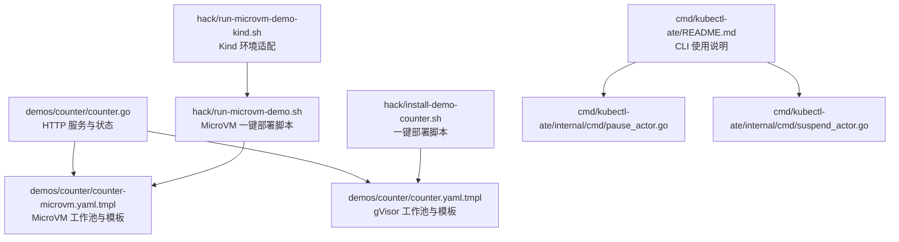
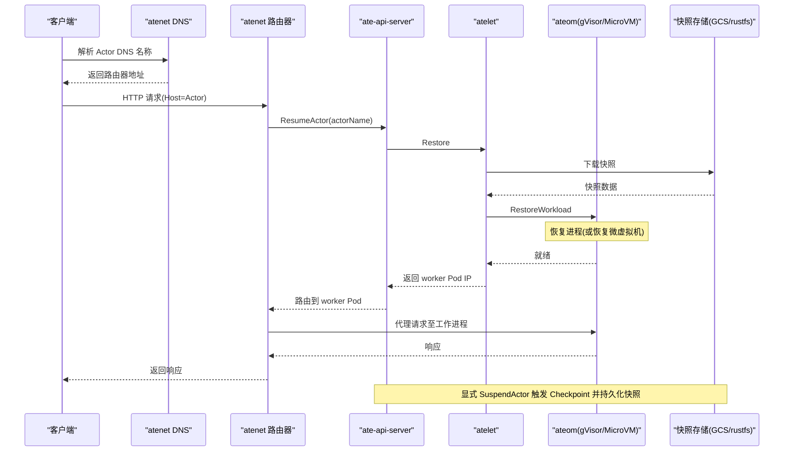
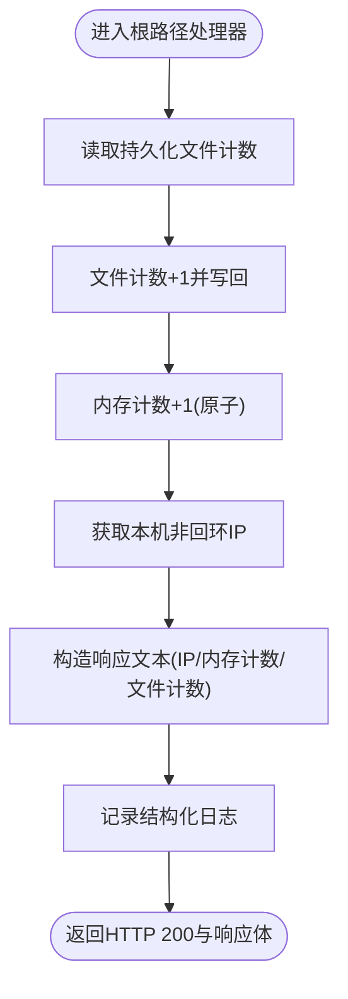
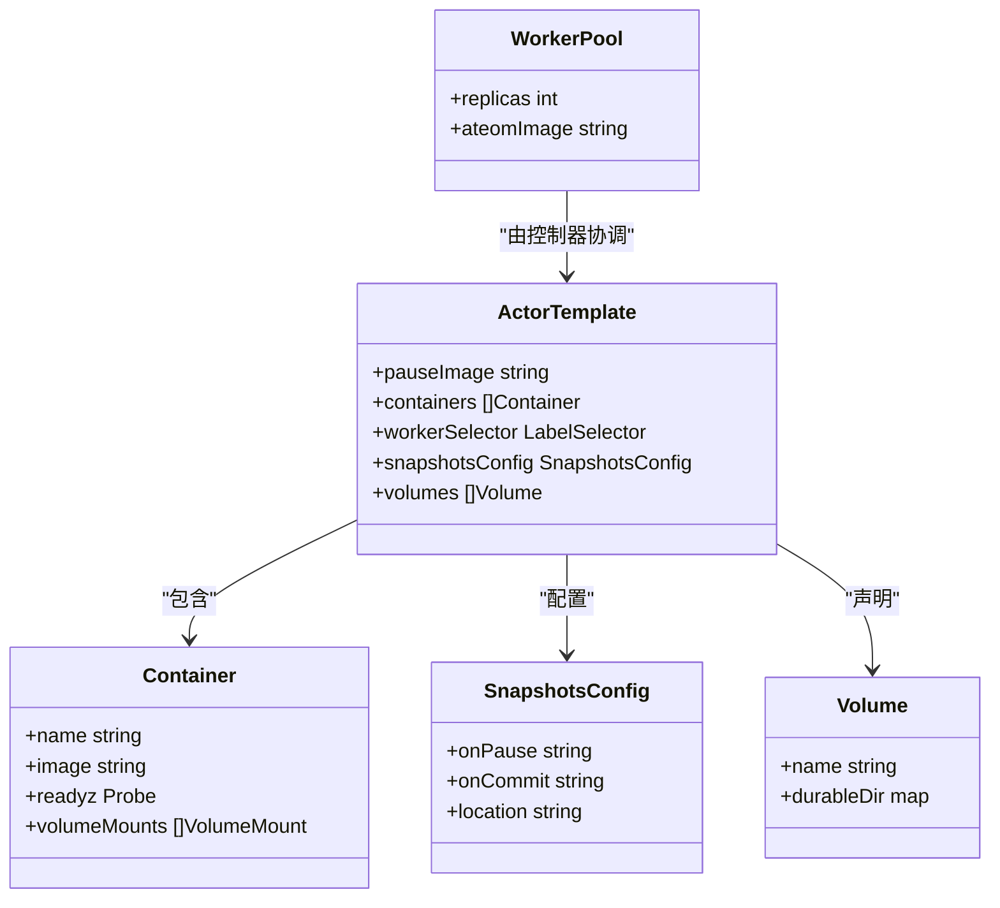
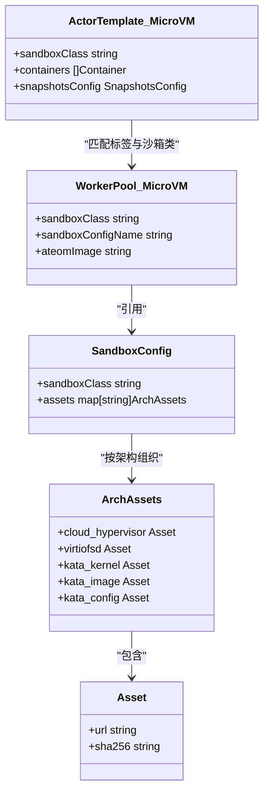
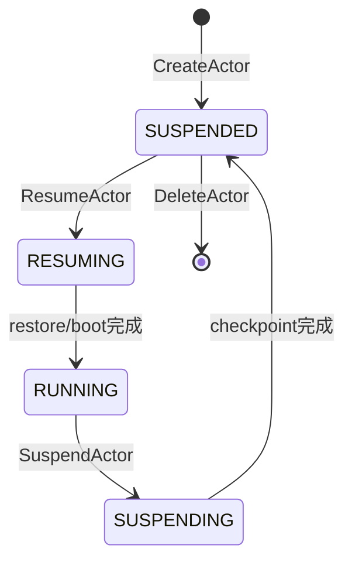
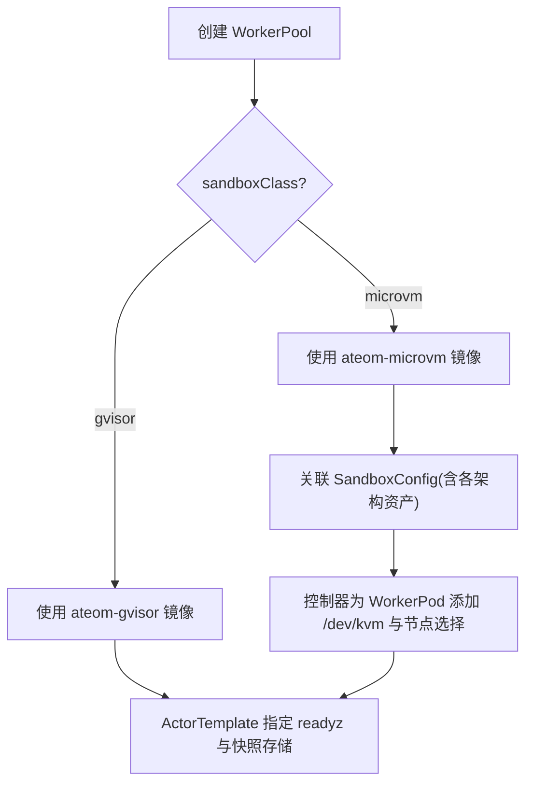
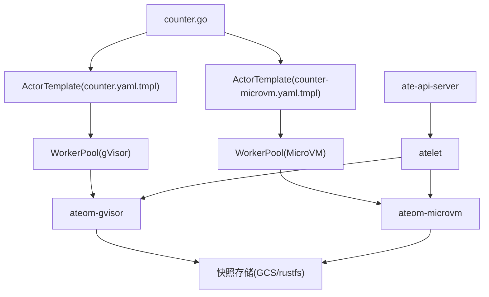

# 计数器示例

<cite>
**本文引用的文件**   
- [demos/counter/README.md](file://demos/counter/README.md)
- [demos/counter/counter.go](file://demos/counter/counter.go)
- [demos/counter/counter.yaml.tmpl](file://demos/counter/counter.yaml.tmpl)
- [demos/counter/counter-microvm.yaml.tmpl](file://demos/counter/counter-microvm.yaml.tmpl)
- [cmd/kubectl-ate/README.md](file://cmd/kubectl-ate/README.md)
- [cmd/kubectl-ate/internal/cmd/pause_actor.go](file://cmd/kubectl-ate/internal/cmd/pause_actor.go)
- [cmd/kubectl-ate/internal/cmd/suspend_actor.go](file://cmd/kubectl-ate/internal/cmd/suspend_actor.go)
- [hack/install-demo-counter.sh](file://hack/install-demo-counter.sh)
- [hack/run-microvm-demo.sh](file://hack/run-microvm-demo.sh)
- [hack/run-microvm-demo-kind.sh](file://hack/run-microvm-demo-kind.sh)
- [docs/architecture.md](file://docs/architecture.md)
- [docs/api-guide.md](file://docs/api-guide.md)
- [cmd/ateapi/internal/controlapi/sandbox_assets.go](file://cmd/ateapi/internal/controlapi/sandbox_assets.go)
</cite>

## 目录
1. [简介](#简介)
2. [项目结构](#项目结构)
3. [核心组件](#核心组件)
4. [架构总览](#架构总览)
5. [详细组件分析](#详细组件分析)
6. [依赖关系分析](#依赖关系分析)
7. [性能与可观测性](#性能与可观测性)
8. [部署与使用指南](#部署与使用指南)
9. [故障排查](#故障排查)
10. [结论](#结论)

## 简介
本示例展示如何在 Agent Substrate 上运行一个有状态的 Go HTTP 计数器应用。该示例通过 gVisor 或 MicroVM（Kata + Cloud Hypervisor）沙箱，演示了 Actor 的暂停、恢复以及跨节点迁移后状态连续性。其关键特性包括：
- 内存计数与持久化文件计数双通道验证
- 基于 Snapshot 的状态持久化与恢复
- WorkerPool 与 ActorTemplate 的配置与选择
- kubectl-ate CLI 的完整生命周期管理

## 项目结构
与计数器示例直接相关的代码与清单位于 demos/counter 目录，配套安装脚本位于 hack 目录，CLI 文档位于 cmd/kubectl-ate。

图表来源
- [demos/counter/counter.go:1-166](file://demos/counter/counter.go#L1-L166)
- [demos/counter/counter.yaml.tmpl:1-62](file://demos/counter/counter.yaml.tmpl#L1-L62)
- [demos/counter/counter-microvm.yaml.tmpl:1-127](file://demos/counter/counter-microvm.yaml.tmpl#L1-L127)
- [hack/install-demo-counter.sh:1-55](file://hack/install-demo-counter.sh#L1-L55)
- [hack/run-microvm-demo.sh:1-181](file://hack/run-microvm-demo.sh#L1-L181)
- [hack/run-microvm-demo-kind.sh:1-48](file://hack/run-microvm-demo-kind.sh#L1-L48)
- [cmd/kubectl-ate/README.md:1-198](file://cmd/kubectl-ate/README.md#L1-L198)
- [cmd/kubectl-ate/internal/cmd/pause_actor.go:1-55](file://cmd/kubectl-ate/internal/cmd/pause_actor.go#L1-L55)
- [cmd/kubectl-ate/internal/cmd/suspend_actor.go:1-55](file://cmd/kubectl-ate/internal/cmd/suspend_actor.go#L1-L55)

章节来源
- [demos/counter/README.md:1-116](file://demos/counter/README.md#L1-L116)

## 核心组件
- 计数器应用（counter.go）
  - 提供 HTTP 服务，监听端口 80，处理根路径请求并返回当前 Pod IP、内存计数与文件计数。
  - 实现 /readyz 就绪探针，用于在初始化完成后对外暴露健康状态。
  - 启动时写入随机文件以验证文件系统快照/恢复能力。
- gVisor 工作池与模板（counter.yaml.tmpl）
  - 定义 WorkerPool 与 ActorTemplate，指定 ateom-gvisor 镜像、容器 readyz 探针、数据卷挂载与快照存储位置。
- MicroVM 工作池与模板（counter-microvm.yaml.tmpl）
  - 定义 SandboxConfig、WorkerPool 与 ActorTemplate，指定 microvm 沙箱类及所需二进制资产（cloud-hypervisor、virtiofsd、kata-kernel、kata-image、kata-config）。
- 安装与运行脚本
  - install-demo-counter.sh：构建镜像、注入环境变量、创建命名空间与工作池/模板、等待就绪。
  - run-microvm-demo.sh：组装微虚拟机资产、上传到对象存储、部署控制面与应用、打印后续步骤。
  - run-microvm-demo-kind.sh：为 Kind 本地集群设置必要的环境变量并调用主脚本。
- CLI 工具（kubectl-ate）
  - 提供 atespace、actor 的创建、查询、暂停、挂起、删除等操作；支持自动端口转发与可选追踪。

章节来源
- [demos/counter/counter.go:1-166](file://demos/counter/counter.go#L1-L166)
- [demos/counter/counter.yaml.tmpl:1-62](file://demos/counter/counter.yaml.tmpl#L1-L62)
- [demos/counter/counter-microvm.yaml.tmpl:1-127](file://demos/counter/counter-microvm.yaml.tmpl#L1-L127)
- [hack/install-demo-counter.sh:1-55](file://hack/install-demo-counter.sh#L1-L55)
- [hack/run-microvm-demo.sh:1-181](file://hack/run-microvm-demo.sh#L1-L181)
- [hack/run-microvm-demo-kind.sh:1-48](file://hack/run-microvm-demo-kind.sh#L1-L48)
- [cmd/kubectl-ate/README.md:1-198](file://cmd/kubectl-ate/README.md#L1-L198)

## 架构总览
下图展示了从客户端发起请求到 Actor 被恢复并在 Worker 上执行的整体流程，以及显式挂起时的快照持久化过程。

图表来源
- [docs/architecture.md:353-464](file://docs/architecture.md#L353-L464)

章节来源
- [docs/architecture.md:353-464](file://docs/architecture.md#L353-L464)

## 详细组件分析

### 计数器应用（counter.go）
- 内存状态管理
  - 使用原子变量维护请求计数，保证并发安全。
  - 每次请求递增内存计数并输出到响应体。
- 文件状态管理
  - 通过互斥锁保护对文件的读写，读取现有值后自增再写回，确保跨进程/跨恢复的一致性。
- 就绪探针
  - /readyz 仅在完成初始化（如写入随机文件）后返回 200，便于系统判定应用就绪。
- 日志与诊断
  - 使用结构化日志记录请求处理结果与随机文件哈希，辅助验证快照一致性。

图表来源
- [demos/counter/counter.go:64-124](file://demos/counter/counter.go#L64-L124)

章节来源
- [demos/counter/counter.go:1-166](file://demos/counter/counter.go#L1-L166)

### gVisor 工作池与模板（counter.yaml.tmpl）
- WorkerPool
  - 指定 replicas 数量与 ateomImage（gVisor 运行时）。
- ActorTemplate
  - pauseImage 指定暂停容器镜像。
  - containers 定义业务容器镜像、就绪探针、数据卷挂载点。
  - snapshotsConfig 配置暂停策略（Full/Data）、快照存储位置（GCS bucket）。
  - volumes 声明持久化目录，映射到容器内路径。

图表来源
- [demos/counter/counter.yaml.tmpl:22-62](file://demos/counter/counter.yaml.tmpl#L22-L62)

章节来源
- [demos/counter/counter.yaml.tmpl:1-62](file://demos/counter/counter.yaml.tmpl#L1-L62)

### MicroVM 工作池与模板（counter-microvm.yaml.tmpl）
- SandboxConfig
  - 按架构声明 cloud-hypervisor、virtiofsd、kata-kernel、kata-image、kata-config 等资产的 URL 与校验和。
- WorkerPool
  - sandboxClass=microvm，sandboxConfigName 引用上述 SandboxConfig，ateomImage 指向 ateom-microvm。
- ActorTemplate
  - sandboxClass 必须与 WorkerPool 一致，否则无法匹配可用 Worker。
  - 同样定义 readyz 探针与快照存储位置。

图表来源
- [demos/counter/counter-microvm.yaml.tmpl:39-127](file://demos/counter/counter-microvm.yaml.tmpl#L39-L127)

章节来源
- [demos/counter/counter-microvm.yaml.tmpl:1-127](file://demos/counter/counter-microvm.yaml.tmpl#L1-L127)

### 快照机制与状态持久化
- 快照类型
  - 内存快照：进程 RAM 的精确状态。
  - 工作卷（磁盘）：容器可写层中的文件。
- 持久化位置
  - 默认使用 GCS（或通过 in-cluster rustfs 在 Kind 中模拟），由 snapshotsConfig.location 指定。
- 生命周期
  - 显式挂起（SuspendActor）触发 checkpoint，将内存与磁盘状态打包并上传到对象存储。
  - 恢复（ResumeActor）从对象存储拉取最新快照，恢复进程或微虚拟机，随后继续提供服务。

图表来源
- [docs/architecture.md:386-396](file://docs/architecture.md#L386-L396)

章节来源
- [docs/architecture.md:429-464](file://docs/architecture.md#L429-L464)

### WorkerPool 与 ActorTemplate 配置差异（gVisor vs MicroVM）
- gVisor
  - WorkerPool 使用 ateom-gvisor 镜像。
  - 无需额外 SandboxConfig（除非自定义）。
- MicroVM
  - WorkerPool 使用 ateom-microvm 镜像，并需关联 SandboxConfig。
  - SandboxConfig 需要为每个架构提供完整的二进制资产集合，且 sha256 校验和必须匹配。
  - 控制器会为 microvm 类 WorkerPod 添加 /dev/kvm 设备与节点亲和/容忍。

图表来源
- [cmd/ateapi/internal/controlapi/sandbox_assets.go:26-63](file://cmd/ateapi/internal/controlapi/sandbox_assets.go#L26-L63)
- [docs/api-guide.md:217-222](file://docs/api-guide.md#L217-L222)

章节来源
- [cmd/ateapi/internal/controlapi/sandbox_assets.go:26-63](file://cmd/ateapi/internal/controlapi/sandbox_assets.go#L26-L63)
- [docs/api-guide.md:217-222](file://docs/api-guide.md#L217-L222)

### kubectl-ate CLI 使用方法与常见操作
- 安装与连接
  - 作为 kubectl 插件安装后，自动发现 ate-api-server 并建立临时端口转发隧道。
  - 可通过 --endpoint 指定直连端点。
- 常用命令
  - 创建 atespace 与 actor
  - 查看 actor/worker 状态
  - 暂停（pause）与挂起（suspend）actor
  - 删除 actor 与 atespace
  - 查看 actor 日志
- 追踪
  - 支持 --trace 开启单次请求追踪，配合 Jaeger 或 OpenTelemetry 可视化。

章节来源
- [cmd/kubectl-ate/README.md:1-198](file://cmd/kubectl-ate/README.md#L1-L198)
- [cmd/kubectl-ate/internal/cmd/pause_actor.go:1-55](file://cmd/kubectl-ate/internal/cmd/pause_actor.go#L1-L55)
- [cmd/kubectl-ate/internal/cmd/suspend_actor.go:1-55](file://cmd/kubectl-ate/internal/cmd/suspend_actor.go#L1-L55)

## 依赖关系分析
- 应用与清单
  - counter.go 提供 HTTP 接口与就绪探针，被 ActorTemplate 的容器镜像引用。
  - counter.yaml.tmpl 与 counter-microvm.yaml.tmpl 分别定义 gVisor 与 MicroVM 的工作池与模板。
- 控制面与运行时
  - ate-api-server 负责编排 Actor 生命周期，调用 atelet 进行恢复/挂起。
  - atelet 负责与 ateom（gVisor/MicroVM）交互，完成进程或微虚拟机的恢复与检查点。
  - 快照存储在对象存储（GCS 或 in-cluster rustfs）。
- 资源选择与匹配
  - WorkerPool 与 ActorTemplate 通过标签选择器与沙箱类进行匹配，确保正确的运行时环境。

图表来源
- [demos/counter/counter.yaml.tmpl:22-62](file://demos/counter/counter.yaml.tmpl#L22-L62)
- [demos/counter/counter-microvm.yaml.tmpl:89-127](file://demos/counter/counter-microvm.yaml.tmpl#L89-L127)
- [docs/architecture.md:353-464](file://docs/architecture.md#L353-L464)

章节来源
- [demos/counter/counter.yaml.tmpl:1-62](file://demos/counter/counter.yaml.tmpl#L1-L62)
- [demos/counter/counter-microvm.yaml.tmpl:1-127](file://demos/counter/counter-microvm.yaml.tmpl#L1-L127)
- [docs/architecture.md:353-464](file://docs/architecture.md#L353-L464)

## 性能与可观测性
- 就绪探针优化
  - /readyz 在初始化完成后立即返回 200，避免冷启动期间的误判。
- 日志与追踪
  - 应用使用结构化日志记录关键信息；CLI 支持 --trace 开启端到端追踪，便于定位延迟与错误。
- 快照大小与频率
  - 根据业务需求调整 onCommit/onPause 策略，平衡恢复速度与存储成本。

[本节为通用指导，不直接分析具体文件]

## 部署与使用指南

### 环境准备
- 已安装 Agent Substrate 的 Kubernetes 集群
- 安装 ko 用于构建镜像
- 准备对象存储桶（GCS 或在 Kind 中使用 in-cluster rustfs）

章节来源
- [demos/counter/README.md:7-11](file://demos/counter/README.md#L7-L11)

### 部署 gVisor 版本
- 使用安装脚本一键部署
  - 构建镜像、注入 BUCKET_NAME、创建命名空间与工作池/模板、等待就绪
- 创建 atespace 与 actor
  - 先创建 atespace，再基于模板创建 actor
- 端口转发与访问
  - 转发 atenet-router 服务端口，使用 curl 发送 POST 请求递增计数器
- 挂起与删除
  - 使用 kubectl-ate suspend/delete 管理 actor 生命周期

章节来源
- [demos/counter/README.md:13-79](file://demos/counter/README.md#L13-L79)
- [hack/install-demo-counter.sh:32-47](file://hack/install-demo-counter.sh#L32-L47)

### 部署 MicroVM 版本
- 准备微虚拟机资产
  - 运行 run-microvm-demo.sh 组装并上传 cloud-hypervisor、virtiofsd、kata 内核与 rootfs 等资产
- 部署控制面与应用
  - 脚本会安装控制面并 apply 带 SandboxConfig 的 demo 清单
- 创建 atespace 与 actor
  - 使用 kubectl-ate 创建 atespace 与基于 microvm 模板的 actor
- 访问与验证
  - 端口转发后发送请求，验证计数器连续性与跨节点迁移后的状态保持

章节来源
- [hack/run-microvm-demo.sh:105-181](file://hack/run-microvm-demo.sh#L105-L181)
- [hack/run-microvm-demo-kind.sh:27-48](file://hack/run-microvm-demo-kind.sh#L27-L48)
- [demos/counter/README.md:81-107](file://demos/counter/README.md#L81-L107)

### 在不同工作节点间迁移 Actor 并验证状态连续性
- 操作流程
  - 多次递增计数器，然后执行挂起（suspend）
  - 再次恢复（resume），观察分配到的 worker 是否变化
  - 继续递增并对比内存计数与文件计数，确认连续性
- 验证要点
  - 内存计数在恢复后应延续上次值
  - 文件计数在恢复后也应延续上次值
  - 若跨节点迁移，Pod IP 可能变化，但计数应保持连续

章节来源
- [demos/counter/README.md:104-107](file://demos/counter/README.md#L104-L107)
- [docs/architecture.md:429-464](file://docs/architecture.md#L429-L464)

## 故障排查
- 常见问题
  - 未创建 atespace 导致创建 actor 失败：需先创建 atespace
  - 沙箱类不匹配：ActorTemplate 的 sandboxClass 必须与 WorkerPool 一致
  - 资产校验失败：确保 SandboxConfig 中各资产 sha256 与实际上传一致
  - 就绪探针未就绪：检查 /readyz 是否返回 200
- 建议操作
  - 使用 kubectl-ate get actors/workers 查看状态与分配情况
  - 使用 kubectl-ate logs actors <actor-name> 查看实时日志
  - 使用 --trace 开启追踪，结合 Jaeger/OpenTelemetry 定位问题

章节来源
- [cmd/kubectl-ate/README.md:120-177](file://cmd/kubectl-ate/README.md#L120-L177)
- [docs/api-guide.md:217-222](file://docs/api-guide.md#L217-L222)

## 结论
计数器示例清晰展示了 Agent Substrate 在有状态工作负载上的能力：通过 Snapshot 机制实现内存与文件状态的一致持久化与恢复，借助 WorkerPool 与 ActorTemplate 灵活调度到不同沙箱环境（gVisor/MicroVM），并通过 kubectl-ate 提供直观的生命周期管理。该示例可作为在生产环境中构建高可用、可迁移、可观测的有状态服务的参考实践。
