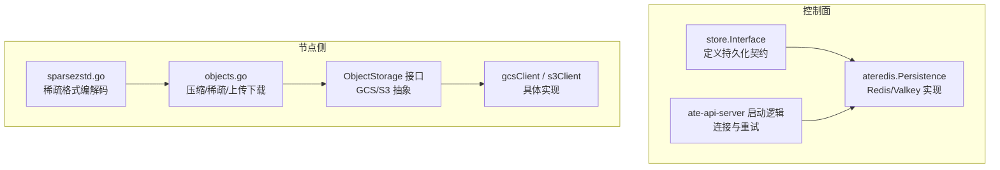
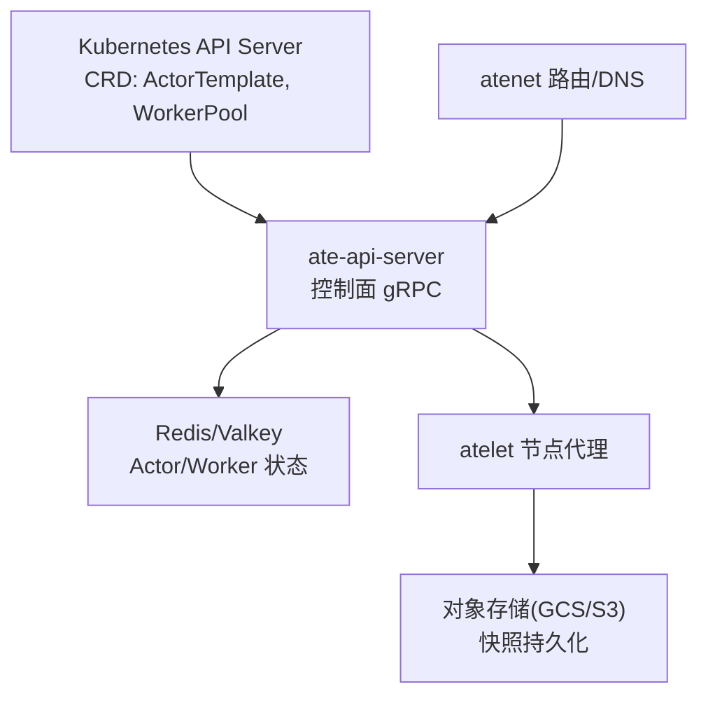
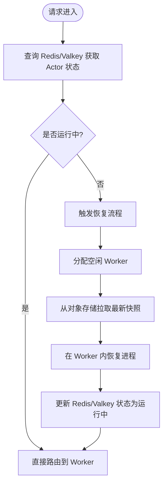
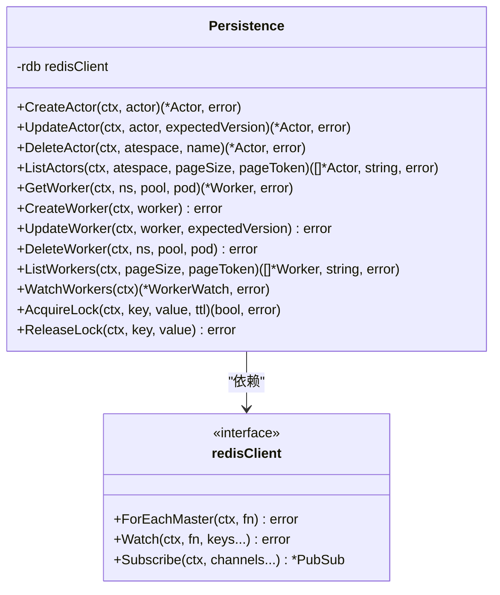
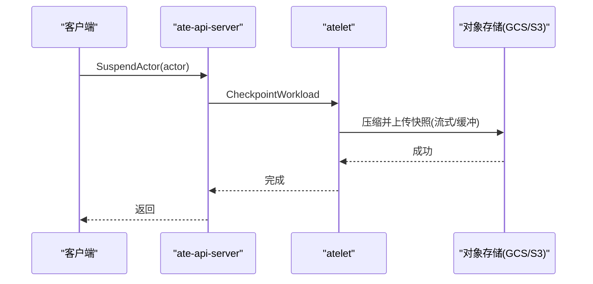
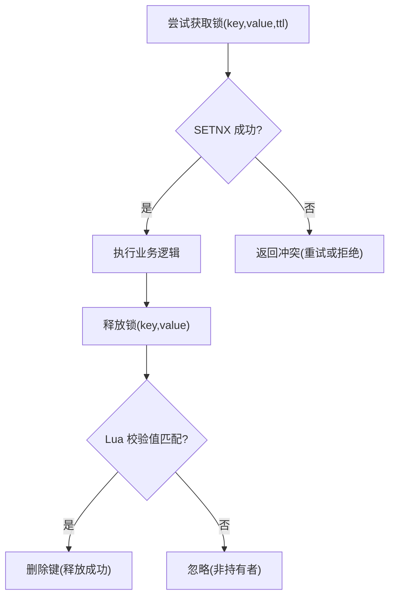
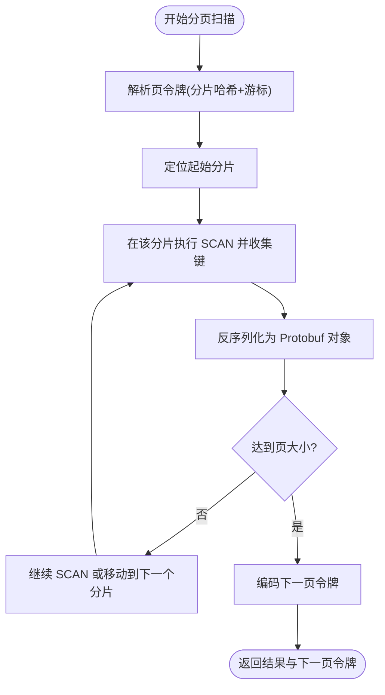
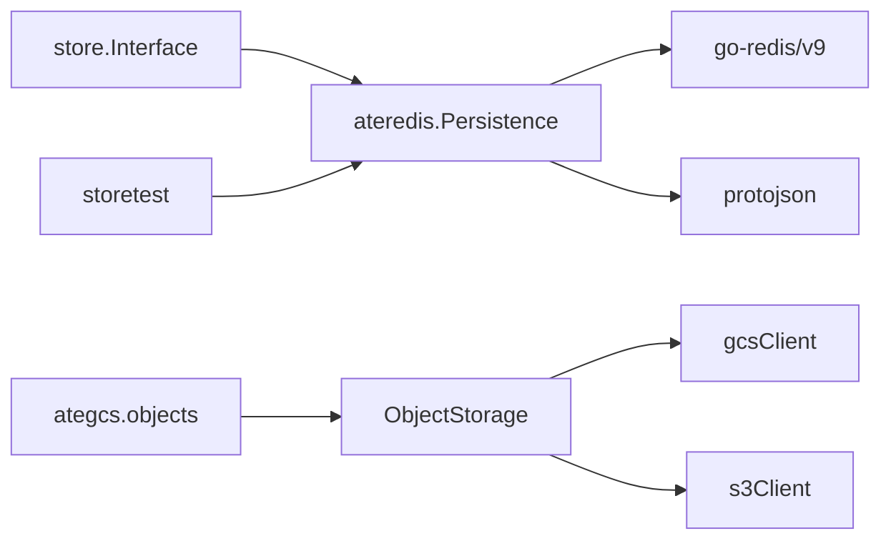

# 存储架构设计

<cite>
**本文引用的文件**   
- [cmd/ateapi/internal/store/store.go](file://cmd/ateapi/internal/store/store.go)
- [cmd/ateapi/internal/store/ateredis/ateredis.go](file://cmd/ateapi/internal/store/ateredis/ateredis.go)
- [cmd/ateapi/main.go](file://cmd/ateapi/main.go)
- [cmd/ateapi/internal/store/storetest/storetest.go](file://cmd/ateapi/internal/store/storetest/storetest.go)
- [cmd/atelet/internal/ategcs/objects.go](file://cmd/atelet/internal/ategcs/objects.go)
- [cmd/atelet/internal/ategcs/gcs.go](file://cmd/atelet/internal/ategcs/gcs.go)
- [cmd/atelet/internal/ategcs/s3.go](file://cmd/atelet/internal/ategcs/s3.go)
- [cmd/atelet/internal/ategcs/sparsezstd.go](file://cmd/atelet/internal/ategcs/sparsezstd.go)
- [docs/architecture.md](file://docs/architecture.md)
</cite>

## 目录
1. [引言](#引言)
2. [项目结构](#项目结构)
3. [核心组件](#核心组件)
4. [架构总览](#架构总览)
5. [详细组件分析](#详细组件分析)
6. [依赖关系分析](#依赖关系分析)
7. [性能考量](#性能考量)
8. [故障排查指南](#故障排查指南)
9. [结论](#结论)
10. [附录](#附录)

## 引言
本文件面向“Agent Substrate”的存储子系统，系统性阐述双层存储模型的设计理念与实现：将声明式配置（CRD）与高频动态实例状态分离；以 Redis/Valkey 作为高性能状态存储承载 Actor/Worker 等运行时元数据；以对象存储（GCS/S3）承载快照持久化，支持压缩、稀疏传输与版本管理。同时给出一致性保障机制（分布式锁、乐观并发）、扩展性设计与迁移策略，并配以架构图与数据流图帮助理解系统工作原理。

## 项目结构
存储相关代码主要分布在以下模块：
- 控制面存储接口与 Redis 实现：位于 cmd/ateapi/internal/store 及其 ateredis 子包
- 节点侧对象存储客户端与快照编解码：位于 cmd/atelet/internal/ategcs
- 架构文档与资源模型说明：docs/architecture.md

图表来源
- [cmd/ateapi/internal/store/store.go:40-118](file://cmd/ateapi/internal/store/store.go#L40-L118)
- [cmd/ateapi/internal/store/ateredis/ateredis.go:76-88](file://cmd/ateapi/internal/store/ateredis/ateredis.go#L76-L88)
- [cmd/ateapi/main.go:316-331](file://cmd/ateapi/main.go#L316-L331)
- [cmd/atelet/internal/ategcs/objects.go:37-40](file://cmd/atelet/internal/ategcs/objects.go#L37-L40)
- [cmd/atelet/internal/ategcs/gcs.go:27-33](file://cmd/atelet/internal/ategcs/gcs.go#L27-L33)
- [cmd/atelet/internal/ategcs/s3.go:29-35](file://cmd/atelet/internal/ategcs/s3.go#L29-L35)
- [cmd/atelet/internal/ategcs/sparsezstd.go:29-46](file://cmd/atelet/internal/ategcs/sparsezstd.go#L29-L46)

章节来源
- [docs/architecture.md:215-247](file://docs/architecture.md#L215-L247)
- [cmd/ateapi/internal/store/store.go:40-118](file://cmd/ateapi/internal/store/store.go#L40-L118)
- [cmd/ateapi/internal/store/ateredis/ateredis.go:76-88](file://cmd/ateapi/internal/store/ateredis/ateredis.go#L76-L88)
- [cmd/ateapi/main.go:316-331](file://cmd/ateapi/main.go#L316-L331)
- [cmd/atelet/internal/ategcs/objects.go:37-40](file://cmd/atelet/internal/ategcs/objects.go#L37-L40)
- [cmd/atelet/internal/ategcs/gcs.go:27-33](file://cmd/atelet/internal/ategcs/gcs.go#L27-L33)
- [cmd/atelet/internal/ategcs/s3.go:29-35](file://cmd/atelet/internal/ategcs/s3.go#L29-L35)
- [cmd/atelet/internal/ategcs/sparsezstd.go:29-46](file://cmd/atelet/internal/ategcs/sparsezstd.go#L29-L46)

## 核心组件
- 存储接口层：定义 Actor/Atespace/Worker 的 CRUD、分页扫描、Watch 与分布式锁能力，屏蔽底层差异。
- Redis/Valkey 实现：基于键空间模式与 Lua/事务实现原子更新、乐观并发与事件推送。
- 对象存储抽象：统一 GCS/S3 的 Get/Put 语义，上层按后端特性选择流式或缓冲上传路径。
- 快照编解码：支持普通 zstd 与稀疏-extent 格式，针对内存镜像零填充区域进行高效压缩与写入。

章节来源
- [cmd/ateapi/internal/store/store.go:40-118](file://cmd/ateapi/internal/store/store.go#L40-L118)
- [cmd/ateapi/internal/store/ateredis/ateredis.go:76-88](file://cmd/ateapi/internal/store/ateredis/ateredis.go#L76-L88)
- [cmd/atelet/internal/ategcs/objects.go:37-40](file://cmd/atelet/internal/ategcs/objects.go#L37-L40)
- [cmd/atelet/internal/ategcs/sparsezstd.go:29-46](file://cmd/atelet/internal/ategcs/sparsezstd.go#L29-L46)

## 架构总览
Agent Substrate 采用“双层存储模型”：
- 声明式配置层：通过 Kubernetes CRD（ActorTemplate、WorkerPool）表达期望态，由控制器协调实际集群资源。
- 动态实例层：Actor/Worker 的高频状态存储在 Redis/Valkey，提供低延迟读写、原子更新与事件订阅。
- 快照持久化层：使用对象存储（GCS/S3）保存进程内存+工作卷的快照，支持压缩与稀疏传输。

图表来源
- [docs/architecture.md:215-247](file://docs/architecture.md#L215-L247)
- [cmd/ateapi/internal/store/store.go:40-118](file://cmd/ateapi/internal/store/store.go#L40-L118)
- [cmd/ateapi/internal/store/ateredis/ateredis.go:76-88](file://cmd/ateapi/internal/store/ateredis/ateredis.go#L76-L88)
- [cmd/atelet/internal/ategcs/objects.go:37-40](file://cmd/atelet/internal/ategcs/objects.go#L37-L40)

## 详细组件分析

### 双层存储模型与数据分层
- 声明式配置（CRD）：用于环境定义与编排，变更频率低，适合由 Kubernetes 治理。
- 动态实例状态（Redis/Valkey）：Actor/Worker 的活跃状态、位置映射、版本与时间戳，要求高吞吐与低延迟。
- 快照持久化（对象存储）：进程内存与工作卷的完整或增量快照，强调压缩、稀疏与跨节点可移植性。

图表来源
- [docs/architecture.md:353-396](file://docs/architecture.md#L353-L396)
- [cmd/ateapi/internal/store/store.go:40-118](file://cmd/ateapi/internal/store/store.go#L40-L118)
- [cmd/atelet/internal/ategcs/objects.go:37-40](file://cmd/atelet/internal/ategcs/objects.go#L37-L40)

章节来源
- [docs/architecture.md:215-247](file://docs/architecture.md#L215-L247)
- [docs/architecture.md:353-396](file://docs/architecture.md#L353-L396)

### Redis/Valkey 高性能状态存储实现
- 键空间设计
  - Actor 键：actor:<atespace>:<name>
  - Worker 键：worker:<namespace>:<pool-name>:<pod-name>
  - Atespace 键：atespace:<name>
- 数据结构与序列化
  - 使用 protojson 对 Protobuf 消息进行 JSON 序列化存储，便于调试与脚本操作。
- 索引与分页
  - 使用 SCAN 模式 actor:* 或 atespace 限定范围，结合游标 token 实现跨分片分页。
- 乐观并发与事务
  - 使用 Watch + TxPipelined 实现版本号校验与原子更新，冲突返回重试错误。
- 事件订阅
  - 通过 Pub/Sub 通道 worker-changes 广播 Worker 创建/更新/删除事件，调用方可订阅并处理。
- 分布式锁
  - AcquireLock 使用 SETNX + TTL；ReleaseLock 使用 Lua 脚本确保仅持有者释放。

图表来源
- [cmd/ateapi/internal/store/ateredis/ateredis.go:69-88](file://cmd/ateapi/internal/store/ateredis/ateredis.go#L69-L88)
- [cmd/ateapi/internal/store/ateredis/ateredis.go:90-106](file://cmd/ateapi/internal/store/ateredis/ateredis.go#L90-L106)
- [cmd/ateapi/internal/store/ateredis/ateredis.go:210-238](file://cmd/ateapi/internal/store/ateredis/ateredis.go#L210-L238)
- [cmd/ateapi/internal/store/ateredis/ateredis.go:255-297](file://cmd/ateapi/internal/store/ateredis/ateredis.go#L255-L297)
- [cmd/ateapi/internal/store/ateredis/ateredis.go:770-792](file://cmd/ateapi/internal/store/ateredis/ateredis.go#L770-L792)

章节来源
- [cmd/ateapi/internal/store/ateredis/ateredis.go:90-106](file://cmd/ateapi/internal/store/ateredis/ateredis.go#L90-L106)
- [cmd/ateapi/internal/store/ateredis/ateredis.go:210-238](file://cmd/ateapi/internal/store/ateredis/ateredis.go#L210-L238)
- [cmd/ateapi/internal/store/ateredis/ateredis.go:255-297](file://cmd/ateapi/internal/store/ateredis/ateredis.go#L255-L297)
- [cmd/ateapi/internal/store/ateredis/ateredis.go:770-792](file://cmd/ateapi/internal/store/ateredis/ateredis.go#L770-L792)

### 对象存储（GCS/S3）与快照持久化
- 统一接口 ObjectStorage：GetObject/PutObject 抽象不同后端。
- 上传策略
  - 流式后端（GCS）：直接将压缩流管道化上传，避免临时文件。
  - 非流式后端（S3/rustfs）：先压缩到可寻址临时文件，再上传以满足签名与 Content-Length 需求。
- 压缩与稀疏
  - 普通 zstd：适用于任意 Reader。
  - 稀疏-extent 格式：仅压缩非空洞区域，降低网络与磁盘 I/O，提升大镜像效率。
- 下载与还原
  - 自动识别格式头，稀疏路径下只写非零块，生成稀疏文件，精确截断逻辑大小。

图表来源
- [cmd/atelet/internal/ategcs/objects.go:156-181](file://cmd/atelet/internal/ategcs/objects.go#L156-L181)
- [cmd/atelet/internal/ategcs/objects.go:183-212](file://cmd/atelet/internal/ategcs/objects.go#L183-L212)
- [cmd/atelet/internal/ategcs/objects.go:214-251](file://cmd/atelet/internal/ategcs/objects.go#L214-L251)
- [cmd/atelet/internal/ategcs/sparsezstd.go:47-135](file://cmd/atelet/internal/ategcs/sparsezstd.go#L47-L135)
- [cmd/atelet/internal/ategcs/sparsezstd.go:137-196](file://cmd/atelet/internal/ategcs/sparsezstd.go#L137-L196)

章节来源
- [cmd/atelet/internal/ategcs/objects.go:37-40](file://cmd/atelet/internal/ategcs/objects.go#L37-L40)
- [cmd/atelet/internal/ategcs/objects.go:156-181](file://cmd/atelet/internal/ategcs/objects.go#L156-L181)
- [cmd/atelet/internal/ategcs/objects.go:183-212](file://cmd/atelet/internal/ategcs/objects.go#L183-L212)
- [cmd/atelet/internal/ategcs/objects.go:214-251](file://cmd/atelet/internal/ategcs/objects.go#L214-L251)
- [cmd/atelet/internal/ategcs/gcs.go:27-33](file://cmd/atelet/internal/ategcs/gcs.go#L27-L33)
- [cmd/atelet/internal/ategcs/s3.go:29-35](file://cmd/atelet/internal/ategcs/s3.go#L29-L35)
- [cmd/atelet/internal/ategcs/sparsezstd.go:29-46](file://cmd/atelet/internal/ategcs/sparsezstd.go#L29-L46)
- [cmd/atelet/internal/ategcs/sparsezstd.go:47-135](file://cmd/atelet/internal/ategcs/sparsezstd.go#L47-L135)
- [cmd/atelet/internal/ategcs/sparsezstd.go:137-196](file://cmd/atelet/internal/ategcs/sparsezstd.go#L137-L196)

### 数据一致性保证机制
- 分布式锁
  - 获取：SETNX + TTL，失败表示冲突。
  - 释放：Lua 脚本比较值后删除，防止误释放。
- 乐观并发
  - 更新前读取当前版本，匹配则递增版本并原子写入；不匹配返回重试错误。
- 事务与幂等
  - 使用 Watch + TxPipelined 保证读-改-写的原子性；删除操作检查前置条件（如仅允许 SUSPENDED/CRASHED）。
- 事件驱动
  - Worker 变更通过 Pub/Sub 广播，消费者需具备重连与去重能力。

图表来源
- [cmd/ateapi/internal/store/ateredis/ateredis.go:770-792](file://cmd/ateapi/internal/store/ateredis/ateredis.go#L770-L792)
- [cmd/ateapi/internal/store/ateredis/ateredis.go:408-466](file://cmd/ateapi/internal/store/ateredis/ateredis.go#L408-L466)
- [cmd/ateapi/internal/store/ateredis/ateredis.go:523-584](file://cmd/ateapi/internal/store/ateredis/ateredis.go#L523-L584)
- [cmd/ateapi/internal/store/ateredis/ateredis.go:481-521](file://cmd/ateapi/internal/store/ateredis/ateredis.go#L481-L521)

章节来源
- [cmd/ateapi/internal/store/ateredis/ateredis.go:770-792](file://cmd/ateapi/internal/store/ateredis/ateredis.go#L770-L792)
- [cmd/ateapi/internal/store/ateredis/ateredis.go:408-466](file://cmd/ateapi/internal/store/ateredis/ateredis.go#L408-L466)
- [cmd/ateapi/internal/store/ateredis/ateredis.go:523-584](file://cmd/ateapi/internal/store/ateredis/ateredis.go#L523-L584)
- [cmd/ateapi/internal/store/ateredis/ateredis.go:481-521](file://cmd/ateapi/internal/store/ateredis/ateredis.go#L481-L521)

### 存储扩展性与数据迁移策略
- 横向扩展
  - Redis 集群模式下，SCAN 遍历所有 Master 并按地址哈希排序，结合页令牌实现跨分片分页。
  - ForEachMaster 并行访问各主节点，提升扫描吞吐。
- 拓扑变化容错
  - 当页令牌中的分片地址哈希不存在时，主动中止以避免不一致。
- 数据迁移
  - 键空间命名约定清晰，迁移时可按模式批量迁移（例如 actor:*、worker:*、atespace:*）。
  - 建议在迁移前后进行一致性校验与回滚预案。

图表来源
- [cmd/ateapi/internal/store/ateredis/ateredis.go:630-702](file://cmd/ateapi/internal/store/ateredis/ateredis.go#L630-L702)
- [cmd/ateapi/internal/store/ateredis/ateredis.go:704-734](file://cmd/ateapi/internal/store/ateredis/ateredis.go#L704-L734)

章节来源
- [cmd/ateapi/internal/store/ateredis/ateredis.go:630-702](file://cmd/ateapi/internal/store/ateredis/ateredis.go#L630-L702)
- [cmd/ateapi/internal/store/ateredis/ateredis.go:704-734](file://cmd/ateapi/internal/store/ateredis/ateredis.go#L704-L734)

### 灾难恢复方案
- 服务可用性
  - 启动时对 Redis/Valkey 进行带退避的重试 Ping，确保依赖就绪。
- 数据备份
  - 快照已持久化至对象存储，可按版本恢复；建议配合对象存储生命周期策略进行保留与归档。
- 故障恢复
  - 若 Redis 不可用，控制面应降级或告警；节点侧在恢复后可重新订阅事件并重建本地缓存。

章节来源
- [cmd/ateapi/main.go:316-331](file://cmd/ateapi/main.go#L316-L331)
- [cmd/ateapi/internal/store/ateredis/ateredis.go:255-297](file://cmd/ateapi/internal/store/ateredis/ateredis.go#L255-L297)

## 依赖关系分析
- 控制面依赖
  - store.Interface 被 ate-api-server 使用，具体实现为 ateredis.Persistence。
  - ateredis 依赖 go-redis/v9 的 ClusterClient 与 PubSub。
- 节点侧依赖
  - ategcs.ObjectStorage 抽象 GCS/S3 客户端，objects.go 负责压缩与稀疏编解码。
- 测试依赖
  - 使用 miniredis 模拟 Redis，验证 ateredis 行为。

图表来源
- [cmd/ateapi/internal/store/store.go:40-118](file://cmd/ateapi/internal/store/store.go#L40-L118)
- [cmd/ateapi/internal/store/ateredis/ateredis.go:76-88](file://cmd/ateapi/internal/store/ateredis/ateredis.go#L76-L88)
- [cmd/ateapi/internal/store/storetest/storetest.go:26-47](file://cmd/ateapi/internal/store/storetest/storetest.go#L26-L47)
- [cmd/atelet/internal/ategcs/objects.go:37-40](file://cmd/atelet/internal/ategcs/objects.go#L37-L40)
- [cmd/atelet/internal/ategcs/gcs.go:27-33](file://cmd/atelet/internal/ategcs/gcs.go#L27-L33)
- [cmd/atelet/internal/ategcs/s3.go:29-35](file://cmd/atelet/internal/ategcs/s3.go#L29-L35)

章节来源
- [cmd/ateapi/internal/store/store.go:40-118](file://cmd/ateapi/internal/store/store.go#L40-L118)
- [cmd/ateapi/internal/store/ateredis/ateredis.go:76-88](file://cmd/ateapi/internal/store/ateredis/ateredis.go#L76-L88)
- [cmd/ateapi/internal/store/storetest/storetest.go:26-47](file://cmd/ateapi/internal/store/storetest/storetest.go#L26-L47)
- [cmd/atelet/internal/ategcs/objects.go:37-40](file://cmd/atelet/internal/ategcs/objects.go#L37-L40)
- [cmd/atelet/internal/ategcs/gcs.go:27-33](file://cmd/atelet/internal/ategcs/gcs.go#L27-L33)
- [cmd/atelet/internal/ategcs/s3.go:29-35](file://cmd/atelet/internal/ategcs/s3.go#L29-L35)

## 性能考量
- 压缩与稀疏
  - 使用 SpeedFastest 级别与多核并发，最大化压缩速度；稀疏-extent 仅压缩非零块，显著减少网络与磁盘 I/O。
- 上传路径优化
  - GCS 走流式上传，避免中间文件；S3 走缓冲上传，满足 SDK 签名与长度需求。
- 扫描与分页
  - 跨分片有序合并，限制每页大小，避免长尾与内存膨胀。
- 事件与缓存
  - Worker 变更通过 Pub/Sub 推送，消费端可维护本地缓存以降低查询压力。

[本节为通用指导，无需特定文件引用]

## 故障排查指南
- Redis/Valkey 连接问题
  - 启动阶段会多次重试 Ping，关注重试日志与最终错误。
- 锁冲突与释放失败
  - 确认 AcquireLock 返回值与 ReleaseLock 的 Lua 校验；记录 key/value 以便审计。
- 分页异常
  - 检查页令牌是否过期或集群拓扑变化导致分片缺失。
- 快照上传/下载失败
  - 区分流式与缓冲路径的错误来源；核对对象存储权限与网络连通性。

章节来源
- [cmd/ateapi/main.go:316-331](file://cmd/ateapi/main.go#L316-L331)
- [cmd/ateapi/internal/store/ateredis/ateredis.go:770-792](file://cmd/ateapi/internal/store/ateredis/ateredis.go#L770-L792)
- [cmd/ateapi/internal/store/ateredis/ateredis.go:630-702](file://cmd/ateapi/internal/store/ateredis/ateredis.go#L630-L702)
- [cmd/atelet/internal/ategcs/objects.go:156-181](file://cmd/atelet/internal/ategcs/objects.go#L156-L181)

## 结论
本存储架构通过双层模型将声明式配置与高频状态解耦，利用 Redis/Valkey 的低延迟与原子能力支撑实时调度与路由，借助对象存储的弹性与压缩能力实现快照持久化与跨节点迁移。结合分布式锁、乐观并发与事件订阅，系统在可扩展性与一致性之间取得平衡。未来可在增量快照、共享缓存与更细粒度的生命周期管理上持续演进。

[本节为总结性内容，无需特定文件引用]

## 附录
- 术语
  - Actor：具体的工作负载实例
  - Worker：承载 Actor 的物理 Pod
  - Snapshot：进程内存与工作卷的快照
- 参考
  - 架构与资源模型详见 docs/architecture.md

[本节为补充信息，无需特定文件引用]
