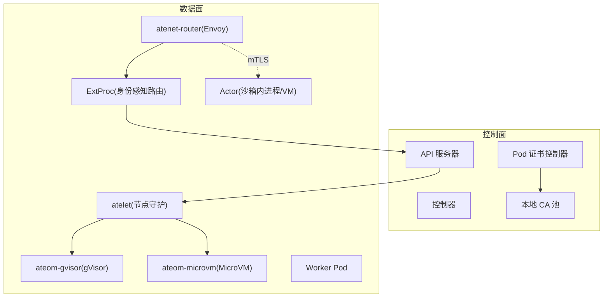
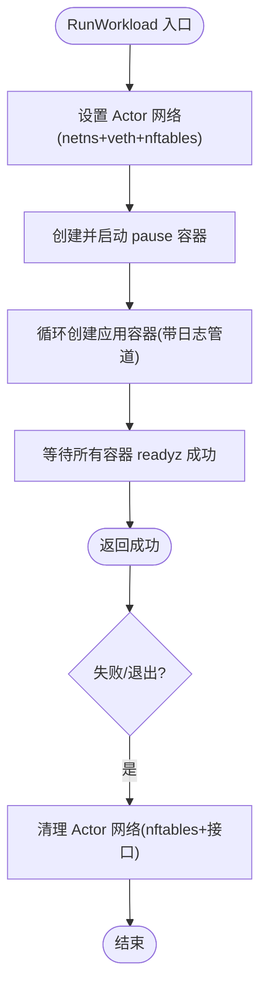
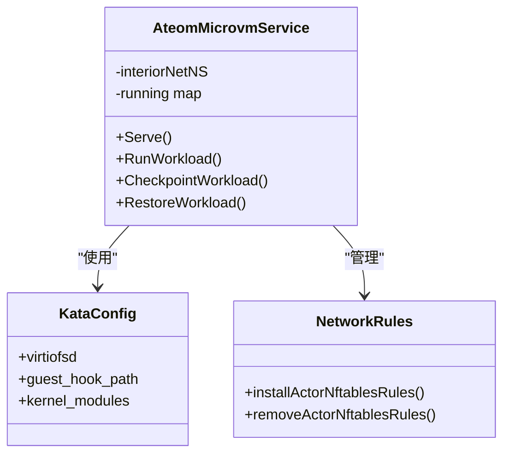
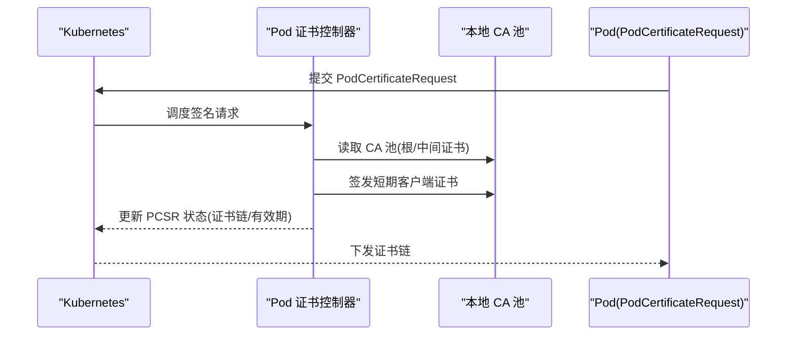
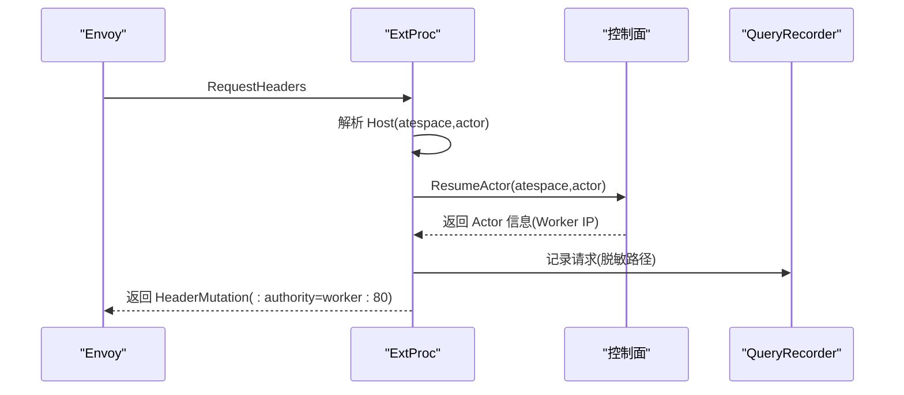
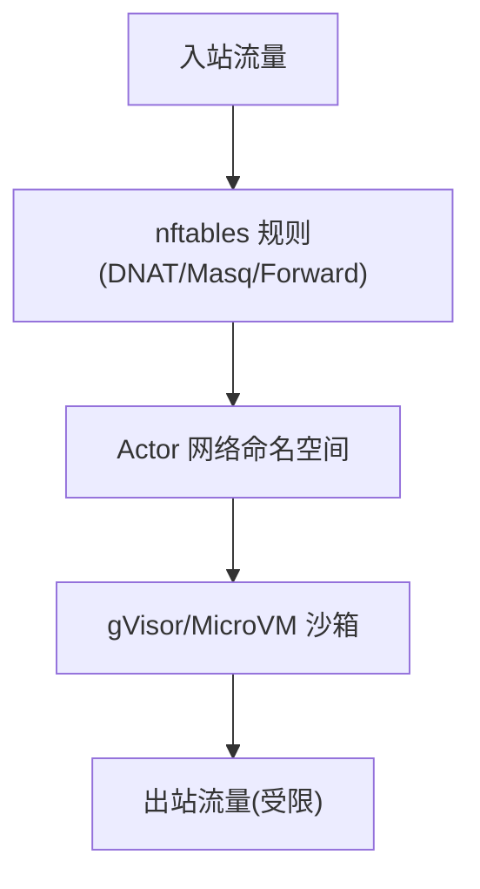
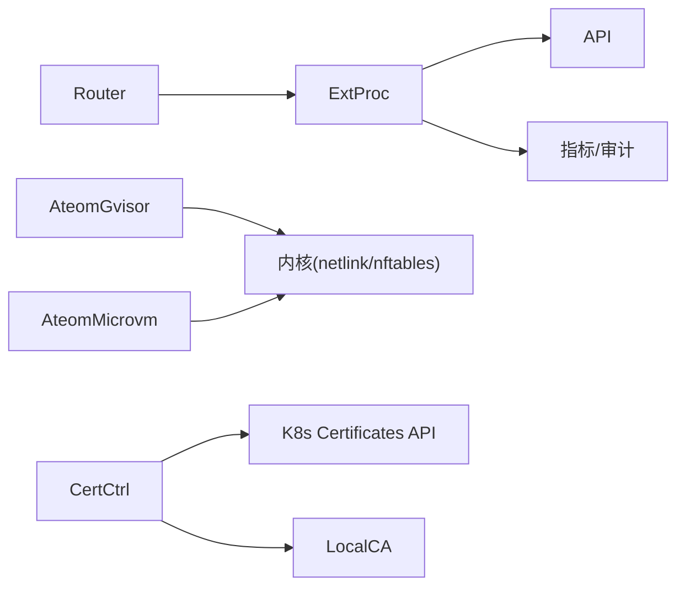

# 安全隔离机制

<cite>
**本文引用的文件**   
- [README.md](file://README.md)
- [threat-model.md](file://docs/threat-model.md)
- [architecture.md](file://docs/architecture.md)
- [ateom-gvisor/main.go](file://cmd/ateom-gvisor/main.go)
- [ateom-microvm/main.go](file://cmd/ateom-microvm/main.go)
- [ateom-microvm/spec.go](file://cmd/ateom-microvm/spec.go)
- [ateom-microvm/net.go](file://cmd/ateom-microvm/net.go)
- [podcertcontroller/main.go](file://cmd/podcertcontroller/main.go)
- [podidentitysigner/podidentitysigner.go](file://cmd/podcertcontroller/internal/podidentitysigner/podidentitysigner.go)
- [localca/localca.go](file://internal/localca/localca.go)
- [extproc.go](file://cmd/atenet/internal/router/extproc.go)
- [xds.go](file://cmd/atenet/internal/router/xds.go)
- [status.go](file://cmd/atenet/internal/router/status.go)
- [server.go](file://internal/ateapiauth/server.go)
- [sandboxconfig_validation_test.go](file://pkg/api/v1alpha1/sandboxconfig_validation_test.go)
</cite>

## 目录
1. [引言](#引言)
2. [项目结构](#项目结构)
3. [核心组件](#核心组件)
4. [架构总览](#架构总览)
5. [详细组件分析](#详细组件分析)
6. [依赖关系分析](#依赖关系分析)
7. [性能与安全权衡](#性能与安全权衡)
8. [故障排查指南](#故障排查指南)
9. [结论](#结论)
10. [附录：威胁模型与防护要点](#附录威胁模型与防护要点)

## 引言
本文件聚焦于 Agent Substrate 的安全隔离机制，系统性阐述多层安全防护体系的设计与实现，包括沙箱执行环境、身份认证、授权控制与网络安全策略。重点说明 gVisor 与 MicroVM（kata + cloud-hypervisor）提供的内核级隔离能力，以及基于证书的身份管理（Pod 证书控制器、本地 CA、短期证书）、请求级授权（身份感知路由与细粒度权限）、mTLS 通信加密与安全审计日志。文末提供安全架构图与威胁模型分析，帮助读者理解系统如何以“纵深防御”原则保障 Actor 的机密性、完整性与可用性。

## 项目结构
从安全视角看，关键代码分布在以下模块：
- 沙箱运行时：gVisor 路径与 MicroVM 路径分别实现 Ateom 服务，负责进程/虚拟机生命周期、网络命名空间与 nftables 规则、快照/恢复等。
- 身份与证书：Pod 证书控制器与本地 CA 提供短期证书签发与信任分发。
- 网关与路由：Envoy xDS 配置与外部处理扩展（ext_proc）实现身份感知路由与动态转发。
- API 鉴权：gRPC 服务端拦截器支持 mTLS/JWT 模式。
- 威胁模型与架构文档：定义总体安全目标、风险与缓解措施。



图表来源
- [extproc.go:130-188](file://cmd/atenet/internal/router/extproc.go#L130-L188)
- [xds.go:386-466](file://cmd/atenet/internal/router/xds.go#L386-L466)
- [ateom-gvisor/main.go:180-237](file://cmd/ateom-gvisor/main.go#L180-L237)
- [ateom-microvm/main.go:184-226](file://cmd/ateom-microvm/main.go#L184-L226)
- [podcertcontroller/main.go:137-157](file://cmd/podcertcontroller/main.go#L137-L157)
- [localca/localca.go:30-51](file://internal/localca/localca.go#L30-L51)

章节来源
- [README.md:215-225](file://README.md#L215-L225)
- [architecture.md:466-494](file://docs/architecture.md#L466-L494)

## 核心组件
- 沙箱运行时（Ateom）
  - gVisor 实现：在 Worker Pod 内部创建独立网络命名空间，建立 veth 对，安装 nftables 规则，驱动 runsc 创建/启动/检查点/恢复容器，等待就绪探针后暴露给上层路由。
  - MicroVM 实现：通过 kata + cloud-hypervisor 启动微虚拟机，维护 per-activation 的网络命名空间与设备白名单，支持完整状态快照/恢复。
- 身份与证书
  - Pod 证书控制器：监听 PodCertificateRequest，使用本地 CA 池签发短期客户端证书，并维护 ClusterTrustBundle 供集群内验证。
  - 本地 CA：可序列化的 CA 池，包含根证书、中间证书与私钥，支持 ED25519 生成与持久化。
- 网关与路由
  - Envoy xDS：动态下发 Listener/Route/Cluster 配置，集成 ext_proc 过滤器进行请求头处理与动态转发。
  - ExtProc：解析 Host 中的 Actor 引用，调用控制面恢复 Actor，重写 :authority 将流量转发至当前 Worker IP。
- API 鉴权
  - gRPC 服务端拦截器：支持 mTLS 与 JWT 两种模式；JWT 模式下要求 Bearer Token 并通过校验函数验证。

章节来源
- [ateom-gvisor/main.go:180-237](file://cmd/ateom-gvisor/main.go#L180-L237)
- [ateom-microvm/main.go:184-226](file://cmd/ateom-microvm/main.go#L184-L226)
- [podcertcontroller/main.go:137-157](file://cmd/podcertcontroller/main.go#L137-L157)
- [podidentitysigner/podidentitysigner.go:92-175](file://cmd/podcertcontroller/internal/podidentitysigner/podidentitysigner.go#L92-L175)
- [localca/localca.go:30-51](file://internal/localca/localca.go#L30-L51)
- [extproc.go:130-188](file://cmd/atenet/internal/router/extproc.go#L130-L188)
- [xds.go:386-466](file://cmd/atenet/internal/router/xds.go#L386-L466)
- [server.go:35-129](file://internal/ateapiauth/server.go#L35-L129)

## 架构总览
下图展示端到端的安全链路：客户端经 Envoy 进入，ExtProc 解析身份并触发恢复，随后通过 mTLS 或受控网络策略访问 Worker 上的沙箱（gVisor/MicroVM）。控制面通过 Pod 证书控制器与本地 CA 为组件与 Actor 颁发短期证书，确保最小暴露面与快速轮换。

```mermaid
sequenceDiagram
participant Client as "客户端"
participant Envoy as "Envoy(atenet-router)"
participant ExtProc as "ExtProc(身份感知路由)"
participant API as "控制面 API"
participant Atelet as "atelet(节点守护)"
participant Ateom as "ateom(gVisor/MicroVM)"
participant Actor as "Actor(沙箱)"
Client->>Envoy : HTTP/HTTPS 请求
Envoy->>ExtProc : 请求头处理(ext_proc)
ExtProc->>API : 查询/恢复 Actor
API-->>ExtProc : 返回 Actor 位置(Worker IP)
ExtProc-->>Envoy : 重写 : authority 并返回
Envoy->>Atelet : 转发到 Worker
Atelet->>Ateom : 创建/恢复沙箱
Ateom-->>Actor : 启动/恢复进程或 VM
Envoy-.mTLS.->>Actor : 加密通道(可选)
```

图表来源
- [extproc.go:130-188](file://cmd/atenet/internal/router/extproc.go#L130-L188)
- [xds.go:386-466](file://cmd/atenet/internal/router/xds.go#L386-L466)
- [ateom-gvisor/main.go:180-237](file://cmd/ateom-gvisor/main.go#L180-L237)
- [ateom-microvm/main.go:184-226](file://cmd/ateom-microvm/main.go#L184-L226)

## 详细组件分析

### gVisor 沙箱隔离（进程级）
- 网络隔离：为每个激活创建独立的 interior netns，建立 veth 对连接 Worker Pod 与 gVisor 内部网段，启用 IPv4 转发，安装专用 nftables 表实现 DNAT/Masquerade/Forward。
- 进程隔离：通过 runsc 创建 pause 与应用容器，严格的生命周期管理与日志管道分离。
- 快照/恢复：支持全量与数据卷范围快照，按 scope 选择 fs-checkpoint 或进程快照，并在完成后清理容器与网络资源。
- 就绪探测：等待所有容器的 readyz 端点健康后再对外暴露。



图表来源
- [ateom-gvisor/main.go:180-237](file://cmd/ateom-gvisor/main.go#L180-L237)
- [ateom-gvisor/main.go:439-521](file://cmd/ateom-gvisor/main.go#L439-L521)
- [ateom-gvisor/main.go:672-771](file://cmd/ateom-gvisor/main.go#L672-L771)

章节来源
- [ateom-gvisor/main.go:180-237](file://cmd/ateom-gvisor/main.go#L180-L237)
- [ateom-gvisor/main.go:439-521](file://cmd/ateom-gvisor/main.go#L439-L521)
- [ateom-gvisor/main.go:672-771](file://cmd/ateom-gvisor/main.go#L672-L771)

### MicroVM 沙箱隔离（内核级）
- 运行时：kata + cloud-hypervisor，通过 Ateom 服务编排，支持完整状态快照/恢复。
- 资源限制：默认设备白名单与 CPU shares，遵循 proven-good 的资源形状。
- 挂载传播：确保 /run/kata-containers 为 rshared，使 virtio-fs 共享正确传播。
- 网络：与 gVisor 类似，为每次激活构建独立 netns 与 veth，安装 nftables 规则。



图表来源
- [ateom-microvm/main.go:184-226](file://cmd/ateom-microvm/main.go#L184-L226)
- [ateom-microvm/spec.go:123-152](file://cmd/ateom-microvm/spec.go#L123-L152)
- [ateom-microvm/net.go:396-460](file://cmd/ateom-microvm/net.go#L396-L460)

章节来源
- [ateom-microvm/main.go:184-226](file://cmd/ateom-microvm/main.go#L184-L226)
- [ateom-microvm/spec.go:123-152](file://cmd/ateom-microvm/spec.go#L123-L152)
- [ateom-microvm/net.go:396-460](file://cmd/ateom-microvm/net.go#L396-L460)

### 基于证书的身份管理（短期证书）
- 本地 CA：提供 CA 池序列化/反序列化，支持 ED25519 根密钥生成与证书链组装。
- Pod 证书控制器：加载 CA 池，注册 Signer，响应 PodCertificateRequest，签发短期客户端证书（含 SPIFFE URI），更新 ClusterTrustBundle 供集群内验证。
- 证书用途：用于组件间 mTLS 或 Actor 侧 TLS 终止/代理场景，缩短有效期降低泄露风险。



图表来源
- [podcertcontroller/main.go:137-157](file://cmd/podcertcontroller/main.go#L137-L157)
- [podidentitysigner/podidentitysigner.go:92-175](file://cmd/podcertcontroller/internal/podidentitysigner/podidentitysigner.go#L92-L175)
- [localca/localca.go:30-51](file://internal/localca/localca.go#L30-L51)

章节来源
- [podcertcontroller/main.go:137-157](file://cmd/podcertcontroller/main.go#L137-L157)
- [podidentitysigner/podidentitysigner.go:92-175](file://cmd/podcertcontroller/internal/podidentitysigner/podidentitysigner.go#L92-L175)
- [localca/localca.go:30-51](file://internal/localca/localca.go#L30-L51)

### 请求级授权控制（身份感知路由）
- 身份解析：ExtProc 从 Host 中解析 atespace 与 actor 名称，作为身份标识。
- 动态恢复：根据身份调用控制面恢复 Actor，获取其当前 Worker IP。
- 动态转发：重写 :authority 并将请求转发至目标地址，记录路由耗时与结果指标。
- 审计与脱敏：记录最近请求，自动脱敏查询字符串避免凭证泄露。



图表来源
- [extproc.go:130-188](file://cmd/atenet/internal/router/extproc.go#L130-L188)
- [status.go:107-130](file://cmd/atenet/internal/router/status.go#L107-L130)

章节来源
- [extproc.go:130-188](file://cmd/atenet/internal/router/extproc.go#L130-L188)
- [status.go:107-130](file://cmd/atenet/internal/router/status.go#L107-L130)

### 网络安全策略与 mTLS
- 入站/出站策略：gVisor/MicroVM 均通过 nftables 表隔离 Actor 网络，仅允许必要转发；未来计划替换为更严格的透明捕获与默认拒绝策略。
- mTLS 支持：Router 支持 HTTPS Listener 与 TLS 上下文；组件间通信建议采用 mTLS，结合短期证书提升安全性。
- 网络命名空间：每个激活拥有独立 netns，避免跨 Actor 网络串扰。



图表来源
- [ateom-gvisor/main.go:672-771](file://cmd/ateom-gvisor/main.go#L672-L771)
- [ateom-microvm/net.go:396-460](file://cmd/ateom-microvm/net.go#L396-L460)
- [xds.go:533-576](file://cmd/atenet/internal/router/xds.go#L533-L576)

章节来源
- [ateom-gvisor/main.go:672-771](file://cmd/ateom-gvisor/main.go#L672-L771)
- [ateom-microvm/net.go:396-460](file://cmd/ateom-microvm/net.go#L396-L460)
- [xds.go:533-576](file://cmd/atenet/internal/router/xds.go#L533-L576)

### API 鉴权（mTLS/JWT）
- 模式选择：支持 mtls 与 jwt 两种模式；mtls 由传输层建立身份，jwt 需额外携带 Bearer Token 并由服务端校验。
- 拦截器：统一为 unary/stream 提供鉴权拦截，未通过则拒绝请求。

章节来源
- [server.go:35-129](file://internal/ateapiauth/server.go#L35-L129)

### 沙箱资产校验（运行时代码完整性）
- 资产清单：SandboxConfig 要求指定各架构下的二进制资产（如 gVisor 的 runsc、microvm 的 kata-image、virtiofsd 等），缺失或不合法将被拒绝。
- 校验策略：VAP 校验确保 runsc 存在且 URL/SHA256 合法，防止恶意替换。

章节来源
- [sandboxconfig_validation_test.go:87-175](file://pkg/api/v1alpha1/sandboxconfig_validation_test.go#L87-L175)

## 依赖关系分析
- 组件耦合
  - ExtProc 强依赖控制面 API 以完成身份解析与恢复决策。
  - Ateom（gVisor/MicroVM）依赖内核能力（netlink/nftables）与运行时二进制（runsc/cloud-hypervisor）。
  - Pod 证书控制器依赖本地 CA 池与 Kubernetes 证书 API。
- 外部依赖
  - Envoy xDS 协议用于动态配置下发。
  - OTLP 用于分布式追踪。
- 潜在环路与单点
  - ExtProc 每请求查询控制面，可能成为热点；可通过缓存与失效策略优化。
  - 本地 CA 池需高可用与备份，确保证书签发连续性。



图表来源
- [extproc.go:130-188](file://cmd/atenet/internal/router/extproc.go#L130-L188)
- [ateom-gvisor/main.go:672-771](file://cmd/ateom-gvisor/main.go#L672-L771)
- [ateom-microvm/net.go:396-460](file://cmd/ateom-microvm/net.go#L396-L460)
- [podcertcontroller/main.go:137-157](file://cmd/podcertcontroller/main.go#L137-L157)

## 性能与安全权衡
- 快照/恢复
  - 全量快照提供更强的状态一致性，但开销较大；数据卷快照适合大文件系统场景。
  - 建议在热路径上优先使用数据卷快照，冷路径使用全量快照。
- 路由延迟
  - ExtProc 每请求查询控制面带来额外延迟；可引入本地缓存与 TTL 策略，配合重调度时的失效通知。
- 网络策略
  - 当前兼容路径使用较宽松的 Masquerade/DNAT；后续应逐步收紧为默认拒绝与显式白名单，减少攻击面。
- 证书轮换
  - 短期证书降低泄露影响面，但需考虑客户端与服务端的自动续期与重试逻辑。

[本节为通用指导，不直接分析具体文件]

## 故障排查指南
- 路由失败
  - 检查 ExtProc 错误分类与记录，确认 Host 解析是否有效、ResumeActor 是否成功、Worker IP 是否合法。
  - 查看 QueryRecorder 最近请求，注意路径脱敏后的诊断信息。
- 沙箱启动失败
  - 核对 runsc/cloud-hypervisor 资产是否齐全且校验通过。
  - 检查 nftables 表是否存在残留规则导致冲突。
- 证书问题
  - 确认 PodCertificateRequest 状态是否为已签发，证书链是否完整，有效期是否合理。
  - 验证 ClusterTrustBundle 是否正确分发。

章节来源
- [extproc.go:130-188](file://cmd/atenet/internal/router/extproc.go#L130-L188)
- [status.go:107-130](file://cmd/atenet/internal/router/status.go#L107-L130)
- [sandboxconfig_validation_test.go:87-175](file://pkg/api/v1alpha1/sandboxconfig_validation_test.go#L87-L175)
- [podidentitysigner/podidentitysigner.go:92-175](file://cmd/podcertcontroller/internal/podidentitysigner/podidentitysigner.go#L92-L175)

## 结论
Agent Substrate 通过“沙箱隔离 + 身份认证 + 授权控制 + 网络安全策略 + 审计日志”的多层防护体系，实现了面向 AI Agent 的高密度、低延迟、高安全性的执行环境。gVisor 与 MicroVM 提供了内核级隔离，Pod 证书控制器与本地 CA 支撑了短期证书体系，ExtProc 实现了身份感知路由与细粒度权限控制。未来可在网络策略收紧、缓存与速率限制、审计与检测集成等方面持续增强，进一步降低整体风险。

[本节为总结，不直接分析具体文件]

## 附录：威胁模型与防护要点
- 外部网络攻击
  - 默认拒绝外部入站，建议使用基础设施防火墙与 Kubernetes NetworkPolicy 限制访问。
- 内部网络与 API 客户端
  - 组件间必须启用 mTLS 或其他安全通道；路由器应在转发前校验客户端权限；数据库直连仅限受控组件。
- 误配置风险
  - Secrets 注入需走官方路径（env/filesystem tmpfs），DNS 配置需限权，路由应动态查询最新 IP。
- 来自 Actor 的攻击
  - 强制沙箱隔离（gVisor/MicroVM），禁止宿主网络与敏感标签修改，默认拒绝 Actor 间通信，限制对子资源自修改。
- 节点与内部人员攻击
  - 节点访问快照与存储需按 Actor 活跃范围最小授权；支持信封加密与 HSM；审计日志覆盖所有 API 与对象存储操作。

章节来源
- [threat-model.md:62-141](file://docs/threat-model.md#L62-L141)
- [architecture.md:466-494](file://docs/architecture.md#L466-L494)
