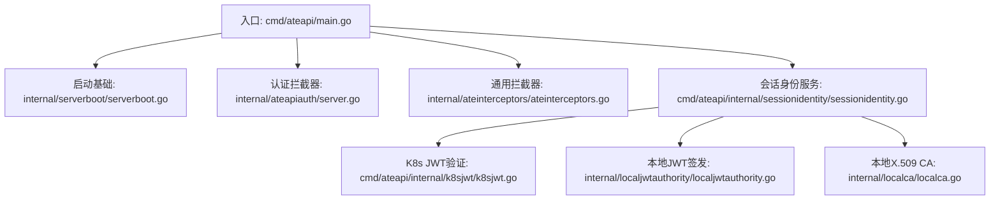
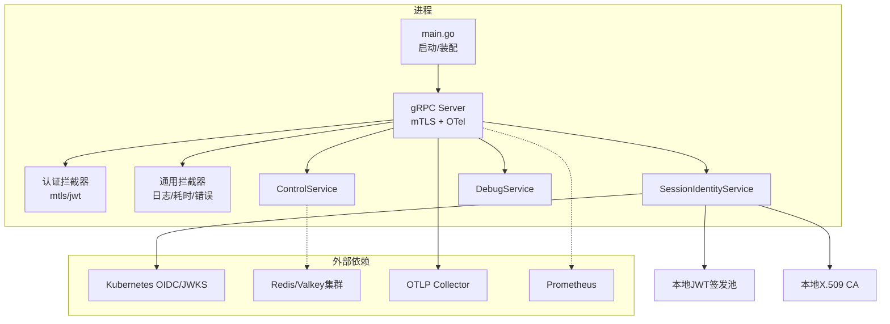
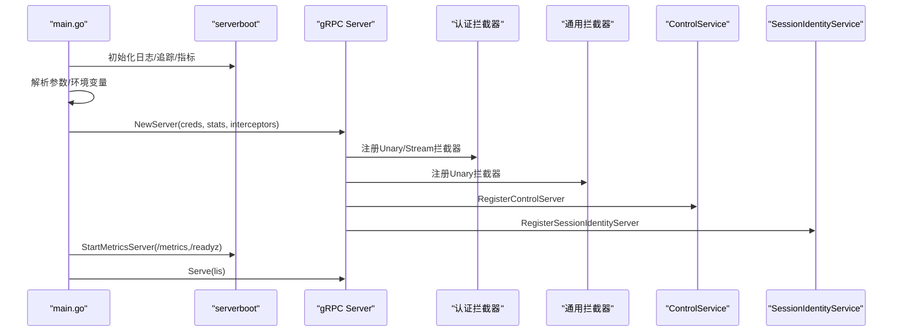
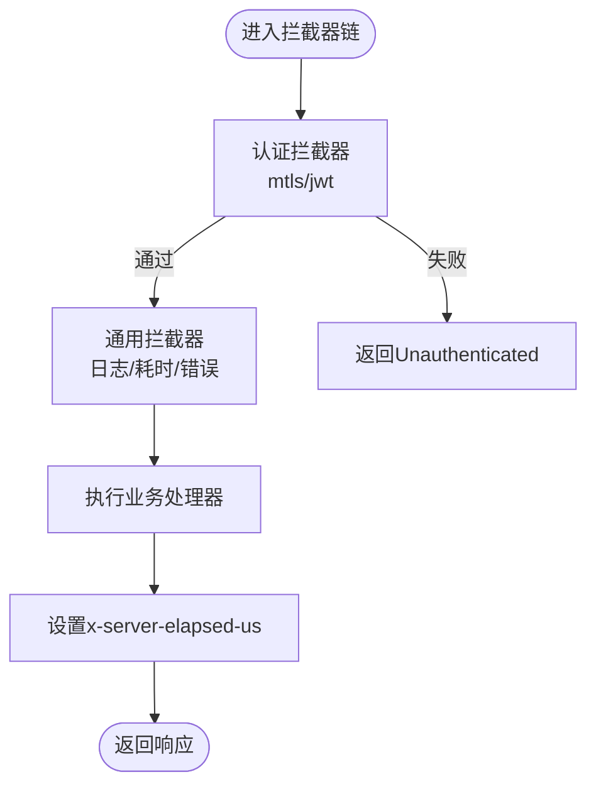
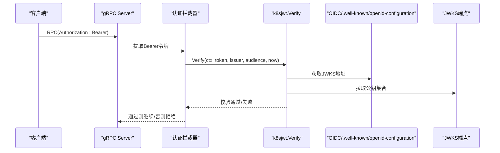
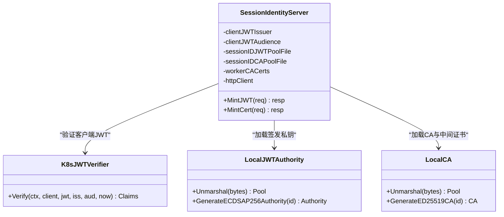
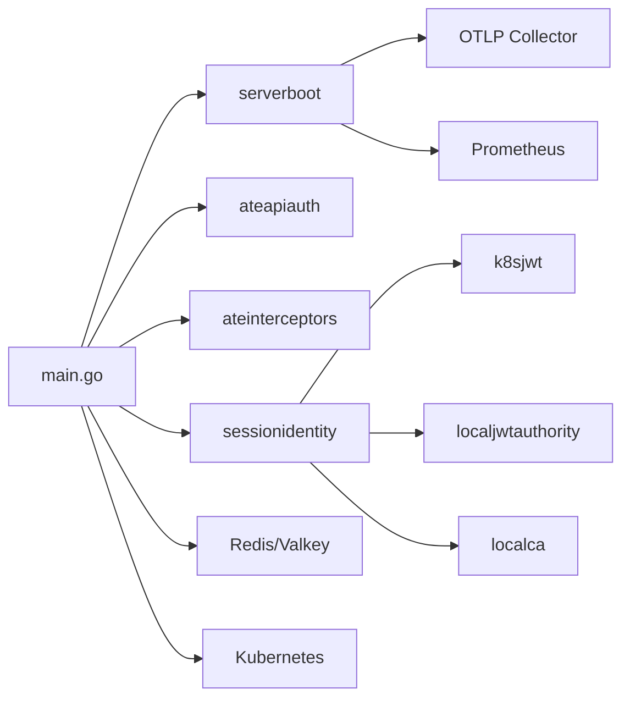

# API服务器架构

<cite>
**本文引用的文件**   
- [cmd/ateapi/main.go](file://cmd/ateapi/main.go)
- [internal/serverboot/serverboot.go](file://internal/serverboot/serverboot.go)
- [internal/ateinterceptors/ateinterceptors.go](file://internal/ateinterceptors/ateinterceptors.go)
- [internal/ateapiauth/server.go](file://internal/ateapiauth/server.go)
- [cmd/ateapi/internal/sessionidentity/sessionidentity.go](file://cmd/ateapi/internal/sessionidentity/sessionidentity.go)
- [cmd/ateapi/internal/k8sjwt/k8sjwt.go](file://cmd/ateapi/internal/k8sjwt/k8sjwt.go)
- [internal/localjwtauthority/localjwtauthority.go](file://internal/localjwtauthority/localjwtauthority.go)
- [internal/localca/localca.go](file://internal/localca/localca.go)
</cite>

## 目录
1. [简介](#简介)
2. [项目结构](#项目结构)
3. [核心组件](#核心组件)
4. [架构总览](#架构总览)
5. [详细组件分析](#详细组件分析)
6. [依赖关系分析](#依赖关系分析)
7. [性能与并发优化](#性能与并发优化)
8. [故障排查指南](#故障排查指南)
9. [结论](#结论)
10. [附录：扩展新API端点示例](#附录扩展新api端点示例)

## 简介
本文件面向Agent Substrate的API服务器（ateapi），系统性阐述gRPC服务器的启动流程、中间件链配置、认证授权机制（mTLS与JWT）、HTTP/2连接处理、请求拦截器与OpenTelemetry集成，并给出会话身份生成（JWT与证书）的实现细节。同时提供高并发场景下的性能优化建议、错误处理模式与监控指标收集方法，帮助读者快速理解并扩展系统能力。

## 项目结构
- 入口程序位于 cmd/ateapi/main.go，负责解析参数、初始化日志/追踪/指标、建立Redis与Kubernetes客户端、构建gRPC服务与中间件链、注册业务服务并启动监听。
- 通用启动基础设施在 internal/serverboot/serverboot.go，封装日志、TracerProvider/MeterProvider、Prometheus指标与就绪探针等。
- 认证鉴权逻辑在 internal/ateapiauth/server.go，支持mtls与jwt两种模式，通过拦截器注入上下文。
- 通用拦截器在 internal/ateinterceptors/ateinterceptors.go，实现统一日志、耗时尾标与错误规范化。
- 会话身份服务在 cmd/ateapi/internal/sessionidentity/sessionidentity.go，提供MintJWT与MintCert两个端点，分别签发会话JWT与会话证书。
- Kubernetes JWT验证在 cmd/ateapi/internal/k8sjwt/k8sjwt.go，完成OIDC发现、JWKS获取与签名校验。
- 本地JWT签发“CA”在 internal/localjwtauthority/localjwtauthority.go，用于会话JWT签名。
- 本地X.509 CA在 internal/localca/localca.go，用于会话证书签发。

图表来源
- [cmd/ateapi/main.go:182-196](file://cmd/ateapi/main.go#L182-L196)
- [internal/serverboot/serverboot.go:91-147](file://internal/serverboot/serverboot.go#L91-L147)
- [internal/ateapiauth/server.go:81-103](file://internal/ateapiauth/server.go#L81-L103)
- [internal/ateinterceptors/ateinterceptors.go:36-72](file://internal/ateinterceptors/ateinterceptors.go#L36-L72)
- [cmd/ateapi/internal/sessionidentity/sessionidentity.go:71-142](file://cmd/ateapi/internal/sessionidentity/sessionidentity.go#L71-L142)
- [cmd/ateapi/internal/k8sjwt/k8sjwt.go:128-261](file://cmd/ateapi/internal/k8sjwt/k8sjwt.go#L128-L261)
- [internal/localjwtauthority/localjwtauthority.go:76-101](file://internal/localjwtauthority/localjwtauthority.go#L76-L101)
- [internal/localca/localca.go:83-120](file://internal/localca/localca.go#L83-L120)

章节来源
- [cmd/ateapi/main.go:79-206](file://cmd/ateapi/main.go#L79-L206)
- [internal/serverboot/serverboot.go:44-147](file://internal/serverboot/serverboot.go#L44-L147)

## 核心组件
- gRPC服务器与HTTP/2
  - 使用grpc.NewServer创建实例，启用TransportCredentials（mTLS）、StatsHandler（OpenTelemetry gRPC统计）、Unary与Stream拦截器链，并通过reflection暴露调试能力。
  - HTTP/2由gRPC默认启用；如需强制HTTP/2可结合ALPN或前置代理策略。
- 中间件链
  - 认证拦截器：根据auth-mode选择mtls或jwt模式，从metadata提取Bearer令牌并调用VerifyBearerToken回调进行校验。
  - 通用拦截器：记录方法名、请求/响应摘要、错误与耗时，并将非status错误包装为Internal错误码，同时设置x-server-elapsed-us尾标。
- 认证与授权
  - mTLS模式：身份来源于传输层双向TLS证书，服务端可选择性校验客户端证书（可选CA）。
  - JWT模式：要求每个RPC携带Authorization: Bearer <SA token>，服务端通过k8sjwt.Verify进行OIDC发现、JWKS拉取与签名校验，并检查iss/aud/时间绑定。
- 会话身份服务
  - MintJWT：校验客户端K8s SA JWT后，基于本地JWT签发池（ES256）签发会话JWT，包含应用/用户/会话标识与受众绑定。
  - MintCert：基于mTLS对等证书校验后，使用本地X.509 CA签发会话证书，附带SPIFFE URI与短期有效期。
- 可观测性与指标
  - OpenTelemetry：Tracing与Metrics Provider初始化，gRPC StatsHandler自动采集链路信息；Prometheus /metrics与/readyz由serverboot提供。

章节来源
- [cmd/ateapi/main.go:182-206](file://cmd/ateapi/main.go#L182-L206)
- [internal/ateinterceptors/ateinterceptors.go:36-72](file://internal/ateinterceptors/ateinterceptors.go#L36-L72)
- [internal/ateapiauth/server.go:81-103](file://internal/ateapiauth/server.go#L81-L103)
- [cmd/ateapi/internal/sessionidentity/sessionidentity.go:71-142](file://cmd/ateapi/internal/sessionidentity/sessionidentity.go#L71-L142)
- [internal/serverboot/serverboot.go:91-147](file://internal/serverboot/serverboot.go#L91-L147)

## 架构总览
下图展示了ateapi的整体架构：入口main负责初始化与装配，gRPC层承载控制面与会话身份服务，认证拦截器与通用拦截器构成请求处理链，会话身份服务依赖K8s OIDC/JWKS与本地密钥材料。

图表来源
- [cmd/ateapi/main.go:182-206](file://cmd/ateapi/main.go#L182-L206)
- [cmd/ateapi/internal/sessionidentity/sessionidentity.go:71-142](file://cmd/ateapi/internal/sessionidentity/sessionidentity.go#L71-L142)
- [cmd/ateapi/internal/k8sjwt/k8sjwt.go:128-261](file://cmd/ateapi/internal/k8sjwt/k8sjwt.go#L128-L261)
- [internal/localjwtauthority/localjwtauthority.go:76-101](file://internal/localjwtauthority/localjwtauthority.go#L76-L101)
- [internal/localca/localca.go:83-120](file://internal/localca/localca.go#L83-L120)
- [internal/serverboot/serverboot.go:176-192](file://internal/serverboot/serverboot.go#L176-L192)

## 详细组件分析

### gRPC服务器启动流程与HTTP/2
- 参数解析与环境变量覆盖：支持将关键配置从环境变量注入，便于多环境部署。
- 初始化日志、追踪与指标：统一JSON结构化日志、OTel TracerProvider/MeterProvider、Prometheus导出器与/readyz。
- 构建gRPC服务器：
  - 传输安全：加载服务器证书bundle，可选校验客户端证书（workerpool CA）。
  - 统计：接入otelgrpc.ServerHandler以采集gRPC链路指标。
  - 拦截器链：先认证拦截器，再通用拦截器。
  - 服务注册：Control、SessionIdentity、Debug三个服务。
- 启动指标HTTP服务：独立端口暴露/metrics与/readyz。

图表来源
- [cmd/ateapi/main.go:79-206](file://cmd/ateapi/main.go#L79-L206)
- [internal/serverboot/serverboot.go:91-147](file://internal/serverboot/serverboot.go#L91-L147)
- [internal/serverboot/serverboot.go:176-192](file://internal/serverboot/serverboot.go#L176-L192)

章节来源
- [cmd/ateapi/main.go:79-206](file://cmd/ateapi/main.go#L79-L206)
- [internal/serverboot/serverboot.go:91-147](file://internal/serverboot/serverboot.go#L91-L147)

### 中间件链配置与请求拦截器
- 认证拦截器
  - 支持ModeMTLS与ModeJWT；JWT模式下从metadata读取Authorization头，调用VerifyBearerToken回调进行校验。
  - 未通过时返回Unauthenticated错误。
- 通用拦截器
  - 记录方法名、请求/响应摘要（敏感字段脱敏）、错误与耗时。
  - 将非gRPC status错误包装为Internal错误码。
  - 设置x-server-elapsed-us尾标供客户端计算真实服务端耗时。

图表来源
- [internal/ateapiauth/server.go:81-103](file://internal/ateapiauth/server.go#L81-L103)
- [internal/ateinterceptors/ateinterceptors.go:36-72](file://internal/ateinterceptors/ateinterceptors.go#L36-L72)

章节来源
- [internal/ateapiauth/server.go:81-103](file://internal/ateapiauth/server.go#L81-L103)
- [internal/ateinterceptors/ateinterceptors.go:36-72](file://internal/ateinterceptors/ateinterceptors.go#L36-L72)

### 认证与授权机制（mTLS与JWT）
- mTLS模式
  - 身份来自传输层双向TLS证书；服务端可配置可选的客户端CA以校验workerpool证书。
  - 当前未将传输层身份附加到上下文（预留扩展点）。
- JWT模式
  - 每个RPC需携带Authorization: Bearer <K8s SA Token>。
  - k8sjwt.Verify执行：
    - 解析JWT头部与负载，校验iss与kid。
    - 通过OIDC Discovery获取JWKS，按kid选择公钥。
    - 校验签名（RS*与ES*算法族）。
    - 校验aud、exp/nbf/iat时间窗口。
  - 主流程中通过VerifyBearerToken回调委托给k8sjwt.Verify。

图表来源
- [internal/ateapiauth/server.go:141-152](file://internal/ateapiauth/server.go#L141-L152)
- [cmd/ateapi/internal/k8sjwt/k8sjwt.go:128-261](file://cmd/ateapi/internal/k8sjwt/k8sjwt.go#L128-L261)
- [cmd/ateapi/main.go:171-180](file://cmd/ateapi/main.go#L171-L180)

章节来源
- [internal/ateapiauth/server.go:35-70](file://internal/ateapiauth/server.go#L35-L70)
- [cmd/ateapi/internal/k8sjwt/k8sjwt.go:128-261](file://cmd/ateapi/internal/k8sjwt/k8sjwt.go#L128-L261)
- [cmd/ateapi/main.go:171-180](file://cmd/ateapi/main.go#L171-L180)

### 会话身份生成（JWT与证书）
- 会话JWT签发（MintJWT）
  - 校验客户端K8s SA JWT（issuer/audience/签名/时间）。
  - 从本地JWT签发池加载私钥（ES256），构造会话JWT载荷（含app/user/session与受众绑定），签名并返回。
- 会话证书签发（MintCert）
  - 基于mTLS对等证书校验身份。
  - 从本地X.509 CA池加载根/中间证书与私钥，校验CSR，生成带SPIFFE URI的短期客户端证书并返回。

图表来源
- [cmd/ateapi/internal/sessionidentity/sessionidentity.go:71-142](file://cmd/ateapi/internal/sessionidentity/sessionidentity.go#L71-L142)
- [cmd/ateapi/internal/sessionidentity/sessionidentity.go:144-225](file://cmd/ateapi/internal/sessionidentity/sessionidentity.go#L144-L225)
- [internal/localjwtauthority/localjwtauthority.go:76-101](file://internal/localjwtauthority/localjwtauthority.go#L76-L101)
- [internal/localca/localca.go:83-120](file://internal/localca/localca.go#L83-L120)
- [cmd/ateapi/internal/k8sjwt/k8sjwt.go:128-261](file://cmd/ateapi/internal/k8sjwt/k8sjwt.go#L128-L261)

章节来源
- [cmd/ateapi/internal/sessionidentity/sessionidentity.go:71-142](file://cmd/ateapi/internal/sessionidentity/sessionidentity.go#L71-L142)
- [cmd/ateapi/internal/sessionidentity/sessionidentity.go:144-225](file://cmd/ateapi/internal/sessionidentity/sessionidentity.go#L144-L225)
- [internal/localjwtauthority/localjwtauthority.go:76-101](file://internal/localjwtauthority/localjwtauthority.go#L76-L101)
- [internal/localca/localca.go:83-120](file://internal/localca/localca.go#L83-L120)

### OpenTelemetry集成与指标收集
- 追踪
  - 初始化TracerProvider，设置ParentBased采样器，使用OTLP gRPC导出器批量上报。
  - gRPC StatsHandler自动采集RPC级链路信息。
- 指标
  - 初始化MeterProvider，同时注册Prometheus Reader与OTLP Periodic Reader。
  - 独立HTTP服务暴露/metrics与/readyz。

章节来源
- [internal/serverboot/serverboot.go:91-147](file://internal/serverboot/serverboot.go#L91-L147)
- [internal/serverboot/serverboot.go:176-192](file://internal/serverboot/serverboot.go#L176-L192)
- [cmd/ateapi/main.go:182-206](file://cmd/ateapi/main.go#L182-L206)

## 依赖关系分析
- ateapi main依赖：
  - serverboot：日志/追踪/指标/就绪探针。
  - ateapiauth：认证拦截器。
  - ateinterceptors：通用拦截器。
  - sessionidentity：会话身份服务。
  - k8sjwt：K8s JWT验证。
  - localjwtauthority/localca：本地密钥材料。
- 运行时依赖：
  - Redis/Valkey：工作节点缓存与持久化。
  - Kubernetes：Informer与CRD Lister、ServiceAccount令牌与OIDC发现。
  - OTLP Collector/Prometheus：遥测数据出口。

图表来源
- [cmd/ateapi/main.go:182-206](file://cmd/ateapi/main.go#L182-L206)
- [cmd/ateapi/internal/sessionidentity/sessionidentity.go:71-142](file://cmd/ateapi/internal/sessionidentity/sessionidentity.go#L71-L142)
- [internal/serverboot/serverboot.go:91-147](file://internal/serverboot/serverboot.go#L91-L147)

章节来源
- [cmd/ateapi/main.go:182-206](file://cmd/ateapi/main.go#L182-L206)
- [internal/serverboot/serverboot.go:91-147](file://internal/serverboot/serverboot.go#L91-L147)

## 性能与并发优化
- gRPC层面
  - 合理设置最大并发流与连接数；避免在拦截器中进行阻塞I/O。
  - 利用x-server-elapsed-us尾标评估真实服务端耗时，定位慢路径。
- 认证与密钥
  - 对JWKS与OIDC发现结果做内存缓存（按kid命中），减少网络开销。
  - 对本地JWT签发池与CA池进行内存缓存，避免每次请求读盘。
- 指标与追踪
  - 使用ParentBased采样器控制采样率，在高QPS下降低OTLP上报压力。
  - 将关键业务指标纳入Prometheus，结合/readyz进行健康探测。
- 资源与存储
  - Redis连接复用与重试退避已内置；确保连接池大小与超时匹配峰值流量。
  - 避免在热路径进行大量序列化/反序列化，必要时引入对象池。

[本节为通用指导，不直接分析具体文件]

## 故障排查指南
- 常见错误与定位
  - Unauthenticated：JWT缺失或无效；检查Authorization头格式与issuer/audience配置。
  - Internal：非gRPC status错误被包装为Internal；查看通用拦截器日志与错误堆栈。
  - 证书相关：mTLS握手失败或peer证书为空；检查服务器证书bundle与客户端证书是否有效。
- 可观测性
  - 通过/metrics查看gRPC与自定义指标；通过/readyz确认服务就绪。
  - 通过OTLP链路追踪定位跨服务调用瓶颈。
- 启动失败
  - 无法连接Redis/Kubernetes：检查网络、凭据与重试逻辑；关注启动阶段Fatal日志。

章节来源
- [internal/ateinterceptors/ateinterceptors.go:57-72](file://internal/ateinterceptors/ateinterceptors.go#L57-L72)
- [internal/ateapiauth/server.go:141-152](file://internal/ateapiauth/server.go#L141-L152)
- [cmd/ateapi/main.go:121-124](file://cmd/ateapi/main.go#L121-L124)
- [internal/serverboot/serverboot.go:176-192](file://internal/serverboot/serverboot.go#L176-L192)

## 结论
ateapi以gRPC为核心，结合mTLS与可选JWT认证，提供统一的请求拦截与可观测性能力。会话身份服务通过本地JWT与X.509 CA签发短期凭证，满足微隔离与最小权限原则。通过OpenTelemetry与Prometheus，系统具备完善的追踪与指标能力。建议在认证与密钥路径增加缓存与限流，进一步提升高并发场景下的稳定性与吞吐。

## 附录：扩展新API端点示例
- 步骤概览
  - 定义新的gRPC服务与方法（protobuf）。
  - 在main中注册新服务到gRPC Server。
  - 若需要认证，确保认证拦截器链生效；若需要通用日志/耗时，通用拦截器已自动生效。
  - 若涉及外部依赖（如Redis/K8s），在构造函数中注入相应客户端。
  - 添加必要的指标与追踪埋点（可通过OTel SDK或gRPC StatsHandler自动采集）。
- 参考路径
  - 服务注册位置：[cmd/ateapi/main.go:194-196](file://cmd/ateapi/main.go#L194-L196)
  - 认证拦截器：[internal/ateapiauth/server.go:81-103](file://internal/ateapiauth/server.go#L81-L103)
  - 通用拦截器：[internal/ateinterceptors/ateinterceptors.go:36-72](file://internal/ateinterceptors/ateinterceptors.go#L36-L72)
  - 会话身份服务示例：[cmd/ateapi/internal/sessionidentity/sessionidentity.go:71-142](file://cmd/ateapi/internal/sessionidentity/sessionidentity.go#L71-L142)

[本节为概念性指导，不直接分析具体文件]
