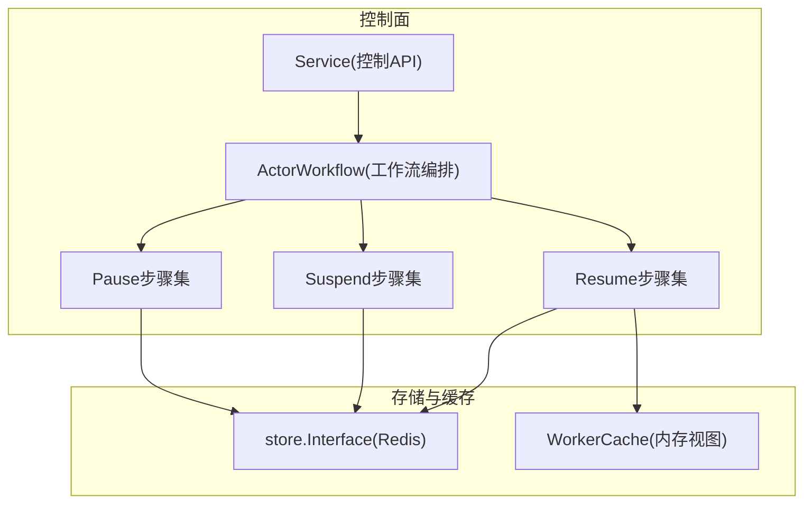
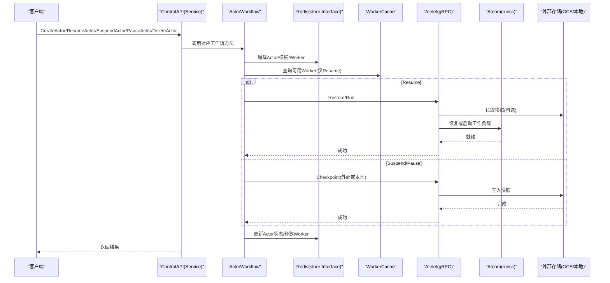
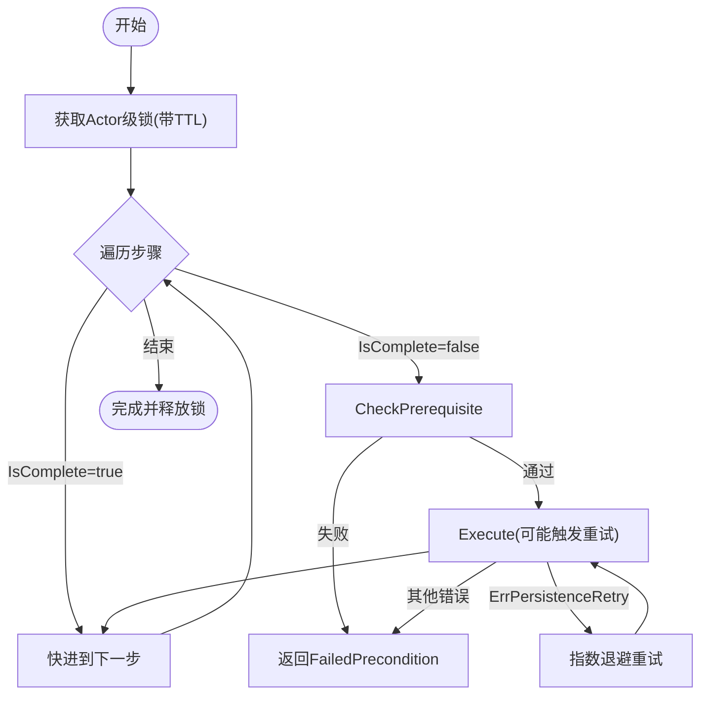
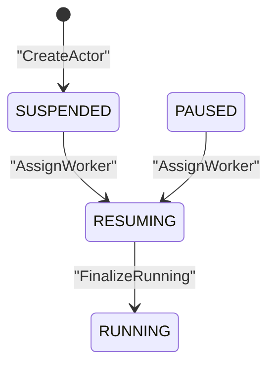
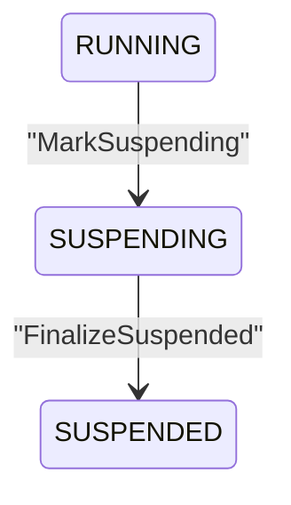
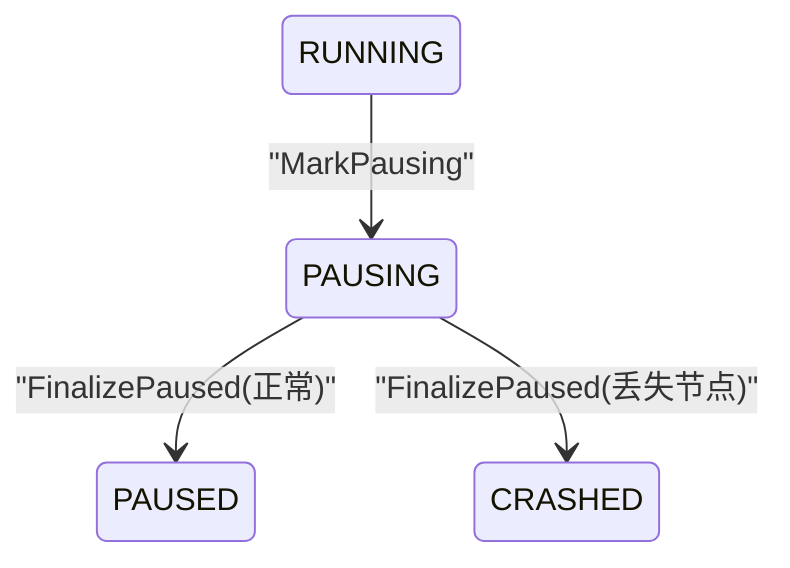
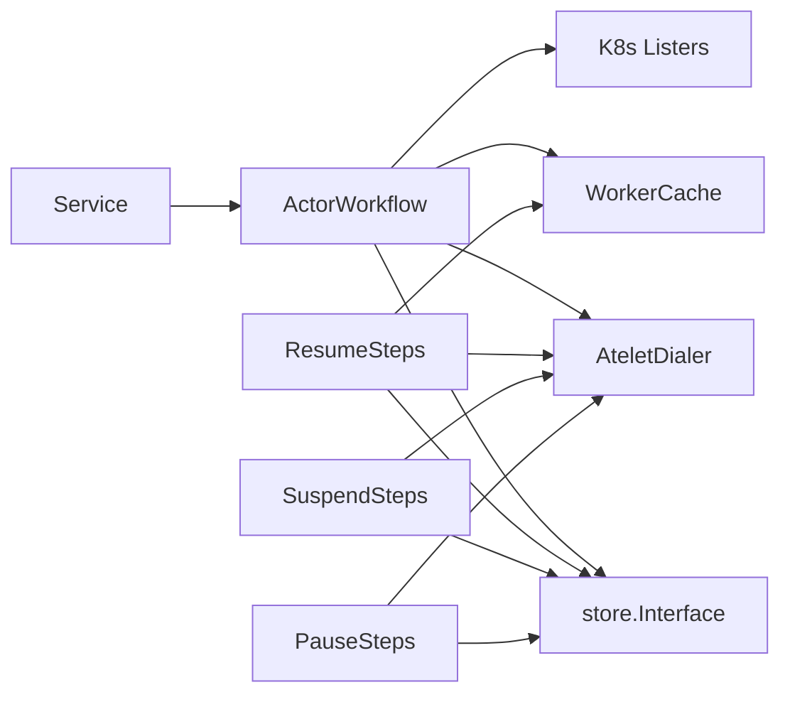

# 工作流引擎

<cite>
**本文引用的文件**   
- [workflow.go](file://cmd/ateapi/internal/controlapi/workflow.go)
- [create_actor.go](file://cmd/ateapi/internal/controlapi/create_actor.go)
- [resume_actor.go](file://cmd/ateapi/internal/controlapi/resume_actor.go)
- [pause_actor.go](file://cmd/ateapi/internal/controlapi/pause_actor.go)
- [suspend_actor.go](file://cmd/ateapi/internal/controlapi/suspend_actor.go)
- [delete_actor.go](file://cmd/ateapi/internal/controlapi/delete_actor.go)
- [workflow_resume.go](file://cmd/ateapi/internal/controlapi/workflow_resume.go)
- [workflow_suspend.go](file://cmd/ateapi/internal/controlapi/workflow_suspend.go)
- [workflow_pause.go](file://cmd/ateapi/internal/controlapi/workflow_pause.go)
- [service.go](file://cmd/ateapi/internal/controlapi/service.go)
- [store.go](file://cmd/ateapi/internal/store/store.go)
- [ateredis.go](file://cmd/ateapi/internal/store/ateredis/ateredis.go)
- [workercache.go](file://cmd/ateapi/internal/workercache/workercache.go)
- [architecture.md](file://docs/architecture.md)
- [ateapi_grpc.pb.go](file://pkg/proto/ateapipb/ateapi_grpc.pb.go)
</cite>

## 目录
1. [简介](#简介)
2. [项目结构](#项目结构)
3. [核心组件](#核心组件)
4. [架构总览](#架构总览)
5. [详细组件分析](#详细组件分析)
6. [依赖关系分析](#依赖关系分析)
7. [性能与并发特性](#性能与并发特性)
8. [故障排查指南](#故障排查指南)
9. [结论](#结论)
10. [附录：自定义工作流扩展指南](#附录自定义工作流扩展指南)

## 简介
本文件面向 Agent Substrate 的“工作流引擎”，聚焦 Actor 生命周期管理（CreateActor、PauseActor、ResumeActor、SuspendActor、DeleteActor）的实现细节与工作流编排机制。文档涵盖步骤执行、状态转换、错误重试策略、异步任务处理模式（队列、并发控制、超时）、状态持久化、断点续跑与回滚，以及自定义工作流扩展的开发指南与最佳实践。

## 项目结构
围绕工作流引擎的关键代码位于 controlapi 包内，采用“服务层 + 工作流编排 + 具体步骤”的分层设计：
- 服务层：实现 gRPC Control 接口，负责请求校验、上下文设置、调用工作流。
- 工作流编排：定义通用 WorkflowStep 接口与 RunWorkflow 执行器，提供幂等、前置条件检查、指数退避重试等能力。
- 具体步骤：为 Resume/Suspend/Pause 流程拆分为多个原子步骤，每个步骤可独立判断是否完成、前置条件与执行逻辑。
- 存储与缓存：通过 store.Interface 访问 Redis 持久化；workercache 维护 Worker 内存视图以加速调度。

图表来源
- [service.go:25-56](file://cmd/ateapi/internal/controlapi/service.go#L25-L56)
- [workflow.go:131-163](file://cmd/ateapi/internal/controlapi/workflow.go#L131-L163)
- [workflow_resume.go:142-161](file://cmd/ateapi/internal/controlapi/workflow_resume.go#L142-L161)
- [workflow_suspend.go:79-106](file://cmd/ateapi/internal/controlapi/workflow_suspend.go#L79-L106)
- [workflow_pause.go:78-105](file://cmd/ateapi/internal/controlapi/workflow_pause.go#L78-L105)
- [store.go:40-61](file://cmd/ateapi/internal/store/store.go#L40-L61)
- [workercache.go:15-35](file://cmd/ateapi/internal/workercache/workercache.go#L15-L35)

章节来源
- [service.go:25-56](file://cmd/ateapi/internal/controlapi/service.go#L25-L56)
- [workflow.go:131-163](file://cmd/ateapi/internal/controlapi/workflow.go#L131-L163)
- [store.go:40-61](file://cmd/ateapi/internal/store/store.go#L40-L61)
- [workercache.go:15-35](file://cmd/ateapi/internal/workercache/workercache.go#L15-L35)

## 核心组件
- 工作流抽象
  - WorkflowStep[Params, Context]：定义 Name、IsComplete、CheckPrerequisite、Execute、RetryBackoff。
  - RunWorkflow：顺序执行步骤，支持幂等快进、前置条件校验、指数退避重试（仅对 ErrPersistenceRetry）。
- ActorWorkflow：封装 Resume/Suspend/Pause 的工作流组装与锁获取。
- 步骤集合
  - Resume：LoadActorForResume → AssignWorker → CallAteletRestore → FinalizeRunning
  - Suspend：LoadActorForSuspend → MarkSuspending → CallAteletSuspend → FinalizeSuspended
  - Pause：LoadActorForPause → MarkPausing → CallAteletPause → FinalizePaused
- 存储与缓存
  - store.Interface：Actor/Worker 的增删改查、乐观并发更新、事务冲突返回 ErrPersistenceRetry。
  - workercache.Cache：基于 Watch 的内存 Worker 快照，O(1) 读取，用于快速选择空闲 Worker。

章节来源
- [workflow.go:36-129](file://cmd/ateapi/internal/controlapi/workflow.go#L36-L129)
- [workflow.go:165-254](file://cmd/ateapi/internal/controlapi/workflow.go#L165-L254)
- [workflow_resume.go:41-115](file://cmd/ateapi/internal/controlapi/workflow_resume.go#L41-L115)
- [workflow_suspend.go:36-77](file://cmd/ateapi/internal/controlapi/workflow_suspend.go#L36-L77)
- [workflow_pause.go:35-76](file://cmd/ateapi/internal/controlapi/workflow_pause.go#L35-L76)
- [store.go:40-61](file://cmd/ateapi/internal/store/store.go#L40-L61)
- [workercache.go:15-35](file://cmd/ateapi/internal/workercache/workercache.go#L15-L35)

## 架构总览
从客户端到运行时的端到端流程如下：

图表来源
- [service.go:25-56](file://cmd/ateapi/internal/controlapi/service.go#L25-L56)
- [workflow.go:165-254](file://cmd/ateapi/internal/controlapi/workflow.go#L165-L254)
- [workflow_resume.go:296-446](file://cmd/ateapi/internal/controlapi/workflow_resume.go#L296-L446)
- [workflow_suspend.go:108-170](file://cmd/ateapi/internal/controlapi/workflow_suspend.go#L108-L170)
- [workflow_pause.go:107-167](file://cmd/ateapi/internal/controlapi/workflow_pause.go#L107-L167)
- [architecture.md:353-464](file://docs/architecture.md#L353-L464)

## 详细组件分析

### 工作流编排与幂等性
- 幂等快进：每个步骤的 IsComplete 根据当前 Actor 状态决定是否跳过执行。
- 前置条件：CheckPrerequisite 确保状态机边合法，不满足则返回 FailedPrecondition。
- 重试策略：仅当 Execute 返回 ErrPersistenceRetry 时触发指数退避重试，其他错误立即失败。
- 分布式锁：acquireActorLock 保证同一 Actor 的并发操作串行化，避免竞态。

图表来源
- [workflow.go:64-129](file://cmd/ateapi/internal/controlapi/workflow.go#L64-L129)
- [workflow.go:256-279](file://cmd/ateapi/internal/controlapi/workflow.go#L256-L279)

章节来源
- [workflow.go:36-129](file://cmd/ateapi/internal/controlapi/workflow.go#L36-L129)
- [workflow.go:256-279](file://cmd/ateapi/internal/controlapi/workflow.go#L256-L279)

### ResumeActor 工作流
- 步骤序列：LoadActorForResume → AssignWorker → CallAteletRestore → FinalizeRunning
- 关键逻辑
  - LoadActorForResume：加载最新 Actor 与模板；若处于 RESUMING，尝试恢复已分配的 Worker。
  - AssignWorker：从缓存中筛选符合模板与 Actor 选择器的空闲 Worker，必要时清理历史残留分配；将 Actor 置为 RESUMING 并记录 Worker 信息。
  - CallAteletRestore：优先使用 Actor 的最新快照；若无且模板有 Golden Snapshot 则从金快照恢复；否则按模板规格全新启动。
  - FinalizeRunning：将 Actor 状态置为 RUNNING。
- 状态转换：SUSPENDED/PAUSED → RESUMING → RUNNING

图表来源
- [workflow_resume.go:142-252](file://cmd/ateapi/internal/controlapi/workflow_resume.go#L142-L252)
- [workflow_resume.go:448-478](file://cmd/ateapi/internal/controlapi/workflow_resume.go#L448-L478)

章节来源
- [workflow_resume.go:41-115](file://cmd/ateapi/internal/controlapi/workflow_resume.go#L41-L115)
- [workflow_resume.go:142-252](file://cmd/ateapi/internal/controlapi/workflow_resume.go#L142-L252)
- [workflow_resume.go:296-446](file://cmd/ateapi/internal/controlapi/workflow_resume.go#L296-L446)
- [workflow_resume.go:448-478](file://cmd/ateapi/internal/controlapi/workflow_resume.go#L448-L478)

### SuspendActor 工作流
- 步骤序列：LoadActorForSuspend → MarkSuspending → CallAteletSuspend → FinalizeSuspended
- 关键逻辑
  - MarkSuspending：生成 InProgressSnapshot 路径，标记 SUSPENDING。
  - CallAteletSuspend：向 Atelet 发起 Checkpoint(外部)，失败则 Crash Actor。
  - FinalizeSuspended：释放 Worker 引用，更新 LatestSnapshotInfo，置为 SUSPENDED。
- 状态转换：RUNNING → SUSPENDING → SUSPENDED

图表来源
- [workflow_suspend.go:79-106](file://cmd/ateapi/internal/controlapi/workflow_suspend.go#L79-L106)
- [workflow_suspend.go:108-170](file://cmd/ateapi/internal/controlapi/workflow_suspend.go#L108-L170)
- [workflow_suspend.go:172-250](file://cmd/ateapi/internal/controlapi/workflow_suspend.go#L172-L250)

章节来源
- [workflow_suspend.go:36-77](file://cmd/ateapi/internal/controlapi/workflow_suspend.go#L36-L77)
- [workflow_suspend.go:79-106](file://cmd/ateapi/internal/controlapi/workflow_suspend.go#L79-L106)
- [workflow_suspend.go:108-170](file://cmd/ateapi/internal/controlapi/workflow_suspend.go#L108-L170)
- [workflow_suspend.go:172-250](file://cmd/ateapi/internal/controlapi/workflow_suspend.go#L172-L250)

### PauseActor 工作流
- 步骤序列：LoadActorForPause → MarkPausing → CallAteletPause → FinalizePaused
- 关键逻辑
  - MarkPausing：生成 InProgressSnapshot 路径，标记 PAUSING。
  - CallAteletPause：向 Atelet 发起 Checkpoint(本地)，失败则 Crash Actor。
  - FinalizePaused：释放 Worker 引用，记录 LocalSnapshotInfo（含节点信息），置为 PAUSED；若丢失节点信息则置 CRASHED。
- 状态转换：RUNNING → PAUSING → PAUSED（或 CRASHED）

图表来源
- [workflow_pause.go:78-105](file://cmd/ateapi/internal/controlapi/workflow_pause.go#L78-L105)
- [workflow_pause.go:107-167](file://cmd/ateapi/internal/controlapi/workflow_pause.go#L107-L167)
- [workflow_pause.go:169-267](file://cmd/ateapi/internal/controlapi/workflow_pause.go#L169-L267)

章节来源
- [workflow_pause.go:35-76](file://cmd/ateapi/internal/controlapi/workflow_pause.go#L35-L76)
- [workflow_pause.go:78-105](file://cmd/ateapi/internal/controlapi/workflow_pause.go#L78-L105)
- [workflow_pause.go:107-167](file://cmd/ateapi/internal/controlapi/workflow_pause.go#L107-L167)
- [workflow_pause.go:169-267](file://cmd/ateapi/internal/controlapi/workflow_pause.go#L169-L267)

### CreateActor 与 DeleteActor
- CreateActor
  - 校验参数、验证 ActorTemplate 与 atespace 存在、创建 Actor 初始状态为 SUSPENDED。
- DeleteActor
  - 仅允许删除 SUSPENDED 状态的 Actor；非 SUSPENDED 返回 FailedPrecondition；并发冲突返回 Aborted。

章节来源
- [create_actor.go:32-82](file://cmd/ateapi/internal/controlapi/create_actor.go#L32-L82)
- [delete_actor.go:30-55](file://cmd/ateapi/internal/controlapi/delete_actor.go#L30-L55)

### gRPC 接口与服务装配
- ControlServer 暴露 Get/Create/Update/Suspend/Pause/Resume/Delete/List 等接口。
- Service 构造注入 persistence、dialer、listers、workerCache 等依赖，并创建 ActorWorkflow。

章节来源
- [ateapi_grpc.pb.go:53-73](file://pkg/proto/ateapipb/ateapi_grpc.pb.go#L53-L73)
- [service.go:25-56](file://cmd/ateapi/internal/controlapi/service.go#L25-L56)

## 依赖关系分析
- 组件耦合
  - Service 依赖 ActorWorkflow；ActorWorkflow 依赖 store.Interface、workercache.Cache、AteletDialer、Kubernetes listers。
  - 步骤内部依赖 store 与外部系统（Atelet/Ateom/对象存储）。
- 直接依赖
  - workflow.go → store.Interface、workercache.Cache、AteletDialer、Kubernetes client-go。
  - workflow_resume.go → store.Interface、workercache.Cache、ateletpb.AteomHerderClient、Kubernetes listers。
  - workflow_suspend.go / workflow_pause.go → store.Interface、AteletDialer、ateletpb.AteomHerderClient。
- 间接依赖
  - store.Interface 由 ateredis 实现，基于 Redis 事务与 Watch 事件。
  - workercache 通过 WatchWorkers 增量同步，提供内存快照。

图表来源
- [service.go:25-56](file://cmd/ateapi/internal/controlapi/service.go#L25-L56)
- [workflow.go:131-163](file://cmd/ateapi/internal/controlapi/workflow.go#L131-L163)
- [workflow_resume.go:142-161](file://cmd/ateapi/internal/controlapi/workflow_resume.go#L142-L161)
- [workflow_suspend.go:79-106](file://cmd/ateapi/internal/controlapi/workflow_suspend.go#L79-L106)
- [workflow_pause.go:78-105](file://cmd/ateapi/internal/controlapi/workflow_pause.go#L78-L105)

章节来源
- [service.go:25-56](file://cmd/ateapi/internal/controlapi/service.go#L25-L56)
- [workflow.go:131-163](file://cmd/ateapi/internal/controlapi/workflow.go#L131-L163)

## 性能与并发特性
- 幂等与快进：通过 IsComplete 避免重复执行，提升重试效率。
- 分布式锁：acquireActorLock 限制同一 Actor 的并发，避免状态竞争。
- 指数退避：针对持久化冲突（ErrPersistenceRetry）自动重试，降低瞬时失败影响。
- 内存缓存：workercache 提供 O(1) 读取，减少频繁查询存储。
- 超时控制：工作流上下文在锁 TTL 前过期，防止长尾阻塞。

章节来源
- [workflow.go:64-129](file://cmd/ateapi/internal/controlapi/workflow.go#L64-L129)
- [workflow.go:256-279](file://cmd/ateapi/internal/controlapi/workflow.go#L256-L279)
- [workercache.go:15-35](file://cmd/ateapi/internal/workercache/workercache.go#L15-L35)

## 故障排查指南
- 常见错误码与含义
  - Aborted：并发更新冲突（ErrPersistenceRetry），建议客户端重试。
  - NotFound：Actor 不存在。
  - FailedPrecondition：状态机不允许该转换（如非 SUSPENDED 删除、非 RUNNING 暂停等）。
- 定位要点
  - 查看步骤日志与 span，确认失败发生在哪个步骤。
  - 检查 Actor 当前状态是否符合步骤前置条件。
  - 对于 Resume，确认 Worker 是否仍被正确分配且符合选择器。
  - 对于 Suspend/Pause，确认 Atelet 连接与快照写入是否成功。
- 恢复策略
  - 幂等重放：对幂等工作流再次调用即可恢复。
  - 资源清理：若 Worker 残留分配，可在后续步骤中自动释放或手动清理。

章节来源
- [resume_actor.go:29-48](file://cmd/ateapi/internal/controlapi/resume_actor.go#L29-L48)
- [pause_actor.go:29-48](file://cmd/ateapi/internal/controlapi/pause_actor.go#L29-L48)
- [suspend_actor.go:29-48](file://cmd/ateapi/internal/controlapi/suspend_actor.go#L29-L48)
- [delete_actor.go:30-55](file://cmd/ateapi/internal/controlapi/delete_actor.go#L30-L55)

## 结论
工作流引擎通过通用的 WorkflowStep 抽象与 RunWorkflow 编排，实现了幂等、可重试、强一致的状态机驱动流程。结合分布式锁、内存缓存与外部系统交互，支撑了高并发、低延迟的 Actor 生命周期管理。建议在扩展新操作时遵循现有步骤拆分与前置条件校验模式，确保可观测性与可恢复性。

## 附录：自定义工作流扩展指南
- 新增操作的步骤设计
  - 定义 Input/State 类型，明确不可变参数与可变状态。
  - 实现 WorkflowStep：Name、IsComplete、CheckPrerequisite、Execute、RetryBackoff。
  - 在 ActorWorkflow 中组合步骤，必要时加入锁与超时控制。
- 幂等与一致性
  - 使用 IsComplete 进行快进，避免重复副作用。
  - 使用乐观并发更新（expectedVersion），遇到冲突返回 ErrPersistenceRetry 以便重试。
- 错误处理与可观测性
  - 区分可重试与致命错误，合理设置 RetryBackoff。
  - 为每个步骤开启 span，记录关键信息与错误。
- 与外部系统集成
  - 通过 AteletDialer 与 Atelet 通信，注意连接失败与 Pod 消失的处理。
  - 快照写入成功后再更新 Actor 状态，确保最终一致性。
- 测试建议
  - 覆盖拒绝路径（前置条件不满足）与幂等路径（已完成步骤快进）。
  - 模拟持久化冲突、网络抖动、Pod 消失等异常场景。

章节来源
- [workflow.go:36-129](file://cmd/ateapi/internal/controlapi/workflow.go#L36-L129)
- [workflow_resume.go:142-252](file://cmd/ateapi/internal/controlapi/workflow_resume.go#L142-L252)
- [workflow_suspend.go:79-106](file://cmd/ateapi/internal/controlapi/workflow_suspend.go#L79-L106)
- [workflow_pause.go:78-105](file://cmd/ateapi/internal/controlapi/workflow_pause.go#L78-L105)
