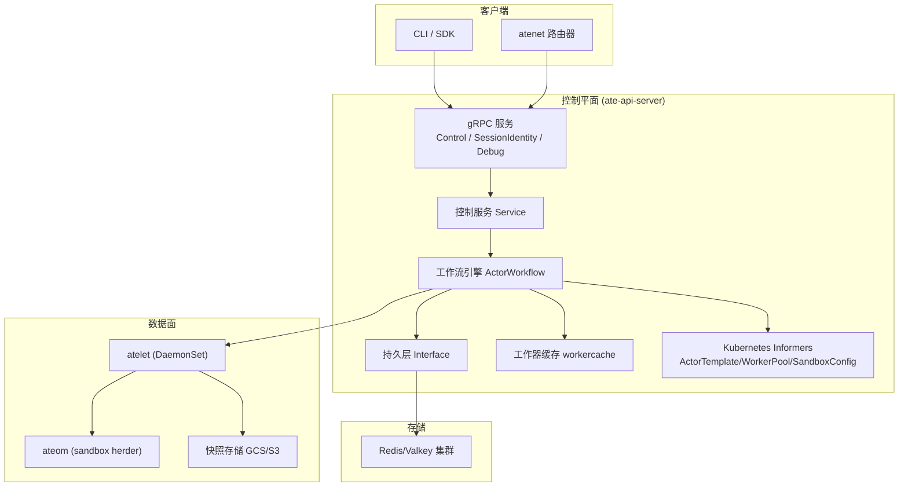
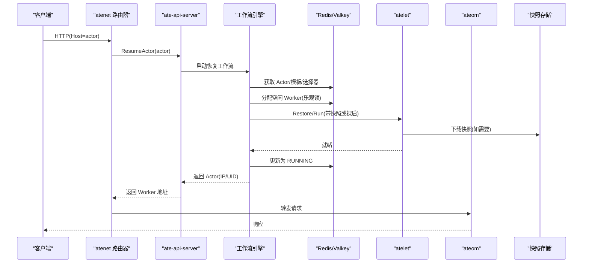
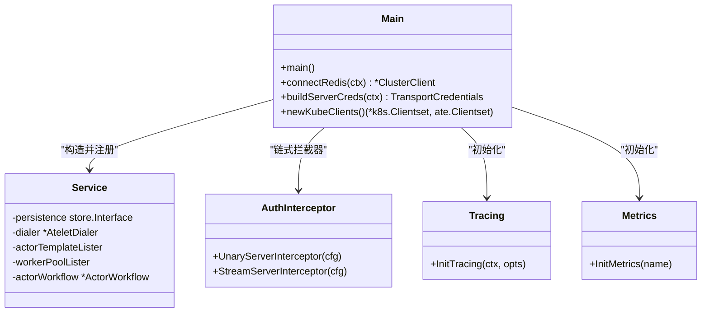
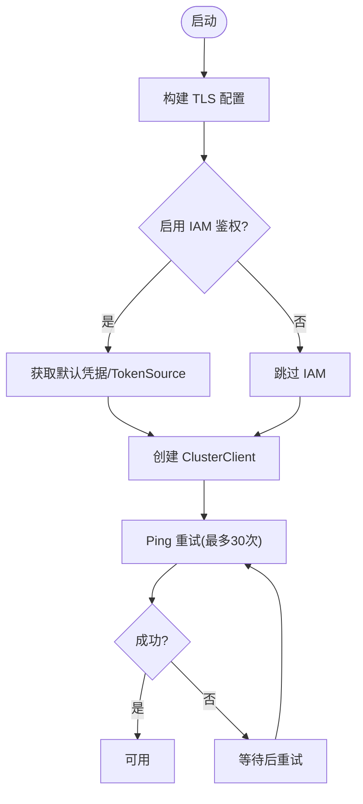
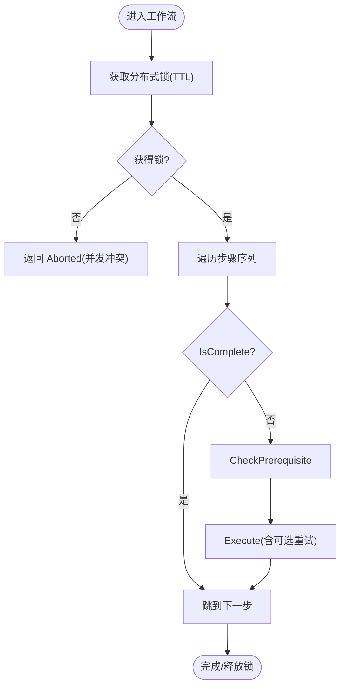
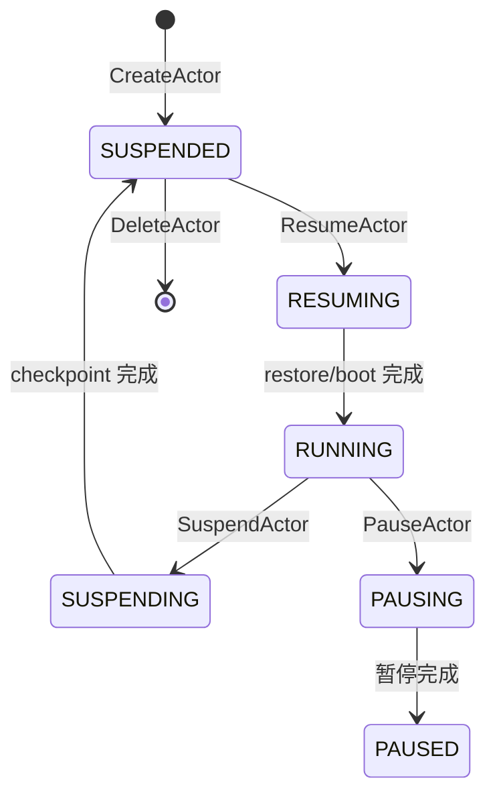
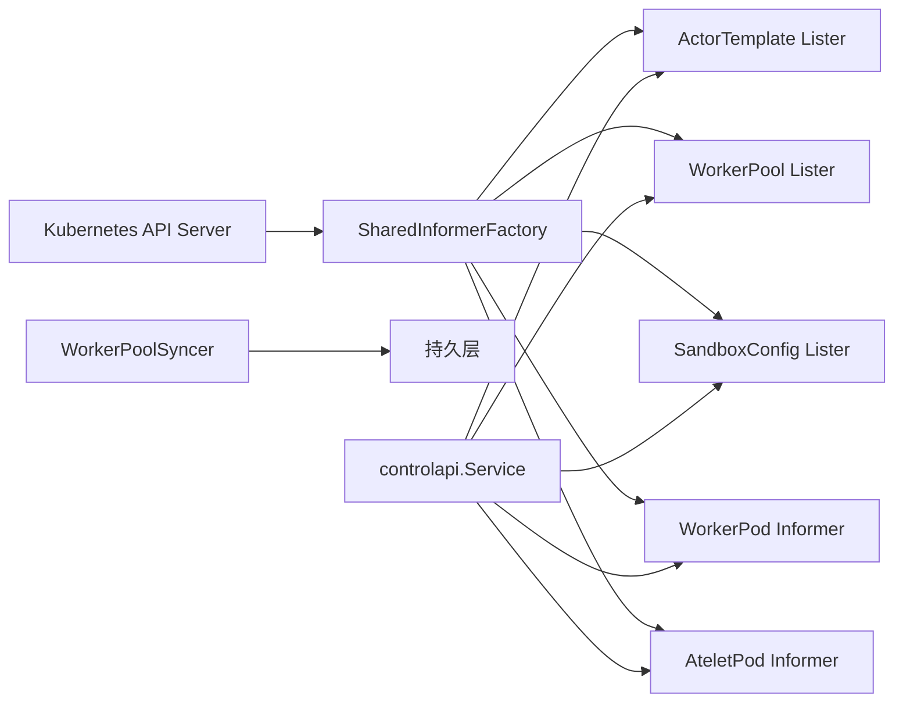
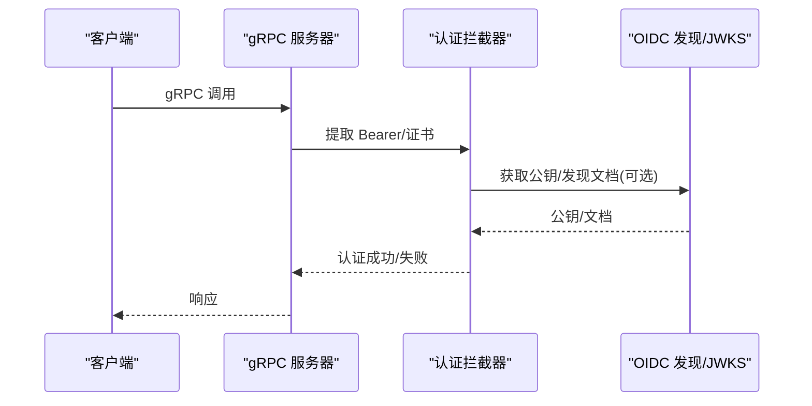
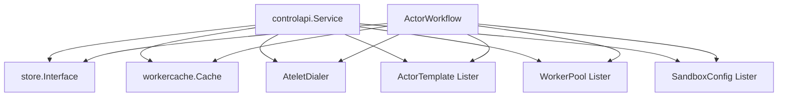

# 控制平面架构

<cite>
**本文引用的文件**   
- [main.go](file://cmd/ateapi/main.go)
- [service.go](file://cmd/ateapi/internal/controlapi/service.go)
- [create_actor.go](file://cmd/ateapi/internal/controlapi/create_actor.go)
- [resume_actor.go](file://cmd/ateapi/internal/controlapi/resume_actor.go)
- [suspend_actor.go](file://cmd/ateapi/internal/controlapi/suspend_actor.go)
- [workflow.go](file://cmd/ateapi/internal/controlapi/workflow.go)
- [workflow_resume.go](file://cmd/ateapi/internal/controlapi/workflow_resume.go)
- [workflow_suspend.go](file://cmd/ateapi/internal/controlapi/workflow_suspend.go)
- [store.go](file://cmd/ateapi/internal/store/store.go)
- [ateredis.go](file://cmd/ateapi/internal/store/ateredis/ateredis.go)
- [server.go](file://internal/ateapiauth/server.go)
- [ateapi.proto](file://pkg/proto/ateapipb/ateapi.proto)
- [actor.go](file://internal/resources/actor.go)
- [architecture.md](file://docs/architecture.md)
</cite>

## 目录
1. [简介](#简介)
2. [项目结构](#项目结构)
3. [核心组件](#核心组件)
4. [架构总览](#架构总览)
5. [详细组件分析](#详细组件分析)
6. [依赖关系分析](#依赖关系分析)
7. [性能考量](#性能考量)
8. [故障排查指南](#故障排查指南)
9. [结论](#结论)
10. [附录](#附录)

## 简介
本文件面向开发者与平台工程师，系统性阐述 Agent Substrate 控制平面的设计与实现，重点覆盖 ate-api-server 的 gRPC API 架构、状态存储（Redis/Valkey）集成、调度器算法与工作流引擎，以及 Actor 生命周期管理的关键流程。同时说明控制平面如何与 Kubernetes CRD 系统集成、如何处理高并发请求与低延迟响应，并给出认证授权机制、错误处理策略与性能优化方案。

## 项目结构
控制平面以 ate-api-server 为核心，提供 gRPC 接口，协调工作流执行、调度与持久化；通过 Informer 监听 Kubernetes CRD（ActorTemplate、WorkerPool、SandboxConfig），结合本地缓存与 Redis/Valkey 完成高性能读写；节点侧由 atelet + ateom 负责沙箱进程的 Checkpoint/Restore。

图表来源
- [main.go:182-196](file://cmd/ateapi/main.go#L182-L196)
- [service.go:25-56](file://cmd/ateapi/internal/controlapi/service.go#L25-L56)
- [workflow.go:131-163](file://cmd/ateapi/internal/controlapi/workflow.go#L131-L163)
- [store.go:40-118](file://cmd/ateapi/internal/store/store.go#L40-L118)
- [architecture.md:310-352](file://docs/architecture.md#L310-L352)

章节来源
- [main.go:79-206](file://cmd/ateapi/main.go#L79-L206)
- [service.go:25-56](file://cmd/ateapi/internal/controlapi/service.go#L25-L56)
- [architecture.md:308-352](file://docs/architecture.md#L308-L352)

## 核心组件
- gRPC API 与服务装配：注册 Control、SessionIdentity、Debug 服务，挂载认证与可观测性拦截器。
- 控制服务 Service：聚合持久层、工作器缓存、Informer Lister、Atelet 拨号器与工作流引擎。
- 工作流引擎：基于通用步骤接口的有向无环图执行器，支持幂等、前置条件校验、指数退避重试。
- 持久层 Interface：定义 Actor/Worker/Atespace 的 CRUD、分页、Watch 与分布式锁能力。
- Redis/Valkey 集成：连接、TLS、IAM 鉴权、Ping 重试与健康检查。
- 认证授权：mTLS/JWT 双模式，Bearer Token 校验与 OIDC 发现。
- 资源模型与 DNS：Actor 命名空间隔离（Atespace）、统一 DNS 后缀解析。

章节来源
- [main.go:182-206](file://cmd/ateapi/main.go#L182-L206)
- [service.go:25-56](file://cmd/ateapi/internal/controlapi/service.go#L25-L56)
- [workflow.go:36-108](file://cmd/ateapi/internal/controlapi/workflow.go#L36-L108)
- [store.go:40-118](file://cmd/ateapi/internal/store/store.go#L40-L118)
- [server.go:35-70](file://internal/ateapiauth/server.go#L35-L70)
- [actor.go:22-39](file://internal/resources/actor.go#L22-L39)

## 架构总览
控制平面将“声明式配置”（CRD）与“动态实例状态”（Redis/Valkey）解耦：
- 声明式：WorkerPool、ActorTemplate、SandboxConfig 由 Kubernetes 管理，控制器维护期望态。
- 动态：Actor/Worker 的高频状态变更走 Redis/Valkey，避免压垮 API Server。
- 网络面：atenet 路由根据 Host 头解析 Actor 名称，必要时触发 ResumeActor 工作流。

图表来源
- [workflow_resume.go:165-194](file://cmd/ateapi/internal/controlapi/workflow_resume.go#L165-L194)
- [workflow_resume.go:296-446](file://cmd/ateapi/internal/controlapi/workflow_resume.go#L296-L446)
- [workflow.go:165-194](file://cmd/ateapi/internal/controlapi/workflow.go#L165-L194)
- [architecture.md:359-384](file://docs/architecture.md#L359-L384)

## 详细组件分析

### gRPC API 服务器与服务装配
- 入口 main 初始化日志、Tracing、Metrics，加载参数与环境变量覆盖。
- 构建 Redis/Valkey 集群客户端（TLS、可选 IAM 鉴权、带 Ping 重试）。
- 创建 Kubernetes clientset 与 ate 自定义资源 clientset，启动 Informer 工厂与 Listers。
- 组装 controlapi.Service，注册 Control/SessionIdentity/Debug 服务，挂载认证与可观测性拦截器。
- 暴露 Metrics 与 Readyz 端点。

图表来源
- [main.go:79-206](file://cmd/ateapi/main.go#L79-L206)
- [service.go:25-56](file://cmd/ateapi/internal/controlapi/service.go#L25-L56)
- [server.go:81-103](file://internal/ateapiauth/server.go#L81-L103)

章节来源
- [main.go:79-206](file://cmd/ateapi/main.go#L79-L206)

### 状态存储设计（Redis/Valkey 集成）
- 连接与 TLS：支持自定义 CA、ServerName、双向证书；默认启用 TLS1.2+。
- IAM 鉴权：可选使用 Google IAM 凭据作为访问令牌提供者。
- 健康检查：带退避的 Ping 重试，确保启动时可达。
- 接口契约：Interface 定义了 Actor/Worker/Atespace 的增删改查、分页、Watch 与分布式锁（AcquireLock/ReleaseLock）。

图表来源
- [main.go:248-331](file://cmd/ateapi/main.go#L248-L331)
- [store.go:40-118](file://cmd/ateapi/internal/store/store.go#L40-L118)

章节来源
- [main.go:248-331](file://cmd/ateapi/main.go#L248-L331)
- [store.go:40-118](file://cmd/ateapi/internal/store/store.go#L40-L118)
- [ateredis.go](file://cmd/ateapi/internal/store/ateredis/ateredis.go)

### 调度器算法与工作流引擎
- 工作流引擎 RunWorkflow：按顺序执行步骤，支持 IsComplete 快速前进、CheckPrerequisite 前置校验、Execute 业务逻辑与可选指数退避重试。
- 分布式锁：acquireActorLock 基于 Redis 原子操作，TTL 保护，失败则拒绝并发。
- 调度策略：从本地 worker 缓存中筛选符合模板与 Actor 选择器的空闲 Worker，优先命中本地节点快照（若存在），否则随机选取。

图表来源
- [workflow.go:36-108](file://cmd/ateapi/internal/controlapi/workflow.go#L36-L108)
- [workflow.go:256-279](file://cmd/ateapi/internal/controlapi/workflow.go#L256-L279)
- [workflow_resume.go:163-251](file://cmd/ateapi/internal/controlapi/workflow_resume.go#L163-L251)

章节来源
- [workflow.go:36-108](file://cmd/ateapi/internal/controlapi/workflow.go#L36-L108)
- [workflow.go:165-224](file://cmd/ateapi/internal/controlapi/workflow.go#L165-L224)
- [workflow_resume.go:163-251](file://cmd/ateapi/internal/controlapi/workflow_resume.go#L163-L251)

### Actor 生命周期管理
- CreateActor：校验参数、验证 ActorTemplate 与 atespace 存在、写入初始 SUSPENDED 状态。
- ResumeActor：工作流包含 LoadActorForResume → AssignWorker → CallAteletRestore → FinalizeRunning。
- SuspendActor：工作流包含 LoadActorForSuspend → MarkSuspending → CallAteletSuspend → FinalizeSuspended。
- PauseActor：工作流包含 LoadActorForPause → MarkPausing → CallAteletPause → FinalizePaused。

图表来源
- [create_actor.go:32-82](file://cmd/ateapi/internal/controlapi/create_actor.go#L32-L82)
- [resume_actor.go:29-48](file://cmd/ateapi/internal/controlapi/resume_actor.go#L29-L48)
- [suspend_actor.go:29-48](file://cmd/ateapi/internal/controlapi/suspend_actor.go#L29-L48)
- [workflow_resume.go:165-194](file://cmd/ateapi/internal/controlapi/workflow_resume.go#L165-L194)
- [workflow_suspend.go:196-224](file://cmd/ateapi/internal/controlapi/workflow_suspend.go#L196-L224)
- [architecture.md:386-396](file://docs/architecture.md#L386-L396)

章节来源
- [create_actor.go:32-82](file://cmd/ateapi/internal/controlapi/create_actor.go#L32-L82)
- [resume_actor.go:29-48](file://cmd/ateapi/internal/controlapi/resume_actor.go#L29-L48)
- [suspend_actor.go:29-48](file://cmd/ateapi/internal/controlapi/suspend_actor.go#L29-L48)
- [workflow_resume.go:165-194](file://cmd/ateapi/internal/controlapi/workflow_resume.go#L165-L194)
- [workflow_suspend.go:196-224](file://cmd/ateapi/internal/controlapi/workflow_suspend.go#L196-L224)

### 与 Kubernetes CRD 系统集成
- Informer 工厂：监听 ActorTemplate、WorkerPool、SandboxConfig，提供只读 Lister。
- 节点 Pod 观察：WorkerPod/AteletPod Informer 用于建立 atelet 拨号表。
- 同步器：WorkerPoolSyncer 将 Worker 状态同步到持久层，供调度器使用。
- 资源模型：ActorTemplate/WorkerPool 为声明式配置，Actor/Worker 为运行时状态。

图表来源
- [main.go:133-155](file://cmd/ateapi/main.go#L133-L155)
- [service.go:37-56](file://cmd/ateapi/internal/controlapi/service.go#L37-L56)
- [architecture.md:215-265](file://docs/architecture.md#L215-L265)

章节来源
- [main.go:133-155](file://cmd/ateapi/main.go#L133-L155)
- [service.go:37-56](file://cmd/ateapi/internal/controlapi/service.go#L37-L56)
- [architecture.md:215-265](file://docs/architecture.md#L215-L265)

### 认证与授权机制
- 传输层 mTLS：服务端证书加载与可选客户端证书校验。
- 应用层 JWT：可选 ModeJWT，要求 Bearer Token，支持 OIDC Discovery 与 JWKS 拉取（含 In-cluster SA token 注入）。
- 会话身份：SessionIdentity 服务签发 Session JWT/Cert，绑定运行中的 Pod 与 Actor 会话。

图表来源
- [main.go:171-196](file://cmd/ateapi/main.go#L171-L196)
- [server.go:81-103](file://internal/ateapiauth/server.go#L81-L103)
- [server.go:141-152](file://internal/ateapiauth/server.go#L141-L152)
- [ateapi.proto:358-416](file://pkg/proto/ateapipb/ateapi.proto#L358-L416)

章节来源
- [main.go:171-196](file://cmd/ateapi/main.go#L171-L196)
- [server.go:81-103](file://internal/ateapiauth/server.go#L81-L103)
- [server.go:141-152](file://internal/ateapiauth/server.go#L141-L152)
- [ateapi.proto:358-416](file://pkg/proto/ateapipb/ateapi.proto#L358-L416)

### 错误处理策略
- 预检失败：InvalidArgument/FailedPrecondition 用于参数与状态机不合法。
- 并发冲突：ErrPersistenceRetry 映射为 Aborted，提示客户端重试。
- 缺失资源：NotFound 用于 Actor/Worker 不存在。
- 工作流幂等：IsComplete 快速前进，避免重复执行；分布式锁防止跨进程并发。

章节来源
- [resume_actor.go:29-48](file://cmd/ateapi/internal/controlapi/resume_actor.go#L29-L48)
- [suspend_actor.go:29-48](file://cmd/ateapi/internal/controlapi/suspend_actor.go#L29-L48)
- [workflow.go:110-129](file://cmd/ateapi/internal/controlapi/workflow.go#L110-L129)
- [workflow.go:256-279](file://cmd/ateapi/internal/controlapi/workflow.go#L256-L279)

### 性能优化方案
- 本地缓存：workercache 缓存 Worker 列表，减少频繁查询。
- 乐观锁：UpdateActor/UpdateWorker 基于 version 字段，降低锁粒度。
- 指数退避：对易冲突步骤自动重试，提升吞吐。
- 直连数据面：绕过 Kubernetes API 最终一致性路径，缩短激活延迟。
- 指标与追踪：OpenTelemetry 埋点，Prometheus 指标导出。

章节来源
- [main.go:126-131](file://cmd/ateapi/main.go#L126-L131)
- [store.go:40-118](file://cmd/ateapi/internal/store/store.go#L40-L118)
- [workflow.go:110-129](file://cmd/ateapi/internal/controlapi/workflow.go#L110-L129)
- [architecture.md:343-352](file://docs/architecture.md#L343-L352)

## 依赖关系分析
- 外部依赖：Redis/Valkey（go-redis）、Kubernetes（client-go/informers）、OpenTelemetry、gRPC。
- 内部耦合：Service 依赖持久层、缓存、Informer Lister、Atelet 拨号器与工作流；工作流依赖持久层与 K8s 资源读取。
- 潜在循环：无直接循环导入；通过接口与包边界解耦。

图表来源
- [service.go:25-56](file://cmd/ateapi/internal/controlapi/service.go#L25-L56)
- [workflow.go:131-163](file://cmd/ateapi/internal/controlapi/workflow.go#L131-L163)

章节来源
- [service.go:25-56](file://cmd/ateapi/internal/controlapi/service.go#L25-L56)
- [workflow.go:131-163](file://cmd/ateapi/internal/controlapi/workflow.go#L131-L163)

## 性能考量
- 激活延迟目标：在数据面绕过 K8s 最终一致性，配合本地缓存与原子分配，达成亚百毫秒级激活。
- 高并发：分布式锁限流单 Actor 并发操作；工作流步骤幂等与快速前进避免重复计算。
- 存储优化：Redis/Valkey 集群横向扩展，短事务与乐观锁减少热点竞争。
- 可观测性：全链路追踪与指标采集便于定位瓶颈。

[本节为通用指导，无需代码引用]

## 故障排查指南
- 无法连接 Redis/Valkey：检查 TLS 配置、CA 证书、ServerName、IAM 凭据与网络连通性；关注启动阶段 Ping 重试日志。
- 并发冲突导致 Aborted：客户端应遵循重试策略；确认是否存在同一 Actor 的多写路径。
- Worker 不可用或 Pod 消失：工作流会尝试 Crash Actor 并清理状态；检查 WorkerPool 与节点健康。
- 认证失败：确认 mTLS 证书链与 JWT Bearer Token；核对 OIDC Issuer/JWKS 可达性与域名匹配。

章节来源
- [main.go:248-331](file://cmd/ateapi/main.go#L248-L331)
- [workflow_resume.go:349-446](file://cmd/ateapi/internal/controlapi/workflow_resume.go#L349-L446)
- [workflow_suspend.go:130-168](file://cmd/ateapi/internal/controlapi/workflow_suspend.go#L130-L168)
- [server.go:141-152](file://internal/ateapiauth/server.go#L141-L152)

## 结论
控制平面通过“轻量 gRPC API + 工作流引擎 + 高性能存储”的组合，将 Actor 生命周期管理与 Kubernetes 基础设施解耦，在保证一致性的前提下显著降低激活延迟并提升吞吐。配合 atenet 的网络感知路由与节点侧 atelet/ateom 的 Checkpoint/Restore 能力，系统实现了高并发、低延迟、可扩展的 Agent 运行基座。

[本节为总结，无需代码引用]

## 附录

### API 概览（节选）
- Control：GetActor/CreateActor/UpdateActor/SuspendActor/PauseActor/ResumeActor/DeleteActor/ListWorkers/ListActors/CreateAtespace/GetAtespace/ListAtespaces/DeleteAtespace
- SessionIdentity：MintJWT/MintCert
- Debug：DebugClear

章节来源
- [ateapi.proto:25-65](file://pkg/proto/ateapipb/ateapi.proto#L25-L65)
- [ateapi.proto:331-340](file://pkg/proto/ateapipb/ateapi.proto#L331-L340)
- [ateapi.proto:358-416](file://pkg/proto/ateapipb/ateapi.proto#L358-L416)

### 资源模型与 DNS
- atespace：全局隔离边界，Actor 名称在其内唯一。
- Actor DNS：形如 <actor_name>.<atespace>.actors.resources.substrate.ate.dev，由 atenet 解析至路由器。

章节来源
- [actor.go:22-39](file://internal/resources/actor.go#L22-L39)
- [architecture.md:343-352](file://docs/architecture.md#L343-L352)
