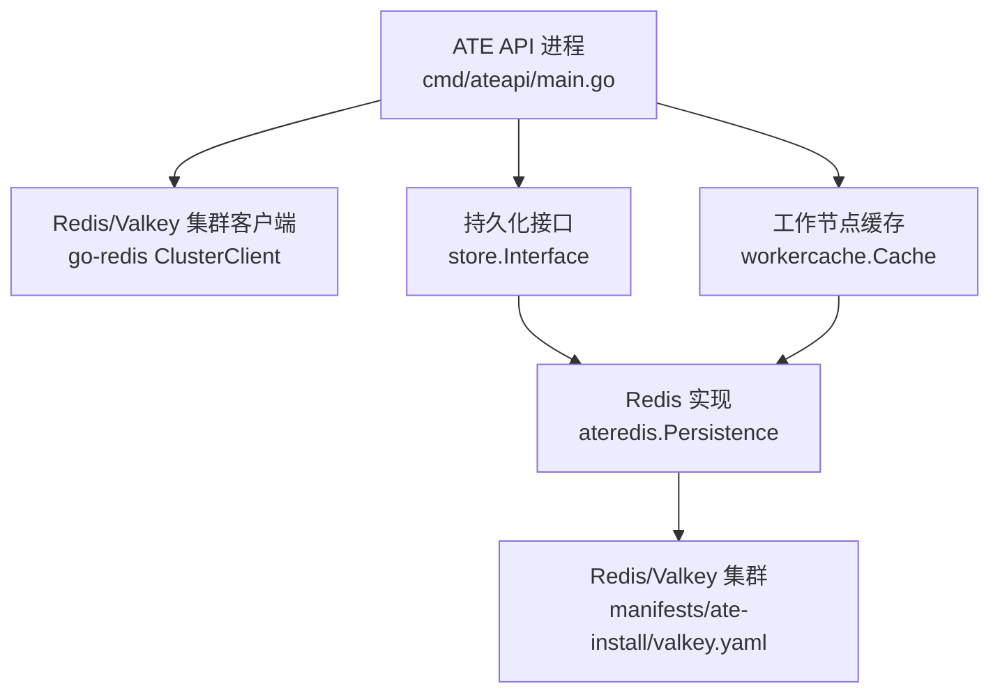
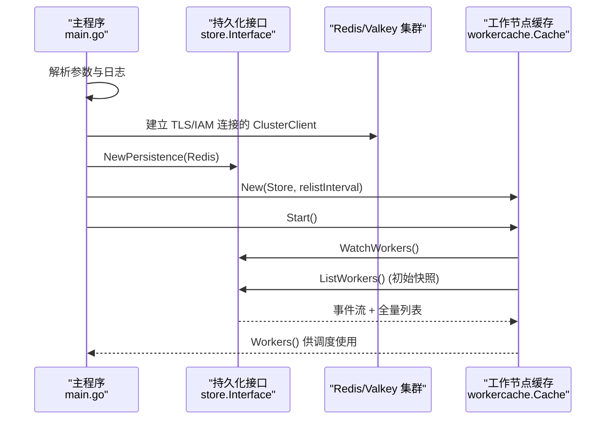
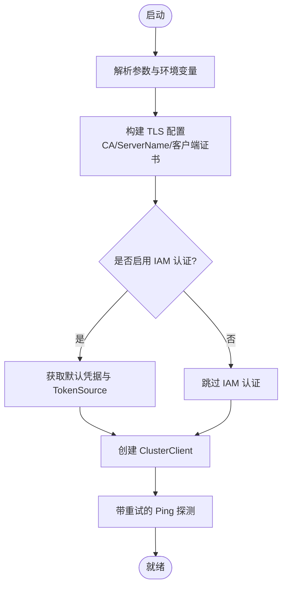
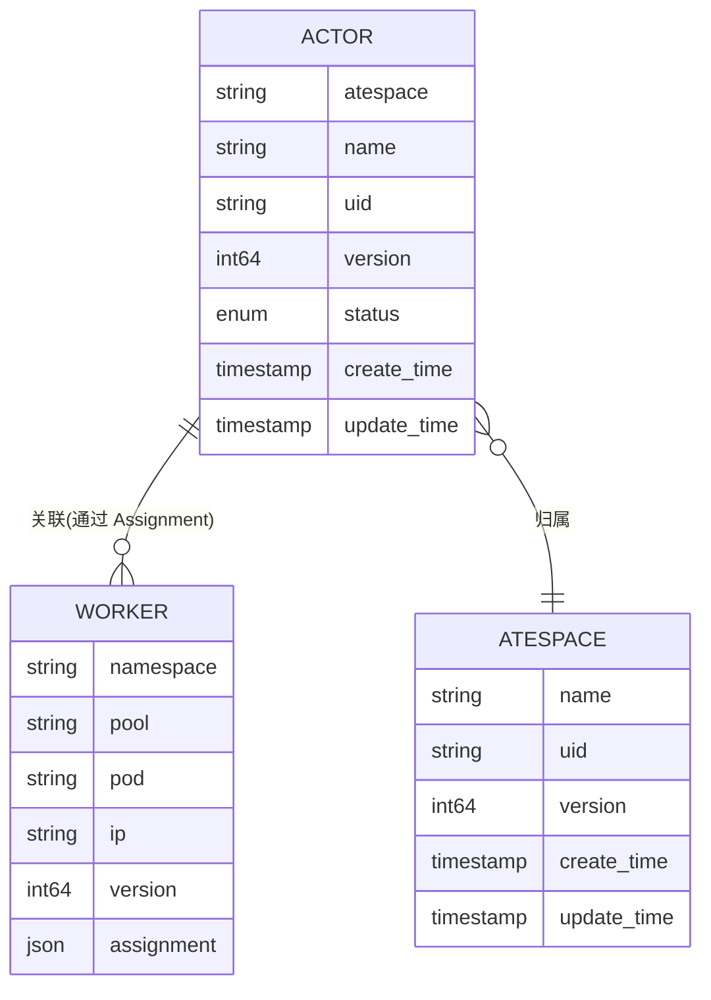
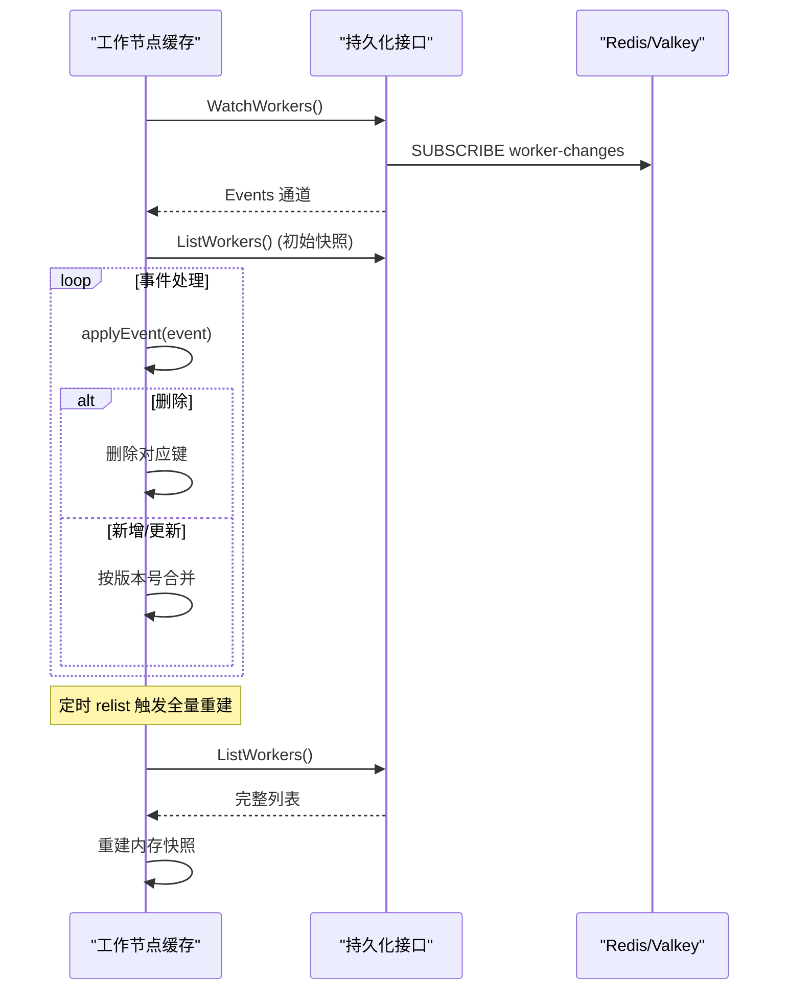
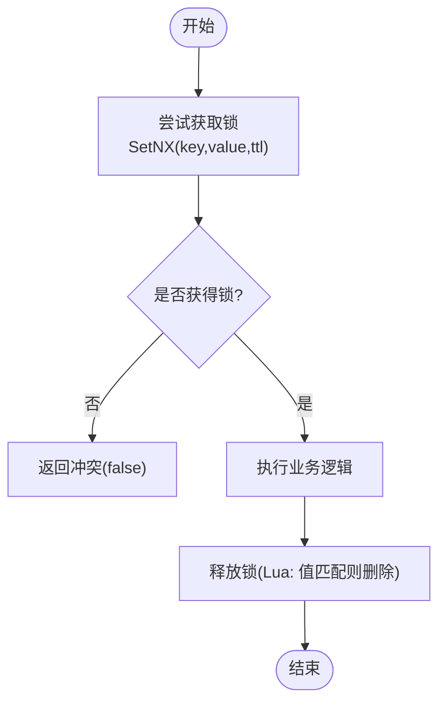
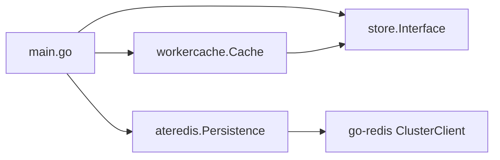

# 状态存储层

<cite>
**本文引用的文件**   
- [cmd/ateapi/main.go](file://cmd/ateapi/main.go)
- [cmd/ateapi/internal/store/store.go](file://cmd/ateapi/internal/store/store.go)
- [cmd/ateapi/internal/store/ateredis/ateredis.go](file://cmd/ateapi/internal/store/ateredis/ateredis.go)
- [cmd/ateapi/internal/workercache/workercache.go](file://cmd/ateapi/internal/workercache/workercache.go)
- [manifests/ate-install/valkey.yaml](file://manifests/ate-install/valkey.yaml)
</cite>

## 目录
1. [简介](#简介)
2. [项目结构](#项目结构)
3. [核心组件](#核心组件)
4. [架构总览](#架构总览)
5. [详细组件分析](#详细组件分析)
6. [依赖关系分析](#依赖关系分析)
7. [性能与容量规划](#性能与容量规划)
8. [故障排查指南](#故障排查指南)
9. [结论](#结论)

## 简介
本文件聚焦于 Agent Substrate 的状态存储层，围绕 Redis/Valkey 集群集成、Actor 状态数据模型与序列化、工作节点缓存机制、分布式锁与事务处理、以及故障恢复与一致性保证进行系统化说明。文档同时提供架构图、序列图与流程图，帮助读者从高层到代码级全面理解该子系统的设计与实现。

## 项目结构
状态存储层主要位于 ateapi 服务中，包含以下关键位置：
- 连接与配置：Redis/Valkey 集群地址、TLS、IAM 认证等启动参数与初始化逻辑
- 持久化接口定义：统一的 store.Interface 抽象 Actor/Atespace/Worker 的 CRUD、分页扫描、Watch 与分布式锁
- Redis 实现：基于 go-redis v9 ClusterClient 的具体实现，包括键空间设计、protojson 序列化、Lua 脚本、事务与 Pub/Sub
- 工作节点缓存：内存中的 Worker 快照，通过 WatchWorkers 事件驱动更新，并周期性全量重同步以保障最终一致

图表来源
- [cmd/ateapi/main.go:248-331](file://cmd/ateapi/main.go#L248-L331)
- [cmd/ateapi/internal/store/store.go:40-118](file://cmd/ateapi/internal/store/store.go#L40-L118)
- [cmd/ateapi/internal/store/ateredis/ateredis.go:76-88](file://cmd/ateapi/internal/store/ateredis/ateredis.go#L76-L88)
- [cmd/ateapi/internal/workercache/workercache.go:37-60](file://cmd/ateapi/internal/workercache/workercache.go#L37-L60)
- [manifests/ate-install/valkey.yaml:36-80](file://manifests/ate-install/valkey.yaml#L36-L80)

章节来源
- [cmd/ateapi/main.go:56-77](file://cmd/ateapi/main.go#L56-L77)
- [cmd/ateapi/internal/store/store.go:15-38](file://cmd/ateapi/internal/store/store.go#L15-L38)

## 核心组件
- 持久化接口（store.Interface）：统一抽象 Actor、Atespace、Worker 的增删改查、分页扫描、变更订阅与分布式锁能力，屏蔽底层存储差异
- Redis 实现（ateredis.Persistence）：基于 Redis/Valkey 集群模式的数据存取，采用 protojson 序列化，使用 WATCH 事务与 Lua 脚本保证原子性与安全性
- 工作节点缓存（workercache.Cache）：维护所有 Worker 的内存快照，通过 WatchWorkers 事件增量更新，配合周期性 relist 恢复丢失事件，提供 O(1) 读取路径

章节来源
- [cmd/ateapi/internal/store/store.go:40-118](file://cmd/ateapi/internal/store/store.go#L40-L118)
- [cmd/ateapi/internal/store/ateredis/ateredis.go:76-88](file://cmd/ateapi/internal/store/ateredis/ateredis.go#L76-L88)
- [cmd/ateapi/internal/workercache/workercache.go:37-60](file://cmd/ateapi/internal/workercache/workercache.go#L37-L60)

## 架构总览
下图展示了 ATE API 如何构建 Redis/Valkey 集群连接、注入持久化与缓存，并在运行时通过 Watch 与 Relist 维持工作节点视图的一致性。

图表来源
- [cmd/ateapi/main.go:248-331](file://cmd/ateapi/main.go#L248-L331)
- [cmd/ateapi/internal/store/store.go:97-102](file://cmd/ateapi/internal/store/store.go#L97-L102)
- [cmd/ateapi/internal/workercache/workercache.go:62-73](file://cmd/ateapi/internal/workercache/workercache.go#L62-L73)

## 详细组件分析

### Redis/Valkey 集群集成方案
- 连接与 TLS
  - 支持自定义 CA、ServerName 校验与双向 TLS（客户端证书），最小 TLS 版本为 1.2
  - 通过命令行参数或环境变量注入连接信息
- IAM 认证
  - 可选启用 Google IAM 认证，动态获取访问令牌作为 Redis 用户名与密码
- 集群客户端
  - 使用 go-redis v9 的 ClusterClient，自动发现分片与路由
  - 启动时带重试的 Ping 探测，确保服务可用后再继续初始化

图表来源
- [cmd/ateapi/main.go:248-331](file://cmd/ateapi/main.go#L248-L331)
- [cmd/ateapi/main.go:287-314](file://cmd/ateapi/main.go#L287-L314)
- [cmd/ateapi/main.go:316-331](file://cmd/ateapi/main.go#L316-L331)

章节来源
- [cmd/ateapi/main.go:56-77](file://cmd/ateapi/main.go#L56-L77)
- [cmd/ateapi/main.go:248-331](file://cmd/ateapi/main.go#L248-L331)
- [manifests/ate-install/valkey.yaml:36-80](file://manifests/ate-install/valkey.yaml#L36-L80)

### Actor 状态数据模型、序列化与索引策略
- 键空间设计
  - Actor 键：actor:<atespace>:<name>
  - Worker 键：worker:<namespace>:<pool-name>:<pod-name>
  - Atespace 键：atespace:<name>
- 序列化格式
  - 使用 protojson 将 Protobuf 对象序列化为 JSON 字符串存储
  - 便于在 Redis Lua 脚本中进行轻量操作（如内联 Worker 状态）
- 索引与分页
  - 使用 SCAN 按模式遍历键空间，支持按 atespace 范围扫描
  - 分页 token 包含当前分片地址哈希与游标，跨分片稳定迭代
- 集群限制与数据建模
  - 单条“动作”不能跨多个 cluster slot 原子操作；因此将 Worker 状态内联到 Actor 中以规避跨 slot 原子性难题
  - Lua 非 ACID，需考虑幂等与回退策略

图表来源
- [cmd/ateapi/internal/store/ateredis/ateredis.go:17-39](file://cmd/ateapi/internal/store/ateredis/ateredis.go#L17-L39)
- [cmd/ateapi/internal/store/ateredis/ateredis.go:90-106](file://cmd/ateapi/internal/store/ateredis/ateredis.go#L90-L106)
- [cmd/ateapi/internal/store/ateredis/ateredis.go:630-702](file://cmd/ateapi/internal/store/ateredis/ateredis.go#L630-L702)

章节来源
- [cmd/ateapi/internal/store/ateredis/ateredis.go:17-39](file://cmd/ateapi/internal/store/ateredis/ateredis.go#L17-L39)
- [cmd/ateapi/internal/store/ateredis/ateredis.go:90-106](file://cmd/ateapi/internal/store/ateredis/ateredis.go#L90-L106)
- [cmd/ateapi/internal/store/ateredis/ateredis.go:630-702](file://cmd/ateapi/internal/store/ateredis/ateredis.go#L630-L702)

### 工作节点缓存机制与一致性保证
- 缓存结构
  - 内存 map 保存所有 Worker 快照，键为 namespace:pod
  - 对外暴露 Workers() 返回只读快照，O(1) 读取
- 事件驱动更新
  - 通过 WatchWorkers 订阅 worker-changes 通道，收到 Created/Updated/Deleted 事件后应用至本地 map
  - 版本号比较避免旧事件覆盖新状态
- 失效与恢复
  - 周期性 relist（默认 5 分钟）拉取全量列表，重建内存快照，修复漏发事件导致的漂移
  - 当 watch 通道关闭或错误时，指数退避重连并重做全量同步
- 一致性语义
  - 最终一致：事件可能丢失但会被 relist 修正
  - 强一致：对单个 Worker 的写操作通过 WATCH 事务保证乐观并发控制

图表来源
- [cmd/ateapi/internal/workercache/workercache.go:62-73](file://cmd/ateapi/internal/workercache/workercache.go#L62-L73)
- [cmd/ateapi/internal/workercache/workercache.go:129-160](file://cmd/ateapi/internal/workercache/workercache.go#L129-L160)
- [cmd/ateapi/internal/workercache/workercache.go:182-195](file://cmd/ateapi/internal/workercache/workercache.go#L182-L195)
- [cmd/ateapi/internal/store/ateredis/ateredis.go:255-297](file://cmd/ateapi/internal/store/ateredis/ateredis.go#L255-L297)

章节来源
- [cmd/ateapi/internal/workercache/workercache.go:37-60](file://cmd/ateapi/internal/workercache/workercache.go#L37-L60)
- [cmd/ateapi/internal/workercache/workercache.go:129-160](file://cmd/ateapi/internal/workercache/workercache.go#L129-L160)
- [cmd/ateapi/internal/workercache/workercache.go:182-195](file://cmd/ateapi/internal/workercache/workercache.go#L182-L195)
- [cmd/ateapi/internal/store/ateredis/ateredis.go:255-297](file://cmd/ateapi/internal/store/ateredis/ateredis.go#L255-L297)

### 分布式锁、事务处理与故障恢复
- 分布式锁
  - 获取：SETNX key value EX ttl，返回是否成功
  - 释放：Lua 脚本原子判断值相等后删除，防止误删他人持有的锁
  - 非可重入：同一 token 再次获取会失败
- 事务处理
  - 使用 WATCH 监视目标键，在事务中读取当前版本并与期望版本比较，不一致则返回重试信号
  - 写入阶段使用管道批量执行 SET，减少网络往返
- 故障恢复
  - 版本冲突或事务失败返回 ErrPersistenceRetry，上层应重试
  - 删除 Actor 前检查状态必须为 SUSPENDED 或 CRASHED，否则拒绝
  - 删除 Atespace 前检查是否为空，否则拒绝

图表来源
- [cmd/ateapi/internal/store/ateredis/ateredis.go:770-792](file://cmd/ateapi/internal/store/ateredis/ateredis.go#L770-L792)

章节来源
- [cmd/ateapi/internal/store/ateredis/ateredis.go:770-792](file://cmd/ateapi/internal/store/ateredis/ateredis.go#L770-L792)
- [cmd/ateapi/internal/store/ateredis/ateredis.go:408-466](file://cmd/ateapi/internal/store/ateredis/ateredis.go#L408-L466)
- [cmd/ateapi/internal/store/ateredis/ateredis.go:523-584](file://cmd/ateapi/internal/store/ateredis/ateredis.go#L523-L584)
- [cmd/ateapi/internal/store/ateredis/ateredis.go:481-521](file://cmd/ateapi/internal/store/ateredis/ateredis.go#L481-L521)
- [cmd/ateapi/internal/store/ateredis/ateredis.go:174-208](file://cmd/ateapi/internal/store/ateredis/ateredis.go#L174-L208)

### 数据模型定义与访问接口示例
- 数据模型
  - Actor：标识（atespace+name）、UID、版本、状态、时间戳等
  - Worker：命名空间、池名、Pod 名、IP、分配信息、版本等
  - Atespace：全局唯一名称与元数据
- 访问接口（示例路径）
  - 获取 Actor：GetActor(ctx, atespace, name)
  - 创建 Actor：CreateActor(ctx, actor)
  - 更新 Actor：UpdateActor(ctx, actor, expectedVersion)
  - 删除 Actor：DeleteActor(ctx, atespace, name)
  - 列出 Actor：ListActors(ctx, atespace, pageSize, pageToken)
  - 注册 Worker：CreateWorker(ctx, worker)
  - 更新 Worker：UpdateWorker(ctx, worker, expectedVersion)
  - 删除 Worker：DeleteWorker(ctx, namespace, pool, pod)
  - 列出 Worker：ListWorkers(ctx, pageSize, pageToken)
  - 订阅 Worker 变更：WatchWorkers(ctx) -> WorkerWatch.Events
  - 分布式锁：AcquireLock(ctx, key, value, ttl), ReleaseLock(ctx, key, value)

章节来源
- [cmd/ateapi/internal/store/store.go:40-118](file://cmd/ateapi/internal/store/store.go#L40-L118)
- [cmd/ateapi/internal/store/ateredis/ateredis.go:313-358](file://cmd/ateapi/internal/store/ateredis/ateredis.go#L313-L358)
- [cmd/ateapi/internal/store/ateredis/ateredis.go:360-406](file://cmd/ateapi/internal/store/ateredis/ateredis.go#L360-L406)
- [cmd/ateapi/internal/store/ateredis/ateredis.go:408-466](file://cmd/ateapi/internal/store/ateredis/ateredis.go#L408-L466)
- [cmd/ateapi/internal/store/ateredis/ateredis.go:468-479](file://cmd/ateapi/internal/store/ateredis/ateredis.go#L468-L479)
- [cmd/ateapi/internal/store/ateredis/ateredis.go:586-600](file://cmd/ateapi/internal/store/ateredis/ateredis.go#L586-L600)
- [cmd/ateapi/internal/store/ateredis/ateredis.go:255-297](file://cmd/ateapi/internal/store/ateredis/ateredis.go#L255-L297)
- [cmd/ateapi/internal/store/ateredis/ateredis.go:770-792](file://cmd/ateapi/internal/store/ateredis/ateredis.go#L770-L792)

## 依赖关系分析
- 模块耦合
  - main.go 负责连接 Redis、构造 Persistence 与 Cache，并将它们注入控制面服务
  - ateredis 依赖 go-redis ClusterClient 与 protojson
  - workercache 依赖 store.Interface 提供的 WatchWorkers 与 ListWorkers
- 外部依赖
  - Redis/Valkey 集群部署由 manifests/ate-install/valkey.yaml 描述，开启集群模式与持久化
- 潜在循环依赖
  - 无直接循环依赖；缓存仅消费接口，不反向依赖具体实现

图表来源
- [cmd/ateapi/main.go:126-131](file://cmd/ateapi/main.go#L126-L131)
- [cmd/ateapi/internal/store/store.go:40-118](file://cmd/ateapi/internal/store/store.go#L40-L118)
- [cmd/ateapi/internal/store/ateredis/ateredis.go:76-88](file://cmd/ateapi/internal/store/ateredis/ateredis.go#L76-L88)
- [cmd/ateapi/internal/workercache/workercache.go:37-60](file://cmd/ateapi/internal/workercache/workercache.go#L37-L60)

章节来源
- [cmd/ateapi/main.go:126-131](file://cmd/ateapi/main.go#L126-L131)
- [cmd/ateapi/internal/store/store.go:40-118](file://cmd/ateapi/internal/store/store.go#L40-L118)
- [cmd/ateapi/internal/store/ateredis/ateredis.go:76-88](file://cmd/ateapi/internal/store/ateredis/ateredis.go#L76-L88)
- [cmd/ateapi/internal/workercache/workercache.go:37-60](file://cmd/ateapi/internal/workercache/workercache.go#L37-L60)

## 性能与容量规划
- 连接与 TLS
  - 建议复用 ClusterClient 实例，避免频繁握手开销
  - 合理设置 TLS 会话复用与超时，降低 CPU 与延迟
- 读写路径
  - 优先使用缓存的 Workers() 进行调度决策，减少 Redis 热点
  - 批量操作使用管道（如 fetchProtos）降低 RTT
- 分页与扫描
  - 调整 pageSize 平衡吞吐与延迟；跨分片扫描注意拓扑变化时的稳定性
- 事件与重同步
  - 根据业务容忍度调整 relistInterval；过短会增加 Redis 压力，过长增加漂移窗口
- 锁与事务
  - 锁 TTL 需大于最长业务耗时，避免死锁；释放务必使用 Lua 原子校验
  - 乐观并发冲突率较高场景下，适当提高重试上限与退避间隔
- 容量规划
  - 估算 Actor/Worker 数量与平均大小，结合 Valkey 内存与持久化策略（AOF）评估磁盘与内存需求
  - 关注 cluster slot 分布均匀性，避免热点键导致倾斜

[本节为通用指导，无需特定文件引用]

## 故障排查指南
- 连接问题
  - 检查 Redis/Valkey 集群地址、TLS 证书与 ServerName 配置
  - 确认 IAM 凭据可用且具备相应权限
- 事件丢失与不一致
  - 观察缓存是否周期性 relist 成功；若 Watch 通道关闭，应自动重连并重做全量同步
- 锁竞争与死锁
  - 核对锁值唯一性与 TTL 设置；确认释放逻辑使用 Lua 原子校验
- 事务冲突
  - 遇到 ErrPersistenceRetry 时，检查期望版本是否正确，必要时增加重试次数与退避
- 资源删除前置条件
  - 删除 Actor 前需处于 SUSPENDED 或 CRASHED；删除 Atespace 前需为空

章节来源
- [cmd/ateapi/main.go:248-331](file://cmd/ateapi/main.go#L248-L331)
- [cmd/ateapi/internal/workercache/workercache.go:129-160](file://cmd/ateapi/internal/workercache/workercache.go#L129-L160)
- [cmd/ateapi/internal/store/ateredis/ateredis.go:770-792](file://cmd/ateapi/internal/store/ateredis/ateredis.go#L770-L792)
- [cmd/ateapi/internal/store/ateredis/ateredis.go:408-466](file://cmd/ateapi/internal/store/ateredis/ateredis.go#L408-L466)
- [cmd/ateapi/internal/store/ateredis/ateredis.go:481-521](file://cmd/ateapi/internal/store/ateredis/ateredis.go#L481-L521)
- [cmd/ateapi/internal/store/ateredis/ateredis.go:174-208](file://cmd/ateapi/internal/store/ateredis/ateredis.go#L174-L208)

## 结论
状态存储层以 Redis/Valkey 集群为后端，通过清晰的键空间设计与 protojson 序列化，兼顾了可扩展性与可观测性。工作节点缓存利用事件驱动与周期重同步，提供了高性能的读取路径与最终一致性保障。分布式锁与乐观并发事务确保了关键操作的原子性与正确性。在生产环境中，建议结合监控指标与压测结果，持续优化连接、分页、事件与锁策略，以满足高吞吐与低延迟的业务需求。
