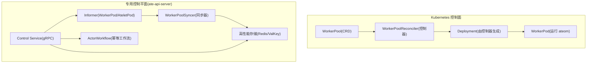
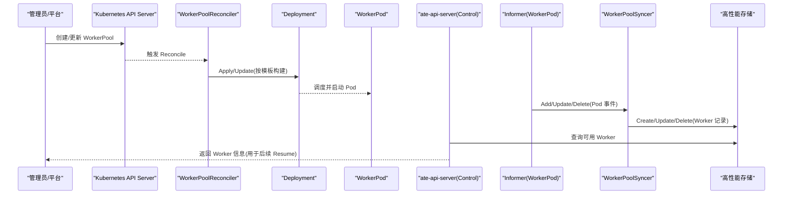
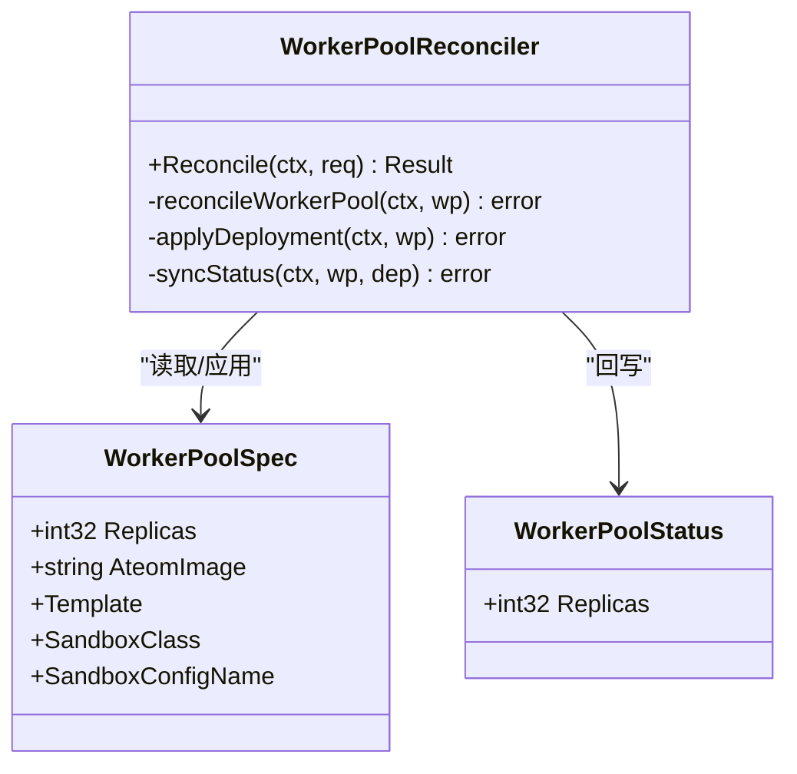
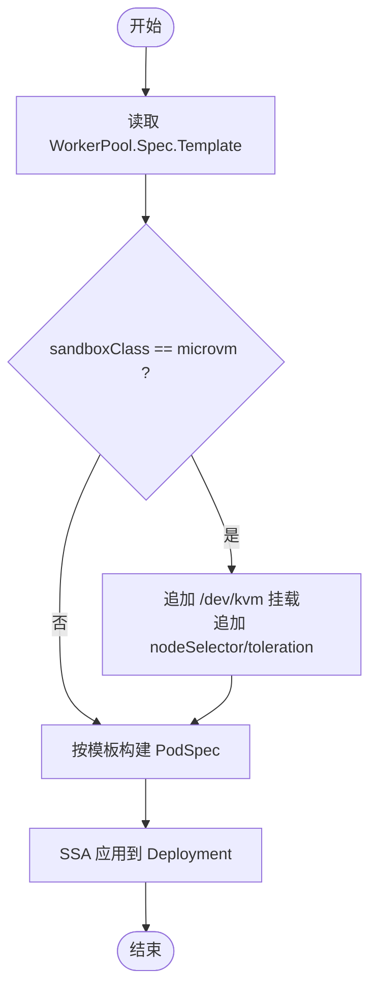
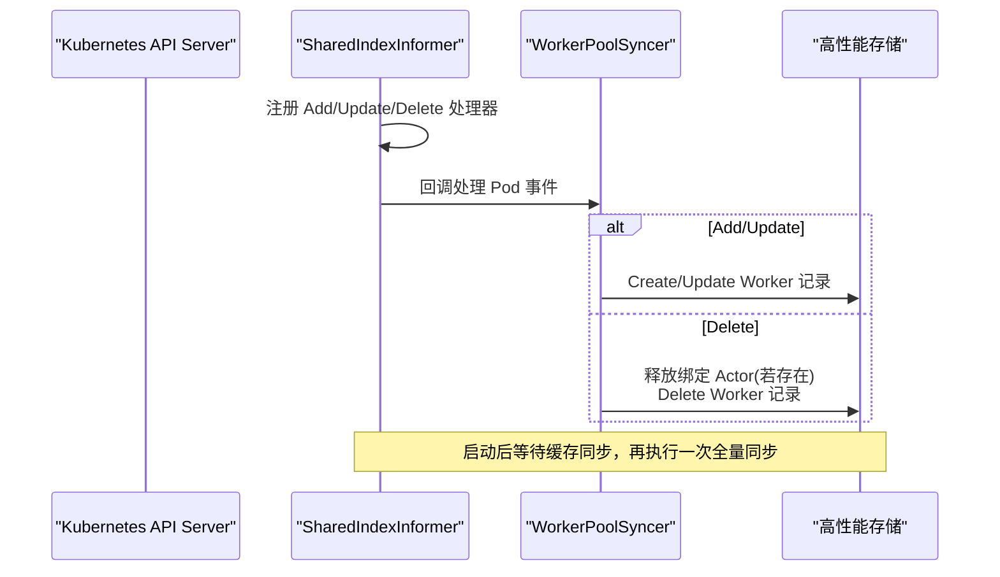
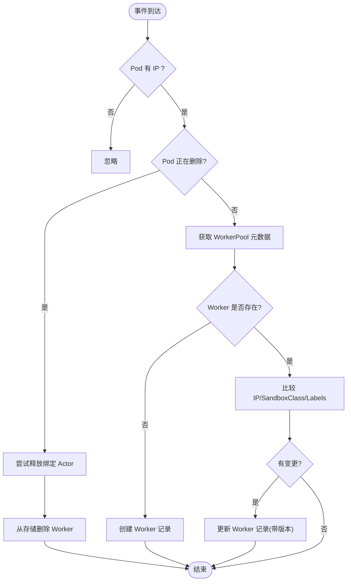
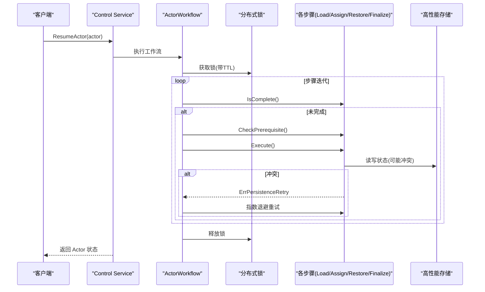
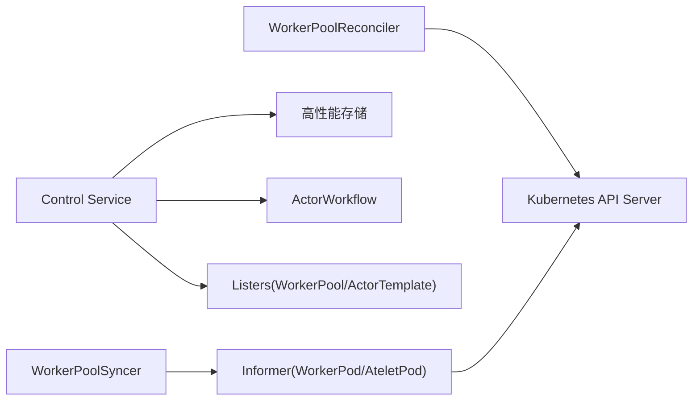

# 调度器系统

<cite>
**本文引用的文件**   
- [cmd/atecontroller/main.go](file://cmd/atecontroller/main.go)
- [cmd/atecontroller/internal/controllers/workerpool_controller.go](file://cmd/atecontroller/internal/controllers/workerpool_controller.go)
- [cmd/atecontroller/internal/controllers/workerpool_apply.go](file://cmd/atecontroller/internal/controllers/workerpool_apply.go)
- [pkg/api/v1alpha1/workerpool_types.go](file://pkg/api/v1alpha1/workerpool_types.go)
- [cmd/ateapi/internal/controlapi/informer.go](file://cmd/ateapi/internal/controlapi/informer.go)
- [cmd/ateapi/internal/controlapi/syncer.go](file://cmd/ateapi/internal/controlapi/syncer.go)
- [cmd/ateapi/internal/controlapi/service.go](file://cmd/ateapi/internal/controlapi/service.go)
- [cmd/ateapi/internal/controlapi/workflow.go](file://cmd/ateapi/internal/controlapi/workflow.go)
- [docs/architecture.md](file://docs/architecture.md)
</cite>

## 目录
1. [简介](#简介)
2. [项目结构](#项目结构)
3. [核心组件](#核心组件)
4. [架构总览](#架构总览)
5. [详细组件分析](#详细组件分析)
6. [依赖关系分析](#依赖关系分析)
7. [性能与扩缩容](#性能与扩缩容)
8. [故障排查指南](#故障排查指南)
9. [结论](#结论)
10. [附录：配置与指标](#附录配置与指标)

## 简介
本文件面向 Agent Substrate 的“工作节点分配与调度”子系统，聚焦以下目标：
- 解释 WorkerPool 控制器如何基于声明式资源（WorkerPool CRD）驱动 Deployment 的创建与状态同步。
- 阐述 Kubernetes Informer 机制在 WorkerPod 与 AteletPod 事件监听中的应用，以及控制面如何将 Pod 状态同步到内部存储。
- 说明 Actor 恢复/挂起工作流中的幂等性、冲突解决与乐观锁策略。
- 梳理当前调度决策因素（CPU、内存、亲和性与容忍度、节点选择），并给出扩缩容触发条件与可观测性建议。
- 提供调度策略配置示例与监控指标说明。

## 项目结构
本项目采用“Kubernetes 控制面 + 专用控制平面服务”的双层模型：
- 控制面（atecontroller）：通过 controller-runtime 管理 WorkerPool CRD，将其映射为 Deployment，实现“池化预热”的工作节点供给。
- 专用控制平面（ate-api-server）：维护 Actor/Worker 的高频状态，使用 Informer 监听 Pod 事件，将 Worker 状态同步到高性能存储，并在 Resume/Suspend 流程中完成原子分配与恢复。

图表来源
- [cmd/atecontroller/main.go:82-105](file://cmd/atecontroller/main.go#L82-L105)
- [cmd/atecontroller/internal/controllers/workerpool_controller.go:45-120](file://cmd/atecontroller/internal/controllers/workerpool_controller.go#L45-L120)
- [cmd/ateapi/internal/controlapi/informer.go:35-75](file://cmd/ateapi/internal/controlapi/informer.go#L35-L75)
- [cmd/ateapi/internal/controlapi/syncer.go:50-101](file://cmd/ateapi/internal/controlapi/syncer.go#L50-L101)
- [docs/architecture.md:271-306](file://docs/architecture.md#L271-L306)

章节来源
- [cmd/atecontroller/main.go:82-105](file://cmd/atecontroller/main.go#L82-L105)
- [docs/architecture.md:271-306](file://docs/architecture.md#L271-L306)

## 核心组件
- WorkerPool CRD 与模板：定义副本数、容器镜像、调度与资源模板、沙箱类别等。
- WorkerPool 控制器：将 WorkerPool 声明式规格应用到 Deployment，并同步状态。
- Informer 与同步器：监听 WorkerPod 与 AteletPod 事件，将 Worker 记录写入/更新到高性能存储。
- Actor 工作流：Resume/Suspend/Pause 的幂等步骤编排，含锁、前置校验与重试。

章节来源
- [pkg/api/v1alpha1/workerpool_types.go:22-96](file://pkg/api/v1alpha1/workerpool_types.go#L22-L96)
- [cmd/atecontroller/internal/controllers/workerpool_controller.go:45-120](file://cmd/atecontroller/internal/controllers/workerpool_controller.go#L45-L120)
- [cmd/ateapi/internal/controlapi/informer.go:35-75](file://cmd/ateapi/internal/controlapi/informer.go#L35-L75)
- [cmd/ateapi/internal/controlapi/syncer.go:103-182](file://cmd/ateapi/internal/controlapi/syncer.go#L103-L182)
- [cmd/ateapi/internal/controlapi/workflow.go:165-224](file://cmd/ateapi/internal/controlapi/workflow.go#L165-L224)

## 架构总览
下图展示了从声明式 WorkerPool 到实际 WorkerPod 的供给链路，以及控制面对 Worker 状态的同步路径。

图表来源
- [cmd/atecontroller/internal/controllers/workerpool_controller.go:73-112](file://cmd/atecontroller/internal/controllers/workerpool_controller.go#L73-L112)
- [cmd/atecontroller/internal/controllers/workerpool_apply.go:30-83](file://cmd/atecontroller/internal/controllers/workerpool_apply.go#L30-L83)
- [cmd/ateapi/internal/controlapi/informer.go:54-75](file://cmd/ateapi/internal/controlapi/informer.go#L54-L75)
- [cmd/ateapi/internal/controlapi/syncer.go:50-101](file://cmd/ateapi/internal/controlapi/syncer.go#L50-L101)

## 详细组件分析

### WorkerPool 控制器与 SSA 应用
- 职责：读取 WorkerPool 对象，调用 apply 配置构建 Deployment，并通过 FieldOwner 进行字段所有权管理；随后读取 Deployment 状态回写 WorkerPool.Status.Replicas。
- 幂等性：基于 SSA（Server-Side Apply）与 FieldOwner，避免多控制器冲突；重复 Apply 不会产生多余变更。
- 状态同步：仅当 Status 变化时更新，减少不必要的写放大。

图表来源
- [cmd/atecontroller/internal/controllers/workerpool_controller.go:45-120](file://cmd/atecontroller/internal/controllers/workerpool_controller.go#L45-L120)
- [pkg/api/v1alpha1/workerpool_types.go:54-96](file://pkg/api/v1alpha1/workerpool_types.go#L54-L96)

章节来源
- [cmd/atecontroller/internal/controllers/workerpool_controller.go:73-112](file://cmd/atecontroller/internal/controllers/workerpool_controller.go#L73-L112)
- [cmd/atecontroller/internal/controllers/workerpool_apply.go:30-83](file://cmd/atecontroller/internal/controllers/workerpool_apply.go#L30-L83)
- [pkg/api/v1alpha1/workerpool_types.go:54-96](file://pkg/api/v1alpha1/workerpool_types.go#L54-L96)

### 调度策略与 Pod 形状（NodeSelector/Tolerations/Affinity/Resources）
- 模板字段：WorkerPool.Spec.Template 支持 NodeSelector、Tolerations、PriorityClassName、NodeAffinity、Resources，这些将被映射到 Pod 的对应字段。
- 微虚拟机类增强：当 SandboxClass=microvm 时，控制器会追加 /dev/kvm 挂载与节点选择/污点容忍，确保 Pod 被调度到具备 KVM 能力的节点。
- 合并策略：模板设置与运行时增强是“叠加而非覆盖”，保证用户自定义不被意外覆盖。

图表来源
- [cmd/atecontroller/internal/controllers/workerpool_apply.go:94-130](file://cmd/atecontroller/internal/controllers/workerpool_apply.go#L94-L130)
- [cmd/atecontroller/internal/controllers/workerpool_apply.go:132-166](file://cmd/atecontroller/internal/controllers/workerpool_apply.go#L132-L166)

章节来源
- [pkg/api/v1alpha1/workerpool_types.go:22-52](file://pkg/api/v1alpha1/workerpool_types.go#L22-L52)
- [cmd/atecontroller/internal/controllers/workerpool_apply.go:94-130](file://cmd/atecontroller/internal/controllers/workerpool_apply.go#L94-L130)
- [cmd/atecontroller/internal/controllers/workerpool_apply.go:132-166](file://cmd/atecontroller/internal/controllers/workerpool_apply.go#L132-L166)

### Kubernetes Informer 机制（WorkerPod 与 AteletPod）
- WorkerPod Informer：以标签“ate.dev/worker-pool”过滤，建立 by-namespace-and-name 与 by-worker-pool 索引，便于按池聚合查询。
- AteletPod Informer：限定命名空间与 app=atelet 标签，增加 by-node 索引，便于按节点维度统计。
- 初始同步：等待缓存同步后，遍历索引器执行一次全量同步，确保一致性。

图表来源
- [cmd/ateapi/internal/controlapi/informer.go:54-75](file://cmd/ateapi/internal/controlapi/informer.go#L54-L75)
- [cmd/ateapi/internal/controlapi/informer.go:35-51](file://cmd/ateapi/internal/controlapi/informer.go#L35-L51)
- [cmd/ateapi/internal/controlapi/syncer.go:50-101](file://cmd/ateapi/internal/controlapi/syncer.go#L50-L101)

章节来源
- [cmd/ateapi/internal/controlapi/informer.go:35-75](file://cmd/ateapi/internal/controlapi/informer.go#L35-L75)
- [cmd/ateapi/internal/controlapi/syncer.go:50-101](file://cmd/ateapi/internal/controlapi/syncer.go#L50-L101)

### WorkerPoolSyncer 同步逻辑与幂等性
- 入站过滤：仅对已分配 IP 的 Pod 视为有效 Worker。
- 删除/软删除：若 Pod 处于删除阶段或收到 Delete 事件，先尝试释放绑定 Actor（置为 SUSPENDED 并清空位置指针），再从存储删除 Worker。
- 新增/更新：根据 Pod 与所属 WorkerPool 的元数据构造 Worker 记录，必要时更新 IP、SandboxClass、Labels 等字段。
- 幂等性：Create/Update 均基于唯一键与版本检查，重复事件不会导致不一致。

图表来源
- [cmd/ateapi/internal/controlapi/syncer.go:103-182](file://cmd/ateapi/internal/controlapi/syncer.go#L103-L182)
- [cmd/ateapi/internal/controlapi/syncer.go:184-186](file://cmd/ateapi/internal/controlapi/syncer.go#L184-L186)
- [cmd/ateapi/internal/controlapi/syncer.go:202-236](file://cmd/ateapi/internal/controlapi/syncer.go#L202-L236)

章节来源
- [cmd/ateapi/internal/controlapi/syncer.go:103-182](file://cmd/ateapi/internal/controlapi/syncer.go#L103-L182)
- [cmd/ateapi/internal/controlapi/syncer.go:202-236](file://cmd/ateapi/internal/controlapi/syncer.go#L202-L236)

### Actor 工作流：幂等、冲突与重试
- 工作流引擎：每个步骤实现 IsComplete/CheckPrerequisite/Execute/RetryBackoff，支持快速跳过已完成步骤与失败重试。
- 锁与超时：以分布式锁保护同一 Actor 的并发操作，工作流上下文早于锁过期，避免死锁。
- 幂等性：IsComplete 检测已完成的步骤直接快进；持久化冲突通过指数退避重试。
- 典型流程：ResumeActor 包含加载 Actor、分配 Worker、调用 atelet 恢复、最终化 RUNNING 状态等步骤。

图表来源
- [cmd/ateapi/internal/controlapi/workflow.go:64-129](file://cmd/ateapi/internal/controlapi/workflow.go#L64-L129)
- [cmd/ateapi/internal/controlapi/workflow.go:165-194](file://cmd/ateapi/internal/controlapi/workflow.go#L165-L194)
- [cmd/ateapi/internal/controlapi/workflow.go:256-279](file://cmd/ateapi/internal/controlapi/workflow.go#L256-L279)

章节来源
- [cmd/ateapi/internal/controlapi/workflow.go:64-129](file://cmd/ateapi/internal/controlapi/workflow.go#L64-L129)
- [cmd/ateapi/internal/controlapi/workflow.go:165-194](file://cmd/ateapi/internal/controlapi/workflow.go#L165-L194)
- [cmd/ateapi/internal/controlapi/workflow.go:256-279](file://cmd/ateapi/internal/controlapi/workflow.go#L256-L279)

## 依赖关系分析
- Controller 依赖：WorkerPoolReconciler 依赖 client-go/apply 配置与 controller-runtime 管理器。
- Control Plane 依赖：Service 组合了持久化接口、工作缓存、列表器、Dialer 与工作流；Syncer 依赖 Informer 与 Listers。
- 外部依赖：Kubernetes API Server、高性能存储（Redis/ValKey）、网络代理（atenet/Envoy）。

图表来源
- [cmd/atecontroller/internal/controllers/workerpool_controller.go:115-120](file://cmd/atecontroller/internal/controllers/workerpool_controller.go#L115-L120)
- [cmd/ateapi/internal/controlapi/service.go:25-56](file://cmd/ateapi/internal/controlapi/service.go#L25-L56)
- [cmd/ateapi/internal/controlapi/informer.go:35-75](file://cmd/ateapi/internal/controlapi/informer.go#L35-L75)

章节来源
- [cmd/atecontroller/internal/controllers/workerpool_controller.go:115-120](file://cmd/atecontroller/internal/controllers/workerpool_controller.go#L115-L120)
- [cmd/ateapi/internal/controlapi/service.go:25-56](file://cmd/ateapi/internal/controlapi/service.go#L25-L56)
- [cmd/ateapi/internal/controlapi/informer.go:35-75](file://cmd/ateapi/internal/controlapi/informer.go#L35-L75)

## 性能与扩缩容
- 调度决策因素
  - CPU/内存：通过 WorkerPool.Spec.Template.Resources 指定请求与限制，交由 Kubernetes 调度器决定放置。
  - 网络延迟：可通过 NodeAffinity/NodeSelector 将 Pod 调度至靠近数据源或低延迟区域；AteletPod 按节点索引可用于就近恢复。
  - 节点能力：microvm 类需要 KVM 能力，控制器自动注入相关约束。
- 动态调度与负载均衡
  - 当前实现未内置基于实时资源使用率的动态调度算法；主要依赖 Kubernetes 调度器与静态亲和/容忍规则。
  - 可在上层通过 HPA/VPA 或自定义控制器依据 Prometheus 指标调整 WorkerPool.spec.replicas，实现弹性伸缩。
- 扩缩容触发条件（建议）
  - 队列积压：待恢复 Actor 数量超过阈值持续 N 分钟。
  - 激活延迟：P95 激活延迟高于目标（例如 100ms）。
  - 节点压力：节点 CPU/内存使用率长期高于阈值。
  - 失败率：恢复失败比例超过阈值。
- 幂等与冲突
  - 工作流步骤支持 IsComplete 快进与指数退避重试，避免重复执行与竞争条件。
  - Worker 记录更新携带版本，防止脏写。

[本节为通用指导，不直接分析具体文件]

## 故障排查指南
- Worker 未被同步到存储
  - 检查 Pod 是否获得 IP（isWorkerEligible 过滤）。
  - 确认 Informer 是否已同步缓存（Start 中的 WaitForCacheSync）。
- 删除 Pod 后 Actor 仍指向该 Pod
  - 检查 releaseActorOnDeadWorker 是否成功将 Actor 置为 SUSPENDED 并清空位置指针。
- 工作流失败
  - 查看步骤日志与 Span，确认 IsComplete/CheckPrerequisite 是否满足。
  - 关注持久化冲突错误（ErrPersistenceRetry）与重试次数。

章节来源
- [cmd/ateapi/internal/controlapi/syncer.go:184-186](file://cmd/ateapi/internal/controlapi/syncer.go#L184-L186)
- [cmd/ateapi/internal/controlapi/syncer.go:50-101](file://cmd/ateapi/internal/controlapi/syncer.go#L50-L101)
- [cmd/ateapi/internal/controlapi/syncer.go:202-236](file://cmd/ateapi/internal/controlapi/syncer.go#L202-L236)
- [cmd/ateapi/internal/controlapi/workflow.go:64-129](file://cmd/ateapi/internal/controlapi/workflow.go#L64-L129)

## 结论
- 当前调度体系以“声明式池化 + 静态调度约束”为主，结合 Informer 与高性能存储，实现了高吞吐、低延迟的 Actor 恢复路径。
- 幂等工作流与分布式锁保障了复杂操作的可靠性与一致性。
- 未来可在上层引入基于指标的动态扩缩容与更细粒度的负载均衡策略，进一步提升资源利用率与稳定性。

[本节为总结，不直接分析具体文件]

## 附录：配置与指标

### 调度策略配置示例（概念性）
- 基本池化
  - spec.replicas: 期望的 Worker 数量
  - spec.ateomImage: 工作节点容器镜像
- 节点选择与亲和
  - spec.template.nodeSelector: 节点标签匹配
  - spec.template.tolerations: 容忍污点
  - spec.template.priorityClassName: 优先级
  - spec.template.nodeAffinity: 节点亲和规则
- 资源配额
  - spec.template.resources.requests/limits: CPU/内存
- 沙箱类别
  - spec.sandboxClass: gvisor 或 microvm（后者自动注入 KVM 设备与节点约束）

章节来源
- [pkg/api/v1alpha1/workerpool_types.go:22-96](file://pkg/api/v1alpha1/workerpool_types.go#L22-L96)
- [cmd/atecontroller/internal/controllers/workerpool_apply.go:94-130](file://cmd/atecontroller/internal/controllers/workerpool_apply.go#L94-L130)

### 关键监控指标（建议）
- 激活延迟：P50/P90/P95 激活耗时（毫秒）
- 吞吐量：单位时间内的 Resume/Suspend 调用次数
- 活跃用户/任务数：并发处理的 Actor 数量
- 失败率：恢复/挂起失败的比率
- 资源使用率：节点与 Pod 的 CPU/内存使用率
- 队列深度：待恢复 Actor 数量

章节来源
- [docs/architecture.md:142-156](file://docs/architecture.md#L142-L156)
