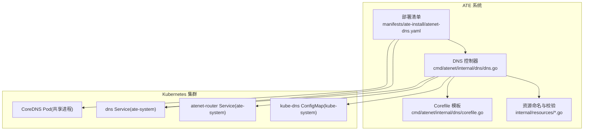
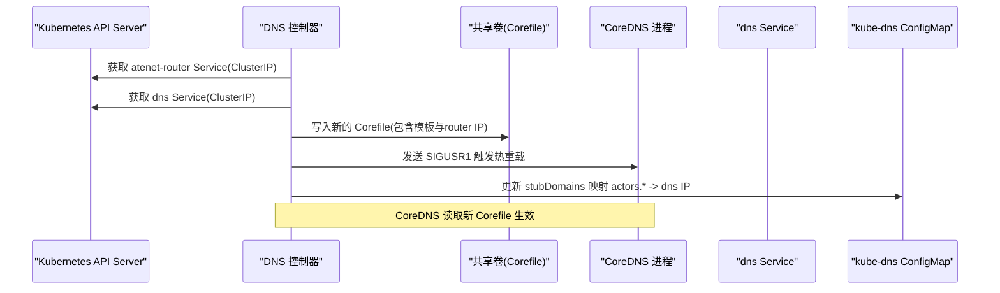
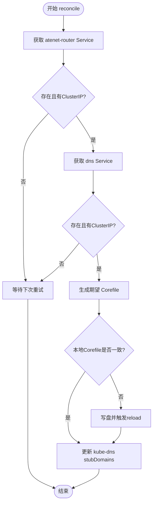
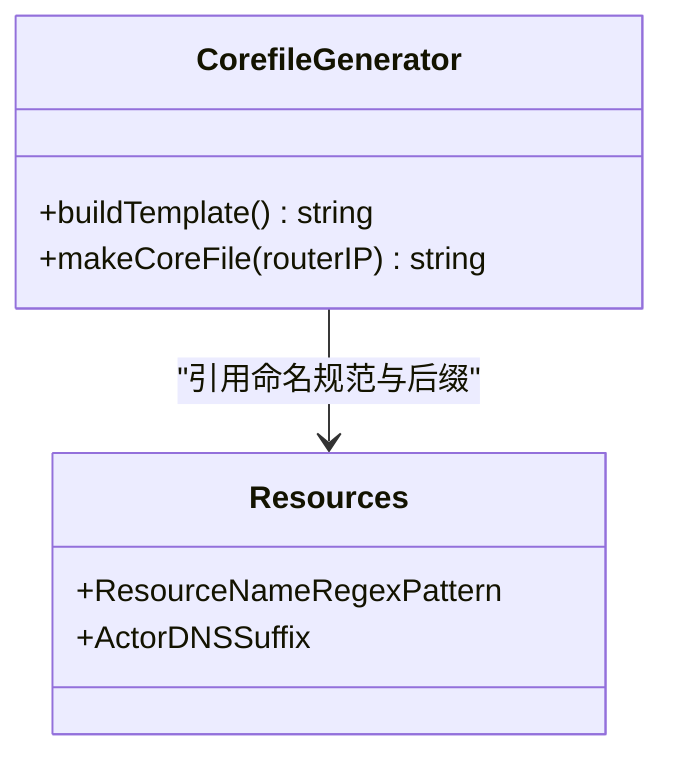
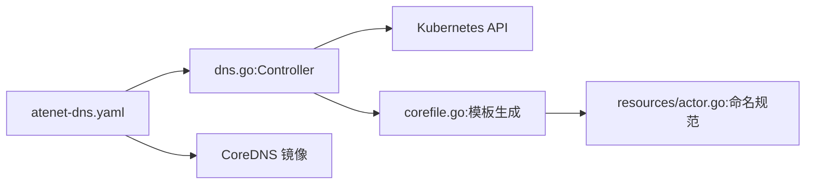

# DNS解析服务

<cite>
**本文引用的文件列表**
- [cmd/atenet/internal/dns/README.md](file://cmd/atenet/internal/dns/README.md)
- [cmd/atenet/internal/dns/dns.go](file://cmd/atenet/internal/dns/dns.go)
- [cmd/atenet/internal/dns/corefile.go](file://cmd/atenet/internal/dns/corefile.go)
- [cmd/atenet/internal/dns/corefile_test.go](file://cmd/atenet/internal/dns/corefile_test.go)
- [cmd/atenet/internal/dns/dns_test.go](file://cmd/atenet/internal/dns/dns_test.go)
- [internal/resources/actor.go](file://internal/resources/actor.go)
- [internal/resources/validate.go](file://internal/resources/validate.go)
- [manifests/ate-install/atenet-dns.yaml](file://manifests/ate-install/atenet-dns.yaml)
</cite>

## 目录
1. [简介](#简介)
2. [项目结构](#项目结构)
3. [核心组件](#核心组件)
4. [架构总览](#架构总览)
5. [详细组件分析](#详细组件分析)
6. [依赖关系分析](#依赖关系分析)
7. [性能与缓存策略](#性能与缓存策略)
8. [安全机制](#安全机制)
9. [配置示例](#配置示例)
10. [故障排查指南](#故障排查指南)
11. [结论](#结论)

## 简介
本文件面向 Agent Substrate 的 DNS 解析服务，聚焦于内置 DNS 控制器的实现原理、CoreDNS 集成方式、Actor 域名的命名规范与解析规则、基于 Actor ID 的动态记录生成、TTL 与缓存策略、与 Kubernetes 集群内 DNS 的集成（含跨命名空间访问）、以及安全与可观测性要点。文档同时提供配置示例与故障排查建议，帮助读者快速理解并运维该服务。

## 项目结构
DNS 相关代码位于 atenet 子模块中，主要包含：
- DNS 控制器与 CoreDNS 配置管理逻辑
- CoreDNS Corefile 模板生成
- 资源命名与校验常量/工具
- 部署清单（Deployment/Service/RBAC）

图表来源
- [cmd/atenet/internal/dns/dns.go:42-117](file://cmd/atenet/internal/dns/dns.go#L42-L117)
- [cmd/atenet/internal/dns/corefile.go:25-64](file://cmd/atenet/internal/dns/corefile.go#L25-L64)
- [internal/resources/actor.go:22-39](file://internal/resources/actor.go#L22-L39)
- [manifests/ate-install/atenet-dns.yaml:74-176](file://manifests/ate-install/atenet-dns.yaml#L74-L176)

章节来源
- [cmd/atenet/internal/dns/README.md:1-37](file://cmd/atenet/internal/dns/README.md#L1-L37)
- [cmd/atenet/internal/dns/dns.go:42-117](file://cmd/atenet/internal/dns/dns.go#L42-L117)
- [cmd/atenet/internal/dns/corefile.go:25-64](file://cmd/atenet/internal/dns/corefile.go#L25-L64)
- [internal/resources/actor.go:22-39](file://internal/resources/actor.go#L22-L39)
- [manifests/ate-install/atenet-dns.yaml:74-176](file://manifests/ate-install/atenet-dns.yaml#L74-L176)

## 核心组件
- DNS 控制器（Controller）
  - 周期性拉取 ate-system 命名空间下的 atenet-router 与 dns 两个 Service 的 ClusterIP
  - 生成并写入 CoreDNS Corefile 到共享卷，随后通过信号通知 CoreDNS 热重载
  - 将自定义 DNS 域名后缀映射到 dns Service IP，注入 kube-system:kube-dns 的 stubDomains
- Corefile 模板生成器
  - 使用正则匹配 <actor>.<atespace>.actors.resources.substrate.ate.dev 形式的 A 查询
  - 返回固定 TTL 的 A 记录指向 atenet-router 的 ClusterIP
- 资源命名与校验
  - 定义 ActorDNSSuffix 与 ResourceNameRegexPattern
  - 提供 ActorDNSName 与 ParseActorDNSName 等工具函数
- 部署清单
  - 以 Sidecar 模式运行 dns-controller 与 CoreDNS，共享 /etc/coredns/Corefile
  - 暴露 dns Service 供集群内访问

章节来源
- [cmd/atenet/internal/dns/dns.go:42-117](file://cmd/atenet/internal/dns/dns.go#L42-L117)
- [cmd/atenet/internal/dns/corefile.go:25-64](file://cmd/atenet/internal/dns/corefile.go#L25-L64)
- [internal/resources/actor.go:22-39](file://internal/resources/actor.go#L22-L39)
- [manifests/ate-install/atenet-dns.yaml:74-176](file://manifests/ate-install/atenet-dns.yaml#L74-L176)

## 架构总览
DNS 控制器作为编排者，负责：
- 发现路由与服务地址
- 动态生成 CoreDNS 配置
- 触发 CoreDNS 热重载
- 更新 kube-dns 的 stubDomains，使集群内所有 Pod 可通过 actors.resources.substrate.ate.dev 前缀解析到内部 DNS

图表来源
- [cmd/atenet/internal/dns/dns.go:71-117](file://cmd/atenet/internal/dns/dns.go#L71-L117)
- [cmd/atenet/internal/dns/dns.go:119-141](file://cmd/atenet/internal/dns/dns.go#L119-L141)
- [cmd/atenet/internal/dns/dns.go:144-189](file://cmd/atenet/internal/dns/dns.go#L144-L189)
- [cmd/atenet/internal/dns/dns.go:202-221](file://cmd/atenet/internal/dns/dns.go#L202-L221)
- [manifests/ate-install/atenet-dns.yaml:145-157](file://manifests/ate-install/atenet-dns.yaml#L145-L157)

## 详细组件分析

### DNS 控制器（Controller）
职责
- 周期 reconcile：获取 atenet-router 与 dns 的 ClusterIP
- 生成 Corefile 并落盘，若内容变化则触发 CoreDNS 热重载
- 维护 kube-system:kube-dns 的 stubDomains，将 actors.resources.substrate.ate.dev 指向 dns Service IP

关键流程
- 获取 Service 失败或无 ClusterIP 时跳过并重试
- 对比本地 Corefile 与期望内容，仅当不一致时写盘并 reload
- 更新 kube-dns ConfigMap 时保留其他已有映射

图表来源
- [cmd/atenet/internal/dns/dns.go:71-117](file://cmd/atenet/internal/dns/dns.go#L71-L117)
- [cmd/atenet/internal/dns/dns.go:119-141](file://cmd/atenet/internal/dns/dns.go#L119-L141)
- [cmd/atenet/internal/dns/dns.go:144-189](file://cmd/atenet/internal/dns/dns.go#L144-L189)

章节来源
- [cmd/atenet/internal/dns/dns.go:42-117](file://cmd/atenet/internal/dns/dns.go#L42-L117)
- [cmd/atenet/internal/dns/dns.go:119-189](file://cmd/atenet/internal/dns/dns.go#L119-L189)
- [cmd/atenet/internal/dns/dns_test.go:42-146](file://cmd/atenet/internal/dns/dns_test.go#L42-L146)

### CoreDNS 配置模板生成
功能
- 启用 log、errors、health、ready、reload 插件
- 在 actors.resources.substrate.ate.dev 区域下，使用 template IN A 指令匹配符合命名规范的域名
- 返回 TTL=60 的 A 记录，值为 atenet-router 的 ClusterIP

关键点
- 使用 ResourceNameRegexPattern 确保 actor 与 atespace 名称合法
- 模板中的 answer 行包含 .Name 变量，由 CoreDNS 填充完整请求名
- 生成的 Corefile 监听 :53，健康检查端口 :8080，就绪端口 :8181

图表来源
- [cmd/atenet/internal/dns/corefile.go:25-64](file://cmd/atenet/internal/dns/corefile.go#L25-L64)
- [internal/resources/actor.go:22-39](file://internal/resources/actor.go#L22-L39)

章节来源
- [cmd/atenet/internal/dns/corefile.go:25-64](file://cmd/atenet/internal/dns/corefile.go#L25-L64)
- [cmd/atenet/internal/dns/corefile_test.go:24-65](file://cmd/atenet/internal/dns/corefile_test.go#L24-L65)

### Actor 域名命名规范与解析规则
命名规范
- 遵循 DNS-1123 Label 的子集：小写字母、数字、短横线；首尾为字母或数字
- 域名格式：<actor_name>.<atespace>.actors.resources.substrate.ate.dev

解析规则
- 控制器仅在满足上述命名规范的 A 查询上响应
- 解析结果为 atenet-router 的 ClusterIP，TTL 为 60 秒
- 支持带或不带末尾点的 FQDN

工具函数
- ActorDNSName：构造标准 mesh 域名
- ParseActorDNSName：解析域名并校验 actor 与 atespace 合法性

章节来源
- [internal/resources/actor.go:22-39](file://internal/resources/actor.go#L22-L39)
- [internal/resources/validate.go:29-48](file://internal/resources/validate.go#L29-L48)
- [cmd/atenet/internal/dns/corefile.go:42-50](file://cmd/atenet/internal/dns/corefile.go#L42-L50)

### 基于 Actor ID 的动态 DNS 记录生成
说明
- 当前实现不直接绑定 Actor ID，而是基于 Actor 名称与 atespace 进行域名匹配
- 由于所有 Actor 均通过同一 atenet-router 转发，A 记录统一指向 router 的 ClusterIP
- 若需按 Actor 维度区分后端，可在模板层扩展 match 条件与 answer 值映射

章节来源
- [cmd/atenet/internal/dns/corefile.go:42-50](file://cmd/atenet/internal/dns/corefile.go#L42-L50)
- [cmd/atenet/internal/dns/dns.go:119-141](file://cmd/atenet/internal/dns/dns.go#L119-L141)

### 与 Kubernetes 集群内 DNS 的集成（跨命名空间）
集成方式
- 控制器将 actors.resources.substrate.ate.dev 映射到 dns Service 的 ClusterIP，写入 kube-system:kube-dns 的 stubDomains
- 集群内任意命名空间的 Pod 均可通过该后缀解析到内部 DNS，无需额外配置

注意
- 若 kube-dns ConfigMap 不存在，控制器会跳过并记录警告，不影响其他步骤

章节来源
- [cmd/atenet/internal/dns/dns.go:144-189](file://cmd/atenet/internal/dns/dns.go#L144-L189)
- [cmd/atenet/internal/dns/dns_test.go:148-199](file://cmd/atenet/internal/dns/dns_test.go#L148-L199)

### DNS 热重载机制
- 控制器通过 /proc 扫描 coredns 进程 PID，向其发送 SIGUSR1 触发 CoreDNS 热重载
- 要求容器间共享进程命名空间，以便在同一 Pod 内找到并信号通知 CoreDNS 进程

章节来源
- [cmd/atenet/internal/dns/dns.go:202-221](file://cmd/atenet/internal/dns/dns.go#L202-L221)
- [manifests/ate-install/atenet-dns.yaml:92-108](file://manifests/ate-install/atenet-dns.yaml#L92-L108)

## 依赖关系分析
- DNS 控制器依赖 Kubernetes API 获取 Service 与 ConfigMap
- Corefile 模板依赖资源命名规范常量
- 部署清单定义了 RBAC、Pod 共享进程、Volume 挂载与探针

图表来源
- [cmd/atenet/internal/dns/dns.go:42-117](file://cmd/atenet/internal/dns/dns.go#L42-L117)
- [cmd/atenet/internal/dns/corefile.go:25-64](file://cmd/atenet/internal/dns/corefile.go#L25-L64)
- [internal/resources/actor.go:22-39](file://internal/resources/actor.go#L22-L39)
- [manifests/ate-install/atenet-dns.yaml:74-176](file://manifests/ate-install/atenet-dns.yaml#L74-L176)

章节来源
- [cmd/atenet/internal/dns/dns.go:42-117](file://cmd/atenet/internal/dns/dns.go#L42-L117)
- [cmd/atenet/internal/dns/corefile.go:25-64](file://cmd/atenet/internal/dns/corefile.go#L25-L64)
- [internal/resources/actor.go:22-39](file://internal/resources/actor.go#L22-L39)
- [manifests/atenet-dns.yaml:74-176](file://manifests/ate-install/atenet-dns.yaml#L74-L176)

## 性能与缓存策略
- CoreDNS 自身具备高效缓存能力；本实现的 answer 行设置 TTL=60，兼顾变更及时性与查询性能
- 控制器采用“差异写盘+信号重载”的策略，避免不必要的重启
- 建议在业务侧合理设置客户端 DNS 缓存时间，避免频繁刷新导致抖动

[本节为通用指导，不直接分析具体文件]

## 安全机制
- 域名匹配严格遵循 DNS-1123 Label 规范，防止非法字符注入
- 仅对 A 记录类型且匹配特定后缀的请求响应，降低误用面
- 未实现显式的查询鉴权或速率限制；如需增强，可在 CoreDNS 层引入 ACL、限流或认证插件

章节来源
- [internal/resources/validate.go:29-48](file://internal/resources/validate.go#L29-L48)
- [cmd/atenet/internal/dns/corefile.go:42-50](file://cmd/atenet/internal/dns/corefile.go#L42-L50)

## 配置示例
- 部署清单
  - Deployment：包含 initContainer 初始化 Corefile、CoreDNS 容器与 dns-controller 容器，共享 /etc/coredns
  - Service：ClusterIP 暴露 53 UDP/TCP
  - RBAC：允许读写 kube-system:kube-dns 与 ate-system 内的 Service/ConfigMap
- 环境变量/参数
  - --interval：reconcile 间隔
  - --corefile-path：Corefile 路径
  - --log-level：日志级别

章节来源
- [manifests/ate-install/atenet-dns.yaml:74-176](file://manifests/ate-install/atenet-dns.yaml#L74-L176)
- [cmd/atenet/internal/dns/README.md:17-37](file://cmd/atenet/internal/dns/README.md#L17-L37)

## 故障排查指南
常见问题与定位步骤
- 无法解析 Actor 域名
  - 确认 kube-system:kube-dns 的 stubDomains 已包含 actors.resources.substrate.ate.dev 并指向 dns Service IP
  - 检查 dns Service 是否存在且处于可用状态
  - 验证域名是否符合命名规范（小写字母、数字、短横线，首尾非短横线）
- CoreDNS 未生效
  - 查看 dns-controller 日志，确认是否成功写盘并发送 SIGUSR1
  - 检查 /etc/coredns/Corefile 是否为最新内容
  - 确认 Pod 是否启用 shareProcessNamespace=true
- kube-dns ConfigMap 缺失
  - 控制器会跳过更新并记录警告；需在集群中创建 kube-dns ConfigMap 后再重试

参考测试用例
- 覆盖 Corefile 生成与 kube-dns 更新逻辑，可用于对照预期行为

章节来源
- [cmd/atenet/internal/dns/dns.go:144-189](file://cmd/atenet/internal/dns/dns.go#L144-L189)
- [cmd/atenet/internal/dns/dns_test.go:42-146](file://cmd/atenet/internal/dns/dns_test.go#L42-L146)
- [cmd/atenet/internal/dns/dns_test.go:148-199](file://cmd/atenet/internal/dns/dns_test.go#L148-L199)

## 结论
本 DNS 解析服务通过轻量级控制器与 CoreDNS 模板化配置，实现了 Actor 域名的稳定解析与跨命名空间可达。其设计强调最小侵入与高可用：差异写盘、信号热重载、stubDomains 自动注入。对于更高阶的安全与性能需求，可在 CoreDNS 层扩展限流、ACL 与更细粒度的缓存策略。
