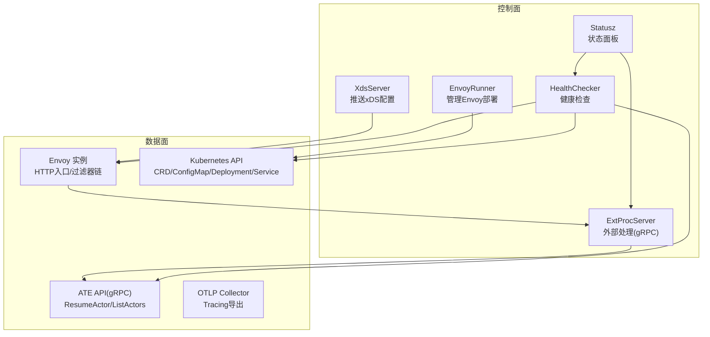
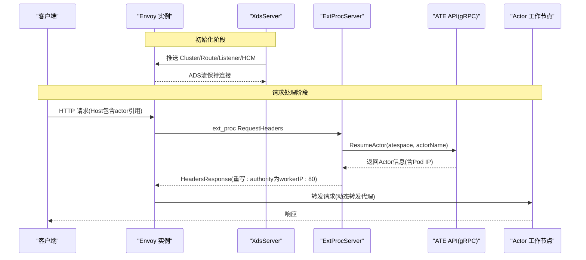
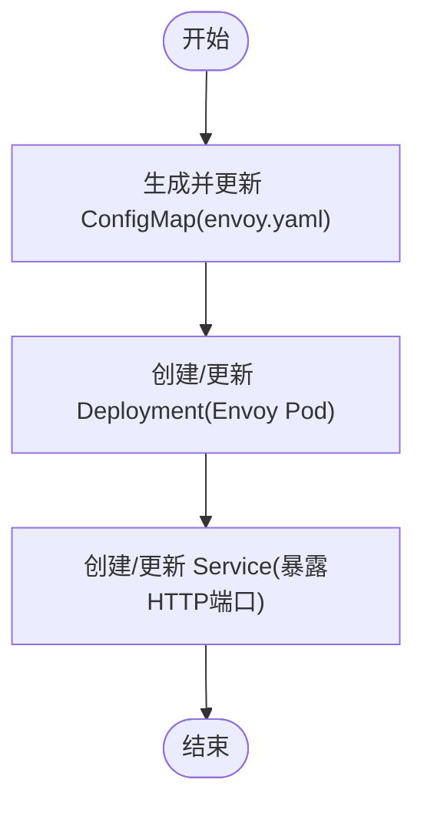
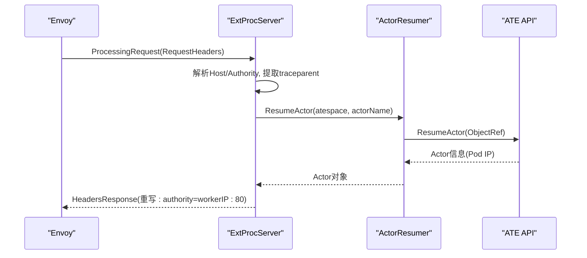
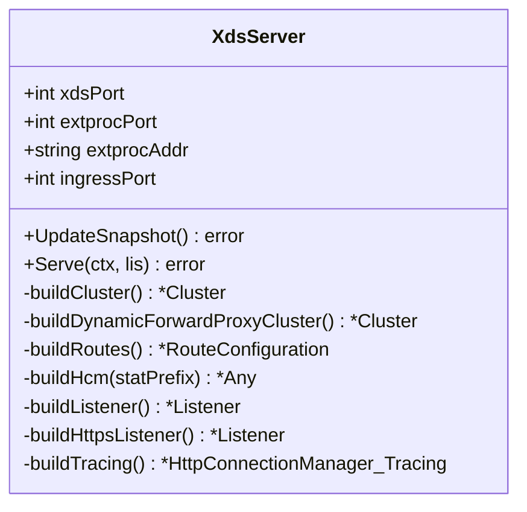
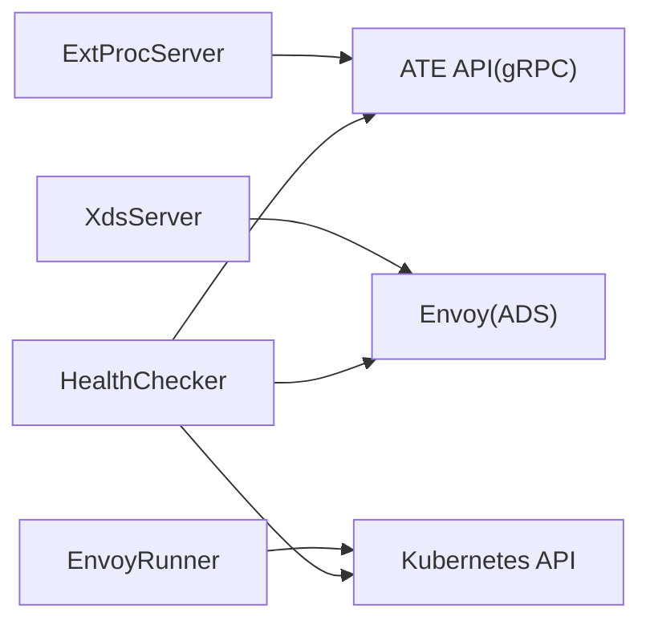

# Envoy代理集成

<cite>
**本文引用的文件**   
- [envoyrunner.go](file://cmd/atenet/internal/router/envoyrunner.go)
- [extproc.go](file://cmd/atenet/internal/router/extproc.go)
- [extproc_in.go](file://cmd/atenet/internal/router/extproc_in.go)
- [extproc_out.go](file://cmd/atenet/internal/router/extproc_out.go)
- [xds.go](file://cmd/atenet/internal/router/xds.go)
- [resumer.go](file://cmd/atenet/internal/router/resumer.go)
- [metrics.go](file://cmd/atenet/internal/router/metrics.go)
- [health.go](file://cmd/atenet/internal/router/health.go)
- [status.go](file://cmd/atenet/internal/router/status.go)
</cite>

## 目录
1. [简介](#简介)
2. [项目结构](#项目结构)
3. [核心组件](#核心组件)
4. [架构总览](#架构总览)
5. [详细组件分析](#详细组件分析)
6. [依赖关系分析](#依赖关系分析)
7. [性能考量](#性能考量)
8. [故障排查指南](#故障排查指南)
9. [结论](#结论)
10. [附录](#附录)

## 简介
本文件面向“Agent Substrate”中的Envoy代理集成，系统性阐述以下能力：
- EnvoyRunner的生命周期管理：在Kubernetes中动态创建/更新Envoy的Bootstrap配置、Deployment与Service，实现进程启动与配置热重载。
- 外部处理服务器(ExtProc)协议实现：基于gRPC的Envoy External Processing v3接口，拦截HTTP请求头、解析路由目标、鉴权与动态路由决策。
- XDS(扩展发现服务)集成：通过gRPC流式传输Cluster、Route、Listener等配置到Envoy实例，支持TLS与OTLP追踪。
- 动态配置管理机制：自动生成并同步Envoy所需的静态与动态资源，确保一致性快照。
- 监控指标、日志聚合与健康检查：提供OpenTelemetry指标、访问日志输出、健康探针与状态面板。
- 配置模板与调试技巧：给出关键配置要点与排障建议，帮助理解高性能代理工作原理。

## 项目结构
与Envoy集成相关的代码集中在router包内，围绕三个子系统组织：
- EnvoyRunner：负责在Kubernetes中管理Envoy实例（ConfigMap/Deployment/Service）的创建与更新。
- ExtProc Server：实现Envoy External Processing gRPC服务，完成请求拦截与动态路由。
- XDS Server：实现Aggregated Discovery Service，向Envoy推送Cluster/Route/Listener等资源。

图表来源
- [envoyrunner.go:50-64](file://cmd/atenet/internal/router/envoyrunner.go#L50-L64)
- [xds.go:196-225](file://cmd/atenet/internal/router/xds.go#L196-L225)
- [extproc.go:58-78](file://cmd/atenet/internal/router/extproc.go#L58-L78)
- [health.go:74-89](file://cmd/atenet/internal/router/health.go#L74-L89)
- [status.go:180-281](file://cmd/atenet/internal/router/status.go#L180-L281)

章节来源
- [envoyrunner.go:36-64](file://cmd/atenet/internal/router/envoyrunner.go#L36-L64)
- [xds.go:71-104](file://cmd/atenet/internal/router/xds.go#L71-L104)
- [extproc.go:38-56](file://cmd/atenet/internal/router/extproc.go#L38-L56)

## 核心组件
- EnvoyRunner：生成Envoy Bootstrap配置（指向本地XDS），创建/更新Deployment与Service，驱动Envoy进程生命周期。
- XdsServer：维护SnapshotCache，构建Cluster/Route/Listener/HCM/FilterChain/TLS/Tracing，并通过gRPC推送给Envoy。
- ExtProcServer：接收Envoy的ProcessingRequest(RequestHeaders)，解析Host/Authority，调用ATE API恢复Actor，返回HeaderMutation以重写目标地址。
- ActorResumer：对并发恢复请求去重与指数退避重试，保证幂等性与稳定性。
- Metrics/Status/Health：提供指标直方图、最近请求记录、健康检查与状态页。

章节来源
- [envoyrunner.go:66-137](file://cmd/atenet/internal/router/envoyrunner.go#L66-L137)
- [xds.go:148-194](file://cmd/atenet/internal/router/xds.go#L148-L194)
- [extproc.go:80-128](file://cmd/atenet/internal/router/extproc.go#L80-L128)
- [resumer.go:46-104](file://cmd/atenet/internal/router/resumer.go#L46-L104)
- [metrics.go:34-51](file://cmd/atenet/internal/router/metrics.go#L34-L51)
- [status.go:180-281](file://cmd/atenet/internal/router/status.go#L180-L281)
- [health.go:91-147](file://cmd/atenet/internal/router/health.go#L91-L147)

## 架构总览
下图展示从HTTP请求进入Envoy，经ExtProc进行鉴权与路由决策，再到动态转发至Actor工作节点的完整流程；同时显示XDS如何向Envoy下发配置。

图表来源
- [xds.go:196-225](file://cmd/atenet/internal/router/xds.go#L196-L225)
- [xds.go:386-466](file://cmd/atenet/internal/router/xds.go#L386-L466)
- [extproc.go:80-128](file://cmd/atenet/internal/router/extproc.go#L80-L128)
- [extproc.go:130-188](file://cmd/atenet/internal/router/extproc.go#L130-L188)
- [resumer.go:46-104](file://cmd/atenet/internal/router/resumer.go#L46-L104)

## 详细组件分析

### EnvoyRunner：进程启动、配置热重载与优雅关闭
- 生命周期职责
  - 生成Bootstrap配置：设置admin端口、node标识、ADS接入点、静态xds_cluster指向本地XDS服务。
  - 管理Kubernetes资源：创建或更新ConfigMap(envoy.yaml)、Deployment(单副本)、Service(ClusterIP)。
  - 热重载机制：当ConfigMap内容变化时，Deployment被更新，触发滚动升级，新Pod加载新配置后接管流量。
  - 优雅关闭：由上层控制器协调Pod终止，Envoy按K8s策略平滑退出。

- 关键流程
  - reconcile：依次执行ConfigMap/Deployment/Service的reconcile。
  - reconcileEnvoyConfigMap：写入envoy.yaml，包含ads_config与static_resources.clusters[xds_cluster]。
  - reconcileEnvoyDeployment：定义容器命令、端口映射、Volume挂载。
  - reconcileEnvoyService：暴露HTTP端口供外部访问。

图表来源
- [envoyrunner.go:50-64](file://cmd/atenet/internal/router/envoyrunner.go#L50-L64)
- [envoyrunner.go:66-137](file://cmd/atenet/internal/router/envoyrunner.go#L66-L137)
- [envoyrunner.go:139-222](file://cmd/atenet/internal/router/envoyrunner.go#L139-L222)
- [envoyrunner.go:224-258](file://cmd/atenet/internal/router/envoyrunner.go#L224-L258)

章节来源
- [envoyrunner.go:36-64](file://cmd/atenet/internal/router/envoyrunner.go#L36-L64)
- [envoyrunner.go:66-137](file://cmd/atenet/internal/router/envoyrunner.go#L66-L137)
- [envoyrunner.go:139-222](file://cmd/atenet/internal/router/envoyrunner.go#L139-L222)
- [envoyrunner.go:224-258](file://cmd/atenet/internal/router/envoyrunner.go#L224-L258)

### ExtProc：HTTP请求拦截、鉴权与动态路由
- 协议与处理模型
  - 监听gRPC端口，注册ExternalProcessor服务。
  - 仅处理RequestHeaders阶段，返回HeadersResponse或ImmediateResponse。
  - 从HTTP头部提取traceparent，注入上下文，建立链路追踪。

- 路由决策流程
  - 解析Host/:authority，得到atespace与actorName。
  - 调用ATE API ResumeActor，确保目标Actor运行并获取其Pod IP。
  - 构造HeaderMutation，将:authority重写为workerIP:80，交由dynamic_forward_proxy转发。

- 错误与鉴权
  - 非法Host直接返回404。
  - 内部错误返回500，并记录指标与最近请求。
  - 敏感字段（如查询参数、Authorization、Cookie）在日志与状态面板中被脱敏。

图表来源
- [extproc.go:80-128](file://cmd/atenet/internal/router/extproc.go#L80-L128)
- [extproc.go:130-188](file://cmd/atenet/internal/router/extproc.go#L130-L188)
- [extproc_in.go:31-72](file://cmd/atenet/internal/router/extproc_in.go#L31-L72)
- [extproc_out.go:35-67](file://cmd/atenet/internal/router/extproc_out.go#L35-L67)
- [resumer.go:46-104](file://cmd/atenet/internal/router/resumer.go#L46-L104)

章节来源
- [extproc.go:38-78](file://cmd/atenet/internal/router/extproc.go#L38-L78)
- [extproc.go:80-128](file://cmd/atenet/internal/router/extproc.go#L80-L128)
- [extproc.go:130-188](file://cmd/atenet/internal/router/extproc.go#L130-L188)
- [extproc_in.go:25-72](file://cmd/atenet/internal/router/extproc_in.go#L25-L72)
- [extproc_out.go:23-67](file://cmd/atenet/internal/router/extproc_out.go#L23-L67)
- [resumer.go:31-104](file://cmd/atenet/internal/router/resumer.go#L31-L104)

### XDS：gRPC流式配置推送与动态资源生成
- 服务与快照
  - 启动gRPC服务，注册ADS与各独立Discovery服务。
  - UpdateSnapshot：递增版本号，构建Clusters/Routes/Listeners，校验一致性后写入SnapshotCache。

- 资源构建
  - Clusters：ATE集群(ExtProc)、动态转发代理集群、可选OTLP Collector集群。
  - Routes：默认匹配所有路径，使用dynamic_forward_proxy集群。
  - Listeners：HTTP与可选HTTPS监听器，绑定HCM。
  - HCM：启用ext_proc、dynamic_forward_proxy、router过滤器；配置AccessLog(stdout)与Tracing(OTLP)。

- TLS与追踪
  - HTTPS监听器支持证书文件路径或内联内容。
  - Tracing随机采样100%，结合上游client采样策略控制整体采样率。

图表来源
- [xds.go:71-104](file://cmd/atenet/internal/router/xds.go#L71-L104)
- [xds.go:148-194](file://cmd/atenet/internal/router/xds.go#L148-L194)
- [xds.go:227-272](file://cmd/atenet/internal/router/xds.go#L227-L272)
- [xds.go:336-355](file://cmd/atenet/internal/router/xds.go#L336-L355)
- [xds.go:357-384](file://cmd/atenet/internal/router/xds.go#L357-L384)
- [xds.go:386-466](file://cmd/atenet/internal/router/xds.go#L386-L466)
- [xds.go:503-531](file://cmd/atenet/internal/router/xds.go#L503-L531)
- [xds.go:533-576](file://cmd/atenet/internal/router/xds.go#L533-L576)
- [xds.go:478-501](file://cmd/atenet/internal/router/xds.go#L478-L501)

章节来源
- [xds.go:196-225](file://cmd/atenet/internal/router/xds.go#L196-L225)
- [xds.go:148-194](file://cmd/atenet/internal/router/xds.go#L148-L194)
- [xds.go:386-466](file://cmd/atenet/internal/router/xds.go#L386-L466)

### 动态配置管理与一致性
- 版本化快照：每次UpdateSnapshot递增版本号，确保Envoy增量拉取。
- 一致性校验：NewSnapshot后执行Consistent检查，避免不一致资源组合。
- 按需扩展：当配置OTLP Collector时，自动追加对应Cluster。

章节来源
- [xds.go:148-194](file://cmd/atenet/internal/router/xds.go#L148-L194)

### 监控指标、日志聚合与健康检查
- 指标
  - atenet.router.route.duration：记录从收到请求到解析出目标端点的耗时，带低基数标签(模板命名空间/名称/结果)。
- 日志
  - AccessLog输出到stdout，便于集中收集。
  - ExtProc处理过程记录关键上下文，但严格脱敏敏感字段。
- 健康检查
  - 周期性检查Envoy admin /ready、K8s API连通性、ATE API可用性。
  - 状态面板(statusz)汇总构建信息、端口、参数、最近请求与健康报告。

章节来源
- [metrics.go:24-51](file://cmd/atenet/internal/router/metrics.go#L24-L51)
- [xds.go:419-466](file://cmd/atenet/internal/router/xds.go#L419-L466)
- [health.go:74-147](file://cmd/atenet/internal/router/health.go#L74-L147)
- [status.go:180-281](file://cmd/atenet/internal/router/status.go#L180-L281)

## 依赖关系分析
- 组件耦合
  - ExtProc依赖ATE API用于Actor恢复与元数据获取。
  - XDS与Envoy通过gRPC ADS交互，Envoy作为消费者。
  - EnvoyRunner依赖Kubernetes API管理Envoy资源。
  - Health模块依赖Envoy Admin、K8s Discovery、ATE API。
- 外部依赖
  - go-control-plane：xDS服务端与资源类型定义。
  - OpenTelemetry：指标与追踪。
  - Kubernetes client-go/controller-runtime：资源操作。

图表来源
- [extproc.go:38-56](file://cmd/atenet/internal/router/extproc.go#L38-L56)
- [xds.go:196-225](file://cmd/atenet/internal/router/xds.go#L196-L225)
- [envoyrunner.go:50-64](file://cmd/atenet/internal/router/envoyrunner.go#L50-L64)
- [health.go:91-147](file://cmd/atenet/internal/router/health.go#L91-L147)

章节来源
- [extproc.go:38-56](file://cmd/atenet/internal/router/extproc.go#L38-L56)
- [xds.go:196-225](file://cmd/atenet/internal/router/xds.go#L196-L225)
- [envoyrunner.go:50-64](file://cmd/atenet/internal/router/envoyrunner.go#L50-L64)
- [health.go:91-147](file://cmd/atenet/internal/router/health.go#L91-L147)

## 性能考量
- ExtProc消息超时：显式设置MessageTimeout(秒级)，避免默认200ms导致频繁失败。
- 并发恢复去重：ActorResumer使用singleflight合并相同Actor的并发恢复请求，降低后端压力。
- 指数退避重试：针对Aborted等可重试错误进行退避，提高鲁棒性。
- DNS缓存：dynamic_forward_proxy启用DNS缓存，减少解析开销。
- 指标桶边界：route.duration直方图覆盖毫秒到数十秒范围，兼顾低延迟与长尾观测。

章节来源
- [xds.go:386-466](file://cmd/atenet/internal/router/xds.go#L386-L466)
- [resumer.go:46-104](file://cmd/atenet/internal/router/resumer.go#L46-L104)
- [metrics.go:34-51](file://cmd/atenet/internal/router/metrics.go#L34-L51)

## 故障排查指南
- 无法路由到Actor
  - 检查Host格式是否正确，确认atespace与actorName解析成功。
  - 查看ExtProc日志是否返回ImmediateResponse(404/500)。
  - 验证ATE API连通性与ResumeActor返回的Pod IP是否有效。
- 配置未生效
  - 确认XDS Snapshot版本是否递增且一致。
  - 检查Envoy是否成功拉取最新Cluster/Route/Listener。
- 追踪缺失
  - 确认已配置OTLP Collector地址，且HCM Tracing已启用。
  - 注意上游client采样策略与Envoy随机采样的组合效果。
- 健康检查失败
  - 检查Envoy admin /ready是否返回LIVE。
  - 检查K8s API与ATE API连通性。

章节来源
- [extproc.go:80-128](file://cmd/atenet/internal/router/extproc.go#L80-L128)
- [extproc.go:130-188](file://cmd/atenet/internal/router/extproc.go#L130-L188)
- [xds.go:148-194](file://cmd/atenet/internal/router/xds.go#L148-L194)
- [xds.go:478-501](file://cmd/atenet/internal/router/xds.go#L478-L501)
- [health.go:149-208](file://cmd/atenet/internal/router/health.go#L149-L208)

## 结论
本集成通过Envoy的高性能数据面与ExtProc的动态控制面，实现了基于请求头的细粒度路由与鉴权；借助XDS的流式配置推送，达成配置的热更新与一致性保障；配合指标、日志与健康检查，形成完整的可观测体系。该方案在保证低延迟的同时，具备良好的可扩展性与运维友好性。

## 附录
- 关键配置要点
  - Envoy Bootstrap：指定ADS与静态xds_cluster，确保Envoy能连接到本地XDS。
  - HCM过滤器顺序：ext_proc -> dynamic_forward_proxy -> router。
  - 动态转发代理：启用DNS缓存，提升解析性能。
  - 追踪：开启OTLP exporter，合理设置采样策略。
- 调试技巧
  - 使用statusz页面查看最近请求与健康状态。
  - 调整组件日志级别，关注upstream/router/ext_proc相关日志。
  - 通过Admin接口检查Envoy运行时状态与统计。
