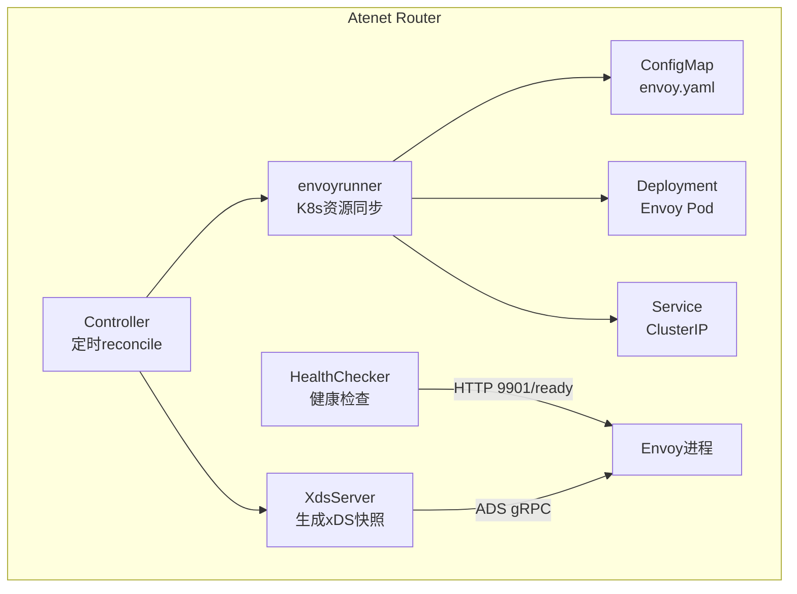
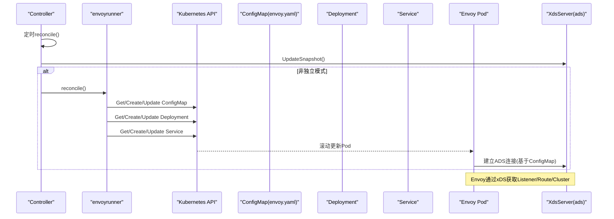
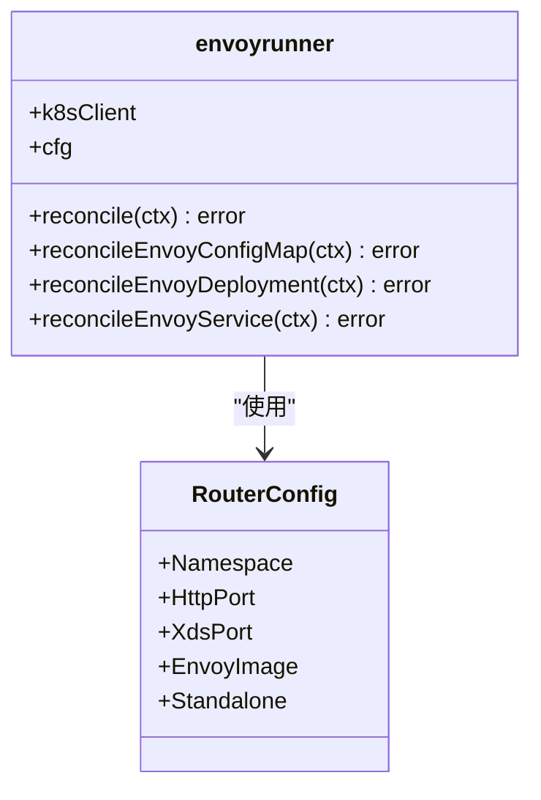
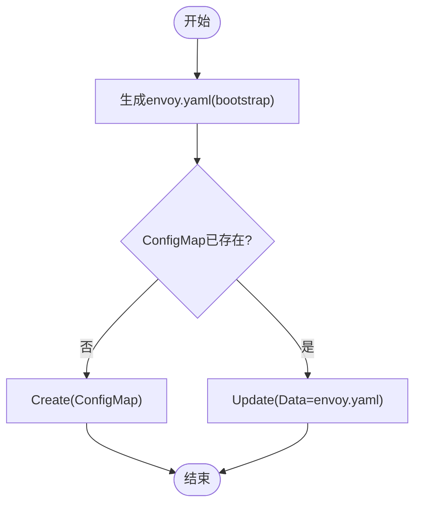
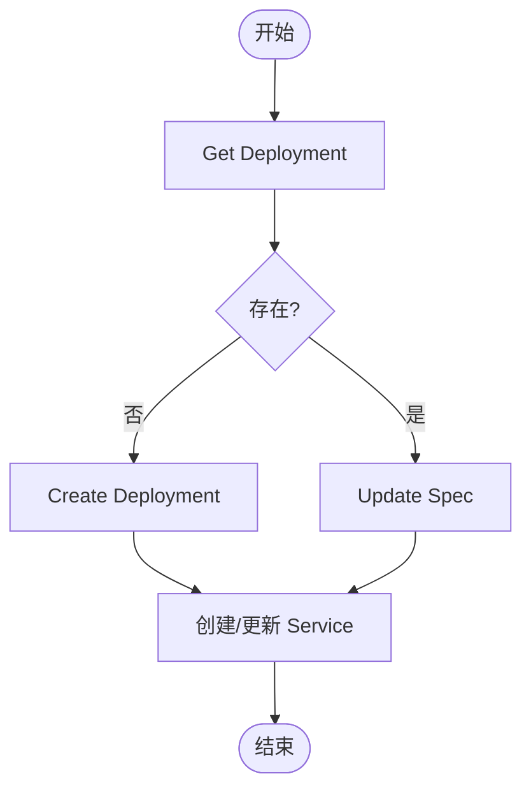
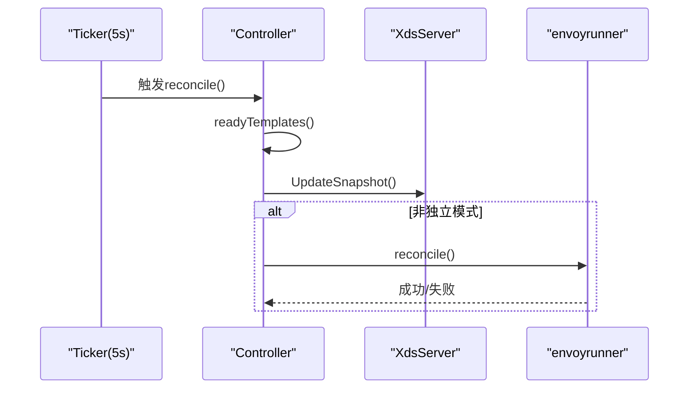
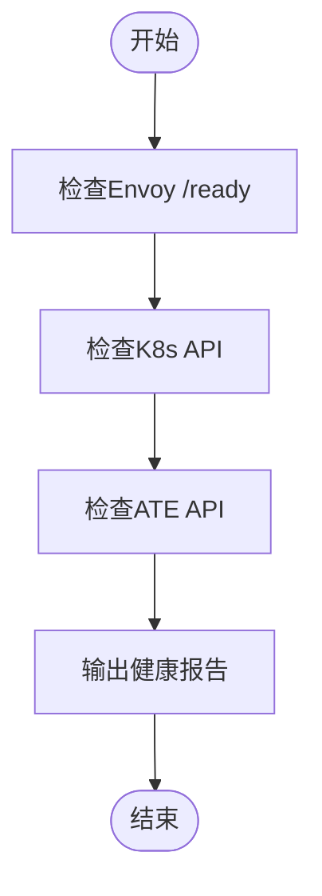
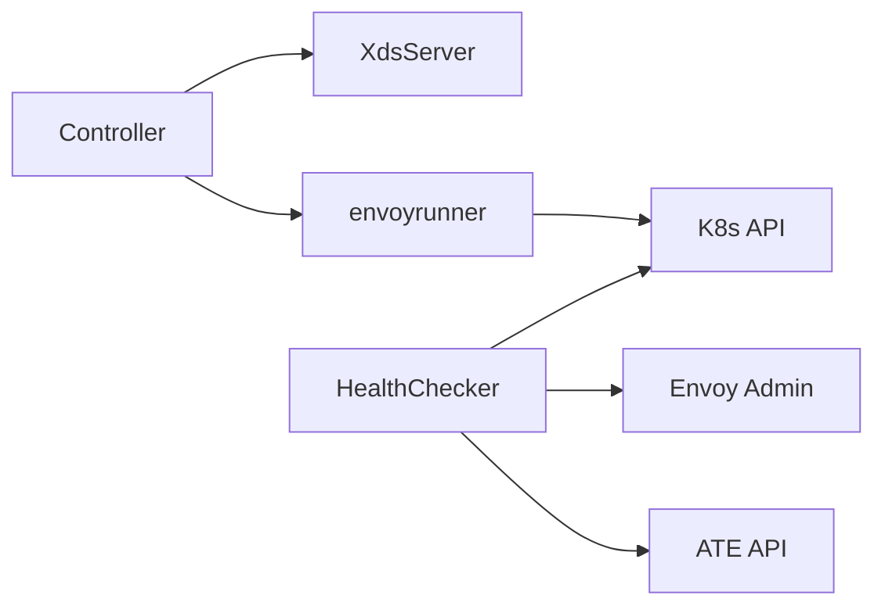

# Envoy进程管理

<cite>
**本文引用的文件**   
- [envoyrunner.go](file://cmd/atenet/internal/router/envoyrunner.go)
- [controller.go](file://cmd/atenet/internal/router/controller.go)
- [xds.go](file://cmd/atenet/internal/router/xds.go)
- [health.go](file://cmd/atenet/internal/router/health.go)
- [router.go](file://cmd/atenet/internal/router/router.go)
- [router_cmd.go](file://cmd/atenet/internal/router.go)
</cite>

## 目录
1. [简介](#简介)
2. [项目结构](#项目结构)
3. [核心组件](#核心组件)
4. [架构总览](#架构总览)
5. [详细组件分析](#详细组件分析)
6. [依赖关系分析](#依赖关系分析)
7. [性能与资源考虑](#性能与资源考虑)
8. [故障排查指南](#故障排查指南)
9. [结论](#结论)
10. [附录](#附录)

## 简介
本文件聚焦于在 Kubernetes 环境中对 Envoy 代理进程的“托管式”生命周期管理。通过一个名为 envoyrunner 的控制器，系统自动创建并维护以下三类 K8s 资源：
- ConfigMap：包含 Envoy 启动所需的引导配置（bootstrap），用于连接 xDS 控制面。
- Deployment：以单副本运行 Envoy 容器，挂载上述 ConfigMap，暴露 HTTP 与 Admin 端口。
- Service：ClusterIP 类型，将外部流量转发到 Envoy Pod 的 HTTP 端口。

同时，系统提供健康检查、错误处理与日志级别等运维能力，并通过周期性 reconcile 机制保证集群状态与期望状态一致。

## 项目结构
与 Envoy 进程管理直接相关的代码位于 atenet 路由模块中，关键文件如下：
- envoyrunner.go：定义 envoyrunner 结构体及其 reconcile 逻辑，负责 ConfigMap/Deployment/Service 的同步。
- controller.go：定时调度 reconcile，协调 xDS 快照更新与 Envoy 资源同步。
- xds.go：构建 xDS 动态配置（Listener/Route/Cluster）并推送给 Envoy。
- health.go：周期检查 Envoy、K8s API、ATE API 的健康状态。
- router.go / router_cmd.go：RouterConfig 定义与命令行参数绑定，影响 Envoy 镜像、端口、日志级别等。

图表来源
- [controller.go:67-110](file://cmd/atenet/internal/router/controller.go#L67-L110)
- [envoyrunner.go:50-64](file://cmd/atenet/internal/router/envoyrunner.go#L50-L64)
- [envoyrunner.go:66-137](file://cmd/atenet/internal/router/envoyrunner.go#L66-L137)
- [envoyrunner.go:139-222](file://cmd/atenet/internal/router/envoyrunner.go#L139-L222)
- [envoyrunner.go:224-258](file://cmd/atenet/internal/router/envoyrunner.go#L224-L258)
- [xds.go:148-172](file://cmd/atenet/internal/router/xds.go#L148-L172)
- [health.go:74-89](file://cmd/atenet/internal/router/health.go#L74-L89)

章节来源
- [controller.go:67-110](file://cmd/atenet/internal/router/controller.go#L67-L110)
- [envoyrunner.go:50-64](file://cmd/atenet/internal/router/envoyrunner.go#L50-L64)

## 核心组件
- envoyrunner：封装对 K8s 资源的期望态构造与同步，包括 ConfigMap、Deployment、Service。
- Controller：每 5 秒触发一次 reconcile，先更新 xDS 快照，再在非独立模式下同步 Envoy 相关资源。
- XdsServer：根据 ActorTemplates 生成 Listener/Route/Cluster 快照，通过 ADS 推送给 Envoy。
- HealthChecker：周期探测 Envoy 本地 admin 接口、K8s API 与 ATE API，汇总健康报告。

章节来源
- [envoyrunner.go:38-48](file://cmd/atenet/internal/router/envoyrunner.go#L38-L48)
- [controller.go:39-65](file://cmd/atenet/internal/router/controller.go#L39-L65)
- [xds.go:148-172](file://cmd/atenet/internal/router/xds.go#L148-L172)
- [health.go:61-72](file://cmd/atenet/internal/router/health.go#L61-L72)

## 架构总览
下图展示了从配置变更到 Envoy 热重载的关键路径：
- Controller 定时拉取模板并生成 xDS 快照。
- envoyrunner 同步 ConfigMap（含 bootstrap）、Deployment、Service。
- Envoy 通过静态配置的 xds_cluster 连接到 atenet-router 的 xDS 服务，接收动态配置。
- 健康检查器定期探测 Envoy 的 /ready 端点。

图表来源
- [controller.go:88-110](file://cmd/atenet/internal/router/controller.go#L88-L110)
- [envoyrunner.go:50-64](file://cmd/atenet/internal/router/envoyrunner.go#L50-L64)
- [envoyrunner.go:66-137](file://cmd/atenet/internal/router/envoyrunner.go#L66-L137)
- [envoyrunner.go:139-222](file://cmd/atenet/internal/router/envoyrunner.go#L139-L222)
- [envoyrunner.go:224-258](file://cmd/atenet/internal/router/envoyrunner.go#L224-L258)
- [xds.go:148-172](file://cmd/atenet/internal/router/xds.go#L148-L172)

## 详细组件分析

### envoyrunner 结构与生命周期
- 字段
  - k8sClient：Kubernetes 客户端，用于读写资源。
  - cfg：RouterConfig，包含命名空间、端口、镜像等运行时参数。
- 主要方法
  - reconcile：顺序执行 ConfigMap、Deployment、Service 的同步。
  - reconcileEnvoyConfigMap：生成 bootstrap YAML，写入 ConfigMap；若不存在则创建，否则更新 Data。
  - reconcileEnvoyDeployment：构造 Deployment，挂载 ConfigMap 到 /etc/envoy，设置命令参数与端口。
  - reconcileEnvoyService：构造 ClusterIP Service，选择器匹配 Deployment Pod 标签。

图表来源
- [envoyrunner.go:38-48](file://cmd/atenet/internal/router/envoyrunner.go#L38-L48)
- [router.go:66-91](file://cmd/atenet/internal/router/router.go#L66-L91)

章节来源
- [envoyrunner.go:38-48](file://cmd/atenet/internal/router/envoyrunner.go#L38-L48)
- [envoyrunner.go:50-64](file://cmd/atenet/internal/router/envoyrunner.go#L50-L64)
- [envoyrunner.go:66-137](file://cmd/atenet/internal/router/envoyrunner.go#L66-L137)
- [envoyrunner.go:139-222](file://cmd/atenet/internal/router/envoyrunner.go#L139-L222)
- [envoyrunner.go:224-258](file://cmd/atenet/internal/router/envoyrunner.go#L224-L258)
- [router.go:66-91](file://cmd/atenet/internal/router/router.go#L66-L91)

### ConfigMap 同步与动态配置热重载
- 生成流程
  - 构造 bootstrap YAML，包含：
    - admin 监听地址与端口。
    - node 标识与集群名。
    - dynamic_resources：启用 LDS/CDS 的 ADS 订阅。
    - static_resources：定义 xds_cluster，指向 atenet-router 服务的 xDS 端口。
  - 将 YAML 写入 ConfigMap 的 env.yaml 键。
- 同步策略
  - 若 ConfigMap 不存在则创建；存在则覆盖 Data 字段。
- 热重载机制
  - Envoy 通过 xDS 动态获取 Listener/Route/Cluster，无需重启。
  - 当 xDS 快照版本变化时，Envoy 会平滑应用新配置。

图表来源
- [envoyrunner.go:66-137](file://cmd/atenet/internal/router/envoyrunner.go#L66-L137)
- [xds.go:148-172](file://cmd/atenet/internal/router/xds.go#L148-L172)

章节来源
- [envoyrunner.go:66-137](file://cmd/atenet/internal/router/envoyrunner.go#L66-L137)
- [xds.go:148-172](file://cmd/atenet/internal/router/xds.go#L148-L172)

### Deployment 与 Service 同步
- Deployment
  - 单副本，标签 app=atenet-router-envoy。
  - 容器镜像来自 RouterConfig.EnvoyImage。
  - 启动命令指定配置文件路径为 /etc/envoy/envoy.yaml，并设置组件日志级别。
  - 挂载 ConfigMap 到 /etc/envoy。
  - 暴露 http 与 admin 端口。
- Service
  - ClusterIP 类型，选择器与 Deployment 标签一致。
  - 映射 Service Port 到 Pod 的 http 端口。

图表来源
- [envoyrunner.go:139-222](file://cmd/atenet/internal/router/envoyrunner.go#L139-L222)
- [envoyrunner.go:224-258](file://cmd/atenet/internal/router/envoyrunner.go#L224-L258)

章节来源
- [envoyrunner.go:139-222](file://cmd/atenet/internal/router/envoyrunner.go#L139-L222)
- [envoyrunner.go:224-258](file://cmd/atenet/internal/router/envoyrunner.go#L224-L258)

### 控制器调度与错误处理
- 调度
  - 启动后立即执行一次 eager reconcile。
  - 之后每 5 秒触发一次 reconcile。
- 步骤
  - 读取 ActorTemplates 并生成 xDS 快照。
  - 若非独立模式且未使用本地模板文件，则调用 envoyrunner.reconcile。
- 错误处理
  - 各阶段失败均记录错误日志并返回，上层循环继续重试。

图表来源
- [controller.go:67-110](file://cmd/atenet/internal/router/controller.go#L67-L110)

章节来源
- [controller.go:67-110](file://cmd/atenet/internal/router/controller.go#L67-L110)

### 健康检查与故障恢复
- 健康检查项
  - Envoy：HTTP GET 127.0.0.1:9901/ready，期望响应体为 LIVE。
  - K8s API：Discovery ServerVersion。
  - ATE API：gRPC ListActors。
- 统计信息
  - 记录最近成功/失败时间与次数。
- 故障恢复
  - 健康检查仅观测，不主动自愈；但 reconcile 循环会持续尝试修复资源不一致。

图表来源
- [health.go:74-89](file://cmd/atenet/internal/router/health.go#L74-L89)
- [health.go:149-179](file://cmd/atenet/internal/router/health.go#L149-L179)
- [health.go:181-208](file://cmd/atenet/internal/router/health.go#L181-L208)

章节来源
- [health.go:74-89](file://cmd/atenet/internal/router/health.go#L74-L89)
- [health.go:149-179](file://cmd/atenet/internal/router/health.go#L149-L179)
- [health.go:181-208](file://cmd/atenet/internal/router/health.go#L181-L208)

### Envoy 启动参数与日志级别
- 启动参数
  - 配置文件路径：/etc/envoy/envoy.yaml（由 ConfigMap 挂载）。
  - 组件日志级别：upstream:debug,router:debug,ext_proc:debug。
- 端口
  - HTTP 数据面端口：来自 RouterConfig.HttpPort。
  - Admin 端口：固定 9901。
- 镜像
  - 来自 RouterConfig.EnvoyImage。

章节来源
- [envoyrunner.go:167-174](file://cmd/atenet/internal/router/envoyrunner.go#L167-L174)
- [envoyrunner.go:175-184](file://cmd/atenet/internal/router/envoyrunner.go#L175-L184)
- [router_cmd.go:44-54](file://cmd/atenet/internal/router.go#L44-L54)

### 动态配置热重载机制
- 触发源
  - xDS 快照版本递增后，Envoy 通过 ADS 拉取新的 Listener/Route/Cluster。
- 生效方式
  - Envoy 支持热加载，无需重启即可应用新配置。
- 关联资源
  - ConfigMap 中的 bootstrap 指定 xds_cluster 与 atenet-router 的 xDS 端口。

章节来源
- [xds.go:148-172](file://cmd/atenet/internal/router/xds.go#L148-L172)
- [envoyrunner.go:66-137](file://cmd/atenet/internal/router/envoyrunner.go#L66-L137)

### 资源配置模板与自定义选项
- 模板来源
  - 可通过 RouterConfig.TemplatesFile 指定本地模板文件，或从 K8s 中读取 ActorTemplates。
- 自定义项
  - Standalone：是否跳过在集群内创建 Deployment/Service。
  - Namespace：目标命名空间。
  - HttpPort/XdsPort/ExtprocPort：数据面与 xDS/ext_proc 端口。
  - EnvoyImage：Envoy 镜像地址。
  - LogLevel/MetricsAddr：日志级别与指标监听地址。
  - OTLP Collector：可选地开启 Envoy 侧追踪上报。

章节来源
- [router.go:66-91](file://cmd/atenet/internal/router/router.go#L66-L91)
- [router_cmd.go:44-54](file://cmd/atenet/internal/router.go#L44-L54)

## 依赖关系分析
- 组件耦合
  - Controller 依赖 XdsServer 与 envoyrunner。
  - envoyrunner 依赖 K8s Client 与 RouterConfig。
  - HealthChecker 依赖 K8s Discovery、ATE API 与 Envoy Admin。
- 外部依赖
  - Kubernetes API（apps/v1 Deployment、core/v1 Service、core/v1 ConfigMap）。
  - Envoy 管理平面（ADS gRPC）。

图表来源
- [controller.go:39-65](file://cmd/atenet/internal/router/controller.go#L39-L65)
- [envoyrunner.go:38-48](file://cmd/atenet/internal/router/envoyrunner.go#L38-L48)
- [health.go:61-72](file://cmd/atenet/internal/router/health.go#L61-L72)

章节来源
- [controller.go:39-65](file://cmd/atenet/internal/router/controller.go#L39-L65)
- [envoyrunner.go:38-48](file://cmd/atenet/internal/router/envoyrunner.go#L38-L48)
- [health.go:61-72](file://cmd/atenet/internal/router/health.go#L61-L72)

## 性能与资源考虑
- 资源限制
  - 当前实现未显式设置 CPU/内存请求与限制，建议在 Deployment 中按需补充。
- 副本数
  - 默认单副本，如需高可用可调整 replicas 并结合多副本 Service 负载均衡。
- 日志级别
  - debug 级别会产生较多日志，生产环境建议降低至 info/warn。
- 网络与超时
  - xds_cluster 连接超时较短，需确保 atenet-router 可达性与稳定性。

[本节为通用指导，不涉及具体文件分析]

## 故障排查指南
- 常见问题
  - ConfigMap 未更新导致 Envoy 无法连接 xDS：检查 ConfigMap 的 envoy.yaml 内容是否正确。
  - Deployment 未滚动更新：确认 Service 选择器与 Pod 标签一致。
  - Envoy /ready 返回非 LIVE：查看 Envoy 日志与 xDS 连接状态。
- 定位手段
  - 查看 Controller 与 envoyrunner 的错误日志。
  - 访问 Envoy Admin 接口 9901 进行诊断。
  - 检查 K8s API 连通性与 ATE API 可用性。

章节来源
- [envoyrunner.go:50-64](file://cmd/atenet/internal/router/envoyrunner.go#L50-L64)
- [health.go:149-179](file://cmd/atenet/internal/router/health.go#L149-L179)

## 结论
envoyrunner 通过声明式 reconcile 机制，将期望态的 ConfigMap、Deployment、Service 与集群实际状态保持一致。配合 XdsServer 的动态配置推送与健康检查，形成完整的 Envoy 进程管理与可观测闭环。生产部署建议完善资源限制、日志级别与高可用策略。

[本节为总结性内容，不涉及具体文件分析]

## 附录
- 关键常量与名称
  - EnvoyDeploymentName、EnvoyServiceName、EnvoyConfigMapName 定义了受管资源的命名约定。
- 入口与初始化
  - NewRouterServer 负责初始化 K8s 客户端与存储后端。
  - NewController 注入 XdsServer、ExtProcServer 与 envoyrunner。

章节来源
- [envoyrunner.go:30-34](file://cmd/atenet/internal/router/envoyrunner.go#L30-L34)
- [router.go:106-150](file://cmd/atenet/internal/router/router.go#L106-L150)
- [controller.go:39-65](file://cmd/atenet/internal/router/controller.go#L39-L65)
