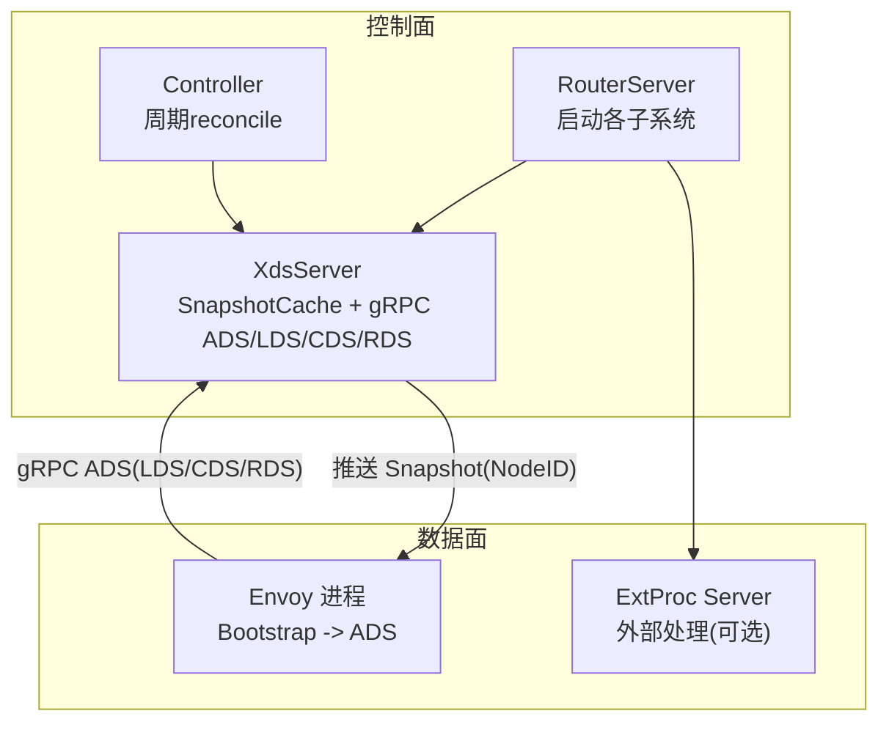
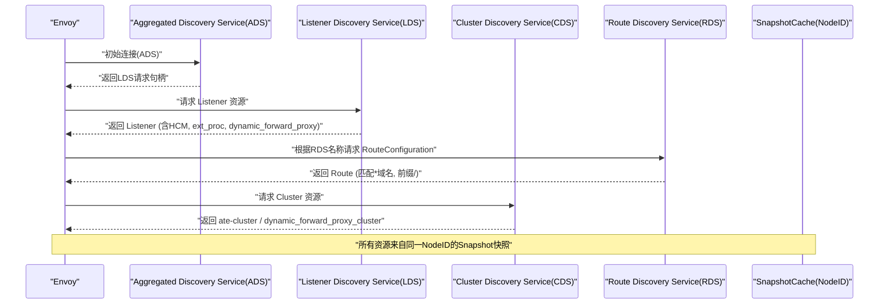
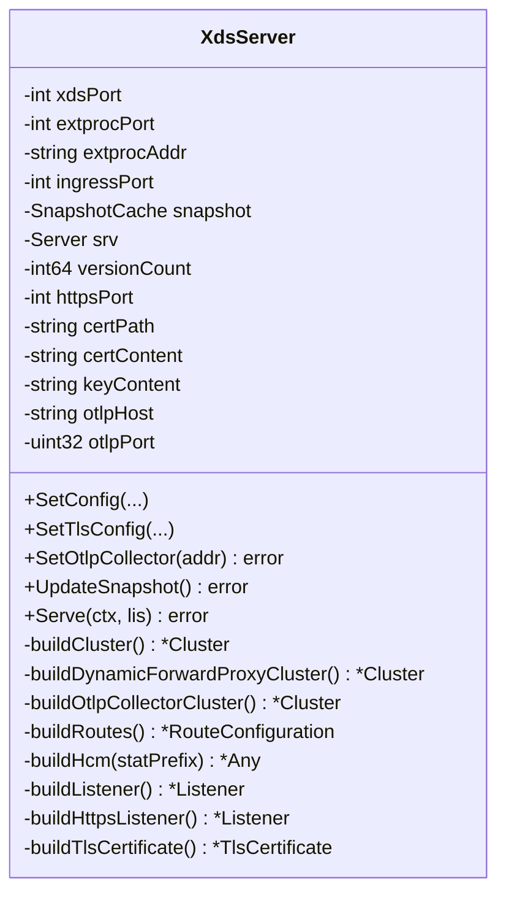
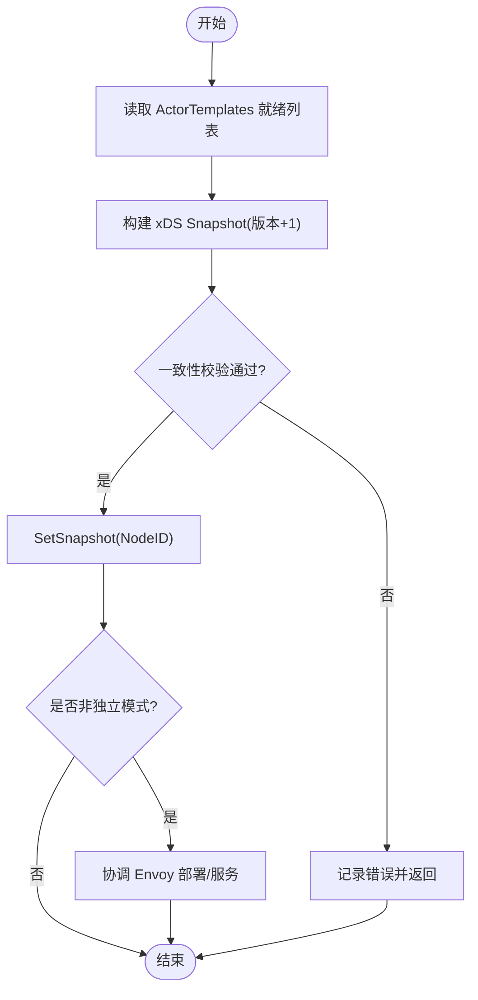
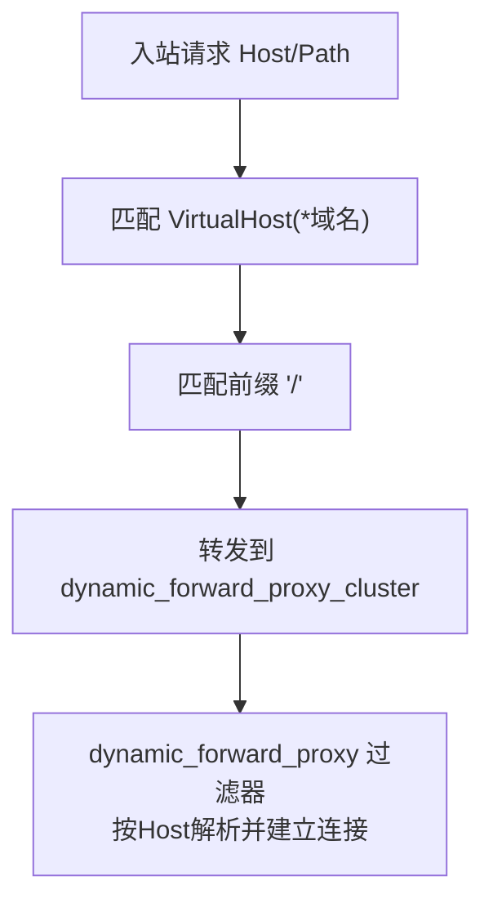
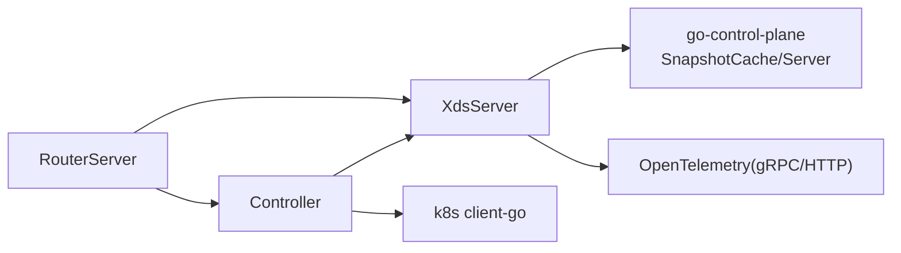

# XDS集成服务

<cite>
**本文引用的文件**   
- [xds.go](file://cmd/atenet/internal/router/xds.go)
- [controller.go](file://cmd/atenet/internal/router/controller.go)
- [router.go](file://cmd/atenet/internal/router/router.go)
- [xds_test.go](file://cmd/atenet/internal/router/xds_test.go)
- [atenet-router.yaml](file://manifests/ate-install/atenet-router.yaml)
</cite>

## 目录
1. [简介](#简介)
2. [项目结构](#项目结构)
3. [核心组件](#核心组件)
4. [架构总览](#架构总览)
5. [详细组件分析](#详细组件分析)
6. [依赖关系分析](#依赖关系分析)
7. [性能与可扩展性](#性能与可扩展性)
8. [故障排查指南](#故障排查指南)
9. [结论](#结论)
10. [附录](#附录)

## 简介
本文件面向XDS（扩展发现服务）集成，聚焦于gRPC流式通信在LDS、CDS、RDS三类资源上的响应处理；阐述基于Actor状态变化的动态配置推送机制；说明集群发现逻辑（含负载均衡与健康检查）、路由规则生成算法；并给出配置版本管理、增量更新与回滚策略，以及监控指标与调试工具使用方法。

## 项目结构
本项目中XDS相关实现位于atenet的router子系统中，核心由以下模块组成：
- XdsServer：提供聚合型xDS服务（ADS/LDS/CDS/RDS），维护SnapshotCache并按NodeID推送配置快照。
- Controller：周期性协调ActorTemplate就绪状态，触发xDS快照更新与Envoy实例编排。
- RouterServer：启动xDS、ExtProc、健康检查、状态页等子系统，注入TLS与OTLP追踪配置。
- Envoy Bootstrap：通过静态配置连接本地xDS服务，启用ADS拉取LDS/CDS/RDS。

图表来源
- [router.go:224-275](file://cmd/atenet/internal/router/router.go#L224-L275)
- [controller.go:67-110](file://cmd/atenet/internal/router/controller.go#L67-L110)
- [xds.go:196-225](file://cmd/atenet/internal/router/xds.go#L196-L225)

章节来源
- [router.go:152-315](file://cmd/atenet/internal/router/router.go#L152-L315)
- [controller.go:26-110](file://cmd/atenet/internal/router/controller.go#L26-L110)
- [xds.go:72-225](file://cmd/atenet/internal/router/xds.go#L72-L225)

## 核心组件
- XdsServer
  - 职责：构建并维护LDS/CDS/RDS资源快照，按NodeID发布到SnapshotCache；对外暴露gRPC ADS/LDS/CDS/RDS服务。
  - 关键能力：版本自增、一致性校验、TLS监听器、OTLP追踪、动态转发代理簇。
- Controller
  - 职责：定时读取ActorTemplates就绪状态，驱动xDS快照更新；在非独立模式下协调Envoy部署。
- RouterServer
  - 职责：初始化Tracing/Metrics、建立ATE API客户端、启动xDS与ExtProc服务、注册HTTP状态端点。

章节来源
- [xds.go:72-225](file://cmd/atenet/internal/router/xds.go#L72-L225)
- [controller.go:26-110](file://cmd/atenet/internal/router/controller.go#L26-L110)
- [router.go:152-315](file://cmd/atenet/internal/router/router.go#L152-L315)

## 架构总览
下图展示从Envoy启动到xDS推送配置的端到端流程，包括LDS/CDS/RDS三类资源的获取路径。

图表来源
- [xds.go:196-225](file://cmd/atenet/internal/router/xds.go#L196-L225)
- [xds.go:357-384](file://cmd/atenet/internal/router/xds.go#L357-L384)
- [xds.go:227-272](file://cmd/atenet/internal/router/xds.go#L227-L272)
- [xds.go:336-355](file://cmd/atenet/internal/router/xds.go#L336-L355)

## 详细组件分析

### XdsServer：LDS/CDS/RDS与Snapshot版本管理
- 版本管理与一致性
  - 每次UpdateSnapshot递增内部版本号，构造新Snapshot并通过SetSnapshot写入指定NodeID。
  - 调用Consistent进行快照完整性校验，确保Listener/Cluster/Route引用一致。
- 资源构建
  - CDS：静态簇“ate-cluster”指向本地ExtProc；动态转发代理簇“dynamic_forward_proxy_cluster”用于按Host解析上游。
  - RDS：单VirtualHost匹配所有域名，前缀“/”路由至动态转发代理簇。
  - LDS：HTTP监听器（可附加HTTPS监听器），HCM挂载ext_proc、dynamic_forward_proxy、router过滤器，RDS通过ADS拉取。
- TLS与追踪
  - 支持文件路径或内联证书；当配置OTLP地址时，HCM启用OpenTelemetry追踪，并创建专用OTLP簇。

图表来源
- [xds.go:72-90](file://cmd/atenet/internal/router/xds.go#L72-L90)
- [xds.go:106-146](file://cmd/atenet/internal/router/xds.go#L106-L146)
- [xds.go:148-194](file://cmd/atenet/internal/router/xds.go#L148-L194)
- [xds.go:196-225](file://cmd/atenet/internal/router/xds.go#L196-L225)
- [xds.go:227-272](file://cmd/atenet/internal/router/xds.go#L227-L272)
- [xds.go:336-355](file://cmd/atenet/internal/router/xds.go#L336-L355)
- [xds.go:357-384](file://cmd/atenet/internal/router/xds.go#L357-L384)
- [xds.go:386-466](file://cmd/atenet/internal/router/xds.go#L386-L466)
- [xds.go:503-531](file://cmd/atenet/internal/router/xds.go#L503-L531)
- [xds.go:533-576](file://cmd/atenet/internal/router/xds.go#L533-L576)
- [xds.go:578-606](file://cmd/atenet/internal/router/xds.go#L578-L606)

章节来源
- [xds.go:148-194](file://cmd/atenet/internal/router/xds.go#L148-L194)
- [xds.go:227-272](file://cmd/atenet/internal/router/xds.go#L227-L272)
- [xds.go:336-355](file://cmd/atenet/internal/router/xds.go#L336-L355)
- [xds.go:357-384](file://cmd/atenet/internal/router/xds.go#L357-L384)
- [xds.go:386-466](file://cmd/atenet/internal/router/xds.go#L386-L466)
- [xds.go:503-531](file://cmd/atenet/internal/router/xds.go#L503-L531)
- [xds.go:533-576](file://cmd/atenet/internal/router/xds.go#L533-L576)
- [xds.go:578-606](file://cmd/atenet/internal/router/xds.go#L578-L606)

### 动态配置推送与Actor状态联动
- 控制器循环
  - 启动即执行一次reconcile，随后每5秒轮询。
  - 读取ActorTemplates就绪集合后，调用XdsServer.UpdateSnapshot生成并发布新版本快照。
- 非独立模式
  - 同时协调Envoy部署对象，使新节点自动连接xDS端口并拉取最新配置。

图表来源
- [controller.go:67-110](file://cmd/atenet/internal/router/controller.go#L67-L110)
- [xds.go:148-194](file://cmd/atenet/internal/router/xds.go#L148-L194)

章节来源
- [controller.go:67-110](file://cmd/atenet/internal/router/controller.go#L67-L110)

### 集群发现逻辑：工作节点注册、负载均衡与健康检查
- 工作节点注册
  - 当前实现以静态方式将ExtProc作为后端端点加入“ate-cluster”，未包含Kubernetes Pod/Endpoint的动态注册逻辑。
- 负载均衡策略
  - “ate-cluster”使用ROUND_ROBIN；动态转发代理簇由自定义ClusterType提供LB策略。
- 健康检查
  - 代码中未发现针对后端端点的主动健康检查配置；如需接入，可在LoadAssignment中为端点添加health_check字段。

章节来源
- [xds.go:227-272](file://cmd/atenet/internal/router/xds.go#L227-L272)
- [xds.go:336-355](file://cmd/atenet/internal/router/xds.go#L336-L355)

### 路由规则生成算法：基于域名与服务发现的动态转发
- 默认路由
  - 单一VirtualHost匹配所有域名，前缀“/”全部路由到“dynamic_forward_proxy_cluster”。
- 动态转发代理
  - 通过dynamic_forward_proxy过滤器与对应ClusterType，在运行时依据请求Host进行DNS解析与连接建立。
- 扩展建议
  - 若需基于域名或服务发现精细化路由，可在buildRoutes中按模板/服务清单生成多VirtualHost与Route条目。

图表来源
- [xds.go:357-384](file://cmd/atenet/internal/router/xds.go#L357-L384)
- [xds.go:336-355](file://cmd/atenet/internal/router/xds.go#L336-L355)
- [xds.go:386-466](file://cmd/atenet/internal/router/xds.go#L386-L466)

章节来源
- [xds.go:357-384](file://cmd/atenet/internal/router/xds.go#L357-L384)
- [xds.go:386-466](file://cmd/atenet/internal/router/xds.go#L386-L466)

### 配置版本管理、增量更新与回滚机制
- 版本管理
  - UpdateSnapshot内部自增versionCount并以字符串形式作为Snapshot版本，SetSnapshot按NodeID原子替换。
- 增量更新
  - go-control-plane缓存层对同NodeID的变更会向已连接的Envoy推送差异资源；无需重建全量连接。
- 回滚机制
  - 由于版本单调递增，回滚可通过再次调用UpdateSnapshot生成旧版资源集合并发布新版本号实现。
- 一致性保障
  - 每次构建Snapshot后执行Consistent校验，避免不一致引用导致下发失败。

章节来源
- [xds.go:148-194](file://cmd/atenet/internal/router/xds.go#L148-L194)

### gRPC流式通信与资源类型映射
- 服务注册
  - 启动时注册ADS、LDS、CDS、RDS（及EDS占位）服务，统一由serverv3.Server处理。
- 资源类型
  - CDS：Cluster、Endpoint（静态端点）。
  - RDS：RouteConfiguration。
  - LDS：Listener（含HCM、ext_proc、dynamic_forward_proxy、router过滤器）。

章节来源
- [xds.go:196-225](file://cmd/atenet/internal/router/xds.go#L196-L225)

## 依赖关系分析
- 组件耦合
  - RouterServer负责生命周期与配置注入，Controller驱动快照更新，XdsServer专注资源构建与gRPC服务。
- 外部依赖
  - go-control-plane：SnapshotCache与serverv3.Server。
  - Kubernetes client-go：在非独立模式下协调Envoy部署。
  - OpenTelemetry：gRPC服务端统计与HTTP访问日志。

图表来源
- [router.go:224-275](file://cmd/atenet/internal/router/router.go#L224-L275)
- [controller.go:67-110](file://cmd/atenet/internal/router/controller.go#L67-L110)
- [xds.go:196-225](file://cmd/atenet/internal/router/xds.go#L196-L225)

章节来源
- [router.go:224-275](file://cmd/atenet/internal/router/router.go#L224-L275)
- [controller.go:67-110](file://cmd/atenet/internal/router/controller.go#L67-L110)
- [xds.go:196-225](file://cmd/atenet/internal/router/xds.go#L196-L225)

## 性能与可扩展性
- 并发与锁
  - UpdateSnapshot加互斥锁保护版本计数与快照构建，避免并发竞态。
- 内存与快照大小
  - 当前资源规模较小；随着VirtualHost/Route数量增长，建议按需拆分RouteConfiguration或使用Scoped Routes。
- 网络与超时
  - ExtProc消息超时显式设置为5秒，避免默认200ms导致的频繁重试。
- 追踪开销
  - 开启OTLP追踪会增加额外I/O，建议在开发环境启用，生产按需采样。

[本节为通用指导，不直接分析具体文件]

## 故障排查指南
- 常见问题定位
  - 初始快照失败：查看日志中“initial xDS setup update failed”提示。
  - 一致性校验失败：检查Listener/Cluster/Route引用是否完整。
  - HTTPS监听器缺失：确认是否设置httpsPort与证书。
- 验证方法
  - 单元测试覆盖：
    - 基础快照：验证Cluster/Route/Listener数量与关键字段。
    - HTTPS场景：验证监听器数量与传输套接字类型。
    - 优雅关闭：验证Serve在上下文取消后正常退出。
- 运行期观察
  - 通过Prometheus抓取服务指标；通过状态页/日志定位问题。

章节来源
- [xds.go:196-225](file://cmd/atenet/internal/router/xds.go#L196-L225)
- [xds_test.go:31-139](file://cmd/atenet/internal/router/xds_test.go#L31-L139)
- [xds_test.go:141-182](file://cmd/atenet/internal/router/xds_test.go#L141-L182)
- [xds_test.go:184-212](file://cmd/atenet/internal/router/xds_test.go#L184-L212)

## 结论
该XDS集成以SnapshotCache为核心，结合Controller周期reconcile，实现了LDS/CDS/RDS的稳定推送与动态转发代理能力。当前实现侧重简洁与可观测性，后续可按需在路由生成、端点注册与健康检查方面增强，以满足更复杂的流量治理需求。

[本节为总结性内容，不直接分析具体文件]

## 附录

### Envoy Bootstrap与xDS连接
- 通过静态配置声明ads_config与lds/cds_config，指向本地xDS服务端口。
- 静态簇xds_cluster用于Envoy与本地xDS的gRPC通信。

章节来源
- [atenet-router.yaml:63-101](file://manifests/ate-install/atenet-router.yaml#L63-L101)

### 监控指标与调试工具
- 指标采集
  - gRPC服务端StatsHandler启用OTel统计；HTTP状态端点可暴露运行信息。
- 调试建议
  - 使用单元测试断言Snapshot资源结构与端口绑定。
  - 结合日志级别与OTLP追踪定位链路瓶颈。

章节来源
- [router.go:176-194](file://cmd/atenet/internal/router/router.go#L176-L194)
- [router.go:289-312](file://cmd/atenet/internal/router/router.go#L289-L312)
- [xds.go:196-225](file://cmd/atenet/internal/router/xds.go#L196-L225)
