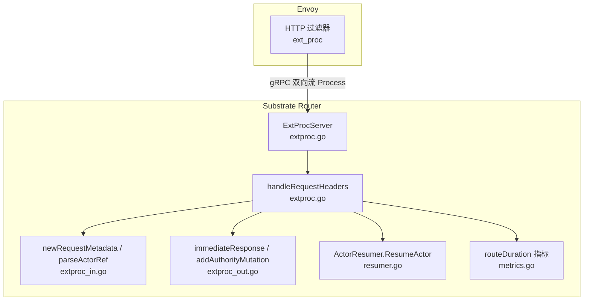
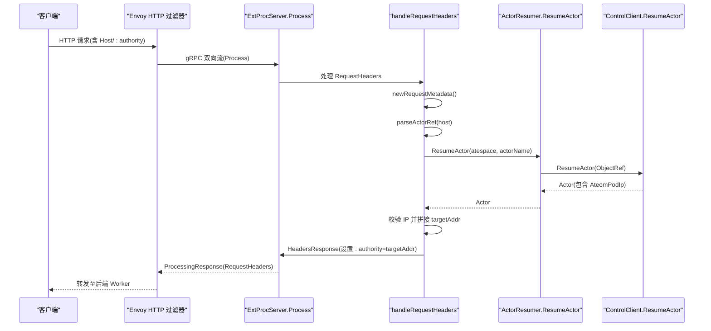
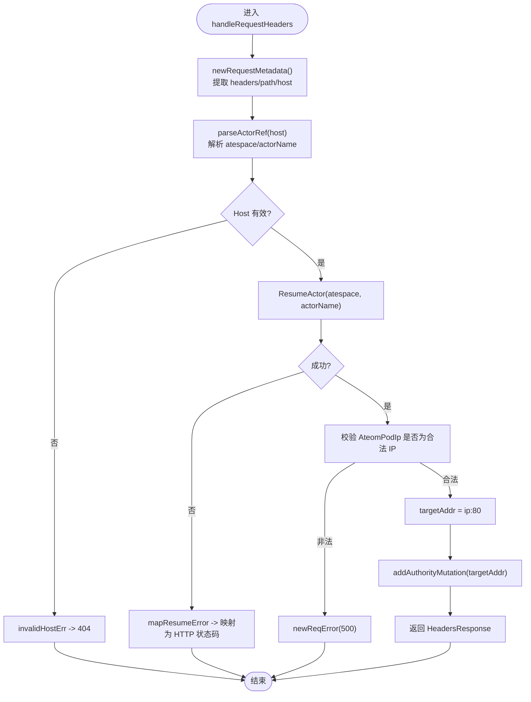
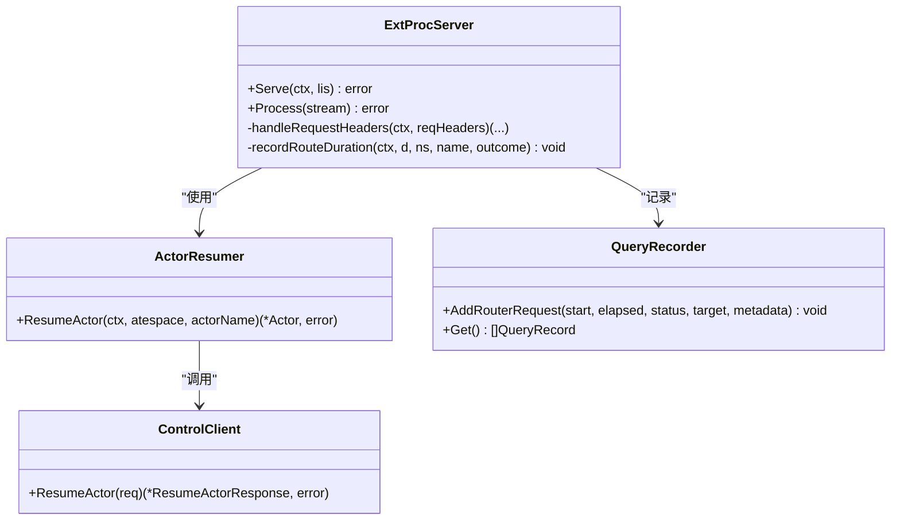

# 外部处理协议

<cite>
**本文引用的文件**
- [extproc.go](file://cmd/atenet/internal/router/extproc.go)
- [extproc_in.go](file://cmd/atenet/internal/router/extproc_in.go)
- [extproc_out.go](file://cmd/atenet/internal/router/extproc_out.go)
- [resumer.go](file://cmd/atenet/internal/router/resumer.go)
- [metrics.go](file://cmd/atenet/internal/router/metrics.go)
- [extproc_test.go](file://cmd/atenet/internal/router/extproc_test.go)
- [extproc_in_test.go](file://cmd/atenet/internal/router/extproc_in_test.go)
</cite>

## 目录
1. [简介](#简介)
2. [项目结构](#项目结构)
3. [核心组件](#核心组件)
4. [架构总览](#架构总览)
5. [详细组件分析](#详细组件分析)
6. [依赖关系分析](#依赖关系分析)
7. [性能与可靠性](#性能与可靠性)
8. [故障排查指南](#故障排查指南)
9. [结论](#结论)
10. [附录：协议示例与调试方法](#附录协议示例与调试方法)

## 简介
本文件面向 ExtProc（External Processing）协议在 Substrate 中的实现，重点说明 Envoy HTTP 过滤器通过 gRPC 双向流式通信调用外部处理器进行请求拦截、路由决策与响应处理的完整流程。文档覆盖入站请求处理（extproc_in.go）、出站响应处理（extproc_out.go）、会话状态管理、错误映射、性能优化策略、超时控制与重试机制，并提供协议示例与调试方法。

## 项目结构
ExtProc 相关代码位于 atenet 的 router 子包中，主要文件如下：
- extproc.go：gRPC 服务注册、Process 双向流主循环、请求头处理入口、指标记录与错误分类
- extproc_in.go：入站请求元数据解析、Host/:authority 解析为 (atespace, actorName)
- extproc_out.go：出站响应辅助工具（立即响应构造、:authority 修改器）
- resumer.go：Actor 恢复协调器（去重、指数退避重试）
- metrics.go：路由耗时指标定义与创建
- 测试文件：extproc_test.go、extproc_in_test.go

图表来源
- [extproc.go:58-128](file://cmd/atenet/internal/router/extproc.go#L58-L128)
- [extproc_in.go:31-72](file://cmd/atenet/internal/router/extproc_in.go#L31-L72)
- [extproc_out.go:35-67](file://cmd/atenet/internal/router/extproc_out.go#L35-L67)
- [resumer.go:46-104](file://cmd/atenet/internal/router/resumer.go#L46-L104)
- [metrics.go:34-51](file://cmd/atenet/internal/router/metrics.go#L34-L51)

章节来源
- [extproc.go:40-78](file://cmd/atenet/internal/router/extproc.go#L40-L78)
- [extproc_in.go:25-72](file://cmd/atenet/internal/router/extproc_in.go#L25-L72)
- [extproc_out.go:23-67](file://cmd/atenet/internal/router/extproc_out.go#L23-L67)
- [resumer.go:31-41](file://cmd/atenet/internal/router/resumer.go#L31-L41)
- [metrics.go:24-51](file://cmd/atenet/internal/router/metrics.go#L24-L51)

## 核心组件
- ExtProcServer：实现 Envoy ExternalProcessor gRPC 接口，提供 Serve 启动与 Process 双向流处理；负责请求头阶段拦截、路由决策、指标记录与错误映射。
- requestMetadata：封装入站请求的 headers、path、host 等元信息，用于后续解析与追踪。
- ActorResumer：对同一 (atespace, actorName) 并发恢复请求进行去重，并带指数退避重试，保证幂等性与稳定性。
- 出站响应工具：immediateResponse 快速返回错误响应；addAuthorityMutation 动态改写 :authority 以完成目标地址重写。
- 指标：routeDuration 度量从接收请求到解析出目标 worker 端点的耗时。

章节来源
- [extproc.go:40-56](file://cmd/atenet/internal/router/extproc.go#L40-L56)
- [extproc_in.go:25-57](file://cmd/atenet/internal/router/extproc_in.go#L25-L57)
- [extproc_out.go:35-67](file://cmd/atenet/internal/router/extproc_out.go#L35-L67)
- [resumer.go:31-41](file://cmd/atenet/internal/router/resumer.go#L31-L41)
- [metrics.go:24-51](file://cmd/atenet/internal/router/metrics.go#L24-L51)

## 架构总览
ExtProc 作为 Envoy 的外部处理器，运行独立的 gRPC 服务。Envoy 在每个请求的 RequestHeaders 阶段向该服务发起 gRPC 双向流调用，服务端根据 Host/:authority 解析出目标 Actor，并通过 ResumeActor 确保其处于运行态，随后将 :authority 改写为后端 Worker IP:Port，交由 Envoy 继续转发。

图表来源
- [extproc.go:80-128](file://cmd/atenet/internal/router/extproc.go#L80-L128)
- [extproc.go:130-188](file://cmd/atenet/internal/router/extproc.go#L130-L188)
- [extproc_in.go:31-72](file://cmd/atenet/internal/router/extproc_in.go#L31-L72)
- [resumer.go:46-104](file://cmd/atenet/internal/router/resumer.go#L46-L104)

## 详细组件分析

### 入站请求处理流程（extproc_in.go + extproc.go）
- 元数据提取：newRequestMetadata 将 Envoy 传入的 HeaderValue 列表转为小写键的 map，并提取 :path、:authority/host。
- 主机名解析：parseActorRef 去除端口后，按约定域名后缀解析出 atespace 与 actorName。
- 链路追踪：从 HTTP 头中提取 traceparent，注入当前 span，以便与 Envoy 上游链路关联。
- 路由决策：调用 ActorResumer.ResumeActor 确保 Actor 运行，获取 Pod IP，拼接 targetAddr（默认端口 80）。
- 响应构造：使用 addAuthorityMutation 将 :authority 改写为目标地址，返回 HeadersResponse。
- 指标与记录：记录 routeDuration 指标，并将请求摘要写入 QueryRecorder 供诊断。

图表来源
- [extproc.go:130-188](file://cmd/atenet/internal/router/extproc.go#L130-L188)
- [extproc_in.go:31-72](file://cmd/atenet/internal/router/extproc_in.go#L31-L72)
- [extproc_out.go:35-44](file://cmd/atenet/internal/router/extproc_out.go#L35-L44)

章节来源
- [extproc_in.go:31-72](file://cmd/atenet/internal/router/extproc_in.go#L31-L72)
- [extproc.go:130-188](file://cmd/atenet/internal/router/extproc.go#L130-L188)
- [extproc_out.go:35-44](file://cmd/atenet/internal/router/extproc_out.go#L35-L44)

### 出站响应处理（extproc_out.go）
- immediateResponse：构造 ImmediateResponse，直接返回指定 HTTP 状态码与文本体，适用于鉴权失败、参数不合法或内部错误等场景。
- addAuthorityMutation：在 HeaderMutation 中设置 :authority 为后端目标地址，驱动 Envoy 将请求转发到具体 Worker。

注意：当前实现仅处理 RequestHeaders 阶段，未实现 RequestBody/ResponseBody 阶段的拦截与修改。

章节来源
- [extproc_out.go:35-67](file://cmd/atenet/internal/router/extproc_out.go#L35-L67)
- [extproc.go:92-122](file://cmd/atenet/internal/router/extproc.go#L92-L122)

### 会话状态管理与连接映射
- 无本地持久化会话表：ExtProcServer 不维护“客户端连接 <-> 后端服务”的显式映射。
- 基于 Host/:authority 的动态路由：每次请求均通过 Host 解析出 (atespace, actorName)，再经 ResumeActor 获取最新 Worker IP，从而建立“请求 -> 后端实例”的瞬时映射。
- 幂等与去重：ActorResumer 使用 singleflight 对相同 (atespace, actorName) 的并发恢复请求进行合并，避免重复唤醒同一 Actor。

章节来源
- [extproc.go:130-188](file://cmd/atenet/internal/router/extproc.go#L130-L188)
- [resumer.go:46-104](file://cmd/atenet/internal/router/resumer.go#L46-L104)

### 错误处理与状态码映射
- reqError：携带 HTTP 状态码与安全消息，保留原始 cause 便于日志审计但不泄露细节。
- classifyOutcome：将上下文取消/超时归类为 cancelled，NotFound 归类为 not_found，其余为 error，用于指标维度统计。
- 常见映射（由测试用例验证）：
  - NotFound -> 404
  - FailedPrecondition -> 503
  - Unavailable -> 503
  - DeadlineExceeded -> 504
  - 非预期错误 -> 500

章节来源
- [extproc_out.go:23-33](file://cmd/atenet/internal/router/extproc_out.go#L23-L33)
- [extproc.go:190-212](file://cmd/atenet/internal/router/extproc.go#L190-L212)
- [extproc_test.go:93-254](file://cmd/atenet/internal/router/extproc_test.go#L93-L254)

### 鉴权与鉴权扩展点
- 当前实现未在 RequestHeaders 阶段执行鉴权逻辑，但提供了扩展点：可在 handleRequestHeaders 中读取 headers 并进行自定义鉴权，必要时通过 immediateResponse 返回 4xx/5xx。
- 安全建议：避免在日志中输出敏感字段（如 token、cookie），测试已覆盖此约束。

章节来源
- [extproc.go:130-188](file://cmd/atenet/internal/router/extproc.go#L130-L188)
- [extproc_test.go:45-91](file://cmd/atenet/internal/router/extproc_test.go#L45-L91)

## 依赖关系分析
- ExtProcServer 依赖：
  - ateapipb.ControlClient：用于调用 ResumeActor
  - ActorResumer：并发去重与重试
  - QueryRecorder：记录最近请求摘要
  - OpenTelemetry：指标与链路追踪
- 外部依赖：
  - Envoy ext_proc v3 协议类型
  - gRPC 双向流
  - singleflight：并发合并
  - wait.ExponentialBackoffWithContext：指数退避重试

图表来源
- [extproc.go:40-56](file://cmd/atenet/internal/router/extproc.go#L40-L56)
- [resumer.go:31-41](file://cmd/atenet/internal/router/resumer.go#L31-L41)

章节来源
- [extproc.go:40-56](file://cmd/atenet/internal/router/extproc.go#L40-L56)
- [resumer.go:31-41](file://cmd/atenet/internal/router/resumer.go#L31-L41)

## 性能与可靠性
- 并发去重：ActorResumer 使用 singleflight 对相同 Actor 的恢复请求进行合并，降低控制面压力与抖动。
- 指数退避重试：对 Aborted 等可重试错误进行指数退避，提升鲁棒性。
- 独立后台超时：ResumeActor 内部使用固定超时（约 15s）的后台上下文，避免上游断开导致恢复中断。
- 指标观测：routeDuration 直方图记录从接收请求到解析出目标端点的耗时，支持按模板命名空间与名称聚合。
- 传输层：gRPC StatsHandler 集成 OpenTelemetry，便于端到端追踪。

章节来源
- [resumer.go:46-104](file://cmd/atenet/internal/router/resumer.go#L46-L104)
- [metrics.go:34-51](file://cmd/atenet/internal/router/metrics.go#L34-L51)
- [extproc.go:58-78](file://cmd/atenet/internal/router/extproc.go#L58-L78)

## 故障排查指南
- 常见问题定位
  - Host 无效：返回 404，检查域名是否符合 actors.resources.substrate.ate.dev 后缀。
  - Actor 不存在：返回 404，确认 Actor 是否已创建且命名正确。
  - 资源不足/不可用：返回 503，检查集群资源与控制平面健康。
  - 超时：返回 504，检查网络延迟与后端负载。
  - 内部错误：返回 500，查看日志与指标。
- 日志与追踪
  - 使用 OpenTelemetry 追踪链，确认 ExtProc.RequestHeaders 与 ResumeActor 子跨度。
  - 检查 QueryRecorder 最近请求摘要，确认 host、target 与状态。
- 安全与隐私
  - 确保日志不包含敏感信息（token、cookie 等），已有测试覆盖。

章节来源
- [extproc_test.go:45-91](file://cmd/atenet/internal/router/extproc_test.go#L45-L91)
- [extproc_test.go:93-254](file://cmd/atenet/internal/router/extproc_test.go#L93-L254)
- [extproc.go:190-212](file://cmd/atenet/internal/router/extproc.go#L190-L212)

## 结论
ExtProc 在当前实现中以轻量、无状态的方式完成请求拦截与动态路由：基于 Host/:authority 解析目标 Actor，通过幂等的恢复与重试机制确保后端就绪，并以最小开销改写 :authority 完成转发。配合指标与追踪，可实现高可观测性与稳定的生产级表现。若需更复杂的鉴权、缓存或响应修改能力，可在现有扩展点上进行增强。

## 附录：协议示例与调试方法

### 协议交互示例（概念性）
- 入站请求
  - 方法：POST
  - 路径：/api/v1/invoke
  - Host：my-actor.team-a.actors.resources.substrate.ate.dev
- Envoy 行为
  - 在 RequestHeaders 阶段调用 ExtProc Server
  - 收到 HeadersResponse 后，将 :authority 改写为后端 Worker IP:Port
- 出站响应
  - 正常：由后端 Worker 返回业务响应
  - 异常：ExtProc 可通过 ImmediateResponse 直接返回 4xx/5xx

[本图为概念示意，不对应具体源码]

### 调试方法
- 启用 OpenTelemetry 导出，观察 ExtProc.RequestHeaders 与 ResumeActor 跨度
- 查询 QueryRecorder 最近请求摘要，核对 host、target 与状态
- 针对鉴权与敏感字段，参考测试用例验证日志不泄露

章节来源
- [extproc.go:130-188](file://cmd/atenet/internal/router/extproc.go#L130-L188)
- [extproc_test.go:45-91](file://cmd/atenet/internal/router/extproc_test.go#L45-L91)
