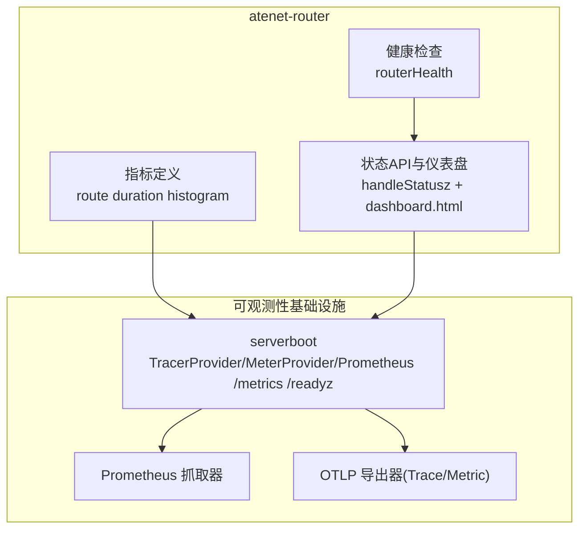
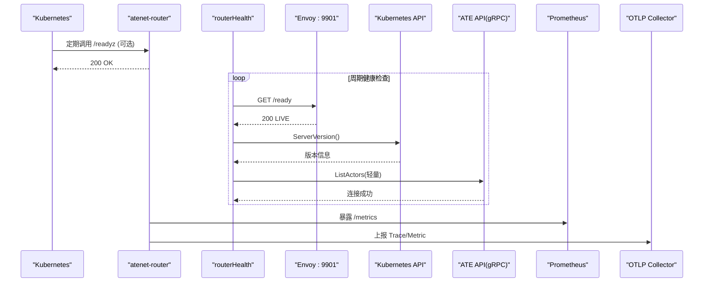
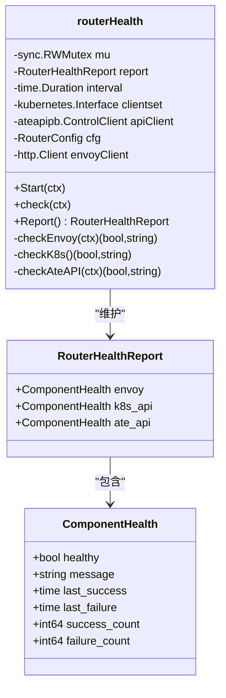
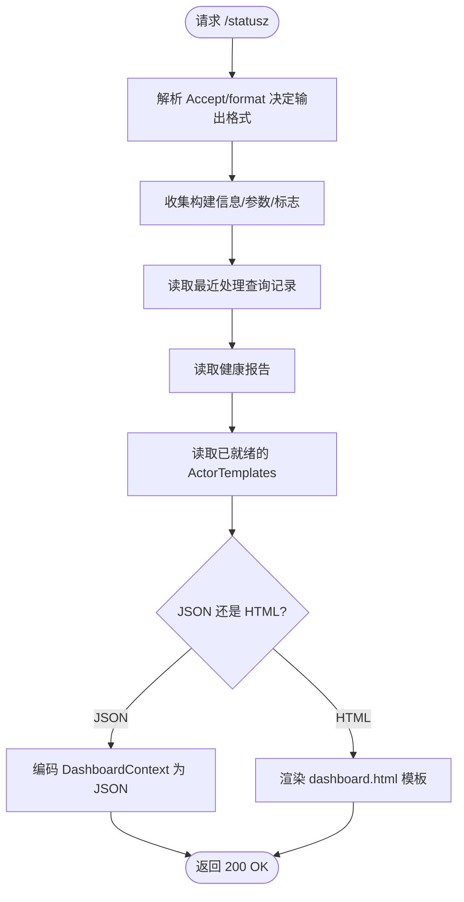
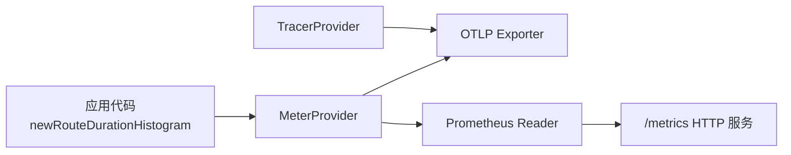
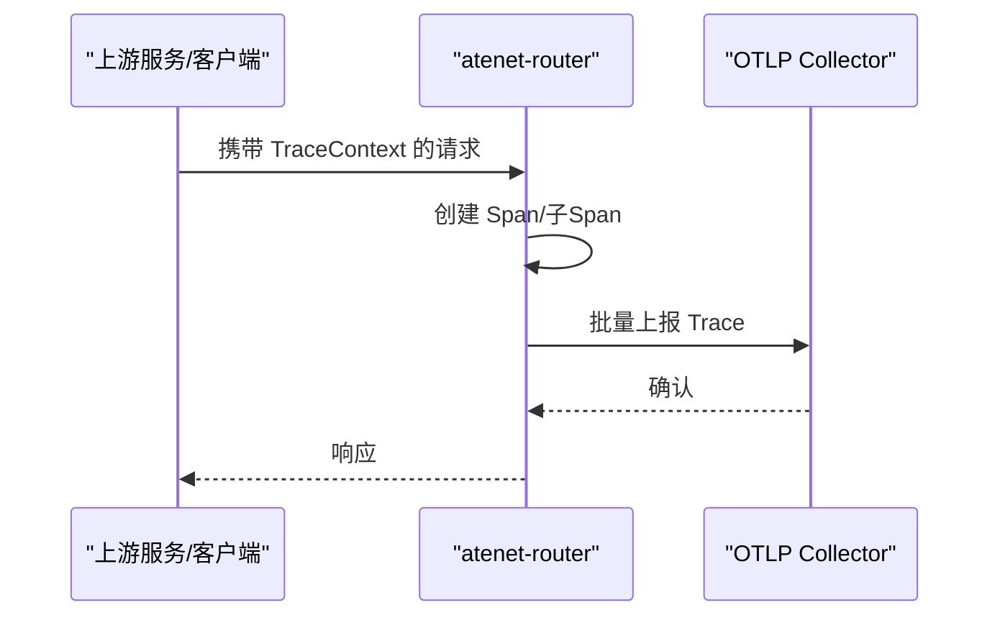
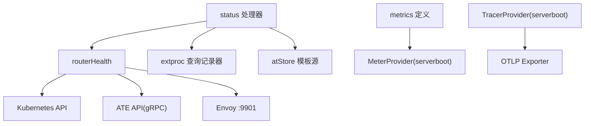

# 健康检查与监控

<cite>
**本文引用的文件**   
- [cmd/atenet/internal/router/health.go](file://cmd/atenet/internal/router/health.go)
- [cmd/atenet/internal/router/status.go](file://cmd/atenet/internal/router/status.go)
- [cmd/atenet/internal/router/metrics.go](file://cmd/atenet/internal/router/metrics.go)
- [internal/serverboot/serverboot.go](file://internal/serverboot/serverboot.go)
- [docs/dev/best-practices/tracing.md](file://docs/dev/best-practices/tracing.md)
- [benchmarking/monitoring.yaml](file://benchmarking/monitoring.yaml)
</cite>

## 目录
1. [简介](#简介)
2. [项目结构](#项目结构)
3. [核心组件](#核心组件)
4. [架构总览](#架构总览)
5. [详细组件分析](#详细组件分析)
6. [依赖关系分析](#依赖关系分析)
7. [性能考量](#性能考量)
8. [故障诊断指南](#故障诊断指南)
9. [结论](#结论)
10. [附录](#附录)

## 简介
本文件面向 Agent Substrate 网络层（atenet-router）的健康检查与监控系统，系统性说明：
- 健康检查端点设计：存活探针、就绪探针与服务状态检测
- 状态监控 API：如何暴露网络组件运行状态与关键指标
- Prometheus 指标收集机制：请求延迟、吞吐量、错误率与资源使用
- 告警规则定义与通知机制：及时发现和处理网络异常
- 分布式追踪集成：端到端请求链路跟踪
- 监控仪表板配置与故障诊断工具：帮助运维掌握网络层运行状况

## 项目结构
与“健康检查与监控”直接相关的代码与配置主要分布在以下位置：
- 路由器健康检查与状态页面：cmd/atenet/internal/router/*
- 通用可观测性启动与指标服务：internal/serverboot/serverboot.go
- 追踪最佳实践文档：docs/dev/best-practices/tracing.md
- 基准测试环境中的 Prometheus 部署示例：benchmarking/monitoring.yaml

图表来源
- [cmd/atenet/internal/router/health.go:47-218](file://cmd/atenet/internal/router/health.go#L47-L218)
- [cmd/atenet/internal/router/status.go:180-285](file://cmd/atenet/internal/router/status.go#L180-L285)
- [cmd/atenet/internal/router/metrics.go:24-52](file://cmd/atenet/internal/router/metrics.go#L24-L52)
- [internal/serverboot/serverboot.go:121-192](file://internal/serverboot/serverboot.go#L121-L192)

章节来源
- [cmd/atenet/internal/router/health.go:47-218](file://cmd/atenet/internal/router/health.go#L47-L218)
- [cmd/atenet/internal/router/status.go:180-285](file://cmd/atenet/internal/router/status.go#L180-L285)
- [cmd/atenet/internal/router/metrics.go:24-52](file://cmd/atenet/internal/router/metrics.go#L24-L52)
- [internal/serverboot/serverboot.go:121-192](file://internal/serverboot/serverboot.go#L121-L192)

## 核心组件
- 健康检查器 routerHealth：周期性探测 Envoy、Kubernetes API、ATE API gRPC 的可用性，维护成功/失败计数与最近成功/失败时间。
- 状态 API handleStatusz：提供 JSON 或 HTML 格式的运行状态页面，聚合构建信息、端口、参数、模板列表、健康报告与最近处理查询记录。
- 指标定义 newRouteDurationHistogram：基于 OpenTelemetry Meter 创建路由阶段耗时直方图，用于评估从接收请求到解析目标 worker 的延迟。
- serverboot 可观测性初始化：统一初始化 TracerProvider、MeterProvider，并启动 /metrics 与可选 /readyz HTTP 服务。

章节来源
- [cmd/atenet/internal/router/health.go:47-218](file://cmd/atenet/internal/router/health.go#L47-L218)
- [cmd/atenet/internal/router/status.go:180-285](file://cmd/atenet/internal/router/status.go#L180-L285)
- [cmd/atenet/internal/router/metrics.go:24-52](file://cmd/atenet/internal/router/metrics.go#L24-L52)
- [internal/serverboot/serverboot.go:121-192](file://internal/serverboot/serverboot.go#L121-L192)

## 架构总览
atenet-router 通过内部健康检查器持续探测下游依赖，并将结果暴露给状态 API；同时通过 serverboot 提供的 OTel SDK 将 Trace 与 Metric 数据导出至 OTLP 与 Prometheus。

图表来源
- [internal/serverboot/serverboot.go:176-192](file://internal/serverboot/serverboot.go#L176-L192)
- [cmd/atenet/internal/router/health.go:91-147](file://cmd/atenet/internal/router/health.go#L91-L147)
- [cmd/atenet/internal/router/health.go:149-208](file://cmd/atenet/internal/router/health.go#L149-L208)

## 详细组件分析

### 健康检查器（routerHealth）
- 功能要点
  - 周期性触发健康检查，立即执行一次并在定时器驱动下重复执行。
  - 分别探测：
    - Envoy：HTTP 访问本地 :9901/ready，期望响应体为 "LIVE"。
    - Kubernetes API：通过 Discovery ServerVersion 判断连通性。
    - ATE API gRPC：发起轻量 ListActors 请求验证连接。
  - 维护每个组件的 Healthy、Message、LastSuccess、LastFailure、SuccessCount、FailureCount。
- 并发与超时
  - 使用互斥锁保护报告读写。
  - 对 Envoy 与 ATE API 设置短超时上下文，避免阻塞。
- 可观测性
  - 对外部 HTTP 客户端使用 otelhttp 包装，使健康检查本身也可被追踪。

图表来源
- [cmd/atenet/internal/router/health.go:32-72](file://cmd/atenet/internal/router/health.go#L32-L72)
- [cmd/atenet/internal/router/health.go:91-218](file://cmd/atenet/internal/router/health.go#L91-L218)

章节来源
- [cmd/atenet/internal/router/health.go:47-218](file://cmd/atenet/internal/router/health.go#L47-L218)

### 状态 API 与仪表盘（handleStatusz + dashboard.html）
- 功能要点
  - 支持 JSON 与 HTML 两种返回格式（Accept 头或 format 查询参数）。
  - 聚合信息包括：
    - 构建标签与 VCS 修订
    - CLI 参数与 pflag 标志
    - 当前处理的 ActorTemplates 列表
    - 最近处理的请求记录（含时间戳、客户端、Host、Path、Method、Action、Target、Duration）
    - 系统组件健康报告
  - 内置 HTML 仪表盘展示上述信息，便于快速定位问题。
- 安全与脱敏
  - 路径中查询字符串会被剥离，防止敏感参数泄露。
- 追踪集成
  - 处理入口开启 span，便于在分布式追踪中观察状态页请求。

图表来源
- [cmd/atenet/internal/router/status.go:180-285](file://cmd/atenet/internal/router/status.go#L180-L285)
- [cmd/atenet/internal/router/dashboard.html:244-334](file://cmd/atenet/internal/router/dashboard.html#L244-L334)

章节来源
- [cmd/atenet/internal/router/status.go:180-285](file://cmd/atenet/internal/router/status.go#L180-L285)
- [cmd/atenet/internal/router/dashboard.html:244-334](file://cmd/atenet/internal/router/dashboard.html#L244-L334)

### Prometheus 指标与 OTLP 导出
- 指标定义
  - atenet.router.route.duration：从 ext_proc 收到请求到解析出目标 worker 的耗时直方图，单位秒，显式桶边界覆盖毫秒到数十秒范围。
- 指标采集与导出
  - serverboot.InitMetrics 注册全局 MeterProvider，包含：
    - Prometheus Reader：通过 /metrics 暴露
    - OTLP Periodic Reader：定时上报 metric 到 OTLP Collector
- 追踪初始化
  - serverboot.InitTracing 注册全局 TracerProvider，使用 OTLP gRPC 导出 trace，并设置 TraceContext 文本映射传播器。

图表来源
- [cmd/atenet/internal/router/metrics.go:24-52](file://cmd/atenet/internal/router/metrics.go#L24-L52)
- [internal/serverboot/serverboot.go:121-147](file://internal/serverboot/serverboot.go#L121-L147)
- [internal/serverboot/serverboot.go:91-119](file://internal/serverboot/serverboot.go#L91-L119)
- [internal/serverboot/serverboot.go:176-192](file://internal/serverboot/serverboot.go#L176-L192)

章节来源
- [cmd/atenet/internal/router/metrics.go:24-52](file://cmd/atenet/internal/router/metrics.go#L24-L52)
- [internal/serverboot/serverboot.go:91-147](file://internal/serverboot/serverboot.go#L91-L147)
- [internal/serverboot/serverboot.go:176-192](file://internal/serverboot/serverboot.go#L176-L192)

### 存活与就绪探针
- 就绪探针 /readyz
  - serverboot.StartMetricsServer 可选择启用 /readyz，返回 200 OK，适用于 Kubernetes Readiness Probe。
- 存活探针 /livez
  - 代码库未实现独立的 /livez 端点；通常由容器运行时或进程管理器负责进程级存活判定。
- 组件级就绪
  - 路由器内部通过 routerHealth 探测 Envoy/K8s/ATE API 的可用性，并通过 /statusz 暴露健康报告，供上层编排或运维工具参考。

章节来源
- [internal/serverboot/serverboot.go:176-192](file://internal/serverboot/serverboot.go#L176-L192)
- [cmd/atenet/internal/router/health.go:91-147](file://cmd/atenet/internal/router/health.go#L91-L147)

### 告警规则与通知机制
- 指标基础
  - 可利用 atenet.router.route.duration 计算 P95/P99 延迟、错误率（结合业务侧状态码维度）、以及健康报告中的 FailureCount 增长速率等。
- 抓取与存储
  - benchmarking/monitoring.yaml 提供了 Prometheus 在 Kubernetes 中的抓取配置示例，可按需扩展 job 以抓取 atenet-router 的 /metrics。
- 告警与通知
  - 仓库未内嵌 Alertmanager 或告警规则；建议在外部 Prometheus/Alertmanager 中基于上述指标定义阈值与通知策略。

章节来源
- [cmd/atenet/internal/router/metrics.go:24-52](file://cmd/atenet/internal/router/metrics.go#L24-L52)
- [cmd/atenet/internal/router/health.go:91-147](file://cmd/atenet/internal/router/health.go#L91-L147)
- [benchmarking/monitoring.yaml:59-84](file://benchmarking/monitoring.yaml#L59-L84)

### 分布式追踪集成
- 服务端
  - 使用 serverboot.InitTracing 初始化 TracerProvider，并通过 OTLP gRPC 导出。
  - 在 HTTP/gRPC 中间件自动注入/提取追踪上下文，支持跨服务链路。
- 客户端
  - 建议遵循 best-practices 文档，在 HTTP/gRPC 客户端也初始化 TracerProvider 并注入追踪元数据，以实现端到端追踪。

图表来源
- [internal/serverboot/serverboot.go:91-119](file://internal/serverboot/serverboot.go#L91-119)
- [docs/dev/best-practices/tracing.md:83-138](file://docs/dev/best-practices/tracing.md#L83-L138)

章节来源
- [internal/serverboot/serverboot.go:91-119](file://internal/serverboot/serverboot.go#L91-119)
- [docs/dev/best-practices/tracing.md:83-138](file://docs/dev/best-practices/tracing.md#L83-L138)

## 依赖关系分析
- 组件耦合
  - routerHealth 依赖 Kubernetes clientset、ATE API gRPC 客户端与本地 Envoy HTTP 接口。
  - status 处理器依赖 routerHealth 报告、extproc 查询记录器与 atStore 模板源。
  - metrics 模块依赖全局 MeterProvider。
  - serverboot 提供统一的 TracerProvider/MeterProvider 与 /metrics、/readyz 服务。
- 外部依赖
  - OpenTelemetry（Trace/Metric）、Prometheus、gRPC、Kubernetes API、Envoy。

图表来源
- [cmd/atenet/internal/router/health.go:91-208](file://cmd/atenet/internal/router/health.go#L91-L208)
- [cmd/atenet/internal/router/status.go:180-285](file://cmd/atenet/internal/router/status.go#L180-L285)
- [cmd/atenet/internal/router/metrics.go:24-52](file://cmd/atenet/internal/router/metrics.go#L24-L52)
- [internal/serverboot/serverboot.go:91-147](file://internal/serverboot/serverboot.go#L91-L147)

章节来源
- [cmd/atenet/internal/router/health.go:91-208](file://cmd/atenet/internal/router/health.go#L91-L208)
- [cmd/atenet/internal/router/status.go:180-285](file://cmd/atenet/internal/router/status.go#L180-L285)
- [cmd/atenet/internal/router/metrics.go:24-52](file://cmd/atenet/internal/router/metrics.go#L24-L52)
- [internal/serverboot/serverboot.go:91-147](file://internal/serverboot/serverboot.go#L91-L147)

## 性能考量
- 健康检查间隔与超时
  - 健康检查默认间隔为 1 秒，Envoy/APE API 探测使用短超时上下文，避免影响主流程。
- 指标桶边界
  - route duration 直方图桶边界覆盖毫秒到数十秒，适合低延迟场景下的分位统计。
- 状态页开销
  - 最近查询记录采用环形缓冲区，限制内存占用；模板列表与健康报告读取为只读操作，注意在大规模模板场景下控制查询频率。

[本节为通用指导，不直接分析具体文件]

## 故障诊断指南
- 快速定位
  - 访问 /statusz（JSON 或 HTML），查看各组件健康状态、最近处理请求与模板列表。
  - 关注健康报告中 FailureCount 增长与 LastFailure 时间，定位最近失败时间点。
- 指标排查
  - 抓取 /metrics，分析 atenet.router.route.duration 的分位延迟与趋势。
  - 结合外部日志与 Trace ID，定位慢请求与异常路径。
- 常见现象与建议
  - Envoy 不可用：检查 :9901/ready 响应是否为 "LIVE"，确认 Envoy 进程与监听端口。
  - K8s API 不可达：核对集群访问权限与网络连通性。
  - ATE API 不可用：确认 gRPC 连接与认证配置。

章节来源
- [cmd/atenet/internal/router/status.go:180-285](file://cmd/atenet/internal/router/status.go#L180-L285)
- [cmd/atenet/internal/router/health.go:149-208](file://cmd/atenet/internal/router/health.go#L149-L208)
- [cmd/atenet/internal/router/metrics.go:24-52](file://cmd/atenet/internal/router/metrics.go#L24-L52)

## 结论
atenet-router 通过内部健康检查器、状态 API 与 OpenTelemetry 体系，构建了完整的健康检查与监控能力。配合 Prometheus 抓取与 OTLP 导出，可实现对网络层的关键指标与链路追踪的全面观测。建议在外部系统中完善告警规则与通知策略，并结合仪表盘与诊断工具提升排障效率。

[本节为总结性内容，不直接分析具体文件]

## 附录
- 相关端点
  - /statusz：JSON 或 HTML 格式的状态页面
  - /metrics：Prometheus 指标暴露
  - /readyz：可选的就绪探针（由 serverboot 提供）
- 关键指标
  - atenet.router.route.duration：路由阶段耗时直方图（秒）

章节来源
- [cmd/atenet/internal/router/status.go:180-285](file://cmd/atenet/internal/router/status.go#L180-L285)
- [internal/serverboot/serverboot.go:176-192](file://internal/serverboot/serverboot.go#L176-L192)
- [cmd/atenet/internal/router/metrics.go:24-52](file://cmd/atenet/internal/router/metrics.go#L24-L52)
