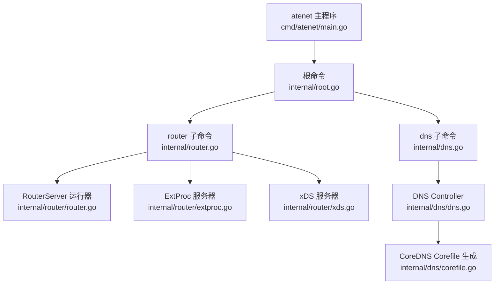
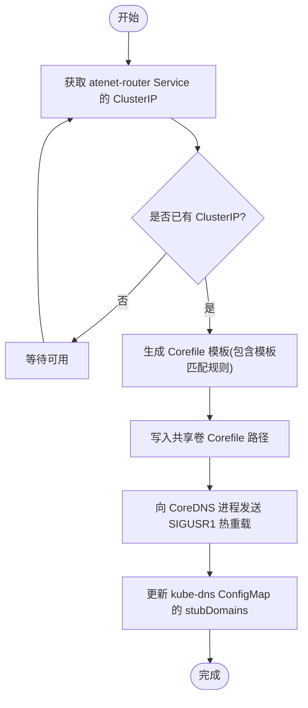
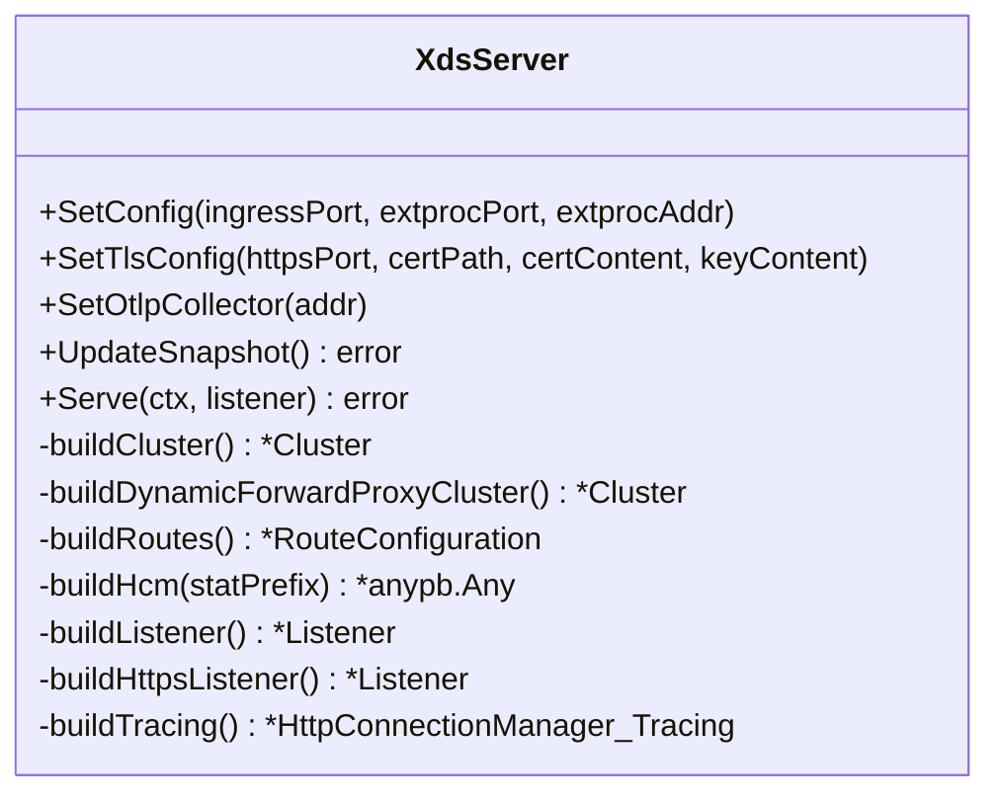
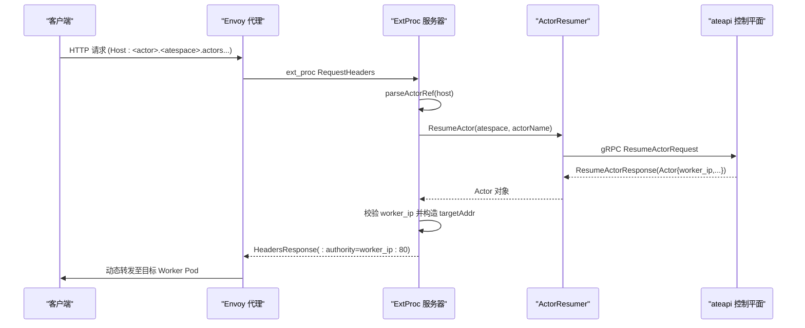
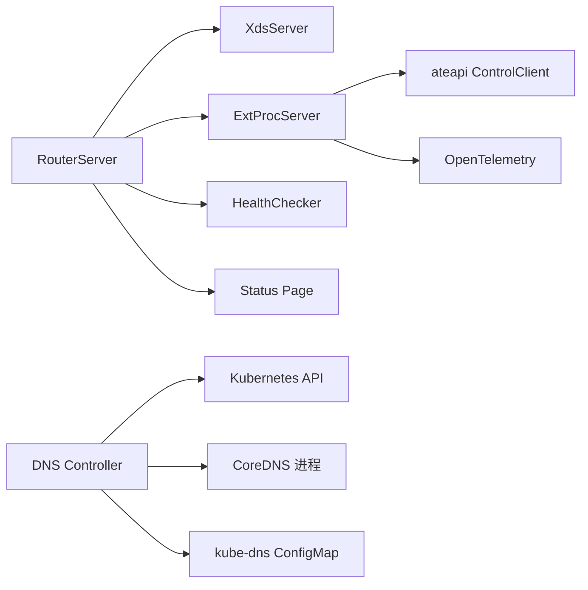

# 数据平面设计

<cite>
**本文引用的文件列表**
- [cmd/atenet/main.go](file://cmd/atenet/main.go)
- [cmd/atenet/internal/root.go](file://cmd/atenet/internal/root.go)
- [cmd/atenet/internal/router.go](file://cmd/atenet/internal/router.go)
- [cmd/atenet/internal/dns.go](file://cmd/atenet/internal/dns.go)
- [cmd/atenet/internal/router/router.go](file://cmd/atenet/internal/router/router.go)
- [cmd/atenet/internal/router/extproc.go](file://cmd/atenet/internal/router/extproc.go)
- [cmd/atenet/internal/router/resumer.go](file://cmd/atenet/internal/router/resumer.go)
- [cmd/atenet/internal/router/xds.go](file://cmd/atenet/internal/router/xds.go)
- [cmd/atenet/internal/dns/corefile.go](file://cmd/atenet/internal/dns/corefile.go)
- [cmd/atenet/internal/dns/dns.go](file://cmd/atenet/internal/dns/dns.go)
- [manifests/ate-install/atenet-router.yaml](file://manifests/ate-install/atenet-router.yaml)
- [docs/architecture.md](file://docs/architecture.md)
</cite>

## 目录
1. [简介](#简介)
2. [项目结构](#项目结构)
3. [核心组件](#核心组件)
4. [架构总览](#架构总览)
5. [详细组件分析](#详细组件分析)
6. [依赖关系分析](#依赖关系分析)
7. [性能与可观测性](#性能与可观测性)
8. [故障排查指南](#故障排查指南)
9. [结论](#结论)

## 简介
本文件聚焦于 Agent Substrate 的数据平面设计，围绕 atenet 网络路由层展开，系统性阐述以下要点：
- Envoy 代理集成与 xDS 动态配置机制
- DNS 解析服务（CoreDNS）与全局子网感知域名空间
- 基于 Host 头解析、Actor 位置查询与动态重定向的自动唤醒流程
- 与外部处理服务器（ExtProc）的通信协议与数据交换格式
- 负载均衡策略、故障转移机制与关键监控指标
- 数据平面拓扑图与端到端请求流程图

## 项目结构
atenet 作为统一网络守护进程，提供两个主要命令：router（xDS + ExtProc）和 dns（CoreDNS 编排）。入口与命令注册如下：
- 程序入口：main.go 调用 internal.Execute()
- 根命令：root.go 注册 router 与 dns 子命令
- router 子命令：router.go 定义 RouterConfig 与启动参数
- dns 子命令：dns.go 定义 DnsConfig 并启动 DNS Controller



图表来源
- [cmd/atenet/main.go:19-21](file://cmd/atenet/main.go#L19-L21)
- [cmd/atenet/internal/root.go:25-42](file://cmd/atenet/internal/root.go#L25-L42)
- [cmd/atenet/internal/router.go:27-67](file://cmd/atenet/internal/router.go#L27-L67)
- [cmd/atenet/internal/dns.go:42-107](file://cmd/atenet/internal/dns.go#L42-L107)
- [cmd/atenet/internal/router/router.go:93-150](file://cmd/atenet/internal/router/router.go#L93-L150)
- [cmd/atenet/internal/router/extproc.go:38-56](file://cmd/atenet/internal/router/extproc.go#L38-L56)
- [cmd/atenet/internal/router/xds.go:71-104](file://cmd/atenet/internal/router/xds.go#L71-L104)
- [cmd/atenet/internal/dns/dns.go:42-69](file://cmd/atenet/internal/dns/dns.go#L42-L69)
- [cmd/atenet/internal/dns/corefile.go:25-64](file://cmd/atenet/internal/dns/corefile.go#L25-L64)

章节来源
- [cmd/atenet/main.go:19-21](file://cmd/atenet/main.go#L19-L21)
- [cmd/atenet/internal/root.go:25-42](file://cmd/atenet/internal/root.go#L25-L42)
- [cmd/atenet/internal/router.go:27-67](file://cmd/atenet/internal/router.go#L27-L67)
- [cmd/atenet/internal/dns.go:42-107](file://cmd/atenet/internal/dns.go#L42-L107)

## 核心组件
- RouterServer：协调 xDS、ExtProc、健康检查、状态页等子系统，负责连接 Control Plane（ateapi），初始化追踪与指标。
- ExtProcServer：实现 Envoy External Processing gRPC 接口，在请求头阶段进行 Actor 定位与动态重定向。
- ActorResumer：对 ResumeActor 调用做去抖与指数退避重试，确保并发安全与幂等恢复。
- XdsServer：构建并推送 Cluster/Route/Listener 快照给 Envoy，支持 HTTP/HTTPS 监听、动态转发、可选 OTLP 追踪。
- DNS Controller：周期性拉取 atenet-router Service IP，生成 CoreDNS Corefile 并写入共享卷，同时更新 kube-dns stubDomains。

章节来源
- [cmd/atenet/internal/router/router.go:93-150](file://cmd/atenet/internal/router/router.go#L93-L150)
- [cmd/atenet/internal/router/extproc.go:38-56](file://cmd/atenet/internal/router/extproc.go#L38-L56)
- [cmd/atenet/internal/router/resumer.go:31-41](file://cmd/atenet/internal/router/resumer.go#L31-L41)
- [cmd/atenet/internal/router/xds.go:71-104](file://cmd/atenet/internal/router/xds.go#L71-L104)
- [cmd/atenet/internal/dns/dns.go:42-69](file://cmd/atenet/internal/dns/dns.go#L42-L69)

## 架构总览
数据平面由 atenet 与 Envoy 共同组成：
- DNS 层：通过全局后缀将 <actor>.<atespace>.actors.resources.substrate.ate.dev 解析到 atenet-router 的 ClusterIP。
- 接入层：Envoy 监听 HTTP/HTTPS，启用 ext_proc 过滤器，按请求头触发外部处理。
- 控制层：ExtProc 调用 ateapi 的 ResumeActor 获取 Actor 所在 Worker Pod IP，重写 :authority 后由动态转发代理直连目标。
- 控制面：xDS 服务器向 Envoy 推送 Listener/Route/Cluster 配置；DNS Controller 维护 CoreDNS 与 kube-dns 配置。

```mermaid
graph TB
subgraph "客户端"
U["应用/测试客户端"]
end
subgraph "DNS 层"
KubeDNS["kube-dns (GKE stub resolver)"]
CoreDNS["CoreDNS (自定义模板)"]
end
subgraph "数据平面"
Envoy["Envoy 代理<br/>HTTP/HTTPS 监听"]
ExtProc["ExtProc 服务器<br/>gRPC 外部处理"]
Router["RouterServer<br/>xDS + 健康检查 + 状态页"]
end
subgraph "控制面"
AteAPI["ateapi 控制平面<br/>ResumeActor 工作流"]
end
U --> |DNS 解析| KubeDNS --> CoreDNS --> |A 记录指向| Envoy
Envoy --> |ext_proc 请求头处理| ExtProc
ExtProc --> |gRPC ResumeActor| AteAPI
AteAPI --> |返回 Actor 信息(含 worker_ip)| ExtProc
ExtProc --> |重写 :authority| Envoy
Envoy --> |动态转发| TargetPod["目标 Actor Worker Pod"]
Router --> |xDS 推送| Envoy
```

图表来源
- [cmd/atenet/internal/dns/dns.go:71-117](file://cmd/atenet/internal/dns/dns.go#L71-117)
- [cmd/atenet/internal/dns/corefile.go:42-64](file://cmd/atenet/internal/dns/corefile.go#L42-L64)
- [cmd/atenet/internal/router/xds.go:148-194](file://cmd/atenet/internal/router/xds.go#L148-194)
- [cmd/atenet/internal/router/extproc.go:80-128](file://cmd/atenet/internal/router/extproc.go#L80-128)
- [cmd/atenet/internal/router/resumer.go:46-104](file://cmd/atenet/internal/router/resumer.go#L46-104)
- [docs/architecture.md:343-351](file://docs/architecture.md#L343-L351)

## 详细组件分析

### DNS 解析与子网感知路由
- 全局 DNS 后缀：actors.resources.substrate.ate.dev
- CoreDNS 模板匹配模式：<actor_name>.<atespace>.actors.resources.substrate.ate.dev
- DNS Controller 周期拉取 atenet-router Service 的 ClusterIP，生成 Corefile 并写入共享卷，随后向 CoreDNS 进程发送信号以热重载。
- 同时更新 kube-system/kube-dns ConfigMap 的 stubDomains，使集群内所有节点将上述后缀解析到自定义 DNS 服务。



图表来源
- [cmd/atenet/internal/dns/dns.go:71-117](file://cmd/atenet/internal/dns/dns.go#L71-117)
- [cmd/atenet/internal/dns/corefile.go:42-64](file://cmd/atenet/internal/dns/corefile.go#L42-L64)
- [cmd/atenet/internal/dns/dns.go:119-141](file://cmd/atenet/internal/dns/dns.go#L119-L141)
- [cmd/atenet/internal/dns/dns.go:143-189](file://cmd/atenet/internal/dns/dns.go#L143-L189)

章节来源
- [cmd/atenet/internal/dns/dns.go:71-117](file://cmd/atenet/internal/dns/dns.go#L71-117)
- [cmd/atenet/internal/dns/corefile.go:42-64](file://cmd/atenet/internal/dns/corefile.go#L42-L64)
- [cmd/atenet/internal/dns/dns.go:119-141](file://cmd/atenet/internal/dns/dns.go#L119-L141)
- [cmd/atenet/internal/dns/dns.go:143-189](file://cmd/atenet/internal/dns/dns.go#L143-L189)

### Envoy 集成与 xDS 动态配置
- xDS 服务器提供聚合发现服务，推送 Cluster、Route、Listener 资源。
- 监听器：HTTP 与可选 HTTPS（支持证书文件或自签证书）。
- 过滤器链：ext_proc -> dynamic_forward_proxy -> router。
- 集群：
  - 本地 ext_proc 集群（静态地址，ROUND_ROBIN）
  - 动态转发代理集群（使用 DNS 缓存）
  - 可选 OTLP Collector 集群（用于 Envoy 侧追踪）
- 路由：将所有前缀 / 的请求转发至动态转发代理集群，超时默认 10s。



图表来源
- [cmd/atenet/internal/router/xds.go:71-104](file://cmd/atenet/internal/router/xds.go#L71-L104)
- [cmd/atenet/internal/router/xds.go:148-194](file://cmd/atenet/internal/router/xds.go#L148-194)
- [cmd/atenet/internal/router/xds.go:227-272](file://cmd/atenet/internal/router/xds.go#L227-L272)
- [cmd/atenet/internal/router/xds.go:336-355](file://cmd/atenet/internal/router/xds.go#L336-L355)
- [cmd/atenet/internal/router/xds.go:357-384](file://cmd/atenet/internal/router/xds.go#L357-L384)
- [cmd/atenet/internal/router/xds.go:386-466](file://cmd/atenet/internal/router/xds.go#L386-L466)
- [cmd/atenet/internal/router/xds.go:503-531](file://cmd/atenet/internal/router/xds.go#L503-L531)
- [cmd/atenet/internal/router/xds.go:533-576](file://cmd/atenet/internal/router/xds.go#L533-L576)
- [cmd/atenet/internal/router/xds.go:478-501](file://cmd/atenet/internal/router/xds.go#L478-L501)

章节来源
- [cmd/atenet/internal/router/xds.go:148-194](file://cmd/atenet/internal/router/xds.go#L148-194)
- [cmd/atenet/internal/router/xds.go:227-272](file://cmd/atenet/internal/router/xds.go#L227-L272)
- [cmd/atenet/internal/router/xds.go:336-355](file://cmd/atenet/internal/router/xds.go#L336-L355)
- [cmd/atenet/internal/router/xds.go:357-384](file://cmd/atenet/internal/router/xds.go#L357-L384)
- [cmd/atenet/internal/router/xds.go:386-466](file://cmd/atenet/internal/router/xds.go#L386-L466)
- [cmd/atenet/internal/router/xds.go:503-531](file://cmd/atenet/internal/router/xds.go#L503-L531)
- [cmd/atenet/internal/router/xds.go:533-576](file://cmd/atenet/internal/router/xds.go#L533-L576)
- [cmd/atenet/internal/router/xds.go:478-501](file://cmd/atenet/internal/router/xds.go#L478-L501)

### ExtProc 外部处理与自动唤醒
- 处理流程：
  - 从请求头提取 Host/:authority，解析出 atespace 与 actorName
  - 调用 ResumeActor 工作流，确保 Actor 处于运行态并获得 worker_ip
  - 若解析失败或无有效 IP，返回错误响应码
  - 成功时重写 :authority 为 worker_ip:80，交由动态转发代理直连
- 追踪与度量：
  - 从 HTTP 头传播 traceparent，建立 ExtProc span
  - 记录 route-duration 直方图，按模板命名空间/名称与结果分类统计



图表来源
- [cmd/atenet/internal/router/extproc.go:80-128](file://cmd/atenet/internal/router/extproc.go#L80-128)
- [cmd/atenet/internal/router/extproc.go:130-188](file://cmd/atenet/internal/router/extproc.go#L130-L188)
- [cmd/atenet/internal/router/resumer.go:46-104](file://cmd/atenet/internal/router/resumer.go#L46-L104)
- [cmd/atenet/internal/router/extproc_in.go:52-72](file://cmd/atenet/internal/router/extproc_in.go#L52-L72)

章节来源
- [cmd/atenet/internal/router/extproc.go:80-128](file://cmd/atenet/internal/router/extproc.go#L80-128)
- [cmd/atenet/internal/router/extproc.go:130-188](file://cmd/atenet/internal/router/extproc.go#L130-L188)
- [cmd/atenet/internal/router/resumer.go:46-104](file://cmd/atenet/internal/router/resumer.go#L46-L104)
- [cmd/atenet/internal/router/extproc_in.go:52-72](file://cmd/atenet/internal/router/extproc_in.go#L52-L72)

### 子网感知路由与自动唤醒
- 子网感知：通过全局 DNS 后缀将任意 <actor>.<atespace> 解析到统一的 atenet-router 入口，屏蔽底层物理位置差异。
- 自动唤醒：首次访问时 ExtProc 触发 ResumeActor，控制面分配 Worker 并恢复沙箱，返回 worker_ip；后续请求直接转发至该 Worker。
- 动态重定向：仅修改 :authority，不改变路径与方法，保持语义一致性。

章节来源
- [docs/architecture.md:343-351](file://docs/architecture.md#L343-L351)
- [cmd/atenet/internal/dns/dns.go:71-117](file://cmd/atenet/internal/dns/dns.go#L71-117)
- [cmd/atenet/internal/router/extproc.go:130-188](file://cmd/atenet/internal/router/extproc.go#L130-L188)

### 与外部处理服务器的通信协议与数据交换格式
- 协议：Envoy 与 atenet 之间采用 gRPC 的 ExternalProcessor.Process 双向流。
- 消息类型：ProcessingRequest/ProcessingResponse，当前仅处理 RequestHeaders 阶段。
- 头部变更：通过 HeaderMutation 设置 :authority 为目标 worker_ip:80。
- 追踪上下文：从 HTTP 头提取 traceparent，注入 ExtProc span，保证链路贯通。

章节来源
- [cmd/atenet/internal/router/extproc.go:38-56](file://cmd/atenet/internal/router/extproc.go#L38-L56)
- [cmd/atenet/internal/router/extproc.go:80-128](file://cmd/atenet/internal/router/extproc.go#L80-128)
- [cmd/atenet/internal/router/extproc.go:130-188](file://cmd/atenet/internal/router/extproc.go#L130-L188)

### 负载均衡策略与故障转移
- 负载均衡：
  - ext_proc 集群：STATIC 类型，单后端（本地 ExtProc），ROUND_ROBIN。
  - OTLP 集群：STRICT_DNS，ROUND_ROBIN（当启用追踪时）。
- 故障转移：
  - 未配置多副本 ext_proc 后端，当前为单点；可通过扩展多个 ext_proc 实例并调整 xDS 快照实现高可用。
  - 动态转发代理集群使用 DNS 缓存，避免频繁解析开销。
- 超时与重试：
  - ext_proc 消息超时设置为 5s。
  - ResumeActor 调用使用指数退避与最大步数限制，Aborted 错误会重试。

章节来源
- [cmd/atenet/internal/router/xds.go:227-272](file://cmd/atenet/internal/router/xds.go#L227-L272)
- [cmd/atenet/internal/router/xds.go:286-334](file://cmd/atenet/internal/router/xds.go#L286-L334)
- [cmd/atenet/internal/router/xds.go:386-419](file://cmd/atenet/internal/router/xds.go#L386-L419)
- [cmd/atenet/internal/router/resumer.go:61-86](file://cmd/atenet/internal/router/resumer.go#L61-L86)

### 部署与服务暴露
- atenet-router 容器包含：
  - http/https/admin 端口映射
  - envoy 子进程挂载 ConfigMap 配置
  - 可选 OTLP 追踪
- Service 暴露 ClusterIP，将 80/443 映射到 Envoy 的 8080/8443。

章节来源
- [manifests/ate-install/atenet-router.yaml:160-215](file://manifests/ate-install/atenet-router.yaml#L160-L215)

## 依赖关系分析
- RouterServer 依赖：
  - Kubernetes 客户端（非 standalone 模式）
  - ateapi gRPC 客户端（mtls/jwt 认证）
  - xDS 服务器、ExtProc 服务器、健康检查、状态页
- ExtProc 依赖：
  - ateapi ResumeActor 接口
  - OpenTelemetry 追踪与指标
- DNS Controller 依赖：
  - Kubernetes Service 读取
  - CoreDNS 进程信号热重载
  - kube-dns ConfigMap 更新



图表来源
- [cmd/atenet/internal/router/router.go:152-315](file://cmd/atenet/internal/router/router.go#L152-L315)
- [cmd/atenet/internal/router/extproc.go:38-56](file://cmd/atenet/internal/router/extproc.go#L38-L56)
- [cmd/atenet/internal/dns/dns.go:42-69](file://cmd/atenet/internal/dns/dns.go#L42-L69)

章节来源
- [cmd/atenet/internal/router/router.go:152-315](file://cmd/atenet/internal/router/router.go#L152-L315)
- [cmd/atenet/internal/router/extproc.go:38-56](file://cmd/atenet/internal/router/extproc.go#L38-L56)
- [cmd/atenet/internal/dns/dns.go:42-69](file://cmd/atenet/internal/dns/dns.go#L42-L69)

## 性能与可观测性
- 追踪：
  - Envoy 侧可选 OTLP 追踪（随机采样 100%，上游客户端决定是否真正采样）
  - ExtProc 内部创建 span，并从 HTTP 头传播 traceparent
- 指标：
  - Prometheus 指标服务器（默认 :9090）
  - route-duration 直方图，按模板命名空间/名称与结果分类
- 健康检查：
  - 定期检查依赖服务可用性
  - 状态页 /statusz（可禁用）

章节来源
- [cmd/atenet/internal/router/router.go:176-194](file://cmd/atenet/internal/router/router.go#L176-L194)
- [cmd/atenet/internal/router/router.go:290-312](file://cmd/atenet/internal/router/router.go#L290-L312)
- [cmd/atenet/internal/router/extproc.go:190-199](file://cmd/atenet/internal/router/extproc.go#L190-L199)
- [cmd/atenet/internal/router/xds.go:478-501](file://cmd/atenet/internal/router/xds.go#L478-L501)

## 故障排查指南
- DNS 解析问题：
  - 确认 atenet-router Service 已具备 ClusterIP
  - 检查 Corefile 是否已更新并热重载
  - 验证 kube-dns ConfigMap 的 stubDomains 是否包含自定义 DNS IP
- ExtProc 处理异常：
  - 检查 Host 头是否符合 <actor>.<atespace>.actors.resources.substrate.ate.dev 格式
  - 查看 ResumeActor 返回的错误码与日志
  - 确认 ext_proc 消息超时与 gRPC 通道状态
- 路由失败：
  - 确认 Actor 的 worker_ip 是否为合法 IP
  - 检查动态转发代理集群与 DNS 缓存是否正常
- 追踪与指标：
  - 确认 OTLP Collector 可达且端口正确
  - 检查 Prometheus 抓取端点与指标标签

章节来源
- [cmd/atenet/internal/dns/dns.go:71-117](file://cmd/atenet/internal/dns/dns.go#L71-117)
- [cmd/atenet/internal/dns/dns.go:119-141](file://cmd/atenet/internal/dns/dns.go#L119-L141)
- [cmd/atenet/internal/dns/dns.go:143-189](file://cmd/atenet/internal/dns/dns.go#L143-L189)
- [cmd/atenet/internal/router/extproc.go:130-188](file://cmd/atenet/internal/router/extproc.go#L130-L188)
- [cmd/atenet/internal/router/xds.go:386-419](file://cmd/atenet/internal/router/xds.go#L386-L419)

## 结论
atenet 数据平面通过“DNS 全局后缀 + Envoy ext_proc + 动态转发”的组合，实现了面向 Actor 的透明寻址与自动唤醒。其优势包括：
- 低延迟激活：绕过 K8s 最终一致性，原子化物理分配
- 子网感知：统一入口，屏蔽底层位置变化
- 可扩展：xDS 动态配置与 ExtProc 解耦，便于横向扩展与高可用改造
- 可观测：全链路追踪与丰富指标，支撑运维与优化
