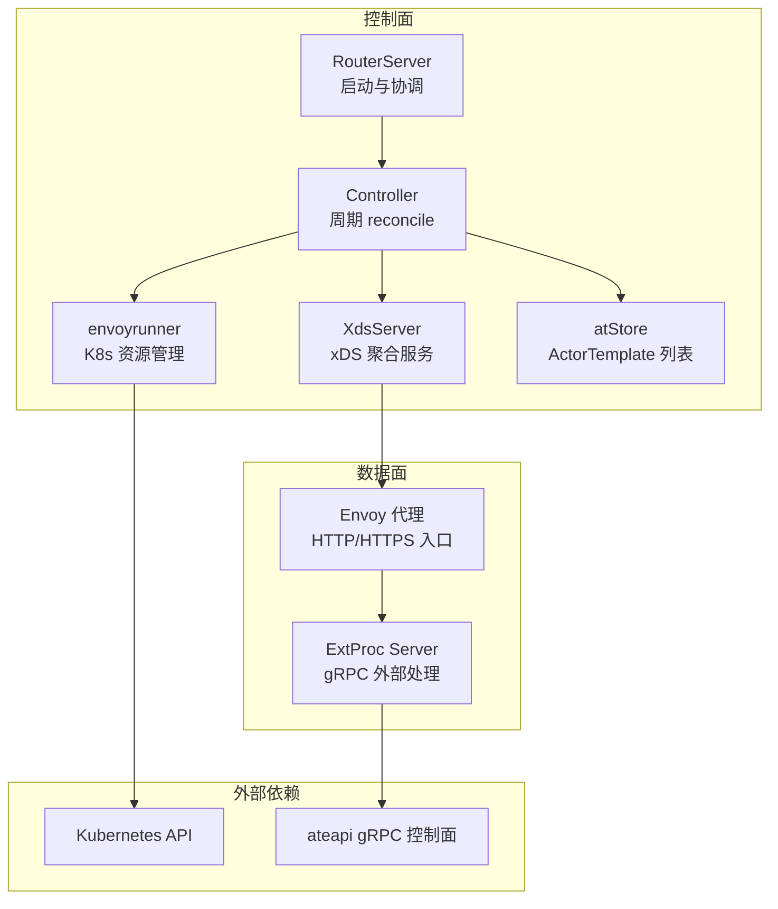
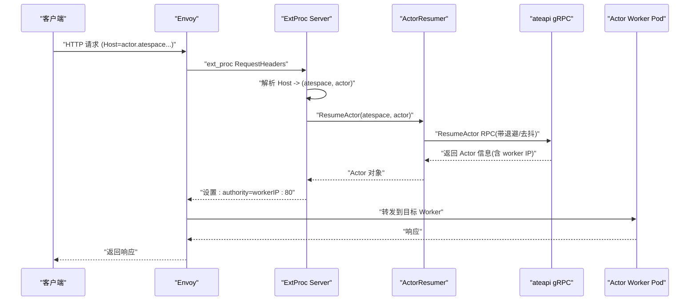
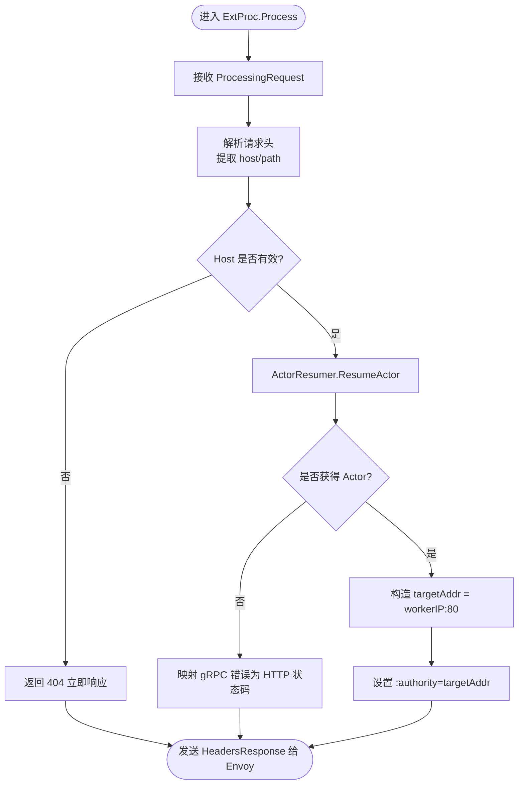
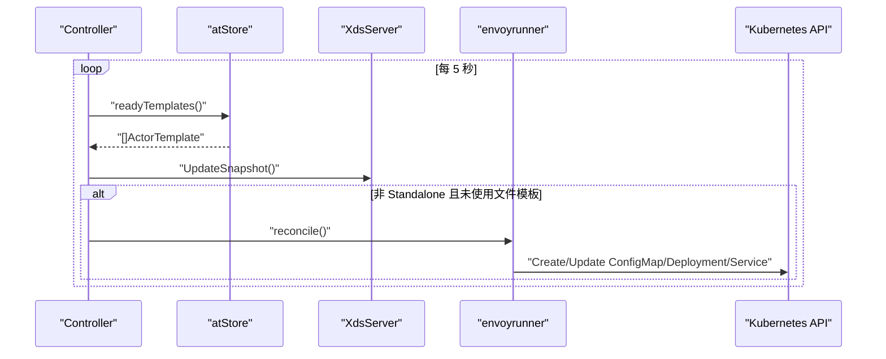
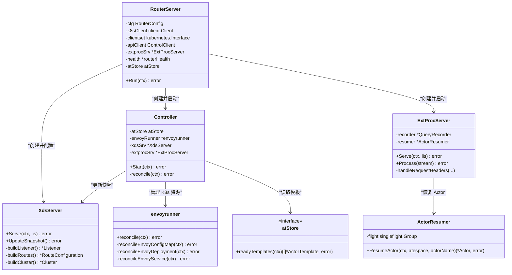
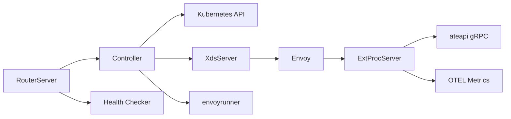

# 网络路由系统

<cite>
**本文引用的文件**   
- [main.go](file://cmd/atenet/main.go)
- [router.go](file://cmd/atenet/internal/router/router.go)
- [controller.go](file://cmd/atenet/internal/router/controller.go)
- [xds.go](file://cmd/atenet/internal/router/xds.go)
- [extproc.go](file://cmd/atenet/internal/router/extproc.go)
- [extproc_in.go](file://cmd/atenet/internal/router/extproc_in.go)
- [extproc_out.go](file://cmd/atenet/internal/router/extproc_out.go)
- [atstore.go](file://cmd/atenet/internal/router/atstore.go)
- [envoyrunner.go](file://cmd/atenet/internal/router/envoyrunner.go)
- [resumer.go](file://cmd/atenet/internal/router/resumer.go)
- [status.go](file://cmd/atenet/internal/router/status.go)
- [health.go](file://cmd/atenet/internal/router/health.go)
- [metrics.go](file://cmd/atenet/internal/router/metrics.go)
</cite>

## 目录
1. [简介](#简介)
2. [项目结构](#项目结构)
3. [核心组件](#核心组件)
4. [架构总览](#架构总览)
5. [详细组件分析](#详细组件分析)
6. [依赖关系分析](#依赖关系分析)
7. [性能与优化](#性能与优化)
8. [故障排查指南](#故障排查指南)
9. [结论](#结论)
10. [附录：配置示例](#附录配置示例)

## 简介
本文件面向 Agent Substrate 的“atenet”子网感知路由系统，系统性阐述其数据平面与控制平面的协作方式、请求处理流程、负载均衡策略、故障转移机制、动态路由配置管理以及与 Kubernetes API 的集成。重点包括：
- atenet 核心路由器（Envoy + xDS + ExtProc）的设计与实现
- 基于 Host 头解析的子网感知路由与动态重定向
- 通过 Actor 状态驱动的动态路由规则更新
- 与 Kubernetes API 的集成以管理 Envoy 生命周期与资源
- 可观测性、连接复用、错误处理与性能优化策略

## 项目结构
atenet 作为独立二进制启动，内部包含以下关键模块：
- 控制面：RouterServer、Controller、XdsServer、envoyrunner
- 数据面：Envoy（由控制器在 K8s 中部署）、ExtProc（外部处理器）
- 存储与发现：atStore（ActorTemplate 列表），Kubernetes Client
- 健康检查与状态：health、status
- 指标与追踪：metrics、OpenTelemetry 集成

图表来源
- [router.go:152-315](file://cmd/atenet/internal/router/router.go#L152-L315)
- [controller.go:67-111](file://cmd/atenet/internal/router/controller.go#L67-L111)
- [xds.go:148-225](file://cmd/atenet/internal/router/xds.go#L148-L225)
- [envoyrunner.go:50-64](file://cmd/atenet/internal/router/envoyrunner.go#L50-L64)
- [extproc.go:58-78](file://cmd/atenet/internal/router/extproc.go#L58-L78)

章节来源
- [main.go:19-21](file://cmd/atenet/main.go#L19-L21)
- [router.go:152-315](file://cmd/atenet/internal/router/router.go#L152-L315)
- [controller.go:67-111](file://cmd/atenet/internal/router/controller.go#L67-L111)

## 核心组件
- RouterServer：负责初始化追踪、指标、认证、gRPC 客户端，并启动 Controller、xDS、ExtProc、状态 HTTP 等协程。
- Controller：周期性拉取 ActorTemplate 列表，生成并下发 xDS Snapshot；在非 Standalone 模式下管理 Envoy 的 Deployment/Service/ConfigMap。
- XdsServer：实现 Envoy 聚合发现服务（ADS/LDS/CDS/RDS/EDS），构建 Listener/Route/Cluster/HCM 等配置，支持 TLS 与 OTLP 追踪。
- ExtProcServer：响应 Envoy 的 ext_proc 请求，解析 Host 头、恢复 Actor、重写 :authority 进行动态转发。
- envoyrunner：在 K8s 中创建/更新 Envoy 的 ConfigMap、Deployment、Service，使其连接到本地 xDS。
- atStore：抽象 ActorTemplate 获取接口，默认实现从 K8s 读取已就绪模板。
- ActorResumer：对 ResumeActor 调用做去抖与指数退避重试，屏蔽并发冲突。
- health/status/metrics：提供健康检查、状态页与指标采集。

章节来源
- [router.go:94-150](file://cmd/atenet/internal/router/router.go#L94-L150)
- [controller.go:26-65](file://cmd/atenet/internal/router/controller.go#L26-L65)
- [xds.go:72-104](file://cmd/atenet/internal/router/xds.go#L72-L104)
- [extproc.go:38-56](file://cmd/atenet/internal/router/extproc.go#L38-L56)
- [envoyrunner.go:36-48](file://cmd/atenet/internal/router/envoyrunner.go#L36-L48)
- [atstore.go:25-56](file://cmd/atenet/internal/router/atstore.go#L25-L56)
- [resumer.go:31-41](file://cmd/atenet/internal/router/resumer.go#L31-L41)
- [status.go:180-281](file://cmd/atenet/internal/router/status.go#L180-L281)
- [health.go:47-72](file://cmd/atenet/internal/router/health.go#L47-L72)
- [metrics.go:24-52](file://cmd/atenet/internal/router/metrics.go#L24-L52)

## 架构总览
atenet 采用“控制面 + 数据面”解耦设计：
- 控制面（atenet-router）运行 xDS 与 ExtProc，并通过 Controller 将 ActorTemplate 与运行时状态转化为 Envoy 配置。
- 数据面（Envoy）作为 L7 网关，接收 HTTP/HTTPS 流量，经 ext_proc 钩子完成动态路由决策，再转发到目标 Actor Worker。
- 与 K8s API 集成用于管理 Envoy 实例与 Service 暴露；与 ateapi gRPC 集成用于 Actor 恢复与查询。

图表来源
- [extproc.go:80-128](file://cmd/atenet/internal/router/extproc.go#L80-L128)
- [extproc_in.go:59-72](file://cmd/atenet/internal/router/extproc_in.go#L59-L72)
- [extproc_out.go:35-44](file://cmd/atenet/internal/router/extproc_out.go#L35-L44)
- [resumer.go:46-104](file://cmd/atenet/internal/router/resumer.go#L46-L104)

## 详细组件分析

### 请求处理流程（ExtProc 驱动的动态路由）
- 入口：Envoy 在 HCM 中挂载 ext_proc 过滤器，仅处理请求头阶段。
- 解析：从请求头提取 :authority/host 与路径，解析出 (atespace, actor)。
- 恢复：调用 ActorResumer.ResumeActor，内部使用 singleflight 去抖与指数退避重试，屏蔽 Aborted 并发冲突。
- 重定向：根据 Actor 的 worker IP 构造 targetAddr，重写 :authority 为 workerIP:80，交由 dynamic_forward_proxy 集群动态解析并转发。
- 指标：记录路由耗时直方图，按模板命名空间/名称与结果分类。

图表来源
- [extproc.go:80-128](file://cmd/atenet/internal/router/extproc.go#L80-L128)
- [extproc_in.go:31-57](file://cmd/atenet/internal/router/extproc_in.go#L31-L57)
- [extproc_in.go:59-72](file://cmd/atenet/internal/router/extproc_in.go#L59-L72)
- [extproc_out.go:35-44](file://cmd/atenet/internal/router/extproc_out.go#L35-L44)
- [errors.go:56-92](file://cmd/atenet/internal/router/errors.go#L56-L92)
- [resumer.go:46-104](file://cmd/atenet/internal/router/resumer.go#L46-L104)

章节来源
- [extproc.go:80-128](file://cmd/atenet/internal/router/extproc.go#L80-L128)
- [extproc_in.go:31-72](file://cmd/atenet/internal/router/extproc_in.go#L31-L72)
- [extproc_out.go:35-68](file://cmd/atenet/internal/router/extproc_out.go#L35-L68)
- [errors.go:25-92](file://cmd/atenet/internal/router/errors.go#L25-L92)
- [resumer.go:46-104](file://cmd/atenet/internal/router/resumer.go#L46-L104)

### 负载均衡策略与故障转移
- 负载均衡：
  - Envoy 侧集群默认使用 ROUND_ROBIN。
  - 由于每个请求的目标 Worker 由 ExtProc 动态决定，实际负载由 Actor 调度器与 Worker 分布决定。
- 故障转移：
  - ExtProc 层遇到不可用/超时/权限等问题时，将 gRPC 状态码映射为合适的 HTTP 状态码（如 404/503/504/403/401/429/500）。
  - ActorResumer 对并发冲突（Aborted）进行重试，其他错误直接透传，保证边界语义清晰。

章节来源
- [xds.go:227-272](file://cmd/atenet/internal/router/xds.go#L227-L272)
- [errors.go:56-92](file://cmd/atenet/internal/router/errors.go#L56-L92)
- [resumer.go:61-93](file://cmd/atenet/internal/router/resumer.go#L61-L93)

### 动态路由配置管理（Actor 状态与拓扑）
- 控制循环：Controller 每 5 秒执行一次 reconcile，拉取所有处于 Ready 的 ActorTemplate，生成 xDS Snapshot 并下发。
- 非 Standalone 模式：同时 reconcile Envoy 的 ConfigMap/Deployment/Service，确保 Envoy 始终指向当前 xDS 端口。
- 模板存储：atStore 抽象了 ActorTemplate 的来源，默认从 K8s 读取，也支持文件模式（TemplatesFile）。

图表来源
- [controller.go:67-111](file://cmd/atenet/internal/router/controller.go#L67-L111)
- [atstore.go:41-55](file://cmd/atenet/internal/router/atstore.go#L41-L55)
- [envoyrunner.go:50-64](file://cmd/atenet/internal/router/envoyrunner.go#L50-L64)

章节来源
- [controller.go:67-111](file://cmd/atenet/internal/router/controller.go#L67-L111)
- [atstore.go:25-56](file://cmd/atenet/internal/router/atstore.go#L25-L56)
- [envoyrunner.go:50-64](file://cmd/atenet/internal/router/envoyrunner.go#L50-L64)

### 子网感知路由（Host 解析、Actor 位置查询、动态重定向）
- Host 解析：从 :authority/host 中提取 actor 与 atespace，支持可选端口剥离。
- Actor 位置查询：通过 ResumeActor 获取 Actor 的 worker IP。
- 动态重定向：将 :authority 改写为 workerIP:80，配合 dynamic_forward_proxy 集群进行 DNS 解析与连接建立。

章节来源
- [extproc_in.go:59-72](file://cmd/atenet/internal/router/extproc_in.go#L59-L72)
- [extproc.go:130-188](file://cmd/atenet/internal/router/extproc.go#L130-L188)
- [extproc_out.go:35-44](file://cmd/atenet/internal/router/extproc_out.go#L35-L44)
- [xds.go:336-355](file://cmd/atenet/internal/router/xds.go#L336-L355)

### 与 Kubernetes API 的集成（监听 Pod 变化并更新路由表）
- 当前实现：
  - Controller 定期拉取 ActorTemplate 列表，不直接使用 Informer 监听事件。
  - envoyrunner 维护 Envoy 的 ConfigMap/Deployment/Service，确保 Envoy 能连上 xDS。
- 扩展建议：
  - 引入 controller-runtime Informer 监听 ActorTemplate/WorkerPod 变更，触发增量 reconcile，降低轮询开销。
  - 结合 Pod 状态（Ready/NotReady）调整路由权重或剔除不可用端点。

章节来源
- [controller.go:67-111](file://cmd/atenet/internal/router/controller.go#L67-L111)
- [envoyrunner.go:139-258](file://cmd/atenet/internal/router/envoyrunner.go#L139-L258)

### xDS 配置与监听器/路由/集群构建
- Listener：HTTP/HTTPS 两个监听器，分别绑定 ingressPort 与 httpsPort（可选）。
- Route：将所有请求匹配到 dynamic_forward_proxy_cluster。
- Cluster：
  - ate-cluster：指向 ExtProc（用于 ext_proc 通信）。
  - dynamic_forward_proxy_cluster：启用 DNS 缓存与动态上游。
  - otel_collector_cluster：可选，用于 Envoy 侧 OpenTelemetry 上报。
- HCM：挂载 ext_proc、dynamic_forward_proxy、router 三个过滤器，开启访问日志与可选追踪。

章节来源
- [xds.go:148-225](file://cmd/atenet/internal/router/xds.go#L148-L225)
- [xds.go:227-355](file://cmd/atenet/internal/router/xds.go#L227-L355)
- [xds.go:386-466](file://cmd/atenet/internal/router/xds.go#L386-L466)
- [xds.go:503-576](file://cmd/atenet/internal/router/xds.go#L503-L576)

### 类关系图（代码级）

图表来源
- [router.go:94-150](file://cmd/atenet/internal/router/router.go#L94-L150)
- [controller.go:26-65](file://cmd/atenet/internal/router/controller.go#L26-L65)
- [xds.go:72-104](file://cmd/atenet/internal/router/xds.go#L72-L104)
- [extproc.go:38-56](file://cmd/atenet/internal/router/extproc.go#L38-L56)
- [resumer.go:31-41](file://cmd/atenet/internal/router/resumer.go#L31-L41)
- [envoyrunner.go:36-48](file://cmd/atenet/internal/router/envoyrunner.go#L36-L48)
- [atstore.go:25-39](file://cmd/atenet/internal/router/atstore.go#L25-L39)

## 依赖关系分析
- 控制面依赖：
  - Kubernetes API：用于读取 ActorTemplate、管理 Envoy 资源。
  - ateapi gRPC：用于 Actor 恢复与查询。
- 数据面依赖：
  - Envoy：作为 L7 网关，通过 xDS 动态获取配置。
  - ExtProc：gRPC 服务，承载路由决策逻辑。
- 可观测性：
  - OpenTelemetry：Tracing（Envoy 与 Go 服务）、Metrics（Prometheus 兼容）。

图表来源
- [router.go:152-315](file://cmd/atenet/internal/router/router.go#L152-L315)
- [controller.go:67-111](file://cmd/atenet/internal/router/controller.go#L67-L111)
- [xds.go:196-225](file://cmd/atenet/internal/router/xds.go#L196-L225)
- [extproc.go:58-78](file://cmd/atenet/internal/router/extproc.go#L58-L78)
- [health.go:74-89](file://cmd/atenet/internal/router/health.go#L74-L89)

章节来源
- [router.go:152-315](file://cmd/atenet/internal/router/router.go#L152-L315)
- [controller.go:67-111](file://cmd/atenet/internal/router/controller.go#L67-L111)
- [xds.go:196-225](file://cmd/atenet/internal/router/xds.go#L196-L225)
- [extproc.go:58-78](file://cmd/atenet/internal/router/extproc.go#L58-L78)
- [health.go:74-89](file://cmd/atenet/internal/router/health.go#L74-L89)

## 性能与优化
- 连接复用与协议：
  - Envoy 与 ExtProc 之间使用 HTTP/2，减少握手开销。
  - dynamic_forward_proxy 集群启用 DNS 缓存，避免频繁解析。
- 路由延迟指标：
  - 提供 atenet.router.route.duration 直方图，覆盖毫秒到数十秒区间，便于定位瓶颈。
- 并发与去抖：
  - ActorResumer 使用 singleflight 合并相同 Actor 的并发恢复请求，避免重复唤醒。
  - 指数退避与抖动抑制瞬时风暴。
- 追踪采样：
  - 应用层 TracerProvider 使用 ParentBased(NeverSample)，避免无父链请求被过度采样；Envoy 侧可按需开启。
- 健康检查：
  - 定时检查 Envoy /ready、K8s API 版本、ateapi ListActors，快速发现下游异常。

章节来源
- [xds.go:227-272](file://cmd/atenet/internal/router/xds.go#L227-L272)
- [xds.go:274-284](file://cmd/atenet/internal/router/xds.go#L274-L284)
- [metrics.go:32-52](file://cmd/atenet/internal/router/metrics.go#L32-L52)
- [resumer.go:54-93](file://cmd/atenet/internal/router/resumer.go#L54-L93)
- [health.go:91-147](file://cmd/atenet/internal/router/health.go#L91-L147)

## 故障排查指南
- 常见问题定位：
  - Host 无效：返回 404，检查域名格式是否为 actor.atespace.actors.resources.substrate.ate.dev。
  - Actor 不存在：映射为 404。
  - Actor 不可用/资源不足：映射为 503。
  - 超时：映射为 504。
  - 鉴权失败：映射为 401/403。
  - 限流：映射为 429。
- 诊断工具：
  - 状态页 /statusz：查看最近请求记录、健康报告、模板列表、端口与参数。
  - 健康检查：Envoy /ready、K8s API 版本、ateapi 连通性。
  - 指标：atnet.router.route.duration 直方图，结合 outcome 维度分析错误分布。
- 日志与追踪：
  - ExtProc 与 Envoy 均输出结构化日志；OpenTelemetry 链路可用于端到端追踪。

章节来源
- [errors.go:25-92](file://cmd/atenet/internal/router/errors.go#L25-L92)
- [status.go:180-281](file://cmd/atenet/internal/router/status.go#L180-L281)
- [health.go:91-147](file://cmd/atenet/internal/router/health.go#L91-L147)
- [metrics.go:32-52](file://cmd/atenet/internal/router/metrics.go#L32-L52)

## 结论
atenet 路由系统通过 xDS 与 ExtProc 的组合实现了高度动态、子网感知的 L7 路由能力。控制面以 Controller 为中心，周期性地从 ActorTemplate 源推导配置并下发至 Envoy；数据面在请求到达时通过 ext_proc 完成 Actor 恢复与地址重写，实现按需激活与就近转发。系统在可观测性、错误映射与并发保护方面具备良好工程实践，适合大规模多租户场景下的弹性与隔离需求。

## 附录：配置示例
以下为常见运行参数的说明（字段名与行为来自源码定义）：
- 通用
  - standalone：是否以独立模式运行（不管理 K8s 资源）
  - namespace：工作命名空间
  - kubeconfig：K8s 配置文件路径
- 端口与服务
  - http_port：Envoy 入口 HTTP 端口
  - https_port：Envoy 入口 HTTPS 端口（可选）
  - xds_port：xDS 服务端口
  - extproc_port：ExtProc gRPC 端口
  - extproc_addr：ExtProc 监听地址
  - status_port：状态页 HTTP 端口（可选）
- 证书与追踪
  - envoy_cert_path：Envoy TLS 证书路径（为空则生成自签证书）
  - otlp_collector_address：Envoy 侧 OTLP 收集器地址（host:port）
- 模板源
  - templates_file：使用文件模式加载 ActorTemplate（若为空则使用 K8s）
- 指标与日志
  - metrics_addr：Prometheus 指标导出地址
  - log_level：日志级别（info/debug/warn/error）
- 认证
  - ateapi_auth_mode：ateapi 认证模式
  - ateapi_ca_file：CA 文件路径
  - ateapi_server_name：服务端名称校验
  - ateapi_token_file：令牌文件路径

章节来源
- [router.go:66-91](file://cmd/atenet/internal/router/router.go#L66-L91)
- [router.go:152-315](file://cmd/atenet/internal/router/router.go#L152-L315)
- [xds.go:114-146](file://cmd/atenet/internal/router/xds.go#L114-L146)
- [envoyrunner.go:66-137](file://cmd/atenet/internal/router/envoyrunner.go#L66-L137)
