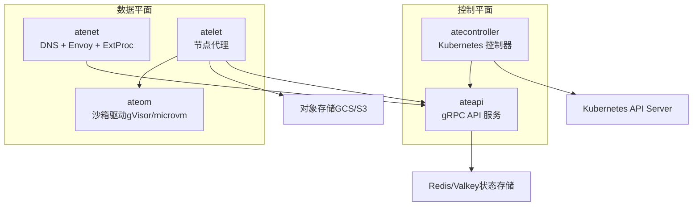
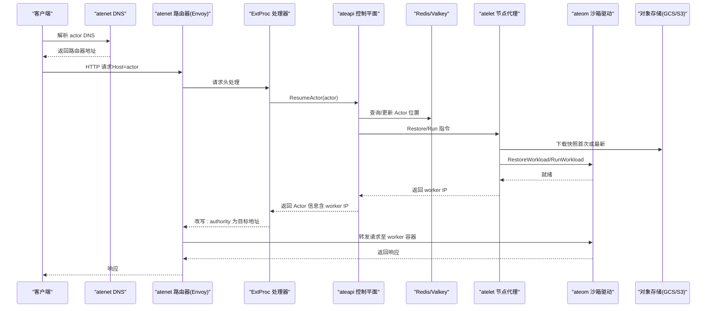
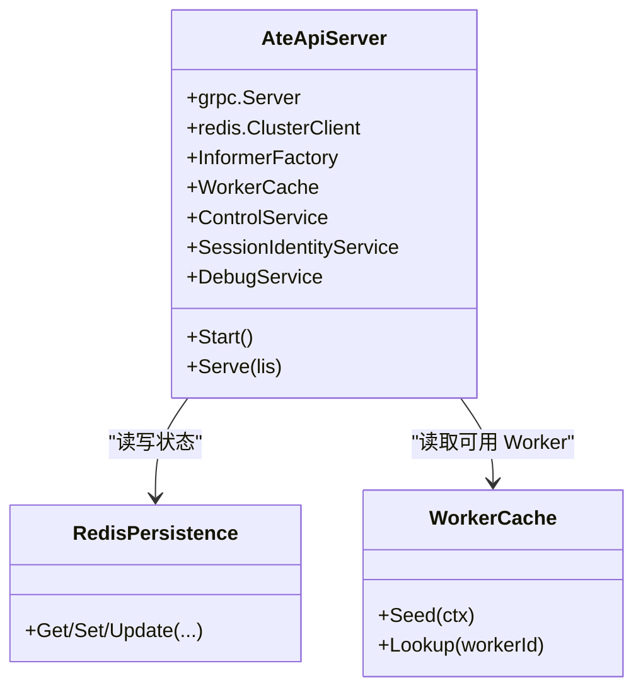
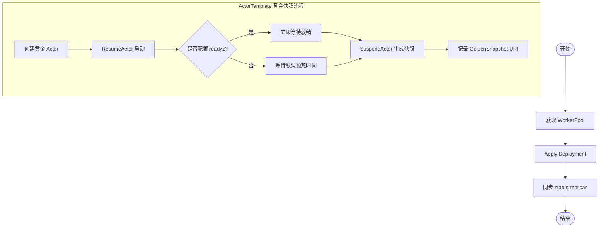
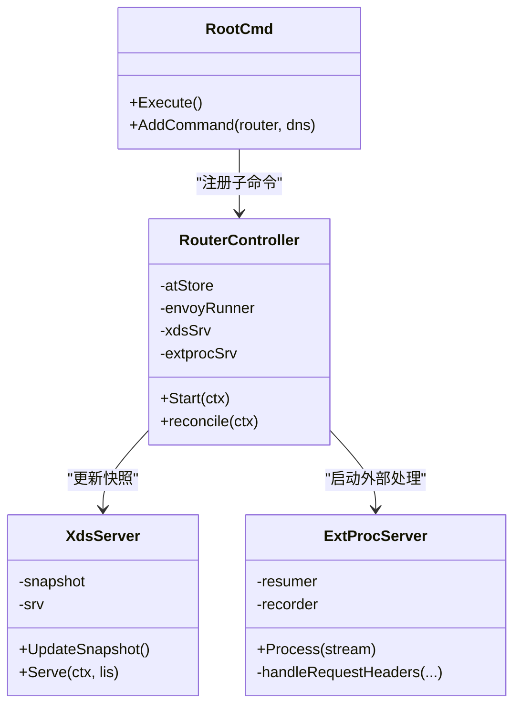
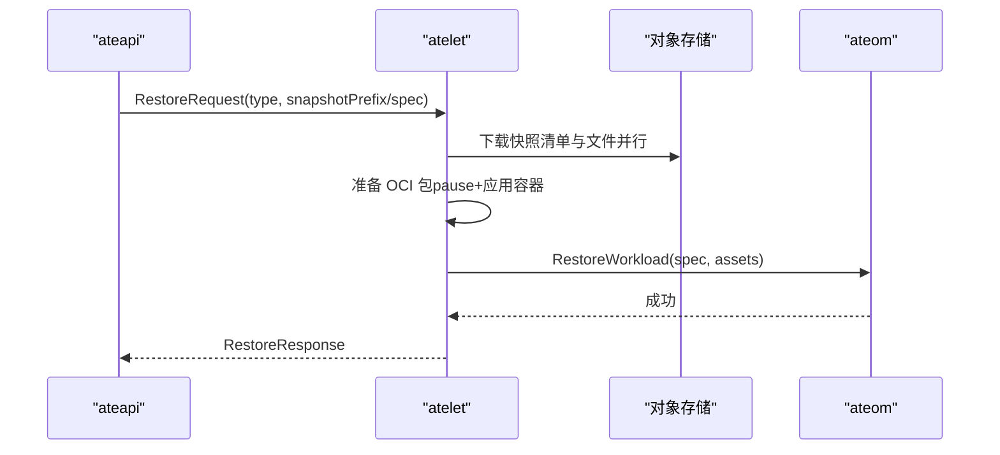
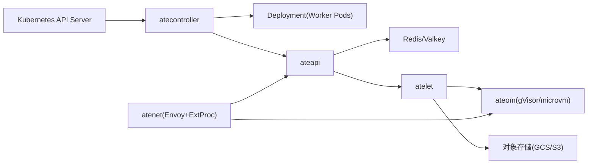

# 系统架构

<cite>
**本文引用的文件**   
- [README.md](file://README.md)
- [architecture.md](file://docs/architecture.md)
- [api-guide.md](file://docs/api-guide.md)
- [main.go](file://cmd/ateapi/main.go)
- [main.go](file://cmd/atecontroller/main.go)
- [workerpool_controller.go](file://cmd/atecontroller/internal/controllers/workerpool_controller.go)
- [actortemplate_controller.go](file://cmd/atecontroller/internal/controllers/actortemplate_controller.go)
- [main.go](file://cmd/atenet/main.go)
- [root.go](file://cmd/atenet/internal/root.go)
- [controller.go](file://cmd/atenet/internal/router/controller.go)
- [xds.go](file://cmd/atenet/internal/router/xds.go)
- [extproc.go](file://cmd/atenet/internal/router/extproc.go)
- [main.go](file://cmd/atelet/main.go)
- [workerpool_types.go](file://pkg/api/v1alpha1/workerpool_types.go)
- [actortemplate_types.go](file://pkg/api/v1alpha1/actortemplate_types.go)
</cite>

## 目录
1. [简介](#简介)
2. [项目结构](#项目结构)
3. [核心组件](#核心组件)
4. [架构总览](#架构总览)
5. [详细组件分析](#详细组件分析)
6. [依赖关系分析](#依赖关系分析)
7. [性能与扩展性](#性能与扩展性)
8. [故障排查指南](#故障排查指南)
9. [结论](#结论)
10. [附录](#附录)

## 简介
Agent Substrate 是基于 Kubernetes 的“代理型”工作负载运行平台，通过将大量“Actor（代理）”复用至少量“Worker（物理 Pod）”，在保持高并发、低延迟的同时实现更高的资源密度。其核心思想是将 Actor 生命周期与 Pod 生命周期解耦：空闲时挂起并释放计算资源，需要时再快速恢复；同时通过自研控制平面与数据面分离，绕过 Kubernetes API 服务器的关键路径，从而获得亚百毫秒级的激活延迟目标。

本架构文档聚焦于以下方面：
- 控制平面与数据平面的职责划分与交互
- ateapi 控制平面 API 服务器、atecontroller Kubernetes 控制器、atenet 网络路由层、atelet 节点代理等核心组件的职责与协作
- 从请求进入至响应返回的完整处理链路（时序图）
- 微服务架构优势（可扩展性、容错性、可维护性）
- 与 Kubernetes 生态集成（CRD、Pod 生命周期管理）
- 性能与大规模并发设计要点

章节来源
- [README.md:1-31](file://README.md#L1-L31)
- [architecture.md:1-13](file://docs/architecture.md#L1-L13)

## 项目结构
仓库采用按二进制划分的模块化布局，每个子系统对应一个独立的可执行入口，便于独立部署与演进：
- cmd/ateapi：控制平面 gRPC API 服务
- cmd/atecontroller：Kubernetes 控制器（基于 controller-runtime），协调 CRD 到实际资源的期望态
- cmd/atenet：统一网络守护进程，包含 DNS、Envoy xDS 配置与外部处理（ExtProc）
- cmd/atelet：节点级守护进程，负责快照拉取/推送、OCI 镜像准备、与 ateom 沙箱驱动通信
- pkg/api/v1alpha1：自定义资源定义（CRD）类型声明
- docs：架构与 API 指南

图表来源
- [main.go:1-206](file://cmd/ateapi/main.go#L1-L206)
- [main.go:1-124](file://cmd/atecontroller/main.go#L1-L124)
- [main.go:1-22](file://cmd/atenet/main.go#L1-L22)
- [main.go:1-183](file://cmd/atelet/main.go#L1-L183)

章节来源
- [README.md:211-225](file://README.md#L211-L225)
- [AGENTS.md:12-24](file://AGENTS.md#L12-L24)

## 核心组件
- ateapi 控制平面 API 服务器
  - 暴露 gRPC 接口用于 Actor/Worker 生命周期管理
  - 使用 Redis/Valkey 作为高性能状态存储，缓存 Worker 分配信息
  - 提供 mTLS/JWT 认证、OpenTelemetry 指标与追踪
- atecontroller Kubernetes 控制器
  - 监听并协调 WorkerPool、ActorTemplate 等 CRD
  - 为 ActorTemplate 创建“黄金快照”（Golden Snapshot）
  - 将 WorkerPool 映射为 Deployment，管理 Worker Pod 副本数
- atenet 网络路由层
  - 提供全局 DNS 解析与基于 Host 的 Actor 发现
  - 通过 Envoy xDS 动态下发监听器、路由与过滤器
  - 通过 ExtProc 拦截请求头，触发 ResumeActor 并改写目标地址
- atelet 节点代理
  - 在每个节点上以 DaemonSet 形式运行，管理本地 ateom 实例
  - 负责快照下载/上传、OCI 镜像准备、身份注入、卷挂载
  - 调用 ateom 执行 RunWorkload/CheckpointWorkload/RestoreWorkload

章节来源
- [architecture.md:310-352](file://docs/architecture.md#L310-L352)
- [api-guide.md:246-311](file://docs/api-guide.md#L246-L311)

## 架构总览
下图展示了控制平面与数据平面的整体交互：客户端请求经 atenet 进入，ExtProc 根据 Host 解析 Actor 标识，必要时调用 ateapi 触发恢复流程；ateapi 调度 atelet 在某个 Worker 上恢复进程，随后 atenet 将请求转发至具体 Worker 的 ateom 内部容器。

图表来源
- [extproc.go:80-188](file://cmd/atenet/internal/router/extproc.go#L80-L188)
- [xds.go:148-194](file://cmd/atenet/internal/router/xds.go#L148-L194)
- [main.go:154-206](file://cmd/ateapi/main.go#L154-L206)
- [main.go:454-583](file://cmd/atelet/main.go#L454-L583)

章节来源
- [architecture.md:353-447](file://docs/architecture.md#L353-L447)

## 详细组件分析

### ateapi 控制平面 API 服务器
- 启动与初始化
  - 加载 OpenTelemetry 追踪与 Prometheus 指标
  - 连接 Redis/Valkey 集群，支持 TLS 与 IAM 认证
  - 构建 gRPC 服务端，注册 Control、SessionIdentity、Debug 服务
  - 设置 mTLS/JWT 认证链与拦截器
- 关键能力
  - 通过 Informer 同步 Worker/Atelet Pod 列表，维护 Worker 缓存
  - 对外暴露 Create/Resume/Suspend/Delete/List/Get 等标准方法
  - 会话身份签发（JWT/Cert）供上层框架使用

图表来源
- [main.go:79-206](file://cmd/ateapi/main.go#L79-L206)
- [main.go:248-331](file://cmd/ateapi/main.go#L248-L331)

章节来源
- [main.go:1-206](file://cmd/ateapi/main.go#L1-L206)
- [api-guide.md:246-311](file://docs/api-guide.md#L246-L311)

### atecontroller Kubernetes 控制器
- WorkerPool 控制器
  - 监听 WorkerPool CRD，将其转换为 Deployment，确保副本数一致
  - 同步 Deployment 状态回 WorkerPool.status.replicas
- ActorTemplate 控制器
  - 为模板创建“黄金 Actor”，并在就绪后生成“黄金快照”
  - 根据 readyz 探针决定是否跳过等待时间，直接生成快照
  - 将快照 URI 写入模板状态，供后续 Actor 实例化使用

图表来源
- [workerpool_controller.go:47-121](file://cmd/atecontroller/internal/controllers/workerpool_controller.go#L47-L121)
- [actortemplate_controller.go:66-187](file://cmd/atecontroller/internal/controllers/actortemplate_controller.go#L66-L187)

章节来源
- [workerpool_controller.go:1-121](file://cmd/atecontroller/internal/controllers/workerpool_controller.go#L1-L121)
- [actortemplate_controller.go:1-211](file://cmd/atecontroller/internal/controllers/actortemplate_controller.go#L1-L211)

### atenet 网络路由层
- 根命令与子命令
  - 提供 router 与 dns 子命令，统一入口
- 控制器
  - 定时 reconcile，读取 ActorTemplates，生成 xDS 快照并下发给 Envoy
  - 在非独立模式下，协调 Envoy 的 Deployment 与相关资源
- xDS 服务器
  - 构建 Cluster/Route/Listener 等资源，支持 OTLP 追踪
  - 通过 ADS 协议向 Envoy 推送配置
- 外部处理（ExtProc）
  - 接收 Envoy 的请求头事件，解析 Host 得到 atespace/actor
  - 调用 ateapi ResumeActor，若未运行则触发恢复
  - 改写 :authority 为 worker IP:port，完成动态转发

图表来源
- [root.go:25-43](file://cmd/atenet/internal/root.go#L25-L43)
- [controller.go:26-111](file://cmd/atenet/internal/router/controller.go#L26-L111)
- [xds.go:71-194](file://cmd/atenet/internal/router/xds.go#L71-L194)
- [extproc.go:38-128](file://cmd/atenet/internal/router/extproc.go#L38-L128)

章节来源
- [main.go:1-22](file://cmd/atenet/main.go#L1-L22)
- [root.go:1-43](file://cmd/atenet/internal/root.go#L1-L43)
- [controller.go:1-111](file://cmd/atenet/internal/router/controller.go#L1-L111)
- [xds.go:1-607](file://cmd/atenet/internal/router/xds.go#L1-L607)
- [extproc.go:1-213](file://cmd/atenet/internal/router/extproc.go#L1-L213)

### atelet 节点代理
- 主要职责
  - 提供 AteomHerder gRPC 服务，接受 ateapi 的 Run/Checkpoint/Restore 指令
  - 管理 ateom 连接池，按需建立与 ateom 的 gRPC 通道
  - 准备 OCI 包（pause 与应用容器）、注入身份目录、持久卷挂载点
  - 与对象存储（GCS/S3）并行拉取/上传快照，记录大小指标
- 恢复流程优化
  - 下载快照与准备 OCI 包并行执行，降低冷启动延迟
  - 记录各阶段耗时（下载、解包、restore），便于定位瓶颈

图表来源
- [main.go:454-583](file://cmd/atelet/main.go#L454-L583)

章节来源
- [main.go:1-800](file://cmd/atelet/main.go#L1-L800)

## 依赖关系分析
- 控制平面与状态存储
  - ateapi 依赖 Redis/Valkey 进行 Actor/Worker 的高频读写
- 控制平面与 Kubernetes
  - atecontroller 通过 controller-runtime 监听 CRD，并操作 Deployment
  - ateapi 通过 Informer 观察 Worker/Atelet Pod 变化，维护本地缓存
- 数据平面与控制平面
  - atenet 的 ExtProc 通过 gRPC 调用 ateapi 的 ResumeActor
  - atenet 的 xDS 由 Controller 周期性生成并下发
- 节点代理与沙箱
  - atelet 与 ateom 通过 gRPC 通信，驱动 runsc/Kata+CH 的 checkpoint/restore

图表来源
- [main.go:53-124](file://cmd/atecontroller/main.go#L53-L124)
- [main.go:111-206](file://cmd/ateapi/main.go#L111-L206)
- [main.go:1-22](file://cmd/atenet/main.go#L1-L22)
- [main.go:1-183](file://cmd/atelet/main.go#L1-L183)

章节来源
- [workerpool_types.go:1-136](file://pkg/api/v1alpha1/workerpool_types.go#L1-L136)
- [actortemplate_types.go:1-390](file://pkg/api/v1alpha1/actortemplate_types.go#L1-L390)

## 性能与扩展性
- 控制平面去关键路径
  - 使用 Redis/Valkey 承载高频 Actor/Worker 状态，避免 etcd 成为瓶颈
  - Worker 缓存减少重复查询，提升调度效率
- 数据面低延迟
  - ExtProc 仅处理请求头，不阻塞请求体，缩短首字节延迟
  - Envoy 动态转发，结合 DNS 缓存与动态前向代理，减少解析开销
- 恢复流程并行化
  - 快照下载与 OCI 包准备并行执行，最大化隐藏 I/O 与解压时间
- 可观测性与度量
  - 全链路 OpenTelemetry 追踪，Prometheus 指标采集
  - 记录快照大小、路由耗时等关键指标，辅助容量规划与问题定位
- 水平扩展
  - WorkerPool 通过 replicas 控制物理容量，配合节点亲和与容忍策略
  - ateapi/atenet/atelet 均可多副本部署，利用负载均衡提升吞吐

章节来源
- [architecture.md:142-156](file://docs/architecture.md#L142-L156)
- [main.go:273-307](file://cmd/atelet/main.go#L273-L307)
- [extproc.go:190-213](file://cmd/atenet/internal/router/extproc.go#L190-L213)

## 故障排查指南
- 常见错误分类
  - 参数校验失败：InvalidArgument（如请求字段缺失或不合法）
  - 外部对象访问失败：ReasonFailedGetExternalObject/ReasonInvalidObjectURL（对象存储不可达或 URL 非法）
  - 终端文件系统错误：ReasonTerminalFileSystemError（本地磁盘异常）
  - 快照无效：ReasonInvalidCheckpointResult（无快照文件或清单损坏）
- 定位建议
  - 查看 ExtProc 日志中的 route-duration 与 outcome 指标，确认是否为 not_found/error/cancelled
  - 检查 atelet 的 restore 阶段耗时分布（download/oci_unpack/ateom_restore）
  - 核对 Redis/Valkey 连通性与鉴权（IAM/TLS）
  - 验证 WorkerPool 的 Deployment 副本与标签选择器是否符合预期

章节来源
- [main.go:309-452](file://cmd/atelet/main.go#L309-L452)
- [extproc.go:190-213](file://cmd/atenet/internal/router/extproc.go#L190-L213)

## 结论
Agent Substrate 通过控制平面与数据平面分离、Actor 与 Pod 生命周期解耦、以及快照驱动的“零空闲”机制，实现了面向代理型工作负载的高密度、低延迟运行环境。借助 Kubernetes 生态（CRD、控制器、Pod 生命周期）与云原生网络栈（Envoy、xDS、ExtProc），系统在可扩展性、容错性与可维护性方面具备良好基础。未来可在自动扩缩容、对等状态共享、细粒度授权与身份策略等方面持续完善。

## 附录

### 与 Kubernetes 生态集成
- CRD 自定义资源
  - WorkerPool：声明式定义“热”计算池，控制器将其映射为 Deployment
  - ActorTemplate：描述工作负载蓝图，控制器生成黄金快照
- Pod 生命周期管理
  - Worker Pod 由控制器管理，节点代理在 Pod 内驱动 ateom 执行沙箱工作负载
  - 通过 readiness probe 与快照机制，保障 Actor 启动就绪与状态一致性

章节来源
- [workerpool_types.go:98-136](file://pkg/api/v1alpha1/workerpool_types.go#L98-L136)
- [actortemplate_types.go:357-390](file://pkg/api/v1alpha1/actortemplate_types.go#L357-L390)
- [api-guide.md:225-244](file://docs/api-guide.md#L225-L244)
