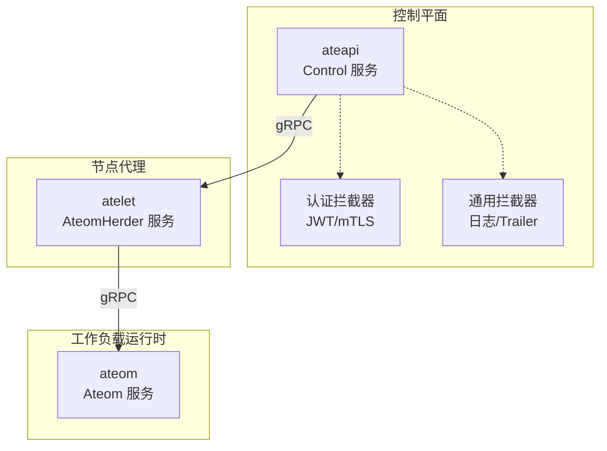
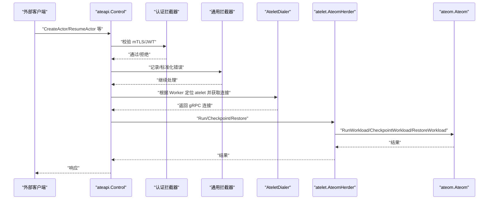
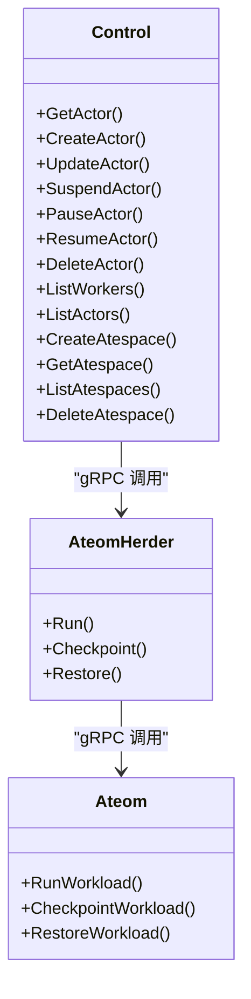
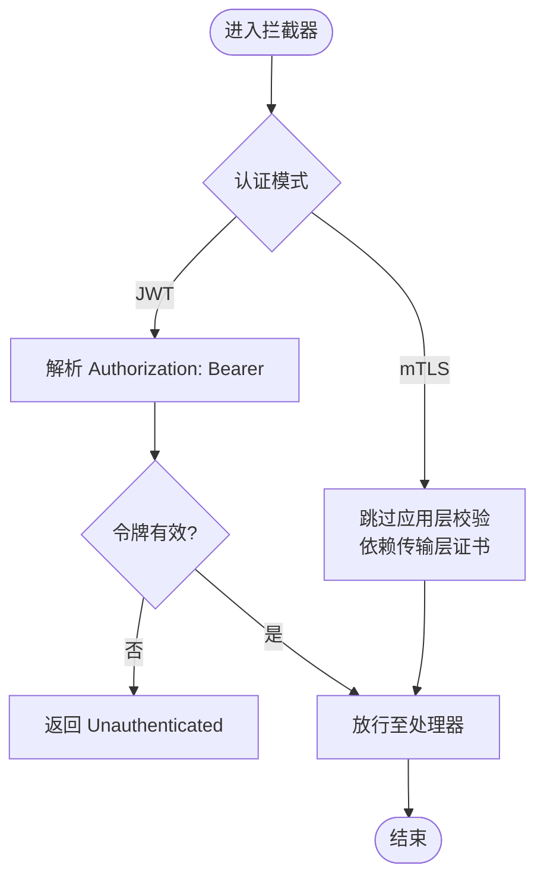
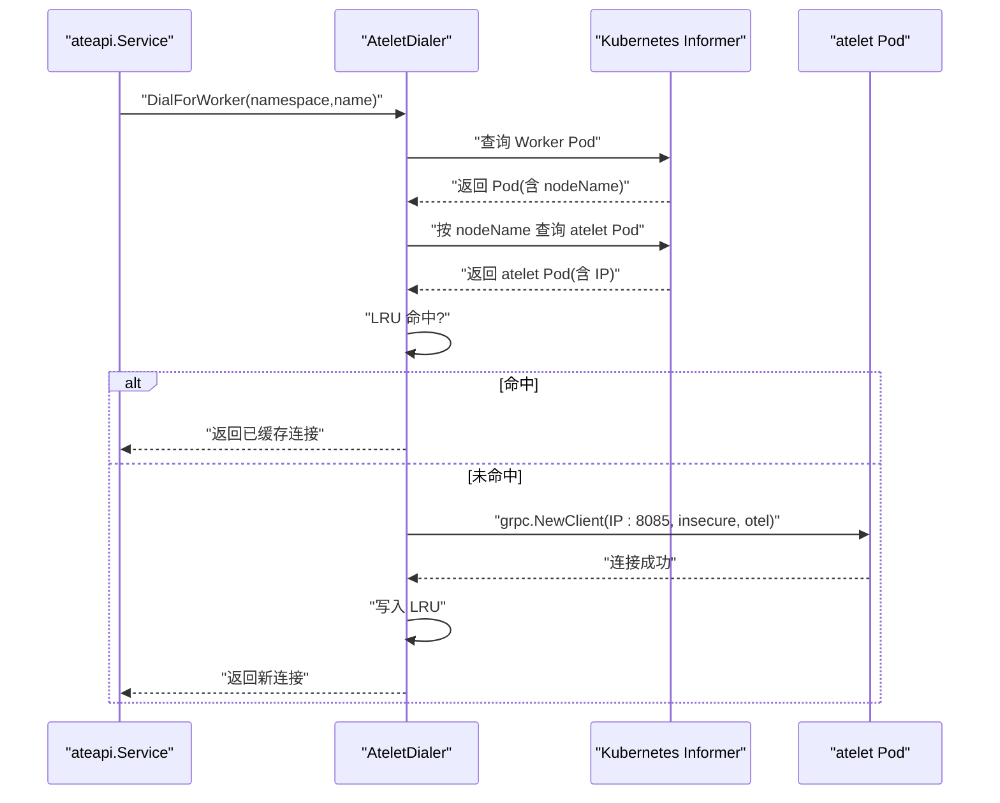
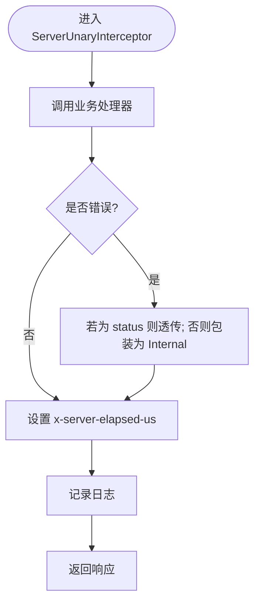
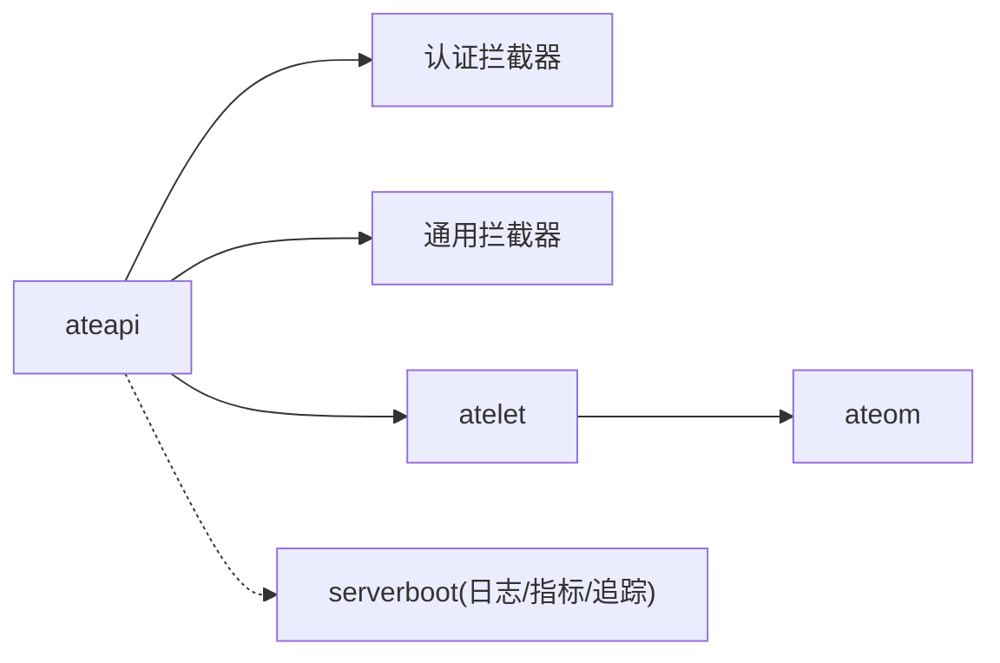
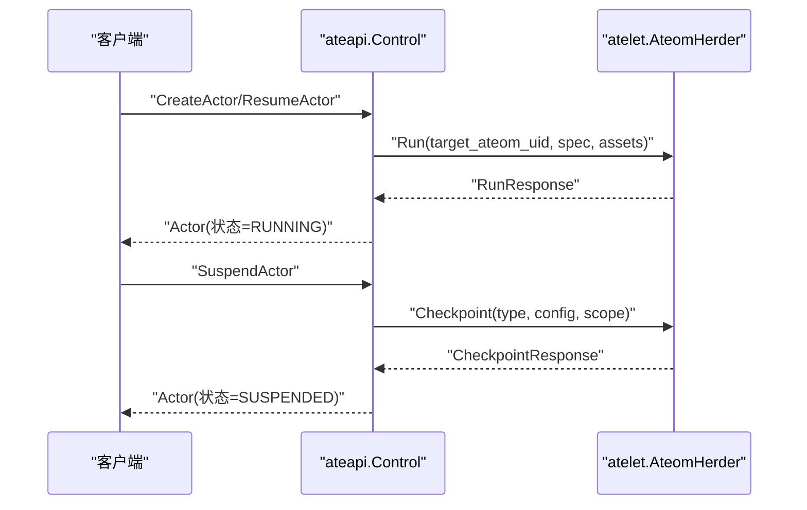
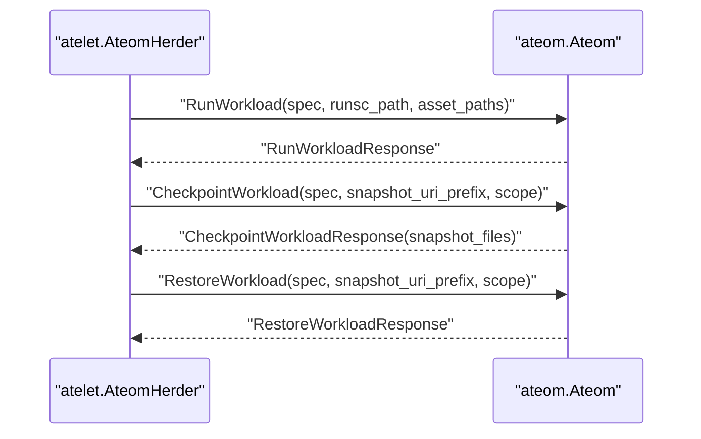
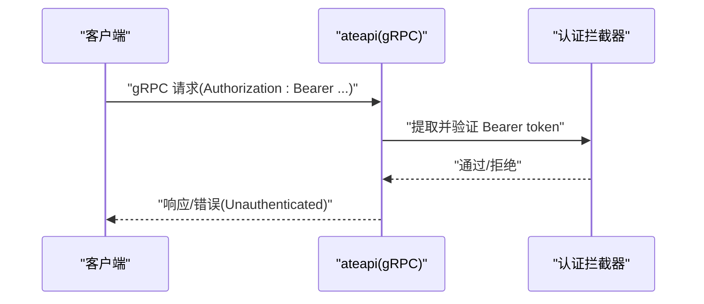

# 组件通信机制

<cite>
**本文引用的文件**   
- [ateapi.proto](file://pkg/proto/ateapipb/ateapi.proto)
- [atelet.proto](file://internal/proto/ateletpb/atelet.proto)
- [ateom.proto](file://internal/proto/ateompb/ateom.proto)
- [server.go](file://internal/ateapiauth/server.go)
- [client.go](file://internal/ateapiauth/client.go)
- [dialer.go](file://cmd/ateapi/internal/controlapi/dialer.go)
- [service.go](file://cmd/ateapi/internal/controlapi/service.go)
- [ateinterceptors.go](file://internal/ateinterceptors/ateinterceptors.go)
- [serverboot.go](file://internal/serverboot/serverboot.go)
</cite>

## 目录
1. [简介](#简介)
2. [项目结构](#项目结构)
3. [核心组件](#核心组件)
4. [架构总览](#架构总览)
5. [详细组件分析](#详细组件分析)
6. [依赖关系分析](#依赖关系分析)
7. [性能与连接管理](#性能与连接管理)
8. [故障排查指南](#故障排查指南)
9. [结论](#结论)
10. [附录：协议规范与时序图](#附录协议规范与时序图)

## 简介
本文件系统性阐述 Agent Substrate 的组件间通信机制，覆盖控制平面（ateapi）与数据平面（atelet、ateom）之间的 gRPC 接口定义、消息序列化、认证授权、错误处理、连接管理与重试策略、超时与可观测性，以及关键交互时序。文档旨在帮助开发者快速理解并正确集成各组件间的同步调用、异步通知与事件驱动通信模式。

## 项目结构
本项目采用按功能域组织的方式，gRPC 接口以 .proto 文件集中定义，服务端实现与客户端拨号逻辑分别位于对应模块中；认证拦截器、通用拦截器与启动基础设施在各公共包内复用。

图表来源
- [service.go:25-56](file://cmd/ateapi/internal/controlapi/service.go#L25-L56)
- [server.go:81-129](file://internal/ateapiauth/server.go#L81-L129)
- [ateinterceptors.go:36-72](file://internal/ateinterceptors/ateinterceptors.go#L36-L72)

章节来源
- [service.go:25-56](file://cmd/ateapi/internal/controlapi/service.go#L25-L56)
- [server.go:81-129](file://internal/ateapiauth/server.go#L81-L129)
- [ateinterceptors.go:36-72](file://internal/ateinterceptors/ateinterceptors.go#L36-L72)

## 核心组件
- 控制平面 ateapi
  - 提供 Control 服务，暴露 Actor/Atespace/Worker 等资源的 CRUD 与生命周期操作。
  - 通过 AteletDialer 选择目标 atelet 并建立 gRPC 连接，转发到节点代理。
- 节点代理 atelet
  - 提供 AteomHerder 服务，负责在 ateom 上运行、检查点与恢复工作负载。
- 运行时 ateom
  - 提供 Ateom 服务，直接管理单个 gVisor/microVM 实例的工作负载生命周期。
- 认证与鉴权
  - 支持 mTLS 与 JWT 两种认证模式，提供服务端拦截器与客户端拨号选项。
- 通用拦截器
  - 统一记录请求耗时、标准化错误码、清理敏感字段日志。
- 启动与可观测性
  - 统一的日志、指标、追踪初始化与 /metrics、/readyz 暴露。

章节来源
- [ateapi.proto:26-65](file://pkg/proto/ateapipb/ateapi.proto#L26-L65)
- [atelet.proto:21-33](file://internal/proto/ateletpb/atelet.proto#L21-L33)
- [ateom.proto:34-48](file://internal/proto/ateompb/ateom.proto#L34-L48)
- [server.go:35-70](file://internal/ateapiauth/server.go#L35-L70)
- [client.go:34-95](file://internal/ateapiauth/client.go#L34-L95)
- [ateinterceptors.go:36-72](file://internal/ateinterceptors/ateinterceptors.go#L36-L72)
- [serverboot.go:44-193](file://internal/serverboot/serverboot.go#L44-L193)

## 架构总览
控制平面通过 gRPC 与节点代理通信，节点代理再与运行时通信。所有链路均支持可观测性注入与可选的认证拦截。

图表来源
- [service.go:25-56](file://cmd/ateapi/internal/controlapi/service.go#L25-L56)
- [dialer.go:47-99](file://cmd/ateapi/internal/controlapi/dialer.go#L47-L99)
- [server.go:81-129](file://internal/ateapiauth/server.go#L81-L129)
- [ateinterceptors.go:36-72](file://internal/ateinterceptors/ateinterceptors.go#L36-L72)
- [ateapi.proto:26-65](file://pkg/proto/ateapipb/ateapi.proto#L26-L65)
- [atelet.proto:21-33](file://internal/proto/ateletpb/atelet.proto#L21-L33)
- [ateom.proto:34-48](file://internal/proto/ateompb/ateom.proto#L34-L48)

## 详细组件分析

### gRPC 接口定义与数据模型
- 控制平面 Control 服务
  - 资源：Actor、Atespace、Worker
  - 主要方法：Get/Create/Update/Suspend/Pause/Resume/Delete Actor；List Workers/Actors；Atespace CRUD
  - 分页：List 系列接口支持 page_size/page_token
- 节点代理 AteomHerder 服务
  - 方法：Run、Checkpoint、Restore
  - 参数包含 WorkloadSpec、SandboxAssets、SnapshotScope 等
- 运行时 Ateom 服务
  - 方法：RunWorkload、CheckpointWorkload、RestoreWorkload
  - 参数包含 WorkloadSpec、SnapshotScope、snapshot_uri_prefix 等

图表来源
- [ateapi.proto:26-65](file://pkg/proto/ateapipb/ateapi.proto#L26-L65)
- [atelet.proto:21-33](file://internal/proto/ateletpb/atelet.proto#L21-L33)
- [ateom.proto:34-48](file://internal/proto/ateompb/ateom.proto#L34-L48)

章节来源
- [ateapi.proto:26-65](file://pkg/proto/ateapipb/ateapi.proto#L26-L65)
- [atelet.proto:21-33](file://internal/proto/ateletpb/atelet.proto#L21-L33)
- [ateom.proto:34-48](file://internal/proto/ateompb/ateom.proto#L34-L48)

### 认证与授权（mTLS 与 JWT）
- 服务器端
  - 支持 ModeMTLS（默认）与 ModeJWT 两种模式
  - Unary/Stream 拦截器在请求进入处理器前完成身份验证
  - JWT 模式下要求 Authorization: Bearer <token>，并通过回调验证
- 客户端
  - ModeMTLS：使用 TLS（当前为 InsecureSkipVerify），身份由证书链承载
  - ModeJWT：基于 CAFile 校验服务端证书，每 RPC 从 TokenFile 读取 Bearer token 作为 per-RPC 凭据

图表来源
- [server.go:81-129](file://internal/ateapiauth/server.go#L81-L129)
- [client.go:57-95](file://internal/ateapiauth/client.go#L57-L95)

章节来源
- [server.go:35-70](file://internal/ateapiauth/server.go#L35-L70)
- [server.go:81-129](file://internal/ateapiauth/server.go#L81-L129)
- [client.go:34-95](file://internal/ateapiauth/client.go#L34-L95)

### 连接管理与拨号（AteletDialer）
- 作用：根据 Worker Pod 所在节点，定位同节点的 atelet Pod，并复用 gRPC 连接
- 缓存：LRU 缓存 atelet 连接键（namespace/name）
- 拨号：使用 insecure 传输（内部网络），附带 OpenTelemetry 统计
- 错误：未找到 Worker Pod 或 atelet 时返回明确错误

图表来源
- [dialer.go:47-99](file://cmd/ateapi/internal/controlapi/dialer.go#L47-L99)

章节来源
- [dialer.go:31-99](file://cmd/ateapi/internal/controlapi/dialer.go#L31-L99)

### 错误处理与可观测性
- 通用拦截器
  - 记录方法名、请求/响应摘要、耗时
  - 将非 status 错误包装为 Internal
  - 设置 x-server-elapsed-us trailer，便于客户端精确测量服务端耗时
- 认证拦截器
  - 缺失或无效 Bearer token 返回 Unauthenticated
- 启动与可观测性
  - 统一初始化日志、Prometheus 指标、OTLP 追踪
  - 暴露 /metrics 与可选 /readyz

图表来源
- [ateinterceptors.go:36-72](file://internal/ateinterceptors/ateinterceptors.go#L36-L72)
- [serverboot.go:121-193](file://internal/serverboot/serverboot.go#L121-L193)

章节来源
- [ateinterceptors.go:36-72](file://internal/ateinterceptors/ateinterceptors.go#L36-L72)
- [serverboot.go:121-193](file://internal/serverboot/serverboot.go#L121-L193)

### 控制平面与服务实现
- Service 组合了持久化、工作池列表器、模板列表器、sandbox 配置列表器、AteletDialer 与 ActorWorkflow
- 通过 NewService 装配依赖，对外实现 ateapipb.ControlServer

章节来源
- [service.go:25-56](file://cmd/ateapi/internal/controlapi/service.go#L25-L56)

## 依赖关系分析
- ateapi 依赖 atelet（跨 Pod 的 gRPC）
- atelet 依赖 ateom（同一节点上的 gRPC）
- 认证与拦截器为横切关注点，被上层服务组合使用
- 启动基础设施为各二进制共享

图表来源
- [service.go:25-56](file://cmd/ateapi/internal/controlapi/service.go#L25-L56)
- [server.go:81-129](file://internal/ateapiauth/server.go#L81-L129)
- [ateinterceptors.go:36-72](file://internal/ateinterceptors/ateinterceptors.go#L36-L72)
- [serverboot.go:44-193](file://internal/serverboot/serverboot.go#L44-L193)

章节来源
- [service.go:25-56](file://cmd/ateapi/internal/controlapi/service.go#L25-L56)
- [server.go:81-129](file://internal/ateapiauth/server.go#L81-L129)
- [ateinterceptors.go:36-72](file://internal/ateinterceptors/ateinterceptors.go#L36-L72)
- [serverboot.go:44-193](file://internal/serverboot/serverboot.go#L44-L193)

## 性能与连接管理
- 连接复用
  - AteletDialer 使用 LRU 缓存 atelet 连接，避免频繁创建开销
- 可观测性
  - 通过 OTel 统计 gRPC 调用，结合 x-server-elapsed-us trailer 精准度量
- 指标与就绪探针
  - 统一暴露 /metrics，按需启用 /readyz
- 建议
  - 合理设置 gRPC 超时与重试（客户端侧）
  - 对长耗时操作（如 Checkpoint/Restore）使用流式或异步编排
  - 监控连接池命中率与错误率，动态调整 LRU 容量

章节来源
- [dialer.go:31-99](file://cmd/ateapi/internal/controlapi/dialer.go#L31-L99)
- [ateinterceptors.go:36-72](file://internal/ateinterceptors/ateinterceptors.go#L36-L72)
- [serverboot.go:121-193](file://internal/serverboot/serverboot.go#L121-L193)

## 故障排查指南
- 认证失败
  - 现象：Unauthenticated
  - 排查：确认 mTLS 证书链或 JWT Bearer token 是否正确；检查服务端认证模式配置
- 连接问题
  - 现象：无法连接到 atelet/ateom
  - 排查：确认 Pod IP 可用、端口可达；检查 AteletDialer 的索引与缓存状态
- 错误码不透明
  - 现象：Internal 错误
  - 排查：查看通用拦截器日志与 trailer 中的 x-server-elapsed-us；定位具体处理器错误
- 性能问题
  - 现象：延迟高
  - 排查：对比客户端总耗时与服务端 elapsed；检查 gRPC 连接复用与下游 IO

章节来源
- [server.go:81-129](file://internal/ateapiauth/server.go#L81-L129)
- [ateinterceptors.go:36-72](file://internal/ateinterceptors/ateinterceptors.go#L36-L72)
- [dialer.go:47-99](file://cmd/ateapi/internal/controlapi/dialer.go#L47-L99)

## 结论
Agent Substrate 通过清晰的 gRPC 分层与可插拔的认证/拦截器，实现了控制平面与数据平面的稳定通信。AteletDialer 的连接复用与通用拦截器的可观测性能力，为系统提供了良好的性能与排障基础。建议在客户端侧完善超时与重试策略，并结合指标与追踪持续优化。

## 附录：协议规范与时序图

### 控制平面 → 节点代理（ateapi → atelet）
- 接口：AteomHerder.Run/Checkpoint/Restore
- 典型流程：CreateActor/ResumeActor 触发 Run；Suspend/Pause 触发 Checkpoint；Resume 可能触发 Restore

图表来源
- [ateapi.proto:26-65](file://pkg/proto/ateapipb/ateapi.proto#L26-L65)
- [atelet.proto:21-33](file://internal/proto/ateletpb/atelet.proto#L21-L33)

### 节点代理 → 运行时（atelet → ateom）
- 接口：Ateom.RunWorkload/CheckpointWorkload/RestoreWorkload
- 典型流程：atelet 将 WorkloadSpec 与快照信息下发给 ateom

图表来源
- [atelet.proto:21-33](file://internal/proto/ateletpb/atelet.proto#L21-L33)
- [ateom.proto:34-48](file://internal/proto/ateompb/ateom.proto#L34-L48)

### 认证流程（JWT）

图表来源
- [server.go:81-129](file://internal/ateapiauth/server.go#L81-L129)
- [client.go:57-95](file://internal/ateapiauth/client.go#L57-L95)
