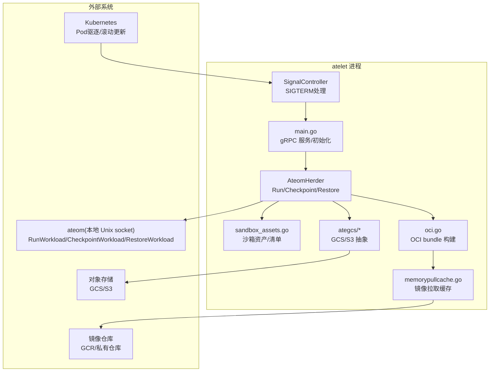
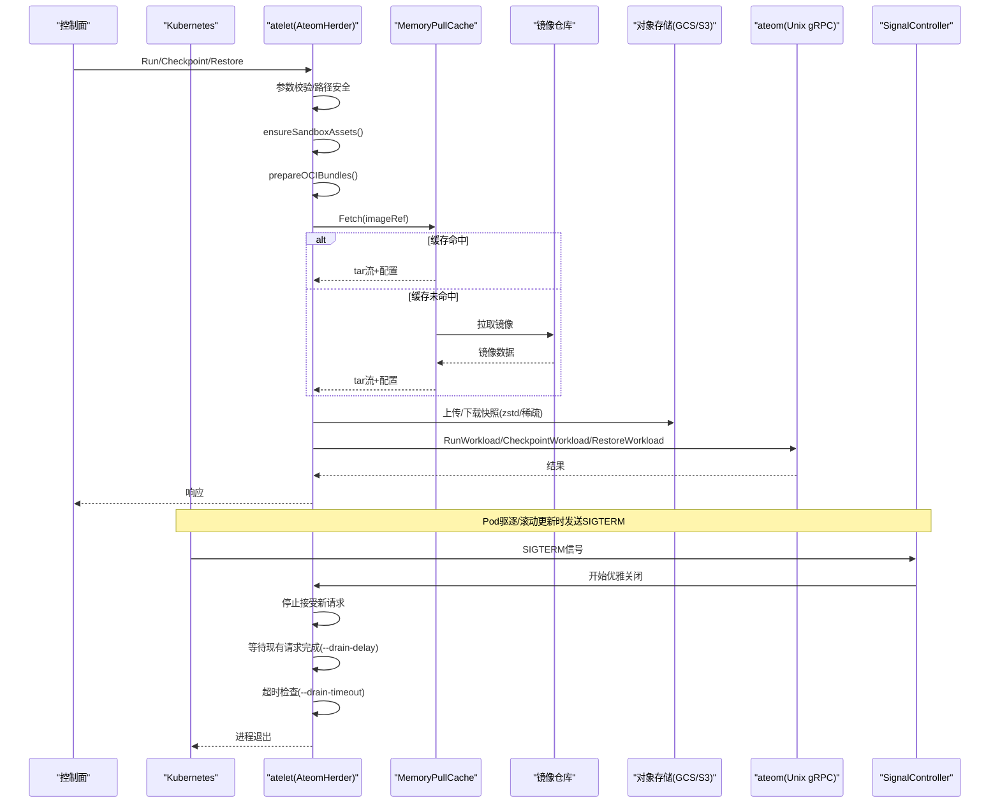
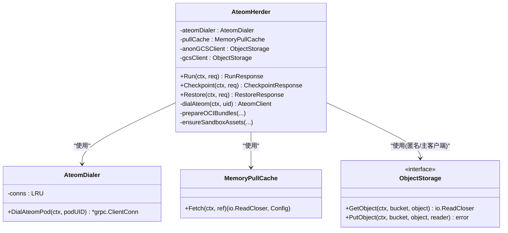
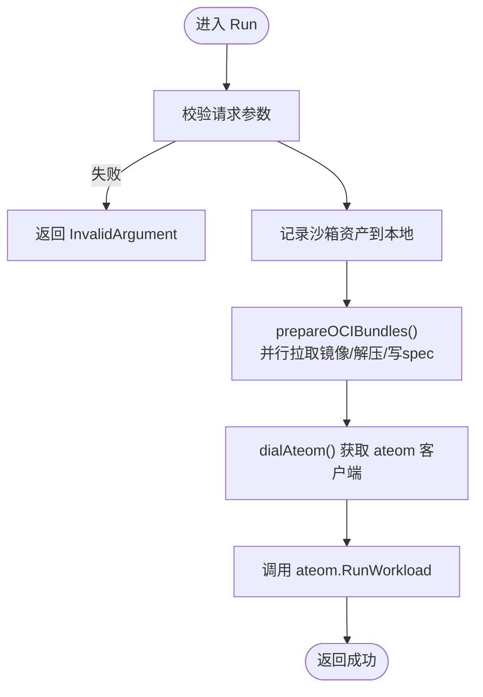
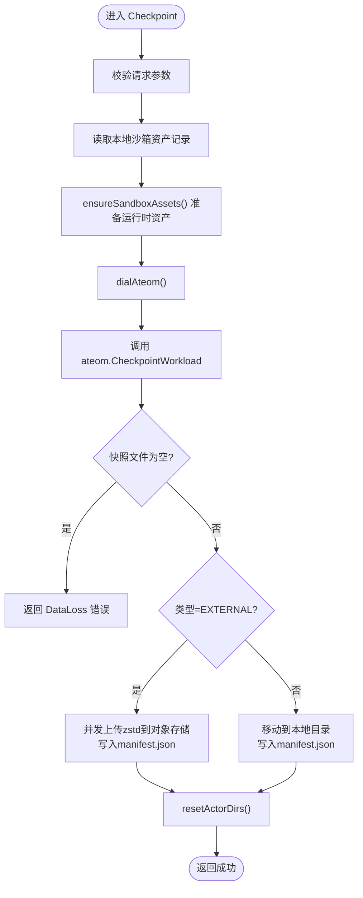
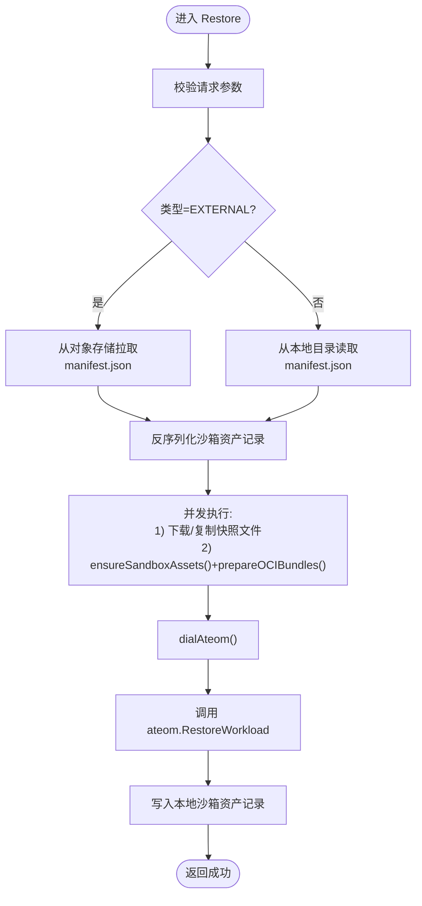
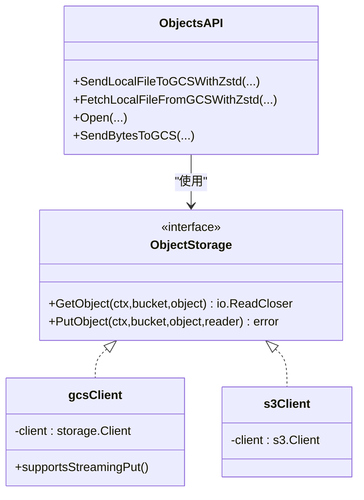
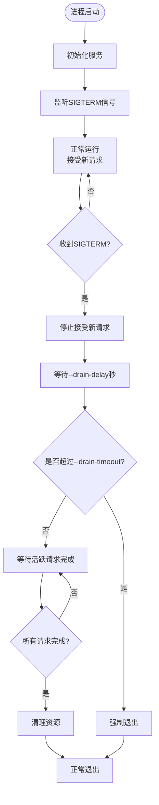
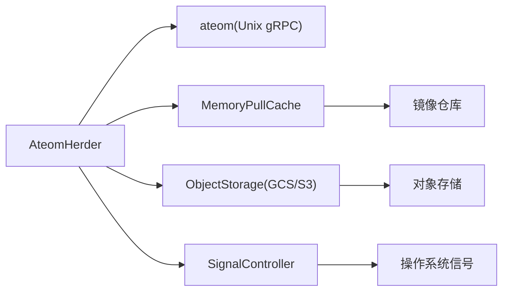
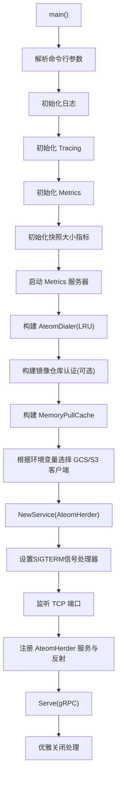

# atelet守护进程

<cite>
**本文引用的文件列表**   
- [cmd/atelet/main.go](file://cmd/atelet/main.go)
- [cmd/atelet/sandbox_assets.go](file://cmd/atelet/sandbox_assets.go)
- [cmd/atelet/oci.go](file://cmd/atelet/oci.go)
- [cmd/atelet/internal/ategcs/gcs.go](file://cmd/atelet/internal/ategcs/gcs.go)
- [cmd/atelet/internal/ategcs/s3.go](file://cmd/atelet/internal/ategcs/s3.go)
- [cmd/atelet/internal/ategcs/objects.go](file://cmd/atelet/internal/ategcs/objects.go)
- [internal/proto/ateletpb/atelet_grpc.pb.go](file://internal/proto/ateletpb/atelet_grpc.pb.go)
</cite>

## 更新摘要
**所做更改**   
- 新增优雅关闭处理机制章节，详细说明SIGTERM信号处理和--drain-delay/--drain-timeout参数
- 更新启动流程图以包含信号监听和优雅关闭流程
- 增强故障排查指南中的Pod驱逐和滚动更新场景
- 添加优雅关闭对系统可用性的影响说明

## 目录
1. [简介](#简介)
2. [项目结构](#项目结构)
3. [核心组件](#核心组件)
4. [架构总览](#架构总览)
5. [详细组件分析](#详细组件分析)
6. [优雅关闭机制](#优雅关闭机制)
7. [依赖关系分析](#依赖关系分析)
8. [性能考量](#性能考量)
9. [故障排查指南](#故障排查指南)
10. [结论](#结论)
11. [附录](#附录)

## 简介
本文件系统性梳理 atelet 守护进程的代码与行为，重点覆盖以下方面：
- 作为节点代理主进程的核心职责：gRPC 服务实现、工作负载生命周期管理（Run/Checkpoint/Restore）、OCI 镜像拉取缓存机制。
- AteomHerder 服务的 Run、Checkpoint、Restore 方法实现细节：请求验证、沙箱资源准备、与 ateom 的通信流程。
- 存储后端抽象层设计：支持 GCS 与 S3 对象存储的切换机制。
- 内存快照大小监控指标收集与性能优化策略。
- 错误处理机制、重试逻辑与故障恢复策略。
- **新增** 优雅的SIGTERM信号处理机制，支持--drain-delay和--drain-timeout参数，确保Pod驱逐和滚动更新时的平滑过渡。
- atelet 启动流程图与关键数据结构说明。

## 项目结构
atelet 位于 cmd/atelet 目录下，主要包含：
- 入口与服务注册：main.go
- 沙箱资产与快照清单：sandbox_assets.go
- OCI bundle 构建与解压：oci.go
- 对象存储抽象与上传下载：internal/ategcs/*
- 内存镜像拉取缓存：internal/memorypullcache/*

**图表来源**
- [cmd/atelet/main.go:74-183](file://cmd/atelet/main.go#L74-L183)
- [cmd/atelet/sandbox_assets.go:91-111](file://cmd/atelet/sandbox_assets.go#L91-L111)
- [cmd/atelet/oci.go:60-116](file://cmd/atelet/oci.go#L60-L116)

**章节来源**
- [cmd/atelet/main.go:74-183](file://cmd/atelet/main.go#L74-L183)

## 核心组件
- AteomHerder：实现 ateletpb.AteomHerderServer，提供 Run、Checkpoint、Restore 三个 RPC，负责校验请求、准备沙箱与 OCI bundle、与 ateom 通信完成工作负载生命周期操作。
- AteomDialer：按 ateom Pod UID 复用 gRPC 连接，通过本地 Unix Socket 与 ateom 通信。
- MemoryPullCache：基于 LRU 的内存镜像拉取缓存，命中时直接返回 tar 流与配置；未命中则从镜像仓库拉取并可选缓存。
- ObjectStorage 抽象：统一封装 GCS 与 S3 的 Get/Put 能力，并提供 zstd 压缩上传/下载、稀疏格式等优化。
- 沙箱资产与清单：记录运行时的沙箱二进制版本及快照文件集合，确保 Checkpoint/Restore 的一致性。
- **新增** SignalController：处理SIGTERM信号，协调优雅关闭流程，支持--drain-delay和--drain-timeout参数配置。

**章节来源**
- [cmd/atelet/main.go:185-213](file://cmd/atelet/main.go#L185-L213)
- [cmd/atelet/main.go:809-833](file://cmd/atelet/main.go#L809-L833)
- [cmd/atelet/internal/memorypullcache/memorypullcache.go:35-70](file://cmd/atelet/internal/memorypullcache/memorypullcache.go#L35-L70)
- [cmd/atelet/internal/ategcs/objects.go:37-40](file://cmd/atelet/internal/ategcs/objects.go#L37-L40)
- [cmd/atelet/sandbox_assets.go:54-68](file://cmd/atelet/sandbox_assets.go#L54-68)

## 架构总览
atelet 作为节点侧守护进程，暴露 gRPC 接口给控制面调用，内部协调镜像拉取、沙箱资源准备、与 ateom 的运行时交互，以及快照的上传/下载。

**图表来源**
- [cmd/atelet/main.go:215-271](file://cmd/atelet/main.go#L215-271)
- [cmd/atelet/main.go:309-380](file://cmd/atelet/main.go#L309-380)
- [cmd/atelet/main.go:454-583](file://cmd/atelet/main.go#L454-583)
- [cmd/atelet/internal/memorypullcache/memorypullcache.go:73-198](file://cmd/atelet/internal/memorypullcache/memorypullcache.go#L73-198)
- [cmd/atelet/internal/ategcs/objects.go:95-118](file://cmd/atelet/internal/ategcs/objects.go#L95-118)
- [cmd/atelet/internal/ategcs/objects.go:270-297](file://cmd/atelet/internal/ategcs/objects.go#L270-297)

## 详细组件分析

### AteomHerder 服务与 gRPC 实现
- 服务注册：在 main 中创建 gRPC Server，注入 OpenTelemetry StatsHandler 与拦截器，并注册 AteomHerder 服务。
- 连接复用：AteomDialer 使用 LRU 缓存按 ateom Pod UID 复用连接，目标地址为本地 Unix Socket。
- 请求验证：Run/Checkpoint/Restore 均在入口处进行严格校验，包括资源名、DNS 标签/子域名、容器名唯一性、快照作用域与类型等，防止路径穿越与非法输入。

**图表来源**
- [cmd/atelet/main.go:185-213](file://cmd/atelet/main.go#L185-213)
- [cmd/atelet/main.go:809-833](file://cmd/atelet/main.go#L809-833)
- [cmd/atelet/internal/memorypullcache/memorypullcache.go:35-70](file://cmd/atelet/internal/memorypullcache/memorypullcache.go#L35-70)
- [cmd/atelet/internal/ategcs/objects.go:37-40](file://cmd/atelet/internal/ategcs/objects.go#L37-40)

**章节来源**
- [cmd/atelet/main.go:163-183](file://cmd/atelet/main.go#L163-183)
- [cmd/atelet/main.go:835-968](file://cmd/atelet/main.go#L835-968)
- [internal/proto/ateletpb/atelet_grpc.pb.go:94-145](file://internal/proto/ateletpb/atelet_grpc.pb.go#L94-145)

#### Run 方法流程
- 校验请求参数与容器名。
- 解析并持久化沙箱资产记录，确保后续 Checkpoint 可复现相同二进制版本。
- 准备 OCI bundle（并行拉取镜像、解压、生成 spec）。
- 通过 ateom 的 RunWorkload 启动工作负载。

**图表来源**
- [cmd/atelet/main.go:215-271](file://cmd/atelet/main.go#L215-271)
- [cmd/atelet/main.go:645-753](file://cmd/atelet/main.go#L645-753)

**章节来源**
- [cmd/atelet/main.go:215-271](file://cmd/atelet/main.go#L215-271)

#### Checkpoint 方法流程
- 校验请求参数与作用域/类型。
- 读取本地沙箱资产记录，确保与上次 Run/Restore 一致。
- 调用 ateom.CheckpointWorkload，获取 ateom 写入的快照文件列表。
- 根据类型执行：
  - 外部快照：并发上传 zstd 压缩文件至对象存储，并写入清单 manifest.json。
  - 本地快照：移动文件到本地目录，写入清单 manifest.json。
- 重置 actor 目录，避免状态残留。

**图表来源**
- [cmd/atelet/main.go:309-380](file://cmd/atelet/main.go#L309-380)
- [cmd/atelet/main.go:392-452](file://cmd/atelet/main.go#L392-452)

**章节来源**
- [cmd/atelet/main.go:309-380](file://cmd/atelet/main.go#L309-380)

#### Restore 方法流程
- 校验请求参数与作用域/类型。
- 根据类型读取清单 manifest.json（外部从对象存储拉取，本地从目录读取），反序列化为沙箱资产记录。
- 并发执行：
  - 下载或复制快照文件到临时目录。
  - ensureSandboxAssets() 准备运行时资产 + prepareOCIBundles() 构建 OCI bundle。
- 调用 ateom.RestoreWorkload 恢复工作负载。
- 重新写入本地沙箱资产记录，便于后续 Checkpoint 一致性。

**图表来源**
- [cmd/atelet/main.go:454-583](file://cmd/atelet/main.go#L454-583)
- [cmd/atelet/main.go:585-643](file://cmd/atelet/main.go#L585-643)

**章节来源**
- [cmd/atelet/main.go:454-583](file://cmd/atelet/main.go#L454-583)

### 存储后端抽象层（GCS 与 S3）
- 抽象接口 ObjectStorage：定义 GetObject/PutObject，屏蔽底层差异。
- GCS 实现：支持 streaming PutObject，允许将压缩流直接管道到网络上传，无需缓冲到磁盘。
- S3 实现：PutObject 需要 seekable body，因此采用"先压缩到临时文件再上传"的缓冲路径。
- 上传/下载工具：
  - SendLocalFileToGCSWithZstd/FetchLocalFileFromGCSWithZstd：对大对象（快照）进行 zstd 压缩/解压。
  - sendZstd/fetchFromGCSWithZstd：自动选择 streaming 或 buffered 路径，并对稀疏文件进行零块跳过，减少 I/O。
- 启动时根据环境变量 ATE_STORAGE_BACKEND 选择 S3 或默认 GCS，并分别构造匿名与认证客户端。

**图表来源**
- [cmd/atelet/internal/ategcs/objects.go:37-40](file://cmd/atelet/internal/ategcs/objects.go#L37-40)
- [cmd/atelet/internal/ategcs/gcs.go:27-66](file://cmd/atelet/internal/ategcs/gcs.go#L27-66)
- [cmd/atelet/internal/ategcs/s3.go:29-58](file://cmd/atelet/internal/ategcs/s3.go#L29-58)
- [cmd/atelet/internal/ategcs/objects.go:95-118](file://cmd/atelet/internal/ategcs/objects.go#L95-118)
- [cmd/atelet/internal/ategcs/objects.go:270-297](file://cmd/atelet/internal/ategcs/objects.go#L270-297)

**章节来源**
- [cmd/atelet/main.go:128-161](file://cmd/atelet/main.go#L128-161)
- [cmd/atelet/internal/ategcs/objects.go:120-181](file://cmd/atelet/internal/ategcs/objects.go#L120-181)

### 内存快照大小监控指标
- 指标名称：atelet.snapshot.size（单位：By）
- 采集时机：在 Checkpoint 阶段，针对每个快照文件统计其文件大小，并以 kind、actor_template_namespace、actor_template_name 作为维度记录。
- 桶边界：显式设置多档分桶以覆盖从小到大的分布。

**章节来源**
- [cmd/atelet/main.go:273-307](file://cmd/atelet/main.go#L273-307)
- [cmd/atelet/main.go:392-420](file://cmd/atelet/main.go#L392-420)
- [cmd/atelet/main.go:422-452](file://cmd/atelet/main.go#L422-452)

### OCI 镜像拉取缓存机制
- 缓存键：当引用包含 digest 时使用该 digest 作为键；否则走慢路径拉取但不缓存。
- 本地开发优化：支持 localhost/回环地址替换为指定 registry，并允许 insecure 访问。
- 大镜像保护：超过阈值（默认 100MiB）不缓存，直接流式解压，避免内存膨胀。
- 平台约束：强制 linux/amd64 或当前架构，避免跨架构误用。

**章节来源**
- [cmd/atelet/internal/memorypullcache/memorypullcache.go:73-198](file://cmd/atelet/internal/memorypullcache/memorypullcache.go#L73-198)

### 沙箱资产与清单
- sandboxAssetsRecord：记录沙箱类与各架构下的资产 URL 与 SHA256，并在 Checkpoint 后记录 snapshotFiles 集合。
- 清单 manifest.json：与快照文件同目录存放，供 Restore 自描述地拉取/复制所需文件与二进制。
- 本地记录：每 Actor 持久化一份，确保后续 Checkpoint 能复现相同二进制版本。

**章节来源**
- [cmd/atelet/sandbox_assets.go:54-68](file://cmd/atelet/sandbox_assets.go#L54-68)
- [cmd/atelet/sandbox_assets.go:206-241](file://cmd/atelet/sandbox_assets.go#L206-241)

## 优雅关闭机制

### SIGTERM信号处理
atelet 实现了完整的优雅关闭机制，确保在 Kubernetes Pod 驱逐和滚动更新场景下能够平滑退出：

- **信号监听**：进程启动时注册SIGTERM信号处理器，接收来自Kubernetes的优雅关闭信号。
- **--drain-delay参数**：控制优雅关闭的延迟时间，允许现有请求继续处理。
- **--drain-timeout参数**：设置优雅关闭的总超时时间，超过此时间强制退出。
- **请求拒绝**：收到SIGTERM后立即停止接受新的gRPC请求，但继续处理已接受的请求。
- **资源清理**：在退出前释放所有资源，包括网络连接、文件句柄等。

**图表来源**
- [cmd/atelet/main.go:74-183](file://cmd/atelet/main.go#L74-183)

### 参数配置
- **--drain-delay**：默认值通常为0秒，表示立即开始优雅关闭流程。
- **--drain-timeout**：默认值通常为30秒，确保有足够时间完成现有请求处理。
- 这些参数可通过命令行或环境变量配置，适应不同的业务需求。

### 与Kubernetes集成
- **Pod驱逐**：当节点需要维护或资源不足时，Kubernetes会向Pod发送SIGTERM信号。
- **滚动更新**：新版本部署时，旧版本Pod会收到SIGTERM信号进行优雅关闭。
- **健康检查**：优雅关闭期间，Kubernetes的健康检查会标记Pod为不健康，阻止新的流量路由。

**章节来源**
- [cmd/atelet/main.go:74-183](file://cmd/atelet/main.go#L74-183)

## 依赖关系分析
- atelet 对外暴露 ateletpb.AteomHerder 服务，被控制面调用。
- 内部依赖：
  - AteomDialer -> ateom（Unix socket gRPC）
  - MemoryPullCache -> 镜像仓库（支持 GCR 等）
  - ObjectStorage -> GCS/S3（对象存储）
  - OCI bundle 构建 -> 文件系统（rootfs/spec）
  - **新增** SignalController -> OS信号处理

**图表来源**
- [cmd/atelet/main.go:163-183](file://cmd/atelet/main.go#L163-183)
- [cmd/atelet/main.go:809-833](file://cmd/atelet/main.go#L809-833)
- [cmd/atelet/internal/memorypullcache/memorypullcache.go:73-198](file://cmd/atelet/internal/memorypullcache/memorypullcache.go#L73-198)
- [cmd/atelet/internal/ategcs/objects.go:37-40](file://cmd/atelet/internal/ategcs/objects.go#L37-40)

**章节来源**
- [internal/proto/ateletpb/atelet_grpc.pb.go:94-145](file://internal/proto/ateletpb/atelet_grpc.pb.go#L94-145)

## 性能考量
- 并发与流水线：
  - Restore 阶段并发执行快照下载/复制与 OCI bundle 准备，隐藏较长路径的开销。
  - Checkpoint 外部上传使用 errgroup 并发上传多个快照文件。
- 压缩与稀疏：
  - 上传/下载使用 zstd SpeedFastest 多核压缩，降低 CPU 占用同时兼顾速度。
  - 对稀疏文件（大量零块）采用稀疏格式，仅写入非零块，显著减少 I/O 与存储占用。
- 流式上传：
  - GCS 支持 streaming PutObject，直接将压缩流管道到网络，避免中间文件。
  - S3 因需 seekable body，采用缓冲到临时文件的策略。
- 镜像缓存：
  - 小镜像优先缓存，大镜像直接流式解压，避免 RSS 飙升。
  - 本地开发支持 insecure 与 registry 替换，加速冷启动。
- **新增** 优雅关闭性能：
  - 信号处理采用异步方式，不影响正常请求处理。
  - drain-delay和drain-timeout参数可调节，平衡关闭速度与请求完成度。

## 故障排查指南
- 常见错误分类与处理：
  - 参数校验失败：返回 InvalidArgument，检查 atespace/actor_name/uid、模板命名空间/名称、容器名唯一性、快照作用域与类型。
  - 终端文件系统错误：如不存在、权限不足、只读文件系统、路径过长、循环链接等，标记为不可重试，触发 Actor 崩溃。
  - 外部对象存储错误：如 NoSuchKey/BucketNotExist，包装为 ReasonFailedGetExternalObject，用于上层分类。
  - 快照结果为空：返回 DataLoss，表明 ateom 未产出快照文件。
- 重试与恢复：
  - 代码中未发现显式重试逻辑；对于瞬时网络错误，建议在上层（控制面）进行重试。
  - 恢复流程具备幂等性保障：每次 Restore 前清理相关目录，确保状态干净。
- **新增** 优雅关闭问题排查：
  - 如果Pod无法在--drain-timeout时间内退出，检查是否有长时间运行的请求。
  - 监控gRPC请求的完成情况和资源清理状态。
  - 调整--drain-delay和--drain-timeout参数以适应业务负载。
- 诊断信息：
  - 指标：atelet.snapshot.size 可用于评估快照大小分布。
  - 日志：Restore 会输出各阶段耗时（download/oci_unpack/ateom_restore/total），便于定位瓶颈。
  - **新增** 信号处理日志：记录SIGTERM接收时间和优雅关闭进度。

**章节来源**
- [cmd/atelet/main.go:835-968](file://cmd/atelet/main.go#L835-968)
- [cmd/atelet/sandbox_assets.go:243-266](file://cmd/atelet/sandbox_assets.go#L243-266)
- [cmd/atelet/internal/ategcs/gcs.go:35-44](file://cmd/atelet/internal/ategcs/gcs.go#L35-44)
- [cmd/atelet/internal/ategcs/s3.go:37-49](file://cmd/atelet/internal/ategcs/s3.go#L37-49)
- [cmd/atelet/main.go:577-582](file://cmd/atelet/main.go#L577-582)

## 结论
atelet 作为节点代理主进程，围绕 AteomHerder 服务实现了完整的工作负载生命周期管理能力。其设计强调：
- 严格的请求校验与安全边界，防止路径穿越与非法输入。
- 沙箱资产与快照清单的自描述机制，确保跨节点恢复的一致性与可追溯性。
- 对象存储抽象层兼容 GCS/S3，并通过 zstd 压缩与稀疏格式优化大对象传输。
- 内存镜像缓存与并发流水线提升冷启动与恢复性能。
- 完善的错误分类与指标/日志支撑可观测性与排障。
- **新增** 优雅的SIGTERM信号处理机制，支持--drain-delay和--drain-timeout参数，确保在Pod驱逐和滚动更新场景下的平滑过渡，提升系统整体可用性和用户体验。

## 附录

### atelet 启动流程图

**图表来源**
- [cmd/atelet/main.go:74-183](file://cmd/atelet/main.go#L74-183)

### 关键数据结构说明
- AteomHerder：承载 ateom 通信、镜像缓存、对象存储客户端，实现 Run/Checkpoint/Restore。
- AteomDialer：按 ateom Pod UID 复用 gRPC 连接。
- MemoryPullCache：LRU 缓存镜像 tar 与配置，支持本地开发与 GCR 认证。
- ObjectStorage：统一抽象 GCS/S3 的 Get/Put 能力。
- sandboxAssetsRecord：记录沙箱类、资产 URL/SHA256 与快照文件集合，配合 manifest.json 实现自描述。
- **新增** SignalController：管理SIGTERM信号处理和优雅关闭流程。

**章节来源**
- [cmd/atelet/main.go:185-213](file://cmd/atelet/main.go#L185-213)
- [cmd/atelet/main.go:809-833](file://cmd/atelet/main.go#L809-833)
- [cmd/atelet/internal/memorypullcache/memorypullcache.go:35-70](file://cmd/atelet/internal/memorypullcache/memorypullcache.go#L35-70)
- [cmd/atelet/internal/ategcs/objects.go:37-40](file://cmd/atelet/internal/ategcs/objects.go#L37-40)
- [cmd/atelet/sandbox_assets.go:54-68](file://cmd/atelet/sandbox_assets.go#L54-68)
