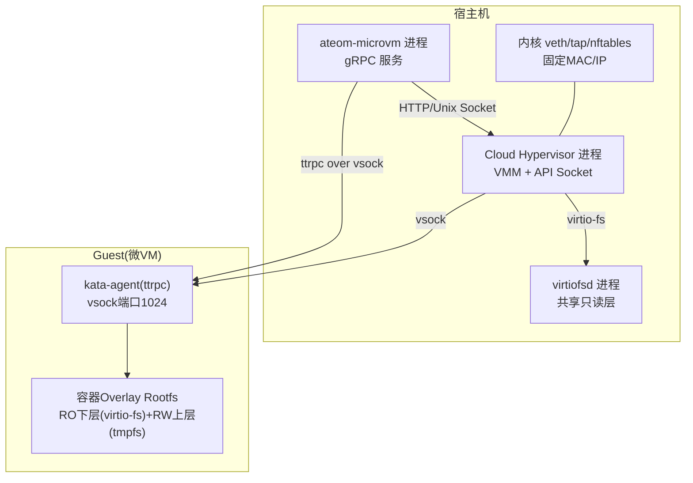
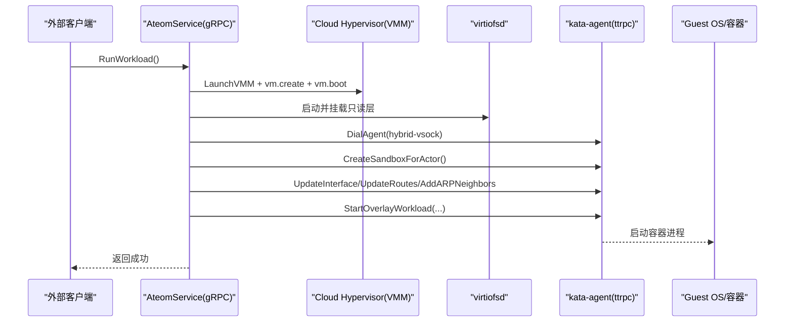
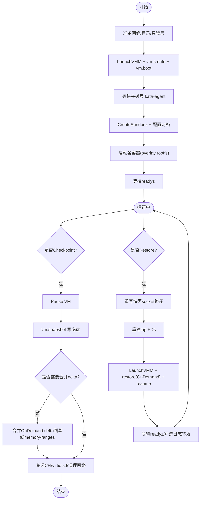
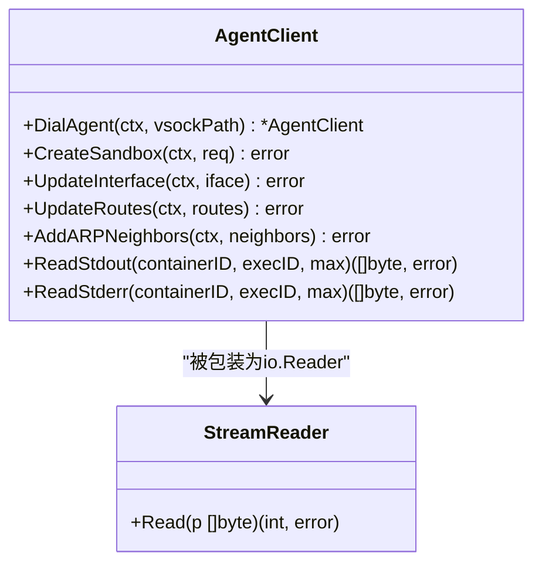
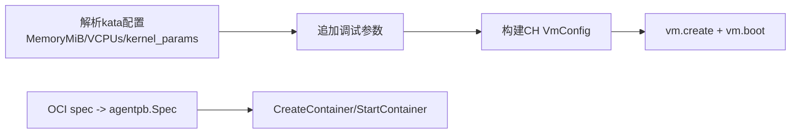
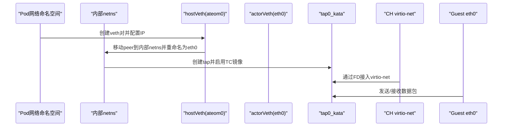
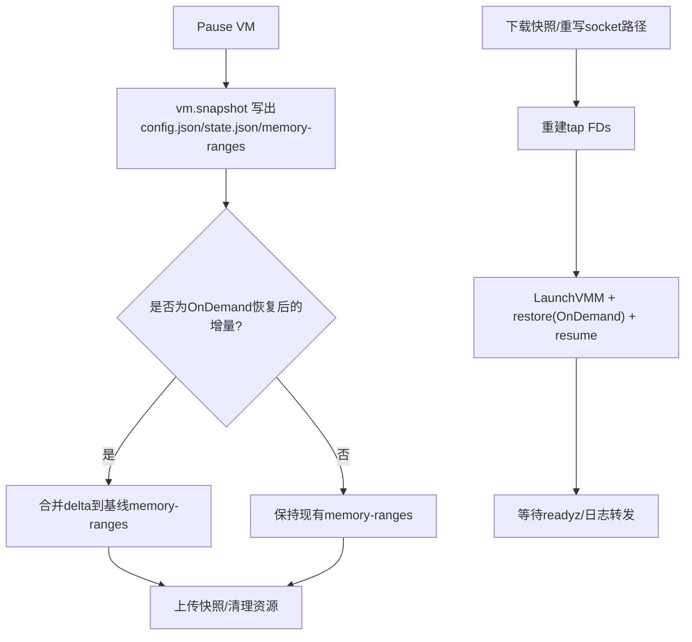
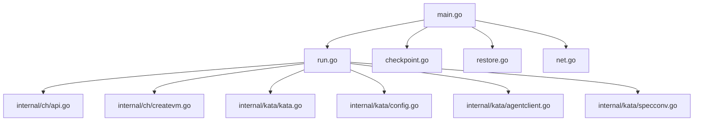
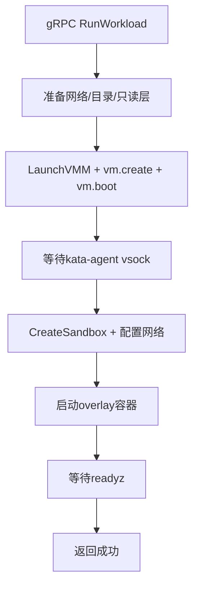
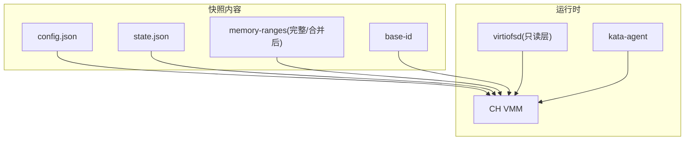

# MicroVM运行时实现

<cite>
**本文引用的文件列表**
- [main.go](file://cmd/ateom-microvm/main.go)
- [run.go](file://cmd/ateom-microvm/run.go)
- [checkpoint.go](file://cmd/ateom-microvm/checkpoint.go)
- [restore.go](file://cmd/ateom-microvm/restore.go)
- [spec.go](file://cmd/ateom-microvm/spec.go)
- [net.go](file://cmd/ateom-microvm/net.go)
- [api.go](file://cmd/ateom-microvm/internal/ch/api.go)
- [createvm.go](file://cmd/ateom-microvm/internal/ch/createvm.go)
- [kata.go](file://cmd/ateom-microvm/internal/kata/kata.go)
- [config.go](file://cmd/ateom-microvm/internal/kata/config.go)
- [agentclient.go](file://cmd/ateom-microvm/internal/kata/agentclient.go)
- [specconv.go](file://cmd/ateom-microvm/internal/kata/specconv.go)
</cite>

## 目录
1. [简介](#简介)
2. [项目结构](#项目结构)
3. [核心组件](#核心组件)
4. [架构总览](#架构总览)
5. [详细组件分析](#详细组件分析)
6. [依赖关系分析](#依赖关系分析)
7. [性能考量](#性能考量)
8. [故障排查指南](#故障排查指南)
9. [结论](#结论)
10. [附录](#附录)

## 简介
本文件系统性阐述 ateom-microvm 基于 Cloud Hypervisor（CH）的微虚拟机实现，覆盖 VM 实例管理、快照与恢复、kata agent 集成、VM 规格转换与资源分配、网络命名空间共享与 pause 容器模型、安全隔离与权限控制等。文档提供启动流程图与快照架构图，帮助读者快速理解从请求到 VM 运行、再到 checkpoint/restore 的完整生命周期。

## 项目结构
ateom-microvm 以 gRPC 服务形式暴露 Ateom 接口，内部通过 direct CH API 驱动 VMM，并通过 kata-agent ttrpc 在 guest 内完成沙箱与容器的创建、网络配置与日志转发。关键模块划分如下：
- 入口与服务注册：主进程初始化日志、追踪、命名空间、gRPC 服务并注册 AteomServer
- VM 生命周期：RunWorkload、CheckpointWorkload、RestoreWorkload
- 网络：veth/tap/mirror/nftables 与固定 MAC/IP 策略，确保跨 pod 恢复后网络一致
- CH 客户端：REST API 封装（vm.create/boot/pause/snapshot/resume/restore）
- Kata 集成：配置解析、agent 连接、OCI spec 适配、overlay 根文件系统组装

图表来源
- [main.go:142-152](file://cmd/ateom-microvm/main.go#L142-L152)
- [run.go:266-316](file://cmd/ateom-microvm/run.go#L266-L316)
- [net.go:119-198](file://cmd/ateom-microvm/net.go#L119-L198)
- [api.go:31-57](file://cmd/ateom-microvm/internal/ch/api.go#L31-L57)
- [agentclient.go:99-128](file://cmd/ateom-microvm/internal/kata/agentclient.go#L99-L128)

章节来源
- [main.go:59-154](file://cmd/ateom-microvm/main.go#L59-L154)
- [run.go:174-368](file://cmd/ateom-microvm/run.go#L174-L368)
- [net.go:119-198](file://cmd/ateom-microvm/net.go#L119-L198)

## 核心组件
- AteomService：gRPC 服务实现，持有 runningActor 映射表，串行化 VM 生命周期操作
- runningActor：记录单个 actor 的 CH 进程、virtiofsd、API socket、baseID、日志代理等
- CH 客户端：封装 vm.create/boot/pause/snapshot/resume/restore 等 REST 调用
- Kata Agent 客户端：通过 hybrid-vsock 建立 ttrpc 通道，执行 CreateSandbox/UpdateInterface/UpdateRoutes/AddARPNeighbors/ReadStdout/ReadStderr 等
- 网络栈：固定 hostVethMAC 与 actorGuestMAC，veth+tap+TC mirror+nftables DNAT/Masquerade，保证跨 pod 恢复后 ARP/路由稳定
- Spec 转换器：将 OCI runtime-spec 转换为 kata-agent 所需的 protobuf Spec，补齐 Linux 资源、挂载与安全相关字段

章节来源
- [main.go:184-226](file://cmd/ateom-microvm/main.go#L184-L226)
- [run.go:41-76](file://cmd/ateom-microvm/run.go#L41-L76)
- [api.go:31-57](file://cmd/ateom-microvm/internal/ch/api.go#L31-L57)
- [agentclient.go:87-128](file://cmd/ateom-microvm/internal/kata/agentclient.go#L87-L128)
- [net.go:54-83](file://cmd/ateom-microvm/net.go#L54-L83)
- [specconv.go:24-135](file://cmd/ateom-microvm/internal/kata/specconv.go#L24-L135)

## 架构总览
下图展示 ateom-microvm 的整体交互：外部通过 gRPC 调用 AteomService；AteomService 直接拉起 CH 进程，构建 VM 配置并引导 kata 镜像；随后通过 kata-agent 建立沙箱、配置网络、启动 overlay 根文件系统下的容器；日志通过 agent 的 ReadStdout/ReadStderr 回传到宿主 stdout。

图表来源
- [run.go:266-316](file://cmd/ateom-microvm/run.go#L266-L316)
- [run.go:478-510](file://cmd/ateom-microvm/run.go#L478-L510)
- [agentclient.go:159-204](file://cmd/ateom-microvm/internal/kata/agentclient.go#L159-L204)

## 详细组件分析

### VM 实例管理与生命周期
- 启动流程（RunWorkload）
  - 准备网络（veth/tap），清理旧状态，创建 VM 目录
  - 组装每个容器的 OCI spec，注入 DNS，绑定只读层到 virtiofsd 共享目录
  - 启动 virtiofsd 与 CH VMM，创建 VM 并添加网络设备，Boot
  - 等待 kata-agent vsock 就绪，拨号建立 ttrpc 连接
  - 创建沙箱、配置网络、启动 overlay 工作负载，等待 readyz 健康检查
  - 记录 runningActor，启动日志转发 goroutine
- 暂停与快照（CheckpointWorkload）
  - 通过 CH API 暂停 VM，写入 base-id 到快照目录
  - 调用 vm.snapshot 生成 config.json/state.json/memory-ranges
  - 若为 OnDemand 恢复后的增量快照，合并 delta 到基线 memory-ranges 形成完整快照
  - 关闭 CH、virtiofsd、清理网络与沙箱状态
- 恢复（RestoreWorkload）
  - 重写快照 config.json 中的 vsock/serial/fs socket 路径至当前 actor 的 VMDir
  - 重建网络 tap FDs，读取快照中的网络设备信息
  - 启动 CH 并使用 --restore（OnDemand）加载内存快照，附加 net_fds
  - Resume 后等待 readyz，可选重连 agent 进行日志转发

图表来源
- [run.go:174-368](file://cmd/ateom-microvm/run.go#L174-L368)
- [checkpoint.go:44-154](file://cmd/ateom-microvm/checkpoint.go#L44-L154)
- [restore.go:52-207](file://cmd/ateom-microvm/restore.go#L52-L207)

章节来源
- [run.go:174-368](file://cmd/ateom-microvm/run.go#L174-L368)
- [checkpoint.go:44-154](file://cmd/ateom-microvm/checkpoint.go#L44-L154)
- [restore.go:52-207](file://cmd/ateom-microvm/restore.go#L52-L207)

### Kata Agent 集成与 Overlay 根文件系统
- 沙箱建立：CreateSandboxForActor 挂载共享 virtio-fs 作为所有容器的只读基础
- 网络配置：UpdateInterface/UpdateRoutes/AddARPNeighbors 设置 eth0 IP/MAC/MTU、默认路由与网关 ARP 静态项
- 容器启动：先创建 carrier（仅负责挂载 RO 基础），再启动 overlay workload（tmpfs upper），最终由 kata-agent 执行 init 进程
- 日志转发：通过 ReadStdout/ReadStderr 轮询，包装成 io.Reader 供统一日志器输出

图表来源
- [agentclient.go:99-128](file://cmd/ateom-microvm/internal/kata/agentclient.go#L99-L128)
- [agentclient.go:206-274](file://cmd/ateom-microvm/internal/kata/agentclient.go#L206-L274)

章节来源
- [run.go:478-538](file://cmd/ateom-microvm/run.go#L478-L538)
- [agentclient.go:159-204](file://cmd/ateom-microvm/internal/kata/agentclient.go#L159-L204)
- [agentclient.go:206-274](file://cmd/ateom-microvm/internal/kata/agentclient.go#L206-L274)

### VM 规格转换与资源分配
- 从 kata configuration.toml 解析 guest sizing（MemoryMiB/VCPUs）与 kernel_params
- 追加调试控制台参数与可选 agent debug 级别
- 构造 CH VmConfig：cpus/memory/payload/disks/fs/rng/serial/vsock/platform
- 将 OCI runtime-spec 转换为 kata-agent protobuf Spec，补齐 Linux 资源、挂载、命名空间与安全相关字段

图表来源
- [config.go:52-104](file://cmd/ateom-microvm/internal/kata/config.go#L52-L104)
- [run.go:443-476](file://cmd/ateom-microvm/run.go#L443-L476)
- [specconv.go:24-135](file://cmd/ateom-microvm/internal/kata/specconv.go#L24-L135)

章节来源
- [run.go:424-476](file://cmd/ateom-microvm/run.go#L424-L476)
- [config.go:52-104](file://cmd/ateom-microvm/internal/kata/config.go#L52-L104)
- [spec.go:29-107](file://cmd/ateom-microvm/spec.go#L29-L107)
- [specconv.go:24-135](file://cmd/ateom-microvm/internal/kata/specconv.go#L24-L135)

### 网络命名空间共享与“pause”容器模型
- 每激活一次创建一个内部 netns，并在其中维护一个 veth 对（host 端在 pod netns，peer 移入内部 netns 并重命名为 eth0）
- 使用固定 hostVethMAC 与 actorGuestMAC，避免恢复后 ARP 失效导致 egress 丢包
- 通过 TC mirred 在 veth 与 tap 之间双向镜像，模拟 kata tcfilter 模型
- nftables 规则：DNAT 进入流量到 actor veth IP，Masquerade 出向流量，Forward 放行
- “pause”容器模型：carrier 容器仅挂载只读基础，workload 容器叠加 tmpfs 上层，二者共享同一 micro-VM 与网络命名空间

图表来源
- [net.go:119-198](file://cmd/ateom-microvm/net.go#L119-L198)
- [net.go:531-600](file://cmd/ateom-microvm/net.go#L531-L600)
- [net.go:336-416](file://cmd/ateom-microvm/net.go#L336-L416)

章节来源
- [net.go:119-198](file://cmd/ateom-microvm/net.go#L119-L198)
- [net.go:531-600](file://cmd/ateom-microvm/net.go#L531-L600)
- [net.go:336-416](file://cmd/ateom-microvm/net.go#L336-L416)

### 快照与恢复底层实现（CH 快照格式、内存转储、文件系统状态）
- CH 快照包含：config.json、state.json、memory-ranges（稀疏或完整）
- 只读层（virtio-fs）不随快照迁移，恢复时按固定路径重建；可写层（guest tmpfs）写入已包含在内存快照中
- OnDemand 恢复：以 userfaultfd 按需拉取内存页，显著降低恢复时间；后续 checkpoint 会将 delta 合并到基线 memory-ranges，形成自包含快照
- 恢复过程需重写 snapshot config.json 中的 socket 路径（vsock/serial/fs），重建 tap FDs 并传入 restore

图表来源
- [checkpoint.go:44-154](file://cmd/ateom-microvm/checkpoint.go#L44-L154)
- [restore.go:209-255](file://cmd/ateom-microvm/restore.go#L209-L255)

章节来源
- [checkpoint.go:44-154](file://cmd/ateom-microvm/checkpoint.go#L44-L154)
- [restore.go:52-207](file://cmd/ateom-microvm/restore.go#L52-L207)
- [restore.go:209-255](file://cmd/ateom-microvm/restore.go#L209-L255)

### 安全隔离与权限控制
- 容器级隔离：kata-agent 在 guest 内创建独立进程环境，结合 cgroup 与设备白名单限制
- 命名空间：网络/cgroup/time 命名空间在宿主机处理或不支持于 guest agent，其他命名空间类型保留但清空 host Path
- 资源限制：LinuxResources 设备允许列表与 CPU shares 透传至 guest
- 挂载最小化：仅挂载必要系统目录（/proc,/dev,/dev/pts,/dev/shm,/dev/mqueue,/sys,/run），减少攻击面
- 固定 MAC/IP 与 ARP 静态项：防止跨 pod 恢复导致的邻居表失效，提升稳定性

章节来源
- [spec.go:29-107](file://cmd/ateom-microvm/spec.go#L29-L107)
- [specconv.go:86-135](file://cmd/ateom-microvm/internal/kata/specconv.go#L86-L135)
- [net.go:54-83](file://cmd/ateom-microvm/net.go#L54-L83)

## 依赖关系分析
- AteomService 依赖 CH 客户端（REST API）与 Kata Agent 客户端（ttrpc over vsock）
- run.go 编排网络、VM 启动、agent 调用与日志转发
- checkpoint.go/restore.go 分别驱动 CH 快照与恢复流程
- net.go 提供网络命名空间与防火墙规则能力
- internal/kata 提供配置解析、agent 通信、spec 转换与路径常量

图表来源
- [main.go:142-152](file://cmd/ateom-microvm/main.go#L142-L152)
- [run.go:266-316](file://cmd/ateom-microvm/run.go#L266-L316)
- [api.go:31-57](file://cmd/ateom-microvm/internal/ch/api.go#L31-L57)
- [createvm.go:107-123](file://cmd/ateom-microvm/internal/ch/createvm.go#L107-L123)
- [kata.go:30-40](file://cmd/ateom-microvm/internal/kata/kata.go#L30-L40)
- [config.go:52-104](file://cmd/ateom-microvm/internal/kata/config.go#L52-L104)
- [agentclient.go:99-128](file://cmd/ateom-microvm/internal/kata/agentclient.go#L99-L128)
- [specconv.go:24-135](file://cmd/ateom-microvm/internal/kata/specconv.go#L24-L135)

章节来源
- [main.go:142-152](file://cmd/ateom-microvm/main.go#L142-L152)
- [run.go:266-316](file://cmd/ateom-microvm/run.go#L266-L316)

## 性能考量
- OnDemand 恢复：通过 userfaultfd 按需拉取内存页，显著缩短恢复时间并保持 SPARSE 内存布局，有利于后续快照效率
- 连接复用：CH API 客户端禁用 keep-alive，每次请求新建连接以避免 CH 回收空闲连接导致的阻塞问题
- 日志转发：采用非阻塞轮询与 io.Reader 包装，避免阻塞主流程
- 网络 MTU 自适应：根据内部 veth MTU 配置 guest eth0，避免分片开销

[本节为通用指导，无需具体文件引用]

## 故障排查指南
- 无法拨通 kata-agent：检查 vsock 路径是否存在、重试拨号逻辑与超时设置
- 网络不可达：确认固定 MAC/IP 配置、nftables 规则安装、tap 镜像与路由是否正确
- 快照失败：查看 CH API 错误响应、确认 memory-ranges 合并是否成功、验证 base-id 写入
- 日志缺失：确认 agent 连接未被关闭、StreamReader 上下文与 EOF 处理正确

章节来源
- [run.go:323-343](file://cmd/ateom-microvm/run.go#L323-L343)
- [net.go:336-416](file://cmd/ateom-microvm/net.go#L336-L416)
- [checkpoint.go:98-123](file://cmd/ateom-microvm/checkpoint.go#L98-L123)
- [agentclient.go:206-274](file://cmd/ateom-microvm/internal/kata/agentclient.go#L206-L274)

## 结论
ateom-microvm 通过直接驱动 Cloud Hypervisor 与 kata-agent，实现了轻量、可快照、跨 pod 稳定的微虚拟机运行时。其设计重点在于：
- 以 overlay 根文件系统分离只读层与可写层，简化快照体积与恢复复杂度
- 固定网络标识与 ARP 静态项，保障跨 pod 恢复的网络一致性
- OnDemand 恢复与增量快照合并，兼顾恢复速度与存储效率
- 严格的资源与命名空间控制，提升安全隔离性

[本节为总结，无需具体文件引用]

## 附录

### MicroVM 启动流程图

图表来源
- [run.go:174-368](file://cmd/ateom-microvm/run.go#L174-L368)

### 快照架构图

图表来源
- [checkpoint.go:44-154](file://cmd/ateom-microvm/checkpoint.go#L44-L154)
- [restore.go:209-255](file://cmd/ateom-microvm/restore.go#L209-L255)
