# ateom沙箱管理器

<cite>
**本文引用的文件**
- [cmd/ateom-gvisor/main.go](file://cmd/ateom-gvisor/main.go)
- [cmd/ateom-gvisor/runsc.go](file://cmd/ateom-gvisor/runsc.go)
- [cmd/ateom-microvm/main.go](file://cmd/ateom-microvm/main.go)
- [cmd/ateom-microvm/checkpoint.go](file://cmd/ateom-microvm/checkpoint.go)
- [cmd/ateom-microvm/restore.go](file://cmd/ateom-microvm/restore.go)
- [cmd/ateom-microvm/spec.go](file://cmd/ateom-microvm/spec.go)
- [cmd/atelet/sandbox_assets.go](file://cmd/atelet/sandbox_assets.go)
- [internal/proto/ateletpb/atelet.proto](file://internal/proto/ateletpb/atelet.proto)
- [internal/proto/ateletpb/atelet.pb.go](file://internal/proto/ateletpb/atelet.pb.go)
- [cmd/ateapi/internal/controlapi/workload_spec.go](file://cmd/ateapi/internal/controlapi/workload_spec.go)
- [pkg/api/v1alpha1/sandboxconfig_types.go](file://pkg/api/v1alpha1/sandboxconfig_types.go)
- [docs/architecture.md](file://docs/architecture.md)
- [docs/threat-model.md](file://docs/threat-model.md)
</cite>

## 目录
1. [简介](#简介)
2. [项目结构](#项目结构)
3. [核心组件](#核心组件)
4. [架构总览](#架构总览)
5. [详细组件分析](#详细组件分析)
6. [依赖关系分析](#依赖关系分析)
7. [性能考量](#性能考量)
8. [故障排查指南](#故障排查指南)
9. [结论](#结论)
10. [附录](#附录)

## 简介
本文件系统化阐述 ateom 作为“沙箱运行时管理器”的设计与实现，覆盖 gVisor 与 MicroVM 两种运行时的统一抽象接口、WorkloadSpec 的构建与容器规格转换、checkpoint/restore 的底层实现（gVisor runsc 命令调用与 Cloud Hypervisor 快照）、网络命名空间共享机制与 pause 容器的作用、安全边界与权限控制、以及资源隔离技术。文档同时提供启动流程图与运行时架构图，帮助读者从高层到代码级全面理解 ateom 的工作方式。

## 项目结构
ateom 由两个独立的二进制组成，分别实现同一 ateompb.AteomServer 接口：
- ateom-gvisor：在 Pod 内以 gVisor runsc 驱动容器生命周期，并通过 veth + nftables 将 Pod 网络桥接到 gVisor 内部 netns。
- ateom-microvm：基于 Kata Containers + Cloud Hypervisor，通过 CH API 进行暂停、快照、恢复，并使用 OnDemand 内存恢复策略。

关键文件组织：
- ateom-gvisor：main.go 暴露 gRPC 服务并管理网络；runsc.go 封装 runsc create/start/checkpoint/restore/delete/state/fscheckpoint 等命令。
- ateom-microvm：main.go 初始化服务与重捕器；checkpoint.go/restore.go 实现快照与恢复；spec.go 适配 OCI spec 以满足 kata 要求。
- atelet 侧：sandbox_assets.go 负责按架构下载并记录 sandbox 二进制资产，供后续 checkpoint/restore 使用。
- 协议定义：atelet.proto/atelet.pb.go 定义了 WorkloadSpec、SandboxAssets 等消息类型。
- 控制面：workload_spec.go 将 ActorTemplate 转换为 WorkloadSpec，解析环境变量与持久卷。
- 配置：sandboxconfig_types.go 描述 SandboxConfig 的 assets 映射（按架构与名称）。

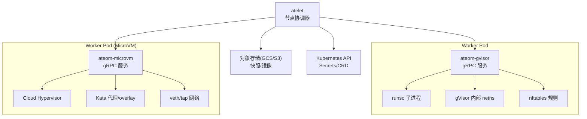

图表来源
- [cmd/ateom-gvisor/main.go:120-155](file://cmd/ateom-gvisor/main.go#L120-L155)
- [cmd/ateom-gvisor/runsc.go:35-103](file://cmd/ateom-gvisor/runsc.go#L35-L103)
- [cmd/ateom-microvm/main.go:120-154](file://cmd/ateom-microvm/main.go#L120-L154)
- [cmd/ateom-microvm/checkpoint.go:44-154](file://cmd/ateom-microvm/checkpoint.go#L44-L154)
- [cmd/ateom-microvm/restore.go:52-207](file://cmd/ateom-microvm/restore.go#L52-L207)
- [cmd/atelet/sandbox_assets.go:44-68](file://cmd/atelet/sandbox_assets.go#L44-L68)

章节来源
- [docs/architecture.md:308-341](file://docs/architecture.md#L308-L341)

## 核心组件
- ateom-gvisor
  - 职责：在 Pod 内创建 gVisor 内部 netns，建立 veth 对并将宿主机 eth0 与 gVisor 内部 eth0 连通；通过 runsc 执行 create/start/checkpoint/restore/delete/state/fscheckpoint；安装 nftables 规则实现 DNAT/Masquerade/Forward。
  - 关键流程：RunWorkload 先 setupActorNetwork，再创建并启动 pause 容器与应用容器，等待 readyz；CheckpointWorkload 支持 FULL/DATA 范围；RestoreWorkload 根据 scope 选择 fs-restore-image-path 或完整 restore。
- ateom-microvm
  - 职责：基于 Kata + Cloud Hypervisor，通过 CH API 完成 Pause -> Snapshot -> Shutdown；恢复时重建 overlay RO lower（virtio-fs）与 tap FD，使用 OnDemand 内存恢复并 Resume。
  - 关键流程：CheckpointWorkload 写入 base-id 与 snapshot 文件列表；RestoreWorkload 重写 config.json 中的 socket 路径，重建网络，LaunchVMM 并 RestoreWithNetFDs。
- atelet 侧资产与协议
  - 职责：按架构下载 sandbox 二进制（如 runsc），记录 sandboxAssetsRecord（含 snapshotFiles），并在 Checkpoint/Restore 中确保版本一致性。
  - 协议：WorkloadSpec、SandboxAssets、ArchAssets、AssetFile 等消息用于跨组件传递工作负载与运行时资产信息。

章节来源
- [cmd/ateom-gvisor/main.go:180-237](file://cmd/ateom-gvisor/main.go#L180-L237)
- [cmd/ateom-gvisor/main.go:239-307](file://cmd/ateom-gvisor/main.go#L239-L307)
- [cmd/ateom-gvisor/main.go:352-437](file://cmd/ateom-gvisor/main.go#L352-L437)
- [cmd/ateom-gvisor/runsc.go:105-208](file://cmd/ateom-gvisor/runsc.go#L105-L208)
- [cmd/ateom-microvm/checkpoint.go:44-154](file://cmd/ateom-microvm/checkpoint.go#L44-L154)
- [cmd/ateom-microvm/restore.go:52-207](file://cmd/ateom-microvm/restore.go#L52-L207)
- [cmd/atelet/sandbox_assets.go:44-68](file://cmd/atelet/sandbox_assets.go#L44-L68)
- [internal/proto/ateletpb/atelet.proto:42-75](file://internal/proto/ateletpb/atelet.proto#L42-L75)
- [internal/proto/ateletpb/atelet.pb.go:191-206](file://internal/proto/ateletpb/atelet.pb.go#L191-L206)

## 架构总览
ateom 作为 Worker Pod 内的“沙箱管家”，对外暴露统一的 gRPC 接口，对内对接不同运行时：
- gVisor 路径：通过 runsc 管理 pause 容器与应用容器，利用 gVisor 原生 checkpoint/restore 能力。
- MicroVM 路径：通过 Kata + Cloud Hypervisor 的 API 完成 VM 级快照与按需恢复。

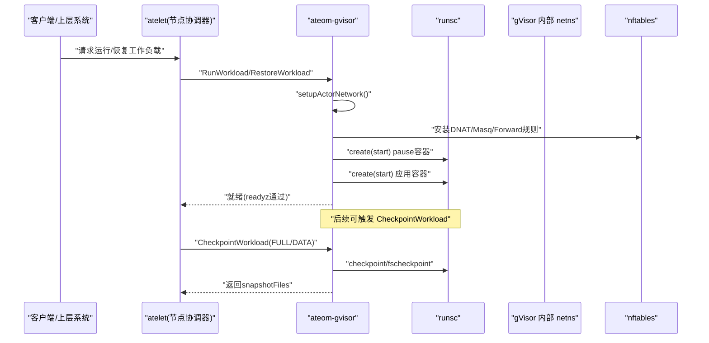

图表来源
- [cmd/ateom-gvisor/main.go:180-237](file://cmd/ateom-gvisor/main.go#L180-L237)
- [cmd/ateom-gvisor/main.go:239-307](file://cmd/ateom-gvisor/main.go#L239-L307)
- [cmd/ateom-gvisor/runsc.go:105-208](file://cmd/ateom-gvisor/runsc.go#L105-L208)

## 详细组件分析

### ateom-gvisor 组件分析
- 类与方法关系
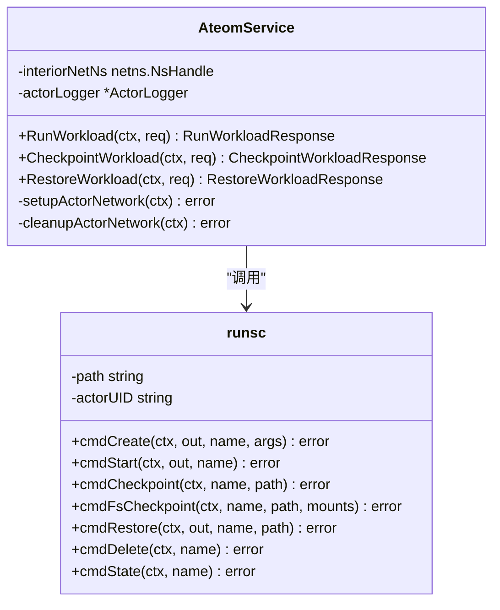

图表来源
- [cmd/ateom-gvisor/main.go:158-178](file://cmd/ateom-gvisor/main.go#L158-L178)
- [cmd/ateom-gvisor/runsc.go:30-71](file://cmd/ateom-gvisor/runsc.go#L30-L71)

- 网络命名空间共享与 pause 容器
  - ateom 在 Pod 内创建 interior netns，建立 veth 对，将 host 端地址与路由配置好，再将 peer 移入 interior netns 并重命名为 eth0，设置默认网关。
  - 安装 nftables 表，实现：
    - postrouting：对 actor 源地址做 Masquerade，使回包能回到 Pod IP。
    - prerouting：将发往 Pod IP 的 TCP/80 流量 DNAT 到 actor veth IP 的 80 端口。
    - forward：放行转发。
  - pause 容器作为 gVisor 沙箱根容器，所有应用容器与其共享 netns，便于统一网络管理与 checkpoint 根容器。

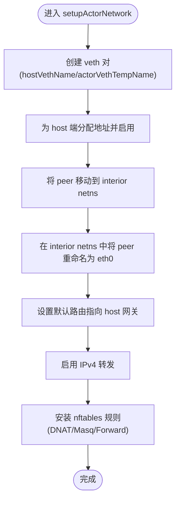

图表来源
- [cmd/ateom-gvisor/main.go:439-521](file://cmd/ateom-gvisor/main.go#L439-L521)
- [cmd/ateom-gvisor/main.go:523-576](file://cmd/ateom-gvisor/main.go#L523-L576)
- [cmd/ateom-gvisor/main.go:672-771](file://cmd/ateom-gvisor/main.go#L672-L771)

- 启动流程（RunWorkload）
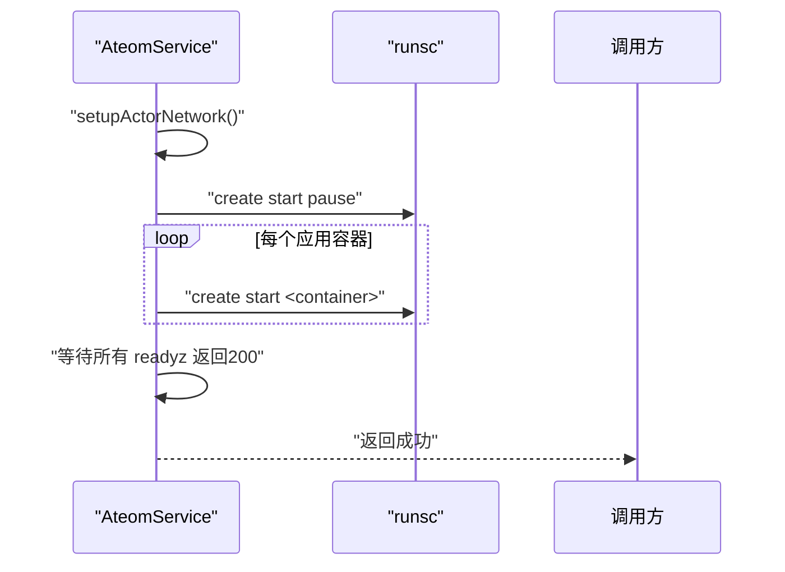

图表来源
- [cmd/ateom-gvisor/main.go:180-237](file://cmd/ateom-gvisor/main.go#L180-L237)

- 检查点与恢复（Checkpoint/Restore）
  - FULL 范围：对 pause 容器执行 checkpoint，随后删除各容器状态；恢复时对 pause 与每个应用容器执行 restore。
  - DATA 范围：仅对 pause 容器执行 fscheckpoint/fs-restore-image-path，适用于只持久化数据卷的场景。
  - 清理：在 checkpoint 后尝试 delete 所有容器，避免残留状态影响后续操作。

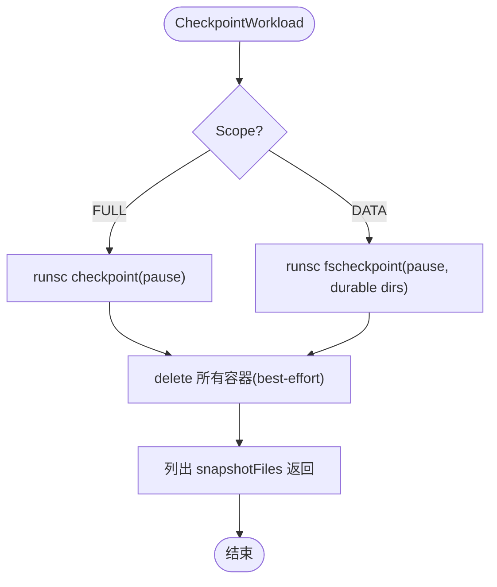

图表来源
- [cmd/ateom-gvisor/main.go:239-307](file://cmd/ateom-gvisor/main.go#L239-L307)
- [cmd/ateom-gvisor/runsc.go:105-172](file://cmd/ateom-gvisor/runsc.go#L105-L172)

章节来源
- [cmd/ateom-gvisor/main.go:180-237](file://cmd/ateom-gvisor/main.go#L180-L237)
- [cmd/ateom-gvisor/main.go:239-307](file://cmd/ateom-gvisor/main.go#L239-L307)
- [cmd/ateom-gvisor/main.go:352-437](file://cmd/ateom-gvisor/main.go#L352-L437)
- [cmd/ateom-gvisor/runsc.go:105-208](file://cmd/ateom-gvisor/runsc.go#L105-L208)

### ateom-microvm 组件分析
- 类与方法关系
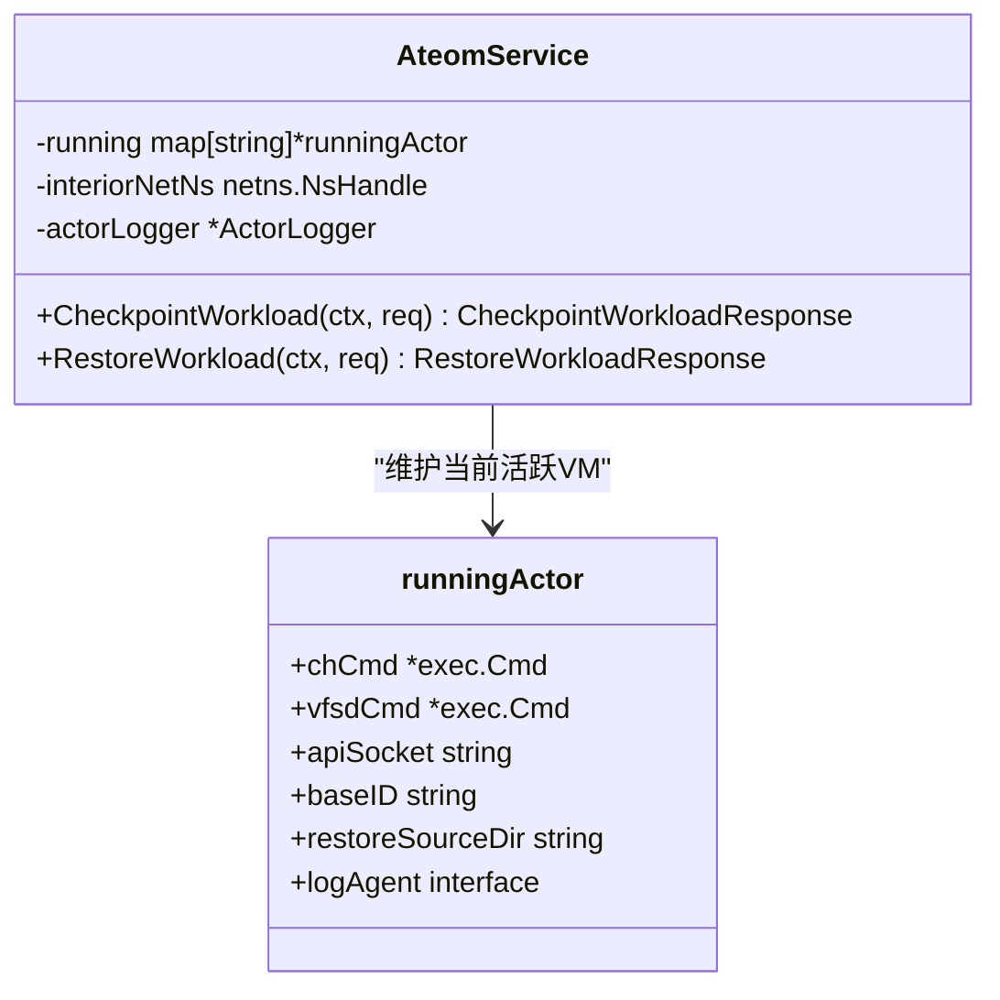

图表来源
- [cmd/ateom-microvm/main.go:184-226](file://cmd/ateom-microvm/main.go#L184-L226)

- 检查点（CheckpointWorkload）
  - 通过 CH API 暂停 VM，写入 checkpoint 目录（包含 config.json、state.json、memory-ranges、base-id）。
  - 若上次是 OnDemand 恢复，则合并 delta 到 base memory-ranges，生成完整快照。
  - 上报 snapshotFiles，然后 teardown 释放 VMM 与 virtiofsd 等资源。

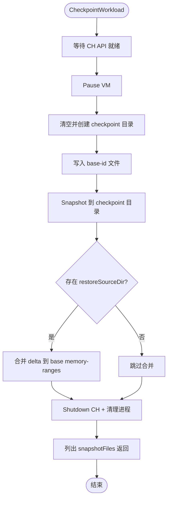

图表来源
- [cmd/ateom-microvm/checkpoint.go:44-154](file://cmd/ateom-microvm/checkpoint.go#L44-L154)

- 恢复（RestoreWorkload）
  - 重写 snapshot 的 config.json 中的 socket 路径（vsock、serial、virtiofsd）。
  - 重建 overlay RO lower（从本地 OCI bundle 解包）并启动 virtiofsd。
  - 重建 per-activation veth/tap，读取 snapshot 中的网络设备，构造 restoredNets。
  - LaunchVMM 并调用 RestoreWithNetFDs（OnDemand），Resume 后等待 readyz。

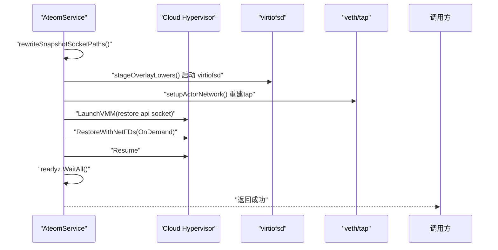

图表来源
- [cmd/ateom-microvm/restore.go:52-207](file://cmd/ateom-microvm/restore.go#L52-L207)

- OCI Spec 适配（spec.go）
  - 补齐 Linux.Resources、CgroupsPath，移除 CRI pause 相关注解，替换挂载集为 kata 兼容集合，设置 NetworkNamespace 指向 interior netns。

章节来源
- [cmd/ateom-microvm/main.go:184-226](file://cmd/ateom-microvm/main.go#L184-L226)
- [cmd/ateom-microvm/checkpoint.go:44-154](file://cmd/ateom-microvm/checkpoint.go#L44-L154)
- [cmd/ateom-microvm/restore.go:52-207](file://cmd/ateom-microvm/restore.go#L52-L207)
- [cmd/ateom-microvm/spec.go:29-107](file://cmd/ateom-microvm/spec.go#L29-L107)

### WorkloadSpec 构建与容器规格转换
- 控制面将 ActorTemplate 转换为 ateletpb.WorkloadSpec：
  - 复制 pauseImage、Volumes（仅处理 durable-dir 类型）、Containers（名称、镜像、命令、参数、VolumeMounts、Readyz）。
  - 可选地解析环境变量（SecretKeyRef），带缓存 TTL。
- 运行时资产（SandboxAssets）：
  - 按架构与名称映射（gVisor 期望 "runsc"，microvm 期望多个二进制），由 atelet 下载并校验 SHA256，记录 sandboxAssetsRecord，并在 checkpoint 时将 snapshotFiles 写入清单，保证 restore 可重现。

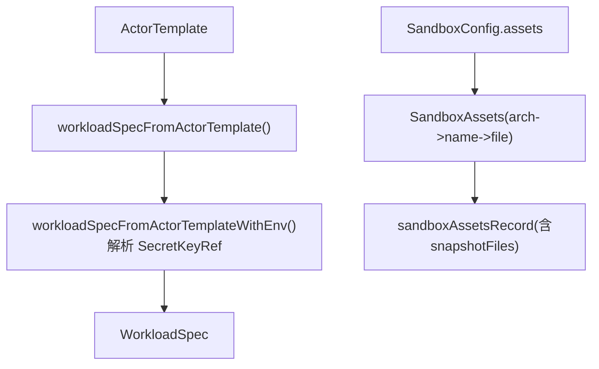

图表来源
- [cmd/ateapi/internal/controlapi/workload_spec.go:35-102](file://cmd/ateapi/internal/controlapi/workload_spec.go#L35-L102)
- [cmd/ateapi/internal/controlapi/workload_spec.go:127-184](file://cmd/ateapi/internal/controlapi/workload_spec.go#L127-L184)
- [pkg/api/v1alpha1/sandboxconfig_types.go:70-103](file://pkg/api/v1alpha1/sandboxconfig_types.go#L70-L103)
- [cmd/atelet/sandbox_assets.go:44-68](file://cmd/atelet/sandbox_assets.go#L44-L68)
- [internal/proto/ateletpb/atelet.proto:53-75](file://internal/proto/ateletpb/atelet.proto#L53-L75)

章节来源
- [cmd/ateapi/internal/controlapi/workload_spec.go:35-102](file://cmd/ateapi/internal/controlapi/workload_spec.go#L35-L102)
- [cmd/ateapi/internal/controlapi/workload_spec.go:127-184](file://cmd/ateapi/internal/controlapi/workload_spec.go#L127-L184)
- [pkg/api/v1alpha1/sandboxconfig_types.go:70-103](file://pkg/api/v1alpha1/sandboxconfig_types.go#L70-L103)
- [cmd/atelet/sandbox_assets.go:44-68](file://cmd/atelet/sandbox_assets.go#L44-L68)
- [internal/proto/ateletpb/atelet.proto:53-75](file://internal/proto/ateletpb/atelet.proto#L53-L75)

## 依赖关系分析
- ateom-gvisor 依赖：
  - netlink/netns/nftables：创建与管理网络命名空间与规则。
  - runsc 子进程：执行容器生命周期与快照。
  - actorlog/readyz：日志聚合与健康检查。
- ateom-microvm 依赖：
  - internal/ch：Cloud Hypervisor API 客户端（LaunchVMM、RestoreWithNetFDs、Snapshot、Pause、Resume、Shutdown）。
  - internal/kata：kata 路径与 socket 管理、清理逻辑。
  - reaper：子进程回收。
- atelet 依赖：
  - 对象存储（GCS/S3）：上传/下载快照与镜像。
  - Kubernetes API：拉取 Secrets、CRD。

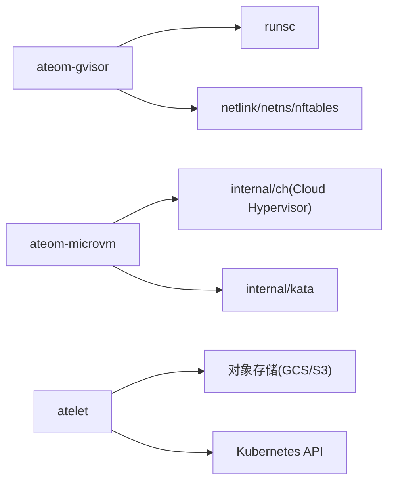

图表来源
- [cmd/ateom-gvisor/main.go:120-155](file://cmd/ateom-gvisor/main.go#L120-L155)
- [cmd/ateom-microvm/main.go:120-154](file://cmd/ateom-microvm/main.go#L120-L154)
- [cmd/atelet/sandbox_assets.go:44-68](file://cmd/atelet/sandbox_assets.go#L44-L68)

章节来源
- [cmd/ateom-gvisor/main.go:120-155](file://cmd/ateom-gvisor/main.go#L120-L155)
- [cmd/ateom-microvm/main.go:120-154](file://cmd/ateom-microvm/main.go#L120-L154)
- [cmd/atelet/sandbox_assets.go:44-68](file://cmd/atelet/sandbox_assets.go#L44-L68)

## 性能考量
- gVisor 路径
  - 使用 pause 容器作为沙箱根，减少多容器同步开销；checkpoint 仅对 pause 执行，降低整体快照时间。
  - 网络采用 veth + nftables，轻量且幂等清理，避免频繁切换宿主网络。
- MicroVM 路径
  - OnDemand 内存恢复显著降低恢复延迟（约 75ms vs 全量 eager），并保持 memfd SPARSE，避免下次 suspend 的全量扫描。
  - 合并 delta 到 base memory-ranges，确保快照自包含，提高可移植性与可重复性。
- 通用优化
  - 资产下载与校验（SHA256）避免重复拉取与损坏风险。
  - 环境变量 Secret 读取带 TTL 缓存，降低控制面压力。

[本节为通用指导，不直接分析具体文件]

## 故障排查指南
- gVisor 网络问题
  - 现象：无法访问外部或 Pod 间通信异常。
  - 排查：确认 nftables 表是否安装成功，检查 host 与 interior netns 的 veth 对是否存在，验证 IPv4 转发是否开启。
  - 参考：installActorNftablesRules、enableIPv4Forwarding、setupActorNetwork。
- gVisor 快照失败
  - 现象：checkpoint 报错或 snapshotFiles 为空。
  - 排查：确认 runsc 版本与参数（start 需 --allow-connected-on-save），检查 pause 容器状态，查看 fscheckpoint 的参数是否正确。
  - 参考：cmdCheckpoint、cmdFsCheckpoint、cleanupContainersAfterCheckpoint。
- MicroVM 恢复失败
  - 现象：RestoreWithNetFDs 或 Resume 失败。
  - 排查：确认 snapshot 的 config.json 路径重写正确，tap FD 数量与队列数匹配，virtiofsd 已启动且 socket 可达。
  - 参考：rewriteSnapshotSocketPaths、setupRestoreTap、RestoreWithNetFDs。
- 日志与追踪
  - 两者均集成 OpenTelemetry 与结构化日志，可通过 pod stdout 与 trace 定位问题。

章节来源
- [cmd/ateom-gvisor/main.go:672-771](file://cmd/ateom-gvisor/main.go#L672-L771)
- [cmd/ateom-gvisor/main.go:661-670](file://cmd/ateom-gvisor/main.go#L661-L670)
- [cmd/ateom-gvisor/runsc.go:105-172](file://cmd/ateom-gvisor/runsc.go#L105-L172)
- [cmd/ateom-microvm/restore.go:209-254](file://cmd/ateom-microvm/restore.go#L209-L254)

## 结论
ateom 通过统一的 gRPC 接口屏蔽了 gVisor 与 MicroVM 的差异，提供了高并发、低延迟的“暂停/恢复”能力。gVisor 路径适合快速启动与轻量隔离，MicroVM 路径提供更强的隔离与完整的 VM 快照。结合 atelet 的资产与快照管理，系统在跨节点迁移、弹性伸缩与资源复用方面具备良好表现。未来可在网络策略精细化、身份注入与零信任路由等方面继续增强。

[本节为总结，不直接分析具体文件]

## 附录

### 安全边界与权限控制
- 深度防御模型：
  - 沙箱执行：gVisor 或 micro-VM 提供强隔离，防止逃逸。
  - 身份与授权：基于统一 DNS 路由提取与校验 actor 标识，mTLS 保障内部通信。
  - 网络策略：默认拒绝，按需要开放；结合 Kubernetes NetworkPolicy 限制 WorkerPool 边界。
- 威胁缓解要点：
  - 阻止 actor 访问宿主机元数据与集群 API。
  - 快照完整性校验与签名，防止篡改。
  - 最小权限原则与资源配额，防止 DoS 与横向移动。

章节来源
- [docs/architecture.md:466-494](file://docs/architecture.md#L466-L494)
- [docs/threat-model.md:72-117](file://docs/threat-model.md#L72-L117)
