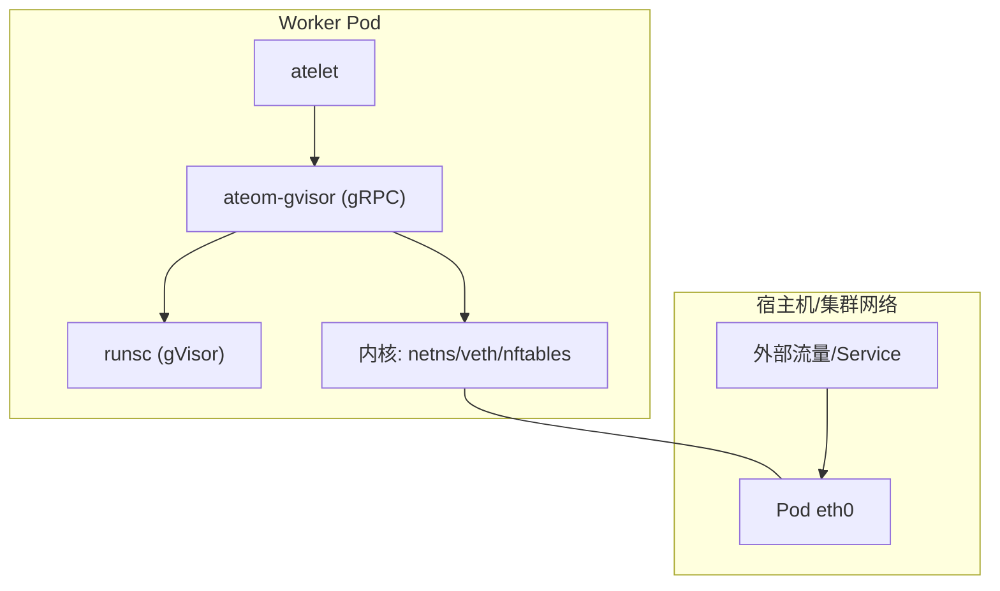
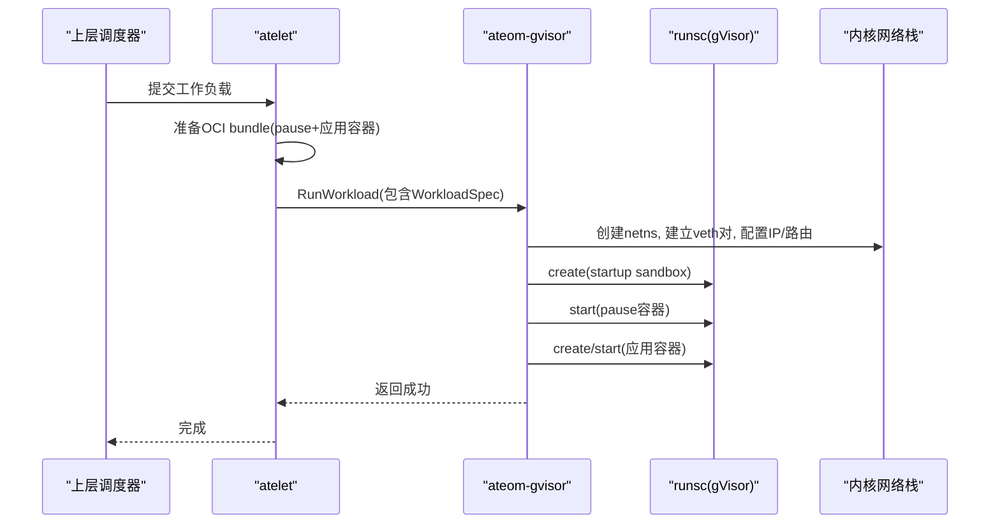
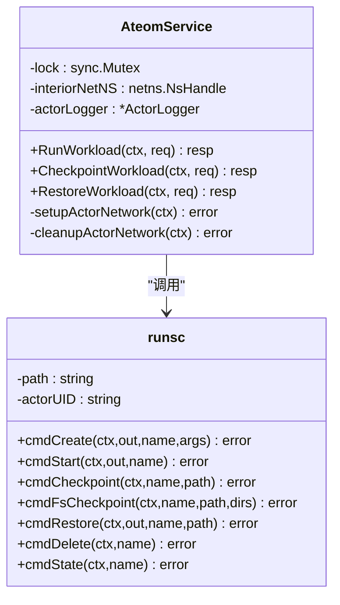
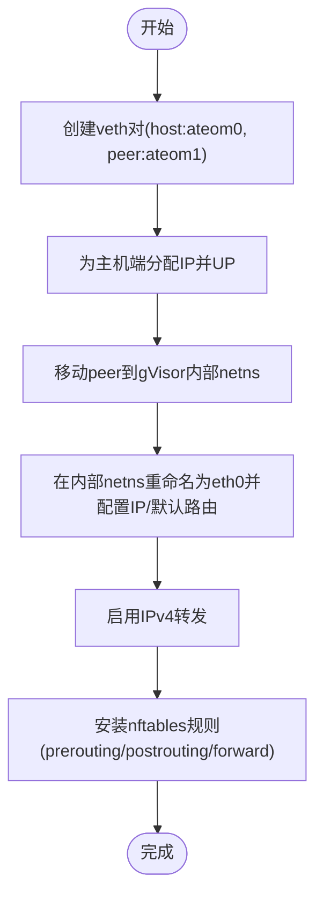
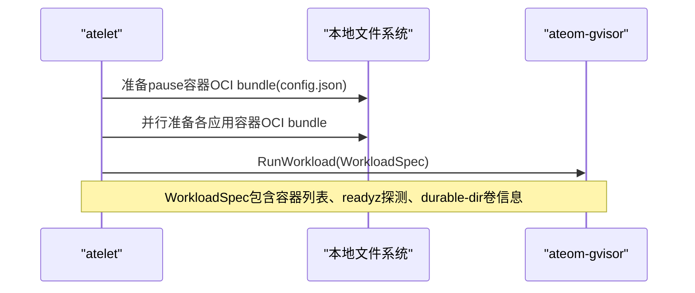
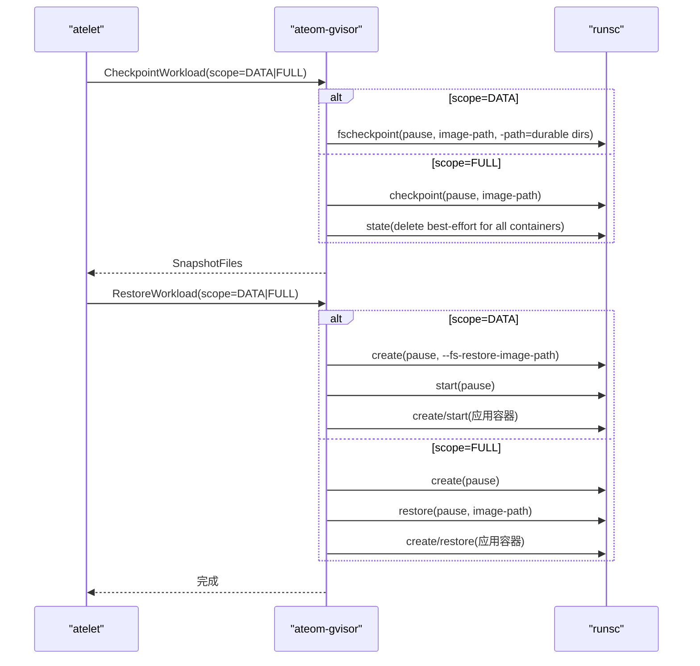
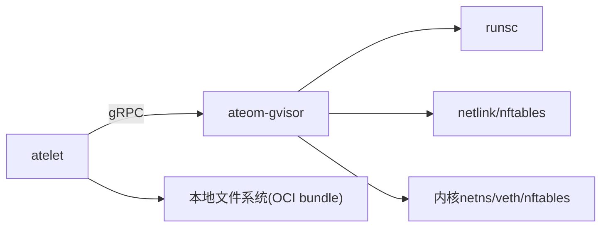
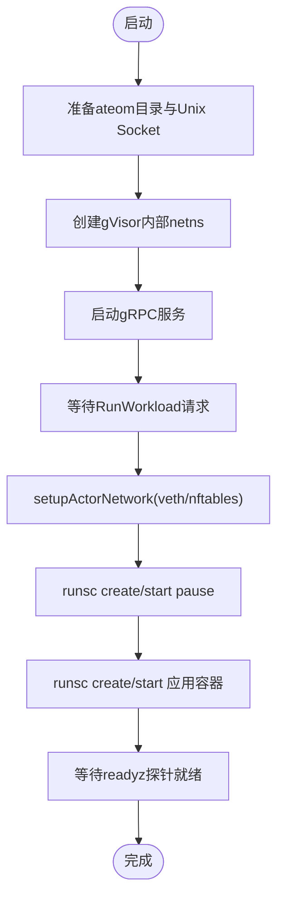
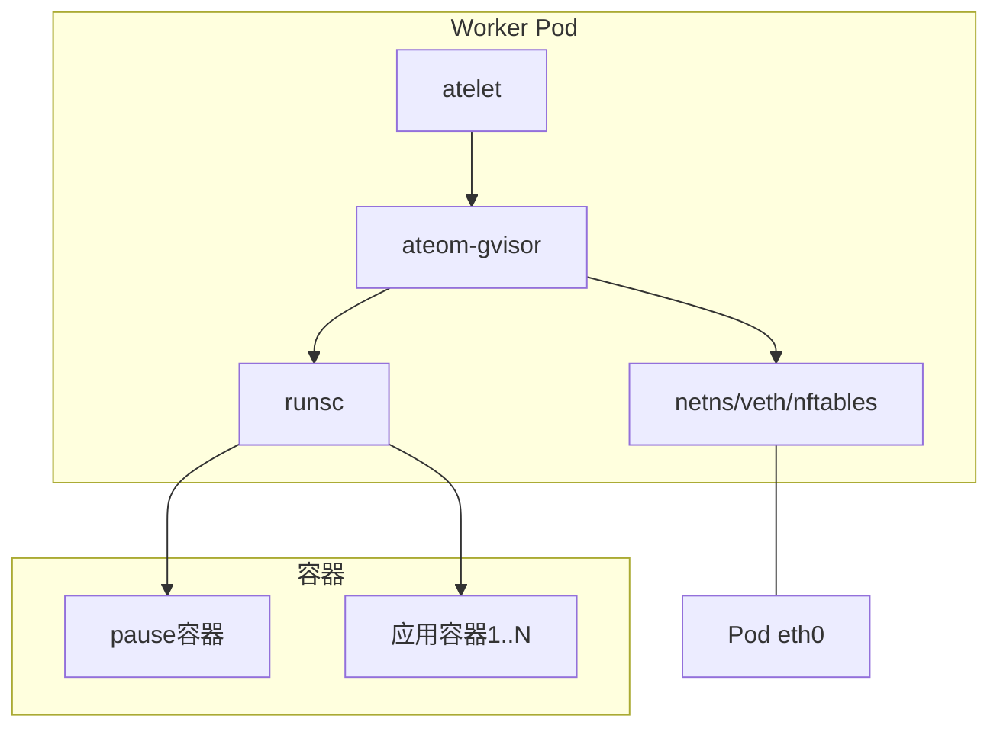

# gVisor运行时实现

<cite>
**本文引用的文件**   
- [cmd/ateom-gvisor/main.go](file://cmd/ateom-gvisor/main.go)
- [cmd/ateom-gvisor/runsc.go](file://cmd/ateom-gvisor/runsc.go)
- [cmd/atelet/main.go](file://cmd/atelet/main.go)
- [cmd/atelet/oci.go](file://cmd/atelet/oci.go)
- [internal/proto/ateompb/ateom.pb.go](file://internal/proto/ateompb/ateom.pb.go)
- [internal/proto/ateletpb/atelet.pb.go](file://internal/proto/ateletpb/atelet.pb.go)
- [internal/proto/ateompb/ateom_grpc.pb.go](file://internal/proto/ateompb/ateom_grpc.pb.go)
</cite>

## 目录
1. [简介](#简介)
2. [项目结构](#项目结构)
3. [核心组件](#核心组件)
4. [架构总览](#架构总览)
5. [详细组件分析](#详细组件分析)
6. [依赖关系分析](#依赖关系分析)
7. [性能考量](#性能考量)
8. [故障排查指南](#故障排查指南)
9. [结论](#结论)
10. [附录](#附录)

## 简介
本文件系统性梳理 ateom-gvisor 作为 gVisor 轻量级虚拟化运行时的实现，重点覆盖以下方面：
- runsc 命令封装与容器生命周期管理（创建、启动、检查点、恢复、删除）
- 网络命名空间隔离策略（veth 对、nftables 规则、默认路由）
- WorkloadSpec 构建过程与 OCI bundle 配置（pause 容器与应用容器）
- Checkpoint/Restore 的底层流程（内存快照、文件系统状态持久化与恢复）
- Pause 容器的作用与网络隔离策略
- 安全边界与权限控制（最小能力集、只读挂载、资源限制）
- gVisor 启动流程图与运行时架构图

## 项目结构
与 gVisor 运行时直接相关的代码主要分布在两个子模块：
- ateom-gvisor：gRPC 服务，负责编排 runsc 子进程、管理网络命名空间、安装 nftables 规则、等待就绪探针。
- atelet：负责准备 OCI bundle（含 pause 与应用容器）、拉取镜像、生成 spec、通过 gRPC 调用 ateom-gvisor 执行生命周期操作。

图表来源
- [cmd/ateom-gvisor/main.go:125-155](file://cmd/ateom-gvisor/main.go#L125-L155)
- [cmd/atelet/main.go:755-833](file://cmd/atelet/main.go#L755-L833)

章节来源
- [cmd/ateom-gvisor/main.go:72-155](file://cmd/ateom-gvisor/main.go#L72-L155)
- [cmd/atelet/main.go:670-753](file://cmd/atelet/main.go#L670-L753)

## 核心组件
- AteomService：暴露 RunWorkload、CheckpointWorkload、RestoreWorkload 三个 RPC，串行化执行，避免并发驱动 runsc 导致的状态竞争。
- runsc 封装：统一组装 runsc 子命令参数（create/start/checkpoint/fscheckpoint/restore/delete/state），并复用根目录与 PID 文件路径。
- 网络初始化：在 worker pod 与 gVisor 内部 netns 之间建立 veth 对，配置地址与默认路由，启用 IPv4 转发，安装 nftables NAT/转发规则。
- OCI bundle 准备：由 atelet 为 pause 与应用容器生成 config.json，设置命名空间、挂载、能力集、RLimit 等。

章节来源
- [cmd/ateom-gvisor/main.go:158-178](file://cmd/ateom-gvisor/main.go#L158-L178)
- [cmd/ateom-gvisor/runsc.go:30-71](file://cmd/ateom-gvisor/runsc.go#L30-L71)
- [cmd/atelet/oci.go:177-299](file://cmd/atelet/oci.go#L177-L299)

## 架构总览
整体运行时采用“控制面 + 数据面”分离：
- 控制面（atelet）：解析工作负载描述，准备 OCI bundle，下发 runsc 指令。
- 数据面（ateom-gvisor + runsc）：在独立网络命名空间中启动 gVisor 沙箱，提供网络连通性与可检查点能力。

图表来源
- [cmd/atelet/main.go:677-753](file://cmd/atelet/main.go#L677-L753)
- [cmd/ateom-gvisor/main.go:180-237](file://cmd/ateom-gvisor/main.go#L180-L237)
- [cmd/ateom-gvisor/main.go:439-521](file://cmd/ateom-gvisor/main.go#L439-L521)

## 详细组件分析

### AteomService 与 runsc 封装
- AteomService 持有 interiorNetNS 句柄与日志器，所有涉及 runsc 的 RPC 使用互斥锁串行执行，确保同一时刻仅一个 runsc 生命周期操作在进行。
- runsc 封装将 runsc 子命令的参数标准化，包括日志格式、root 目录、bundle 路径、pid 文件、以及 checkpoint/restore 所需的路径与标志位。

图表来源
- [cmd/ateom-gvisor/main.go:158-178](file://cmd/ateom-gvisor/main.go#L158-L178)
- [cmd/ateom-gvisor/runsc.go:30-71](file://cmd/ateom-gvisor/runsc.go#L30-L71)

章节来源
- [cmd/ateom-gvisor/main.go:180-237](file://cmd/ateom-gvisor/main.go#L180-L237)
- [cmd/ateom-gvisor/runsc.go:35-103](file://cmd/ateom-gvisor/runsc.go#L35-L103)

### 网络命名空间隔离与 veth/nftables
- 在 worker pod 中创建名为 ateom0 的 veth 一端，另一端移动到 gVisor 内部 netns 并重命名为 eth0。
- 在内部 netns 中配置 lo、eth0 地址与默认路由指向 worker 侧网关。
- 启用 IPv4 转发，并通过 nftables 表进行 DNAT/Masquerade/Forward 策略：
  - prerouting：将发往 worker Pod IP 的 TCP/80 流量 DNAT 到 actor veth IP 的 TCP/80
  - postrouting：将来自 actor veth IP 的出站流量 Masquerade 为 Pod IP
  - forward：放行转发

图表来源
- [cmd/ateom-gvisor/main.go:439-521](file://cmd/ateom-gvisor/main.go#L439-L521)
- [cmd/ateom-gvisor/main.go:523-576](file://cmd/ateom-gvisor/main.go#L523-L576)
- [cmd/ateom-gvisor/main.go:672-771](file://cmd/ateom-gvisor/main.go#L672-L771)

章节来源
- [cmd/ateom-gvisor/main.go:439-521](file://cmd/ateom-gvisor/main.go#L439-L521)
- [cmd/ateom-gvisor/main.go:523-576](file://cmd/ateom-gvisor/main.go#L523-L576)
- [cmd/ateom-gvisor/main.go:672-771](file://cmd/ateom-gvisor/main.go#L672-L771)

### WorkloadSpec 构建与 OCI bundle 配置
- atelet 根据 ActorTemplate 与用户输入构建 WorkloadSpec，并为 pause 容器与应用容器分别准备 OCI bundle。
- pause 容器被标记为 sandbox，且会携带 durable-dir 卷注解，以便 gVisor 识别共享持久卷。
- 应用容器指定 network namespace 路径（指向 ateom 创建的 netns），并可选择挂载身份目录与持久卷。
- OCI spec 设置最小能力集（审计写、终止进程、绑定低端口）、RLIMIT_NOFILE、只读 sysfs 等，以收敛攻击面。

图表来源
- [cmd/atelet/main.go:677-753](file://cmd/atelet/main.go#L677-L753)
- [cmd/atelet/oci.go:100-116](file://cmd/atelet/oci.go#L100-L116)
- [cmd/atelet/oci.go:177-299](file://cmd/atelet/oci.go#L177-L299)

章节来源
- [cmd/atelet/main.go:677-753](file://cmd/atelet/main.go#L677-L753)
- [cmd/atelet/oci.go:177-299](file://cmd/atelet/oci.go#L177-L299)

### Checkpoint 与 Restore 流程
- Checkpoint：
  - DATA 范围：仅对 pause 容器执行 fscheckpoint，持久化 durable-dir 卷；要求至少存在一个 durable-dir 卷。
  - FULL 范围：对 pause 容器执行完整 checkpoint（内存+文件系统），随后尝试清理应用容器与 pause 容器（best-effort）。
  - 列出 snapshot 文件清单供 atelet 上传至对象存储。
- Restore：
  - DATA 范围：创建并启动 pause 容器，传入 fs-restore-image-path 以恢复持久卷。
  - FULL 范围：创建 pause 容器后执行 restore，再创建并恢复每个应用容器。
  - 完成后等待所有 readyz 探针就绪。

图表来源
- [cmd/ateom-gvisor/main.go:239-307](file://cmd/ateom-gvisor/main.go#L239-L307)
- [cmd/ateom-gvisor/main.go:352-437](file://cmd/ateom-gvisor/main.go#L352-L437)
- [cmd/ateom-gvisor/runsc.go:105-208](file://cmd/ateom-gvisor/runsc.go#L105-L208)

章节来源
- [cmd/ateom-gvisor/main.go:239-307](file://cmd/ateom-gvisor/main.go#L239-L307)
- [cmd/ateom-gvisor/main.go:352-437](file://cmd/ateom-gvisor/main.go#L352-L437)
- [cmd/ateom-gvisor/runsc.go:105-208](file://cmd/ateom-gvisor/runsc.go#L105-L208)

### Pause 容器的作用与网络隔离策略
- Pause 容器作为沙箱根容器，承载网络命名空间与持久卷共享语义，便于 checkpoint/restore 时以单一入口捕获一致状态。
- 网络隔离通过 veth 对与 nftables 规则实现：
  - 入站：DNAT 到 actor veth IP
  - 出站：Masquerade 为 Pod IP
  - 转发：允许转发
- 该策略是兼容桥接方案，后续将由 AgentGateway 替换为更严格的透明捕获与默认拒绝策略。

章节来源
- [cmd/ateom-gvisor/main.go:439-521](file://cmd/ateom-gvisor/main.go#L439-L521)
- [cmd/ateom-gvisor/main.go:672-771](file://cmd/ateom-gvisor/main.go#L672-L771)

### 安全边界与权限控制
- 能力集最小化：仅授予 CAP_AUDIT_WRITE、CAP_KILL、CAP_NET_BIND_SERVICE。
- 只读系统视图：sysfs 以只读方式挂载，减少内核态写入面。
- 资源限制：设置 RLIMIT_NOFILE 上限。
- 命名空间隔离：PID、IPC、UTS、Mount、Network 均隔离，网络命名空间由 ateom 显式创建并注入。
- 身份与卷挂载：可选只读身份目录挂载；持久卷通过 bind 挂载并在 checkpoint 时纳入快照。

章节来源
- [cmd/atelet/oci.go:177-299](file://cmd/atelet/oci.go#L177-L299)

## 依赖关系分析
- atelet 通过 gRPC 连接 ateom-gvisor，调用 Run/Checkpoint/Restore。
- ateom-gvisor 通过 exec 调用 runsc 二进制，并使用 netlink/nftables 库操作内核网络栈。
- protobuf 定义定义了 ateom 与 ateletpb 的消息类型，用于跨进程传递 WorkloadSpec 与响应。

图表来源
- [internal/proto/ateompb/ateom_grpc.pb.go:236-255](file://internal/proto/ateompb/ateom_grpc.pb.go#L236-L255)
- [cmd/atelet/main.go:755-833](file://cmd/atelet/main.go#L755-L833)
- [cmd/ateom-gvisor/main.go:125-155](file://cmd/ateom-gvisor/main.go#L125-L155)

章节来源
- [internal/proto/ateompb/ateom_grpc.pb.go:236-255](file://internal/proto/ateompb/ateom_grpc.pb.go#L236-L255)
- [cmd/atelet/main.go:755-833](file://cmd/atelet/main.go#L755-L833)
- [cmd/ateom-gvisor/main.go:125-155](file://cmd/ateom-gvisor/main.go#L125-L155)

## 性能考量
- 串行化：AteomService 对 runsc 相关 RPC 加锁，避免并发导致的竞态，但可能成为吞吐瓶颈。若需提升并发，应评估 runsc 多实例安全性与资源隔离。
- 网络 I/O：当前使用 masquerade/DNAT 的兼容性路径，后续建议引入透明捕获与默认拒绝策略以降低额外开销。
- 快照体积：FULL 快照包含内存页与文件系统增量，体积较大；DATA 快照仅持久卷，适合频繁落盘场景。
- 就绪探针：等待所有容器 readyz 成功后才返回，有助于降低冷启动抖动带来的请求失败率。

[本节为通用指导，不直接分析具体文件]

## 故障排查指南
- 网络问题
  - 检查 veth 对是否存在、是否已正确移动到内部 netns，确认地址与默认路由是否正确。
  - 查看 nftables 表是否按预期安装，必要时删除重建。
  - 确认 worker pod 的 IPv4 转发已开启。
- 启动失败
  - 核对 OCI bundle 路径与 config.json 是否有效，确认 pause 与应用容器 bundle 均已准备。
  - 检查 runsc 二进制路径与 root 目录权限。
- 快照/恢复异常
  - DATA 快照需要至少一个 durable-dir 卷；FULL 快照需确保 checkpoint 目录可写且磁盘空间充足。
  - 恢复后若应用未就绪，检查 readyz 探针配置与端口可达性。

章节来源
- [cmd/ateom-gvisor/main.go:439-521](file://cmd/ateom-gvisor/main.go#L439-L521)
- [cmd/ateom-gvisor/main.go:672-771](file://cmd/ateom-gvisor/main.go#L672-L771)
- [cmd/ateom-gvisor/main.go:239-307](file://cmd/ateom-gvisor/main.go#L239-L307)
- [cmd/ateom-gvisor/main.go:352-437](file://cmd/ateom-gvisor/main.go#L352-L437)

## 结论
ateom-gvisor 通过简洁的 gRPC 接口与 runsc 封装，实现了基于 gVisor 的轻量级沙箱运行时。其关键特性包括：
- 明确的网络隔离与可控的入出站策略
- 支持 DATA/FULL 两种范围的快照与恢复
- 最小权限与安全加固的 OCI spec
- 与 atelet 协作的端到端工作流

未来可在网络策略精细化、并发模型优化与快照压缩等方面持续改进。

[本节为总结，不直接分析具体文件]

## 附录

### gVisor 启动流程图

图表来源
- [cmd/ateom-gvisor/main.go:72-155](file://cmd/ateom-gvisor/main.go#L72-L155)
- [cmd/ateom-gvisor/main.go:180-237](file://cmd/ateom-gvisor/main.go#L180-L237)
- [cmd/ateom-gvisor/main.go:439-521](file://cmd/ateom-gvisor/main.go#L439-L521)

### 运行时架构图

图表来源
- [cmd/atelet/main.go:677-753](file://cmd/atelet/main.go#L677-L753)
- [cmd/ateom-gvisor/main.go:180-237](file://cmd/ateom-gvisor/main.go#L180-L237)
- [cmd/ateom-gvisor/main.go:439-521](file://cmd/ateom-gvisor/main.go#L439-L521)
