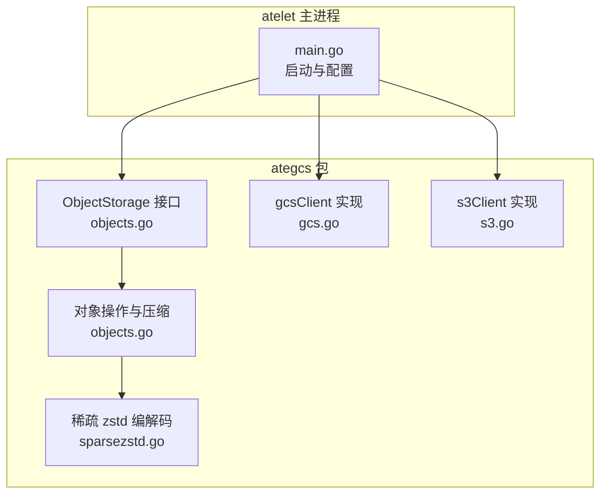
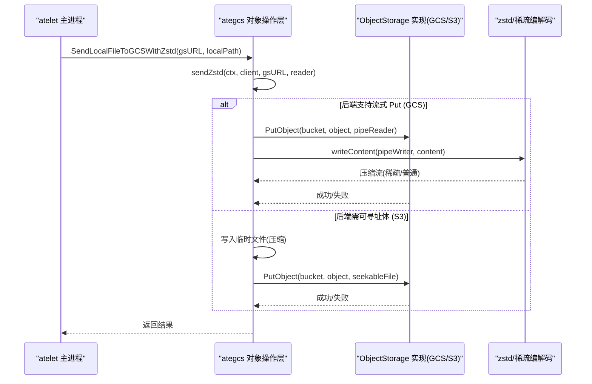
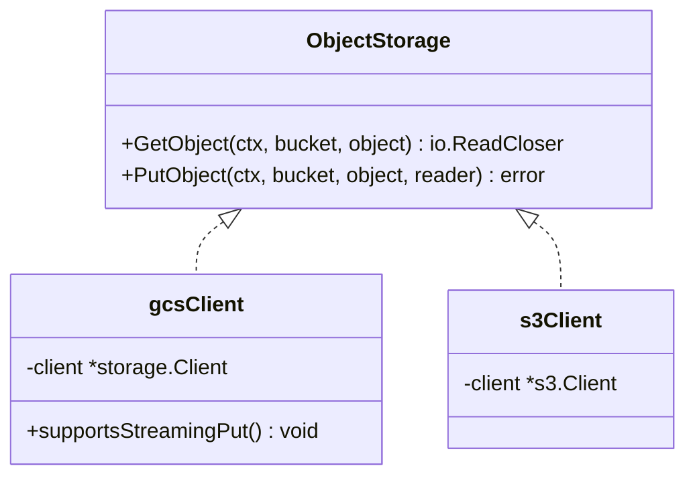
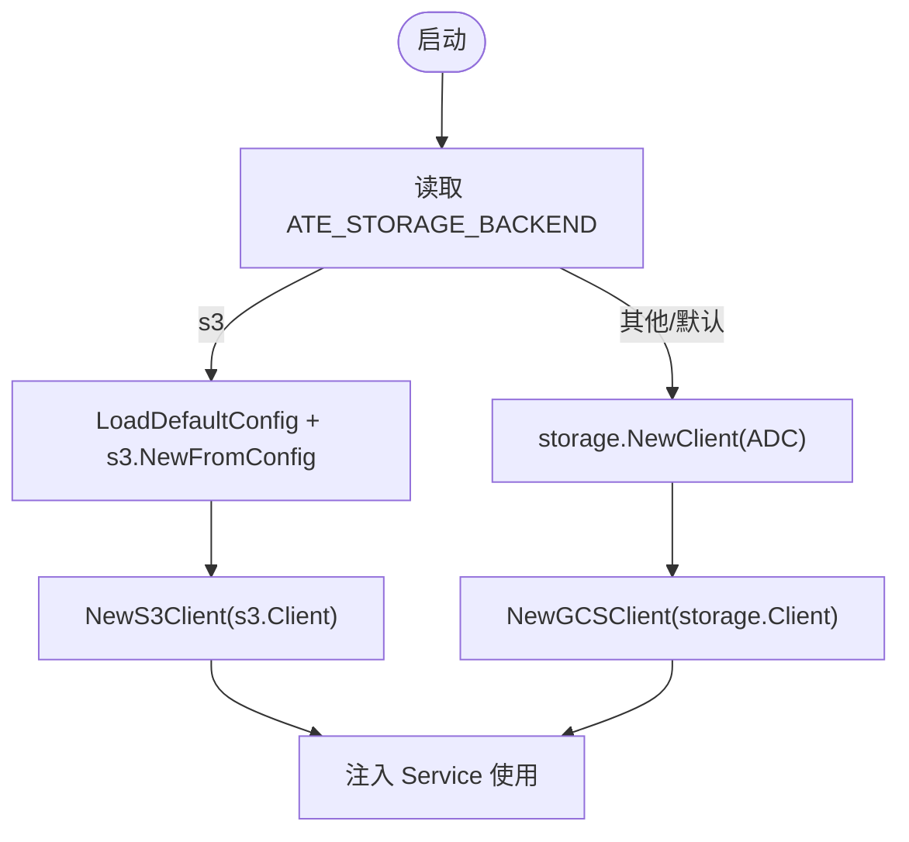
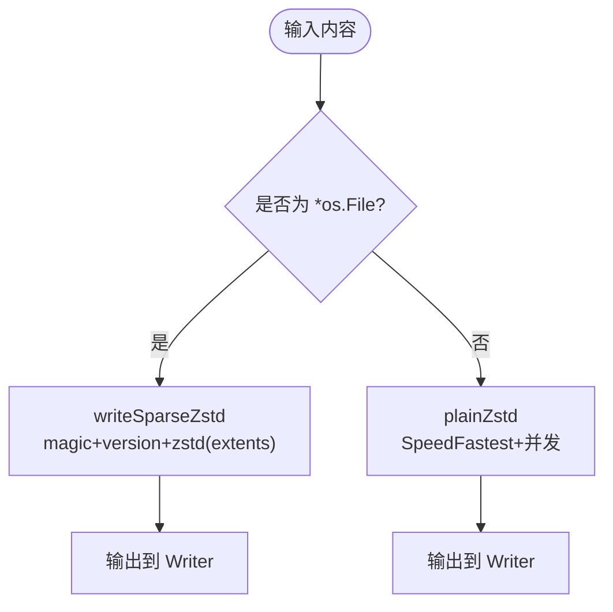
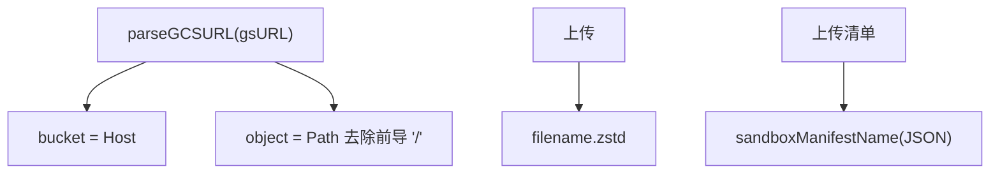
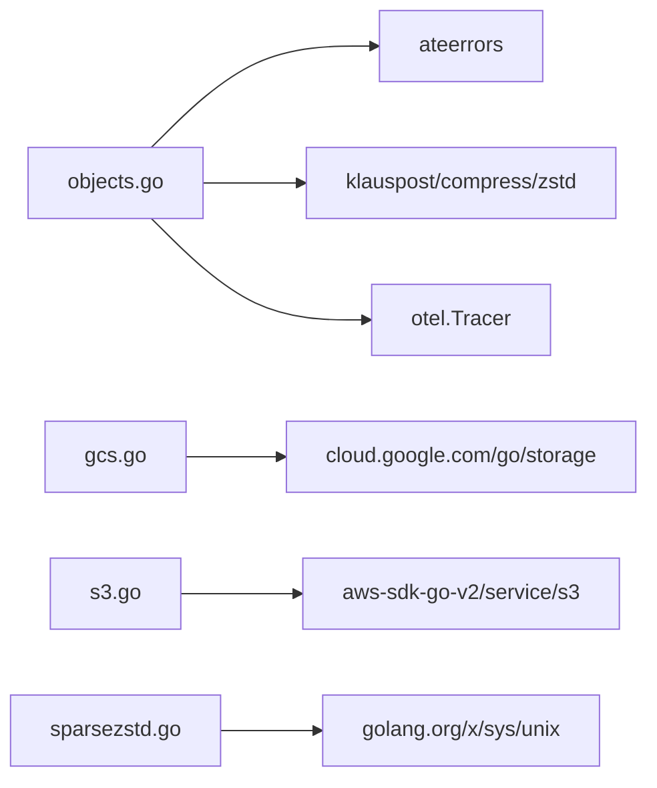

# 存储移动器

<cite>
**本文引用的文件**   
- [gcs.go](file://cmd/atelet/internal/ategcs/gcs.go)
- [s3.go](file://cmd/atelet/internal/ategcs/s3.go)
- [objects.go](file://cmd/atelet/internal/ategcs/objects.go)
- [sparsezstd.go](file://cmd/atelet/internal/ategcs/sparsezstd.go)
- [main.go](file://cmd/atelet/main.go)
</cite>

## 目录
1. [简介](#简介)
2. [项目结构](#项目结构)
3. [核心组件](#核心组件)
4. [架构总览](#架构总览)
5. [详细组件分析](#详细组件分析)
6. [依赖关系分析](#依赖关系分析)
7. [性能考量](#性能考量)
8. [故障排查指南](#故障排查指南)
9. [结论](#结论)
10. [附录](#附录)

## 简介
本文件围绕 ategcs 包（存储移动器）进行系统化文档化，重点解释 ObjectStorage 抽象接口与多后端统一实现、GCS/S3 客户端初始化与认证、zstd 压缩传输（含稀疏格式）、对象路径组织与命名约定、快照元数据管理与版本控制、错误处理与重试策略、超时与连接池管理、以及整体操作流程与一致性保证。

## 项目结构
ategcs 包位于 atelet 子进程内部，提供统一的对象存储访问能力，并封装 zstd 压缩与稀疏块格式，用于快照的上传与下载。

图表来源
- [main.go:126-161](file://cmd/atelet/main.go#L126-L161)
- [objects.go:37-40](file://cmd/atelet/internal/ategcs/objects.go#L37-L40)
- [gcs.go:27-33](file://cmd/atelet/internal/ategcs/gcs.go#L27-L33)
- [s3.go:29-35](file://cmd/atelet/internal/ategcs/s3.go#L29-L35)
- [objects.go:141-154](file://cmd/atelet/internal/ategcs/objects.go#L141-L154)
- [sparsezstd.go:63-135](file://cmd/atelet/internal/ategcs/sparsezstd.go#L63-L135)

章节来源
- [main.go:126-161](file://cmd/atelet/main.go#L126-L161)
- [objects.go:37-40](file://cmd/atelet/internal/ategcs/objects.go#L37-L40)
- [gcs.go:27-33](file://cmd/atelet/internal/ategcs/gcs.go#L27-L33)
- [s3.go:29-35](file://cmd/atelet/internal/ategcs/s3.go#L29-L35)
- [objects.go:141-154](file://cmd/atelet/internal/ategcs/objects.go#L141-L154)
- [sparsezstd.go:63-135](file://cmd/atelet/internal/ategcs/sparsezstd.go#L63-L135)

## 核心组件
- ObjectStorage 接口：定义 GetObject/PutObject 两个方法，屏蔽底层 GCS/S3 差异。
- gcsClient：基于 cloud.google.com/go/storage 的 GCS 客户端实现，支持流式 Put（无缓冲直传）。
- s3Client：基于 aws-sdk-go-v2/service/s3 的 S3 客户端实现，Put 需要可寻址体（由上层缓冲到临时文件）。
- 对象操作层：提供 Open/FetchFromGCS/SendBytesToGCS/SendLocalFileToGCSWithZstd/FetchLocalFileFromGCSWithZstd 等高层 API，自动选择流式或缓冲上传路径，并处理 zstd 压缩与稀疏格式。
- 稀疏 zstd 编解码：自定义“ATESPRSE”头 + 版本号的稀疏块格式，仅压缩非零区域，提升大镜像压缩/解压效率。

章节来源
- [objects.go:37-40](file://cmd/atelet/internal/ategcs/objects.go#L37-L40)
- [gcs.go:27-33](file://cmd/atelet/internal/ategcs/gcs.go#L27-L33)
- [s3.go:29-35](file://cmd/atelet/internal/ategcs/s3.go#L29-L35)
- [objects.go:141-154](file://cmd/atelet/internal/ategcs/objects.go#L141-L154)
- [sparsezstd.go:29-46](file://cmd/atelet/internal/ategcs/sparsezstd.go#L29-L46)

## 架构总览
ategcs 通过 ObjectStorage 抽象将 GCS/S3 统一为一致的读写语义；上层业务（atelet 主进程）根据环境变量选择后端，并在 Checkpoint/Restore 流程中调用压缩传输 API。

图表来源
- [objects.go:95-118](file://cmd/atelet/internal/ategcs/objects.go#L95-L118)
- [objects.go:171-181](file://cmd/atelet/internal/ategcs/objects.go#L171-L181)
- [objects.go:186-212](file://cmd/atelet/internal/ategcs/objects.go#L186-L212)
- [objects.go:219-251](file://cmd/atelet/internal/ategcs/objects.go#L219-L251)
- [gcs.go:55-66](file://cmd/atelet/internal/ategcs/gcs.go#L55-L66)
- [s3.go:51-58](file://cmd/atelet/internal/ategcs/s3.go#L51-L58)

## 详细组件分析

### ObjectStorage 接口与统一实现
- 接口定义：GetObject/PutObject 分别对应读取与写入对象，返回 io.ReadCloser 与错误。
- GCS 实现：NewGCSClient 包装 storage.Client；GetObject 对缺失桶/对象映射为特定错误码；PutObject 使用 NewWriter 直接写入，支持流式上传。
- S3 实现：NewS3Client 包装 s3.Client；GetObject 对 NoSuchKey 映射为特定错误码；PutObject 接受 io.Reader，但上层需确保可寻址体。

图表来源
- [objects.go:37-40](file://cmd/atelet/internal/ategcs/objects.go#L37-L40)
- [gcs.go:27-33](file://cmd/atelet/internal/ategcs/gcs.go#L27-L33)
- [s3.go:29-35](file://cmd/atelet/internal/ategcs/s3.go#L29-L35)

章节来源
- [objects.go:37-40](file://cmd/atelet/internal/ategcs/objects.go#L37-L40)
- [gcs.go:35-44](file://cmd/atelet/internal/ategcs/gcs.go#L35-L44)
- [gcs.go:55-66](file://cmd/atelet/internal/ategcs/gcs.go#L55-L66)
- [s3.go:37-49](file://cmd/atelet/internal/ategcs/s3.go#L37-L49)
- [s3.go:51-58](file://cmd/atelet/internal/ategcs/s3.go#L51-L58)

### GCS 与 S3 客户端初始化与认证
- 默认后端为 GCS：通过 ADC/Workload Identity 自动获取凭据，无需显式配置。
- 可选 S3 后端：通过 AWS SDK v2 的 LoadDefaultConfig 加载标准环境变量（如 AK/SK、会话令牌、端点等），并可启用路径风格。
- 匿名 GCS 客户端：用于公开只读场景（例如拉取公共镜像/资源），不带认证。

图表来源
- [main.go:126-161](file://cmd/atelet/main.go#L126-L161)

章节来源
- [main.go:126-161](file://cmd/atelet/main.go#L126-L161)

### zstd 压缩传输与稀疏格式
- 压缩级别与并发：编码器使用 SpeedFastest 与 GOMAXPROCS 并发，最大化吞吐；解码器单并发，避免过度竞争。
- 上传路径选择：
  - 流式上传（GCS）：writeContent 输出到 io.Pipe，PutObject 直接消费，避免中间文件。
  - 缓冲上传（S3）：先写至临时文件（seekable），再 PutObject。
- 稀疏格式（sparse-extent）：
  - 头部：固定 magic “ATESPRSE” + 小端 uint32 版本号。
  - 主体：单个 zstd 流，包含 totalSize 与若干 extent 帧（offset, length, data），以 offset=-1 结束。
  - 写入时利用 SEEK_DATA/SEEK_HOLE 跳过空洞，仅压缩真实数据；读取时按 extent 定位 WriteAt，未写入区间形成空洞。
- 普通 zstd 流兼容：当目标不是文件或非稀疏路径时，回退为普通 zstd 流，解码后按块扫描全零区域，使用 Truncate 生成精确大小。

图表来源
- [objects.go:141-154](file://cmd/atelet/internal/ategcs/objects.go#L141-L154)
- [objects.go:255-268](file://cmd/atelet/internal/ategcs/objects.go#L255-L268)
- [sparsezstd.go:63-135](file://cmd/atelet/internal/ategcs/sparsezstd.go#L63-L135)

章节来源
- [objects.go:141-154](file://cmd/atelet/internal/ategcs/objects.go#L141-L154)
- [objects.go:255-268](file://cmd/atelet/internal/ategcs/objects.go#L255-L268)
- [objects.go:186-212](file://cmd/atelet/internal/ategcs/objects.go#L186-L212)
- [objects.go:219-251](file://cmd/atelet/internal/ategcs/objects.go#L219-L251)
- [sparsezstd.go:29-46](file://cmd/atelet/internal/ategcs/sparsezstd.go#L29-L46)
- [sparsezstd.go:63-135](file://cmd/atelet/internal/ategcs/sparsezstd.go#L63-L135)
- [sparsezstd.go:137-196](file://cmd/atelet/internal/ategcs/sparsezstd.go#L137-L196)

### 对象存储路径组织与命名约定
- URL 解析：gsURL 采用 host/path 形式，host 作为 bucket，path 去掉前导斜杠作为 object key。
- 快照文件命名：
  - 外部快照：每个快照文件在远程以 “.zstd” 后缀存放（例如 prefix/filename.zstd）。
  - 清单文件：同一目录下保存 sandboxManifestName（JSON 文本），记录沙箱二进制与快照文件列表，供恢复自描述。
- 本地快照：保存在节点本地目录，同样附带清单文件。

图表来源
- [objects.go:446-453](file://cmd/atelet/internal/ategcs/objects.go#L446-L453)
- [main.go:422-451](file://cmd/atelet/main.go#L422-L451)

章节来源
- [objects.go:446-453](file://cmd/atelet/internal/ategcs/objects.go#L446-L453)
- [main.go:422-451](file://cmd/atelet/main.go#L422-L451)

### 快照元数据管理与版本控制
- 清单（manifest）：JSON 文本，包含创建快照时的沙箱二进制信息与快照文件列表，随快照一同上传/下载，使恢复过程具备自描述性。
- 稀疏格式版本：在 sparsezstd 头部明确写入版本号，读者拒绝不兼容版本，防止误解析。
- 完整性校验：通过 zstd 流与严格边界检查（extent 范围验证）保障数据一致；清单文件原子写入，避免部分写入导致不一致。

章节来源
- [sparsezstd.go:35-46](file://cmd/atelet/internal/ategcs/sparsezstd.go#L35-L46)
- [sparsezstd.go:137-196](file://cmd/atelet/internal/ategcs/sparsezstd.go#L137-L196)
- [main.go:422-451](file://cmd/atelet/main.go#L422-L451)

### 错误处理与重试策略
- 错误分类：
  - 对象不存在：GCS 映射 ErrObjectNotExist/ErrBucketNotExist；S3 映射 NoSuchKey；均转换为 ReasonFailedGetExternalObject 以便上层统一处理。
  - URL 无效：ReasonInvalidObjectURL。
  - 网络/权限/瞬态错误：保留原始错误，由上层决定重试。
- 重试策略：当前代码未内置指数退避或自动重试；建议在调用方（如 atelet 服务层）结合上下文取消与业务语义进行重试。
- 超时与取消：所有 I/O 操作均携带 context.Context，支持超时与取消传播。

章节来源
- [gcs.go:35-44](file://cmd/atelet/internal/ategcs/gcs.go#L35-L44)
- [s3.go:37-49](file://cmd/atelet/internal/ategcs/s3.go#L37-L49)
- [objects.go:42-63](file://cmd/atelet/internal/ategcs/objects.go#L42-L63)

### 连接池与并发模型
- GCS/S3 客户端：由上层初始化并复用，连接池由各自 SDK 内部管理。
- 并发上传/下载：
  - 上传：errgroup 并行上传多个快照文件。
  - 下载：errgroup 并行下载多个快照文件。
  - 流式上传：GCS 路径下，压缩 goroutine 与 PutObject 并发执行，避免阻塞。
- 注意：S3 路径因需可寻址体，会先缓冲到临时文件，再进行上传。

章节来源
- [main.go:422-451](file://cmd/atelet/main.go#L422-L451)
- [main.go:625-643](file://cmd/atelet/main.go#L625-L643)
- [objects.go:219-251](file://cmd/atelet/internal/ategcs/objects.go#L219-L251)

### 断点续传机制
- 现状：当前实现未提供分片上传或断点续传逻辑。
- 建议：对于超大对象，可在上层引入分片上传（Multipart Upload）与进度持久化，结合服务端幂等键实现断点续传。

[本节为通用建议，不涉及具体源码]

## 依赖关系分析
- 外部依赖：
  - GCS：cloud.google.com/go/storage
  - S3：github.com/aws/aws-sdk-go-v2/service/s3
  - 压缩：github.com/klauspost/compress/zstd
  - 系统调用：golang.org/x/sys/unix（SEEK_DATA/SEEK_HOLE）
- 内部依赖：
  - ateerrors：错误原因常量
  - otel：追踪埋点

图表来源
- [objects.go:30-33](file://cmd/atelet/internal/ategcs/objects.go#L30-L33)
- [gcs.go:23-25](file://cmd/atelet/internal/ategcs/gcs.go#L23-L25)
- [s3.go:23-27](file://cmd/atelet/internal/ategcs/s3.go#L23-L27)
- [sparsezstd.go:25-27](file://cmd/atelet/internal/ategcs/sparsezstd.go#L25-L27)

章节来源
- [objects.go:30-33](file://cmd/atelet/internal/ategcs/objects.go#L30-L33)
- [gcs.go:23-25](file://cmd/atelet/internal/ategcs/gcs.go#L23-L25)
- [s3.go:23-27](file://cmd/atelet/internal/ategcs/s3.go#L23-L27)
- [sparsezstd.go:25-27](file://cmd/atelet/internal/ategcs/sparsezstd.go#L25-L27)

## 性能考量
- 压缩策略：
  - 使用 SpeedFastest 与多核并发，适合内存镜像（大量零值）的快速压缩。
  - 稀疏格式避免扫描空洞，显著减少压缩量与时间。
- 上传优化：
  - GCS 流式上传：压缩与网络 PUT 重叠，避免中间文件 IO。
  - S3 缓冲上传：虽需临时文件，但满足签名与 Content-Length 需求。
- 下载优化：
  - 稀疏写入：仅写入非零块，最终 Truncate 精确大小，减少磁盘占用与 IO。
- 并发：
  - errgroup 并行上传/下载多个快照文件，充分利用带宽与 CPU。
- 监控：
  - 关键路径埋点（tracer）与日志指标（压缩耗时、逻辑/实际字节数等）。

章节来源
- [objects.go:141-154](file://cmd/atelet/internal/ategcs/objects.go#L141-L154)
- [objects.go:219-251](file://cmd/atelet/internal/ategcs/objects.go#L219-L251)
- [objects.go:255-268](file://cmd/atelet/internal/ategcs/objects.go#L255-L268)
- [objects.go:392-428](file://cmd/atelet/internal/ategcs/objects.go#L392-L428)
- [objects.go:42-63](file://cmd/atelet/internal/ategcs/objects.go#L42-L63)

## 故障排查指南
- 常见错误与定位：
  - 对象不存在：检查 bucket/object 是否正确，确认权限与可见性。
  - URL 无效：确认 gsURL 格式为 host/path。
  - 压缩/解压失败：检查源文件是否损坏、磁盘空间是否充足。
  - 网络/权限错误：查看底层 SDK 返回的错误类型，必要时增加重试。
- 调试建议：
  - 开启 tracing 与 slog 日志，关注压缩/上传/下载耗时与字节统计。
  - 对 S3 路径，检查临时文件是否被正确清理。
  - 对稀疏格式，验证 extent 范围与 totalSize 一致性。

章节来源
- [gcs.go:35-44](file://cmd/atelet/internal/ategcs/gcs.go#L35-L44)
- [s3.go:37-49](file://cmd/atelet/internal/ategcs/s3.go#L37-L49)
- [objects.go:42-63](file://cmd/atelet/internal/ategcs/objects.go#L42-L63)
- [objects.go:186-212](file://cmd/atelet/internal/ategcs/objects.go#L186-L212)
- [objects.go:219-251](file://cmd/atelet/internal/ategcs/objects.go#L219-L251)

## 结论
ategcs 通过 ObjectStorage 抽象实现了 GCS/S3 的统一访问，结合 zstd 与稀疏块格式，在高吞吐与低延迟之间取得平衡。其设计清晰、可扩展性强，便于后续引入分片上传、断点续传与更丰富的重试策略。配合完善的错误分类与可观测性，能够满足生产环境对快照迁移的可靠性与性能要求。

## 附录
- 环境变量与配置要点：
  - ATE_STORAGE_BACKEND：选择 s3 或默认 GCS。
  - AWS_S3_USE_PATH_STYLE：S3 路径风格开关。
  - 标准 AWS 环境变量：AK/SK、会话令牌、端点等（S3 模式）。
- 参考入口：
  - 客户端初始化与注入：见 main.go 中的启动逻辑。
  - 对象操作与压缩：见 objects.go 与 sparsezstd.go。

章节来源
- [main.go:126-161](file://cmd/atelet/main.go#L126-L161)
- [objects.go:95-118](file://cmd/atelet/internal/ategcs/objects.go#L95-L118)
- [sparsezstd.go:63-135](file://cmd/atelet/internal/ategcs/sparsezstd.go#L63-L135)
