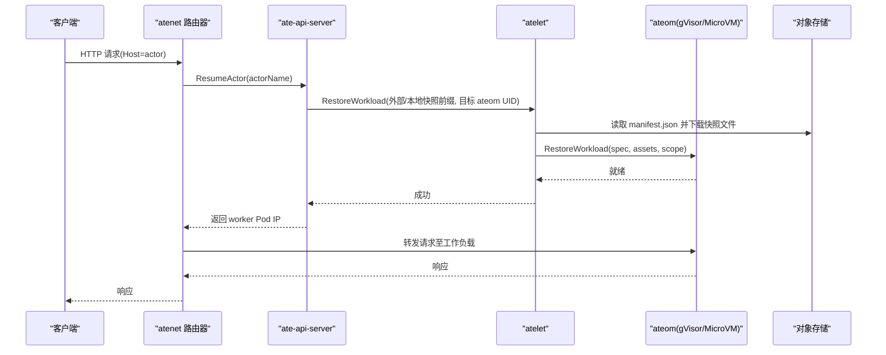
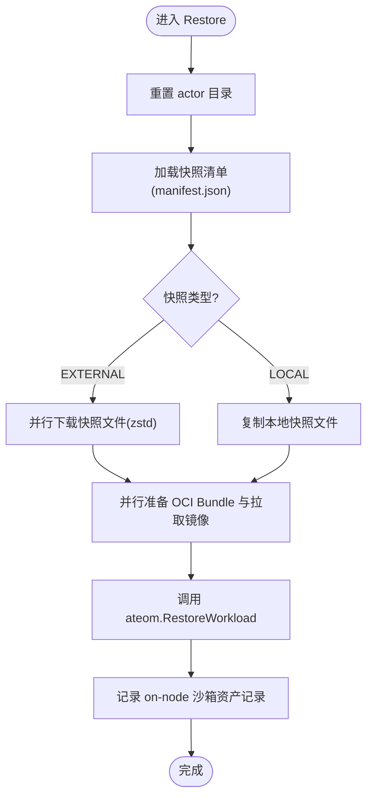
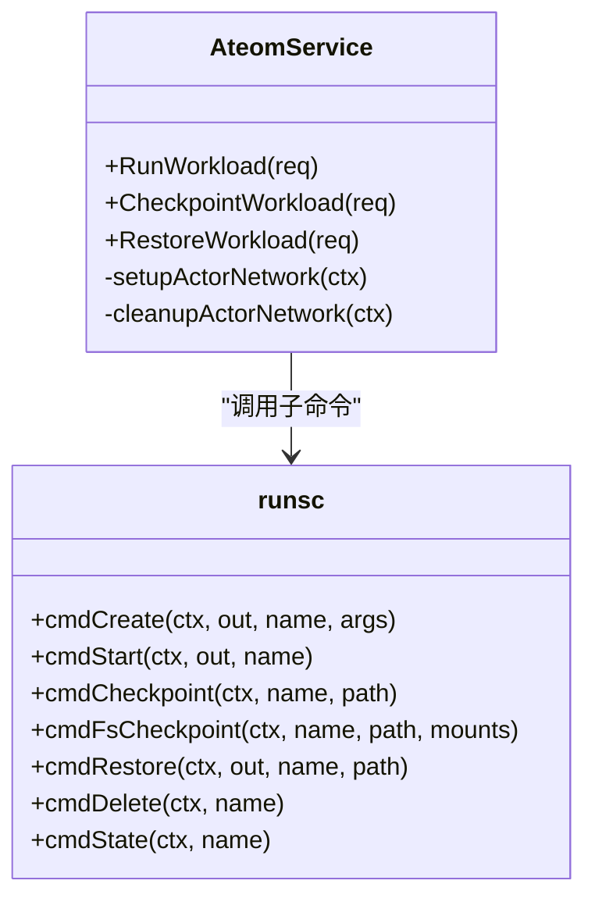
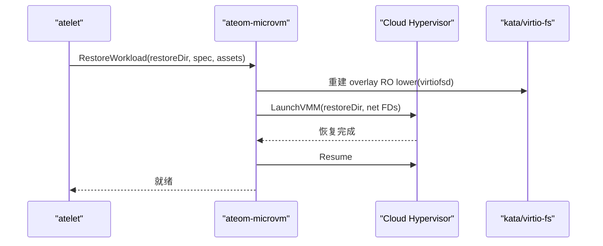
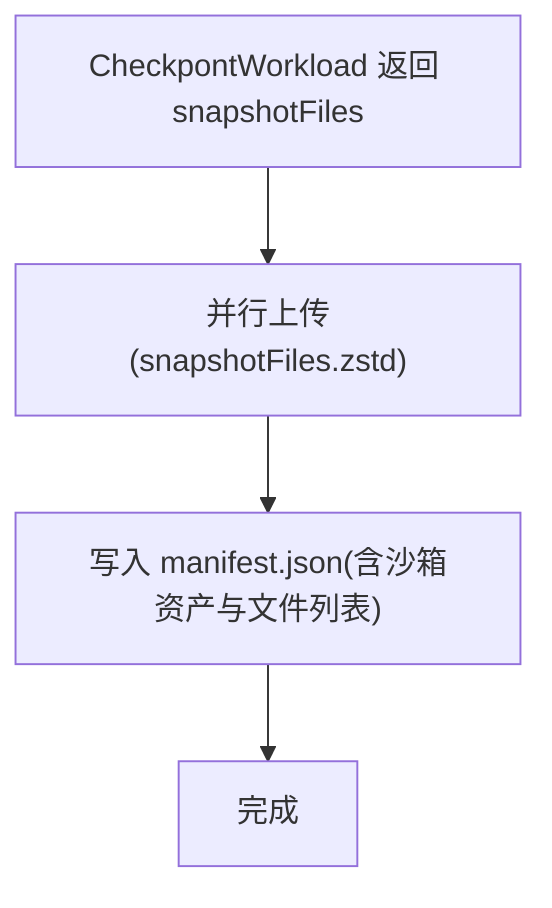
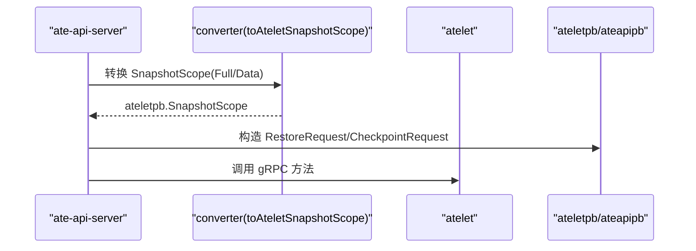
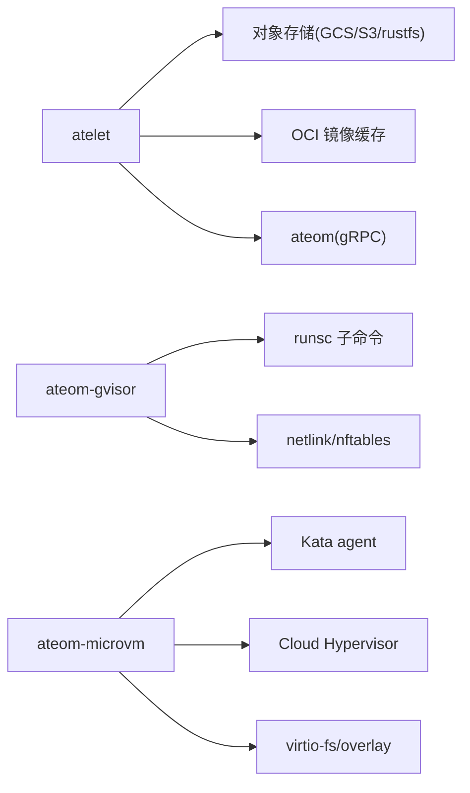

# 节点代理架构

<cite>
**本文引用的文件**   
- [README.md](file://README.md)
- [architecture.md](file://docs/architecture.md)
- [cmd/atelet/main.go](file://cmd/atelet/main.go)
- [cmd/atelet/sandbox_assets.go](file://cmd/atelet/sandbox_assets.go)
- [cmd/ateom-gvisor/main.go](file://cmd/ateom-gvisor/main.go)
- [cmd/ateom-gvisor/runsc.go](file://cmd/ateom-gvisor/runsc.go)
- [cmd/ateom-microvm/main.go](file://cmd/ateom-microvm/main.go)
- [cmd/ateom-microvm/checkpoint.go](file://cmd/ateom-microvm/checkpoint.go)
- [cmd/ateom-microvm/restore.go](file://cmd/ateom-microvm/restore.go)
- [internal/proto/ateletpb/atelet.pb.go](file://internal/proto/ateletpb/atelet.pb.go)
- [pkg/proto/ateapipb/ateapi.pb.go](file://pkg/proto/ateapipb/ateapi.pb.go)
- [cmd/ateapi/internal/controlapi/converter.go](file://cmd/ateapi/internal/controlapi/converter.go)
- [cmd/ateapi/main.go](file://cmd/ateapi/main.go)
</cite>

## 目录
1. [简介](#简介)
2. [项目结构](#项目结构)
3. [核心组件](#核心组件)
4. [架构总览](#架构总览)
5. [详细组件分析](#详细组件分析)
6. [依赖关系分析](#依赖关系分析)
7. [性能考量](#性能考量)
8. [故障排查指南](#故障排查指南)
9. [结论](#结论)
10. [附录](#附录)

## 简介
本文件面向 Agent Substrate 的“节点代理”子系统，系统性阐述 atelet 守护进程与 ateom 沙箱管理器的设计原理、工作负载生命周期管理、快照（Checkpoint/Restore）实现与资源清理机制；并深入说明 gVisor 与 MicroVM 两种沙箱运行时的集成方式、内存快照处理与文件系统状态管理。同时解释节点代理如何与控制器平面通信以处理恢复与挂起请求，以及存储移动器在快照上传下载与对象存储集成中的工作机制。文末提供架构图与快照流程图，帮助理解内部工作机制。

## 项目结构
- 控制面：ate-api-server 暴露 gRPC API，协调调度、状态管理与工作流编排。
- 数据面：atenet 负责 DNS 与路由，拦截流量触发恢复。
- 节点层：atelet 作为 DaemonSet 在每个节点上运行，负责沙箱资产拉取、OCI Bundle 准备、快照 I/O 与 ateom 调用。
- 沙箱管理器：ateom 为每个沙箱类提供独立实现（gVisor 或 MicroVM），通过 Unix socket 被 atelet 调用，驱动 runsc 或 Kata + Cloud Hypervisor 完成 Run/Checkpoint/Restore。
- 持久化：快照镜像与清单写入对象存储（GCS/S3/rustfs），本地缓存 OCI 镜像与沙箱二进制。

```mermaid
graph TB
subgraph "控制面"
API["ate-api-server"]
Store["高性能状态存储(ValKey/Redis)"]
end
subgraph "网络面"
Router["atenet 路由器"]
DNS["DNS 解析"]
end
subgraph "节点层"
Atelet["atelet 守护进程"]
AteomGvisor["ateom-gvisor"]
AteomMicrovm["ateom-microvm"]
ObjStore["对象存储(GCS/S3/rustfs)"]
end
Client["客户端"] --> DNS --> Router --> API
API --> Atelet
Atelet --> AteomGvisor
Atelet --> AteomMicrovm
Atelet < --> ObjStore
```

图表来源
- [architecture.md:308-352](file://docs/architecture.md#L308-L352)
- [cmd/atelet/main.go:163-183](file://cmd/atelet/main.go#L163-L183)

章节来源
- [README.md:211-225](file://README.md#L211-L225)
- [architecture.md:308-352](file://docs/architecture.md#L308-L352)

## 核心组件
- atelet：节点级守护进程，提供 AteomHerder gRPC 服务，负责：
  - 沙箱运行时资产（runsc/kata-shim/cloud-hypervisor 等）内容寻址拉取与校验
  - OCI Bundle 准备（pause 与应用容器）
  - 快照上传/下载（支持 GCS/S3/rustfs，zstd 压缩，稀疏格式兼容）
  - 调用 ateom 执行 Run/Checkpoint/Restore
- ateom-gvisor：gVisor 后端，通过 runsc 子命令创建/启动/检查点/恢复容器，维护专用网络命名空间与 nftables 规则。
- ateom-microvm：MicroVM 后端，基于 Kata + Cloud Hypervisor，使用 OnDemand 内存恢复与 overlay rootfs（guest tmpfs 可写层）。
- 存储移动器：在 atelet 中实现，将快照文件列表与 manifest.json 同步到对象存储，并在恢复时并行下载与解压。

章节来源
- [cmd/atelet/main.go:185-213](file://cmd/atelet/main.go#L185-L213)
- [cmd/atelet/sandbox_assets.go:91-115](file://cmd/atelet/sandbox_assets.go#L91-L115)
- [cmd/ateom-gvisor/main.go:157-178](file://cmd/ateom-gvisor/main.go#L157-L178)
- [cmd/ateom-microvm/main.go:184-226](file://cmd/ateom-microvm/main.go#L184-L226)

## 架构总览
节点代理采用“控制面解耦 + 节点自治”的设计：控制面仅做高并发决策与编排，实际沙箱生命周期由 atelet+ateom 在节点内闭环完成。快照数据经 atelet 的存储移动器与对象存储交互，确保跨节点迁移与冷启动加速。



图表来源
- [architecture.md:359-384](file://docs/architecture.md#L359-L384)
- [cmd/atelet/main.go:454-583](file://cmd/atelet/main.go#L454-L583)

## 详细组件分析

### atelet 守护进程
职责与流程
- 接收来自控制面的 Restore/Checkpoint 请求，解析快照类型（EXTERNAL/LOCAL）、作用域（FULL/DATA）与目标 ateom UID。
- 根据快照清单恢复沙箱运行时版本，拉取对应资产并校验 SHA256。
- 并行准备 OCI Bundle 与下载快照，随后调用 ateom 执行具体操作。
- Checkpoint 完成后上报 snapshotFiles 列表，并将 manifest.json 与快照一同落盘或上传。

关键实现要点
- 沙箱资产按架构选择并内容寻址缓存，避免重复下载。
- 快照大小指标记录用于观测。
- 错误分类区分终端错误（如文件系统不可用）与非重试错误，影响是否标记 Actor 崩溃。



图表来源
- [cmd/atelet/main.go:454-583](file://cmd/atelet/main.go#L454-L583)
- [cmd/atelet/sandbox_assets.go:91-115](file://cmd/atelet/sandbox_assets.go#L91-L115)

章节来源
- [cmd/atelet/main.go:185-213](file://cmd/atelet/main.go#L185-L213)
- [cmd/atelet/main.go:309-380](file://cmd/atelet/main.go#L309-L380)
- [cmd/atelet/main.go:454-583](file://cmd/atelet/main.go#L454-L583)
- [cmd/atelet/sandbox_assets.go:117-184](file://cmd/atelet/sandbox_assets.go#L117-L184)

### ateom-gvisor（gVisor 后端）
职责与流程
- 监听 Unix socket，提供 Run/Checkpoint/Restore 工作负载接口。
- 创建专用网络命名空间，建立 veth 对与 nftables 规则，使工作负载出站 NAT 与入站 DNAT 符合预期。
- 通过 runsc 子命令管理 pause 与应用容器的生命周期，支持 fscheckpoint 与 full checkpoint。

关键实现要点
- 启动时拉起子进程回收器，避免僵尸进程。
- 网络初始化失败会回滚清理，保证幂等性。
- 日志管道为每个容器输出带标签的 JSON 行，便于追踪。



图表来源
- [cmd/ateom-gvisor/main.go:157-178](file://cmd/ateom-gvisor/main.go#L157-L178)
- [cmd/ateom-gvisor/runsc.go:30-259](file://cmd/ateom-gvisor/runsc.go#L30-L259)

章节来源
- [cmd/ateom-gvisor/main.go:112-155](file://cmd/ateom-gvisor/main.go#L112-L155)
- [cmd/ateom-gvisor/main.go:180-237](file://cmd/ateom-gvisor/main.go#L180-L237)
- [cmd/ateom-gvisor/main.go:239-307](file://cmd/ateom-gvisor/main.go#L239-L307)
- [cmd/ateom-gvisor/main.go:352-437](file://cmd/ateom-gvisor/main.go#L352-L437)
- [cmd/ateom-gvisor/runsc.go:35-259](file://cmd/ateom-gvisor/runsc.go#L35-L259)

### ateom-microvm（MicroVM 后端）
职责与流程
- 基于 Kata + Cloud Hypervisor，使用 OnDemand 内存恢复降低延迟并保持稀疏内存范围。
- 每个容器的 rootfs 采用 overlay（RO lower 来自本地 OCI bundle，RW upper 为 guest tmpfs），可写层随内存快照持久化。
- 恢复时重建 tap 设备 FD，重写快照配置中的 socket 路径，重启 CH 并恢复。

关键实现要点
- 合并 OnDemand delta 到基础快照，确保后续再次挂起可用。
- 网络与挂载传播在容器环境中需特殊处理（rshared）。
- 日志转发通过 kata-agent vsock 重连恢复。



图表来源
- [cmd/ateom-microvm/restore.go:52-207](file://cmd/ateom-microvm/restore.go#L52-L207)
- [cmd/ateom-microvm/checkpoint.go:44-154](file://cmd/ateom-microvm/checkpoint.go#L44-L154)

章节来源
- [cmd/ateom-microvm/main.go:73-154](file://cmd/ateom-microvm/main.go#L73-L154)
- [cmd/ateom-microvm/checkpoint.go:44-154](file://cmd/ateom-microvm/checkpoint.go#L44-L154)
- [cmd/ateom-microvm/restore.go:52-207](file://cmd/ateom-microvm/restore.go#L52-L207)

### 存储移动器与对象存储集成
- 上传：按 ateom 返回的文件列表，逐个 zstd 压缩后上传；S3/rustfs 因需要 seekable body 而先缓冲到临时文件，GCS 可直接流式上传。
- 下载：恢复时并行下载并自动检测 plain/zstd/sparse 格式，兼容旧快照。
- 清单：manifest.json 记录沙箱类、资产与快照文件集合，确保跨节点恢复自描述。



图表来源
- [cmd/atelet/main.go:422-452](file://cmd/atelet/main.go#L422-L452)
- [cmd/atelet/main.go:625-643](file://cmd/atelet/main.go#L625-L643)
- [cmd/atelet/sandbox_assets.go:206-241](file://cmd/atelet/sandbox_assets.go#L206-L241)

章节来源
- [cmd/atelet/main.go:422-452](file://cmd/atelet/main.go#L422-L452)
- [cmd/atelet/main.go:625-643](file://cmd/atelet/main.go#L625-L643)
- [cmd/atelet/sandbox_assets.go:186-204](file://cmd/atelet/sandbox_assets.go#L186-L204)

### 与控制器平面的通信与工作流
- 控制面 gRPC 接口定义于 ateapipb，包含 ExternalSnapshotInfo 与 LocalSnapshotInfo 等消息。
- 控制面将 CRD 的 SnapshotScope 转换为 ateletpb.SnapshotScope，再下发给 atelet。
- 恢复流程：Router 触发 ResumeActor -> API 分配 Worker -> atelet 从对象存储拉取快照并调用 ateom 恢复 -> 返回 Pod IP -> Router 转发请求。



图表来源
- [cmd/ateapi/internal/controlapi/converter.go:24-35](file://cmd/ateapi/internal/controlapi/converter.go#L24-L35)
- [internal/proto/ateletpb/atelet.pb.go:1260-1275](file://internal/proto/ateletpb/atelet.pb.go#L1260-L1275)
- [pkg/proto/ateapipb/ateapi.pb.go:142-181](file://pkg/proto/ateapipb/ateapi.pb.go#L142-L181)

章节来源
- [cmd/ateapi/main.go:141-169](file://cmd/ateapi/main.go#L141-L169)
- [cmd/ateapi/internal/controlapi/converter.go:24-35](file://cmd/ateapi/internal/controlapi/converter.go#L24-L35)
- [internal/proto/ateletpb/atelet.pb.go:1260-1275](file://internal/proto/ateletpb/atelet.pb.go#L1260-L1275)
- [pkg/proto/ateapipb/ateapi.pb.go:142-181](file://pkg/proto/ateapipb/ateapi.pb.go#L142-L181)

## 依赖关系分析
- atelet 依赖：
  - 对象存储客户端（GCS/S3/rustfs）进行快照传输
  - OCI 镜像拉取缓存（内存缓存）
  - ateom gRPC 客户端（Unix socket）
- ateom-gvisor 依赖：
  - runsc 子命令
  - Linux 网络栈（netlink/nftables）
- ateom-microvm 依赖：
  - Kata agent 与 Cloud Hypervisor
  - virtio-fs 与 overlay 根文件系统



图表来源
- [cmd/atelet/main.go:163-183](file://cmd/atelet/main.go#L163-L183)
- [cmd/ateom-gvisor/main.go:157-178](file://cmd/ateom-gvisor/main.go#L157-L178)
- [cmd/ateom-microvm/main.go:184-226](file://cmd/ateom-microvm/main.go#L184-L226)

章节来源
- [cmd/atelet/main.go:163-183](file://cmd/atelet/main.go#L163-L183)
- [cmd/ateom-gvisor/main.go:157-178](file://cmd/ateom-gvisor/main.go#L157-L178)
- [cmd/ateom-microvm/main.go:184-226](file://cmd/ateom-microvm/main.go#L184-L226)

## 性能考量
- 并行化：
  - 恢复阶段并行下载快照与准备 OCI Bundle，隐藏较长链路。
  - 上传阶段并行压缩与发送快照文件。
- 压缩策略：
  - 针对大对象（内存镜像）使用高速压缩级别，兼顾吞吐与体积。
  - 兼容 plain/zstd/sparse 格式，避免升级带来的不兼容。
- 内存恢复：
  - MicroVM 使用 OnDemand 恢复，显著降低延迟并保持稀疏内存范围，利于后续挂起。
- 指标与可观测性：
  - 记录快照大小直方图与恢复各阶段耗时，便于定位瓶颈。

[本节为通用指导，无需源码引用]

## 故障排查指南
- 终端文件系统错误：
  - 当出现不存在、权限不足、只读文件系统等问题时，会被归类为终端错误，可能触发 Actor 崩溃标记。
- 快照不一致：
  - 若 snapshotFiles 为空或清单解析失败，应检查对象存储连通性与权限。
- 网络问题：
  - gVisor 后端需确保 nftables 表存在且未被其他组件覆盖；MicroVM 需确认 tap FD 正确传递。
- 资产校验失败：
  - 沙箱二进制 SHA256 不匹配或超过大小上限会导致失败，需核对源地址与白名单。

章节来源
- [cmd/atelet/sandbox_assets.go:243-267](file://cmd/atelet/sandbox_assets.go#L243-L267)
- [cmd/atelet/main.go:309-380](file://cmd/atelet/main.go#L309-L380)
- [cmd/ateom-gvisor/main.go:439-521](file://cmd/ateom-gvisor/main.go#L439-L521)
- [cmd/ateom-microvm/restore.go:114-126](file://cmd/ateom-microvm/restore.go#L114-L126)

## 结论
节点代理通过 atelet 与 ateom 的清晰分层，实现了高效、可扩展的工作负载生命周期管理与快照迁移。gVisor 与 MicroVM 双后端满足不同隔离与性能需求，结合对象存储与并行优化，达成亚秒级激活与高复用率。未来可在网络策略精细化、授权扩展与多卷快照等方面持续演进。

[本节为总结，无需源码引用]

## 附录
- 术语
  - Actor：一次具体的工作负载实例
  - Worker：承载 Actor 的物理 Pod
  - Sandbox Class：沙箱类别（gVisor/MicroVM）
  - Golden Snapshot：模板生成的初始快照
  - LatestSnapshotInfo：最近一次挂起的快照信息

[本节为概念说明，无需源码引用]
