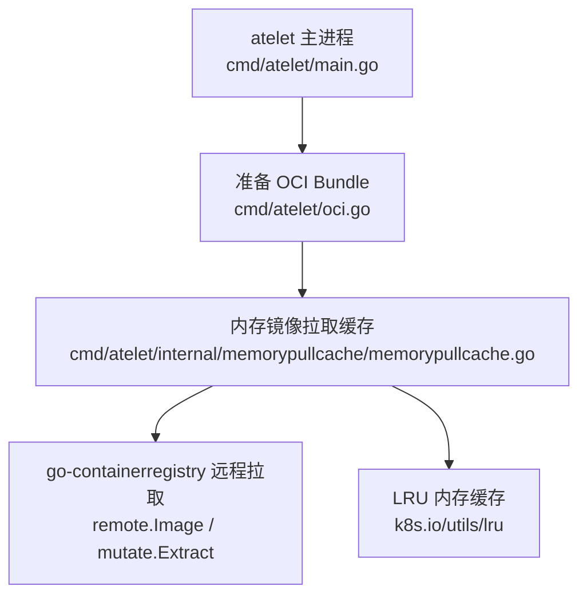
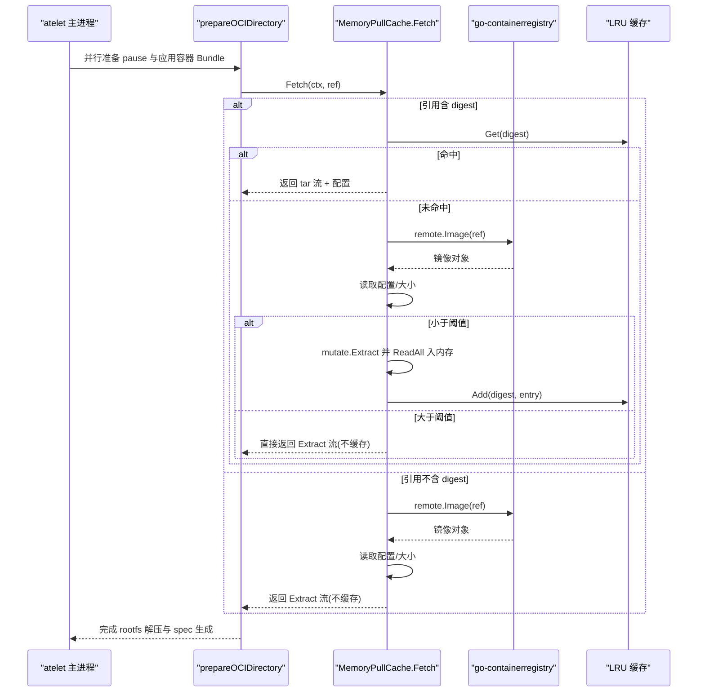
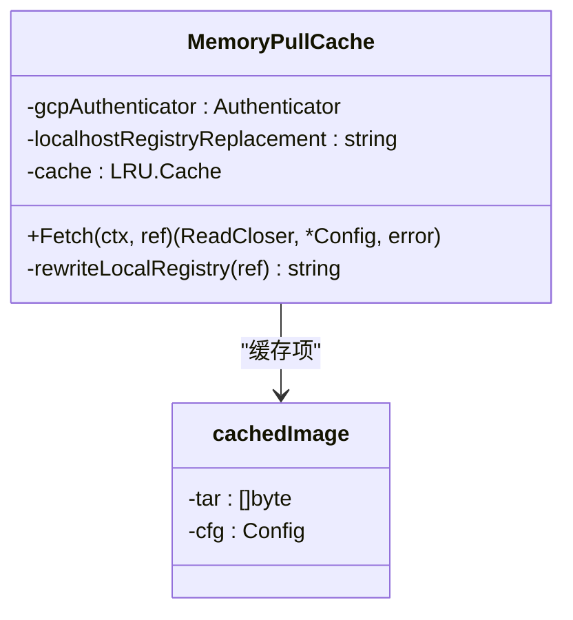
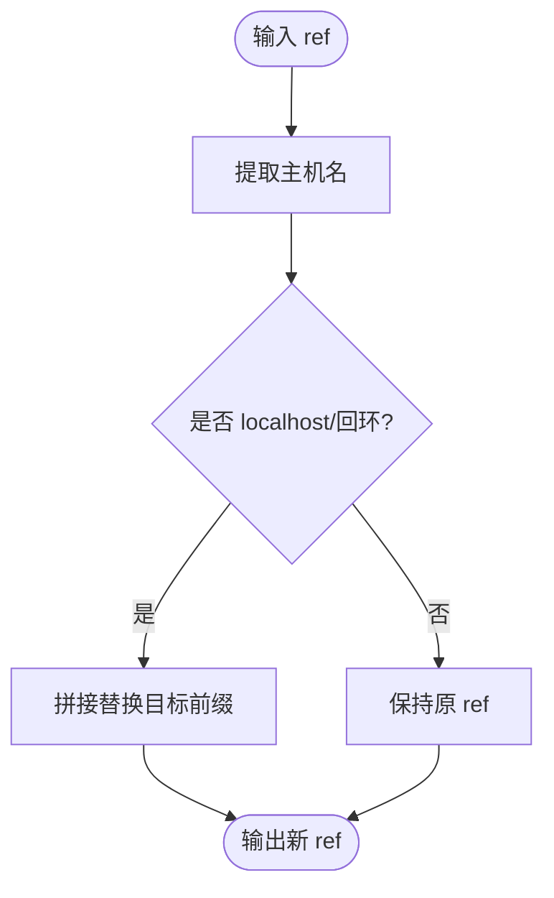
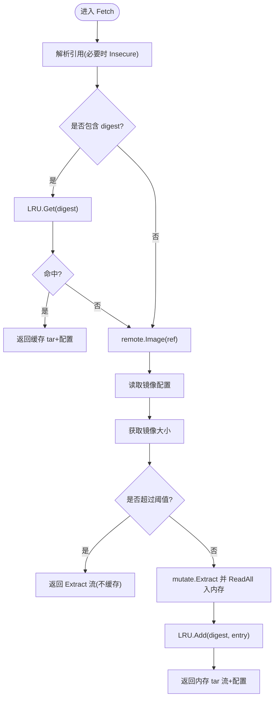
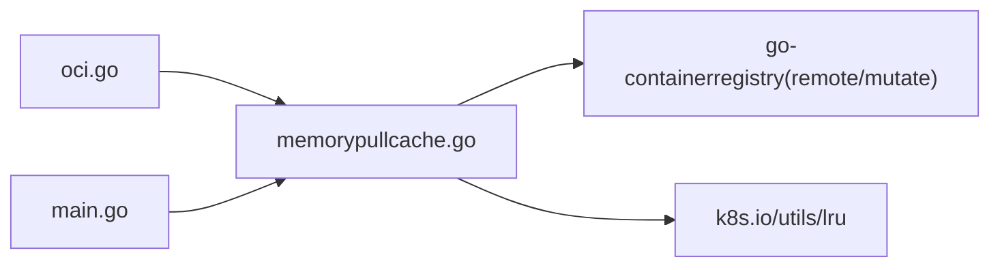

# 镜像缓存系统

<cite>
**本文引用的文件列表**
- [memorypullcache.go](file://cmd/atelet/internal/memorypullcache/memorypullcache.go)
- [memorypullcache_test.go](file://cmd/atelet/internal/memorypullcache/memorypullcache_test.go)
- [oci.go](file://cmd/atelet/oci.go)
- [main.go](file://cmd/atelet/main.go)
</cite>

## 目录
1. [简介](#简介)
2. [项目结构](#项目结构)
3. [核心组件](#核心组件)
4. [架构总览](#架构总览)
5. [详细组件分析](#详细组件分析)
6. [依赖关系分析](#依赖关系分析)
7. [性能与内存优化](#性能与内存优化)
8. [故障排查指南](#故障排查指南)
9. [结论](#结论)
10. [附录](#附录)

## 简介
本文件围绕 memorypullcache 包，系统性阐述 atelet 中的镜像拉取缓存机制。重点包括：
- 基于内存的 OCI 镜像缓存设计与 LRU 淘汰策略
- 镜像拉取的缓存命中逻辑、重复镜像去重与内存占用控制
- 与 Google Container Registry 的集成（应用默认凭证）与本地开发环境的 localhost 替换机制
- 镜像分层缓存现状、增量更新与缓存失效策略
- 缓存统计指标、性能监控与内存使用优化建议
- 镜像拉取流程图与缓存命中率分析方法

## 项目结构
memorypullcache 位于 cmd/atelet/internal/memorypullcache 下，被 atelet 主进程通过 prepareOCIBundles -> prepareOCIDirectory -> pullCache.Fetch 调用链使用。

图表来源
- [main.go:116-119](file://cmd/atelet/main.go#L116-L119)
- [oci.go:60-116](file://cmd/atelet/oci.go#L60-L116)
- [memorypullcache.go:35-70](file://cmd/atelet/internal/memorypullcache/memorypullcache.go#L35-L70)

章节来源
- [main.go:116-119](file://cmd/atelet/main.go#L116-L119)
- [oci.go:60-116](file://cmd/atelet/oci.go#L60-L116)
- [memorypullcache.go:35-70](file://cmd/atelet/internal/memorypullcache/memorypullcache.go#L35-L70)

## 核心组件
- MemoryPullCache：提供 Fetch(ctx, ref) 接口，返回解压后的 tar 流与镜像配置；内部维护一个按镜像 digest 为键的 LRU 缓存。
- cachedImage：缓存项，包含 tar 字节切片与 v1.Config。
- 本地注册表重写：支持将 localhost/回环地址替换为指定外部本地仓库，便于 kind 等环境开发。
- GCR 认证：当目标仓库为 gcr.io/*.gcr.io 或 pkg.dev/*.pkg.dev 时，若提供了 GCP 认证器则启用认证拉取。

章节来源
- [memorypullcache.go:35-70](file://cmd/atelet/internal/memorypullcache/memorypullcache.go#L35-L70)
- [memorypullcache.go:73-198](file://cmd/atelet/internal/memorypullcache/memorypullcache.go#L73-L198)
- [memorypullcache.go:200-235](file://cmd/atelet/internal/memorypullcache/memorypullcache.go#L200-L235)

## 架构总览
从 atelet 启动到镜像拉取的关键路径如下：

图表来源
- [oci.go:60-116](file://cmd/atelet/oci.go#L60-L116)
- [memorypullcache.go:73-198](file://cmd/atelet/internal/memorypullcache/memorypullcache.go#L73-L198)

## 详细组件分析

### MemoryPullCache 类图

图表来源
- [memorypullcache.go:35-47](file://cmd/atelet/internal/memorypullcache/memorypullcache.go#L35-L47)
- [memorypullcache.go:73-198](file://cmd/atelet/internal/memorypullcache/memorypullcache.go#L73-L198)

#### 关键流程与实现要点
- 本地注册表识别与重写
  - 解析引用主机名，判断是否为 localhost 或 127.0.0.0/8 回环段；若配置了替换目标，则将本地引用重写为指定仓库地址，并允许 HTTP 拉取以简化本地开发。
- 缓存命中判定
  - 仅当引用包含 digest 时才进行缓存查找与回填；多架构场景下，按“请求的 digest”作为键写入缓存，避免同一镜像不同架构导致键冲突。
- 远程拉取与认证
  - 对 gcr.io/*.gcr.io 与 pkg.dev/*.pkg.dev 自动附加 GCP 认证器（若已初始化）。
- 大镜像保护
  - 超过阈值的镜像不会完整读入内存，而是直接返回 Extract 流，避免内存峰值过高。
- 平台选择
  - 拉取时指定 linux 平台与当前 GOARCH，确保与宿主机一致。

章节来源
- [memorypullcache.go:73-198](file://cmd/atelet/internal/memorypullcache/memorypullcache.go#L73-L198)
- [memorypullcache.go:200-235](file://cmd/atelet/internal/memorypullcache/memorypullcache.go#L200-L235)

#### 本地注册表重写与检测

图表来源
- [memorypullcache.go:200-235](file://cmd/atelet/internal/memorypullcache/memorypullcache.go#L200-L235)

章节来源
- [memorypullcache.go:200-235](file://cmd/atelet/internal/memorypullcache/memorypullcache.go#L200-L235)
- [memorypullcache_test.go:21-50](file://cmd/atelet/internal/memorypullcache/memorypullcache_test.go#L21-L50)
- [memorypullcache_test.go:52-84](file://cmd/atelet/internal/memorypullcache/memorypullcache_test.go#L52-L84)

#### 拉取与缓存填充流程

图表来源
- [memorypullcache.go:73-198](file://cmd/atelet/internal/memorypullcache/memorypullcache.go#L73-L198)

章节来源
- [memorypullcache.go:73-198](file://cmd/atelet/internal/memorypullcache/memorypullcache.go#L73-L198)

### 与 oci.go 的集成
- prepareOCIDirectory 负责创建 bundle 目录、清理旧 rootfs、调用 pullCache.Fetch 获取 tar 流与配置，随后解压至 rootfs 并生成 config.json。
- 该函数在 parallel 中为 pause 容器与各应用容器执行，最大化利用并发减少冷启动时间。

章节来源
- [oci.go:60-116](file://cmd/atelet/oci.go#L60-L116)

### 与 main.go 的集成
- 启动时根据参数决定是否启用 GCP 应用默认凭证，并构造 MemoryPullCache 注入服务。
- 同时暴露 metrics 服务器，用于后续扩展监控指标。

章节来源
- [main.go:108-119](file://cmd/atelet/main.go#L108-L119)

## 依赖关系分析
- 对外依赖
  - go-containerregistry：远程镜像拉取、配置读取、镜像解压。
  - k8s.io/utils/lru：固定容量的 LRU 缓存。
- 内部依赖
  - ateletpb/ateompb：工作负载规格与运行时交互（由上层编排）。
  - serverboot：指标与追踪初始化（在主进程中）。

图表来源
- [memorypullcache.go:17-33](file://cmd/atelet/internal/memorypullcache/memorypullcache.go#L17-33)
- [oci.go:32-41](file://cmd/atelet/oci.go#L32-41)
- [main.go:31-62](file://cmd/atelet/main.go#L31-L62)

章节来源
- [memorypullcache.go:17-33](file://cmd/atelet/internal/memorypullcache/memorypullcache.go#L17-33)
- [oci.go:32-41](file://cmd/atelet/oci.go#L32-41)
- [main.go:31-62](file://cmd/atelet/main.go#L31-L62)

## 性能与内存优化

### 缓存命中与去重
- 命中条件：引用必须包含 digest；否则走慢路径且不缓存。
- 去重：相同 digest 的镜像只会在内存中保留一份，避免重复存储。

### 内存占用控制
- 容量限制：LRU 最大条目数固定（默认 256），超出时按最近最少使用淘汰。
- 大小阈值：单镜像超过阈值时不进行内存缓存，直接返回流式解压结果，降低峰值内存。
- 注意：当前未实现按总字节数的软上限，存在潜在内存增长风险。

### 网络与并发
- 上下文传播：远程拉取使用 caller 的 context，以便取消时中断底层 HTTP 请求，避免残留缓冲放大 RSS。
- 平台选择：强制 linux 平台与本机架构，减少不必要的数据传输与解压开销。

### 指标与监控
- 现有指标：主进程初始化了通用指标与追踪，但 memorypullcache 尚未内置专用计数器（如命中/未命中、缓存大小、淘汰次数等）。
- 建议新增指标（概念性）：
  - cache_hits/cache_misses：计数型指标
  - cache_entries：Gauge，记录当前缓存条目数
  - cache_bytes_in_memory：Gauge，记录当前缓存占用的字节数
  - image_size_bucket：Histogram，记录拉取镜像大小分布
  - fetch_duration_seconds：Histogram，记录单次拉取耗时

[本节为通用指导，不涉及具体代码文件]

## 故障排查指南
- 本地仓库无法访问
  - 确认是否设置了 localhost-registry-replacement，且目标仓库可达。
  - 检查 isLocalRegistry 判定是否符合预期（localhost/127.x.x.x）。
- 拉取失败或超时
  - 检查是否启用了 GCP 认证以及对应权限。
  - 关注日志中的 “Ref includes digest, checking for cache hit”、“Cache miss”、“Image is too large to cache” 等提示。
- 内存异常升高
  - 观察是否存在大量大镜像未被阈值拦截。
  - 评估是否需要调小 LRU 容量或引入按字节计量的淘汰策略。

章节来源
- [memorypullcache.go:73-198](file://cmd/atelet/internal/memorypullcache/memorypullcache.go#L73-L198)
- [memorypullcache.go:200-235](file://cmd/atelet/internal/memorypullcache/memorypullcache.go#L200-L235)

## 结论
memorypullcache 实现了面向 atelet 的轻量级内存镜像缓存，具备以下特点：
- 简单可靠：基于 digest 的精确命中与去重，结合 LRU 控制条目数量。
- 安全稳健：大镜像走流式解压，避免内存峰值；本地开发支持 HTTP 与仓库重写。
- 可观测性待增强：建议补充命中/未命中、缓存大小、淘汰等指标，便于容量规划与问题定位。

[本节为总结性内容，不涉及具体代码文件]

## 附录

### 镜像分层缓存与增量更新说明
- 现状：当前实现将镜像整体解压为 tar 后缓存，并未对层（layer）级别进行缓存或增量更新。
- 影响：对于共享基础层的镜像，跨任务复用主要体现在“整镜像”层面；若引用不含 digest，则无法命中缓存。
- 改进方向（概念性）：
  - 引入层级缓存：按 layer digest 缓存 blob，合并时按需组装。
  - 增量更新：对比已有层集合，仅拉取缺失层。
  - 持久化：将层缓存落盘，重启后可复用，降低冷启动成本。

[本节为概念性说明，不涉及具体代码文件]

### 缓存命中率分析方法（概念性）
- 采集维度：
  - 拉取请求总数、命中次数、未命中次数
  - 各镜像 digest 的命中频次
  - 缓存条目数与内存占用随时间的变化
- 可视化建议：
  - 命中率趋势图（小时/天粒度）
  - Top-N 热门镜像命中率
  - 缓存淘汰事件与内存水位关联图

[本节为概念性说明，不涉及具体代码文件]
