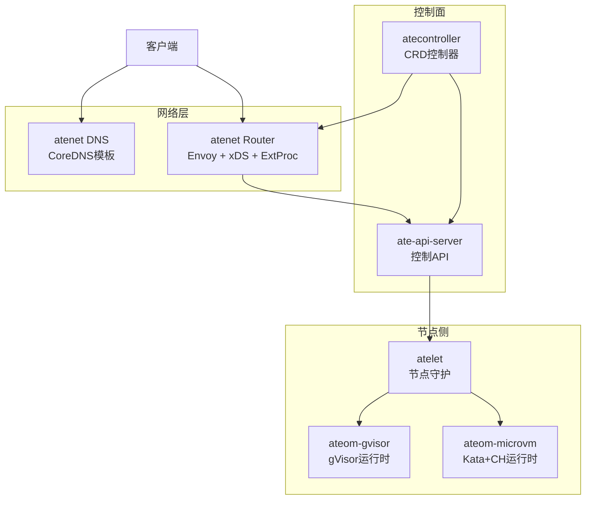
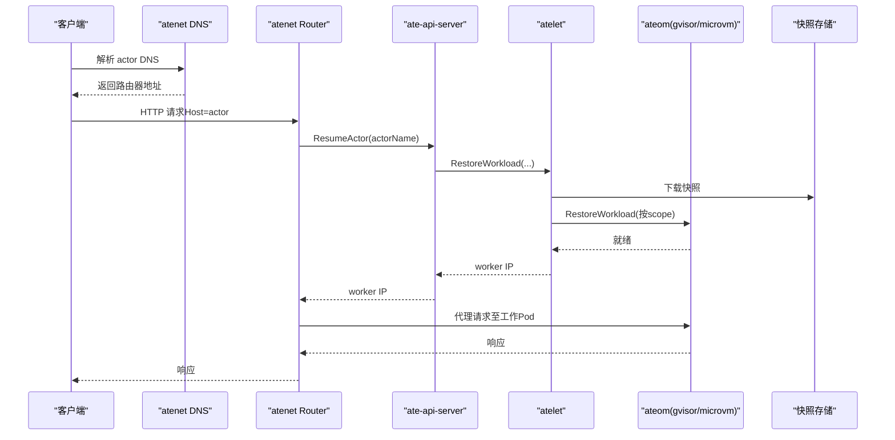
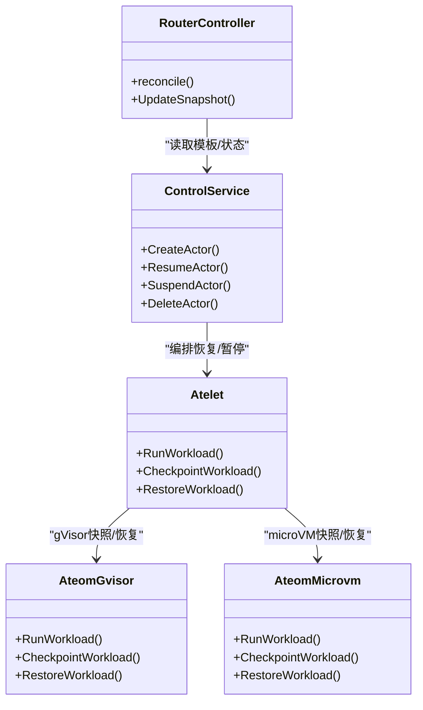
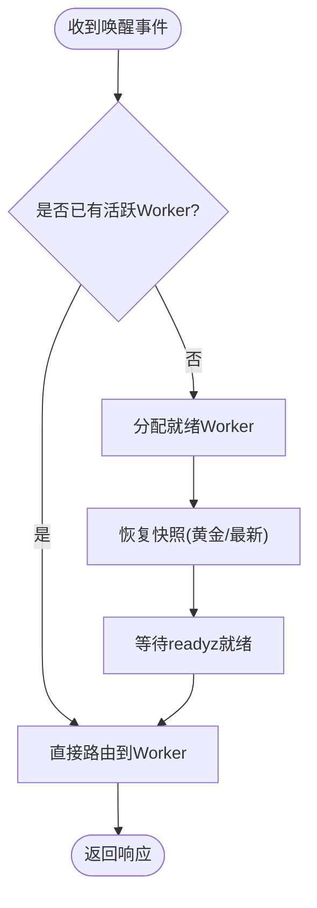
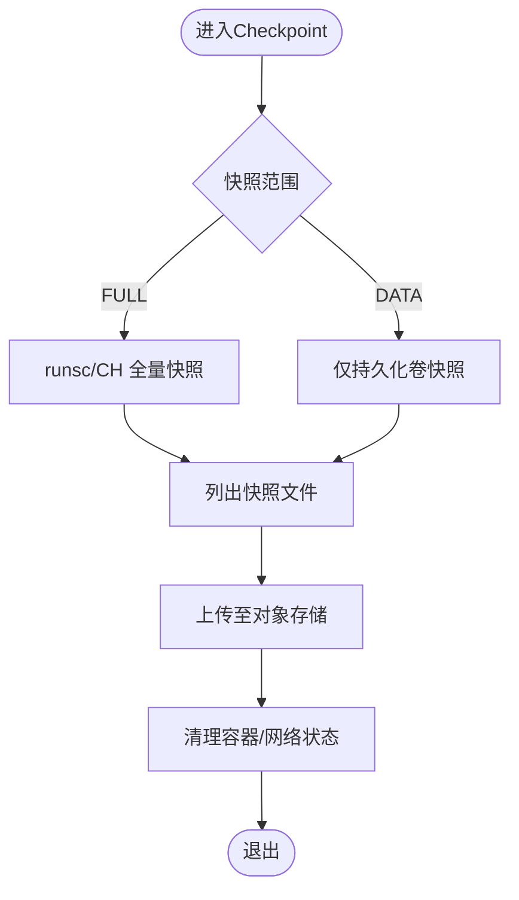
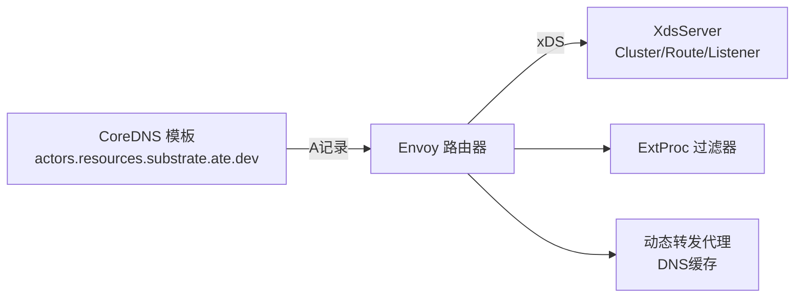
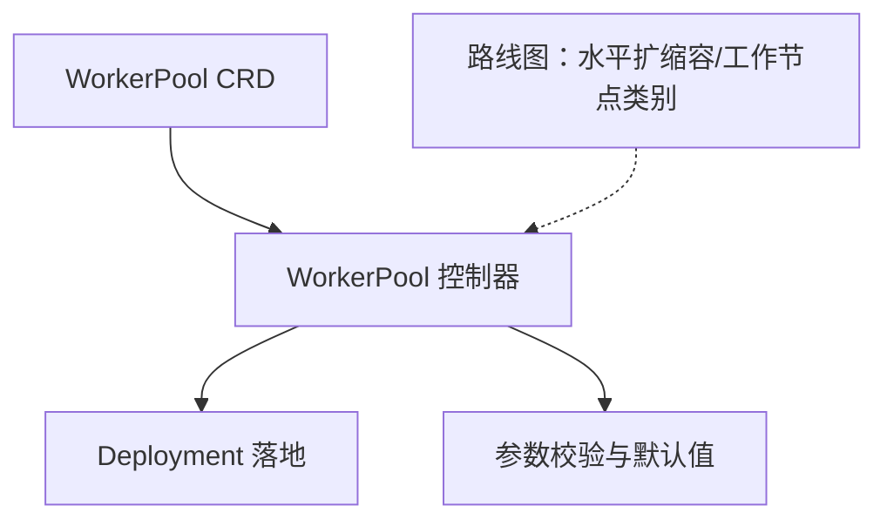
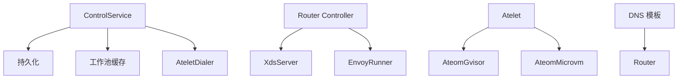

# 主要特性

<cite>
**本文引用的文件**
- [README.md](file://README.md)
- [architecture.md](file://docs/architecture.md)
- [roadmap.md](file://docs/roadmap.md)
- [counter.go](file://demos/counter/counter.go)
- [counter README.md](file://demos/counter/README.md)
- [agent-secret README.md](file://demos/agent-secret/README.md)
- [sandbox main.go](file://demos/sandbox/main.go)
- [ateom-gvisor main.go](file://cmd/ateom-gvisor/main.go)
- [ateom-microvm main.go](file://cmd/ateom-microvm/main.go)
- [checkpoint.go (microvm)](file://cmd/ateom-microvm/checkpoint.go)
- [restore.go (microvm)](file://cmd/ateom-microvm/restore.go)
- [xds.go](file://cmd/atenet/internal/router/xds.go)
- [controller.go](file://cmd/atenet/internal/router/controller.go)
- [corefile.go](file://cmd/atenet/internal/dns/corefile.go)
- [dns README.md](file://cmd/atenet/internal/dns/README.md)
- [actor.go](file://internal/resources/actor.go)
- [workerpool_controller_test.go](file://cmd/atecontroller/internal/controllers/workerpool_controller_test.go)
- [workerpool_validation_test.go](file://pkg/api/v1alpha1/workerpool_validation_test.go)
</cite>

## 目录
1. [简介](#简介)
2. [项目结构](#项目结构)
3. [核心组件](#核心组件)
4. [架构总览](#架构总览)
5. [详细组件分析](#详细组件分析)
6. [依赖关系分析](#依赖关系分析)
7. [性能与高并发特性](#性能与高并发特性)
8. [故障排查指南](#故障排查指南)
9. [结论](#结论)
10. [附录：示例与用法](#附录示例与用法)

## 简介
Agent Substrate 在 Kubernetes 之上为“类 Agent”工作负载提供更高密度、更低延迟的调度与控制面，将大量“有状态 Actor”复用至少量“就绪 Worker（Pod）”，通过快速启动、内存快照与文件系统持久化实现亚秒级激活响应。系统包含控制面 API、节点侧执行器、网络路由与 DNS、以及多种沙箱运行时（gVisor 与 microVM），并提供 Counter Demo 与 Secret Agent Demo 等示例以验证多路复用、零空闲自挂起与状态精确恢复等能力。

## 项目结构
- 控制面与服务
  - ate-api-server：对外暴露 gRPC 控制接口，编排 Actor 生命周期与 Worker 分配
  - atenet：集成 DNS 与 Envoy 路由控制器，负责动态流量路由与外部处理扩展
  - atelet：节点守护进程，协调快照、镜像/资源拉取与运行态管理
  - ateom-gvisor / ateom-microvm：沙箱运行时代理，分别基于 gVisor 与 Kata+Cloud Hypervisor 提供进程/VM 级快照与恢复
- 示例与应用
  - demos/counter：有状态计数器，演示跨暂停/恢复的文件系统与内存状态一致性
  - demos/agent-secret：展示“零空闲”自挂起与 RAM 中身份持久化
  - demos/sandbox：安全沙箱执行环境，演示任意命令执行与文件系统状态保持
- 文档与路线图
  - docs/architecture.md：Actor 生命周期序列图与状态机
  - docs/roadmap.md：未来规划（水平扩缩容、版本化、命名空间等）

**图示来源**
- [controller.go:1-111](file://cmd/atenet/internal/router/controller.go#L1-L111)
- [service.go:1-57](file://cmd/ateapi/internal/controlapi/service.go#L1-L57)
- [corefile.go:42-64](file://cmd/atenet/internal/dns/corefile.go#L42-L64)
- [xds.go:32-384](file://cmd/atenet/internal/router/xds.go#L32-L384)
- [architecture.md:353-427](file://docs/architecture.md#L353-L427)

**章节来源**
- [README.md:1-225](file://README.md#L1-L225)
- [architecture.md:142-160](file://docs/architecture.md#L142-L160)

## 核心组件
- ate-api-server：实现 Control gRPC 服务，编排 Actor 创建、恢复、暂停与删除；维护工作池缓存与持久化存储
- atenet：
  - DNS：生成 CoreDNS 模板，将 <actor>.<atespace>.actors.resources.substrate.ate.dev 解析到路由器地址
  - Router：基于 Envoy 的动态转发与外部处理（ExtProc），结合 xDS 配置更新
- atelet：节点侧编排器，负责下载沙箱资产、调用 ateom 进行 Run/Checkpoint/Restore、上传/下载快照
- ateom-gvisor：在 Pod 内驱动 runsc 完成容器级快照/恢复、网络隔离与日志聚合
- ateom-microvm：在 Pod 内驱动 Kata+Cloud Hypervisor 完成 VM 级快照/恢复，支持 OnDemand 按需恢复以降低时延

**章节来源**
- [service.go:1-57](file://cmd/ateapi/internal/controlapi/service.go#L1-L57)
- [corefile.go:42-64](file://cmd/atenet/internal/dns/corefile.go#L42-L64)
- [xds.go:32-384](file://cmd/atenet/internal/router/xds.go#L32-L384)
- [main.go (gvisor):1-800](file://cmd/ateom-gvisor/main.go#L1-L800)
- [main.go (microvm):1-226](file://cmd/ateom-microvm/main.go#L1-L226)

## 架构总览
下图展示了从请求到达、DNS 解析、路由触发恢复、控制面协调、节点侧快照恢复，再到最终响应的端到端流程。

**图示来源**
- [architecture.md:353-427](file://docs/architecture.md#L353-L427)
- [corefile.go:42-64](file://cmd/atenet/internal/dns/corefile.go#L42-L64)
- [xds.go:32-384](file://cmd/atenet/internal/router/xds.go#L32-L384)
- [main.go (gvisor):352-437](file://cmd/ateom-gvisor/main.go#L352-L437)
- [restore.go (microvm):150-176](file://cmd/ateom-microvm/restore.go#L150-L176)

## 详细组件分析

### 高并发多路复用与有限物理资源上的大规模实例
- 设计要点
  - 将大量“有状态 Actor”映射到少量“就绪 Worker（Pod）”，利用 Agent 类应用多数时间空闲的特性实现重度复用
  - 通过“黄金快照”与“最新快照”机制，首次或后续激活均可快速热启动
  - 控制面将关键路径旁路 Kubernetes 主控制面，降低延迟
- 效果与指标
  - 目标激活延迟：P95 约 100ms
  - 集群规模目标：十亿级 Agent
  - 吞吐目标：单集群每秒处理数千唤醒事件
- 相关实现
  - 控制面 Service 组合了持久化、工作池缓存、Dialer 与工作流编排
  - 节点侧 atelet 协调 ateom 完成快照恢复与资源准备
  - 网络层通过 DNS 与 Envoy 动态路由，避免冷启动开销

**图示来源**
- [service.go:1-57](file://cmd/ateapi/internal/controlapi/service.go#L1-L57)
- [main.go (gvisor):180-437](file://cmd/ateom-gvisor/main.go#L180-L437)
- [main.go (microvm):184-226](file://cmd/ateom-microvm/main.go#L184-L226)
- [controller.go:1-111](file://cmd/atenet/internal/router/controller.go#L1-L111)

**章节来源**
- [README.md:8-47](file://README.md#L8-L47)
- [architecture.md:142-160](file://docs/architecture.md#L142-L160)
- [service.go:1-57](file://cmd/ateapi/internal/controlapi/service.go#L1-L57)

### 亚秒级激活响应：快速启动与状态恢复
- 快速启动
  - 首次运行使用“黄金快照”（Golden Snapshot）直接水合，避免冷启动
  - 后续运行优先使用“最新快照”（Latest Snapshot Info），减少 I/O 与重建成本
- 恢复路径
  - gVisor：runsc checkpoint/restore 完整进程状态
  - microVM：Cloud Hypervisor 快照/恢复，支持 OnDemand 按需恢复以降低首启时延
- 网络就绪
  - 等待 readyz 探针成功后才认为工作负载就绪，确保请求可被立即处理

**图示来源**
- [architecture.md:353-427](file://docs/architecture.md#L353-L427)
- [main.go (gvisor):352-437](file://cmd/ateom-gvisor/main.go#L352-L437)
- [restore.go (microvm):150-176](file://cmd/ateom-microvm/restore.go#L150-L176)

**章节来源**
- [architecture.md:353-427](file://docs/architecture.md#L353-L427)
- [main.go (gvisor):352-437](file://cmd/ateom-gvisor/main.go#L352-L437)
- [restore.go (microvm):150-176](file://cmd/ateom-microvm/restore.go#L150-L176)

### 完整的内存快照与文件系统状态保存机制
- 快照范围
  - FULL：进程/VM 全量快照（内存+文件系统）
  - DATA：仅持久化数据卷（如 durable-dir）
- gVisor 路径
  - 对 pause 容器与应用容器分别执行 checkpoint/restore
  - 列出实际生成的快照文件，供 atelet 精准打包上传
- microVM 路径
  - 记录 baseID 并写入快照目录，便于恢复时重建根文件系统路径
  - OnDemand 恢复后合并 delta 到基线，形成自包含的完整快照
- 原子性与一致性
  - 使用原子写与权限设置保证标识文件一致性
  - 清理旧网络与容器状态，避免残留影响

**图示来源**
- [main.go (gvisor):239-324](file://cmd/ateom-gvisor/main.go#L239-L324)
- [checkpoint.go (microvm):83-127](file://cmd/ateom-microvm/checkpoint.go#L83-L127)
- [restore.go (microvm):150-176](file://cmd/ateom-microvm/restore.go#L150-L176)
- [main_test.go (atomic write):40-87](file://cmd/atelet/main_test.go#L40-L87)

**章节来源**
- [main.go (gvisor):239-324](file://cmd/ateom-gvisor/main.go#L239-L324)
- [checkpoint.go (microvm):83-127](file://cmd/ateom-microvm/checkpoint.go#L83-L127)
- [restore.go (microvm):150-176](file://cmd/ateom-microvm/restore.go#L150-L176)
- [main_test.go (atomic write):40-87](file://cmd/atelet/main_test.go#L40-L87)

### 基于 Envoy 的高性能 HTTP 代理与 DNS 服务，以及动态流量路由
- DNS
  - 自动生成 CoreDNS 模板，匹配 <actor>.<atespace>.actors.resources.substrate.ate.dev 并将 A 记录指向路由器
- Envoy 路由
  - 通过 xDS 动态下发 Cluster、Route、Listener 等配置
  - 启用动态转发代理与 DNS 缓存，提升外联性能
  - 集成外部处理（ExtProc）以实现请求拦截与决策
- 控制器
  - 定期 reconcile，读取 ActorTemplate 并更新 xDS 快照
  - 可选地协调 Envoy Deployment 与集群实体

**图示来源**
- [corefile.go:42-64](file://cmd/atenet/internal/dns/corefile.go#L42-L64)
- [dns README.md:1-37](file://cmd/atenet/internal/dns/README.md#L1-L37)
- [xds.go:236-384](file://cmd/atenet/internal/router/xds.go#L236-L384)
- [controller.go:67-111](file://cmd/atenet/internal/router/controller.go#L67-L111)

**章节来源**
- [corefile.go:42-64](file://cmd/atenet/internal/dns/corefile.go#L42-L64)
- [dns README.md:1-37](file://cmd/atenet/internal/dns/README.md#L1-L37)
- [xds.go:236-384](file://cmd/atenet/internal/router/xds.go#L236-L384)
- [controller.go:67-111](file://cmd/atenet/internal/router/controller.go#L67-L111)

### 智能的工作节点管理与自动扩缩容机制
- 当前能力
  - 通过 CRD WorkerPool 声明式定义 Worker 集合，控制器将其落地为 Deployment
  - 校验规则保障最小副本数、必要字段完整性与资源约束
- 未来规划
  - 工作节点水平自动扩缩容：快速扩容节点与预热 Pod 以满足需求
  - 工作节点类别（不同硬件等级）、可互换工作池
  - Actor 版本化与灰度发布策略

**图示来源**
- [workerpool_controller_test.go:91-118](file://cmd/atecontroller/internal/controllers/workerpool_controller_test.go#L91-L118)
- [workerpool_validation_test.go:41-87](file://pkg/api/v1alpha1/workerpool_validation_test.go#L41-L87)
- [roadmap.md:16-41](file://docs/roadmap.md#L16-L41)

**章节来源**
- [workerpool_controller_test.go:91-118](file://cmd/atecontroller/internal/controllers/workerpool_controller_test.go#L91-L118)
- [workerpool_validation_test.go:41-87](file://pkg/api/v1alpha1/workerpool_validation_test.go#L41-L87)
- [roadmap.md:16-41](file://docs/roadmap.md#L16-L41)

## 依赖关系分析
- 控制面与服务耦合
  - ControlService 依赖持久化、工作池缓存、Dialer 与工作流编排
  - Router Controller 依赖 xDS 与 Envoy Runner，周期性 reconcile
- 节点侧运行时
  - atelet 作为编排者，根据 scope 选择 gVisor 或 microVM 路径
  - ateom-gvisor 与 ateom-microvm 均实现统一的 Ateom gRPC 接口
- 网络与发现
  - DNS 模板由 atenet 生成，统一解析到路由器
  - Envoy 通过 xDS 动态更新路由与上游

**图示来源**
- [service.go:1-57](file://cmd/ateapi/internal/controlapi/service.go#L1-L57)
- [controller.go:1-111](file://cmd/atenet/internal/router/controller.go#L1-L111)
- [main.go (gvisor):1-800](file://cmd/ateom-gvisor/main.go#L1-L800)
- [main.go (microvm):1-226](file://cmd/ateom-microvm/main.go#L1-L226)
- [corefile.go:42-64](file://cmd/atenet/internal/dns/corefile.go#L42-L64)

**章节来源**
- [service.go:1-57](file://cmd/ateapi/internal/controlapi/service.go#L1-L57)
- [controller.go:1-111](file://cmd/atenet/internal/router/controller.go#L1-L111)
- [main.go (gvisor):1-800](file://cmd/ateom-gvisor/main.go#L1-L800)
- [main.go (microvm):1-226](file://cmd/ateom-microvm/main.go#L1-L226)
- [corefile.go:42-64](file://cmd/atenet/internal/dns/corefile.go#L42-L64)

## 性能与高并发特性
- 激活延迟目标：P95 约 100ms
- 集群规模目标：十亿级 Agent
- 吞吐目标：单集群每秒数千唤醒事件
- 优化手段
  - 黄金快照与最新快照复用，避免冷启动
  - OnDemand 按需恢复（microVM）显著降低首启时延
  - DNS 与动态转发代理缓存减少解析与连接建立开销
  - 控制面旁路关键路径，减少调度抖动

[本节为通用性能讨论，不直接分析具体文件]

## 故障排查指南
- 常见问题定位
  - 激活失败：检查 DNS 解析是否正确指向路由器，确认 xDS 配置已更新
  - 恢复超时：观察 ateom 日志，确认快照文件是否完整、网络命名空间与 nftables 规则是否生效
  - 状态不一致：核对快照范围（FULL/DATA）与持久化卷挂载情况
- 建议步骤
  - 查看 Actor 状态机流转（SUSPENDED/RESUMING/RUNNING/SUSPENDING）
  - 检查 atelet 与 ateom 的 RPC 调用链与错误码
  - 验证 readyz 探针是否成功返回

**章节来源**
- [architecture.md:353-427](file://docs/architecture.md#L353-L427)
- [main.go (gvisor):439-521](file://cmd/ateom-gvisor/main.go#L439-L521)
- [main.go (gvisor):578-628](file://cmd/ateom-gvisor/main.go#L578-L628)

## 结论
Agent Substrate 通过“Actor-Worker 多路复用 + 快照/恢复 + 高性能网络栈”的组合，实现了在有限物理资源上运行海量有状态实例的能力。其亚秒级激活、精确持久化与动态路由，配合示例应用的直观验证，为构建可扩展、低延迟的 Agentic 基础设施提供了坚实基础。未来在自动扩缩容、版本化与更细粒度的工作节点分类方面仍有持续演进计划。

## 附录：示例与用法
- Counter Demo
  - 功能：有状态 HTTP 计数器，跨暂停/恢复保持计数与随机文件内容一致
  - 使用方法：安装系统后创建 atespace 与 Actor，通过端口转发访问路由器发送 POST 请求
  - 参考路径
    - [counter README.md](file://demos/counter/README.md)
    - [counter.go](file://demos/counter/counter.go)
- Secret Agent Demo
  - 功能：展示“零空闲”自挂起与 RAM 中身份持久化，支持大规模并发“波浪脉冲”
  - 使用方法：部署后创建 Actor，发送请求观察状态自动切换与身份不变
  - 参考路径
    - [agent-secret README.md](file://demos/agent-secret/README.md)
- Sandbox Demo
  - 功能：安全沙箱执行环境，支持任意命令执行与文件系统状态保持
  - 参考路径
    - [sandbox main.go](file://demos/sandbox/main.go)

**章节来源**
- [counter README.md:1-116](file://demos/counter/README.md#L1-L116)
- [counter.go:104-165](file://demos/counter/counter.go#L104-L165)
- [agent-secret README.md:1-93](file://demos/agent-secret/README.md#L1-L93)
- [sandbox main.go:1-118](file://demos/sandbox/main.go#L1-L118)
