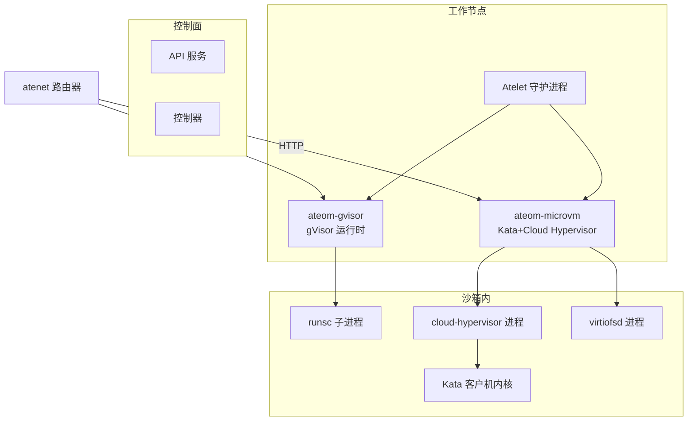
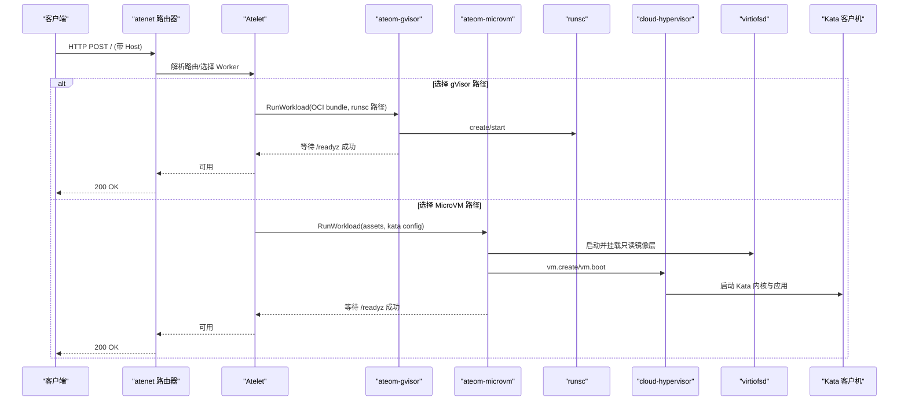
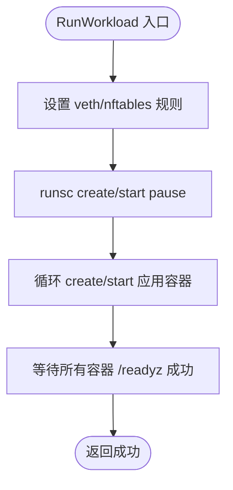
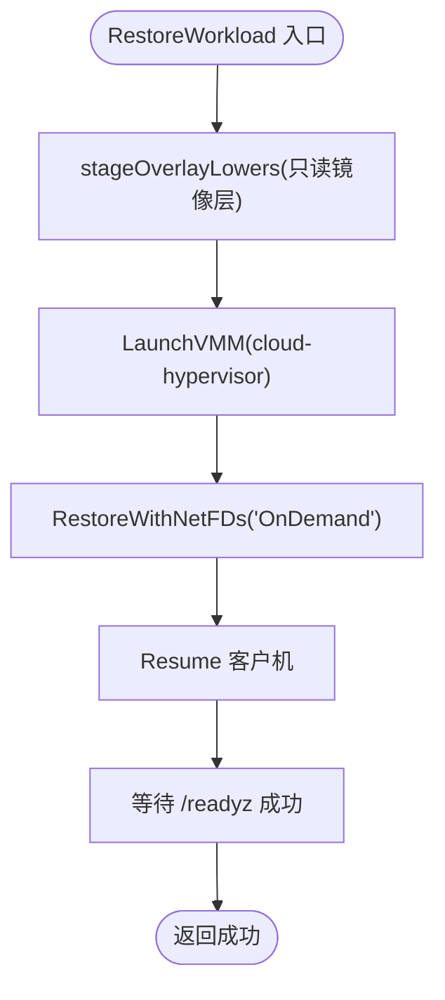
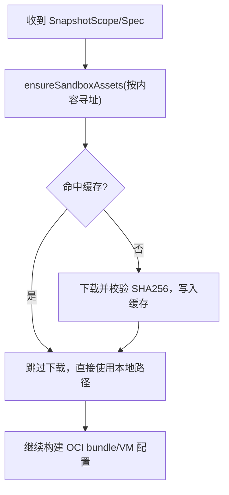
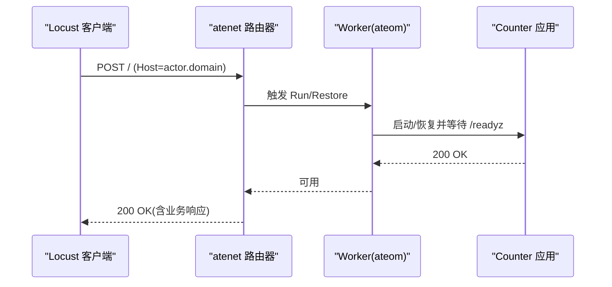
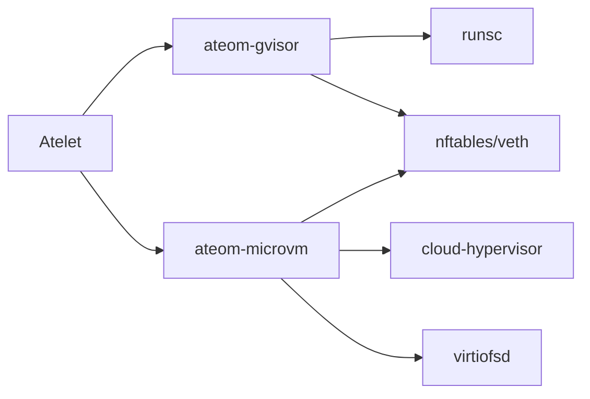

# 亚秒级激活响应

<cite>
**本文引用的文件**   
- [README.md](file://README.md)
- [architecture.md](file://docs/architecture.md)
- [counter.go](file://demos/counter/counter.go)
- [counter_demo.py](file://benchmarking/locust/tests/counter_demo.py)
- [main.go (ateom-gvisor)](file://cmd/ateom-gvisor/main.go)
- [runsc.go](file://cmd/ateom-gvisor/runsc.go)
- [main.go (ateom-microvm)](file://cmd/ateom-microvm/main.go)
- [createvm.go](file://cmd/ateom-microvm/internal/ch/createvm.go)
- [checkpoint.go (microvm)](file://cmd/ateom-microvm/checkpoint.go)
- [restore.go (microvm)](file://cmd/ateom-microvm/restore.go)
- [sandbox_assets.go](file://cmd/atelet/sandbox_assets.go)
- [objects_test.go](file://cmd/atelet/internal/ategcs/objects_test.go)
</cite>

## 目录
1. [简介](#简介)
2. [项目结构](#项目结构)
3. [核心组件](#核心组件)
4. [架构总览](#架构总览)
5. [详细组件分析](#详细组件分析)
6. [依赖关系分析](#依赖关系分析)
7. [性能考量](#性能考量)
8. [故障排查指南](#故障排查指南)
9. [结论](#结论)
10. [附录](#附录)

## 简介
本技术文档聚焦于 Agent Substrate 的“亚秒级激活响应”能力，系统性地解释快速启动机制的实现原理与优化策略，涵盖：
- 预初始化与轻量级虚拟化启动优化
- 进程热插拔（Checkpoint/Restore）机制
- gVisor 与 MicroVM 两种沙箱运行时的启动优化路径（镜像层缓存、文件系统快照恢复、内存映射与按需恢复）
- Counter Demo 端到端延迟表现与关键影响因素分析

目标读者包括平台工程师、SRE 与对高性能 Serverless/Agent 运行时感兴趣的开发者。

## 项目结构
与“亚秒级激活”直接相关的代码主要分布在以下模块：
- ateom-gvisor：gVisor 运行时实现，负责 runsc 生命周期管理、网络隔离与 readyz 就绪探测
- ateom-microvm：基于 Kata + Cloud Hypervisor 的微虚拟机实现，支持 OnDemand 内存恢复与快照合并
- atelet：节点侧守护进程，负责资产拉取与缓存、快照上传下载等
- demos/counter：Counter Demo 应用，提供 /readyz 探针与状态持久化验证
- benchmarking/locust/tests/counter_demo.py：端到端压测脚本，记录请求时延并注入追踪上下文

图表来源
- [main.go (ateom-gvisor)](file://cmd/ateom-gvisor/main.go)
- [main.go (ateom-microvm)](file://cmd/ateom-microvm/main.go)
- [createvm.go](file://cmd/ateom-microvm/internal/ch/createvm.go)
- [sandbox_assets.go](file://cmd/atelet/sandbox_assets.go)

章节来源
- [README.md](file://README.md)
- [architecture.md](file://docs/architecture.md)

## 核心组件
- ateom-gvisor：在 Pod 内以 Unix Socket 暴露 Ateom RPC，串行执行 runsc create/start/checkpoint/restore/delete，并通过 nftables 将入站流量 DNAT 到 gVisor 内部 veth，出站通过 masquerade 转发；使用 readyz 等待业务就绪。
- ateom-microvm：同样暴露 Ateom RPC，驱动 cloud-hypervisor 创建/启动/暂停/快照/恢复 VM，结合 virtio-fs 提供只读镜像层，上层可写区为 guest tmpfs，写入被纳入内存快照；支持 OnDemand 内存恢复以降低首次恢复时延。
- atelet：按内容寻址拉取并缓存静态资产（如 runsc、kata-shim、cloud-hypervisor、virtiofsd），确保后续 Checkpoint/Restore 无需重复拉取；负责快照对象存储往返。
- Counter Demo：提供 /readyz 探针，用于判定应用初始化完成；同时演示内存计数与文件计数在挂起/恢复后的一致性。

章节来源
- [main.go (ateom-gvisor)](file://cmd/ateom-gvisor/main.go)
- [runsc.go](file://cmd/ateom-gvisor/runsc.go)
- [main.go (ateom-microvm)](file://cmd/ateom-microvm/main.go)
- [createvm.go](file://cmd/ateom-microvm/internal/ch/createvm.go)
- [sandbox_assets.go](file://cmd/atelet/sandbox_assets.go)
- [counter.go](file://demos/counter/counter.go)

## 架构总览
下图展示从请求到达至服务可用的端到端流程，以及 gVisor 与 MicroVM 两条路径的关键差异点。

图表来源
- [main.go (ateom-gvisor)](file://cmd/ateom-gvisor/main.go)
- [main.go (ateom-microvm)](file://cmd/ateom-microvm/main.go)
- [createvm.go](file://cmd/ateom-microvm/internal/ch/createvm.go)

## 详细组件分析

### gVisor 运行时（ateom-gvisor）
- 启动优化要点
  - 预置 OCI bundle 与 runsc 二进制由 atelet 提前拉取并缓存，避免冷启动 IO 开销
  - 网络在宿主机 netns 中建立 veth 对，仅移动 peer 进入 gVisor 内部 netns，减少宿主接口切换成本
  - 使用 nftables 表进行 DNAT/Masquerade，规则随每次激活安装/清理，幂等且可回滚
  - 通过 /readyz 轮询确保业务真正就绪后再返回成功
- 关键流程
  - RunWorkload：创建 pause 容器与应用容器 -> start -> 等待 /readyz
  - CheckpointWorkload：对根容器执行 checkpoint，可选 fscheckpoint 持久化数据卷
  - RestoreWorkload：根据 scope 选择 fs-restore 或完整 restore，再启动各容器并等待 /readyz

图表来源
- [main.go (ateom-gvisor)](file://cmd/ateom-gvisor/main.go)
- [runsc.go](file://cmd/ateom-gvisor/runsc.go)

章节来源
- [main.go (ateom-gvisor)](file://cmd/ateom-gvisor/main.go)
- [runsc.go](file://cmd/ateom-gvisor/runsc.go)

### MicroVM 运行时（ateom-microvm）
- 启动优化要点
  - 镜像层缓存：kata 所需的 guest image、kernel、virtiofsd、cloud-hypervisor 等由 atelet 按内容寻址缓存，避免重复下载
  - 轻量级虚拟化启动：最小化 VM 配置（vCPU/内存共享 memfd、单块只读磁盘、virtio-fs 作为 overlay RO lower），加速 boot
  - 文件系统快照恢复：overlay 的可写 upper 位于 guest tmpfs，写入被纳入内存快照；RO lower 在恢复时从本地 OCI bundle 重建，无需传输 rootfs
  - 内存映射与按需恢复：OnDemand 模式利用 userfaultfd 按需回填页面，显著降低首次恢复时延
- 关键流程
  - RunWorkload：准备 overlay lowers -> 启动 virtiofsd -> LaunchVMM -> vm.create/vm.boot -> 等待 /readyz
  - CheckpointWorkload：pause -> snapshot -> 若来自 OnDemand 恢复则合并 delta 成完整 memory-ranges -> teardown
  - RestoreWorkload：LaunchVMM -> RestoreWithNetFDs("OnDemand") -> Resume -> 等待 /readyz

图表来源
- [restore.go (microvm)](file://cmd/ateom-microvm/restore.go)
- [checkpoint.go (microvm)](file://cmd/ateom-microvm/checkpoint.go)
- [createvm.go](file://cmd/ateom-microvm/internal/ch/createvm.go)

章节来源
- [main.go (ateom-microvm)](file://cmd/ateom-microvm/main.go)
- [createvm.go](file://cmd/ateom-microvm/internal/ch/createvm.go)
- [checkpoint.go (microvm)](file://cmd/ateom-microvm/checkpoint.go)
- [restore.go (microvm)](file://cmd/ateom-microvm/restore.go)

### 资产与快照优化（atelet）
- 静态资产缓存
  - ensureSandboxAssets 按内容寻址拉取并缓存 runsc/kata-shim/cloud-hypervisor/virtiofsd 等，后续 Checkpoint/Restore 命中缓存即无 IO 开销
  - 校验 SHA256 优先于缓存命中，保证安全性
- 稀疏内存镜像
  - 针对 guest 内存镜像采用稀疏格式与 zstd 压缩，上传/下载保持稀疏性，减少 I/O 与网络占用
  - 版本不兼容时拒绝读取，防止静默损坏

图表来源
- [sandbox_assets.go](file://cmd/atelet/sandbox_assets.go)
- [objects_test.go](file://cmd/atelet/internal/ategcs/objects_test.go)

章节来源
- [sandbox_assets.go](file://cmd/atelet/sandbox_assets.go)
- [objects_test.go](file://cmd/atelet/internal/ategcs/objects_test.go)

### Counter Demo 端到端延迟
- 探针与就绪语义
  - 应用启动后写入随机文件并设置 ready 标志，/readyz 仅在初始化完成后返回 200
  - ateom 在 Run/Restore 成功后才认为服务可用，从而避免“假活”
- 压测与观测
  - Locust 测试通过 atenet 路由器发送 HTTP 请求，记录响应时间并注入 OpenTelemetry 上下文
  - 指标包含请求总数、延迟直方图与活跃用户数，便于定位 P95/P99 尾延迟

图表来源
- [counter_demo.py](file://benchmarking/locust/tests/counter_demo.py)
- [counter.go](file://demos/counter/counter.go)

章节来源
- [counter.go](file://demos/counter/counter.go)
- [counter_demo.py](file://benchmarking/locust/tests/counter_demo.py)

## 依赖关系分析
- ateom-gvisor 与 ateom-microvm 均实现同一 Ateom RPC 接口，供 atelet 调用
- atelet 依赖对象存储（GCS/RustFS）进行快照持久化，依赖本地缓存提升二次激活速度
- MicroVM 路径依赖 cloud-hypervisor 与 virtiofsd 进程，gVisor 路径依赖 runsc 子进程
- 网络栈通过 nftables 与 veth 桥接，确保入站 DNAT 与出站 Masquerade 正确转发

图表来源
- [main.go (ateom-gvisor)](file://cmd/ateom-gvisor/main.go)
- [main.go (ateom-microvm)](file://cmd/ateom-microvm/main.go)
- [createvm.go](file://cmd/ateom-microvm/internal/ch/createvm.go)

章节来源
- [main.go (ateom-gvisor)](file://cmd/ateom-gvisor/main.go)
- [main.go (ateom-microvm)](file://cmd/ateom-microvm/main.go)
- [createvm.go](file://cmd/ateom-microvm/internal/ch/createvm.go)

## 性能考量
- 目标与度量
  - 北极星指标：激活延迟（唤醒事件到可接收流量的时间），目标 P95 ≤ 100ms
- gVisor 路径优化
  - 预置 OCI bundle 与 runsc 二进制，避免冷启动 IO
  - 最小化网络配置与规则集，尽快可达 /readyz
  - 使用 direct/background/detach 参数加速 restore
- MicroVM 路径优化
  - 镜像层缓存与只读 overlay，避免 rootfs 传输
  - OnDemand 内存恢复显著降低首次恢复时延（注释中给出约 75ms vs 1.8s 的对比）
  - 合并 delta 生成完整 memory-ranges，保证下次 suspend 不再扫描全量 RAM
- 快照与网络
  - 稀疏内存镜像与 zstd 压缩，减少 I/O 与网络带宽占用
  - 幂等网络清理与规则重建，避免残留导致重试放大

[本节为通用性能讨论，不直接分析具体文件]

## 故障排查指南
- 常见失败点
  - /readyz 未就绪：检查应用初始化逻辑与探针端口
  - 网络不可达：确认 veth/nftables 规则是否安装成功，必要时查看 ateom 日志中的网络信息转储
  - 快照不一致：核对 sparse 版本与完整性，确保上传/下载保持稀疏格式
- 建议步骤
  - 启用 ateom 的 tracing 与结构化日志，定位 Run/Restore 耗时分布
  - 观察 on-demand 恢复路径的 merge 阶段耗时，评估是否需要调整内存大小或工作集
  - 校验静态资产 SHA256 与缓存命中顺序，避免错误缓存命中

章节来源
- [main.go (ateom-gvisor)](file://cmd/ateom-gvisor/main.go)
- [main.go (ateom-microvm)](file://cmd/ateom-microvm/main.go)
- [objects_test.go](file://cmd/atelet/internal/ategcs/objects_test.go)

## 结论
通过“预初始化 + 轻量级虚拟化 + 进程热插拔”的组合优化，Agent Substrate 实现了亚秒级的激活响应。gVisor 路径侧重进程级快照与最小网络开销，MicroVM 路径借助 OnDemand 内存恢复与 overlay 文件系统进一步缩短恢复时延。配合 atelet 的静态资产缓存与稀疏快照传输，系统在大规模多路复用场景下仍能提供稳定低延迟的服务可用性。

[本节为总结性内容，不直接分析具体文件]

## 附录
- 术语
  - Actor：受控的工作负载实例
  - Worker：承载 Actor 的物理 Pod
  - SandboxClass：gVisor 或 microvm 两类沙箱运行时
  - Snapshot：进程/内存/文件系统的可移植快照
- 参考
  - 北极星指标与目标见架构文档

章节来源
- [architecture.md](file://docs/architecture.md)
