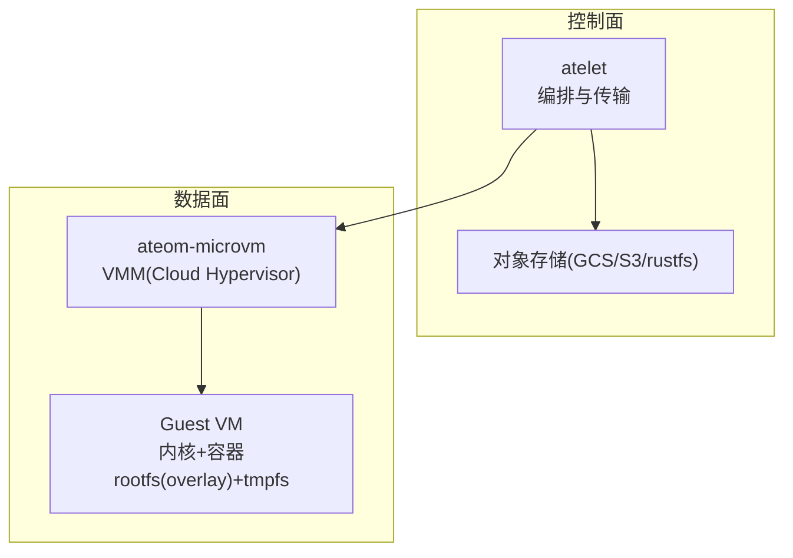
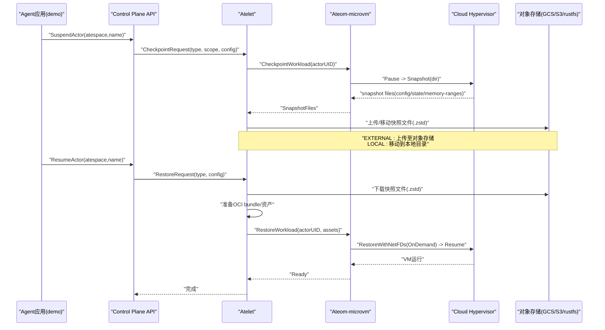
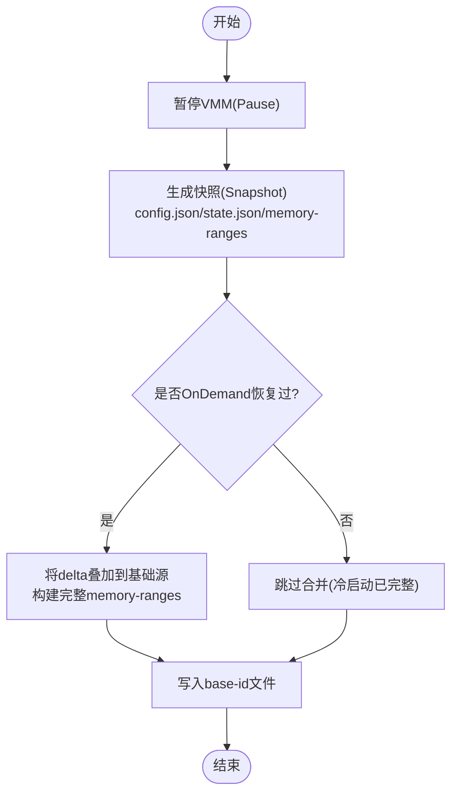
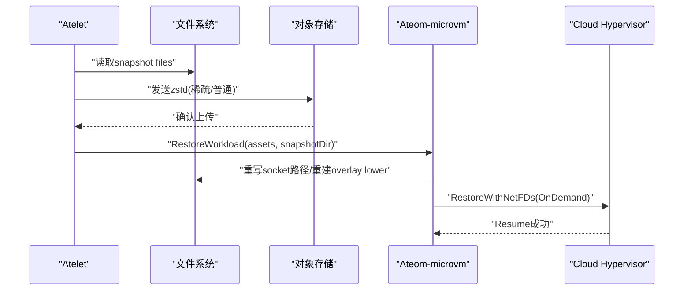
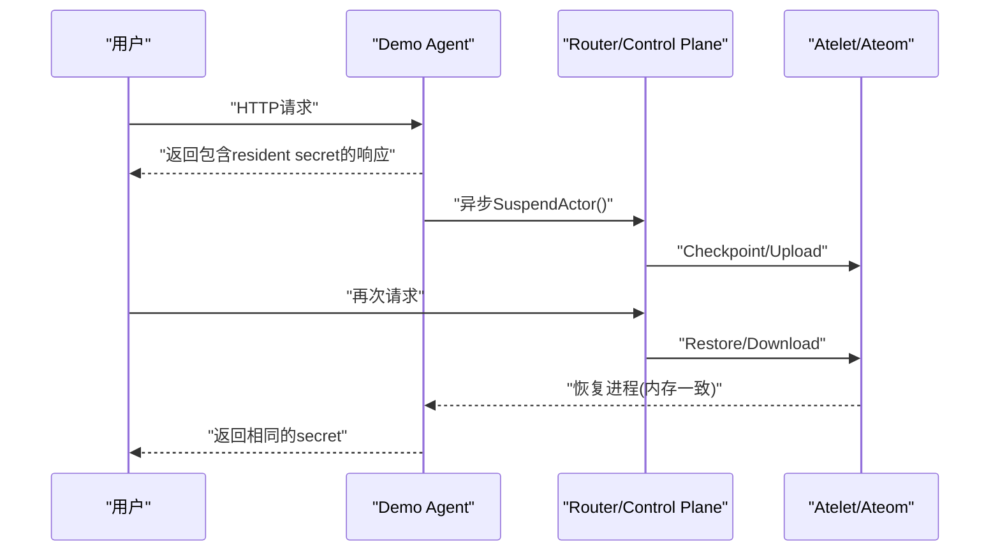
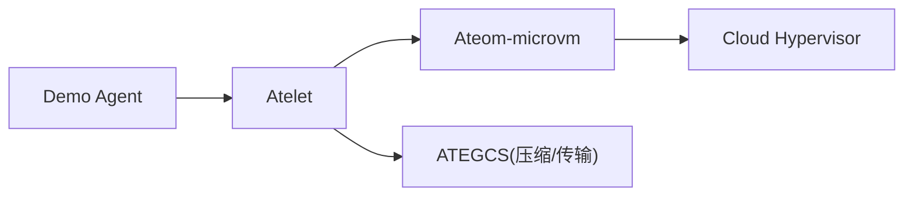

# 完整状态持久化

<cite>
**本文引用的文件**   
- [cmd/ateom-microvm/checkpoint.go](file://cmd/ateom-microvm/checkpoint.go)
- [cmd/ateom-microvm/restore.go](file://cmd/ateom-microvm/restore.go)
- [cmd/atelet/main.go](file://cmd/atelet/main.go)
- [cmd/atelet/internal/ategcs/sparsezstd.go](file://cmd/atelet/internal/ategcs/sparsezstd.go)
- [cmd/atelet/internal/ategcs/objects.go](file://cmd/atelet/internal/ategcs/objects.go)
- [internal/proto/ateletpb/atelet.pb.go](file://internal/proto/ateletpb/atelet.pb.go)
- [demos/agent-secret/main.go](file://demos/agent-secret/main.go)
- [demos/agent-secret/README.md](file://demos/agent-secret/README.md)
- [internal/e2e/suites/demo/demo_test.go](file://internal/e2e/suites/demo/demo_test.go)
</cite>

## 目录
1. [简介](#简介)
2. [项目结构](#项目结构)
3. [核心组件](#核心组件)
4. [架构总览](#架构总览)
5. [详细组件分析](#详细组件分析)
6. [依赖关系分析](#依赖关系分析)
7. [性能考量](#性能考量)
8. [故障排查指南](#故障排查指南)
9. [结论](#结论)
10. [附录](#附录)

## 简介
本技术文档聚焦于 Agent Substrate 的“完整状态持久化”能力，围绕进程内存快照与文件系统状态的保存、传输与恢复展开。内容涵盖：
- 内存快照与虚拟内存页面捕获机制（基于 Cloud Hypervisor 的 OnDemand 模式）
- 文件系统增量备份策略（overlay + tmpfs 写入在内存中，由内存快照一并持久化）
- checkpoint 与 restore 的端到端流程（压缩、分布式对象存储传输、一致性保证）
- Secret Agent Demo 对 volatile RAM 状态的精确保存与跨 suspend/resume 的一致性验证
- 性能基准数据与最佳实践建议

## 项目结构
与完整状态持久化相关的核心代码分布在以下模块：
- ateom-microvm：负责微虚拟机生命周期管理，执行暂停、快照、恢复等底层操作
- atelet：协调工作负载资源、下载/上传快照、准备 OCI bundle 并调用 ateom 完成实际恢复
- ategcs：实现稀疏 zstd 格式与对象存储传输（GCS/S3/rustfs），支持流式与缓冲两种上传路径
- demos/agent-secret：演示自挂起与可持久化的易失性内存身份
- internal/proto/ateletpb：定义外部/本地快照配置与范围等协议字段

图表来源
- [cmd/atelet/main.go:454-549](file://cmd/atelet/main.go#L454-L549)
- [cmd/ateom-microvm/checkpoint.go:44-154](file://cmd/ateom-microvm/checkpoint.go#L44-L154)
- [cmd/ateom-microvm/restore.go:52-207](file://cmd/ateom-microvm/restore.go#L52-L207)
- [cmd/atelet/internal/ategcs/objects.go:156-231](file://cmd/atelet/internal/ategcs/objects.go#L156-L231)

章节来源
- [cmd/atelet/main.go:454-549](file://cmd/atelet/main.go#L454-L549)
- [cmd/ateom-microvm/checkpoint.go:44-154](file://cmd/ateom-microvm/checkpoint.go#L44-L154)
- [cmd/ateom-microvm/restore.go:52-207](file://cmd/ateom-microvm/restore.go#L52-L207)
- [cmd/atelet/internal/ategcs/objects.go:156-231](file://cmd/atelet/internal/ategcs/objects.go#L156-L231)

## 核心组件
- ateom-microvm
  - CheckpointWorkload：暂停 VMM、生成快照（包含 config.json、state.json、memory-ranges）、合并 OnDemand delta 以构建完整快照、记录 baseID、清理资源
  - RestoreWorkload：重建 overlay RO lower、重配网络 tap FD、重写快照 socket 路径、OnDemand 恢复并 Resume、等待 readyz 就绪
- atelet
  - Checkpoint：调用 ateom 生成快照后，按类型（EXTERNAL/LOCAL）上传或移动快照文件，并写入 manifest
  - Restore：并发下载快照与准备 OCI bundle，再调用 ateom.RestoreWorkload 完成恢复
- ategcs
  - 稀疏 zstd 编码/解码：仅序列化非空洞区域，使用 SEEK_DATA/SEEK_HOLE 发现 extent，减少 I/O 与压缩时间
  - 上传策略：GCS 走流式管道（压缩与上传并行），S3/rustfs 走缓冲到临时文件（满足签名与 Content-Length 需求）
- demos/agent-secret
  - 启动时生成随机 secret 驻留于易失性内存；请求完成后自动调用 SuspendActor，展示零空闲与跨周期身份一致

章节来源
- [cmd/ateom-microvm/checkpoint.go:44-154](file://cmd/ateom-microvm/checkpoint.go#L44-L154)
- [cmd/ateom-microvm/restore.go:52-207](file://cmd/ateom-microvm/restore.go#L52-L207)
- [cmd/atelet/main.go:350-452](file://cmd/atelet/main.go#L350-L452)
- [cmd/atelet/internal/ategcs/sparsezstd.go:47-196](file://cmd/atelet/internal/ategcs/sparsezstd.go#L47-L196)
- [cmd/atelet/internal/ategcs/objects.go:156-231](file://cmd/atelet/internal/ategcs/objects.go#L156-L231)
- [demos/agent-secret/main.go:34-136](file://demos/agent-secret/main.go#L34-L136)

## 架构总览
下图展示了从应用触发挂起到恢复运行的关键交互：

图表来源
- [cmd/atelet/main.go:350-549](file://cmd/atelet/main.go#L350-L549)
- [cmd/ateom-microvm/checkpoint.go:44-154](file://cmd/ateom-microvm/checkpoint.go#L44-L154)
- [cmd/ateom-microvm/restore.go:52-207](file://cmd/ateom-microvm/restore.go#L52-L207)
- [cmd/atelet/internal/ategcs/objects.go:156-231](file://cmd/atelet/internal/ategcs/objects.go#L156-L231)

## 详细组件分析

### 组件一：内存快照与文件系统增量备份
- 内存快照
  - 通过 Cloud Hypervisor 的 Pause + Snapshot 接口生成 guest 内存镜像（memory-ranges）。为提升效率，采用 OnDemand 模式：首次恢复按需缺页，避免全量拷贝；再次挂起时将 OnDemand delta 叠加到基础源，形成完整的 memory-ranges，确保可独立恢复。
- 文件系统增量
  - 每个容器的 rootfs 采用 overlay：RO lower 来自 virtio-fs（只读，从 OCI 镜像重建），RW upper 是 guest 内的 tmpfs。所有 rootfs 写操作均发生在 tmpfs 中，被内存快照一并捕获，因此无需单独持久化磁盘层。
- 元数据与一致性
  - 快照目录包含 config.json、state.json、memory-ranges 以及 base-id 文件。base-id 用于在恢复时定位冻结的 golden ID，确保 overlay 路径与 guest 期望一致。

图表来源
- [cmd/ateom-microvm/checkpoint.go:68-123](file://cmd/ateom-microvm/checkpoint.go#L68-L123)
- [cmd/ateom-microvm/checkpoint.go:83-96](file://cmd/ateom-microvm/checkpoint.go#L83-L96)

章节来源
- [cmd/ateom-microvm/checkpoint.go:44-154](file://cmd/ateom-microvm/checkpoint.go#L44-L154)

### 组件二：checkpoint 与 restore 流程（压缩、传输、一致性）
- 压缩与传输
  - 针对大体积 memory-ranges（多为空洞），采用稀疏 zstd 格式：仅序列化非空洞区域，显著降低 I/O 与压缩时间。上传路径根据后端特性选择：
    - GCS：流式管道，压缩与上传并行，无中间文件
    - S3/rustfs：先压缩到可寻址临时文件，再 PutObject（需签名与 Content-Length）
- 一致性保证
  - 快照自描述：manifest 记录创建快照所需的沙箱二进制与快照文件清单，恢复时据此拉取相同版本资源，确保跨节点一致性
  - 路径重写：恢复前重写 snapshot 中的 vsock/serial/fs socket 路径，使其指向当前 actor 的 VMDir，避免引用旧节点路径
  - 网络重建：重新创建 tap FD 并通过 SCM_RIGHTS 传递给 CH，保持网络状态一致

图表来源
- [cmd/atelet/main.go:422-452](file://cmd/atelet/main.go#L422-L452)
- [cmd/atelet/internal/ategcs/sparsezstd.go:47-135](file://cmd/atelet/internal/ategcs/sparsezstd.go#L47-L135)
- [cmd/atelet/internal/ategcs/objects.go:183-231](file://cmd/atelet/internal/ategcs/objects.go#L183-L231)
- [cmd/ateom-microvm/restore.go:209-254](file://cmd/ateom-microvm/restore.go#L209-L254)

章节来源
- [cmd/atelet/main.go:350-549](file://cmd/atelet/main.go#L350-L549)
- [cmd/atelet/internal/ategcs/sparsezstd.go:137-196](file://cmd/atelet/internal/ategcs/sparsezstd.go#L137-L196)
- [cmd/atelet/internal/ategcs/objects.go:156-231](file://cmd/atelet/internal/ategcs/objects.go#L156-L231)
- [cmd/ateom-microvm/restore.go:52-207](file://cmd/ateom-microvm/restore.go#L52-L207)

### 组件三：Secret Agent Demo 的状态一致性验证
- 易失性内存身份
  - 进程启动时在易失性内存中生成唯一 secret，并在每次请求后自动调用 SuspendActor，进入休眠态
- 跨 suspend/resume 一致性
  - 由于整个 guest 内存（包括 tmpfs 与进程堆栈）被快照，恢复后同一 actor 返回的 identity 与上次一致，即使调度到不同物理节点

图表来源
- [demos/agent-secret/main.go:34-136](file://demos/agent-secret/main.go#L34-L136)
- [demos/agent-secret/README.md:1-93](file://demos/agent-secret/README.md#L1-L93)

章节来源
- [demos/agent-secret/main.go:34-136](file://demos/agent-secret/main.go#L34-L136)
- [demos/agent-secret/README.md:1-93](file://demos/agent-secret/README.md#L1-L93)

### 组件四：协议与配置要点
- ExternalCheckpointConfiguration
  - snapshot_uri_prefix：指定对象存储中快照数据的 URI 前缀，便于跨节点恢复时定位快照与 manifest
- LocalCheckpointConfiguration
  - snapshot_prefix：本地快照目录前缀，配合 manifest 实现自描述恢复
- SnapshotScope
  - FULL/DATA：控制快照范围（例如仅数据或完整状态），影响 checkpoint 行为与恢复粒度

章节来源
- [internal/proto/ateletpb/atelet.pb.go:1003-1038](file://internal/proto/ateletpb/atelet.pb.go#L1003-L1038)

## 依赖关系分析
- atelet 依赖 ategcs 进行压缩与对象存储传输，依赖 ateom 执行具体 VMM 操作
- ateom-microvm 依赖 Cloud Hypervisor 提供 Pause/Snapshot/Restore/Resume 能力
- demo agent 通过 Control Plane API 触发挂起，间接驱动 atelet/ateom 的 checkpoint/restore 流程

图表来源
- [cmd/atelet/main.go:350-549](file://cmd/atelet/main.go#L350-L549)
- [cmd/ateom-microvm/checkpoint.go:44-154](file://cmd/ateom-microvm/checkpoint.go#L44-L154)
- [cmd/atelet/internal/ategcs/objects.go:156-231](file://cmd/atelet/internal/ategcs/objects.go#L156-L231)

章节来源
- [cmd/atelet/main.go:350-549](file://cmd/atelet/main.go#L350-L549)
- [cmd/ateom-microvm/checkpoint.go:44-154](file://cmd/ateom-microvm/checkpoint.go#L44-L154)
- [cmd/atelet/internal/ategcs/objects.go:156-231](file://cmd/atelet/internal/ategcs/objects.go#L156-L231)

## 性能考量
- 内存快照
  - OnDemand 恢复显著降低首次恢复延迟（约几十毫秒级 vs 秒级 eager），并保持 memfd SPARSE，避免后续挂起时的全量扫描
  - 合并 OnDemand delta 到基础源，确保下次挂起能高效生成完整快照
- 压缩与传输
  - 稀疏 zstd 仅序列化非空洞区域，结合 SEEK_DATA/SEEK_HOLE 大幅减少 I/O 与 CPU 占用
  - GCS 流式上传使压缩与网络 PUT 并行，提高吞吐；S3/rustfs 因 SDK 限制采用缓冲路径
- 并发优化
  - 恢复阶段并发下载快照与准备 OCI bundle，隐藏较长路径的开销
- 基准参考
  - 文档注释与测试用例显示：OnDemand 恢复约 ~75ms，eager 约 ~1.8s；稀疏上传在逻辑大小远大于实际数据时具备明显优势

章节来源
- [cmd/ateom-microvm/restore.go:164-176](file://cmd/ateom-microvm/restore.go#L164-L176)
- [cmd/atelet/internal/ategcs/sparsezstd.go:47-135](file://cmd/atelet/internal/ategcs/sparsezstd.go#L47-L135)
- [cmd/atelet/main.go:506-541](file://cmd/atelet/main.go#L506-L541)

## 故障排查指南
- 常见错误分类与处理
  - 失败保存快照：当外部快照上传失败且未缓存时，标记 Actor 为 CRASHED，以便上层重试或告警
  - 终端文件系统错误：如本地快照 manifest 缺失或不可读，应视为严重错误并上报
  - 无效对象URL/获取外部对象失败：检查 snapshot_uri_prefix 与权限
- 诊断建议
  - 查看 snapshot manifest 是否完整（包含 snapshot_files 与 sandbox 资产清单）
  - 校验 sparse zstd 格式版本与 totalSize，确保兼容性与完整性
  - 观察 OnDemand 恢复日志，确认 delta 合并与 resume 成功

章节来源
- [cmd/atelet/main.go:360-379](file://cmd/atelet/main.go#L360-L379)
- [cmd/atelet/main.go:480-504](file://cmd/atelet/main.go#L480-L504)
- [cmd/atelet/internal/ategcs/sparsezstd.go:141-196](file://cmd/atelet/internal/ategcs/sparsezstd.go#L141-L196)

## 结论
Agent Substrate 通过 Cloud Hypervisor 的内存快照与 overlay/tmpfs 的文件系统策略，实现了跨进程的完整状态持久化。借助稀疏 zstd 压缩与对象存储的高效传输，系统在大规模多租户场景下仍能保持低延迟与高吞吐。Secret Agent Demo 验证了易失性内存身份的跨周期一致性，证明系统并非简单重启容器，而是真正“复活”了运行中的进程。

## 附录
- 最佳实践
  - 优先使用 EXTERNAL 快照并结合对象存储，以实现跨节点弹性恢复
  - 合理设置 SnapshotScope：高频短任务可使用 DATA 范围，长会话使用 FULL
  - 监控 OnDemand 恢复与 delta 合并耗时，评估是否需要调整资源池规模
- 相关测试与示例
  - e2e 测试覆盖不同 onCommit/onPause 快照范围组合下的内存与文件状态一致性

章节来源
- [internal/e2e/suites/demo/demo_test.go:97-133](file://internal/e2e/suites/demo/demo_test.go#L97-L133)
