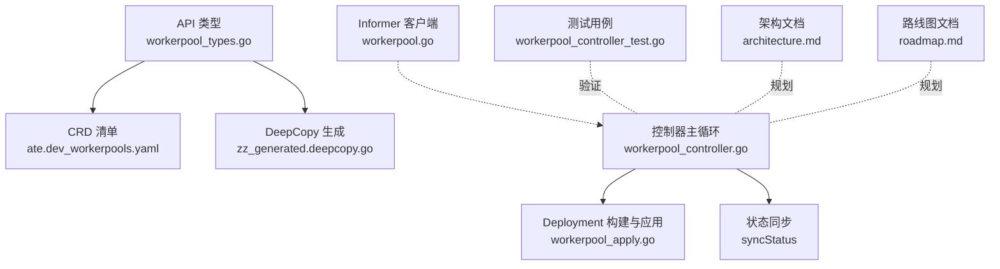
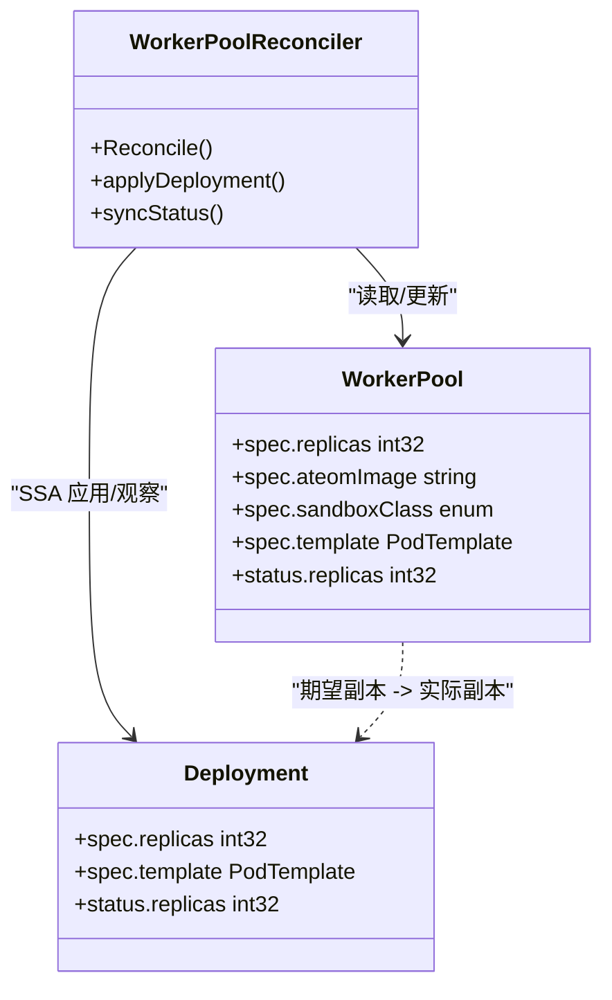
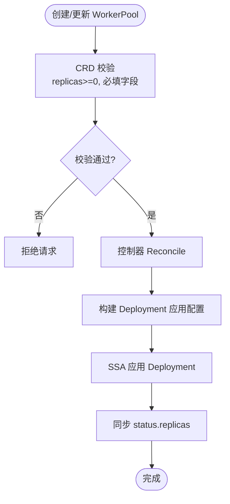
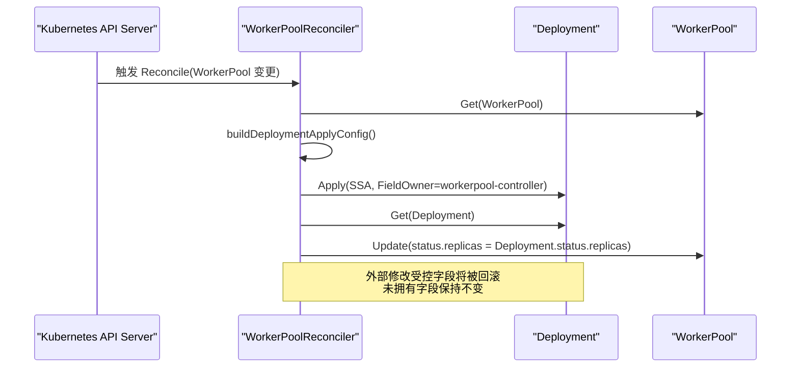
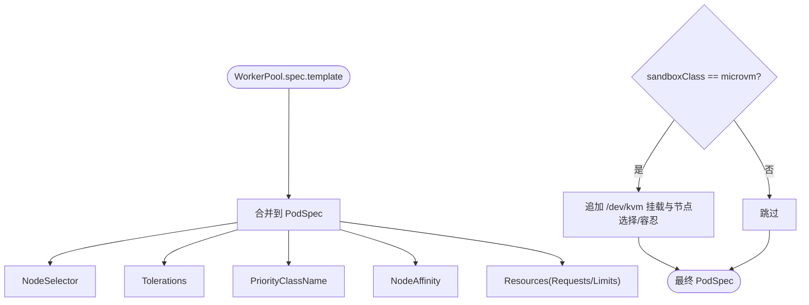
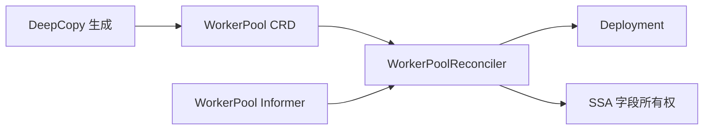

# 智能自动扩缩容

<cite>
**本文引用的文件**   
- [workerpool_types.go](file://pkg/api/v1alpha1/workerpool_types.go)
- [workerpool_controller.go](file://cmd/atecontroller/internal/controllers/workerpool_controller.go)
- [workerpool_apply.go](file://cmd/atecontroller/internal/controllers/workerpool_apply.go)
- [workerpool_controller_test.go](file://cmd/atecontroller/internal/controllers/workerpool_controller_test.go)
- [workerpool_validation_test.go](file://pkg/api/v1alpha1/workerpool_validation_test.go)
- [zz_generated.deepcopy.go](file://pkg/api/v1alpha1/zz_generated.deepcopy.go)
- [workerpool.go（informers）](file://pkg/client/informers/externalversions/api/v1alpha1/workerpool.go)
- [ate.dev_workerpools.yaml（CRD）](file://manifests/ate-install/generated/ate.dev_workerpools.yaml)
- [architecture.md](file://docs/architecture.md)
- [roadmap.md](file://docs/roadmap.md)
</cite>

## 目录
1. [简介](#简介)
2. [项目结构](#项目结构)
3. [核心组件](#核心组件)
4. [架构总览](#架构总览)
5. [详细组件分析](#详细组件分析)
6. [依赖关系分析](#依赖关系分析)
7. [性能与扩缩容特性](#性能与扩缩容特性)
8. [故障排查指南](#故障排查指南)
9. [结论](#结论)
10. [附录](#附录)

## 简介
本文件聚焦于 Agent Substrate 的“工作节点池”能力与自动扩缩容相关设计。当前实现通过 WorkerPool 自定义资源声明期望副本数，并由 atecontroller 控制器将其同步为 Kubernetes Deployment，从而管理一组“预热”的工作节点 Pod（Worker）。这些 Worker 作为承载 Actor 的沙箱容器宿主，处于待命状态，等待控制面分配任务并快速恢复执行。

关于“智能自动扩缩容”：
- 当前仓库未包含基于指标（如 CPU、内存、Actor 数量）的自动扩缩容控制器或算法实现。
- 文档中明确将“Worker 水平自动扩缩容”列为路线图中的高优先级目标，表明该能力将在后续迭代引入。
- 现有机制支持通过更新 spec.replicas 进行手动扩缩容，并通过 status.replicas 观测实际运行副本数；同时提供 scale 子资源以适配外部扩缩容器（例如 HPA）在将来集成。

本节不直接分析具体代码文件，因此无“章节来源”。

## 项目结构
围绕 WorkerPool 的关键位置如下：
- API 类型定义与 CRD 生成注解位于 pkg/api/v1alpha1/workerpool_types.go
- 控制器实现位于 cmd/atecontroller/internal/controllers/workerpool_controller.go 与 workerpool_apply.go
- 单元测试覆盖创建、副本同步、SSA 字段所有权、模板传播等场景
- CRD 清单位于 manifests/ate-install/generated/ate.dev_workerpools.yaml
- Informer 客户端位于 pkg/client/informers/externalversions/api/v1alpha1/workerpool.go
- 架构与路线图文档对自动扩缩容有规划性说明

图表来源
- [workerpool_types.go:1-136](file://pkg/api/v1alpha1/workerpool_types.go#L1-L136)
- [workerpool_controller.go:1-121](file://cmd/atecontroller/internal/controllers/workerpool_controller.go#L1-L121)
- [workerpool_apply.go:1-245](file://cmd/atecontroller/internal/controllers/workerpool_apply.go#L1-L245)
- [workerpool_controller_test.go:1-620](file://cmd/atecontroller/internal/controllers/workerpool_controller_test.go#L1-L620)
- [workerpool.go（informers）:40-51](file://pkg/client/informers/externalversions/api/v1alpha1/workerpool.go#L40-L51)
- [ate.dev_workerpools.yaml:1-438](file://manifests/ate-install/generated/ate.dev_workerpools.yaml#L1-L438)
- [architecture.md:220-230](file://docs/architecture.md#L220-L230)
- [roadmap.md:24-26](file://docs/roadmap.md#L24-L26)

章节来源
- [workerpool_types.go:1-136](file://pkg/api/v1alpha1/workerpool_types.go#L1-L136)
- [workerpool_controller.go:1-121](file://cmd/atecontroller/internal/controllers/workerpool_controller.go#L1-L121)
- [workerpool_apply.go:1-245](file://cmd/atecontroller/internal/controllers/workerpool_apply.go#L1-L245)
- [workerpool_controller_test.go:1-620](file://cmd/atecontroller/internal/controllers/workerpool_controller_test.go#L1-L620)
- [workerpool.go（informers）:40-51](file://pkg/client/informers/externalversions/api/v1alpha1/workerpool.go#L40-L51)
- [ate.dev_workerpools.yaml:1-438](file://manifests/ate-install/generated/ate.dev_workerpools.yaml#L1-L438)
- [architecture.md:220-230](file://docs/architecture.md#L220-L230)
- [roadmap.md:24-26](file://docs/roadmap.md#L24-L26)

## 核心组件
- WorkerPool 自定义资源
  - 描述一个“预热”工作节点池，包含期望副本数、沙箱类、镜像、以及可选的 Pod 调度与资源配置模板。
  - 暴露 status.replicas 用于观测实际运行副本数。
  - 通过 kubebuilder 注解启用 subresource:scale，便于未来与外部扩缩容器对接。
- WorkerPoolReconciler 控制器
  - 监听 WorkerPool 变更，使用 SSA（Server-Side Apply）应用 Deployment，确保字段所有权清晰且可被外部修改的未拥有字段保留。
  - 同步 Deployment 的 status.replicas 到 WorkerPool.status.replicas。
- apply 配置构建
  - 根据 WorkerPool.spec.template 合成 Pod 的 nodeSelector、tolerations、priorityClassName、nodeAffinity、resources 等。
  - 针对 microvm 沙箱类追加 /dev/kvm 挂载与节点选择约束。
- Informer 客户端
  - 提供 WorkerPool 的共享索引 Informer，降低内存占用与连接数。
- CRD 清单
  - 由 kubebuilder 生成，包含 OpenAPI v3 schema、打印列、subresource 等元信息。

章节来源
- [workerpool_types.go:22-96](file://pkg/api/v1alpha1/workerpool_types.go#L22-L96)
- [workerpool_types.go:98-136](file://pkg/api/v1alpha1/workerpool_types.go#L98-L136)
- [workerpool_controller.go:35-121](file://cmd/atecontroller/internal/controllers/workerpool_controller.go#L35-L121)
- [workerpool_apply.go:27-83](file://cmd/atecontroller/internal/controllers/workerpool_apply.go#L27-L83)
- [workerpool_apply.go:85-130](file://cmd/atecontroller/internal/controllers/workerpool_apply.go#L85-L130)
- [workerpool_apply.go:132-166](file://cmd/atecontroller/internal/controllers/workerpool_apply.go#L132-L166)
- [workerpool.go（informers）:40-51](file://pkg/client/informers/externalversions/api/v1alpha1/workerpool.go#L40-L51)
- [ate.dev_workerpools.yaml:33-438](file://manifests/ate-install/generated/ate.dev_workerpools.yaml#L33-L438)

## 架构总览
下图展示了 WorkerPool 与其管理的 Deployment 的关系，以及控制器在其中的职责边界。

图表来源
- [workerpool_types.go:98-136](file://pkg/api/v1alpha1/workerpool_types.go#L98-L136)
- [workerpool_controller.go:47-112](file://cmd/atecontroller/internal/controllers/workerpool_controller.go#L47-L112)
- [workerpool_apply.go:27-83](file://cmd/atecontroller/internal/controllers/workerpool_apply.go#L27-L83)

## 详细组件分析

### WorkerPool 自定义资源模型
- 关键字段
  - spec.replicas：期望的 Worker Pod 数量（最小值 0）
  - spec.ateomImage：Worker 容器镜像
  - spec.sandboxClass：gvisor 或 microvm，影响 Pod 形状与节点放置
  - spec.template：Pod 调度与资源模板（nodeSelector、tolerations、priorityClassName、nodeAffinity、resources）
  - status.replicas：实际运行的副本数
- 扩展点
  - subresource:scale 已启用，便于未来接入 HPA 或其他扩缩容控制器
- 校验
  - replicas 非负校验由 CRD 约束保证
  - 单元测试覆盖负数拒绝行为

图表来源
- [workerpool_types.go:54-96](file://pkg/api/v1alpha1/workerpool_types.go#L54-L96)
- [workerpool_types.go:98-136](file://pkg/api/v1alpha1/workerpool_types.go#L98-L136)
- [workerpool_controller.go:73-112](file://cmd/atecontroller/internal/controllers/workerpool_controller.go#L73-L112)
- [workerpool_validation_test.go:27-39](file://pkg/api/v1alpha1/workerpool_validation_test.go#L27-L39)

章节来源
- [workerpool_types.go:22-96](file://pkg/api/v1alpha1/workerpool_types.go#L22-L96)
- [workerpool_types.go:98-136](file://pkg/api/v1alpha1/workerpool_types.go#L98-L136)
- [workerpool_validation_test.go:27-39](file://pkg/api/v1alpha1/workerpool_validation_test.go#L27-L39)

### 控制器实现与 SSA 字段所有权
- 生命周期
  - 获取 WorkerPool，处理删除标记
  - 调用 applyDeployment 使用 SSA 应用 Deployment
  - 读取 Deployment 并同步 status.replicas
- 字段所有权
  - 控制器仅声明其拥有的字段，其他字段（如 revisionHistoryLimit）不受影响
  - 若外部修改了控制器拥有的字段（如 replicas），下次 Reconcile 会回滚至期望值
- 事件源
  - For(WorkerPool) 与 Owns(Deployment) 触发 Reconcile

图表来源
- [workerpool_controller.go:47-112](file://cmd/atecontroller/internal/controllers/workerpool_controller.go#L47-L112)
- [workerpool_apply.go:27-83](file://cmd/atecontroller/internal/controllers/workerpool_apply.go#L27-L83)
- [workerpool_controller_test.go:241-269](file://cmd/atecontroller/internal/controllers/workerpool_controller_test.go#L241-L269)

章节来源
- [workerpool_controller.go:47-112](file://cmd/atecontroller/internal/controllers/workerpool_controller.go#L47-L112)
- [workerpool_apply.go:27-83](file://cmd/atecontroller/internal/controllers/workerpool_apply.go#L27-L83)
- [workerpool_controller_test.go:208-269](file://cmd/atecontroller/internal/controllers/workerpool_controller_test.go#L208-L269)

### 模板与沙箱类映射
- 模板字段
  - nodeSelector、tolerations、priorityClassName、nodeAffinity、resources 均会被合并到 Pod 模板
- microvm 特殊处理
  - 当 sandboxClass=microvm 时，控制器会追加 /dev/kvm 挂载与节点选择/污点容忍，以确保调度到具备 KVM 能力的节点
- 资源预留
  - 通过 template.resources.requests/limits 设置每个 Worker Pod 的资源需求与上限，有助于集群调度与配额控制

图表来源
- [workerpool_apply.go:132-166](file://cmd/atecontroller/internal/controllers/workerpool_apply.go#L132-L166)
- [workerpool_apply.go:85-130](file://cmd/atecontroller/internal/controllers/workerpool_apply.go#L85-L130)

章节来源
- [workerpool_apply.go:132-166](file://cmd/atecontroller/internal/controllers/workerpool_apply.go#L132-L166)
- [workerpool_apply.go:85-130](file://cmd/atecontroller/internal/controllers/workerpool_apply.go#L85-L130)

### 扩缩容现状与未来路径
- 现状
  - 当前未实现基于指标的自动扩缩容逻辑
  - 可通过更新 spec.replicas 进行手动扩缩容
  - 已启用 subresource:scale，为未来集成 HPA 或其他扩缩容器预留接口
- 路线图
  - “Worker 水平自动扩缩容”被列为高优先级目标，旨在快速扩容节点与预热 Pod 以满足 Actor 需求
  - 架构文档指出需要依据需求自动调整 Worker 数量，可能结合 K8s Pod 自动扩缩容或自有策略

章节来源
- [workerpool_types.go:104-107](file://pkg/api/v1alpha1/workerpool_types.go#L104-L107)
- [roadmap.md:24-26](file://docs/roadmap.md#L24-L26)
- [architecture.md:130-132](file://docs/architecture.md#L130-L132)

## 依赖关系分析
- 控制器依赖
  - 读取 WorkerPool CRD
  - 管理 Deployment（创建/更新/删除）
  - 使用 SSA 与 FieldOwner 维护字段所有权
- 客户端与 Informer
  - 通过 shared informer 监听 WorkerPool 变更，减少内存与连接开销
- 生成代码
  - DeepCopy 函数由工具生成，保障对象拷贝一致性

图表来源
- [workerpool_controller.go:115-121](file://cmd/atecontroller/internal/controllers/workerpool_controller.go#L115-L121)
- [workerpool_apply.go:27-83](file://cmd/atecontroller/internal/controllers/workerpool_apply.go#L27-L83)
- [workerpool.go（informers）:40-51](file://pkg/client/informers/externalversions/api/v1alpha1/workerpool.go#L40-L51)
- [zz_generated.deepcopy.go:532-604](file://pkg/api/v1alpha1/zz_generated.deepcopy.go#L532-L604)

章节来源
- [workerpool_controller.go:115-121](file://cmd/atecontroller/internal/controllers/workerpool_controller.go#L115-L121)
- [workerpool_apply.go:27-83](file://cmd/atecontroller/internal/controllers/workerpool_apply.go#L27-L83)
- [workerpool.go（informers）:40-51](file://pkg/client/informers/externalversions/api/v1alpha1/workerpool.go#L40-L51)
- [zz_generated.deepcopy.go:532-604](file://pkg/api/v1alpha1/zz_generated.deepcopy.go#L532-L604)

## 性能与扩缩容特性
- 当前能力
  - 通过 spec.replicas 精确控制 Worker 数量
  - 使用 SSA 避免不必要的冲突与覆盖，提升并发稳定性
  - 通过 status.replicas 观测真实运行副本数
- 资源预留与调度
  - 借助 template.resources.requests/limits 为每个 Worker 设定资源需求与上限，有利于集群调度与容量规划
  - 通过 nodeSelector/tolerations/nodeAffinity 将 Worker 调度到合适节点，提高可用性
- 未来自动扩缩容
  - 路线图明确计划实现 Worker 水平自动扩缩容，以快速响应 Actor 负载变化
  - 架构文档建议结合需求自动调整 Worker 数量，可能采用 K8s Pod 自动扩缩容或自研策略
- 指标与预测（规划阶段）
  - 尚未实现基于 CPU、内存、Actor 数量的自动扩缩容算法
  - 建议在后续设计中考虑：
    - 指标采集：CPU/内存利用率、队列长度、激活延迟、失败率
    - 预测算法：滑动窗口+趋势外推或简单阈值+冷却时间
    - 扩容策略：分批扩容、预热策略、亲和性与拓扑感知
    - 缩容策略：优先缩容空闲/低利用率的 Worker，避免抖动

本节为通用指导，不涉及具体代码文件，因此无“章节来源”。

## 故障排查指南
- 常见问题定位
  - 副本不一致：检查 WorkerPool.spec.replicas 与 Deployment.spec.replicas 是否一致；确认控制器是否成功 Reconcile
  - 外部篡改被回滚：若外部修改了控制器拥有的字段（如 replicas），控制器会在下一次 Reconcile 回滚
  - 模板未生效：确认 template 字段是否正确传递到 Pod 模板；microvm 场景需确保节点具备 KVM 能力
- 参考测试用例
  - 副本更新传播、镜像更新传播、SSA 保留未拥有字段、SSA 回滚拥有字段、删除重建、状态同步等

章节来源
- [workerpool_controller_test.go:146-175](file://cmd/atecontroller/internal/controllers/workerpool_controller_test.go#L146-L175)
- [workerpool_controller_test.go:177-206](file://cmd/atecontroller/internal/controllers/workerpool_controller_test.go#L177-L206)
- [workerpool_controller_test.go:208-269](file://cmd/atecontroller/internal/controllers/workerpool_controller_test.go#L208-L269)
- [workerpool_controller_test.go:271-297](file://cmd/atecontroller/internal/controllers/workerpool_controller_test.go#L271-L297)
- [workerpool_controller_test.go:299-325](file://cmd/atecontroller/internal/controllers/workerpool_controller_test.go#L299-L325)

## 结论
- 当前实现提供了稳定的 WorkerPool 管理能力：声明式副本、SSA 字段所有权、模板与沙箱类映射、状态同步。
- 自动扩缩容尚未实现，但已在架构与路线图中明确规划，且已预留 scale 子资源以便未来集成。
- 建议在生产环境中先通过手动扩缩容与资源预留策略稳定运行，随后逐步引入基于指标的自动扩缩容与预测算法，以实现更敏捷的弹性伸缩。

本节为总结性内容，不涉及具体代码文件，因此无“章节来源”。

## 附录
- 关键配置项速览
  - spec.replicas：期望副本数（最小 0）
  - spec.ateomImage：Worker 容器镜像
  - spec.sandboxClass：gvisor 或 microvm
  - spec.template.nodeSelector/tolerations/priorityClassName/nodeAffinity/resources：调度与资源模板
  - status.replicas：实际运行副本数
- 常用操作
  - 查看 WorkerPool 列表与副本数：kubectl get workerpool
  - 更新副本数：kubectl patch workerpool <name> -p '{"spec":{"replicas":N}}'
  - 查看状态：kubectl get workerpool <name> -o jsonpath='{.status.replicas}'

本节为补充说明，不涉及具体代码文件，因此无“章节来源”。
