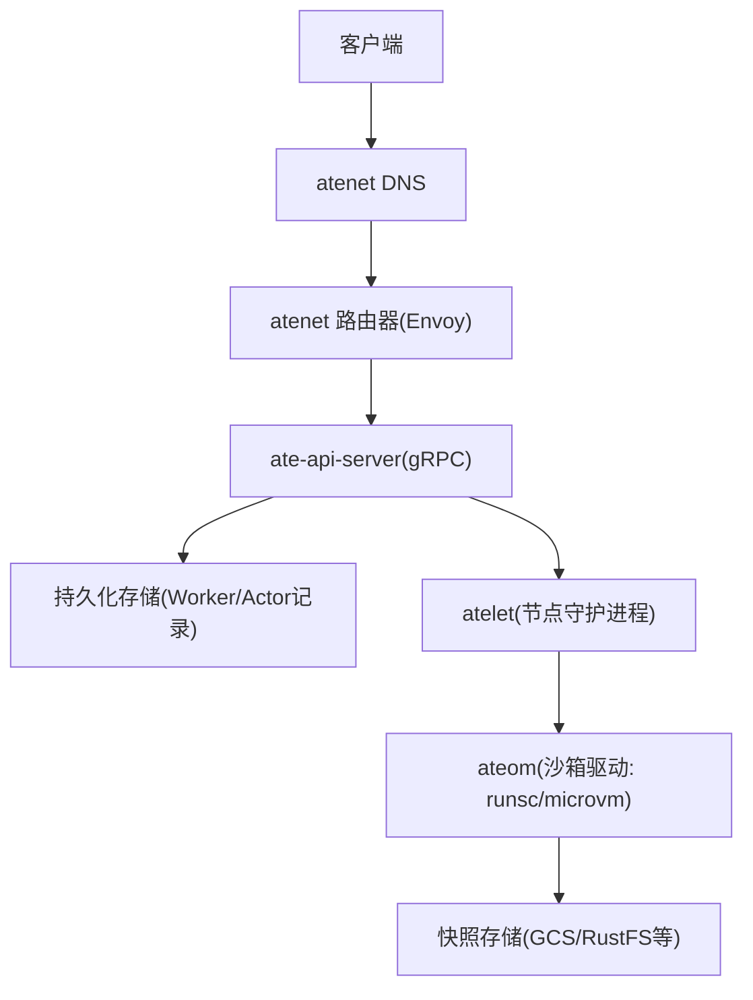
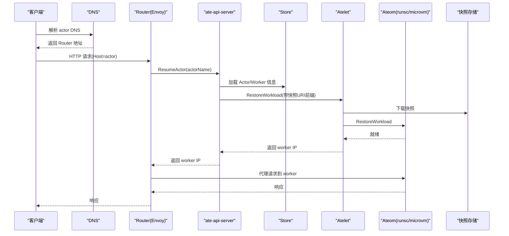
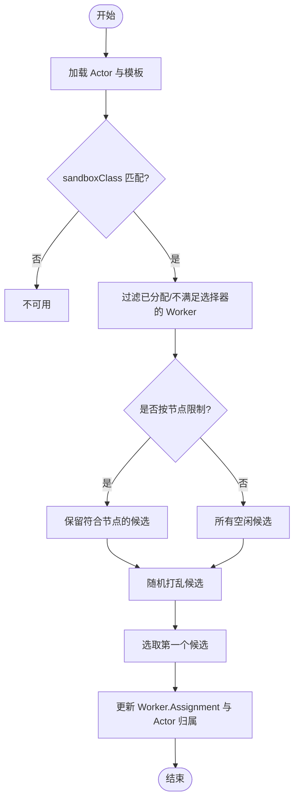
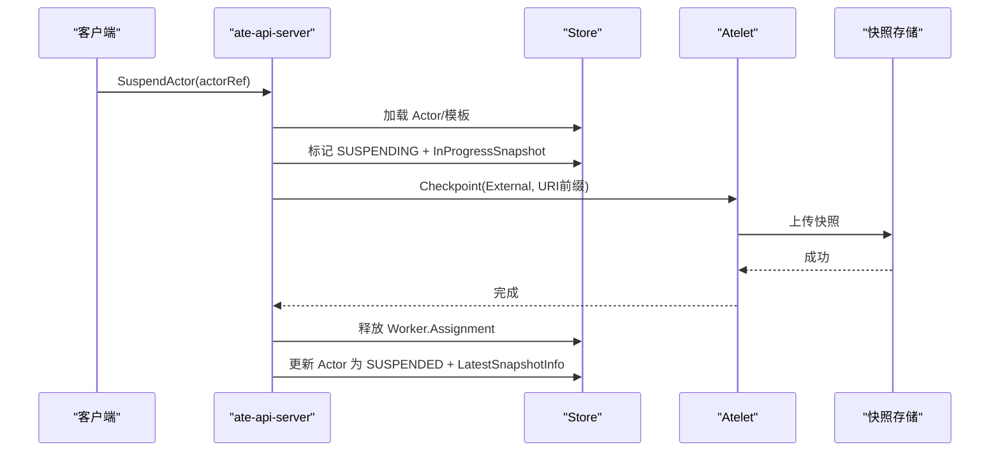
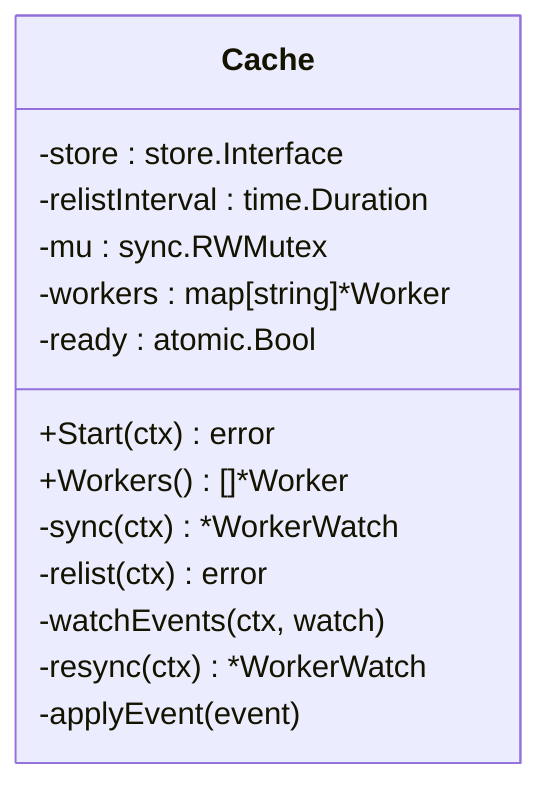
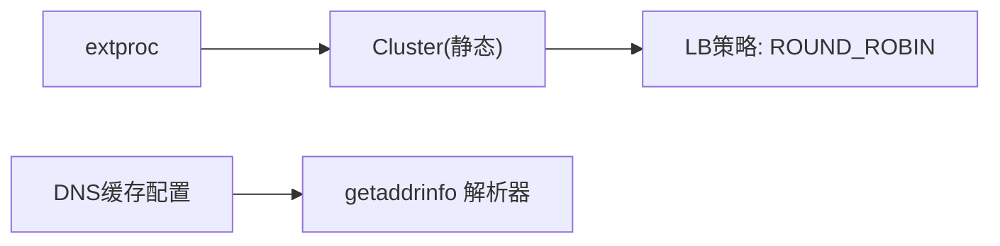
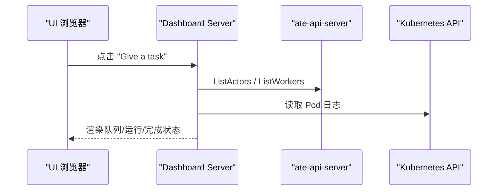
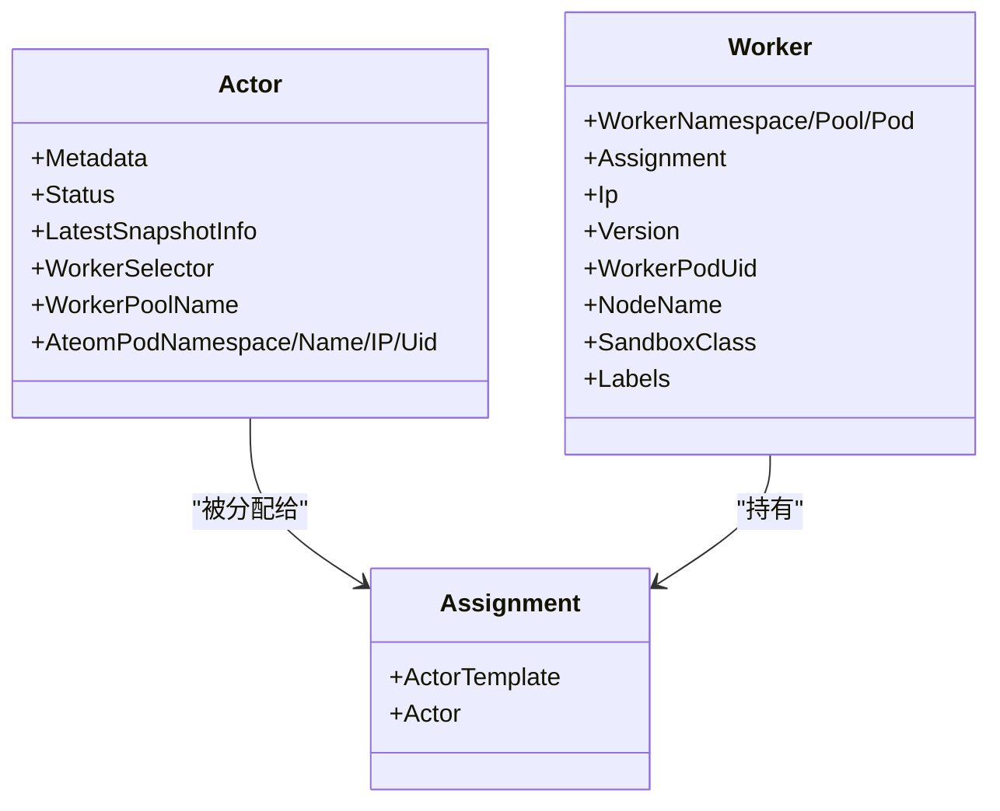

# 高并发多路复用

<cite>
**本文引用的文件**   
- [README.md](file://README.md)
- [architecture.md](file://docs/architecture.md)
- [api-guide.md](file://docs/api-guide.md)
- [glossary.md](file://docs/glossary.md)
- [workflow_resume.go](file://cmd/ateapi/internal/controlapi/workflow_resume.go)
- [workflow_suspend.go](file://cmd/ateapi/internal/controlapi/workflow_suspend.go)
- [workercache.go](file://cmd/ateapi/internal/workercache/workercache.go)
- [crash.go](file://cmd/ateapi/internal/controlapi/crash.go)
- [xds.go](file://cmd/atenet/internal/router/xds.go)
- [server.go](file://demos/claude-code-multiplex/ui/server.go)
- [README.md（Claude Code Multiplex Demo）](file://demos/claude-code-multiplex/README.md)
- [sleep.py](file://benchmarking/locust/tests/sleep.py)
- [kernelmem.py](file://benchmarking/locust/tests/kernelmem.py)
- [usermem.py](file://benchmarking/locust/tests/usermem.py)
- [ate_api.py](file://benchmarking/locust/tests/ate_api.py)
</cite>

## 目录
1. [简介](#简介)
2. [项目结构](#项目结构)
3. [核心组件](#核心组件)
4. [架构总览](#架构总览)
5. [详细组件分析](#详细组件分析)
6. [依赖关系分析](#依赖关系分析)
7. [性能与超分特性](#性能与超分特性)
8. [故障排查指南](#故障排查指南)
9. [结论](#结论)
10. [附录](#附录)

## 简介
本技术文档聚焦于 Agent Substrate 的高并发多路复用能力，解释如何将大量有状态 Actor（应用实例）映射到少量物理 Worker（Kubernetes Pod），实现显著的资源超分比。文档涵盖：
- idle 检测与自休眠机制
- 动态分配算法与负载均衡策略
- 基于快照的挂起/恢复流程
- Claude Code Multiplex Demo 的实践路径与可观测性
- 性能指标、最佳实践与调优建议

## 项目结构
Agent Substrate 在 Kubernetes 之上运行，控制面通过 ate-api-server 暴露 gRPC API，节点侧由 atelet 守护进程管理 worker pod 上的工作负载生命周期；网络层 atenet 提供 DNS 与 Envoy 路由，将请求路由至目标 actor 所在的 worker。

图表来源
- [architecture.md:353-396](file://docs/architecture.md#L353-L396)
- [api-guide.md:246-311](file://docs/api-guide.md#L246-L311)

章节来源
- [README.md:1-225](file://README.md#L1-L225)
- [architecture.md:353-396](file://docs/architecture.md#L353-L396)
- [api-guide.md:1-311](file://docs/api-guide.md#L1-L311)

## 核心组件
- 控制面（ate-api-server）
  - 暴露 ResumeActor/SuspendActor/ListWorkers 等 gRPC 接口
  - 维护 Actor/Worker 记录，协调调度与快照
- 节点面（atelet + ateom）
  - 负责在 worker pod 内执行 Run/Restore/Checkpoint
  - 与沙箱运行时交互（gVisor runsc 或 microvm）
- 网络面（atenet）
  - DNS 解析与 Envoy 扩展处理，按 Host 路由到具体 actor
- 缓存与调度
  - workercache 维护 Worker 内存视图，支持 O(1) 读取与事件同步
  - AssignWorkerStep 实现选择器匹配与随机均衡

章节来源
- [api-guide.md:246-311](file://docs/api-guide.md#L246-L311)
- [workercache.go:1-200](file://cmd/ateapi/internal/workercache/workercache.go#L1-L200)
- [workflow_resume.go:142-294](file://cmd/ateapi/internal/controlapi/workflow_resume.go#L142-L294)

## 架构总览
下图展示一次“从挂起到恢复”的端到端调用链，体现多路复用的关键路径：网络入口、控制面决策、节点面恢复、快照存取。

图表来源
- [architecture.md:353-396](file://docs/architecture.md#L353-L396)

章节来源
- [architecture.md:353-396](file://docs/architecture.md#L353-L396)

## 详细组件分析

### 动态分配与负载均衡（AssignWorkerStep）
- 选择器匹配
  - 模板 sandboxClass 必须与 worker 一致
  - 模板 workerSelector 与 actor 的 worker_selector 共同决定候选池
- 空闲筛选与亲和约束
  - 仅考虑 Assignment 为空的 worker
  - 可选按节点名限制（本地快照优先）
- 负载均衡
  - 候选集随机打乱后取首个，避免热点
- 幂等与回滚
  - 若之前失败导致 worker 被错误占用，会尝试释放并重新选择
  - 更新 Worker.Assignment 与 Actor 的归属字段，进入 RESUMING

图表来源
- [workflow_resume.go:119-140](file://cmd/ateapi/internal/controlapi/workflow_resume.go#L119-L140)
- [workflow_resume.go:263-294](file://cmd/ateapi/internal/controlapi/workflow_resume.go#L263-L294)

章节来源
- [workflow_resume.go:142-294](file://cmd/ateapi/internal/controlapi/workflow_resume.go#L142-L294)

### 挂起流程（SuspendActor）
- 前置检查
  - 仅允许 RUNNING -> SUSPENDING
- 标记挂起
  - 写入 InProgressSnapshot 标识，防止重复
- 调用 Atelet Checkpoint
  - 将当前内存/文件系统状态落盘到外部存储
  - 若 worker 消失或失败，触发 crashActor 清理
- 收尾
  - 释放 Worker.Assignment
  - 更新 Actor 状态为 SUSPENDED，并记录 LatestSnapshotInfo

图表来源
- [workflow_suspend.go:79-104](file://cmd/ateapi/internal/controlapi/workflow_suspend.go#L79-L104)
- [workflow_suspend.go:108-168](file://cmd/ateapi/internal/controlapi/workflow_suspend.go#L108-L168)
- [workflow_suspend.go:172-247](file://cmd/ateapi/internal/controlapi/workflow_suspend.go#L172-L247)

章节来源
- [workflow_suspend.go:48-247](file://cmd/ateapi/internal/controlapi/workflow_suspend.go#L48-L247)

### Worker 缓存（workercache）
- 作用
  - 维护 Worker 的内存视图，供调度快速读取
- 一致性
  - 初始全量 relist，随后通过 WatchWorkers 增量更新
  - 周期性重拉取以修复丢失事件导致的漂移
- 可用性
  - ready 标志保护短暂断连窗口，调用方需重试

图表来源
- [workercache.go:37-90](file://cmd/ateapi/internal/workercache/workercache.go#L37-L90)
- [workercache.go:92-127](file://cmd/ateapi/internal/workercache/workercache.go#L92-L127)
- [workercache.go:129-180](file://cmd/ateapi/internal/workercache/workercache.go#L129-L180)

章节来源
- [workercache.go:1-200](file://cmd/ateapi/internal/workercache/workercache.go#L1-L200)

### 网络与负载均衡（atenet/Envoy）
- 集群配置
  - 使用静态集群与轮询策略（ROUND_ROBIN）
  - 指向 extproc 地址进行扩展处理
- DNS 缓存
  - 启用动态 DNS 缓存以减少解析开销

图表来源
- [xds.go:236-284](file://cmd/atenet/internal/router/xds.go#L236-L284)

章节来源
- [xds.go:236-284](file://cmd/atenet/internal/router/xds.go#L236-L284)

### Claude Code Multiplex Demo
- 场景
  - 3 个 Claude Code 驱动的 agent 共享 2 个 worker pod
  - UI 随机挑选空闲 agent 派发任务，观察 queued → running → completed 状态流转
- 关键点
  - 通过 ateapi gRPC 查询 worker/actor 状态
  - 通过 client-go 获取 pod 日志
  - 演示了“少 Pod 多 Agent”的多路复用效果

图表来源
- [server.go:235-254](file://demos/claude-code-multiplex/ui/server.go#L235-L254)
- [server.go:365-401](file://demos/claude-code-multiplex/ui/server.go#L365-L401)
- [server.go:406-441](file://demos/claude-code-multiplex/ui/server.go#L406-L441)
- [server.go:445-473](file://demos/claude-code-multiplex/ui/server.go#L445-L473)

章节来源
- [README.md（Claude Code Multiplex Demo）:1-117](file://demos/claude-code-multiplex/README.md#L1-L117)
- [server.go:1-547](file://demos/claude-code-multiplex/ui/server.go#L1-L547)

## 依赖关系分析
- 控制面对象模型
  - Actor：逻辑实例，包含状态、最近快照、所属 worker 池等信息
  - Worker：物理 pod 记录，含 Assignment、标签、节点名、沙箱类等
  - Assignment：绑定 Actor 与 Worker 的关系
- 调度依赖
  - isWorkerEligibleForActor 校验 sandboxClass 与选择器
  - findFreeWorker 过滤空闲且符合条件的 worker，并按节点限制与随机均衡选择

图表来源
- [ateapipb.pb.go:424-451](file://pkg/proto/ateapipb/ateapi.pb.go#L424-L451)
- [ateapipb.pb.go:1655-1669](file://pkg/proto/ateapipb/ateapi.pb.go#L1655-L1669)
- [ateapipb.pb.go:1771-1807](file://pkg/proto/ateapipb/ateapi.pb.go#L1771-L1807)

章节来源
- [glossary.md:20-33](file://docs/glossary.md#L20-L33)
- [api-guide.md:1-311](file://docs/api-guide.md#L1-L311)

## 性能与超分特性
- 资源超分比
  - README 明确演示约 30x 超分：~250 个有状态会话映射到 8 个物理 pod
- 低延迟激活
  - 通过快照恢复绕过容器冷启动，达到亚秒级激活
- 负载均衡
  - 调度层对候选 worker 随机打乱，降低热点
  - 网络层采用 ROUND_ROBIN 分发
- 可观测性与压测
  - Locust 脚本覆盖 Suspend/Resume 循环，便于评估吞吐与时延
  - Dashboard 可视化队列/运行/完成状态，辅助定位瓶颈

章节来源
- [README.md:33-47](file://README.md#L33-L47)
- [xds.go:236-284](file://cmd/atenet/internal/router/xds.go#L236-L284)
- [sleep.py:97-123](file://benchmarking/locust/tests/sleep.py#L97-L123)
- [kernelmem.py:97-123](file://benchmarking/locust/tests/kernelmem.py#L97-L123)
- [usermem.py:97-123](file://benchmarking/locust/tests/usermem.py#L97-L123)
- [ate_api.py:102-118](file://benchmarking/locust/tests/ate_api.py#L102-L118)

## 故障排查指南
- 崩溃清理与资源回收
  - crashActor 用于在异常路径下清理残留的 worker 分配，避免僵尸占用
- 常见错误场景
  - 挂起时 worker 消失：触发 crashActor 并报错
  - 恢复时 worker 不再属于该 actor：触发 crashActor 并释放旧分配
- 诊断建议
  - 查看 Dashboard 的 Pod 与 Actor 状态
  - 通过 k8s 日志接口抓取 pod 日志
  - 关注 Store 中 Worker.Assignment 与 Actor 的状态一致性

章节来源
- [crash.go:77-115](file://cmd/ateapi/internal/controlapi/crash.go#L77-L115)
- [workflow_suspend.go:118-168](file://cmd/ateapi/internal/controlapi/workflow_suspend.go#L118-L168)
- [workflow_resume.go:309-348](file://cmd/ateapi/internal/controlapi/workflow_resume.go#L309-L348)
- [server.go:445-473](file://demos/claude-code-multiplex/ui/server.go#L445-L473)

## 结论
Agent Substrate 通过“快照+调度+网络路由”的组合，将大量有状态 actor 高效地复用至少量物理 worker，实现了显著的超分比与低延迟激活。其设计要点包括：
- 严格的沙箱类与选择器匹配，确保可恢复性
- 空闲筛选与随机均衡，提升整体利用率
- 幂等与回退机制，保障异常路径下的资源安全
- 完善的可观测与压测工具，支撑持续优化

## 附录
- 术语参考
  - Actor：逻辑实例，最小调度与快照单元
  - Worker：物理 pod 记录，承载单个活跃 actor
  - WorkerPool：一组同构 worker 的集合
- 最佳实践
  - 将昂贵初始化放入镜像或 golden snapshot，减少恢复成本
  - 合理设置 workerSelector 与节点亲和，利用本地快照优势
  - 为容器声明 readyz 探针，加速“就绪即可用”判定

章节来源
- [glossary.md:20-33](file://docs/glossary.md#L20-L33)
- [api-guide.md:1-311](file://docs/api-guide.md#L1-L311)
