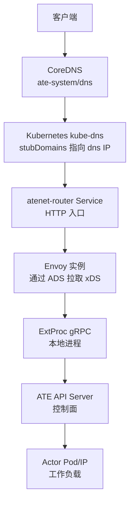
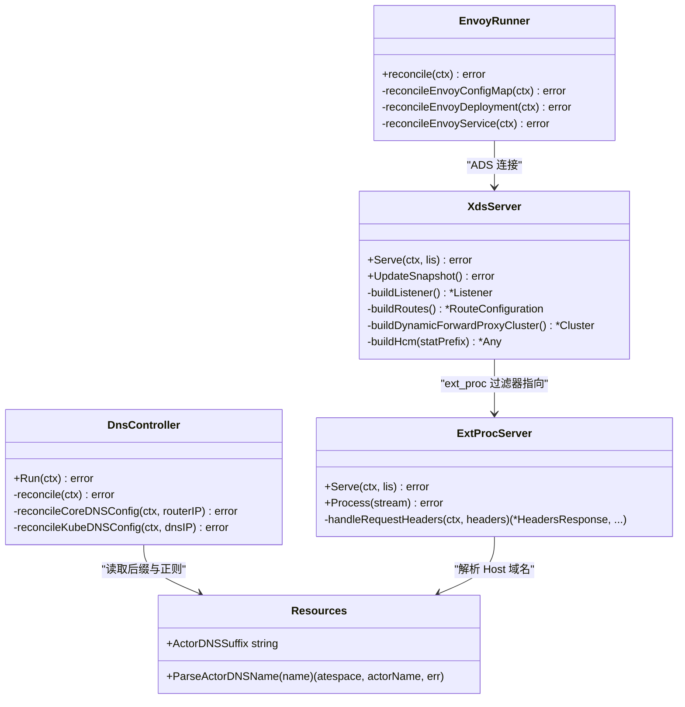
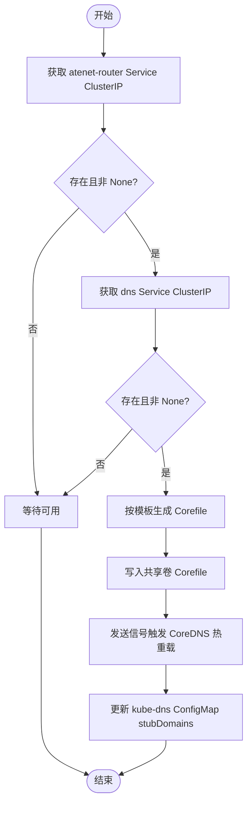
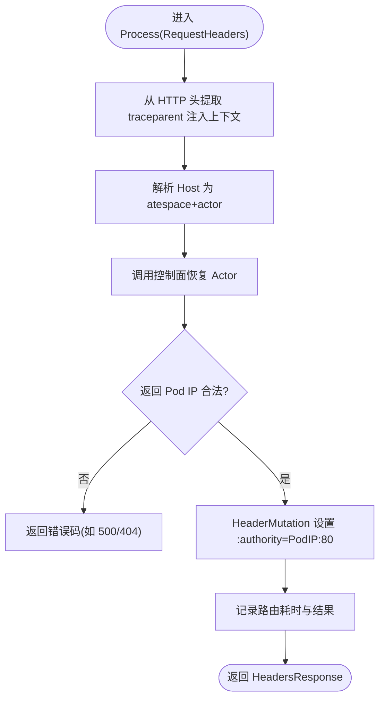
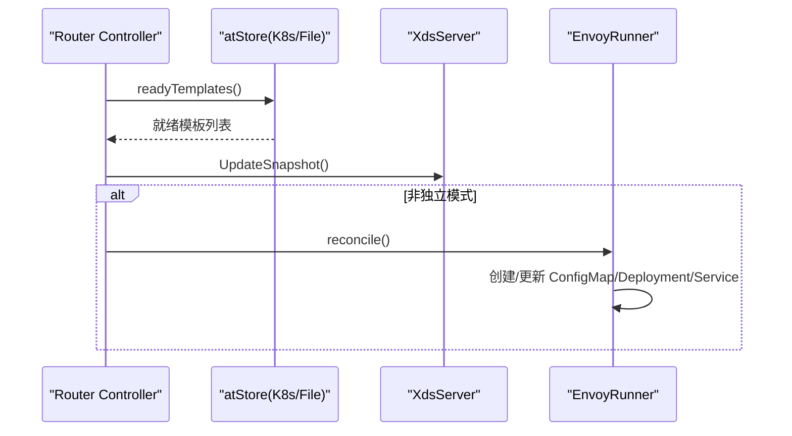
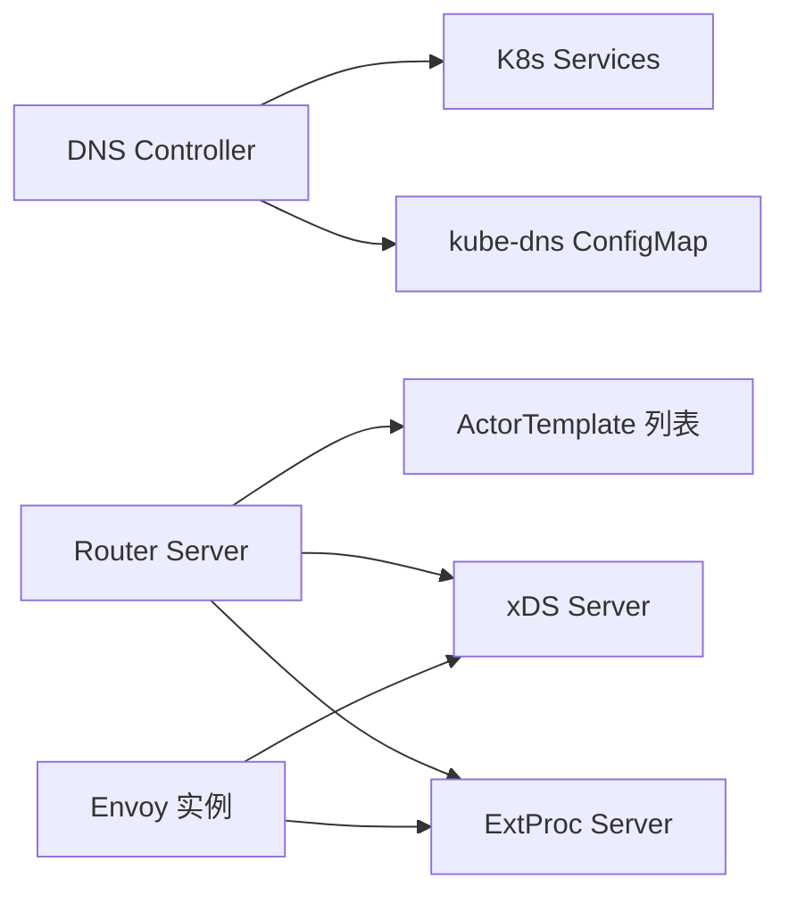

# 高性能网络路由

<cite>
**本文引用的文件**   
- [cmd/atenet/main.go](file://cmd/atenet/main.go)
- [cmd/atenet/internal/dns.go](file://cmd/atenet/internal/dns.go)
- [cmd/atenet/internal/dns/dns.go](file://cmd/atenet/internal/dns/dns.go)
- [cmd/atenet/internal/dns/corefile.go](file://cmd/atenet/internal/dns/corefile.go)
- [cmd/atenet/internal/router/router.go](file://cmd/atenet/internal/router/router.go)
- [cmd/atenet/internal/router/xds.go](file://cmd/atenet/internal/router/xds.go)
- [cmd/atenet/internal/router/extproc.go](file://cmd/atenet/internal/router/extproc.go)
- [cmd/atenet/internal/router/controller.go](file://cmd/atenet/internal/router/controller.go)
- [cmd/atenet/internal/router/envoyrunner.go](file://cmd/atenet/internal/router/envoyrunner.go)
- [internal/resources/actor.go](file://internal/resources/actor.go)
</cite>

## 目录
1. [简介](#简介)
2. [项目结构](#项目结构)
3. [核心组件](#核心组件)
4. [架构总览](#架构总览)
5. [详细组件分析](#详细组件分析)
6. [依赖关系分析](#依赖关系分析)
7. [性能考量](#性能考量)
8. [故障排查指南](#故障排查指南)
9. [结论](#结论)
10. [附录：使用示例与最佳实践](#附录使用示例与最佳实践)

## 简介
本技术文档聚焦于 Agent Substrate 的高性能网络路由特性，围绕基于 Envoy 的 HTTP 代理与 DNS 服务展开。内容涵盖：
- 动态路由配置生成（xDS）
- 连接池管理与负载均衡策略
- DNS 解析服务的工作原理（动态域名注册、TTL 管理、故障转移）
- 从客户端到目标 Actor 的完整数据路径
- 自定义域名配置与服务发现的使用方法

## 项目结构
atenet 子系统的入口位于主程序，内部包含 DNS 编排与 Router（Envoy + xDS + ExtProc）两大模块：
- DNS 编排：负责生成并热重载 CoreDNS 配置，将特定后缀的域名解析到 atenet-router 的 ClusterIP
- Router：提供 xDS 服务器、ExtProc 外部处理服务，并通过 Kubernetes 控制器动态部署 Envoy 实例



图表来源
- [cmd/atenet/internal/dns/dns.go:71-117](file://cmd/atenet/internal/dns/dns.go#L71-L117)
- [cmd/atenet/internal/router/envoyrunner.go:50-64](file://cmd/atenet/internal/router/envoyrunner.go#L50-L64)
- [cmd/atenet/internal/router/xds.go:196-225](file://cmd/atenet/internal/router/xds.go#L196-L225)
- [cmd/atenet/internal/router/extproc.go:80-128](file://cmd/atenet/internal/router/extproc.go#L80-L128)

章节来源
- [cmd/atenet/main.go:17-21](file://cmd/atenet/main.go#L17-L21)
- [cmd/atenet/internal/dns.go:42-107](file://cmd/atenet/internal/dns.go#L42-L107)
- [cmd/atenet/internal/router/router.go:152-315](file://cmd/atenet/internal/router/router.go#L152-L315)

## 核心组件
- DNS Controller：周期性同步 atenet-router 与 dns 服务的 ClusterIP，生成 CoreDNS Corefile 并触发热重载；同时更新 kube-dns 的 stubDomains，使集群内 DNS 将自定义后缀解析到 ate-system 的 dns 服务
- xDS Server：实现 Envoy 聚合发现服务，动态下发 Listener/Route/Cluster 快照，支持 HTTP/HTTPS 监听器、动态转发代理、可选 OTLP 追踪
- ExtProc Server：作为 Envoy 的外部处理器，在请求头阶段解析 Host，调用控制面恢复 Actor，并将 :authority 重写为 Actor Pod IP:80，交由动态转发代理出站
- Envoy Runner：以控制器模式维护 Envoy 的 ConfigMap/Deployment/Service，使其通过 ADS 连接 xDS Server

章节来源
- [cmd/atenet/internal/dns/dns.go:50-117](file://cmd/atenet/internal/dns/dns.go#L50-L117)
- [cmd/atenet/internal/dns/corefile.go:32-64](file://cmd/atenet/internal/dns/corefile.go#L32-L64)
- [cmd/atenet/internal/router/xds.go:148-194](file://cmd/atenet/internal/router/xds.go#L148-L194)
- [cmd/atenet/internal/router/extproc.go:38-78](file://cmd/atenet/internal/router/extproc.go#L38-L78)
- [cmd/atenet/internal/router/envoyrunner.go:50-64](file://cmd/atenet/internal/router/envoyrunner.go#L50-L64)

## 架构总览
下图展示了系统关键组件及其交互关系，包括 DNS 解析、Envoy 入站、ExtProc 决策、动态转发与最终到达 Actor 的过程。



图表来源
- [cmd/atenet/internal/dns/dns.go:71-117](file://cmd/atenet/internal/dns/dns.go#L71-L117)
- [cmd/atenet/internal/dns/corefile.go:32-64](file://cmd/atenet/internal/dns/corefile.go#L32-L64)
- [cmd/atenet/internal/router/xds.go:196-225](file://cmd/atenet/internal/router/xds.go#L196-L225)
- [cmd/atenet/internal/router/extproc.go:80-128](file://cmd/atenet/internal/router/extproc.go#L80-L128)
- [cmd/atenet/internal/router/envoyrunner.go:50-64](file://cmd/atenet/internal/router/envoyrunner.go#L50-L64)
- [internal/resources/actor.go:34-61](file://internal/resources/actor.go#L34-L61)

## 详细组件分析

### DNS 解析服务与动态域名注册
- 域名空间：所有 Actor 可通过 <actor>.<atespace>.actors.resources.substrate.ate.dev 访问
- CoreDNS 模板：根据资源名正则与 ActorDNSSuffix 构建 template 规则，匹配形如 <label>.<label>.suffix 的 FQDN，统一返回 atenet-router 的 ClusterIP，TTL 固定为 60 秒
- 热重载：当 Corefile 变更时，通过向 coredns 进程发送 SIGUSR1 触发动态重载
- kube-dns 集成：将自定义后缀的 stubDomains 指向 ate-system 的 dns 服务 ClusterIP，确保集群内 DNS 优先命中该解析



图表来源
- [cmd/atenet/internal/dns/dns.go:71-117](file://cmd/atenet/internal/dns/dns.go#L71-L117)
- [cmd/atenet/internal/dns/corefile.go:32-64](file://cmd/atenet/internal/dns/corefile.go#L32-L64)
- [cmd/atenet/internal/dns/dns.go:191-221](file://cmd/atenet/internal/dns/dns.go#L191-L221)

章节来源
- [cmd/atenet/internal/dns/dns.go:50-117](file://cmd/atenet/internal/dns/dns.go#L50-L117)
- [cmd/atenet/internal/dns/corefile.go:32-64](file://cmd/atenet/internal/dns/corefile.go#L32-L64)
- [internal/resources/actor.go:22-39](file://internal/resources/actor.go#L22-L39)

### Envoy 动态路由与连接池管理
- xDS 快照：每次更新递增版本号，生成 Listener/Route/Cluster 快照并推送给已连接的 Envoy
- 监听器：HTTP 监听器默认端口可配；若启用 HTTPS，则加载证书（文件或内存），开启 TLS
- 过滤器链：ext_proc -> dynamic_forward_proxy -> router
- 动态转发代理：使用动态转发代理簇与 DNS 缓存，按请求 Host 进行动态解析与连接复用
- 负载均衡：内部 ext_proc 集群采用 ROUND_ROBIN；动态转发代理由上游决定
- 追踪：可选 OTLP gRPC 收集器，HCM 层开启 OpenTelemetry 追踪

```mermaid
sequenceDiagram
participant Client as "客户端"
participant Envoy as "Envoy 入站"
participant ExtProc as "ExtProc 服务"
participant Control as "ATE API Server"
participant Actor as "Actor Pod"
Client->>Envoy : HTTP 请求 Host=<actor>.<atespace>.suffix
Envoy->>ExtProc : ext_proc RequestHeaders
ExtProc->>Control : ResumeActor(atespace, actor)
Control-->>ExtProc : Actor 信息(IP/状态)
ExtProc-->>Envoy : 修改 : authority=PodIP : 80
Envoy->>Envoy : dynamic_forward_proxy 解析并建立连接
Envoy->>Actor : 转发到 PodIP : 80
Actor-->>Client : 响应
```

图表来源
- [cmd/atenet/internal/router/xds.go:386-466](file://cmd/atenet/internal/router/xds.go#L386-L466)
- [cmd/atenet/internal/router/xds.go:336-384](file://cmd/atenet/internal/router/xds.go#L336-L384)
- [cmd/atenet/internal/router/extproc.go:80-128](file://cmd/atenet/internal/router/extproc.go#L80-L128)

章节来源
- [cmd/atenet/internal/router/xds.go:148-194](file://cmd/atenet/internal/router/xds.go#L148-L194)
- [cmd/atenet/internal/router/xds.go:227-272](file://cmd/atenet/internal/router/xds.go#L227-L272)
- [cmd/atenet/internal/router/xds.go:336-384](file://cmd/atenet/internal/router/xds.go#L336-L384)
- [cmd/atenet/internal/router/xds.go:386-466](file://cmd/atenet/internal/router/xds.go#L386-L466)

### ExtProc 外部处理与流量调度
- 请求头处理：从 ProcessingRequest 中提取 traceparent，重建链路上下文；解析 Host 得到 atespace 与 actor 名称
- 激活与路由：调用控制面恢复 Actor，校验返回的 Pod IP，构造 targetAddr=PodIP:80，通过 HeaderMutation 改写 :authority
- 指标记录：记录路由耗时与结果分类（ok/not_found/error/cancelled），便于观测



图表来源
- [cmd/atenet/internal/router/extproc.go:80-128](file://cmd/atenet/internal/router/extproc.go#L80-L128)
- [cmd/atenet/internal/router/extproc.go:130-188](file://cmd/atenet/internal/router/extproc.go#L130-L188)
- [cmd/atenet/internal/router/extproc.go:190-212](file://cmd/atenet/internal/router/extproc.go#L190-L212)

章节来源
- [cmd/atenet/internal/router/extproc.go:38-78](file://cmd/atenet/internal/router/extproc.go#L38-L78)
- [cmd/atenet/internal/router/extproc.go:130-188](file://cmd/atenet/internal/router/extproc.go#L130-L188)

### Envoy 运行器与控制器
- 控制器循环：定时拉取就绪的 ActorTemplate，生成 xDS 快照；在非独立模式下，协调 Envoy 的 ConfigMap/Deployment/Service
- Envoy 启动：通过 ConfigMap 注入 bootstrap 配置，指定 ADS 连接 atenet-router 的 xDS 端口；Deployment 暴露 HTTP 端口；Service 提供 ClusterIP 供 DNS 解析



图表来源
- [cmd/atenet/internal/router/controller.go:67-110](file://cmd/atenet/internal/router/controller.go#L67-L110)
- [cmd/atenet/internal/router/envoyrunner.go:50-64](file://cmd/atenet/internal/router/envoyrunner.go#L50-L64)

章节来源
- [cmd/atenet/internal/router/controller.go:67-110](file://cmd/atenet/internal/router/controller.go#L67-L110)
- [cmd/atenet/internal/router/envoyrunner.go:139-222](file://cmd/atenet/internal/router/envoyrunner.go#L139-L222)

## 依赖关系分析
- DNS 编排依赖 K8s Service 与 ConfigMap，以及进程信号机制
- Router 依赖 K8s 资源（ActorTemplate）、ATE API Server、xDS 与 ExtProc
- Envoy 通过 ADS 依赖 xDS Server，并在请求路径中依赖 ExtProc 与动态转发代理



图表来源
- [cmd/atenet/internal/dns/dns.go:71-117](file://cmd/atenet/internal/dns/dns.go#L71-L117)
- [cmd/atenet/internal/router/controller.go:67-110](file://cmd/atenet/internal/router/controller.go#L67-L110)
- [cmd/atenet/internal/router/envoyrunner.go:50-64](file://cmd/atenet/internal/router/envoyrunner.go#L50-L64)

章节来源
- [cmd/atenet/internal/dns/dns.go:71-117](file://cmd/atenet/internal/dns/dns.go#L71-L117)
- [cmd/atenet/internal/router/controller.go:67-110](file://cmd/atenet/internal/router/controller.go#L67-L110)

## 性能考量
- 连接复用：动态转发代理内置 DNS 缓存与连接池，减少重复解析与握手开销
- 负载均衡：ext_proc 集群采用轮询；动态转发代理由上游决定，可按需扩展
- 超时与重试：连接超时、消息超时等参数可在 xDS 中调整，避免长尾延迟
- 追踪采样：HCM 层随机采样 100%，但下游采用父级采样策略，避免无父请求造成全量采样

[本节为通用指导，不直接分析具体文件]

## 故障排查指南
- DNS 未生效
  - 检查 atenet-router 与 dns 的 Service 是否具备 ClusterIP
  - 确认 kube-dns 的 stubDomains 是否已更新为 dns 服务 IP
  - 查看 Corefile 是否被正确写入并触发热重载
- 路由失败
  - 观察 ExtProc 日志中的 Host 解析与 ResumeActor 结果
  - 确认 Actor 状态与 Pod IP 是否有效
  - 检查动态转发代理是否成功解析并建立连接
- 追踪缺失
  - 确认 OTLP 收集器地址是否正确配置
  - 验证 HCM Tracing 是否启用且指向正确的 cluster

章节来源
- [cmd/atenet/internal/dns/dns.go:71-117](file://cmd/atenet/internal/dns/dns.go#L71-L117)
- [cmd/atenet/internal/dns/dns.go:191-221](file://cmd/atenet/internal/dns/dns.go#L191-L221)
- [cmd/atenet/internal/router/extproc.go:130-188](file://cmd/atenet/internal/router/extproc.go#L130-L188)
- [cmd/atenet/internal/router/xds.go:478-501](file://cmd/atenet/internal/router/xds.go#L478-L501)

## 结论
本方案通过 DNS 编排与 Envoy 动态路由的组合，实现了面向 Actor 的高性能、可扩展的网络接入层。DNS 侧将自定义后缀统一解析至路由器，结合 ExtProc 的动态激活与头部重写，配合 Envoy 的连接池与动态转发能力，形成低延迟、高吞吐的数据平面。同时，xDS 提供的集中式配置管理与可选的 OTLP 追踪，为运维与可观测性提供了坚实基础。

[本节为总结性内容，不直接分析具体文件]

## 附录：使用示例与最佳实践

### 自定义域名配置
- 域名格式：<actor>.<atespace>.actors.resources.substrate.ate.dev
- 集群内 DNS：kube-dns 的 stubDomains 已将上述后缀指向 ate-system 的 dns 服务，无需额外配置
- CoreDNS 行为：对匹配域名的请求返回 atenet-router 的 ClusterIP，TTL 为 60 秒

章节来源
- [internal/resources/actor.go:22-39](file://internal/resources/actor.go#L22-L39)
- [cmd/atenet/internal/dns/corefile.go:32-64](file://cmd/atenet/internal/dns/corefile.go#L32-L64)
- [cmd/atenet/internal/dns/dns.go:143-189](file://cmd/atenet/internal/dns/dns.go#L143-L189)

### 服务发现与动态路由
- 客户端发起 HTTP 请求到自定义域名
- CoreDNS 解析到 atenet-router 的 ClusterIP
- Envoy 接收请求，ext_proc 解析 Host 并恢复 Actor，重写 :authority 为 PodIP:80
- 动态转发代理解析并建立连接，最终到达 Actor

章节来源
- [cmd/atenet/internal/dns/dns.go:71-117](file://cmd/atenet/internal/dns/dns.go#L71-L117)
- [cmd/atenet/internal/router/extproc.go:130-188](file://cmd/atenet/internal/router/extproc.go#L130-L188)
- [cmd/atenet/internal/router/xds.go:336-384](file://cmd/atenet/internal/router/xds.go#L336-L384)

### 连接池与负载均衡
- ext_proc 集群：ROUND_ROBIN，静态端点指向本地 ExtProc
- 动态转发代理：按请求 Host 动态解析，内部 DNS 缓存提升性能
- 建议：在高并发场景下关注动态转发代理的 DNS 缓存命中率与连接复用率

章节来源
- [cmd/atenet/internal/router/xds.go:227-272](file://cmd/atenet/internal/router/xds.go#L227-L272)
- [cmd/atenet/internal/router/xds.go:336-355](file://cmd/atenet/internal/router/xds.go#L336-L355)
