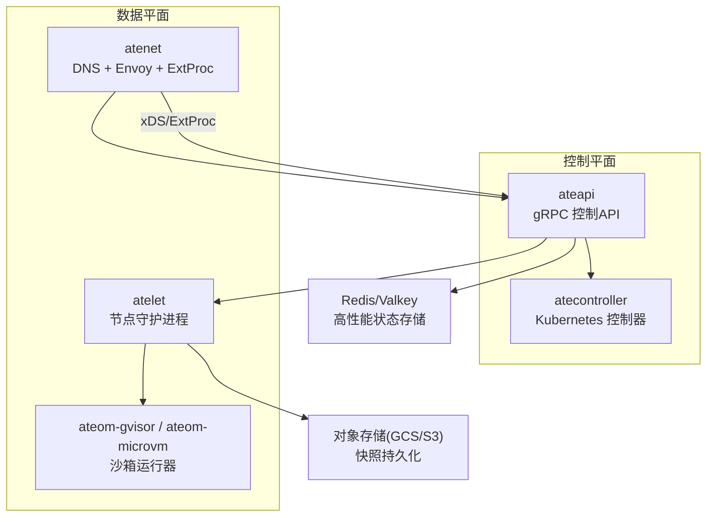
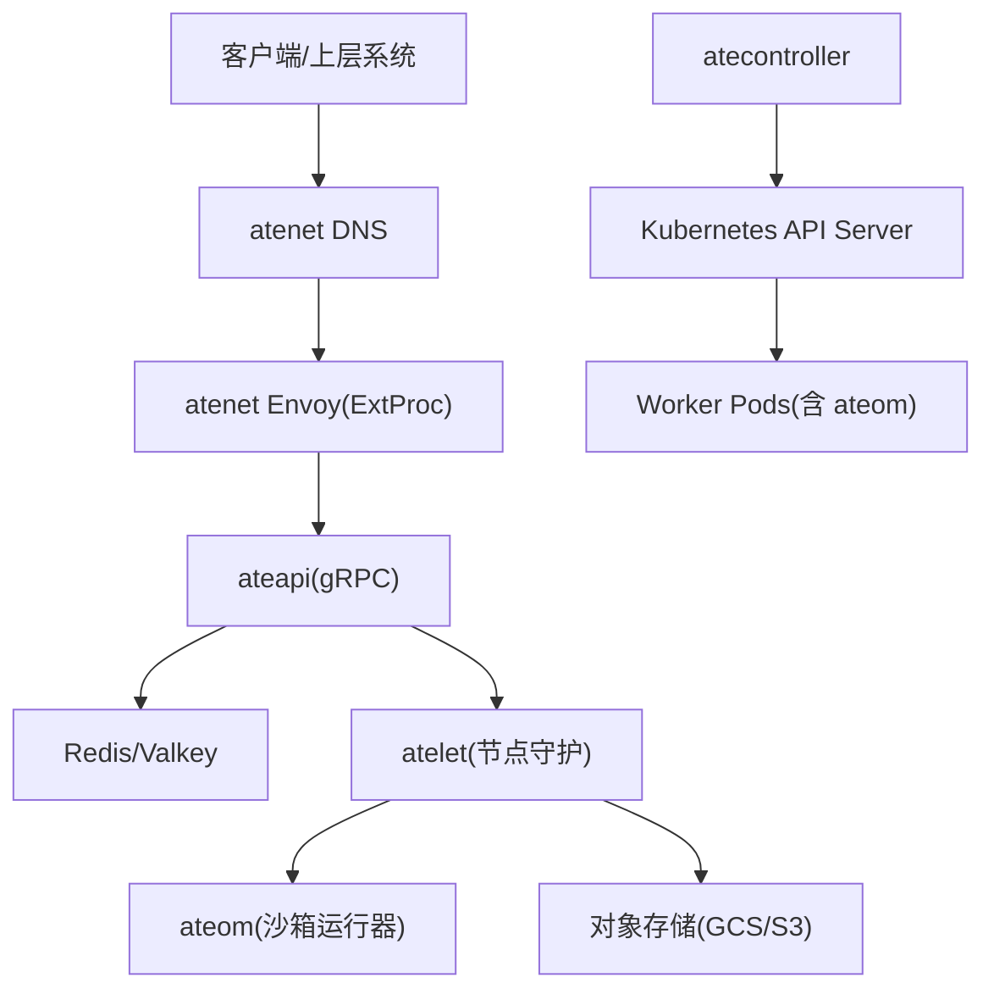
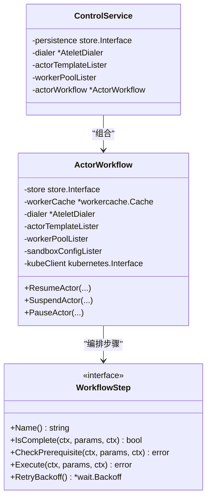
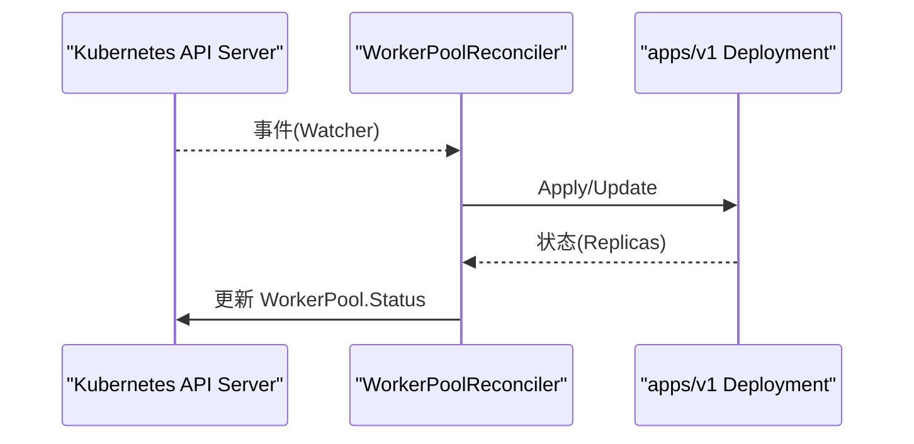
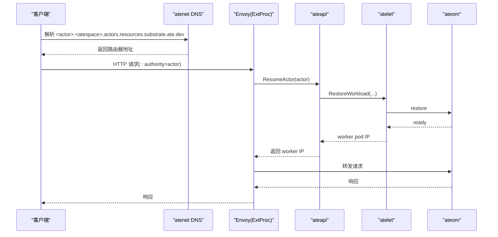
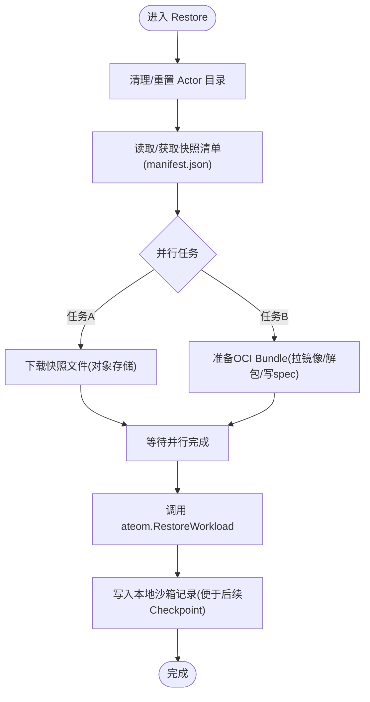
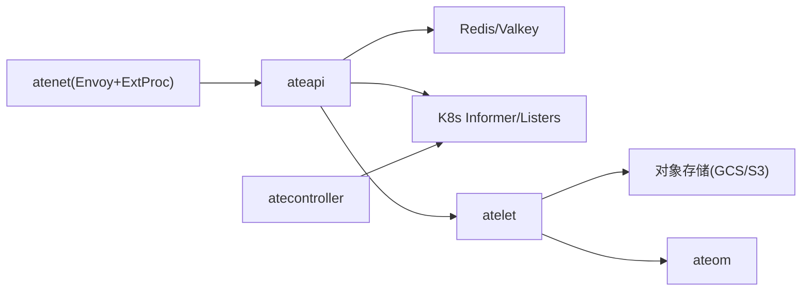
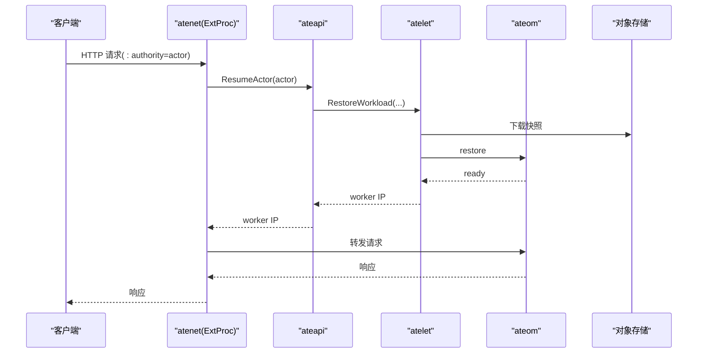
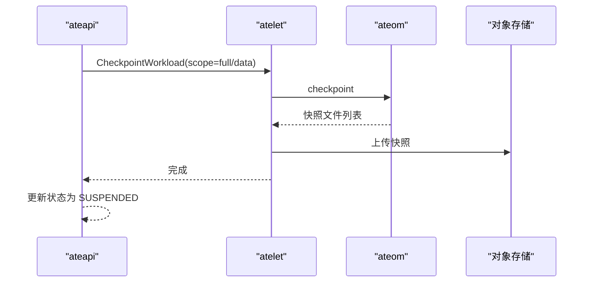

# 架构概览

<cite>
**本文引用的文件**   
- [README.md](file://README.md)
- [architecture.md](file://docs/architecture.md)
- [main.go](file://cmd/ateapi/main.go)
- [service.go](file://cmd/ateapi/internal/controlapi/service.go)
- [workflow.go](file://cmd/ateapi/internal/controlapi/workflow.go)
- [workerpool_controller.go](file://cmd/atecontroller/internal/controllers/workerpool_controller.go)
- [main.go](file://cmd/atecontroller/main.go)
- [router.go](file://cmd/atenet/internal/router.go)
- [xds.go](file://cmd/atenet/internal/router/xds.go)
- [extproc.go](file://cmd/atenet/internal/router/extproc.go)
- [main.go](file://cmd/atelet/main.go)
- [sandbox_assets.go](file://cmd/atelet/sandbox_assets.go)
- [oci.go](file://cmd/atelet/oci.go)
</cite>

## 目录
1. [简介](#简介)
2. [项目结构](#项目结构)
3. [核心组件](#核心组件)
4. [架构总览](#架构总览)
5. [详细组件分析](#详细组件分析)
6. [依赖关系分析](#依赖关系分析)
7. [性能与可扩展性](#性能与可扩展性)
8. [故障恢复与容错](#故障恢复与容错)
9. [结论](#结论)
10. [附录：关键流程时序图](#附录关键流程时序图)

## 简介
Agent Substrate 是在 Kubernetes 之上构建的“代理型”工作负载平台，通过“控制平面与数据平面分离”的设计，将大量短时、高并发、多空闲态的 Actor（如 AI Agent）复用在一组预热的 Worker Pod 上，实现更高的密度与更低的唤醒延迟。系统利用 Kubernetes 的 Pod 与自动扩缩容能力进行基础设施编排，但在关键路径（Actor 激活/休眠）绕过 K8s API Server，以 Redis/ValKey 等高性能状态存储承载高频实例状态，从而达成亚百毫秒级激活目标。

## 项目结构
仓库采用按二进制划分的模块化布局：
- cmd/ 下每个子目录对应一个可执行服务（控制面、节点代理、网络路由、控制器等）
- internal/ 为内部共享库
- pkg/ 为对外暴露的 CRD 类型与客户端
- docs/ 包含架构与设计文档
- manifests/ 提供部署清单
- demos/ 与 benchmarking/ 用于示例与压测

图表来源
- [main.go:1-206](file://cmd/ateapi/main.go#L1-L206)
- [main.go:1-124](file://cmd/atecontroller/main.go#L1-L124)
- [router.go:1-68](file://cmd/atenet/internal/router.go#L1-L68)
- [xds.go:1-225](file://cmd/atenet/internal/router/xds.go#L1-L225)
- [extproc.go:1-213](file://cmd/atenet/internal/router/extproc.go#L1-L213)
- [main.go:1-183](file://cmd/atelet/main.go#L1-L183)

章节来源
- [README.md:1-225](file://README.md#L1-L225)
- [architecture.md:1-494](file://docs/architecture.md#L1-L494)

## 核心组件
- ateapi（控制平面 gRPC 服务器）
  - 职责：对外暴露 Actor/Worker 生命周期管理 API；维护 Actor↔Worker 映射；调度与编排 Resume/Suspend 工作流；缓存 Worker 列表；对接 K8s Informer 与 CRD Listers；鉴权与可观测性。
  - 关键入口与装配：[main.go:1-206](file://cmd/ateapi/main.go#L1-L206)、[service.go:1-57](file://cmd/ateapi/internal/controlapi/service.go#L1-L57)、[workflow.go:1-280](file://cmd/ateapi/internal/controlapi/workflow.go#L1-L280)
- atecontroller（Kubernetes 控制器）
  - 职责：基于 CRD（WorkerPool、ActorTemplate）驱动集群资源期望态与实际态一致，例如根据 WorkerPool 创建/更新 Deployment，并同步状态。
  - 关键入口与控制器：[main.go:1-124](file://cmd/atecontroller/main.go#L1-L124)、[workerpool_controller.go:1-121](file://cmd/atecontroller/internal/controllers/workerpool_controller.go#L1-L121)
- atenet（网络路由服务）
  - 职责：提供统一 DNS 解析、Envoy xDS 动态配置、ExtProc 外部处理服务；在请求头阶段解析 Actor 引用、触发 ResumeActor 并改写 :authority 完成转发。
  - 关键入口与实现：[router.go:1-68](file://cmd/atenet/internal/router.go#L1-L68)、[xds.go:1-607](file://cmd/atenet/internal/router/xds.go#L1-L607)、[extproc.go:1-213](file://cmd/atenet/internal/router/extproc.go#L1-L213)
- atelet（节点代理守护进程）
  - 职责：节点侧“牧羊人”，负责拉取镜像、准备 OCI Bundle、下载/上传快照、调用 ateom 执行 Run/Checkpoint/Restore；记录本地沙箱资产清单以保证跨节点可恢复。
  - 关键入口与实现：[main.go:1-183](file://cmd/atelet/main.go#L1-L183)、[sandbox_assets.go:1-267](file://cmd/atelet/sandbox_assets.go#L1-L267)、[oci.go:1-512](file://cmd/atelet/oci.go#L1-L512)
- ateom（沙箱运行器）
  - 职责：Pod 内轻量运行时，封装 runsc 或 Kata+CH 的 Checkpoint/Restore 操作，暴露 gRPC 接口供 atelet 调用。

章节来源
- [main.go:1-206](file://cmd/ateapi/main.go#L1-L206)
- [service.go:1-57](file://cmd/ateapi/internal/controlapi/service.go#L1-L57)
- [workflow.go:1-280](file://cmd/ateapi/internal/controlapi/workflow.go#L1-L280)
- [main.go:1-124](file://cmd/atecontroller/main.go#L1-L124)
- [workerpool_controller.go:1-121](file://cmd/atecontroller/internal/controllers/workerpool_controller.go#L1-L121)
- [router.go:1-68](file://cmd/atenet/internal/router.go#L1-L68)
- [xds.go:1-607](file://cmd/atenet/internal/router/xds.go#L1-L607)
- [extproc.go:1-213](file://cmd/atenet/internal/router/extproc.go#L1-L213)
- [main.go:1-183](file://cmd/atelet/main.go#L1-L183)
- [sandbox_assets.go:1-267](file://cmd/atelet/sandbox_assets.go#L1-L267)
- [oci.go:1-512](file://cmd/atelet/oci.go#L1-L512)

## 架构总览
系统采用“控制平面/数据平面”分层设计：
- 控制平面（ateapi + atecontroller）：面向管理与编排，使用 Redis/Valkey 承载高频实例状态，使用 K8s CRD 承载声明式配置。
- 数据平面（atenet + atelet + ateom）：面向低延迟执行，ExtProc 拦截请求、触发激活、直接转发到 Worker Pod 内的 ateom，避免经过 K8s API Server。

图表来源
- [architecture.md:308-352](file://docs/architecture.md#L308-L352)
- [extproc.go:1-213](file://cmd/atenet/internal/router/extproc.go#L1-L213)
- [workflow.go:1-280](file://cmd/ateapi/internal/controlapi/workflow.go#L1-L280)
- [main.go:1-183](file://cmd/atelet/main.go#L1-L183)

章节来源
- [architecture.md:1-494](file://docs/architecture.md#L1-L494)

## 详细组件分析

### 控制平面：ateapi
- 启动与装配
  - 初始化日志、追踪、指标；连接 Redis/Valkey；建立 K8s 客户端与 Informer；加载 mTLS/JWT 认证；注册 gRPC 服务。
  - 参考：[main.go:1-206](file://cmd/ateapi/main.go#L1-L206)
- 控制服务
  - Service 聚合持久层、Worker 缓存、Listers、Atelet 拨号器与工作流引擎。
  - 参考：[service.go:1-57](file://cmd/ateapi/internal/controlapi/service.go#L1-L57)
- 工作流引擎
  - 通用 WorkflowStep 抽象，支持幂等检查、前置条件校验、重试退避；Resume/Suspend/Pause 由步骤序列编排。
  - 参考：[workflow.go:1-280](file://cmd/ateapi/internal/controlapi/workflow.go#L1-L280)

图表来源
- [service.go:1-57](file://cmd/ateapi/internal/controlapi/service.go#L1-L57)
- [workflow.go:1-280](file://cmd/ateapi/internal/controlapi/workflow.go#L1-L280)

章节来源
- [main.go:1-206](file://cmd/ateapi/main.go#L1-L206)
- [service.go:1-57](file://cmd/ateapi/internal/controlapi/service.go#L1-L57)
- [workflow.go:1-280](file://cmd/ateapi/internal/controlapi/workflow.go#L1-L280)

### 控制器：atecontroller
- 职责：监听 CRD（WorkerPool、ActorTemplate），将期望态落地为 Deployment 等资源，并回写状态。
- 关键逻辑：Reconcile → applyDeployment → syncStatus。
- 参考：[workerpool_controller.go:1-121](file://cmd/atecontroller/internal/controllers/workerpool_controller.go#L1-L121)、[main.go:1-124](file://cmd/atecontroller/main.go#L1-L124)

图表来源
- [workerpool_controller.go:1-121](file://cmd/atecontroller/internal/controllers/workerpool_controller.go#L1-L121)

章节来源
- [workerpool_controller.go:1-121](file://cmd/atecontroller/internal/controllers/workerpool_controller.go#L1-L121)
- [main.go:1-124](file://cmd/atecontroller/main.go#L1-L124)

### 网络路由：atenet（DNS + Envoy + ExtProc）
- DNS：提供全局统一的 Actor 发现后缀。
- Envoy：通过 xDS 动态下发 Listener/Route/Cluster 配置；启用 ext_proc 过滤器。
- ExtProc：在请求头阶段解析 Host→{atespace, actor}，调用 ateapi ResumeActor，并将 :authority 改写为 Worker IP:Port 后转发。
- 参考：[router.go:1-68](file://cmd/atenet/internal/router.go#L1-L68)、[xds.go:1-607](file://cmd/atenet/internal/router/xds.go#L1-L607)、[extproc.go:1-213](file://cmd/atenet/internal/router/extproc.go#L1-L213)

图表来源
- [extproc.go:1-213](file://cmd/atenet/internal/router/extproc.go#L1-L213)
- [xds.go:1-225](file://cmd/atenet/internal/router/xds.go#L1-L225)
- [workflow.go:1-280](file://cmd/ateapi/internal/controlapi/workflow.go#L1-L280)
- [main.go:1-183](file://cmd/atelet/main.go#L1-L183)

章节来源
- [router.go:1-68](file://cmd/atenet/internal/router.go#L1-L68)
- [xds.go:1-607](file://cmd/atenet/internal/router/xds.go#L1-L607)
- [extproc.go:1-213](file://cmd/atenet/internal/router/extproc.go#L1-L213)

### 节点代理：atelet（沙箱与快照）
- 职责：
  - 拉取镜像并准备 OCI Bundle（安全解压、权限修复、环境变量与参数合并）。
  - 从对象存储下载/上传快照（GCS/S3），写入本地清单 manifest.json 以便跨节点自描述恢复。
  - 调用 ateom 执行 Run/Checkpoint/Restore。
- 关键实现：
  - 沙箱资产与清单：[sandbox_assets.go:1-267](file://cmd/atelet/sandbox_assets.go#L1-L267)
  - OCI Bundle 准备与安全解压：[oci.go:1-512](file://cmd/atelet/oci.go#L1-L512)
  - 服务入口与 gRPC 注册：[main.go:1-183](file://cmd/atelet/main.go#L1-L183)

图表来源
- [main.go:454-583](file://cmd/atelet/main.go#L454-L583)
- [sandbox_assets.go:1-267](file://cmd/atelet/sandbox_assets.go#L1-L267)
- [oci.go:1-512](file://cmd/atelet/oci.go#L1-L512)

章节来源
- [main.go:1-183](file://cmd/atelet/main.go#L1-L183)
- [sandbox_assets.go:1-267](file://cmd/atelet/sandbox_assets.go#L1-L267)
- [oci.go:1-512](file://cmd/atelet/oci.go#L1-L512)

## 依赖关系分析
- ateapi 依赖
  - Redis/Valkey：高性能状态存储（Actor/Worker 映射、锁、缓存）
  - K8s Informer/Listers：ActorTemplate/WorkerPool/SandboxConfig 只读视图
  - atelet：gRPC 调用执行快照恢复/暂停
- atecontroller 依赖
  - K8s API Server：CRD 与 Deployment 的读写
- atenet 依赖
  - Envoy：xDS 动态配置与 ext_proc 过滤链
  - ateapi：ResumeActor 决策与定位
- atelet 依赖
  - 对象存储（GCS/S3）：快照持久化
  - ateom：沙箱运行时（runsc/Kata+CH）

图表来源
- [main.go:1-206](file://cmd/ateapi/main.go#L1-L206)
- [workerpool_controller.go:1-121](file://cmd/atecontroller/internal/controllers/workerpool_controller.go#L1-L121)
- [xds.go:1-225](file://cmd/atenet/internal/router/xds.go#L1-L225)
- [extproc.go:1-213](file://cmd/atenet/internal/router/extproc.go#L1-L213)
- [main.go:1-183](file://cmd/atelet/main.go#L1-L183)

章节来源
- [main.go:1-206](file://cmd/ateapi/main.go#L1-L206)
- [workerpool_controller.go:1-121](file://cmd/atecontroller/internal/controllers/workerpool_controller.go#L1-L121)
- [xds.go:1-225](file://cmd/atenet/internal/router/xds.go#L1-L225)
- [extproc.go:1-213](file://cmd/atenet/internal/router/extproc.go#L1-L213)
- [main.go:1-183](file://cmd/atelet/main.go#L1-L183)

## 性能与可扩展性
- 低延迟关键路径
  - 数据平面绕过 K8s API Server：ExtProc 直接调用 ateapi，再直连 atelet/ateom，减少网络跳数与一致性等待。
  - 预热 Worker：WorkerPool 维持“热”Pod，缩短首次激活时间。
- 高密度复用
  - 大量 Actor 复用少量 Worker，结合快照机制在空闲时释放计算资源。
- 水平扩展
  - 控制面：ateapi 无状态扩展，配合 Redis 分片/集群；Worker 池通过 HPA/VPA 与 K8s 自动扩缩容联动。
  - 数据面：atenet 与 atelet 均可水平扩展，按节点/区域就近部署降低延迟。
- 可观测性
  - OpenTelemetry 全链路追踪与 Prometheus 指标采集，覆盖 ExtProc 路由耗时、Snapshot 大小、Restore 各阶段耗时等。

章节来源
- [architecture.md:142-156](file://docs/architecture.md#L142-L156)
- [extproc.go:1-213](file://cmd/atenet/internal/router/extproc.go#L1-L213)
- [main.go:1-183](file://cmd/atelet/main.go#L1-L183)

## 故障恢复与容错
- 幂等与重试
  - 工作流步骤支持 IsComplete 快速前进与 RetryBackoff 指数退避，对持久层冲突自动重试。
  - 参考：[workflow.go:1-280](file://cmd/ateapi/internal/controlapi/workflow.go#L1-L280)
- 分布式锁
  - 基于 Redis 的 Actor 级锁，防止同一 Actor 并发操作导致竞态。
  - 参考：[workflow.go:256-279](file://cmd/ateapi/internal/controlapi/workflow.go#L256-L279)
- 快照完整性
  - 沙箱资产按内容寻址（SHA256）校验；快照清单 manifest.json 确保跨节点可自描述恢复。
  - 参考：[sandbox_assets.go:1-267](file://cmd/atelet/sandbox_assets.go#L1-L267)
- 错误分类与可观测
  - ExtProc 对路由失败进行分类统计；atelet 记录 Snapshot 大小与阶段耗时，便于定位瓶颈。
  - 参考：[extproc.go:1-213](file://cmd/atenet/internal/router/extproc.go#L1-L213)、[main.go:273-307](file://cmd/atelet/main.go#L273-L307)

章节来源
- [workflow.go:1-280](file://cmd/ateapi/internal/controlapi/workflow.go#L1-L280)
- [sandbox_assets.go:1-267](file://cmd/atelet/sandbox_assets.go#L1-L267)
- [extproc.go:1-213](file://cmd/atenet/internal/router/extproc.go#L1-L213)
- [main.go:273-307](file://cmd/atelet/main.go#L273-L307)

## 结论
Agent Substrate 通过“控制平面/数据平面分离”和“Actor 与 Pod 生命周期解耦”，在保持 Kubernetes 生态能力的同时，显著降低了代理型工作负载的激活延迟并提升了资源利用率。其以 Redis/Valkey 为核心的高性能状态层、ExtProc 驱动的即时激活、以及 atelet/ateom 的快照迁移能力，共同构成了可扩展、低延迟、可观测的 Agentic 基础设施基座。

## 附录：关键流程时序图

### 激活（Resume）端到端时序

图表来源
- [extproc.go:1-213](file://cmd/atenet/internal/router/extproc.go#L1-L213)
- [workflow.go:1-280](file://cmd/ateapi/internal/controlapi/workflow.go#L1-L280)
- [main.go:454-583](file://cmd/atelet/main.go#L454-L583)

### 休眠（Suspend）流程

图表来源
- [workflow.go:196-224](file://cmd/ateapi/internal/controlapi/workflow.go#L196-L224)
- [main.go:309-380](file://cmd/atelet/main.go#L309-L380)
