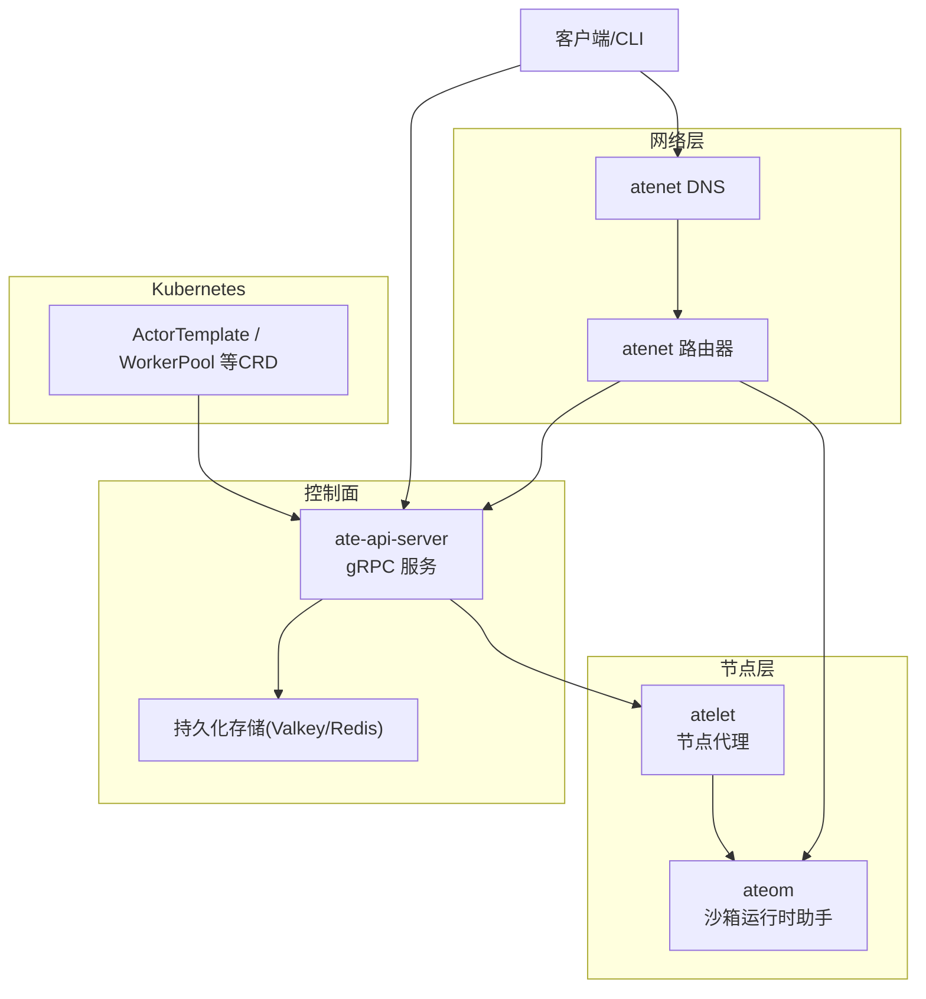
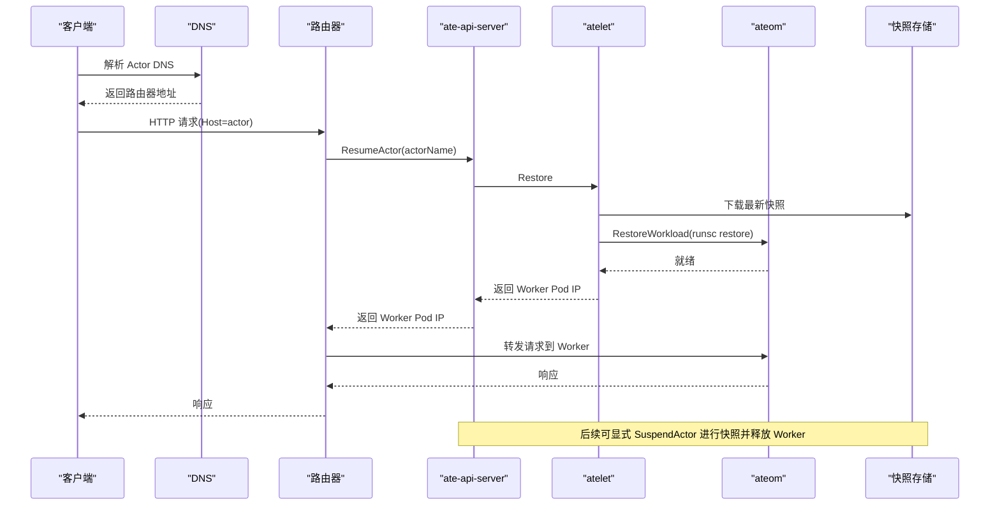
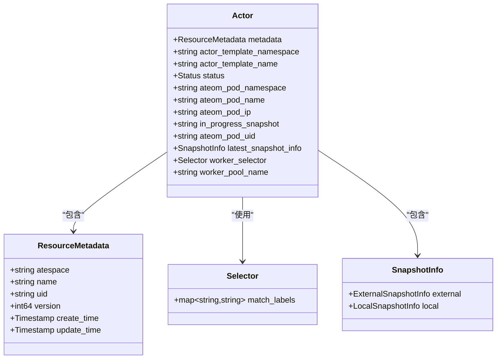
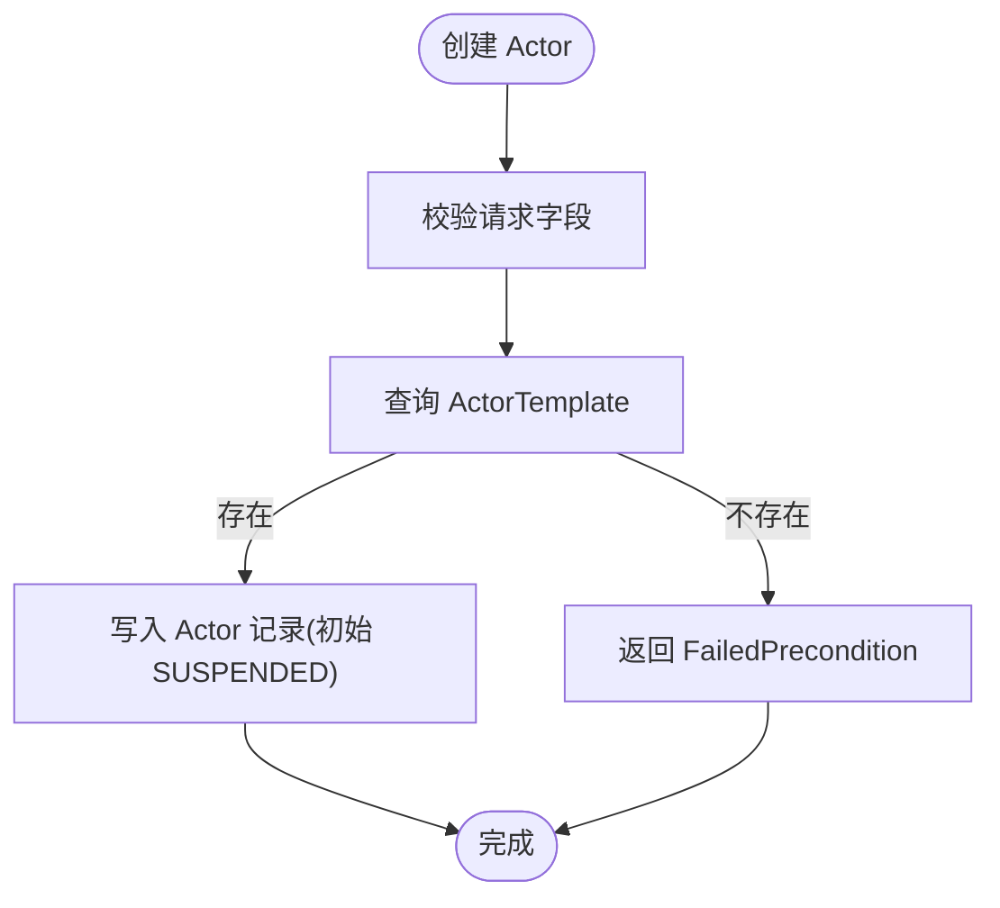
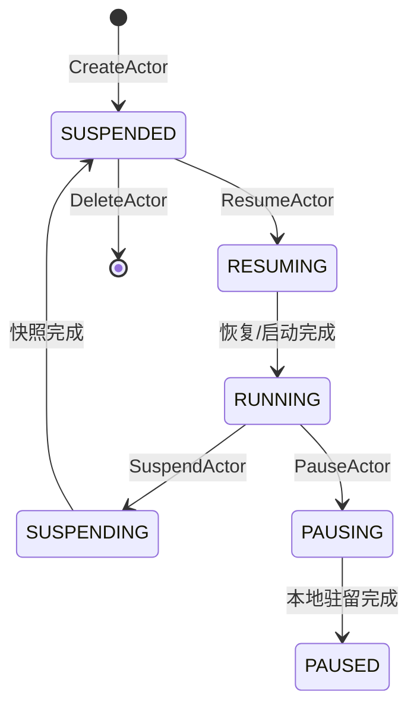
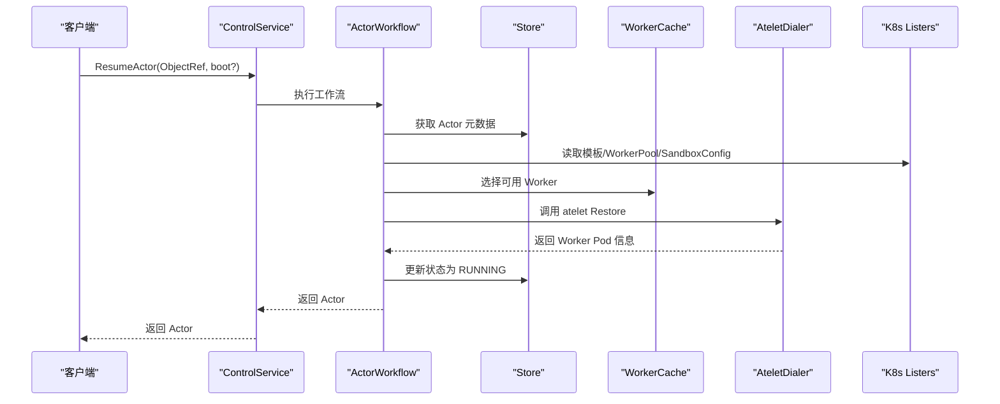
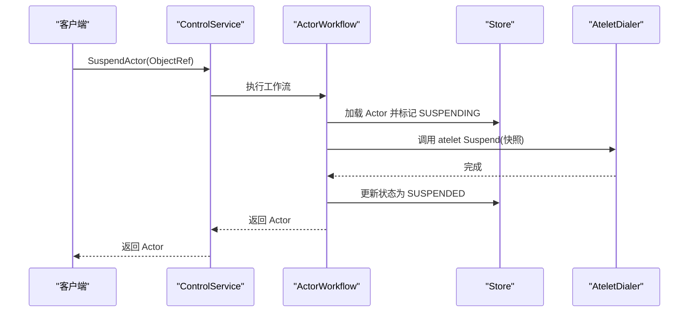
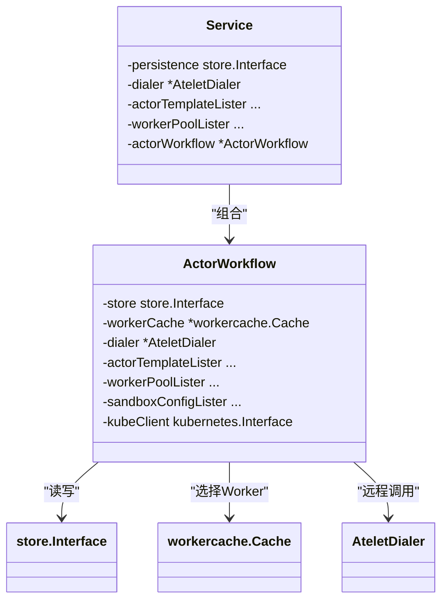

# Actor模型

<cite>
**本文引用的文件**   
- [README.md](file://README.md)
- [architecture.md](file://docs/architecture.md)
- [ateapi.proto](file://pkg/proto/ateapipb/ateapi.proto)
- [service.go](file://cmd/ateapi/internal/controlapi/service.go)
- [workflow.go](file://cmd/ateapi/internal/controlapi/workflow.go)
- [create_actor.go](file://cmd/ateapi/internal/controlapi/create_actor.go)
- [resume_actor.go](file://cmd/ateapi/internal/controlapi/resume_actor.go)
- [suspend_actor.go](file://cmd/ateapi/internal/controlapi/suspend_actor.go)
- [pause_actor.go](file://cmd/ateapi/internal/controlapi/pause_actor.go)
- [actortemplate_types.go](file://pkg/api/v1alpha1/actortemplate_types.go)
- [create_actor.go](file://cmd/kubectl-ate/internal/cmd/create_actor.go)
- [suspend_actor.go](file://cmd/kubectl-ate/internal/cmd/suspend_actor.go)
- [get_actors.go](file://cmd/kubectl-ate/internal/cmd/get_actors.go)
- [root.go](file://cmd/kubectl-ate/internal/cmd/root.go)
- [demo_test.go](file://internal/e2e/suites/demo/demo_test.go)
</cite>

## 目录
1. [简介](#简介)
2. [项目结构](#项目结构)
3. [核心组件](#核心组件)
4. [架构总览](#架构总览)
5. [详细组件分析](#详细组件分析)
6. [依赖关系分析](#依赖关系分析)
7. [性能考量](#性能考量)
8. [故障排查指南](#故障排查指南)
9. [结论](#结论)
10. [附录](#附录)

## 简介
本文件围绕 Agent Substrate 的 Actor 模型，系统性阐述以下要点：
- Actor 作为无状态计算单元的核心概念与在 Worker 之间的迁移机制
- Actor 生命周期管理（创建、暂停、恢复、挂起、删除）
- Actor 与 ActorTemplate 的关系及模板如何定义类属性与行为
- gRPC 接口与 kubectl-ate CLI 的使用示例
- Actor 的状态跟踪机制与标识符系统
- 分布式一致性保障与最佳实践

## 项目结构
Agent Substrate 将“应用实例”抽象为 Actor，通过控制面（ate-api-server）、节点代理（atelet）、网络路由（atenet）以及沙箱运行时（如 gVisor/microvm）协同完成调度、快照与恢复。Actor 以“按名+隔离域”的方式被唯一标识，并通过模板（ActorTemplate）描述其运行环境与约束。

图示来源
- [architecture.md:353-396](file://docs/architecture.md#L353-L396)
- [service.go:25-56](file://cmd/ateapi/internal/controlapi/service.go#L25-L56)

章节来源
- [README.md:1-225](file://README.md#L1-L225)
- [architecture.md:353-396](file://docs/architecture.md#L353-L396)

## 核心组件
- Actor：代表单个应用程序实例，具备唯一标识（atespace + name + uid + version），并维护运行状态与位置信息。
- ActorTemplate：Kubernetes CRD，声明容器镜像、卷挂载、快照策略、沙箱类别与调度选择器等“类属性”。
- WorkerPool/Worker：承载 Actor 的物理 Pod 集合与具体实例。
- ate-api-server：对外暴露 Control RPC，编排 Actor 生命周期工作流。
- atelet：节点级守护进程，协调快照、恢复与本地驻留（Pause）。
- atenet：提供 DNS 解析与请求路由，必要时触发 Resume。

章节来源
- [ateapi.proto:117-157](file://pkg/proto/ateapipb/ateapi.proto#L117-L157)
- [actortemplate_types.go:278-340](file://pkg/api/v1alpha1/actortemplate_types.go#L278-L340)
- [service.go:25-56](file://cmd/ateapi/internal/controlapi/service.go#L25-L56)

## 架构总览
下图展示一次典型“从挂起到恢复”的请求路径与状态迁移。

图示来源
- [architecture.md:353-396](file://docs/architecture.md#L353-L396)

## 详细组件分析

### Actor 数据模型与标识符
- 标识体系
  - 逻辑标识：由 (atespace, name) 组成，用于跨集群定位与用户可见命名。
  - 物理标识：uid 由服务器分配且不可变；version 随每次变更递增，用于乐观并发控制。
- 关键属性
  - 模板引用：actor_template_namespace/name
  - 运行位置：ateom_pod_namespace/name/ip/uid
  - 快照信息：in_progress_snapshot、latest_snapshot_info
  - 调度约束：worker_selector（与模板的 workerSelector 做 AND 匹配）
  - 归属池：worker_pool_name（用于释放已分配的 Worker）

图示来源
- [ateapi.proto:93-157](file://pkg/proto/ateapipb/ateapi.proto#L93-L157)

章节来源
- [ateapi.proto:93-157](file://pkg/proto/ateapipb/ateapi.proto#L93-L157)

### Actor 与 ActorTemplate 的关系
- ActorTemplate 是“类”，定义：
  - 容器镜像、命令参数与环境变量
  - 卷与挂载点（支持 DurableDir 参与快照）
  - 快照策略（Full/Data，区分 Pause/Commit 范围）
  - 沙箱类别（gvisor/microvm）
  - 调度选择器（workerSelector）
- 创建 Actor 时必须指定模板名称与命名空间；模板校验失败或不存在会拒绝创建。

图示来源
- [create_actor.go:32-82](file://cmd/ateapi/internal/controlapi/create_actor.go#L32-L82)
- [actortemplate_types.go:278-340](file://pkg/api/v1alpha1/actortemplate_types.go#L278-L340)

章节来源
- [create_actor.go:32-82](file://cmd/ateapi/internal/controlapi/create_actor.go#L32-L82)
- [actortemplate_types.go:278-340](file://pkg/api/v1alpha1/actortemplate_types.go#L278-L340)

### 生命周期与工作流
- 状态机
  - 初始：SUSPENDED
  - 恢复：RESUMING → RUNNING
  - 挂起：SUSPENDING → SUSPENDED
  - 暂停：PAUSING → PAUSED
  - 异常：CRASHED
- 工作流引擎
  - 每个操作由若干“步骤”构成，支持幂等检查、前置条件校验与指数退避重试
  - 通过分布式锁保证同一 Actor 的并发操作串行化

图示来源
- [architecture.md:386-396](file://docs/architecture.md#L386-L396)

章节来源
- [workflow.go:165-254](file://cmd/ateapi/internal/controlapi/workflow.go#L165-L254)
- [architecture.md:386-396](file://docs/architecture.md#L386-L396)

#### 恢复流程（ResumeActor）

图示来源
- [workflow.go:165-194](file://cmd/ateapi/internal/controlapi/workflow.go#L165-L194)
- [resume_actor.go:29-47](file://cmd/ateapi/internal/controlapi/resume_actor.go#L29-L47)

章节来源
- [workflow.go:165-194](file://cmd/ateapi/internal/controlapi/workflow.go#L165-L194)
- [resume_actor.go:29-47](file://cmd/ateapi/internal/controlapi/resume_actor.go#L29-L47)

#### 挂起流程（SuspendActor）

图示来源
- [workflow.go:196-224](file://cmd/ateapi/internal/controlapi/workflow.go#L196-L224)
- [suspend_actor.go:29-47](file://cmd/ateapi/internal/controlapi/suspend_actor.go#L29-L47)

章节来源
- [workflow.go:196-224](file://cmd/ateapi/internal/controlapi/workflow.go#L196-L224)
- [suspend_actor.go:29-47](file://cmd/ateapi/internal/controlapi/suspend_actor.go#L29-L47)

#### 暂停流程（PauseActor）
- 与挂起不同，暂停将快照保留在节点 VM 上，便于快速恢复而不必从外部存储拉取。
- 工作流步骤包括：加载 Actor → 标记 PAUSING → 调用 atelet Pause → 标记 PAUSED。

章节来源
- [workflow.go:226-254](file://cmd/ateapi/internal/controlapi/workflow.go#L226-L254)
- [pause_actor.go:29-47](file://cmd/ateapi/internal/controlapi/pause_actor.go#L29-L47)

### gRPC 接口概览
- Control 服务提供 Actor 全生命周期操作：Get/Create/Update/Suspend/Pause/Resume/Delete，以及 Worker/Atespace 的管理与列表。
- 所有请求均基于 ObjectRef（atespace + name）定位资源。

章节来源
- [ateapi.proto:25-65](file://pkg/proto/ateapipb/ateapi.proto#L25-L65)

### kubectl-ate CLI 使用示例
- 创建 Atespace 与 Actor
  - 先创建 atespace，再基于模板创建 Actor
- 查看与操作 Actor
  - 列出/获取 Actor 详情
  - 恢复/挂起/删除 Actor

参考命令路径
- [create_actor.go:30-73](file://cmd/kubectl-ate/internal/cmd/create_actor.go#L30-L73)
- [suspend_actor.go:28-56](file://cmd/kubectl-ate/internal/cmd/suspend_actor.go#L28-L56)
- [get_actors.go:31-43](file://cmd/kubectl-ate/internal/cmd/get_actors.go#L31-L43)
- [root.go:34-52](file://cmd/kubectl-ate/internal/cmd/root.go#L34-L52)

章节来源
- [create_actor.go:30-73](file://cmd/kubectl-ate/internal/cmd/create_actor.go#L30-L73)
- [suspend_actor.go:28-56](file://cmd/kubectl-ate/internal/cmd/suspend_actor.go#L28-L56)
- [get_actors.go:31-43](file://cmd/kubectl-ate/internal/cmd/get_actors.go#L31-L43)
- [root.go:34-52](file://cmd/kubectl-ate/internal/cmd/root.go#L34-L52)

### 端到端验证与行为确认
- e2e 测试演示了暂停后恢复、挂起后恢复的数据一致性与状态迁移。

章节来源
- [demo_test.go:209-246](file://internal/e2e/suites/demo/demo_test.go#L209-L246)

## 依赖关系分析
- Service 依赖
  - 持久化存储（store.Interface）
  - 工作缓存（workercache.Cache）
  - 模板/池/沙箱配置 Lister
  - atelet 拨号器（AteletDialer）
  - Kubernetes 客户端（kubernetes.Interface）
- 工作流依赖
  - 通过 RunWorkflow 串联多个 WorkflowStep，实现幂等、前置校验与重试

图示来源
- [service.go:25-56](file://cmd/ateapi/internal/controlapi/service.go#L25-L56)
- [workflow.go:131-163](file://cmd/ateapi/internal/controlapi/workflow.go#L131-L163)

章节来源
- [service.go:25-56](file://cmd/ateapi/internal/controlapi/service.go#L25-L56)
- [workflow.go:131-163](file://cmd/ateapi/internal/controlapi/workflow.go#L131-L163)

## 性能考量
- 高复用与低延迟
  - 大量空闲态 Actor 复用少量 Worker，按需恢复，降低冷启动开销
- 快照粒度与范围
  - Full 快照包含内存与文件系统增量；Data 仅包含持久卷内容，适合频繁提交场景
- 本地驻留（Pause）
  - 将快照留在节点 VM，减少跨节点/跨存储的 I/O，提升二次恢复速度
- 幂等与重试
  - 工作流步骤支持幂等与指数退避，缓解瞬时冲突与网络抖动

[本节为通用指导，不直接分析具体文件]

## 故障排查指南
- 常见错误码与含义
  - AlreadyExists：重复创建同名 Actor
  - FailedPrecondition：模板不存在、Atespace 不存在、或前置条件不满足
  - NotFound：Actor 不存在
  - Aborted：并发更新冲突（建议客户端重试）
- 定位思路
  - 通过 get actors 与 get workers 观察当前状态与分配情况
  - 结合日志与追踪（OpenTelemetry）定位具体步骤失败点
  - 检查模板与沙箱类别是否匹配，确保 WorkerPool 标签与选择器一致

章节来源
- [create_actor.go:32-82](file://cmd/ateapi/internal/controlapi/create_actor.go#L32-L82)
- [resume_actor.go:29-47](file://cmd/ateapi/internal/controlapi/resume_actor.go#L29-L47)
- [suspend_actor.go:29-47](file://cmd/ateapi/internal/controlapi/suspend_actor.go#L29-L47)
- [pause_actor.go:29-47](file://cmd/ateapi/internal/controlapi/pause_actor.go#L29-L47)

## 结论
Actor 模型将“应用实例”抽象为轻量、可迁移的计算单元，配合模板化的运行环境定义与快照/驻留机制，实现了高倍率复用与秒级激活。通过 gRPC 与 CLI 的统一入口，开发者可以便捷地管理 Actor 的生命周期，并在分布式环境中获得一致、可观测的运行体验。

[本节为总结性内容，不直接分析具体文件]

## 附录
- 术语速查
  - Actor：应用实例
  - ActorTemplate：实例模板（Kubernetes CRD）
  - WorkerPool/Worker：承载实例的 Pod 集合与实例
  - Atespace：隔离域
  - 快照：Full/Data 两种范围
  - 暂停/挂起：Pause/Suspend 的不同语义

[本节为概念性说明，不直接分析具体文件]
