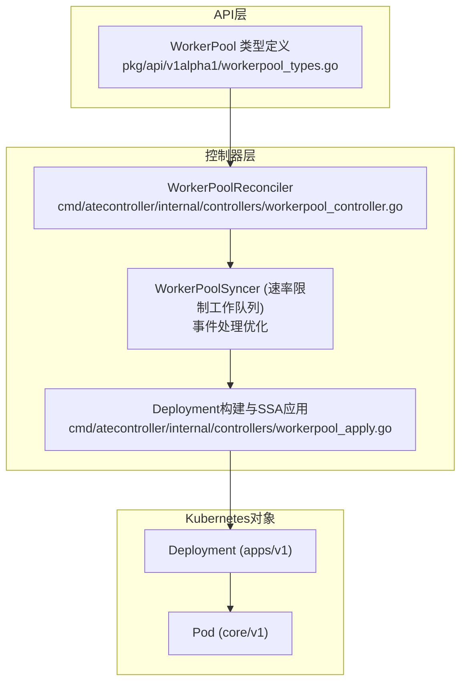
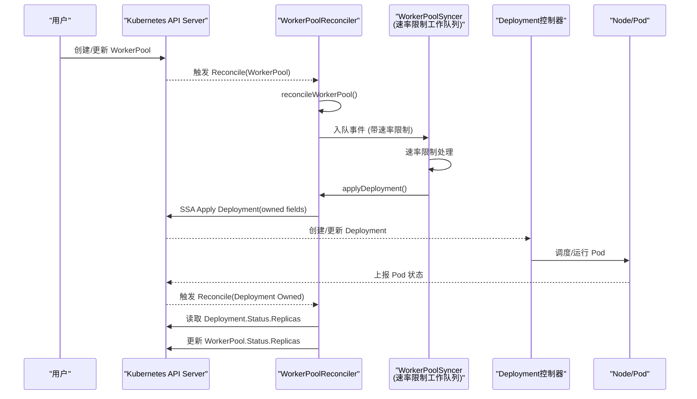
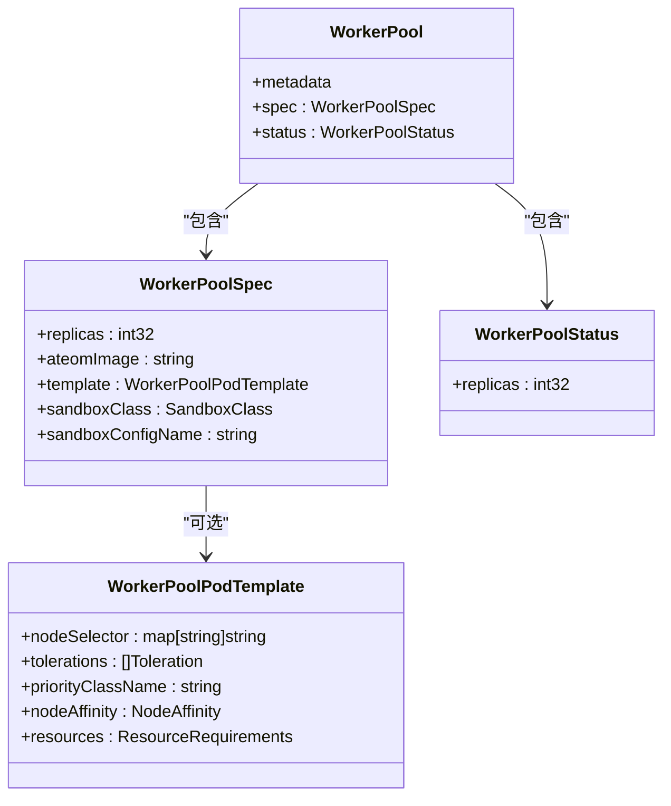
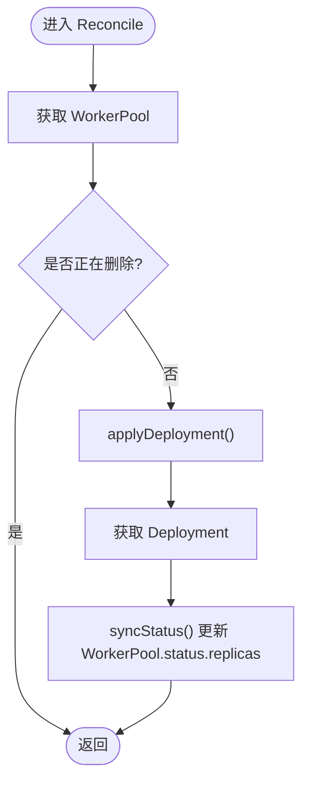
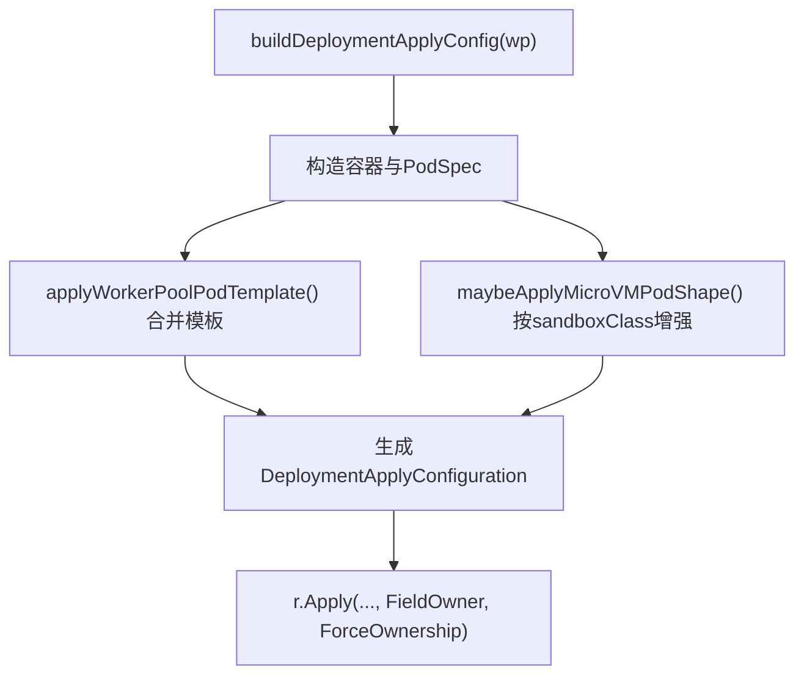
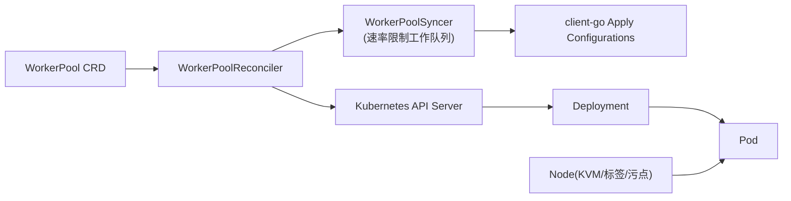

# WorkerPool池化管理

<cite>
**本文引用的文件**   
- [workerpool_types.go](file://pkg/api/v1alpha1/workerpool_types.go)
- [workerpool_controller.go](file://cmd/atecontroller/internal/controllers/workerpool_controller.go)
- [workerpool_apply.go](file://cmd/atecontroller/internal/controllers/workerpool_apply.go)
- [workerpool_controller_test.go](file://cmd/atecontroller/internal/controllers/workerpool_controller_test.go)
- [workerpool_apply_test.go](file://cmd/atecontroller/internal/controllers/workerpool_apply_test.go)
</cite>

## 更新摘要
**变更内容**   
- 重构WorkerPoolSyncer为使用速率限制的工作队列处理事件
- 解决Informer事件处理期间的存储错误和状态同步问题
- 增强事件处理的稳定性和可靠性

## 目录
1. [简介](#简介)
2. [项目结构](#项目结构)
3. [核心组件](#核心组件)
4. [架构总览](#架构总览)
5. [详细组件分析](#详细组件分析)
6. [依赖关系分析](#依赖关系分析)
7. [性能与可扩展性](#性能与可扩展性)
8. [故障排查指南](#故障排查指南)
9. [结论](#结论)
10. [附录：配置示例与最佳实践](#附录配置示例与最佳实践)

## 简介
WorkerPool是Agent Substrate中用于池化、预启动工作节点（Worker）的自定义资源。其设计理念是通过声明式API描述期望的工作节点数量、镜像与调度策略，由控制器自动创建并维护对应的Kubernetes Deployment，实现资源的弹性伸缩与高可用。WorkerPool通过Server-Side Apply（SSA）与字段所有权机制，确保"期望状态"与"实际状态"的一致性，同时保留其他管理器设置的未拥有字段，避免冲突。

**更新** 最近的重构引入了速率限制的工作队列来处理Informer事件，显著提高了事件处理的稳定性和可靠性，解决了之前可能出现的存储错误和状态同步问题。

## 项目结构
与WorkerPool相关的代码主要分布在以下位置：
- API类型定义：pkg/api/v1alpha1/workerpool_types.go
- 控制器逻辑：cmd/atecontroller/internal/controllers/workerpool_controller.go
- 资源构建与SSA应用：cmd/atecontroller/internal/controllers/workerpool_apply.go
- 单元测试覆盖：cmd/atecontroller/internal/controllers/workerpool_controller_test.go、workerpool_apply_test.go

**图表来源**
- [workerpool_types.go:98-131](file://pkg/api/v1alpha1/workerpool_types.go#L98-L131)
- [workerpool_controller.go:35-120](file://cmd/atecontroller/internal/controllers/workerpool_controller.go#L35-L120)
- [workerpool_apply.go:30-83](file://cmd/atecontroller/internal/controllers/workerpool_apply.go#L30-L83)

## 核心组件
- WorkerPool CRD：声明式描述工作池的副本数、容器镜像、模板与沙箱类。
- WorkerPoolReconciler：控制器主循环，负责读取WorkerPool、应用Deployment、同步状态。
- **新增** WorkerPoolSyncer：基于速率限制的工作队列，专门处理Informer事件，提高事件处理的稳定性和可靠性。
- buildDeploymentApplyConfig：将WorkerPool转换为Deployment的Apply配置，并通过SSA提交。
- 微虚拟机形状适配：根据SandboxClass为microvm添加设备挂载与节点亲和约束。

**更新** 新增了WorkerPoolSyncer组件，使用速率限制的工作队列来优化事件处理流程。

**章节来源**
- [workerpool_types.go:22-89](file://pkg/api/v1alpha1/workerpool_types.go#L22-L89)
- [workerpool_controller.go:47-112](file://cmd/atecontroller/internal/controllers/workerpool_controller.go#L47-112)
- [workerpool_apply.go:30-130](file://cmd/atecontroller/internal/controllers/workerpool_apply.go#L30-L130)

## 架构总览
WorkerPool控制器采用标准的Kubernetes控制器模式：监听WorkerPool与其拥有的Deployment事件，在每次Reconcile中计算期望的Deployment并应用；随后从Deployment状态回写WorkerPool.status.replicas，形成闭环。**更新** 现在通过WorkerPoolSyncer组件使用速率限制的工作队列来处理这些事件，有效防止了事件风暴和存储错误。

**图表来源**
- [workerpool_controller.go:47-112](file://cmd/atecontroller/internal/controllers/workerpool_controller.go#L47-112)
- [workerpool_apply.go:30-83](file://cmd/atecontroller/internal/controllers/workerpool_apply.go#L30-L83)

## 详细组件分析

### WorkerPool 类型与字段语义
- spec.replicas：期望的Worker副本数，最小值为0。
- spec.ateomImage：Worker容器镜像，必填且长度至少为1。
- spec.template：可选的Pod模板，支持nodeSelector、tolerations、priorityClassName、nodeAffinity、resources等。
- spec.sandboxClass：选择沙箱运行时族（gvisor或microvm），影响Pod形状与节点放置。
- spec.sandboxConfigName：选择集群范围的SandboxConfig以获取二进制，需与sandboxClass匹配。
- status.replicas：观测到的副本数，来源于对应Deployment的状态。

**图表来源**
- [workerpool_types.go:22-96](file://pkg/api/v1alpha1/workerpool_types.go#L22-L96)
- [workerpool_types.go:98-131](file://pkg/api/v1alpha1/workerpool_types.go#L98-L131)

**章节来源**
- [workerpool_types.go:22-96](file://pkg/api/v1alpha1/workerpool_types.go#L22-L96)
- [workerpool_types.go:98-131](file://pkg/api/v1alpha1/workerpool_types.go#L98-L131)

### 控制器主循环与状态同步
- Reconcile：拉取WorkerPool，处理删除场景，调用reconcileWorkerPool。
- reconcileWorkerPool：先applyDeployment，再读取Deployment并syncStatus。
- syncStatus：将Deployment.Status.Replicas写入WorkerPool.Status.Replicas。
- SetupWithManager：注册For(WorkerPool)与Owns(Deployment)，使控制器对两者变更敏感。

**更新** 现在通过WorkerPoolSyncer组件使用速率限制的工作队列来处理事件，提高了事件处理的稳定性和可靠性。

**图表来源**
- [workerpool_controller.go:47-112](file://cmd/atecontroller/internal/controllers/workerpool_controller.go#L47-112)

**章节来源**
- [workerpool_controller.go:47-112](file://cmd/atecontroller/internal/controllers/workerpool_controller.go#L47-112)

### Deployment构建与SSA应用
- buildDeploymentApplyConfig：基于WorkerPool生成Deployment的Apply配置，包括：
  - 容器名称、镜像、参数、安全上下文、环境变量、卷挂载。
  - PodSecurityContext、HostPath卷、标签与OwnerReference。
  - 通过selector与labels关联到WorkerPool。
- maybeApplyMicroVMPodShape：当sandboxClass为microvm时，追加/dev/kvm设备挂载与节点选择器/容忍，以实现KVM能力节点的亲和。
- applyWorkerPoolPodTemplate：合并用户提供的调度与资源设置（nodeSelector、tolerations、priorityClassName、nodeAffinity、resources）。

**图表来源**
- [workerpool_apply.go:30-83](file://cmd/atecontroller/internal/controllers/workerpool_apply.go#L30-L83)
- [workerpool_apply.go:94-130](file://cmd/atecontroller/internal/controllers/workerpool_apply.go#L94-L130)
- [workerpool_apply.go:132-166](file://cmd/atecontroller/internal/controllers/workerpool_apply.go#L132-L166)

**章节来源**
- [workerpool_apply.go:30-83](file://cmd/atecontroller/internal/controllers/workerpool_apply.go#L30-L83)
- [workerpool_apply.go:94-130](file://cmd/atecontroller/internal/controllers/workerpool_apply.go#L94-L130)
- [workerpool_apply.go:132-166](file://cmd/atecontroller/internal/controllers/workerpool_apply.go#L132-L166)

### 生命周期管理与一致性保证
- 扩容/缩容：修改spec.replicas后，控制器重新应用Deployment，由Deployment控制器驱动Pod扩缩。
- 镜像更新：修改spec.ateomImage后，控制器重新应用Deployment，触发滚动更新。
- 外部篡改恢复：使用ForceOwnership与FieldOwner，控制器会重设被外部修改的"拥有字段"（如replicas、模板字段），保持期望状态。
- 外部删除恢复：若Deployment被外部删除，控制器会在下一次Reconcile重建。
- 状态同步：将Deployment.Status.Replicas回写到WorkerPool.Status.Replicas，供上层观察。

**更新** 通过速率限制的工作队列处理事件，有效避免了事件风暴导致的存储错误和状态不一致问题。

**章节来源**
- [workerpool_controller_test.go:146-175](file://cmd/atecontroller/internal/controllers/workerpool_controller_test.go#L146-L175)
- [workerpool_controller_test.go:177-206](file://cmd/atecontroller/internal/controllers/workerpool_controller_test.go#L177-L206)
- [workerpool_controller_test.go:241-269](file://cmd/atecontroller/internal/controllers/workerpool_controller_test.go#L241-L269)
- [workerpool_controller_test.go:271-297](file://cmd/atecontroller/internal/controllers/workerpool_controller_test.go#L271-L297)
- [workerpool_controller_test.go:299-325](file://cmd/atecontroller/internal/controllers/workerpool_controller_test.go#L299-L325)

### 与Kubernetes Deployment的映射关系
- 命名：Deployment名称与WorkerPool同名，同Namespace。
- 标签：Pod模板与Selector均包含"ate.dev/worker-pool=WorkerPool.Name"。
- OwnerReference：Deployment指向WorkerPool，启用BlockOwnerDeletion，便于级联清理。
- 字段所有权：控制器仅声明自身管理的字段，其余字段（如revisionHistoryLimit）不受影响。

**章节来源**
- [workerpool_apply.go:66-83](file://cmd/atecontroller/internal/controllers/workerpool_apply.go#L66-L83)
- [workerpool_controller_test.go:208-239](file://cmd/atecontroller/internal/controllers/workerpool_controller_test.go#L208-L239)

## 依赖关系分析
- 控制器依赖：
  - Kubernetes client-go Apply配置（apps/v1、core/v1、meta/v1）。
  - 内部路径常量（ateompath.BasePath）用于宿主路径卷挂载。
  - 自定义API v1alpha1（WorkerPool、SandboxClass等）。
- 外部依赖：
  - Kubernetes API Server（CRD、Deployment、Pod状态）。
  - 节点具备所需能力（如microvm需要KVM设备与相应污点/标签）。

**更新** 新增了对速率限制工作队列的依赖，用于稳定处理Informer事件。

**图表来源**
- [workerpool_controller.go:17-31](file://cmd/atecontroller/internal/controllers/workerpool_controller.go#L17-L31)
- [workerpool_apply.go:17-25](file://cmd/atecontroller/internal/controllers/workerpool_apply.go#L17-L25)
- [workerpool_apply.go:94-130](file://cmd/atecontroller/internal/controllers/workerpool_apply.go#L94-L130)

**章节来源**
- [workerpool_controller.go:17-31](file://cmd/atecontroller/internal/controllers/workerpool_controller.go#L17-L31)
- [workerpool_apply.go:17-25](file://cmd/atecontroller/internal/controllers/workerpool_apply.go#L17-L25)
- [workerpool_apply.go:94-130](file://cmd/atecontroller/internal/controllers/workerpool_apply.go#L94-L130)

## 性能与可扩展性
- SSA与字段所有权：减少全量覆盖带来的冲突与重写成本，提升并发安全性。
- 只声明拥有字段：允许其他管理器并行操作非拥有字段，降低协调开销。
- 状态同步轻量：仅同步replicas，避免频繁大对象更新。
- **新增** 速率限制工作队列：有效防止事件风暴，提高系统稳定性。
- **新增** 事件去重和合并：减少不必要的重复处理。
- 建议：
  - 合理设置副本数与资源请求/限制，避免过度扩缩容抖动。
  - 使用节点亲和与污点/容忍进行精细化调度，提高资源利用率。
  - 对镜像版本进行灰度发布，结合滚动更新策略控制风险。
  - 监控工作队列长度和处理延迟，及时调整速率限制参数。

**更新** 新增的性能优化措施显著提高了系统的稳定性和可扩展性。

## 故障排查指南
- 无法创建Deployment：检查WorkerPool.spec.ateomImage是否为空、replicas是否小于0。
- 副本不一致：确认控制器日志中的错误信息；验证是否有外部修改了拥有字段导致反复回滚。
- microvm无法调度：检查节点是否具备KVM设备、是否带有相关标签与污点，以及WorkerPool是否选择了microvm沙箱类。
- 状态不同步：查看Deployment.Status.Replicas是否正确上报；确认控制器能访问status子资源。
- **新增** 事件处理缓慢：检查工作队列长度和速率限制配置，确认是否存在事件堆积。
- **新增** 存储错误：查看速率限制工作队列的错误日志，确认网络或存储连接是否正常。

**更新** 新增了针对速率限制工作队列相关的故障排查指导。

**章节来源**
- [workerpool_validation_test.go:51-64](file://pkg/api/v1alpha1/workerpool_validation_test.go#L51-L64)
- [workerpool_controller_test.go:241-269](file://cmd/atecontroller/internal/controllers/workerpool_controller_test.go#L241-L269)
- [workerpool_apply_test.go:212-262](file://cmd/atecontroller/internal/controllers/workerpool_apply_test.go#L212-L262)

## 结论
WorkerPool通过声明式API与控制器模式，实现了工作节点的池化与自动化管理。借助SSA与字段所有权，系统在多管理器环境下仍能保持稳定一致。**更新** 通过引入速率限制的工作队列处理Informer事件，进一步提高了系统的稳定性和可靠性，有效解决了之前可能出现的存储错误和状态同步问题。配合灵活的Pod模板与沙箱类选择，可满足不同工作负载的调度与隔离需求。

## 附录：配置示例与最佳实践

- 基本示例（gvisor默认沙箱类）
  - 指定replicas与ateomImage，其余使用默认值。
  - 参考测试用例：[workerpool_controller_test.go:111-144](file://cmd/atecontroller/internal/controllers/workerpool_controller_test.go#L111-L144)

- 自定义调度与资源
  - 设置nodeSelector、tolerations、priorityClassName、nodeAffinity、resources。
  - 参考测试用例：[workerpool_controller_test.go:327-397](file://cmd/atecontroller/internal/controllers/workerpool_controller_test.go#L327-L397)

- 镜像与副本更新
  - 更新spec.ateomImage或spec.replicas，控制器会自动应用到Deployment。
  - 参考测试用例：[workerpool_controller_test.go:146-206](file://cmd/atecontroller/internal/controllers/workerpool_controller_test.go#L146-L206)

- 外部字段保护与恢复
  - 非拥有字段保持不变；拥有字段被外部修改会被控制器恢复。
  - 参考测试用例：[workerpool_controller_test.go:208-269](file://cmd/atecontroller/internal/controllers/workerpool_controller_test.go#L208-L269)

- microvm沙箱类
  - 选择sandboxClass=microvm时，控制器会添加/dev/kvm挂载与节点亲和/容忍。
  - 参考测试用例：[workerpool_apply_test.go:212-262](file://cmd/atecontroller/internal/controllers/workerpool_apply_test.go#L212-262)

- 状态同步
  - 控制器将Deployment.Status.Replicas同步至WorkerPool.Status.Replicas。
  - 参考测试用例：[workerpool_controller_test.go:299-325](file://cmd/atecontroller/internal/controllers/workerpool_controller_test.go#L299-L325)

- **新增** 速率限制配置
  - 监控工作队列长度和处理延迟，调整速率限制参数以获得最佳性能。
  - 在高负载环境下适当增加速率限制阈值，避免事件丢失。

**更新** 新增了速率限制配置的实践指导。

**章节来源**
- [workerpool_controller_test.go:111-144](file://cmd/atecontroller/internal/controllers/workerpool_controller_test.go#L111-L144)
- [workerpool_controller_test.go:146-206](file://cmd/atecontroller/internal/controllers/workerpool_controller_test.go#L146-L206)
- [workerpool_controller_test.go:208-269](file://cmd/atecontroller/internal/controllers/workerpool_controller_test.go#L208-L269)
- [workerpool_controller_test.go:299-325](file://cmd/atecontroller/internal/controllers/workerpool_controller_test.go#L299-L325)
- [workerpool_apply_test.go:212-262](file://cmd/atecontroller/internal/controllers/workerpool_apply_test.go#L212-262)
