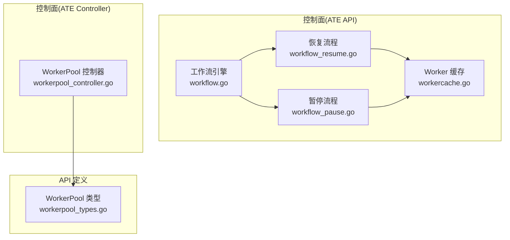
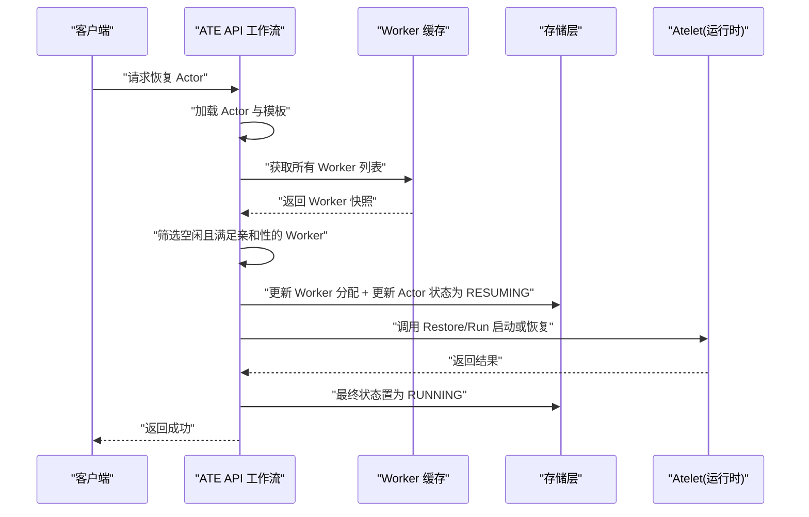
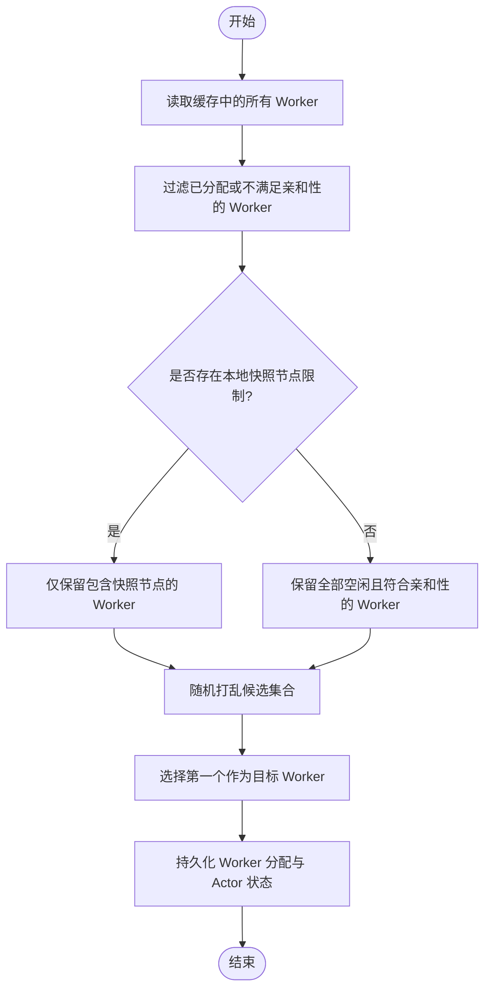
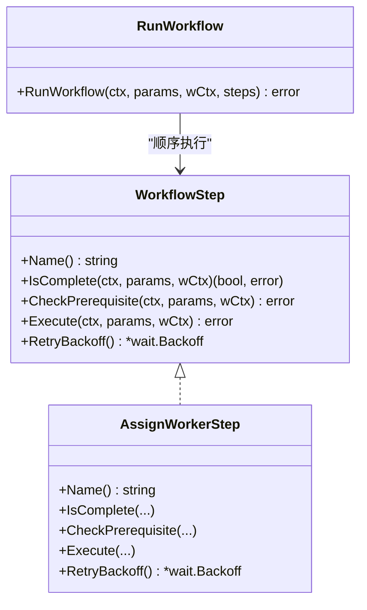
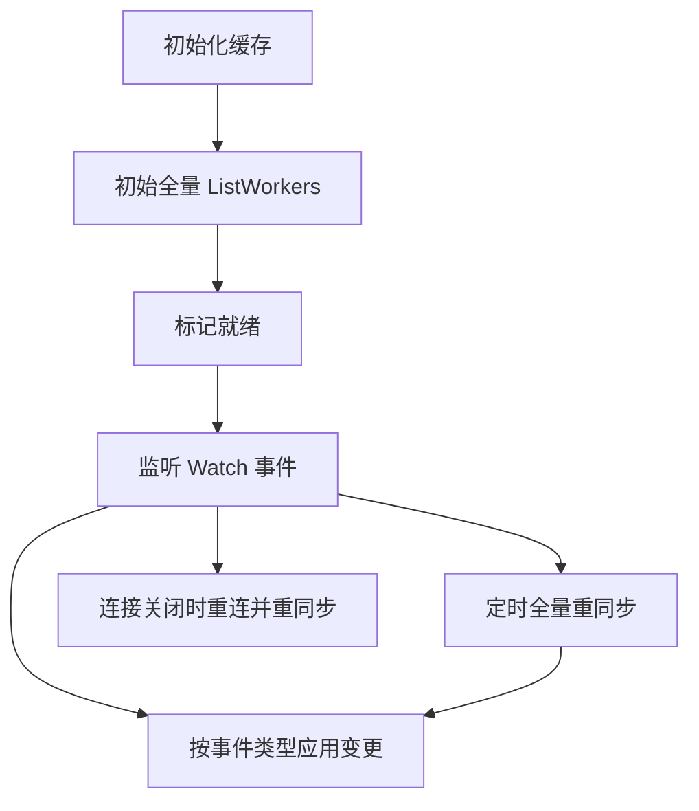
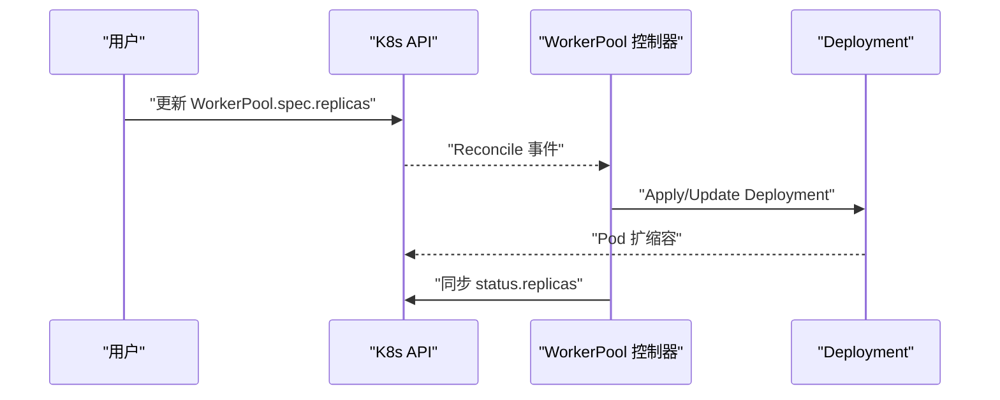
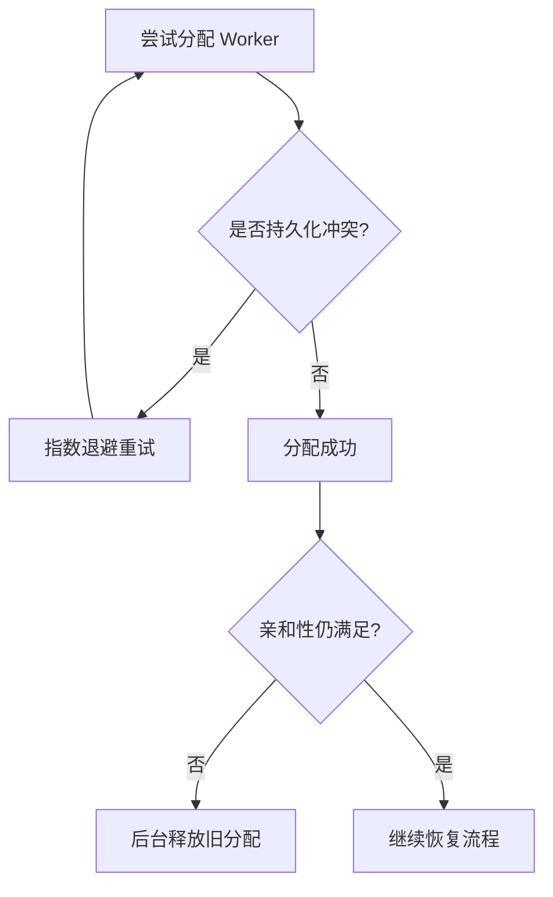
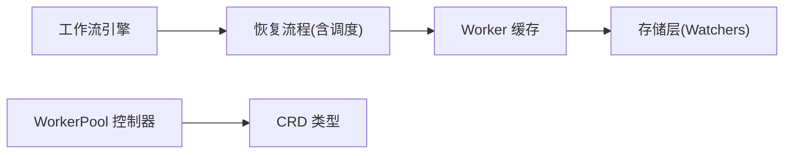

# 动态调度算法

<cite>
**本文引用的文件**   
- [workflow.go](file://cmd/ateapi/internal/controlapi/workflow.go)
- [workflow_resume.go](file://cmd/ateapi/internal/controlapi/workflow_resume.go)
- [workflow_pause.go](file://cmd/ateapi/internal/controlapi/workflow_pause.go)
- [workercache.go](file://cmd/ateapi/internal/workercache/workercache.go)
- [workerpool_controller.go](file://cmd/atecontroller/internal/controllers/workerpool_controller.go)
- [workerpool_types.go](file://pkg/api/v1alpha1/workerpool_types.go)
- [crash.go](file://cmd/ateapi/internal/controlapi/crash.go)
</cite>

## 目录
1. [简介](#简介)
2. [项目结构](#项目结构)
3. [核心组件](#核心组件)
4. [架构总览](#架构总览)
5. [详细组件分析](#详细组件分析)
6. [依赖关系分析](#依赖关系分析)
7. [性能考虑](#性能考虑)
8. [故障排查指南](#故障排查指南)
9. [结论](#结论)
10. [附录](#附录)

## 简介
本文件面向 Agent Substrate 的动态调度子系统，聚焦于“Actor 到 Worker 节点”的智能分配机制、亲和性规则与冲突处理。文档覆盖：
- 调度决策的关键因素（亲和性与约束）
- 负载均衡策略与随机化选择
- 动态扩缩容的实现原理（基于 K8s Deployment 的副本数控制）
- 调度算法的性能优化（缓存与批量重同步）
- 调度冲突与失败重试机制
- 调度策略的配置项与可观测指标建议

## 项目结构
调度相关代码主要分布在以下模块：
- 控制面工作流编排与调度步骤实现（ATE API Server）
- Worker 内存缓存与事件同步
- WorkerPool 控制器（Kubernetes 控制器）
- CRD 类型定义（WorkerPool 等）

**图表来源** 
- [workflow.go:64-108](file://cmd/ateapi/internal/controlapi/workflow.go#L64-L108)
- [workflow_resume.go:142-294](file://cmd/ateapi/internal/controlapi/workflow_resume.go#L142-L294)
- [workflow_pause.go:78-167](file://cmd/ateapi/internal/controlapi/workflow_pause.go#L78-L167)
- [workercache.go:37-90](file://cmd/ateapi/internal/workercache/workercache.go#L37-L90)
- [workerpool_controller.go:47-90](file://cmd/atecontroller/internal/controllers/workerpool_controller.go#L47-L90)
- [workerpool_types.go:22-96](file://pkg/api/v1alpha1/workerpool_types.go#L22-L96)

**章节来源**
- [workflow.go:64-108](file://cmd/ateapi/internal/controlapi/workflow.go#L64-L108)
- [workercache.go:37-90](file://cmd/ateapi/internal/workercache/workercache.go#L37-L90)
- [workerpool_controller.go:47-90](file://cmd/atecontroller/internal/controllers/workerpool_controller.go#L47-L90)
- [workerpool_types.go:22-96](file://pkg/api/v1alpha1/workerpool_types.go#L22-L96)

## 核心组件
- 工作流引擎：提供统一的步骤执行、前置条件检查、幂等快速前进与指数退避重试。
- 恢复流程中的调度步骤：负责从缓存中筛选可用 Worker，应用亲和性与约束，完成分配并持久化。
- Worker 缓存：维护所有 Worker 的内存快照，通过 Watch 增量更新与周期性全量重同步保证一致性。
- WorkerPool 控制器：将 WorkerPool CRD 的期望副本数与实际 Deployment 状态对齐，驱动 Worker 扩缩容。
- 类型定义：WorkerPool 及其模板字段用于声明式配置 Worker 的调度与资源属性。

**章节来源**
- [workflow.go:36-62](file://cmd/ateapi/internal/controlapi/workflow.go#L36-L62)
- [workflow_resume.go:142-294](file://cmd/ateapi/internal/controlapi/workflow_resume.go#L142-L294)
- [workercache.go:37-90](file://cmd/ateapi/internal/workercache/workercache.go#L37-L90)
- [workerpool_controller.go:47-90](file://cmd/atecontroller/internal/controllers/workerpool_controller.go#L47-L90)
- [workerpool_types.go:22-96](file://pkg/api/v1alpha1/workerpool_types.go#L22-L96)

## 架构总览
下图展示了 Actor 恢复时的工作流与调度关键路径，包括工作流编排、Worker 选择、亲和性校验、持久化与后续恢复调用。

**图表来源** 
- [workflow.go:165-194](file://cmd/ateapi/internal/controlapi/workflow.go#L165-L194)
- [workflow_resume.go:163-252](file://cmd/ateapi/internal/controlapi/workflow_resume.go#L163-L252)
- [workercache.go:75-90](file://cmd/ateapi/internal/workercache/workercache.go#L75-L90)

## 详细组件分析

### 调度步骤与亲和性规则
- 亲和性与约束匹配
  - 沙箱类必须一致（例如 gvisor/microvm）。
  - 模板级标签选择器与 Actor 级选择器需同时满足。
  - 可选节点限制：若 Actor 存在本地快照信息，则仅允许在拥有该快照的节点上恢复。
- 负载均衡策略
  - 当前实现采用“随机打乱后取首个”的策略，避免热点集中。
- 冲突与幂等
  - 若发现历史残留分配但不再满足亲和性，会后台释放该 Worker 并继续重新选择。
  - 分配成功后立即持久化，随后进入恢复阶段；若恢复失败，按工作流错误处理。

**图表来源** 
- [workflow_resume.go:119-140](file://cmd/ateapi/internal/controlapi/workflow_resume.go#L119-L140)
- [workflow_resume.go:263-294](file://cmd/ateapi/internal/controlapi/workflow_resume.go#L263-L294)

**章节来源**
- [workflow_resume.go:119-140](file://cmd/ateapi/internal/controlapi/workflow_resume.go#L119-L140)
- [workflow_resume.go:263-294](file://cmd/ateapi/internal/controlapi/workflow_resume.go#L263-L294)

### 工作流引擎与重试机制
- 步骤接口
  - Name/IsComplete/CheckPrerequisite/Execute/RetryBackoff
- 执行语义
  - 幂等快速前进：已完成步骤直接跳过。
  - 前置条件校验：不满足则中止并返回 gRPC 状态码。
  - 自动重试：当步骤返回特定“可重试”错误时，使用指数退避重试。
- 锁与并发
  - 对同一 Actor 的操作加分布式锁，避免竞态。

**图表来源** 
- [workflow.go:36-62](file://cmd/ateapi/internal/controlapi/workflow.go#L36-L62)
- [workflow.go:64-108](file://cmd/ateapi/internal/controlapi/workflow.go#L64-L108)
- [workflow_resume.go:142-261](file://cmd/ateapi/internal/controlapi/workflow_resume.go#L142-L261)

**章节来源**
- [workflow.go:36-62](file://cmd/ateapi/internal/controlapi/workflow.go#L36-L62)
- [workflow.go:64-108](file://cmd/ateapi/internal/controlapi/workflow.go#L64-L108)
- [workflow_resume.go:142-261](file://cmd/ateapi/internal/controlapi/workflow_resume.go#L142-L261)

### Worker 缓存与一致性
- 设计要点
  - 内存快照：Workers() 返回只读切片，避免并发修改。
  - 事件驱动：WatchWorkers 增量更新，删除/创建/更新均按版本号去重。
  - 周期重同步：防止事件丢失导致的状态漂移。
- 可用性
  - 连接断开时标记未就绪，调用方应重试。

**图表来源** 
- [workercache.go:62-73](file://cmd/ateapi/internal/workercache/workercache.go#L62-L73)
- [workercache.go:92-127](file://cmd/ateapi/internal/workercache/workercache.go#L92-L127)
- [workercache.go:129-180](file://cmd/ateapi/internal/workercache/workercache.go#L129-L180)

**章节来源**
- [workercache.go:62-73](file://cmd/ateapi/internal/workercache/workercache.go#L62-L73)
- [workercache.go:92-127](file://cmd/ateapi/internal/workercache/workercache.go#L92-L127)
- [workercache.go:129-180](file://cmd/ateapi/internal/workercache/workercache.go#L129-L180)

### 动态扩缩容（基于 K8s Deployment）
- 控制器职责
  - 监听 WorkerPool 变更，Apply 对应 Deployment，确保实际副本数与期望一致。
  - 同步状态至 WorkerPool.Status.Replicas。
- 扩缩容触发
  - 用户调整 spec.replicas 即触发扩缩容。
  - 结合 HPA/VPA 可实现基于负载的自动扩缩容（由上层编排系统驱动）。

**图表来源** 
- [workerpool_controller.go:47-90](file://cmd/atecontroller/internal/controllers/workerpool_controller.go#L47-L90)
- [workerpool_types.go:54-96](file://pkg/api/v1alpha1/workerpool_types.go#L54-L96)

**章节来源**
- [workerpool_controller.go:47-90](file://cmd/atecontroller/internal/controllers/workerpool_controller.go#L47-L90)
- [workerpool_types.go:54-96](file://pkg/api/v1alpha1/workerpool_types.go#L54-L96)

### 调度冲突与失败重试
- 冲突处理
  - 分配步骤支持指数退避重试，针对持久化冲突进行自动恢复。
  - 若历史分配不再满足亲和性，后台尝试释放旧分配，避免资源泄漏。
- 崩溃清理
  - 在必要路径（如恢复前校验失败）主动释放 Worker 并标记 Actor 崩溃，保障一致性。

**图表来源** 
- [workflow_resume.go:254-261](file://cmd/ateapi/internal/controlapi/workflow_resume.go#L254-L261)
- [workflow_resume.go:189-206](file://cmd/ateapi/internal/controlapi/workflow_resume.go#L189-L206)
- [crash.go:77-115](file://cmd/ateapi/internal/controlapi/crash.go#L77-L115)

**章节来源**
- [workflow_resume.go:254-261](file://cmd/ateapi/internal/controlapi/workflow_resume.go#L254-L261)
- [workflow_resume.go:189-206](file://cmd/ateapi/internal/controlapi/workflow_resume.go#L189-L206)
- [crash.go:77-115](file://cmd/ateapi/internal/controlapi/crash.go#L77-L115)

## 依赖关系分析
- 组件耦合
  - 调度步骤依赖 Worker 缓存与存储层；缓存依赖 store.WatchWorkers/ListWorkers。
  - 控制器依赖 K8s 客户端与 CRD 类型。
- 外部依赖
  - Kubernetes Informer/Controller 框架
  - gRPC/Protobuf 通信（与 Atelet 交互）
- 潜在循环依赖
  - 无直接循环；各模块职责清晰，通过接口解耦。

**图表来源** 
- [workflow.go:131-163](file://cmd/ateapi/internal/controlapi/workflow.go#L131-L163)
- [workercache.go:37-90](file://cmd/ateapi/internal/workercache/workercache.go#L37-L90)
- [workerpool_controller.go:35-48](file://cmd/atecontroller/internal/controllers/workerpool_controller.go#L35-L48)
- [workerpool_types.go:98-136](file://pkg/api/v1alpha1/workerpool_types.go#L98-L136)

**章节来源**
- [workflow.go:131-163](file://cmd/ateapi/internal/controlapi/workflow.go#L131-L163)
- [workercache.go:37-90](file://cmd/ateapi/internal/workercache/workercache.go#L37-L90)
- [workerpool_controller.go:35-48](file://cmd/atecontroller/internal/controllers/workerpool_controller.go#L35-L48)
- [workerpool_types.go:98-136](file://pkg/api/v1alpha1/workerpool_types.go#L98-L136)

## 性能考虑
- 缓存优化
  - 内存快照 O(1) 读取，适合高频调度路径。
  - 事件驱动减少全量扫描开销；周期性重同步保障一致性。
- 批量处理
  - 重同步分页拉取，避免一次性大对象导致的内存峰值。
- 扩展方向
  - 可按节点、标签建立索引以加速筛选。
  - 引入更细粒度的负载均衡策略（如最少任务数、CPU/内存利用率、网络延迟等），当前实现以随机化为主。

[本节为通用指导，无需具体文件引用]

## 故障排查指南
- 常见问题
  - 无可用 Worker：检查亲和性/节点限制是否正确，确认 WorkerPool 副本数与节点资源。
  - 分配冲突：观察是否频繁出现持久化冲突；必要时增大重试步数或降低并发。
  - 亲和性变更后残留分配：确认后台释放逻辑是否生效，必要时手动清理。
- 定位手段
  - 查看工作流步骤日志与 span 信息。
  - 检查 Worker 缓存就绪状态与重同步频率。
  - 核对 WorkerPool 状态与实际 Deployment 副本数。

**章节来源**
- [workflow.go:64-108](file://cmd/ateapi/internal/controlapi/workflow.go#L64-L108)
- [workercache.go:129-180](file://cmd/ateapi/internal/workercache/workercache.go#L129-L180)
- [workerpool_controller.go:100-112](file://cmd/atecontroller/internal/controllers/workerpool_controller.go#L100-L112)

## 结论
当前调度算法以“亲和性优先 + 随机均衡”为核心，配合工作流幂等与重试、Worker 缓存的高吞吐读取以及 K8s 驱动的扩缩容能力，实现了稳定可靠的 Actor 生命周期管理。未来可在保持现有简洁性的基础上，逐步引入更丰富的调度因子与监控指标，以满足更复杂的业务需求。

[本节为总结性内容，无需具体文件引用]

## 附录

### 调度策略配置项（参考）
- WorkerPool 模板
  - nodeSelector/tolerations/priorityClassName/nodeAffinity/resources：影响 Worker Pod 的调度与资源。
  - replicas：控制 Worker 数量，驱动扩缩容。
- 亲和性与选择器
  - 模板级 workerSelector 与 Actor 级 workerSelector 共同决定可分配的 Worker。
  - 本地快照节点限制：仅在具备快照的节点上恢复。

**章节来源**
- [workerpool_types.go:22-96](file://pkg/api/v1alpha1/workerpool_types.go#L22-L96)
- [workflow_resume.go:119-140](file://cmd/ateapi/internal/controlapi/workflow_resume.go#L119-L140)
- [workflow_resume.go:263-294](file://cmd/ateapi/internal/controlapi/workflow_resume.go#L263-L294)

### 监控指标建议（规划）
- 计数类
  - 调度尝试次数、成功/失败次数、冲突重试次数
  - Worker 缓存重同步次数与失败次数
- 度量类
  - 空闲 Worker 数量、各池分配占比
  - 恢复/运行耗时分布
- 状态类
  - 缓存就绪状态、WorkerPool 期望/实际副本数

[本节为通用建议，无需具体文件引用]
