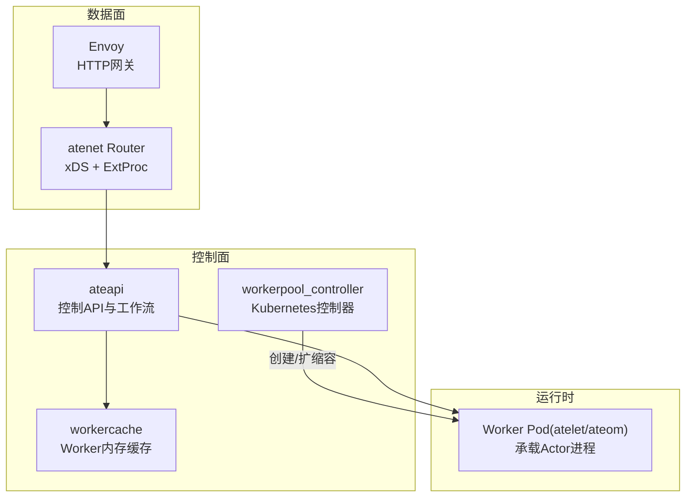
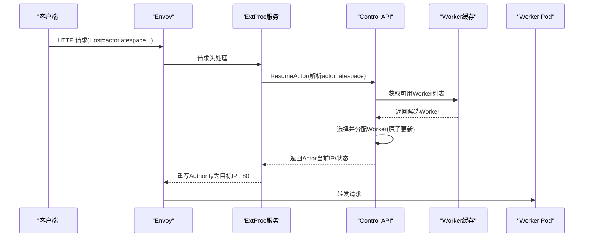
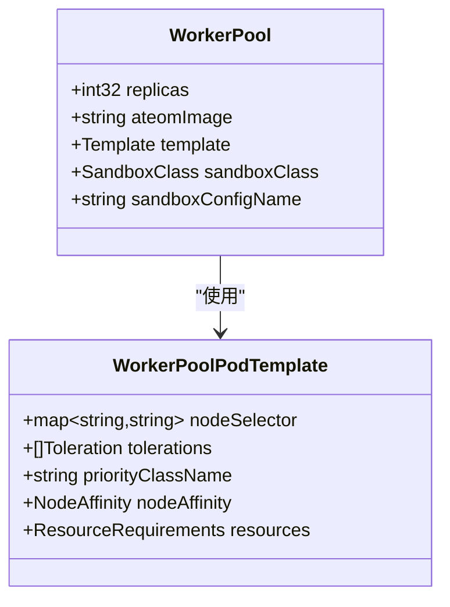
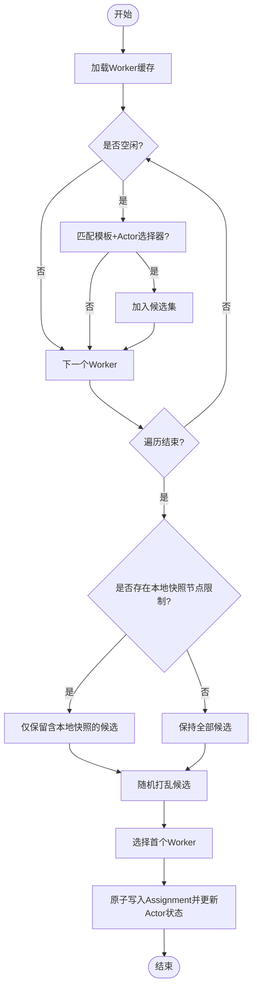
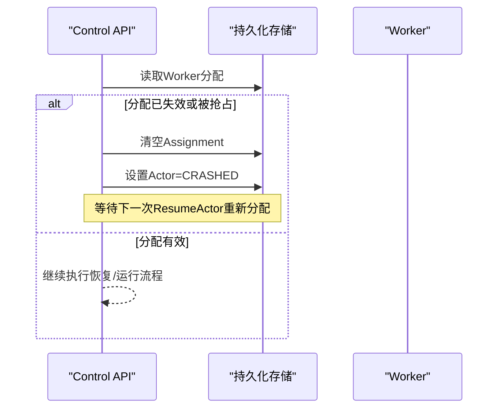
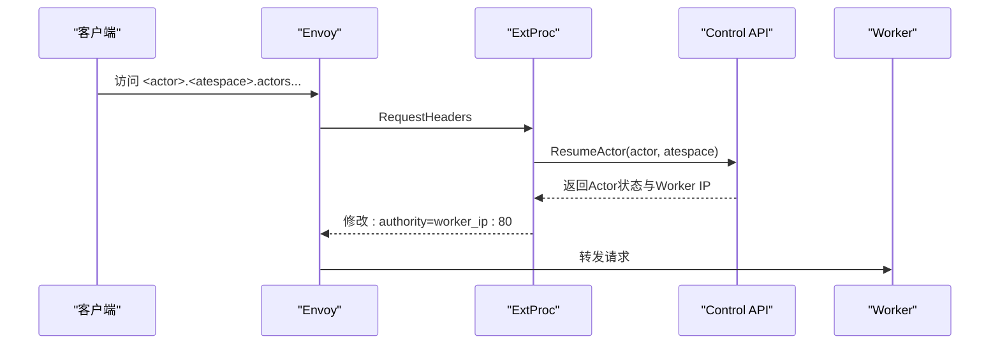
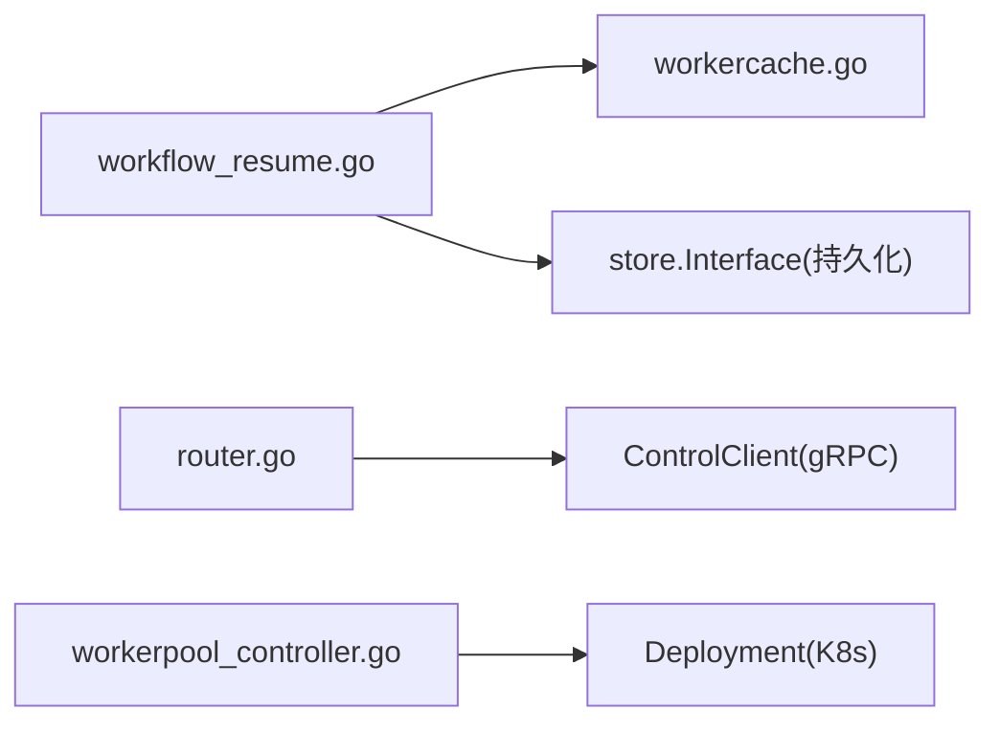

# 多路复用技术

<cite>
**本文引用的文件**   
- [workerpool_types.go](file://pkg/api/v1alpha1/workerpool_types.go)
- [workerpool_controller.go](file://cmd/atecontroller/internal/controllers/workerpool_controller.go)
- [workercache.go](file://cmd/ateapi/internal/workercache/workercache.go)
- [workflow_resume.go](file://cmd/ateapi/internal/controlapi/workflow_resume.go)
- [crash.go](file://cmd/ateapi/internal/controlapi/crash.go)
- [router.go](file://cmd/atenet/internal/router/router.go)
- [extproc.go](file://cmd/atenet/internal/router/extproc.go)
- [xds.go](file://cmd/atenet/internal/router/xds.go)
- [architecture.md](file://docs/architecture.md)
- [ateapi.proto](file://pkg/proto/ateapipb/ateapi.proto)
</cite>

## 目录
1. [简介](#简介)
2. [项目结构](#项目结构)
3. [核心组件](#核心组件)
4. [架构总览](#架构总览)
5. [详细组件分析](#详细组件分析)
6. [依赖关系分析](#依赖关系分析)
7. [性能考虑](#性能考虑)
8. [故障排查指南](#故障排查指南)
9. [结论](#结论)
10. [附录](#附录)

## 简介
本文件面向 Agent Substrate 的多路复用能力，系统性阐述如何将海量 Actor 实例映射到少量 Worker 节点上，实现资源高效利用。内容覆盖：
- WorkerPool 的概念与工作机制（预启动工作节点的池化管理）
- 动态调度算法（智能分配、选择策略与约束）
- 负载均衡与故障转移机制
- 网络层动态路由（按需激活与流量转发）
- 性能优化技巧与容量规划建议
- 配置示例与监控指标指引

## 项目结构
围绕多路复用的关键代码分布在以下模块：
- 控制面（ateapi）：负责 Actor 生命周期、Worker 分配、状态机推进
- 控制器（atecontroller）：基于 Kubernetes CRD 管理 WorkerPool 对应的 Deployment，完成预启动与扩缩容
- 数据面（atenet + Envoy）：提供统一入口、动态 xDS 下发、ExtProc 外部处理以触发按需激活与路由
- 运行时（atelet/ateom）：在 Worker Pod 内运行与恢复 Actor 进程

图表来源
- [router.go:152-315](file://cmd/atenet/internal/router/router.go#L152-L315)
- [xds.go:148-225](file://cmd/atenet/internal/router/xds.go#L148-L225)
- [extproc.go:80-128](file://cmd/atenet/internal/router/extproc.go#L80-L128)
- [workercache.go:62-90](file://cmd/ateapi/internal/workercache/workercache.go#L62-L90)
- [workerpool_controller.go:47-90](file://cmd/atecontroller/internal/controllers/workerpool_controller.go#L47-L90)

章节来源
- [router.go:152-315](file://cmd/atenet/internal/router/router.go#L152-L315)
- [xds.go:148-225](file://cmd/atenet/internal/router/xds.go#L148-L225)
- [extproc.go:80-128](file://cmd/atenet/internal/router/extproc.go#L80-L128)
- [workercache.go:62-90](file://cmd/ateapi/internal/workercache/workercache.go#L62-L90)
- [workerpool_controller.go:47-90](file://cmd/atecontroller/internal/controllers/workerpool_controller.go#L47-L90)

## 核心组件
- WorkerPool（CRD）：声明式定义一组同构的 Worker Pod 副本，包含镜像、调度亲和、资源限制等；由控制器自动落地为 Deployment，实现“预启动”和弹性伸缩。
- workercache：维护所有 Worker 的内存快照，通过 Watch 增量更新并周期性全量重同步，为调度器提供 O(1) 读取。
- 调度工作流（ResumeActor）：从缓存中筛选符合模板与 Actor 双重选择器的空闲 Worker，原子化分配并推进状态至 RESUMING/RUNNING。
- atenet Router + Envoy：对外暴露统一域名空间，请求进入后通过 ExtProc 查询 Actor 位置，必要时触发 ResumeActor，再按 IP 直连 Worker。

章节来源
- [workerpool_types.go:54-89](file://pkg/api/v1alpha1/workerpool_types.go#L54-L89)
- [workerpool_controller.go:73-112](file://cmd/atecontroller/internal/controllers/workerpool_controller.go#L73-L112)
- [workercache.go:37-90](file://cmd/ateapi/internal/workercache/workercache.go#L37-L90)
- [workflow_resume.go:142-252](file://cmd/ateapi/internal/controlapi/workflow_resume.go#L142-L252)
- [extproc.go:130-188](file://cmd/atenet/internal/router/extproc.go#L130-L188)

## 架构总览
多路复用整体流程如下：
- 控制面通过 WorkerPool 预置 Worker 资源，workercache 实时感知可用 Worker
- 当需要恢复或首次运行 Actor 时，调度器依据模板与 Actor 的选择器匹配 Worker，完成分配
- 数据面通过 DNS 与 xDS 将流量导向 ExtProc，后者调用 Control API 完成按需激活与路由

图表来源
- [extproc.go:130-188](file://cmd/atenet/internal/router/extproc.go#L130-L188)
- [workflow_resume.go:163-252](file://cmd/ateapi/internal/controlapi/workflow_resume.go#L163-L252)
- [workercache.go:75-90](file://cmd/ateapi/internal/workercache/workercache.go#L75-L90)

## 详细组件分析

### WorkerPool 与预启动池化
- 概念：WorkerPool 是描述一组 Worker Pod 的声明式资源，包含副本数、镜像、调度规则与资源配额等。
- 预启动机制：控制器监听 WorkerPool 变更，将其转换为 Deployment，确保 Worker Pod 提前就绪，供后续 Actor 快速分配。
- 扩缩容：调整 replicas 即可水平扩展/收缩 Worker 数量，满足峰值需求。

图表来源
- [workerpool_types.go:22-89](file://pkg/api/v1alpha1/workerpool_types.go#L22-L89)

章节来源
- [workerpool_types.go:54-89](file://pkg/api/v1alpha1/workerpool_types.go#L54-L89)
- [workerpool_controller.go:73-112](file://cmd/atecontroller/internal/controllers/workerpool_controller.go#L73-L112)

### 动态调度算法（AssignWorker）
- 输入：Actor 元信息、模板选择器、Actor 自身选择器、本地快照所在节点集合
- 候选过滤：
  - 仅考虑未分配的 Worker
  - 必须同时满足模板选择器与 Actor 选择器
  - 若存在本地快照，优先选择具备该快照的节点（减少跨节点恢复开销）
- 选择策略：对候选集进行随机打乱，选取第一个，避免热点
- 原子分配：克隆 Worker 对象并写入 Assignment，随后更新 Actor 状态为 RESUMING，记录目标 Pod/IP/UID 等信息

图表来源
- [workflow_resume.go:263-294](file://cmd/ateapi/internal/controlapi/workflow_resume.go#L263-L294)
- [workflow_resume.go:163-252](file://cmd/ateapi/internal/controlapi/workflow_resume.go#L163-L252)

章节来源
- [workflow_resume.go:163-252](file://cmd/ateapi/internal/controlapi/workflow_resume.go#L163-L252)
- [workflow_resume.go:263-294](file://cmd/ateapi/internal/controlapi/workflow_resume.go#L263-L294)

### 负载均衡与故障转移
- 负载均衡：
  - 选择阶段对候选 Worker 随机打乱，降低单点压力
  - 支持按节点亲和与标签选择器进行粗粒度分流
- 故障转移：
  - 若 Worker 被回收或不再可用，释放其 Assignment 并标记 Actor 为 CRASHED，等待下次恢复重新分配
  - 恢复流程会校验 Worker 是否仍属于当前 Actor，否则主动崩溃并回滚分配

图表来源
- [crash.go:77-115](file://cmd/ateapi/internal/controlapi/crash.go#L77-L115)
- [workflow_resume.go:316-346](file://cmd/ateapi/internal/controlapi/workflow_resume.go#L316-L346)

章节来源
- [crash.go:77-115](file://cmd/ateapi/internal/controlapi/crash.go#L77-L115)
- [workflow_resume.go:316-346](file://cmd/ateapi/internal/controlapi/workflow_resume.go#L316-L346)

### 网络层动态路由与按需激活
- 统一发现：通过全局 DNS 后缀定位 Actor，请求到达 Envoy
- 外部处理：ExtProc 拦截请求头，解析 actor 标识，调用 Control API 执行 ResumeActor
- 动态路由：根据返回的 Worker IP 重写 Authority，经动态转发代理直连 Worker
- 低延迟激活：绕过 K8s 最终一致性，直接原子分配物理 Worker，缩短首包延迟

图表来源
- [extproc.go:130-188](file://cmd/atenet/internal/router/extproc.go#L130-L188)
- [router.go:152-315](file://cmd/atenet/internal/router/router.go#L152-L315)
- [architecture.md:343-351](file://docs/architecture.md#L343-L351)

章节来源
- [extproc.go:130-188](file://cmd/atenet/internal/router/extproc.go#L130-L188)
- [router.go:152-315](file://cmd/atenet/internal/router/router.go#L152-L315)
- [architecture.md:343-351](file://docs/architecture.md#L343-L351)

### 状态模型与选择器语义
- Actor 状态：包括 RESUMING、RUNNING、SUSPENDED、PAUSED、CRASHED 等，用于驱动工作流推进
- 选择器：
  - 模板级 workerSelector：限定可匹配的 WorkerPool
  - Actor 级 worker_selector：进一步缩小范围，二者取交集
- 分配归属：Worker 的 Assignment 指向 Actor 引用，防止跨 atespace 误用

章节来源
- [ateapi.proto:121-157](file://pkg/proto/ateapipb/ateapi.proto#L121-L157)
- [workflow_resume.go:119-140](file://cmd/ateapi/internal/controlapi/workflow_resume.go#L119-L140)

## 依赖关系分析
- 控制面内部耦合：
  - workflow_resume 依赖 workercache 提供的 Worker 视图
  - crash/release 逻辑依赖 store 接口更新 Worker 与 Actor 状态
- 控制面与数据面交互：
  - atenet Router 通过 gRPC 调用 Control API 完成激活与路由决策
- 控制器与集群：
  - workerpool_controller 通过 Apply 管理 Deployment，保证 Worker 预启动

图表来源
- [workflow_resume.go:163-252](file://cmd/ateapi/internal/controlapi/workflow_resume.go#L163-L252)
- [workercache.go:62-90](file://cmd/ateapi/internal/workercache/workercache.go#L62-L90)
- [router.go:152-315](file://cmd/atenet/internal/router/router.go#L152-L315)
- [workerpool_controller.go:73-112](file://cmd/atecontroller/internal/controllers/workerpool_controller.go#L73-L112)

章节来源
- [workflow_resume.go:163-252](file://cmd/ateapi/internal/controlapi/workflow_resume.go#L163-L252)
- [workercache.go:62-90](file://cmd/ateapi/internal/workercache/workercache.go#L62-L90)
- [router.go:152-315](file://cmd/atenet/internal/router/router.go#L152-L315)
- [workerpool_controller.go:73-112](file://cmd/atecontroller/internal/controllers/workerpool_controller.go#L73-L112)

## 性能考虑
- 缓存读路径优化：workercache 提供内存快照与并发读锁，调度路径无阻塞 I/O
- 选择器计算局部性：优先命中本地快照节点，减少跨节点恢复带来的网络与磁盘 IO
- 随机化选择：避免固定热点 Worker，提升整体吞吐
- 网络路径优化：ExtProc 仅处理请求头，不拷贝请求体；动态转发代理直连 Worker，降低跳数
- 预启动池化：Worker 常驻，避免冷启动开销，提高首包响应时间

[本节为通用指导，无需特定文件引用]

## 故障排查指南
- 无可用 Worker：
  - 现象：ResumeActor 返回“无可用 Worker”
  - 排查：检查 WorkerPool replicas 与标签选择器是否匹配；确认 workercache 是否就绪
- 分配冲突或抢占：
  - 现象：Worker 已被其他 Actor 占用
  - 排查：查看 Worker.Assignment 与 Actor.WorkerPoolName；必要时触发释放与崩溃恢复
- 路由失败：
  - 现象：ExtProc 无法解析 Host 或返回错误
  - 排查：确认 DNS 命名规范、ExtProc 与 Control API 连通性、Actor 状态是否为 RUNNING

章节来源
- [workercache.go:75-90](file://cmd/ateapi/internal/workercache/workercache.go#L75-L90)
- [workflow_resume.go:207-218](file://cmd/ateapi/internal/controlapi/workflow_resume.go#L207-L218)
- [crash.go:77-115](file://cmd/ateapi/internal/controlapi/crash.go#L77-L115)
- [extproc.go:130-188](file://cmd/atenet/internal/router/extproc.go#L130-L188)

## 结论
通过 WorkerPool 预启动、workercache 高速缓存、选择器驱动的调度以及 ExtProc 按需激活的动态路由，Agent Substrate 实现了高并发下的大量 Actor 在少量 Worker 上的高效复用。结合合理的容量规划与监控指标，可在保证低延迟的同时最大化资源利用率。

[本节为总结性内容，无需特定文件引用]

## 附录

### 配置示例要点
- WorkerPool 基本字段：replicas、ateomImage、template（nodeSelector/tolerations/priorityClassName/nodeAffinity/resources）、sandboxClass、sandboxConfigName
- 选择器：
  - 模板级 workerSelector：限定 Pool 级别
  - Actor 级 worker_selector：细化到具体 Pool 或节点
- 网络：
  - 统一 DNS 后缀与 ExtProc 超时配置
  - OTLP 追踪可选开启

章节来源
- [workerpool_types.go:22-89](file://pkg/api/v1alpha1/workerpool_types.go#L22-L89)
- [router.go:66-91](file://cmd/atenet/internal/router/router.go#L66-L91)
- [xds.go:123-146](file://cmd/atenet/internal/router/xds.go#L123-L146)

### 监控指标建议
- 控制面：
  - Worker 计数（gauge）
  - 重同步事件计数（counter）
  - 分配失败/重试次数（counter）
- 数据面：
  - 路由耗时直方图（按模板命名空间/名称与结果分类）
  - ExtProc 请求成功率与错误分类
- 运行时：
  - Worker 健康检查状态
  - 恢复/运行时长分布

章节来源
- [extproc.go:190-212](file://cmd/atenet/internal/router/extproc.go#L190-L212)
- [router.go:188-194](file://cmd/atenet/internal/router/router.go#L188-L194)
