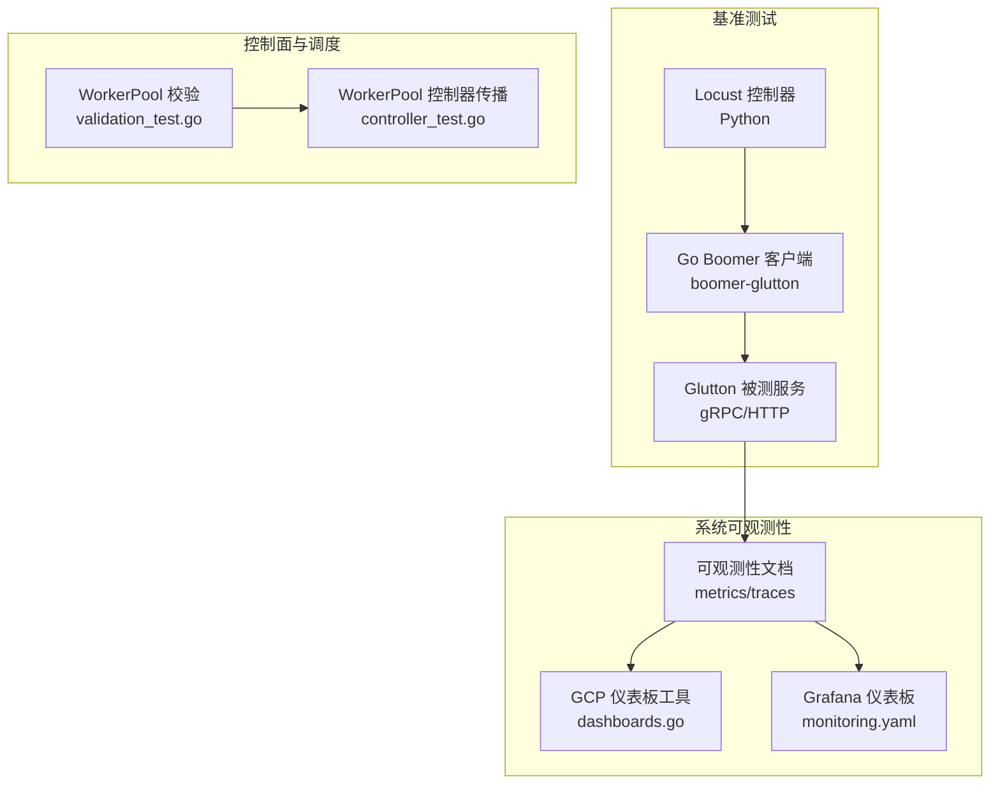
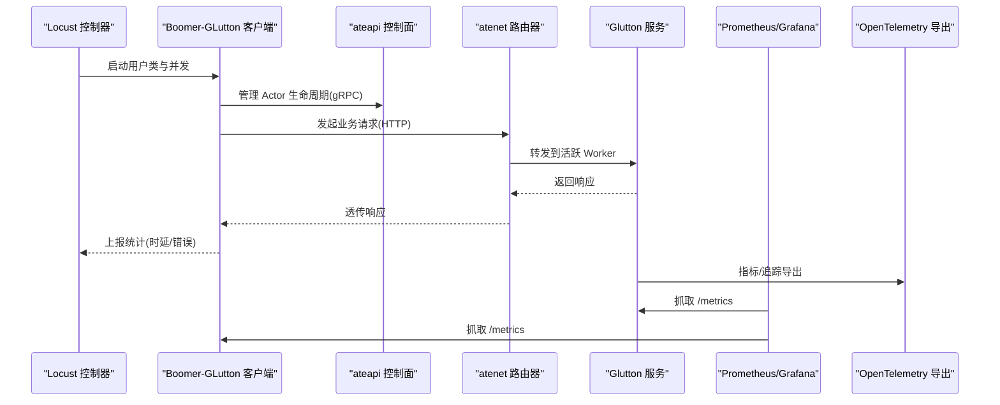
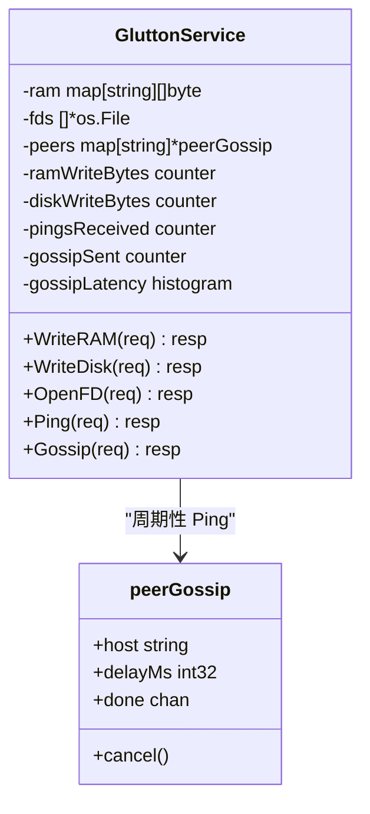
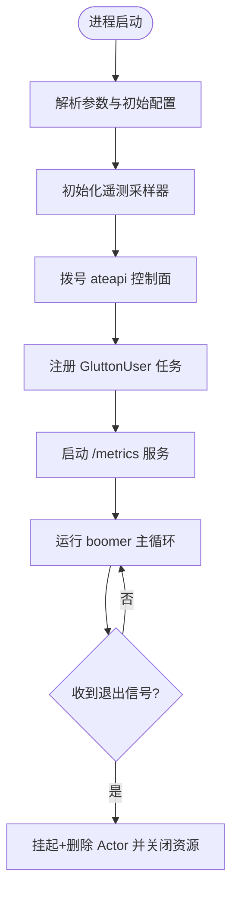
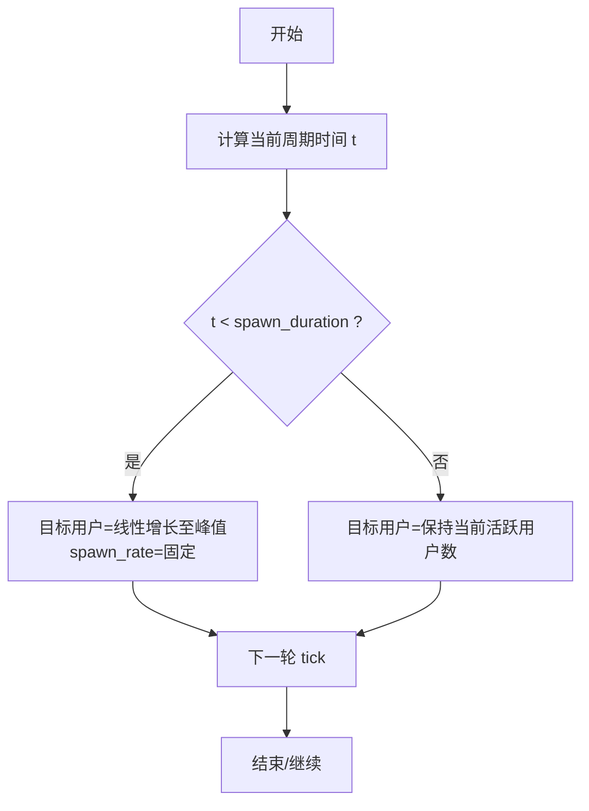
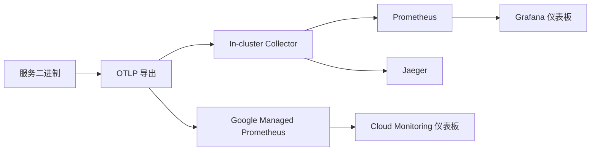
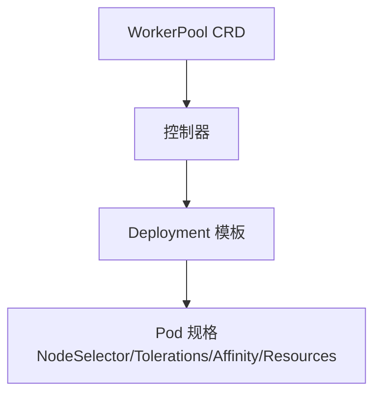
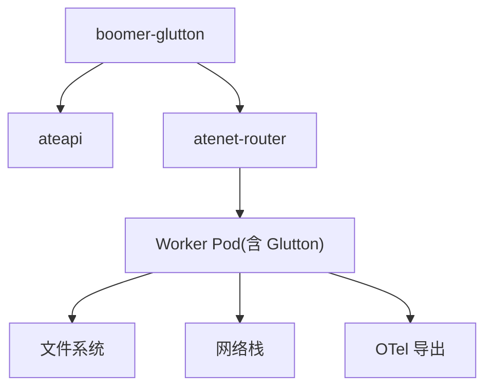

# 性能优化与容量规划

<cite>
**本文引用的文件**   
- [README.md](file://README.md)
- [architecture.md](file://docs/architecture.md)
- [observability.md](file://docs/observability.md)
- [benchmarking/README.md](file://benchmarking/README.md)
- [cmd/benchmarking/glutton/main.go](file://cmd/benchmarking/glutton/main.go)
- [cmd/benchmarking/boomer-glutton/main.go](file://cmd/benchmarking/boomer-glutton/main.go)
- [benchmarking/locust/shapes/burst_shape.py](file://benchmarking/locust/shapes/burst_shape.py)
- [benchmarking/monitoring.yaml](file://benchmarking/monitoring.yaml)
- [tools/setup-gcp/cmd/dashboards.go](file://tools/setup-gcp/cmd/dashboards.go)
- [pkg/api/v1alpha1/workerpool_validation_test.go](file://pkg/api/v1alpha1/workerpool_validation_test.go)
- [cmd/atecontroller/internal/controllers/workerpool_controller_test.go](file://cmd/atecontroller/internal/controllers/workerpool_controller_test.go)
</cite>

## 目录
1. [简介](#简介)
2. [项目结构](#项目结构)
3. [核心组件](#核心组件)
4. [架构总览](#架构总览)
5. [详细组件分析](#详细组件分析)
6. [依赖关系分析](#依赖关系分析)
7. [性能考虑](#性能考虑)
8. [故障排查指南](#故障排查指南)
9. [结论](#结论)
10. [附录](#附录)

## 简介
本文件面向 Agent Substrate 的多路复用性能优化与容量规划，聚焦以下目标：
- 识别多路复用的性能瓶颈（CPU、内存、网络、I/O）并给出监控指标建议
- 制定容量规划最佳实践（Worker 节点数量估算、资源配额设置）
- 阐述关键调优参数（连接池大小、超时配置、缓冲区设置）
- 介绍基准测试方法与工具（压力场景设计与结果分析）
- 根据业务负载模式调整多路复用策略
- 提供性能监控仪表板与告警规则配置示例

Agent Substrate 通过“将大量 Actor 映射到少量 Worker Pod”实现高倍率超分与低延迟唤醒，适合大多数时间空闲的代理类工作负载。其北极星指标包括激活延迟、集群规模与吞吐等。

章节来源
- [README.md:1-225](file://README.md#L1-L225)
- [architecture.md:142-155](file://docs/architecture.md#L142-L155)

## 项目结构
与性能与容量相关的代码与文档主要分布在如下位置：
- 基准测试与压测工具：benchmarking/ 与 cmd/benchmarking/
- 可观测性指标与仪表板：docs/observability.md、tools/setup-gcp/cmd/dashboards.go、benchmarking/monitoring.yaml
- 控制面与调度相关验证：pkg/api/v1alpha1/*、cmd/atecontroller/internal/controllers/*

图表来源
- [benchmarking/README.md:1-90](file://benchmarking/README.md#L1-L90)
- [cmd/benchmarking/boomer-glutton/main.go:1-127](file://cmd/benchmarking/boomer-glutton/main.go#L1-L127)
- [cmd/benchmarking/glutton/main.go:1-573](file://cmd/benchmarking/glutton/main.go#L1-L573)
- [docs/observability.md:1-194](file://docs/observability.md#L1-L194)
- [tools/setup-gcp/cmd/dashboards.go:1-118](file://tools/setup-gcp/cmd/dashboards.go#L1-L118)
- [benchmarking/monitoring.yaml:497-573](file://benchmarking/monitoring.yaml#L497-L573)
- [pkg/api/v1alpha1/workerpool_validation_test.go:81-125](file://pkg/api/v1alpha1/workerpool_validation_test.go#L81-L125)
- [cmd/atecontroller/internal/controllers/workerpool_controller_test.go:362-463](file://cmd/atecontroller/internal/controllers/workerpool_controller_test.go#L362-L463)

章节来源
- [benchmarking/README.md:1-90](file://benchmarking/README.md#L1-L90)
- [docs/observability.md:1-194](file://docs/observability.md#L1-L194)

## 核心组件
- Glutton 基准服务：暴露 gRPC/HTTP 接口用于消耗 CPU、内存、磁盘与 FD，并提供对等 gossip 流量以模拟网络负载；内置 OpenTelemetry 指标与可选 HTTP/Prometheus 端点。
- Boomer-GLutton Go 客户端：基于 boomer 协议作为 Locust worker，对接 ateapi 与 atenet 路由，支持动态采样与遥测。
- Locust 形状与自动化：BurstShape 定义突发负载曲线；自动化编排器负责提交任务、收集日志与统计。
- 可观测性与仪表板：系统级 metrics/traces 文档、GCP 仪表板创建工具、Grafana 本地仪表板。
- WorkerPool 模板与资源约束：通过控制器将 NodeSelector、Tolerations、Affinity、Resources 等模板字段传播至 Deployment，支撑容量与亲和性规划。

章节来源
- [cmd/benchmarking/glutton/main.go:1-573](file://cmd/benchmarking/glutton/main.go#L1-L573)
- [cmd/benchmarking/boomer-glutton/main.go:1-127](file://cmd/benchmarking/boomer-glutton/main.go#L1-L127)
- [benchmarking/locust/shapes/burst_shape.py:1-40](file://benchmarking/locust/shapes/burst_shape.py#L1-L40)
- [docs/observability.md:1-194](file://docs/observability.md#L1-L194)
- [tools/setup-gcp/cmd/dashboards.go:1-118](file://tools/setup-gcp/cmd/dashboards.go#L1-L118)
- [benchmarking/monitoring.yaml:497-573](file://benchmarking/monitoring.yaml#L497-L573)
- [pkg/api/v1alpha1/workerpool_validation_test.go:81-125](file://pkg/api/v1alpha1/workerpool_validation_test.go#L81-L125)
- [cmd/atecontroller/internal/controllers/workerpool_controller_test.go:362-463](file://cmd/atecontroller/internal/controllers/workerpool_controller_test.go#L362-L463)

## 架构总览
下图展示从压测发起端到被测服务的调用链路与可观测性出口，以及控制面对 Worker 资源的编排能力。

图表来源
- [cmd/benchmarking/boomer-glutton/main.go:1-127](file://cmd/benchmarking/boomer-glutton/main.go#L1-L127)
- [cmd/benchmarking/glutton/main.go:1-573](file://cmd/benchmarking/glutton/main.go#L1-L573)
- [docs/observability.md:1-194](file://docs/observability.md#L1-L194)
- [benchmarking/monitoring.yaml:497-573](file://benchmarking/monitoring.yaml#L497-L573)

## 详细组件分析

### Glutton 基准服务（gRPC/HTTP + 指标）
- 功能要点
  - 暴露 gRPC 与可选 HTTP 模式，统一 Ping 路径便于跨协议对比
  - 提供 WriteRAM/WriteDisk/OpenFD/Gossip 等接口，分别用于内存、磁盘、FD 与网络压力注入
  - 使用 OpenTelemetry 记录计数器与直方图（如写入字节数、Ping 计数、Gossip 延迟），并暴露 Prometheus 指标端点
  - 大文件写入采用流式分块以降低峰值内存占用
- 性能关注点
  - CPU：随机数生成、序列化/反序列化、gRPC 处理
  - 内存：WriteRAM 的 map 存储与随机数据分配
  - I/O：WriteDisk 的顺序写与分块大小权衡
  - 网络：Gossip 定时 Ping 的速率与延迟分布
- 指标与可观测性
  - 指标名称与单位在实现中定义，可通过 OTLP 或本地 Prometheus 采集
  - 支持按 host/outcome 等属性聚合，便于定位慢节点与失败比例

图表来源
- [cmd/benchmarking/glutton/main.go:191-298](file://cmd/benchmarking/glutton/main.go#L191-L298)
- [cmd/benchmarking/glutton/main.go:314-386](file://cmd/benchmarking/glutton/main.go#L314-L386)
- [cmd/benchmarking/glutton/main.go:391-416](file://cmd/benchmarking/glutton/main.go#L391-L416)
- [cmd/benchmarking/glutton/main.go:419-422](file://cmd/benchmarking/glutton/main.go#L419-L422)
- [cmd/benchmarking/glutton/main.go:426-475](file://cmd/benchmarking/glutton/main.go#L426-L475)
- [cmd/benchmarking/glutton/main.go:477-533](file://cmd/benchmarking/glutton/main.go#L477-L533)
- [cmd/benchmarking/glutton/main.go:543-572](file://cmd/benchmarking/glutton/main.go#L543-L572)

章节来源
- [cmd/benchmarking/glutton/main.go:1-573](file://cmd/benchmarking/glutton/main.go#L1-L573)

### Boomer-GLutton Go 客户端（Locust Worker）
- 功能要点
  - 通过 myzhan/boomer 接入 Python Locust master，避免 gevent 调度开销
  - 启动时建立 ateapi 控制面连接，注册任务函数，暴露 /metrics 端点
  - 支持动态配置订阅（trace_probability、等待时间范围等），并在异常时快速退出以便重启
- 性能关注点
  - 控制面连接与重试策略
  - HTTP 客户端超时与并发度
  - 遥测采样率对 CPU 的影响

图表来源
- [cmd/benchmarking/boomer-glutton/main.go:37-127](file://cmd/benchmarking/boomer-glutton/main.go#L37-L127)

章节来源
- [cmd/benchmarking/boomer-glutton/main.go:1-127](file://cmd/benchmarking/boomer-glutton/main.go#L1-L127)

### Locust 负载形状与自动化
- BurstShape：定义周期性的突发负载，包含“活跃生成阶段”和“空闲阶段”，用于模拟短时高峰后回落的代理类工作负载
- 自动化编排器：提交 Job、等待完成、拉取日志与统计，并将 CSV 转换为 JSONL 供后续分析

图表来源
- [benchmarking/locust/shapes/burst_shape.py:17-40](file://benchmarking/locust/shapes/burst_shape.py#L17-L40)

章节来源
- [benchmarking/locust/shapes/burst_shape.py:1-40](file://benchmarking/locust/shapes/burst_shape.py#L1-L40)
- [benchmarking/automation/orchestrator.py:307-341](file://benchmarking/automation/orchestrator.py#L307-L341)
- [benchmarking/locust/runner.py:249-365](file://benchmarking/locust/runner.py#L249-L365)

### 可观测性与仪表板
- 系统指标与追踪
  - 指标：rpc.server.call.duration、atenet.router.route.duration、atelet.snapshot.size 等
  - 追踪：按需开启，跨 ateapi/atelet/router/worker 链路
- 本地与云端后端
  - Kind：Prometheus/Jaeger 本地采集
  - GKE：Google Managed Prometheus/Cloud Monitoring/Cloud Trace
- 仪表板
  - GCP：通过 tools/setup-gcp 工具按 displayName 幂等创建/更新仪表板
  - Grafana：benchmarking/monitoring.yaml 提供基础面板与数据源挂载

图表来源
- [docs/observability.md:1-194](file://docs/observability.md#L1-L194)
- [tools/setup-gcp/cmd/dashboards.go:1-118](file://tools/setup-gcp/cmd/dashboards.go#L1-L118)
- [benchmarking/monitoring.yaml:497-573](file://benchmarking/monitoring.yaml#L497-L573)

章节来源
- [docs/observability.md:1-194](file://docs/observability.md#L1-L194)
- [tools/setup-gcp/cmd/dashboards.go:1-118](file://tools/setup-gcp/cmd/dashboards.go#L1-L118)
- [benchmarking/monitoring.yaml:497-573](file://benchmarking/monitoring.yaml#L497-L573)

### WorkerPool 模板与资源配额
- 模板字段传播：NodeSelector、Tolerations、PriorityClassName、Affinity、Resources 等由控制器传播至 Deployment PodTemplate
- 资源限制与校验：测试覆盖资源请求/限制与容忍项上限，确保容量规划的可控性

图表来源
- [cmd/atecontroller/internal/controllers/workerpool_controller_test.go:362-463](file://cmd/atecontroller/internal/controllers/workerpool_controller_test.go#L362-L463)
- [pkg/api/v1alpha1/workerpool_validation_test.go:81-125](file://pkg/api/v1alpha1/workerpool_validation_test.go#L81-L125)

章节来源
- [cmd/atecontroller/internal/controllers/workerpool_controller_test.go:362-463](file://cmd/atecontroller/internal/controllers/workerpool_controller_test.go#L362-L463)
- [pkg/api/v1alpha1/workerpool_validation_test.go:81-125](file://pkg/api/v1alpha1/workerpool_validation_test.go#L81-L125)

## 依赖关系分析
- 组件耦合
  - Boomer-GLutton 依赖 ateapi 控制面与 atenet 路由，形成“控制面 + 数据面”的双通道
  - Glutton 服务依赖文件系统与网络栈，指标通过 OTel 导出
- 外部依赖
  - OpenTelemetry SDK/Exporter、gRPC、HTTP 标准库、myzhan/boomer
- 潜在风险
  - 全局锁竞争（Glutton 内部单锁保护 RAM/FDs/Peers）在高并发下可能成为瓶颈
  - Gossip 子协程泄漏需确保取消与等待 done 通道
  - 大对象分配（WriteRAM）可能导致 GC 抖动

图表来源
- [cmd/benchmarking/boomer-glutton/main.go:1-127](file://cmd/benchmarking/boomer-glutton/main.go#L1-L127)
- [cmd/benchmarking/glutton/main.go:1-573](file://cmd/benchmarking/glutton/main.go#L1-L573)

章节来源
- [cmd/benchmarking/boomer-glutton/main.go:1-127](file://cmd/benchmarking/boomer-glutton/main.go#L1-L127)
- [cmd/benchmarking/glutton/main.go:1-573](file://cmd/benchmarking/glutton/main.go#L1-L573)

## 性能考虑

### 多路复用性能瓶颈识别方法
- CPU
  - 观察 rpc.server.call.duration 的 P95/P99 与时序趋势；结合系统 CPU 使用率与上下文切换
  - 针对 Glutton，关注随机数生成与序列化热点
- 内存
  - 跟踪 WriteRAM 累计写入字节与进程 RSS；注意 GC 暂停与碎片化
  - 监控 FD 打开数（glutton.fds.open）与内核态内存
- 网络
  - 使用 atenet.router.route.duration 评估网关转发耗时
  - 通过 glutton.gossip.latency 与 glutton.gossip.requests.sent 评估对等通信质量
- I/O
  - 监控 disk write 速率与延迟；合理设置分块大小（例如 1MiB）避免一次性加载大对象

章节来源
- [docs/observability.md:103-133](file://docs/observability.md#L103-L133)
- [cmd/benchmarking/glutton/main.go:224-298](file://cmd/benchmarking/glutton/main.go#L224-L298)
- [cmd/benchmarking/glutton/main.go:543-572](file://cmd/benchmarking/glutton/main.go#L543-L572)

### 容量规划最佳实践
- Worker 节点数量估算
  - 依据北极星指标（激活延迟、吞吐）与目标并发，结合单 Pod 承载的 Actor 密度进行估算
  - 参考演示中的超分比（数十倍）作为起点，再按实际负载模型校准
- 资源配额设置
  - 通过 WorkerPool 模板设置 Requests/Limits、NodeSelector、Tolerations、Affinity 与优先级
  - 利用控制器传播机制确保模板变更生效，并通过测试用例验证边界条件

章节来源
- [architecture.md:142-155](file://docs/architecture.md#L142-L155)
- [cmd/atecontroller/internal/controllers/workerpool_controller_test.go:362-463](file://cmd/atecontroller/internal/controllers/workerpool_controller_test.go#L362-L463)
- [pkg/api/v1alpha1/workerpool_validation_test.go:81-125](file://pkg/api/v1alpha1/workerpool_validation_test.go#L81-L125)

### 关键调优参数
- 连接池大小
  - gRPC 客户端连接复用与最大空闲连接数需与并发度匹配，避免频繁握手与队列积压
- 超时配置
  - HTTP 客户端与服务端 RPC 超时应分层设置，防止雪崩；结合重试退避策略
- 缓冲区设置
  - 大对象写入采用分块缓冲（如 1MiB）降低峰值内存；适当增大网络发送/接收缓冲以提升吞吐

章节来源
- [cmd/benchmarking/glutton/main.go:543-572](file://cmd/benchmarking/glutton/main.go#L543-L572)
- [cmd/benchmarking/boomer-glutton/main.go:78-79](file://cmd/benchmarking/boomer-glutton/main.go#L78-L79)

### 基准测试方法与工具
- 工具链
  - Locust（Python）+ Boomer-GLutton（Go）+ Glutton（被测服务）
  - Prometheus/Grafana 本地可视化；GCP 环境使用 Cloud Monitoring
- 场景设计
  - 使用 BurstShape 模拟突发负载；逐步提升用户数与请求频率
  - 组合 WriteRAM/WriteDisk/OpenFD/Gossip 构建复合压力
- 结果分析
  - 关注时延百分位、错误率、吞吐与资源利用率；将 CSV 转为 JSONL 进行离线分析

章节来源
- [benchmarking/README.md:1-90](file://benchmarking/README.md#L1-L90)
- [benchmarking/locust/shapes/burst_shape.py:1-40](file://benchmarking/locust/shapes/burst_shape.py#L1-L40)
- [benchmarking/locust/runner.py:249-365](file://benchmarking/locust/runner.py#L249-L365)
- [benchmarking/monitoring.yaml:497-573](file://benchmarking/monitoring.yaml#L497-L573)

### 不同负载模式下的多路复用策略
- 突发型（Burst）
  - 提高 Worker 弹性伸缩速度，缩短冷启动与唤醒路径
  - 适度放大连接池与缓冲区，减少排队时延
- 平稳型（Steady）
  - 稳定资源配额，避免过度超分导致抖动
  - 精细化采样率与指标粒度，平衡观测成本
- 长尾型（Long-tail）
  - 引入隔离与降级策略，避免个别慢请求拖垮整体
  - 监控 P99/P99.9 时延与错误率，设定差异化告警阈值

[本节为概念性内容，不直接分析具体文件]

## 故障排查指南
- 常见问题定位
  - 激活延迟升高：检查 router.route.duration 与 gRPC 服务端延迟；确认 Worker 是否处于就绪状态
  - 内存飙升：查看 WriteRAM 累计写入与进程 RSS；评估 GC 行为与对象生命周期
  - FD 泄漏：核对 OpenFD 目标计数与实际打开数；确保 Close 路径正确执行
  - Gossip 失败：观察 gossip latency 与 outcome 标签，定位远端不可达或超时
- 可观测性入口
  - 本地：Prometheus/Jaeger UI
  - 云端：Cloud Monitoring/Cloud Trace
  - 仪表板：GCP 仪表板与 Grafana 面板

章节来源
- [docs/observability.md:103-194](file://docs/observability.md#L103-L194)
- [cmd/benchmarking/glutton/main.go:477-533](file://cmd/benchmarking/glutton/main.go#L477-L533)

## 结论
通过系统化的指标采集、合理的容量规划与针对性的参数调优，Agent Substrate 可在代理类工作负载上实现高倍率多路复用与低延迟唤醒。配合完善的基准测试与仪表板体系，能够在不同负载模式下持续优化性能与稳定性。

[本节为总结性内容，不直接分析具体文件]

## 附录

### 监控仪表板与告警规则示例
- 仪表板
  - GCP：通过 dashboards.go 按 displayName 幂等创建/更新仪表板
  - Grafana：monitoring.yaml 提供基础面板与数据源挂载
- 告警规则（示例思路）
  - 激活延迟 P95 超过目标阈值（参考北极星指标）
  - 网关转发时延 P99 异常上升
  - 快照大小分布异常（影响恢复时延）
  - 错误率与超时率突增
  - 资源使用率接近限制（CPU/Memory/FD）

章节来源
- [tools/setup-gcp/cmd/dashboards.go:1-118](file://tools/setup-gcp/cmd/dashboards.go#L1-L118)
- [benchmarking/monitoring.yaml:497-573](file://benchmarking/monitoring.yaml#L497-L573)
- [docs/observability.md:103-133](file://docs/observability.md#L103-L133)
