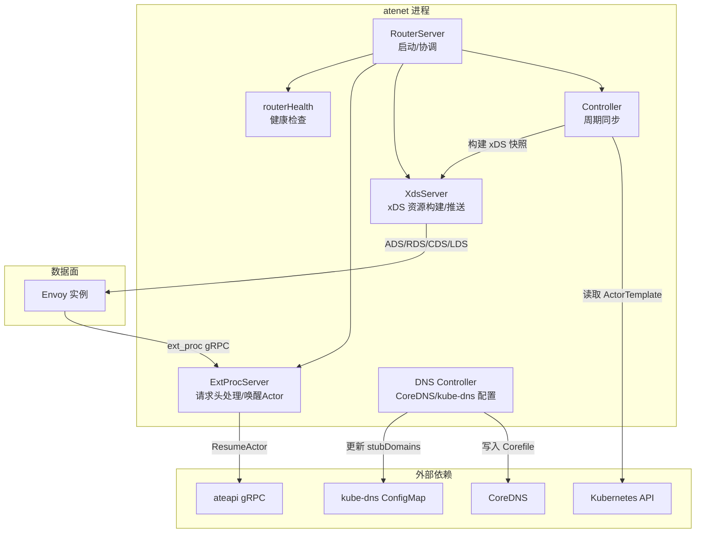
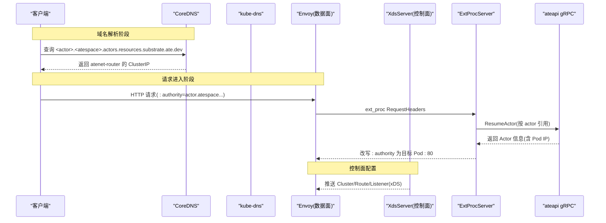
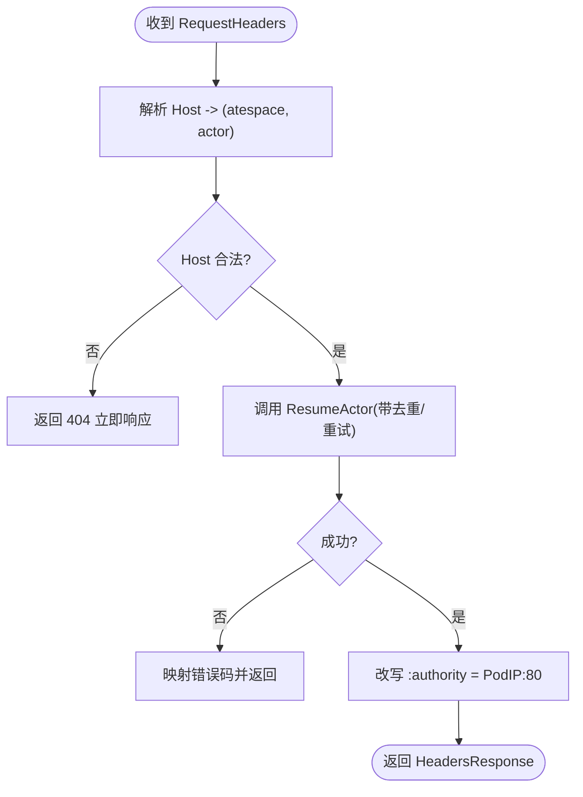
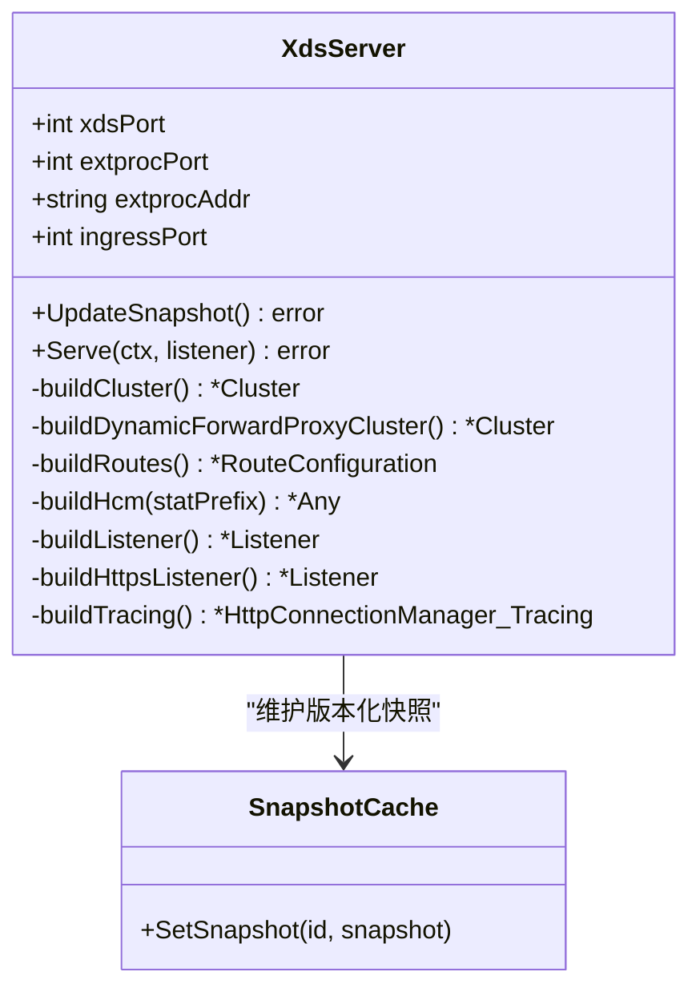
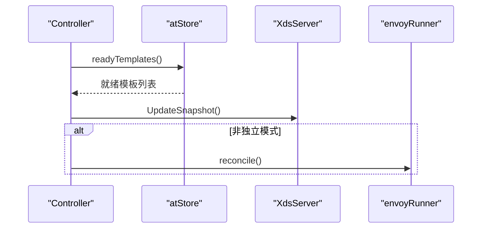
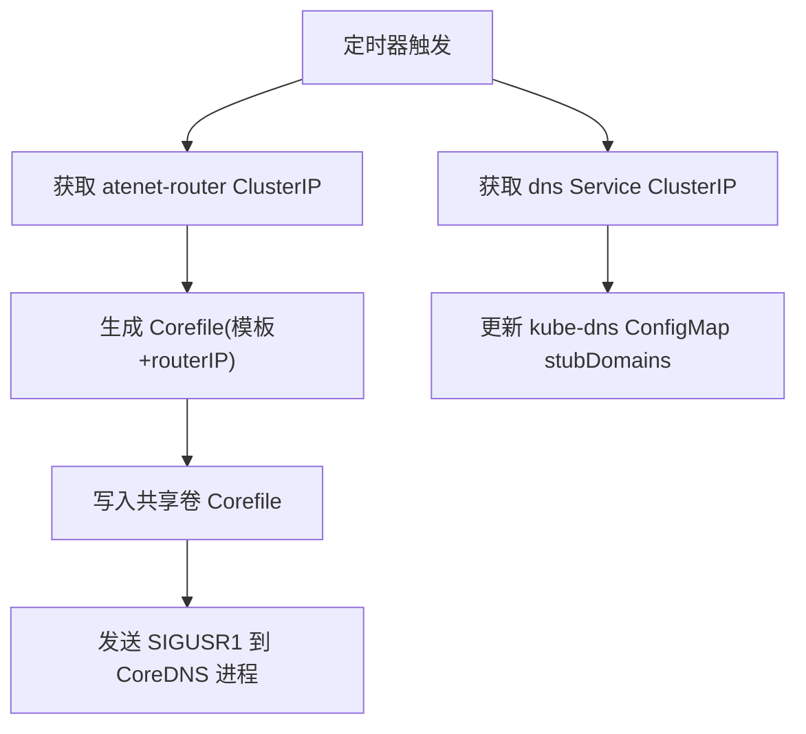
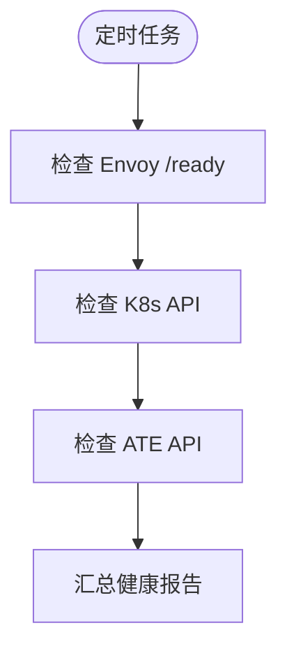
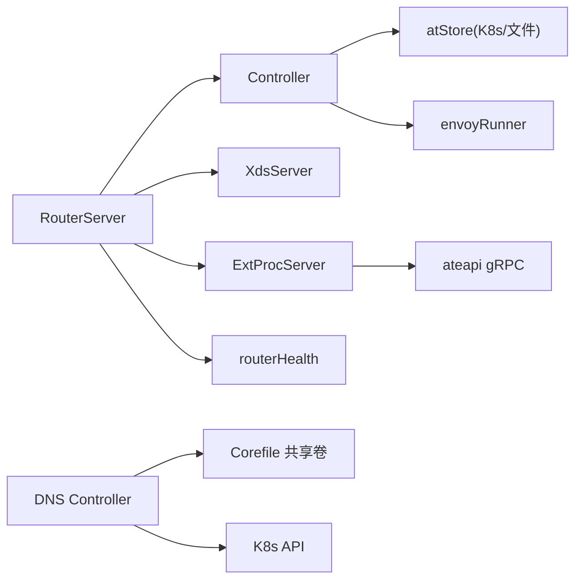

# 网络层动态路由

<cite>
**本文引用的文件**   
- [cmd/atenet/main.go](file://cmd/atenet/main.go)
- [cmd/atenet/README.md](file://cmd/atenet/README.md)
- [cmd/atenet/internal/router/router.go](file://cmd/atenet/internal/router/router.go)
- [cmd/atenet/internal/router/controller.go](file://cmd/atenet/internal/router/controller.go)
- [cmd/atenet/internal/router/xds.go](file://cmd/atenet/internal/router/xds.go)
- [cmd/atenet/internal/router/extproc.go](file://cmd/atenet/internal/router/extproc.go)
- [cmd/atenet/internal/router/extproc_in.go](file://cmd/atenet/internal/router/extproc_in.go)
- [cmd/atenet/internal/router/resumer.go](file://cmd/atenet/internal/router/resumer.go)
- [cmd/atenet/internal/router/health.go](file://cmd/atenet/internal/router/health.go)
- [cmd/atenet/internal/dns/dns.go](file://cmd/atenet/internal/dns/dns.go)
- [cmd/atenet/internal/dns/corefile.go](file://cmd/atenet/internal/dns/corefile.go)
</cite>

## 目录
1. [简介](#简介)
2. [项目结构](#项目结构)
3. [核心组件](#核心组件)
4. [架构总览](#架构总览)
5. [详细组件分析](#详细组件分析)
6. [依赖关系分析](#依赖关系分析)
7. [性能与优化](#性能与优化)
8. [故障排查指南](#故障排查指南)
9. [结论](#结论)
10. [附录](#附录)

## 简介
本文件面向 Agent Substrate 的网络层动态路由，围绕基于 Envoy 的高性能 HTTP 代理架构，系统阐述以下能力：
- 按需激活与流量转发：通过 Envoy 外部处理（ExtProc）在请求到达时触发 Actor 的“唤醒”，并动态改写目标地址完成转发。
- DNS 服务集成：为 ATE Actor 提供域名解析，将特定后缀的域名解析到路由器入口 IP，实现无侵入的服务发现。
- 动态路由规则生成与更新：控制器周期性读取 ActorTemplate 状态，构建 xDS 快照并推送给 Envoy。
- 负载均衡策略：当前默认使用轮询；同时具备扩展点以支持最少连接数、一致性哈希等策略。
- 高可用与故障转移：内置健康检查与自动切换机制，保障关键依赖（Envoy、Kubernetes API、ATE API）可用性。
- 监控与可观测性：集成 OpenTelemetry 追踪与指标采集，便于定位延迟与错误分布。

## 项目结构
atenet 是一个统一二进制，包含 DNS 与 Router 两大子系统。Router 子系统集成 Envoy 数据面与 xDS 控制面，并通过 ExtProc 实现请求级动态路由与按需激活。DNS 子系统负责生成 CoreDNS 配置并注入 kube-dns stubDomains，使 Actor 域名解析指向 atenet-router。

图表来源
- [cmd/atenet/internal/router/router.go:152-315](file://cmd/atenet/internal/router/router.go#L152-L315)
- [cmd/atenet/internal/router/controller.go:67-111](file://cmd/atenet/internal/router/controller.go#L67-L111)
- [cmd/atenet/internal/router/xds.go:148-225](file://cmd/atenet/internal/router/xds.go#L148-L225)
- [cmd/atenet/internal/router/extproc.go:58-128](file://cmd/atenet/internal/router/extproc.go#L58-L128)
- [cmd/atenet/internal/dns/dns.go:50-117](file://cmd/atenet/internal/dns/dns.go#L50-L117)

章节来源
- [cmd/atenet/README.md:1-42](file://cmd/atenet/README.md#L1-L42)
- [cmd/atenet/main.go:15-22](file://cmd/atenet/main.go#L15-L22)

## 核心组件
- RouterServer：负责初始化日志、追踪、指标、认证、gRPC 客户端，启动 Controller、xDS Server、ExtProc Server、健康检查与可选的状态页。
- Controller：周期性拉取 ActorTemplate 就绪状态，驱动 xDS 快照更新，并在非独立模式下协调 Envoy 部署实体。
- XdsServer：构建 Cluster/Route/Listener 等资源，维护 SnapshotCache，对外暴露 ADS/RDS/CDS/LDS 服务。
- ExtProcServer：实现 Envoy ext_proc gRPC 接口，在请求头阶段解析 Host、唤醒 Actor、改写 :authority 进行动态转发。
- ActorResumer：对并发唤醒做去重与退避重试，保证幂等性与稳定性。
- routerHealth：定时探测 Envoy、K8s API、ATE API 的健康状态，输出报告。
- DNS Controller：生成 CoreDNS Corefile，更新 kube-dns ConfigMap 的 stubDomains，实现 Actor 域名解析。

章节来源
- [cmd/atenet/internal/router/router.go:65-150](file://cmd/atenet/internal/router/router.go#L65-L150)
- [cmd/atenet/internal/router/controller.go:26-65](file://cmd/atenet/internal/router/controller.go#L26-L65)
- [cmd/atenet/internal/router/xds.go:71-146](file://cmd/atenet/internal/router/xds.go#L71-L146)
- [cmd/atenet/internal/router/extproc.go:38-78](file://cmd/atenet/internal/router/extproc.go#L38-L78)
- [cmd/atenet/internal/router/resumer.go:31-41](file://cmd/atenet/internal/router/resumer.go#L31-L41)
- [cmd/atenet/internal/router/health.go:47-89](file://cmd/atenet/internal/router/health.go#L47-L89)
- [cmd/atenet/internal/dns/dns.go:42-69](file://cmd/atenet/internal/dns/dns.go#L42-L69)

## 架构总览
下图展示了从 DNS 解析到请求转发的端到端流程，以及 xDS 控制面如何驱动 Envoy 行为。

图表来源
- [cmd/atenet/internal/dns/dns.go:71-117](file://cmd/atenet/internal/dns/dns.go#L71-L117)
- [cmd/atenet/internal/dns/corefile.go:32-64](file://cmd/atenet/internal/dns/corefile.go#L32-L64)
- [cmd/atenet/internal/router/xds.go:148-225](file://cmd/atenet/internal/router/xds.go#L148-L225)
- [cmd/atenet/internal/router/extproc.go:80-188](file://cmd/atenet/internal/router/extproc.go#L80-L188)

## 详细组件分析

### 组件一：ExtProc 动态路由与按需激活
- 功能要点
  - 在请求头阶段拦截，解析 Host 得到 atespace 与 actor 名称。
  - 调用 ATE API 唤醒 Actor，获取其工作节点 Pod IP。
  - 将 :authority 改写为 Pod IP:80，交由动态转发代理（dynamic_forward_proxy）完成实际转发。
  - 记录路由耗时与结果分类，用于指标与排障。
- 关键数据结构与流程
  - requestMetadata：提取 headers、path、host。
  - ActorResumer：并发去重、指数退避重试、Abort 语义处理。
  - ExtProcServer.Process：主循环接收 ext_proc 消息，仅处理 RequestHeaders。
- 复杂度与性能
  - 单次请求路径涉及一次 gRPC 唤醒调用与一次头部改写，整体 O(1)。
  - 通过 singleflight 避免热点 key 的重复唤醒风暴。
- 错误处理
  - 无效 Host 直接返回 404。
  - 唤醒失败或地址非法返回内部错误，由 Envoy 透传。

图表来源
- [cmd/atenet/internal/router/extproc.go:80-188](file://cmd/atenet/internal/router/extproc.go#L80-L188)
- [cmd/atenet/internal/router/extproc_in.go:25-57](file://cmd/atenet/internal/router/extproc_in.go#L25-L57)
- [cmd/atenet/internal/router/resumer.go:43-104](file://cmd/atenet/internal/router/resumer.go#L43-L104)

章节来源
- [cmd/atenet/internal/router/extproc.go:38-128](file://cmd/atenet/internal/router/extproc.go#L38-L128)
- [cmd/atenet/internal/router/extproc_in.go:25-57](file://cmd/atenet/internal/router/extproc_in.go#L25-L57)
- [cmd/atenet/internal/router/resumer.go:31-104](file://cmd/atenet/internal/router/resumer.go#L31-L104)

### 组件二：xDS 控制面与 Envoy 配置
- 功能要点
  - 构建三类资源：Cluster、Route、Listener。
  - 使用 SnapshotCache 管理版本化快照，通过 ADS 推送给 Envoy。
  - 配置 ext_proc 过滤器，指向本地 ExtProcServer。
  - 启用 dynamic_forward_proxy 过滤器与 DNS 缓存，按 :authority 动态解析上游。
  - 可选 OTLP 追踪上报与 HTTPS Listener。
- 负载均衡策略
  - 当前默认 LbPolicy 为 ROUND_ROBIN。
  - 可通过修改 Cluster 的 LbPolicy 字段扩展至 LEAST_CONN、RING_HASH 等。
- 监听器与 TLS
  - 支持 HTTP 与 HTTPS 监听器，证书可从文件或内存注入。
- 追踪与访问日志
  - 支持 OpenTelemetry Tracing 与标准输出访问日志。

图表来源
- [cmd/atenet/internal/router/xds.go:71-146](file://cmd/atenet/internal/router/xds.go#L71-L146)
- [cmd/atenet/internal/router/xds.go:148-225](file://cmd/atenet/internal/router/xds.go#L148-L225)
- [cmd/atenet/internal/router/xds.go:227-384](file://cmd/atenet/internal/router/xds.go#L227-L384)
- [cmd/atenet/internal/router/xds.go:386-501](file://cmd/atenet/internal/router/xds.go#L386-L501)
- [cmd/atenet/internal/router/xds.go:503-606](file://cmd/atenet/internal/router/xds.go#L503-L606)

章节来源
- [cmd/atenet/internal/router/xds.go:148-225](file://cmd/atenet/internal/router/xds.go#L148-L225)
- [cmd/atenet/internal/router/xds.go:227-384](file://cmd/atenet/internal/router/xds.go#L227-L384)
- [cmd/atenet/internal/router/xds.go:386-501](file://cmd/atenet/internal/router/xds.go#L386-L501)
- [cmd/atenet/internal/router/xds.go:503-606](file://cmd/atenet/internal/router/xds.go#L503-L606)

### 组件三：控制器与 ActorTemplate 同步
- 功能要点
  - 启动即执行一次 eager reconcile，随后每 5 秒轮询。
  - 读取 ActorTemplate 就绪集合，驱动 xDS 快照更新。
  - 在非独立模式下，协调 Envoy 的 Deployment 与相关集群资源。
- 数据流
  - atStore.readyTemplates -> xdsSrv.UpdateSnapshot -> envoyRunner.reconcile（可选）。

图表来源
- [cmd/atenet/internal/router/controller.go:67-111](file://cmd/atenet/internal/router/controller.go#L67-L111)

章节来源
- [cmd/atenet/internal/router/controller.go:26-111](file://cmd/atenet/internal/router/controller.go#L26-L111)

### 组件四：DNS 服务集成与域名解析
- 功能要点
  - 周期性获取 atenet-router Service 的 ClusterIP，生成 CoreDNS Corefile 并写入共享卷。
  - 向 kube-system 的 kube-dns ConfigMap 注入 ate-system 域的 stubDomains，使其指向自定义 DNS。
  - 通过 SIGUSR1 信号通知 CoreDNS 热重载配置。
- 域名匹配
  - 模板匹配 <actor>.<atespace>.actors.resources.substrate.ate.dev 格式，返回 atenet-router 的 ClusterIP。

图表来源
- [cmd/atenet/internal/dns/dns.go:71-189](file://cmd/atenet/internal/dns/dns.go#L71-L189)
- [cmd/atenet/internal/dns/corefile.go:32-64](file://cmd/atenet/internal/dns/corefile.go#L32-L64)

章节来源
- [cmd/atenet/internal/dns/dns.go:50-189](file://cmd/atenet/internal/dns/dns.go#L50-L189)
- [cmd/atenet/internal/dns/corefile.go:25-64](file://cmd/atenet/internal/dns/corefile.go#L25-L64)

### 组件五：健康检查与高可用
- 检查项
  - Envoy：HTTP /ready 返回 LIVE。
  - Kubernetes API：Discovery ServerVersion。
  - ATE API：ListActors 最小查询。
- 指标
  - 记录最近成功/失败时间与计数，供 /statusz 暴露。
- 作用
  - 快速发现依赖异常，辅助运维决策与告警。

图表来源
- [cmd/atenet/internal/router/health.go:74-147](file://cmd/atenet/internal/router/health.go#L74-L147)
- [cmd/atenet/internal/router/health.go:149-217](file://cmd/atenet/internal/router/health.go#L149-L217)

章节来源
- [cmd/atenet/internal/router/health.go:47-217](file://cmd/atenet/internal/router/health.go#L47-L217)

## 依赖关系分析
- 组件耦合
  - RouterServer 聚合 Controller、XdsServer、ExtProcServer、routerHealth。
  - Controller 依赖 atStore（K8s 或文件）、envoyRunner、XdsServer。
  - ExtProcServer 依赖 ATE API 与指标记录器。
  - DNS Controller 依赖 K8s Client 与文件系统。
- 外部依赖
  - Kubernetes API：读取 Service、ConfigMap、ActorTemplate。
  - ATE API：ResumeActor/ListActors 等。
  - Envoy：xDS 订阅与 ext_proc 回调。
  - CoreDNS/kube-dns：域名解析与 stubDomains。

图表来源
- [cmd/atenet/internal/router/router.go:152-315](file://cmd/atenet/internal/router/router.go#L152-L315)
- [cmd/atenet/internal/router/controller.go:67-111](file://cmd/atenet/internal/router/controller.go#L67-L111)
- [cmd/atenet/internal/dns/dns.go:71-189](file://cmd/atenet/internal/dns/dns.go#L71-L189)

章节来源
- [cmd/atenet/internal/router/router.go:152-315](file://cmd/atenet/internal/router/router.go#L152-L315)
- [cmd/atenet/internal/router/controller.go:67-111](file://cmd/atenet/internal/router/controller.go#L67-L111)
- [cmd/atenet/internal/dns/dns.go:71-189](file://cmd/atenet/internal/dns/dns.go#L71-L189)

## 性能与优化
- 低开销的请求路径
  - 仅在 RequestHeaders 阶段处理，跳过 Body/Trailer，降低 CPU 与内存占用。
- 并发保护
  - 使用 singleflight 对同一 Actor 的并发唤醒进行合并，避免雪崩。
- 超时与重试
  - ext_proc 消息超时设置为 5 秒；唤醒操作采用指数退避与最大步数限制。
- DNS 缓存
  - dynamic_forward_proxy 启用 DNS 缓存，减少重复解析开销。
- 追踪采样
  - Envoy 侧随机采样 100%，但下游服务采用 ParentBased(NeverSample)，避免未采样请求产生额外负载。
- 指标与可观测性
  - 记录路由耗时直方图，维度包括 ActorTemplate 命名空间/名称与结果分类。
  - 建议开启 Prometheus 抓取与 Grafana 看板，结合 OTLP 收集链路追踪。

[本节为通用指导，不直接分析具体文件]

## 故障排查指南
- 常见问题
  - DNS 无法解析：确认 Corefile 已更新且 CoreDNS 已热重载；检查 kube-dns ConfigMap 的 stubDomains 是否指向 ate-system 的 dns Service。
  - 请求 404：Host 不符合 <actor>.<atespace>.actors.resources.substrate.ate.dev 格式。
  - 唤醒失败：查看 ATE API 返回的错误码（如 Aborted 表示并发唤醒冲突，会自动重试）。
  - 转发失败：确认 Actor 的 Pod IP 有效且端口 80 可达。
- 诊断手段
  - 查看 /statusz 健康报告，关注 Envoy/K8s/ATE API 的 Healthy 标志与最近失败时间。
  - 检查 ExtProc 日志中的 Route ok/Error 分类与耗时直方图。
  - 通过 OTLP 追踪定位慢请求与失败根因。

章节来源
- [cmd/atenet/internal/router/health.go:149-217](file://cmd/atenet/internal/router/health.go#L149-L217)
- [cmd/atenet/internal/router/extproc.go:190-213](file://cmd/atenet/internal/router/extproc.go#L190-L213)

## 结论
该网络层动态路由方案以 Envoy 为核心，结合 ExtProc 与 xDS 控制面，实现了高性能、可扩展的按需激活与动态转发。DNS 子系统无缝对接集群 DNS，简化了服务发现。配合健康检查与可观测性体系，可在生产环境中稳定运行并持续演进。

[本节为总结性内容，不直接分析具体文件]

## 附录
- 部署模型参考
  - atenet router 作为 Deployment 与 Service 部署，暴露 80/443 端口。
  - atenet dns 作为 Deployment 与 Service 部署，暴露 TCP/UDP 53。
- RBAC 权限
  - router：读/列 ActorTemplate。
  - dns：读/列 kube-system 与 ate-system 的 Service。

章节来源
- [cmd/atenet/README.md:14-37](file://cmd/atenet/README.md#L14-L37)
