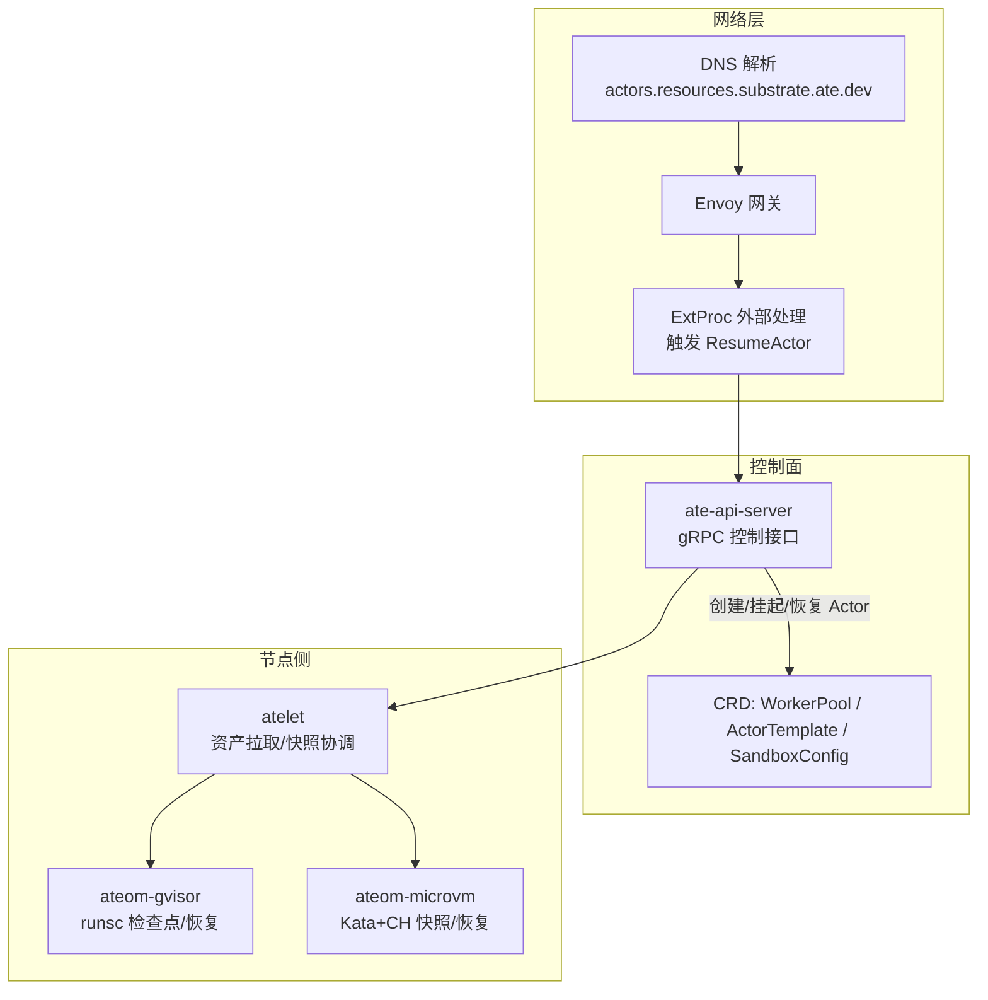
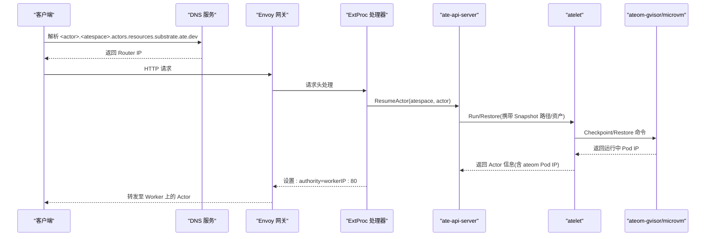
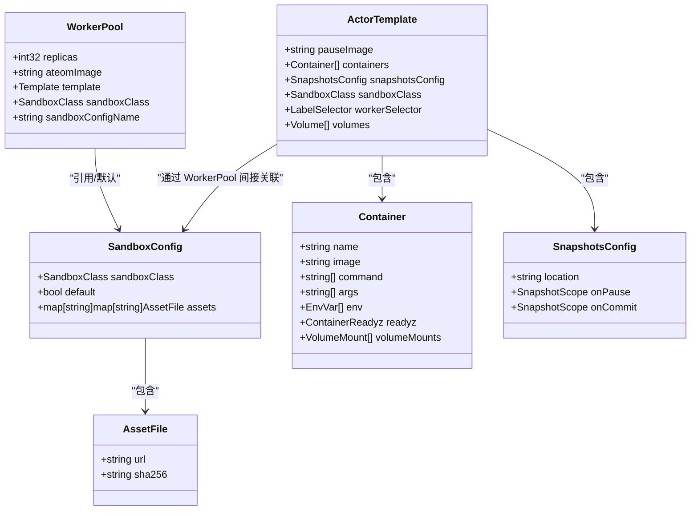
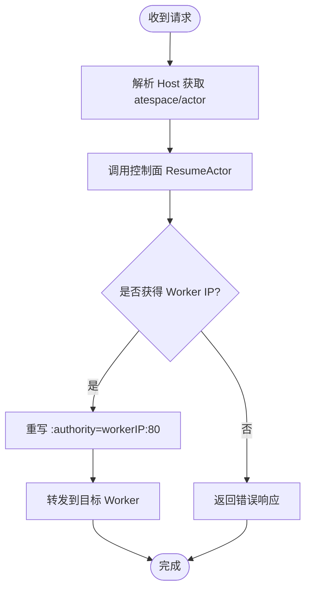
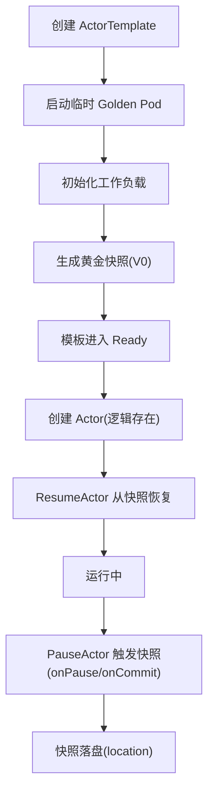
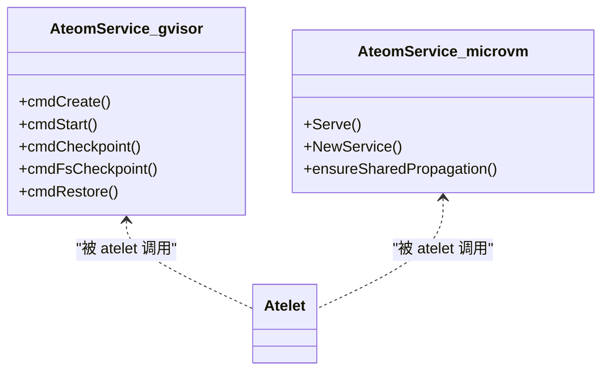
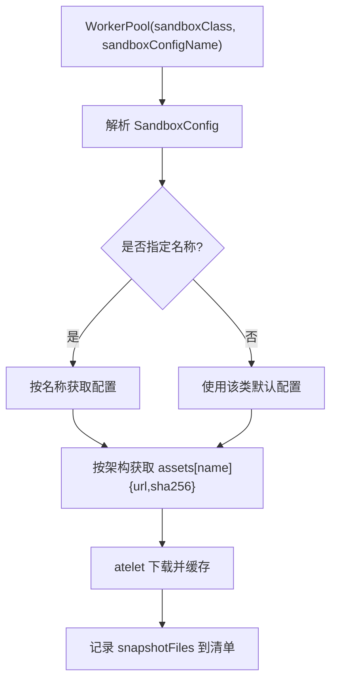
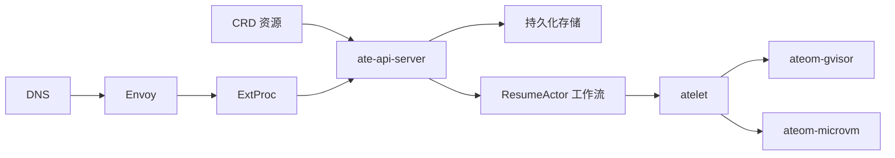

# 核心概念

<cite>
**本文引用的文件**   
- [README.md](file://README.md)
- [architecture.md](file://docs/architecture.md)
- [api-guide.md](file://docs/api-guide.md)
- [workerpool_types.go](file://pkg/api/v1alpha1/workerpool_types.go)
- [actortemplate_types.go](file://pkg/api/v1alpha1/actortemplate_types.go)
- [sandboxconfig_types.go](file://pkg/api/v1alpha1/sandboxconfig_types.go)
- [create_actor.go](file://cmd/ateapi/internal/controlapi/create_actor.go)
- [suspend_actor.go](file://cmd/ateapi/internal/controlapi/suspend_actor.go)
- [extproc.go](file://cmd/atenet/internal/router/extproc.go)
- [controller.go](file://cmd/atenet/internal/router/controller.go)
- [corefile_test.go](file://cmd/atenet/internal/dns/corefile_test.go)
- [runsc.go](file://cmd/ateom-gvisor/runsc.go)
- [main.go (gVisor)](file://cmd/ateom-gvisor/main.go)
- [main.go (MicroVM)](file://cmd/ateom-microvm/main.go)
- [sandbox_assets.go (atelet)](file://cmd/atelet/sandbox_assets.go)
- [sandbox_assets.go (ateapi)](file://cmd/ateapi/internal/controlapi/sandbox_assets.go)
</cite>

## 目录
1. [简介](#简介)
2. [项目结构](#项目结构)
3. [核心组件](#核心组件)
4. [架构总览](#架构总览)
5. [详细组件分析](#详细组件分析)
6. [依赖关系分析](#依赖关系分析)
7. [性能考量](#性能考量)
8. [故障排查指南](#故障排查指南)
9. [结论](#结论)
10. [附录：配置示例与使用场景](#附录配置示例与使用场景)

## 简介
Agent Substrate 基于 Kubernetes 构建，面向“类 Agent”工作负载提供更高规模、更低延迟的调度与控制能力。其核心思想是 Actor 模型：将大量无状态或弱状态的“Actor（应用）”映射到少量长期运行的 Worker（Pod）上，利用空闲期挂起/恢复机制实现高倍率复用，从而显著降低资源占用并缩短冷启动时延。系统通过专用控制面、网络代理与沙箱运行时协同，完成动态路由、状态持久化与快照管理。

## 项目结构
从源码视角看，关键模块包括：
- 自定义资源定义（CRD）：WorkerPool、ActorTemplate、SandboxConfig
- 控制面 API：ate-api-server（gRPC），负责 Actor 生命周期与调度决策
- 网络层：atenet（DNS + Envoy xDS + ExtProc 外部处理）
- 节点侧执行器：atelet（资产拉取、快照协调）、ateom-gvisor / ateom-microvm（沙箱运行与检查点/恢复）

图表来源
- [architecture.md:84-116](file://docs/architecture.md#L84-L116)
- [extproc.go:38-78](file://cmd/atenet/internal/router/extproc.go#L38-L78)
- [controller.go:26-65](file://cmd/atenet/internal/router/controller.go#L26-L65)
- [main.go (gVisor):373-399](file://cmd/ateom-gvisor/main.go#L373-L399)
- [main.go (MicroVM):184-226](file://cmd/ateom-microvm/main.go#L184-L226)

章节来源
- [README.md:1-225](file://README.md#L1-L225)
- [architecture.md:59-116](file://docs/architecture.md#L59-L116)

## 核心组件
- Actor 模型与多路复用
  - 大量 Actor 在空闲时挂起，释放计算与内存；事件到达时由网络层触发恢复，并在任意可用 Worker 上热启动，实现高倍率复用与低延迟激活。
- 自定义资源
  - WorkerPool：定义 Worker Pod 集合、调度约束、沙箱类别与二进制来源。
  - ActorTemplate：描述工作负载容器、就绪探针、快照策略、沙箱类别与目标池选择。
  - SandboxConfig：集群级沙箱二进制清单（按架构与名称索引），供 WorkerPool 解析与 atelet 拉取。
- 网络与路由
  - 统一 DNS 域名空间，ExtProc 拦截请求头，调用控制面恢复 Actor，并改写 :authority 进行动态转发。
- 沙箱隔离
  - gVisor：进程级轻量沙箱，原生支持检查点/恢复。
  - MicroVM：基于 Kata Containers + Cloud Hypervisor 的内存快照与按需分页恢复。

章节来源
- [workerpool_types.go:54-89](file://pkg/api/v1alpha1/workerpool_types.go#L54-L89)
- [actortemplate_types.go:278-340](file://pkg/api/v1alpha1/actortemplate_types.go#L278-L340)
- [sandboxconfig_types.go:52-79](file://pkg/api/v1alpha1/sandboxconfig_types.go#L52-L79)
- [extproc.go:130-188](file://cmd/atenet/internal/router/extproc.go#L130-L188)
- [runsc.go:73-208](file://cmd/ateom-gvisor/runsc.go#L73-L208)
- [main.go (MicroVM):184-226](file://cmd/ateom-microvm/main.go#L184-L226)

## 架构总览
下图展示了从客户端请求到 Actor 恢复与转发的端到端流程，以及 WorkerPool/ActorTemplate/SandboxConfig 之间的协作关系。

图表来源
- [extproc.go:130-188](file://cmd/atenet/internal/router/extproc.go#L130-L188)
- [controller.go:88-110](file://cmd/atenet/internal/router/controller.go#L88-L110)
- [runsc.go:176-208](file://cmd/ateom-gvisor/runsc.go#L176-L208)
- [main.go (MicroVM):184-226](file://cmd/ateom-microvm/main.go#L184-L226)

## 详细组件分析

### 自定义资源类型与用途
- WorkerPool
  - 作用：声明一组 Worker Pod 副本、调度参数、沙箱类别与二进制来源。
  - 关键字段：replicas、ateomImage、template（NodeSelector/Tolerations/PriorityClassName/NodeAffinity/Resources）、sandboxClass、sandboxConfigName。
- ActorTemplate
  - 作用：定义 Actor 的工作负载镜像、环境变量、就绪探针、快照策略、沙箱类别与目标池选择。
  - 关键字段：pauseImage、containers[]、snapshotsConfig、sandboxClass、workerSelector、volumes[]。
- SandboxConfig
  - 作用：集群级沙箱二进制清单，按架构与名称索引，供 WorkerPool 解析并由 atelet 拉取。
  - 关键字段：sandboxClass、default、assets[arch][name]{url, sha256}。

图表来源
- [workerpool_types.go:54-89](file://pkg/api/v1alpha1/workerpool_types.go#L54-L89)
- [actortemplate_types.go:278-340](file://pkg/api/v1alpha1/actortemplate_types.go#L278-L340)
- [sandboxconfig_types.go:52-79](file://pkg/api/v1alpha1/sandboxconfig_types.go#L52-L79)
- [actortemplate_types.go:80-136](file://pkg/api/v1alpha1/actortemplate_types.go#L80-L136)
- [actortemplate_types.go:236-276](file://pkg/api/v1alpha1/actortemplate_types.go#L236-L276)
- [sandboxconfig_types.go:33-50](file://pkg/api/v1alpha1/sandboxconfig_types.go#L33-L50)

章节来源
- [workerpool_types.go:22-96](file://pkg/api/v1alpha1/workerpool_types.go#L22-L96)
- [actortemplate_types.go:278-340](file://pkg/api/v1alpha1/actortemplate_types.go#L278-L340)
- [sandboxconfig_types.go:52-79](file://pkg/api/v1alpha1/sandboxconfig_types.go#L52-L79)

### 多路复用与动态路由
- 统一 DNS 命名空间：所有 Actor 可通过 <actor>.<atespace>.actors.resources.substrate.ate.dev 访问。
- ExtProc 外部处理：在请求头阶段解析 Host，调用控制面恢复 Actor，并将 :authority 改写为 Worker Pod IP:80，实现零拷贝的动态转发。
- 控制器周期性同步模板与 xDS 配置，确保路由规则与模板一致。

图表来源
- [extproc.go:130-188](file://cmd/atenet/internal/router/extproc.go#L130-L188)
- [controller.go:88-110](file://cmd/atenet/internal/router/controller.go#L88-L110)
- [corefile_test.go:24-65](file://cmd/atenet/internal/dns/corefile_test.go#L24-L65)

章节来源
- [extproc.go:38-78](file://cmd/atenet/internal/router/extproc.go#L38-L78)
- [extproc.go:130-188](file://cmd/atenet/internal/router/extproc.go#L130-L188)
- [controller.go:26-65](file://cmd/atenet/internal/router/controller.go#L26-L65)
- [corefile_test.go:24-65](file://cmd/atenet/internal/dns/corefile_test.go#L24-L65)

### 状态持久化与快照机制
- 快照范围
  - Full：进程内存 + rootfs 增量（含 DurableDir 卷）。
  - Data：仅包含支持快照的卷内容（当前为 DurableDir）。
- 生命周期
  - 黄金快照：模板 Ready 前拉起临时 Golden Pod，初始化后生成 V0 快照。
  - 恢复：直接从最近快照恢复进程与文件系统，绕过常规容器启动。
- 存储位置：由 ActorTemplate.snapshotsConfig.location 指定（如对象存储桶路径）。

图表来源
- [api-guide.md:227-236](file://docs/api-guide.md#L227-L236)
- [actortemplate_types.go:236-276](file://pkg/api/v1alpha1/actortemplate_types.go#L236-L276)
- [suspend_actor.go:29-48](file://cmd/ateapi/internal/controlapi/suspend_actor.go#L29-L48)

章节来源
- [api-guide.md:227-236](file://docs/api-guide.md#L227-L236)
- [actortemplate_types.go:236-276](file://pkg/api/v1alpha1/actortemplate_types.go#L236-L276)
- [suspend_actor.go:29-48](file://cmd/ateapi/internal/controlapi/suspend_actor.go#L29-L48)

### gVisor 与 MicroVM 沙箱隔离
- gVisor（默认）
  - 以 runsc 驱动进程级沙箱，原生支持 checkpoint/restore。
  - 内部通过 ateom-gvisor 封装 create/start/checkpoint/fscheckpoint/restore 等命令。
- MicroVM
  - 基于 Kata Containers + Cloud Hypervisor，采用内存快照与 userfaultfd 按需分页恢复。
  - 内部通过 ateom-microvm 暴露 ateompb.Ateom 服务，管理 VM 生命周期与网络命名空间。

图表来源
- [runsc.go:73-208](file://cmd/ateom-gvisor/runsc.go#L73-L208)
- [main.go (gVisor):373-399](file://cmd/ateom-gvisor/main.go#L373-L399)
- [main.go (MicroVM):184-226](file://cmd/ateom-microvm/main.go#L184-L226)

章节来源
- [runsc.go:73-208](file://cmd/ateom-gvisor/runsc.go#L73-L208)
- [main.go (gVisor):373-399](file://cmd/ateom-gvisor/main.go#L373-L399)
- [main.go (MicroVM):184-226](file://cmd/ateom-microvm/main.go#L184-L226)

### 沙箱二进制与资产解析
- 解析顺序
  - 根据 WorkerPool.sandboxClass 与 sandboxConfigName（可选）定位 SandboxConfig。
  - 若未显式指定，则选择该类的集群默认 SandboxConfig。
- 资产清单
  - atelet 按架构与名称下载并缓存，校验 SHA256，避免版本漂移导致快照不可恢复。
  - 快照清单记录实际写入的文件名，保证 Restore 精确拉取所需集。

图表来源
- [sandbox_assets.go (ateapi):30-63](file://cmd/ateapi/internal/controlapi/sandbox_assets.go#L30-L63)
- [sandbox_assets.go (atelet):44-68](file://cmd/atelet/sandbox_assets.go#L44-L68)

章节来源
- [sandbox_assets.go (ateapi):30-63](file://cmd/ateapi/internal/controlapi/sandbox_assets.go#L30-L63)
- [sandbox_assets.go (atelet):44-68](file://cmd/atelet/sandbox_assets.go#L44-L68)

## 依赖关系分析
- 控制面与 CRD
  - ate-api-server 读取 ActorTemplate/WorkerPool/SandboxConfig，校验并持久化 Actor 元数据。
- 网络层与控制面
  - ExtProc 通过 gRPC 调用控制面 ResumeActor，获取 Worker IP 并改写请求头。
- 节点侧与运行时
  - atelet 协调 ateom-gvisor/microvm 执行检查点/恢复，维护本地资产缓存与快照清单。

图表来源
- [create_actor.go:32-82](file://cmd/ateapi/internal/controlapi/create_actor.go#L32-L82)
- [extproc.go:130-188](file://cmd/atenet/internal/router/extproc.go#L130-L188)
- [main.go (gVisor):373-399](file://cmd/ateom-gvisor/main.go#L373-L399)
- [main.go (MicroVM):184-226](file://cmd/ateom-microvm/main.go#L184-L226)

章节来源
- [create_actor.go:32-82](file://cmd/ateapi/internal/controlapi/create_actor.go#L32-L82)
- [extproc.go:130-188](file://cmd/atenet/internal/router/extproc.go#L130-L188)

## 性能考量
- 跳过 K8s 调度关键路径：通过预启长驻 Worker 与即时恢复，避免标准 Pod 调度的额外开销。
- 快照粒度优化：Data 模式仅持久化卷数据，Full 模式保留内存与根文件系统增量，可按需权衡 I/O 与恢复速度。
- 资产缓存与版本锁定：按 SHA256 缓存与清单记录，减少重复下载并确保跨升级可恢复。
- 路由低延迟：ExtProc 在请求头阶段完成恢复与改写，最小化首包时延。

章节来源
- [architecture.md:59-116](file://docs/architecture.md#L59-L116)
- [actortemplate_types.go:236-276](file://pkg/api/v1alpha1/actortemplate_types.go#L236-L276)
- [sandbox_assets.go (atelet):44-68](file://cmd/atelet/sandbox_assets.go#L44-L68)

## 故障排查指南
- 常见错误与定位
  - 模板不存在：创建 Actor 前需确保 ActorTemplate 已就绪。
  - Atespace 不存在：必须先创建 atespace。
  - 并发更新冲突：暂停操作可能因持久化冲突返回重试提示。
  - 路由失败：当无法解析 Worker IP 时，ExtProc 会返回内部错误。
- 建议步骤
  - 确认模板状态与快照位置可达。
  - 检查 SandboxConfig 与 WorkerPool 的 sandboxClass 匹配。
  - 查看 ateom 日志与快照清单，确认资产完整性。

章节来源
- [create_actor.go:32-82](file://cmd/ateapi/internal/controlapi/create_actor.go#L32-L82)
- [suspend_actor.go:29-48](file://cmd/ateapi/internal/controlapi/suspend_actor.go#L29-L48)
- [extproc.go:130-188](file://cmd/atenet/internal/router/extproc.go#L130-L188)

## 结论
Agent Substrate 通过 Actor 模型、沙箱快照与动态路由的组合，实现了在 Kubernetes 之上对海量无状态/弱状态应用的超分复用与低延迟激活。WorkerPool、ActorTemplate、SandboxConfig 三类 CRD 清晰解耦了资源编排、工作负载定义与沙箱二进制管理；ExtProc 与 ateom 后端共同保障“即需即活”的运行体验。

## 附录：配置示例与使用场景
- 典型场景
  - 计数器演示：展示跨挂起/恢复的状态保持与动态路由。
  - 沙箱演示：在安全沙箱内执行任意 Shell，并保持文件系统状态。
  - Claude Code 多路复用：在有限 Worker 上高密度复用多个交互式 Agent。
- 快速开始要点
  - 安装 ate 系统与依赖（Valkey、RustFS）。
  - 创建 atespace 与 Actor（基于模板）。
  - 端口转发 Router 后通过统一域名访问 Actor。
- 参考文档
  - API 配置指南：WorkerPool、ActorTemplate、SandboxConfig 字段说明与示例。
  - 术语表：Actor、WorkerPool、Worker、ate-api-server、atenet、atelet、ateom 等。

章节来源
- [README.md:97-158](file://README.md#L97-L158)
- [api-guide.md:87-182](file://docs/api-guide.md#L87-L182)
- [api-guide.md:184-238](file://docs/api-guide.md#L184-L238)
