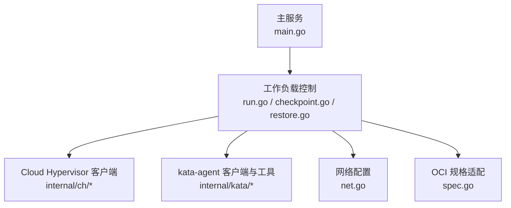
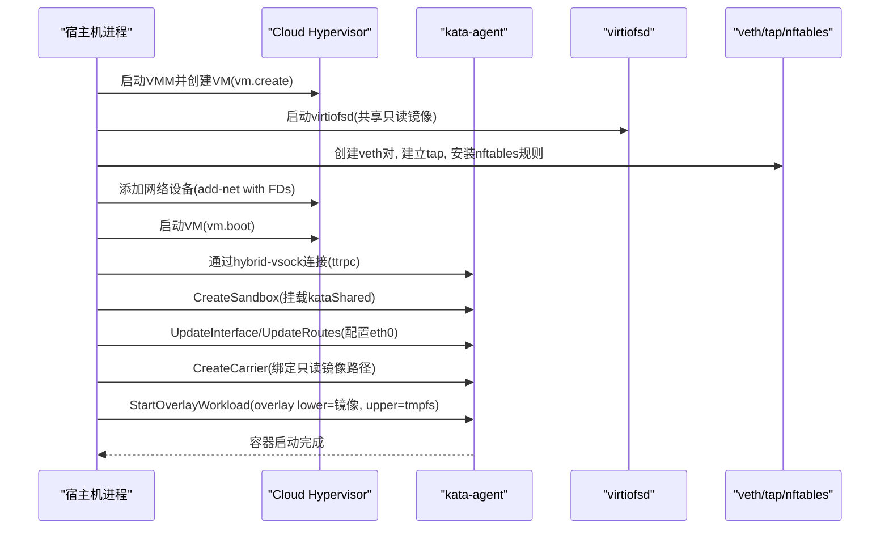
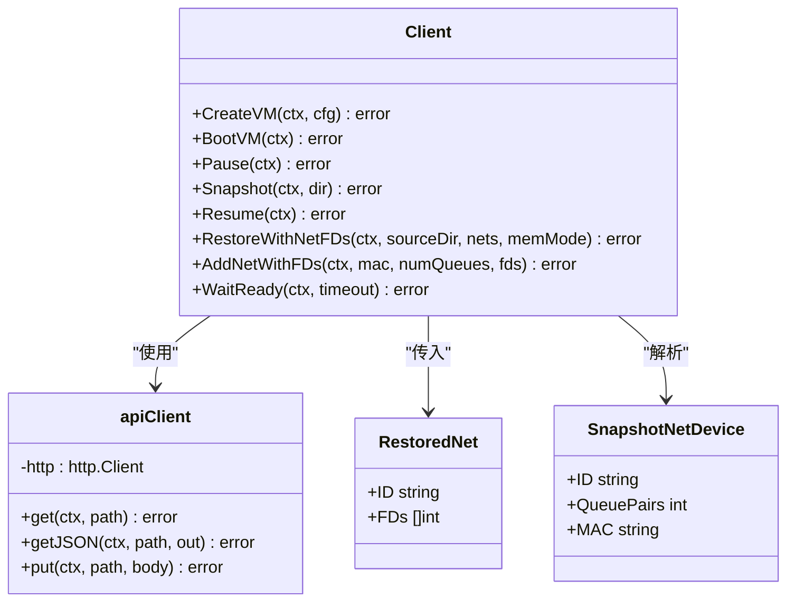
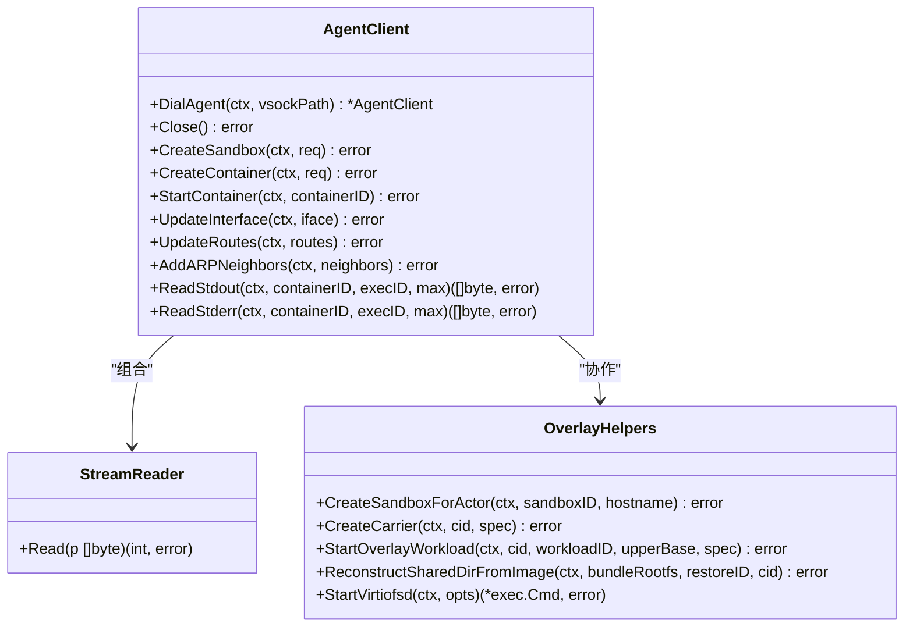
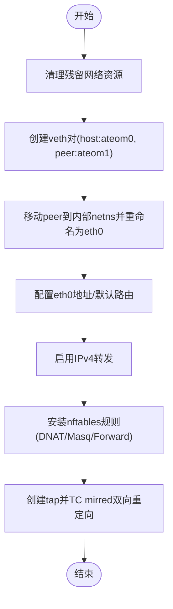
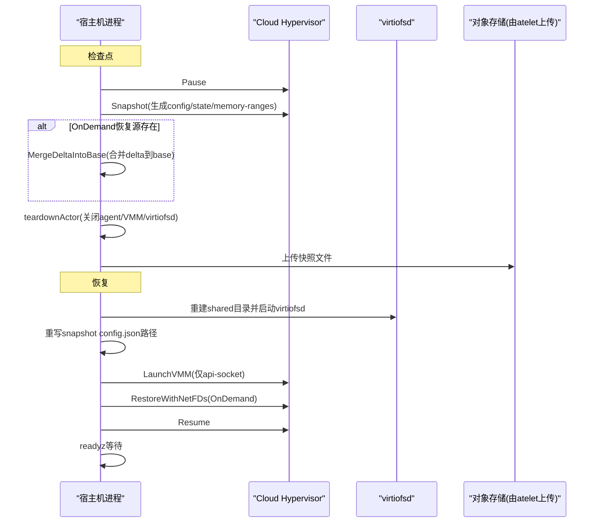
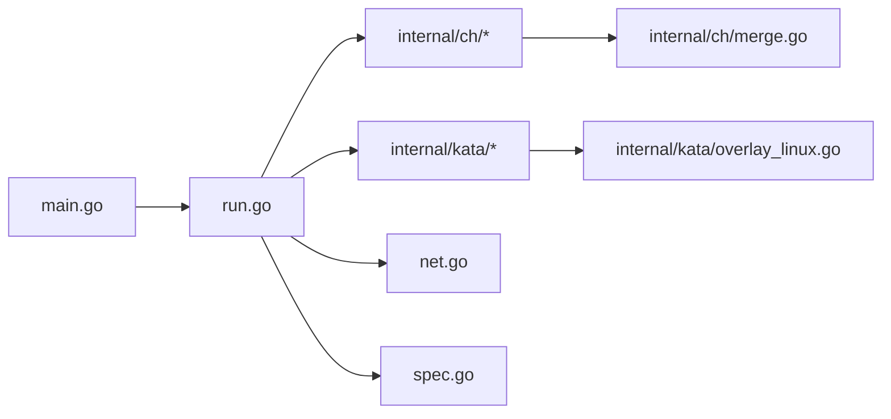

# MicroVM沙箱运行时

<cite>
**本文引用的文件**   
- [cmd/ateom-microvm/main.go](file://cmd/ateom-microvm/main.go)
- [cmd/ateom-microvm/run.go](file://cmd/ateom-microvm/run.go)
- [cmd/ateom-microvm/net.go](file://cmd/ateom-microvm/net.go)
- [cmd/ateom-microvm/checkpoint.go](file://cmd/ateom-microvm/checkpoint.go)
- [cmd/ateom-microvm/restore.go](file://cmd/ateom-microvm/restore.go)
- [cmd/ateom-microvm/spec.go](file://cmd/ateom-microvm/spec.go)
- [cmd/ateom-microvm/internal/ch/api.go](file://cmd/ateom-microvm/internal/ch/api.go)
- [cmd/ateom-microvm/internal/ch/createvm.go](file://cmd/ateom-microvm/internal/ch/createvm.go)
- [cmd/ateom-microvm/internal/ch/merge.go](file://cmd/ateom-microvm/internal/ch/merge.go)
- [cmd/ateom-microvm/internal/ch/restorefds.go](file://cmd/ateom-microvm/internal/ch/restorefds.go)
- [cmd/ateom-microvm/internal/kata/kata.go](file://cmd/ateom-microvm/internal/kata/kata.go)
- [cmd/ateom-microvm/internal/kata/agentclient.go](file://cmd/ateom-microvm/internal/kata/agentclient.go)
- [cmd/ateom-microvm/internal/kata/config.go](file://cmd/ateom-microvm/internal/kata/config.go)
- [cmd/ateom-microvm/internal/kata/specconv.go](file://cmd/ateom-microvm/internal/kata/specconv.go)
- [cmd/ateom-microvm/internal/kata/overlay_linux.go](file://cmd/ateom-microvm/internal/kata/overlay_linux.go)
- [cmd/ateom-microvm/internal/kata/cleanup_linux.go](file://cmd/ateom-microvm/internal/kata/cleanup_linux.go)
- [cmd/ateom-microvm/internal/kata/restore.go](file://cmd/ateom-microvm/internal/kata/restore.go)
</cite>

## 目录
1. [简介](#简介)
2. [项目结构](#项目结构)
3. [核心组件](#核心组件)
4. [架构总览](#架构总览)
5. [详细组件分析](#详细组件分析)
6. [依赖关系分析](#依赖关系分析)
7. [性能考量](#性能考量)
8. [故障诊断指南](#故障诊断指南)
9. [结论](#结论)
10. [附录](#附录)

## 简介
本文件为 Agent Substrate 的 MicroVM 沙箱运行时（ateom-microvm）提供系统化技术文档。该运行时基于 Kata Containers 与 Cloud Hypervisor，将每个 Actor 以轻量级虚拟机方式运行，并通过 kata-agent 在 Guest 内管理容器生命周期、网络与文件系统。其关键特性包括：
- 直接驱动 Cloud Hypervisor 启动 VM，绕过传统 kata shim，降低开销并增强可观测性
- 通过 hybrid-vsock + ttrpc 与 kata-agent 通信，完成沙箱创建、容器挂载与进程启动
- 使用 virtio-fs 提供只读镜像层，结合 Guest 侧 tmpfs 作为 overlay 上层，实现内存驻留的可写层
- 支持快照与恢复：基于 CH 的 vm.pause/snapshot/resume 与 OnDemand 用户态缺页恢复，实现快速冷/热迁移式恢复
- 稳定的网络拓扑：固定 MAC/IP、veth+tap 桥接、nftables DNAT/Masquerade，确保跨 Pod 恢复后网络一致

## 项目结构
ateom-microvm 采用按功能分层组织：
- 入口与服务注册：main.go
- 工作负载生命周期：run.go（启动）、checkpoint.go（检查点）、restore.go（恢复）
- 网络配置：net.go（veth/tap/nftables/路由）
- 规格适配：spec.go（OCI spec 转换）
- 与 Cloud Hypervisor 交互：internal/ch/*
- 与 kata-agent 交互及 overlay 构建：internal/kata/*

图表来源
- [cmd/ateom-microvm/main.go:1-226](file://cmd/ateom-microvm/main.go#L1-L226)
- [cmd/ateom-microvm/run.go:174-368](file://cmd/ateom-microvm/run.go#L174-L368)
- [cmd/ateom-microvm/checkpoint.go:44-154](file://cmd/ateom-microvm/checkpoint.go#L44-L154)
- [cmd/ateom-microvm/restore.go:52-207](file://cmd/ateom-microvm/restore.go#L52-L207)
- [cmd/ateom-microvm/net.go:119-198](file://cmd/ateom-microvm/net.go#L119-L198)
- [cmd/ateom-microvm/spec.go:29-107](file://cmd/ateom-microvm/spec.go#L29-L107)

章节来源
- [cmd/ateom-microvm/main.go:1-226](file://cmd/ateom-microvm/main.go#L1-L226)
- [cmd/ateom-microvm/run.go:174-368](file://cmd/ateom-microvm/run.go#L174-L368)
- [cmd/ateom-microvm/checkpoint.go:44-154](file://cmd/ateom-microvm/checkpoint.go#L44-L154)
- [cmd/ateom-microvm/restore.go:52-207](file://cmd/ateom-microvm/restore.go#L52-L207)
- [cmd/ateom-microvm/net.go:119-198](file://cmd/ateom-microvm/net.go#L119-L198)
- [cmd/ateom-microvm/spec.go:29-107](file://cmd/ateom-microvm/spec.go#L29-L107)

## 核心组件
- ateom-microvm 服务
  - 暴露 gRPC 接口，维护 per-actor 的 runningActor 状态，协调 VMM、virtiofsd、kata-agent 与网络栈
  - 负责日志转发、追踪初始化、子进程回收、挂载传播设置等
- Cloud Hypervisor 客户端
  - 通过 unix socket REST API 驱动 vm.create/boot/pause/snapshot/resume 等操作
  - 支持带 SCM_RIGHTS 的 FD 传递（网络 tap FD），以及 OnDemand 内存恢复模式
- kata-agent 客户端
  - 通过 hybrid-vsock + ttrpc 调用 CreateSandbox/CreateContainer/StartContainer/UpdateInterface/UpdateRoutes 等
  - 提供调试控制台读取、标准输出/错误流读取封装
- 网络子系统
  - 每激活一次创建 veth 对，一端在 Pod netns，另一端移入内部 netns 并重命名为 eth0
  - 建立 tap 设备并通过 TC mirred 双向重定向；安装 nftables 规则进行 DNAT/Masquerade
- Overlay 根文件系统
  - 使用 virtio-fs 提供只读镜像层，Guest 侧 tmpfs 作为 overlay 上层，写入落盘到内存快照中

章节来源
- [cmd/ateom-microvm/main.go:174-226](file://cmd/ateom-microvm/main.go#L174-L226)
- [cmd/ateom-microvm/internal/ch/api.go:31-57](file://cmd/ateom-microvm/internal/ch/api.go#L31-L57)
- [cmd/ateom-microvm/internal/ch/restorefds.go:83-154](file://cmd/ateom-microvm/internal/ch/restorefds.go#L83-L154)
- [cmd/ateom-microvm/internal/kata/agentclient.go:87-128](file://cmd/ateom-microvm/internal/kata/agentclient.go#L87-L128)
- [cmd/ateom-microvm/net.go:119-198](file://cmd/ateom-microvm/net.go#L119-L198)
- [cmd/ateom-microvm/internal/kata/overlay_linux.go:19-70](file://cmd/ateom-microvm/internal/kata/overlay_linux.go#L19-L70)

## 架构总览
整体流程：宿主进程直接启动 Cloud Hypervisor，构造 VM 配置（内核、镜像、virtio-fs、vsock、串口等），随后通过 kata-agent 在 Guest 内创建沙箱、配置网络、组装 overlay 根文件系统并启动容器。

图表来源
- [cmd/ateom-microvm/run.go:266-368](file://cmd/ateom-microvm/run.go#L266-L368)
- [cmd/ateom-microvm/internal/ch/createvm.go:107-123](file://cmd/ateom-microvm/internal/ch/createvm.go#L107-L123)
- [cmd/ateom-microvm/internal/ch/restorefds.go:156-202](file://cmd/ateom-microvm/internal/ch/restorefds.go#L156-L202)
- [cmd/ateom-microvm/internal/kata/agentclient.go:159-193](file://cmd/ateom-microvm/internal/kata/agentclient.go#L159-L193)
- [cmd/ateom-microvm/internal/kata/overlay_linux.go:167-256](file://cmd/ateom-microvm/internal/kata/overlay_linux.go#L167-L256)

## 详细组件分析

### 组件A：Cloud Hypervisor 客户端（internal/ch）
职责：
- 通过 unix socket REST API 与 CH 交互
- 发起 vm.create/vm.boot/vm.pause/vm.snapshot/vm.resume
- 支持带 SCM_RIGHTS 的 FD 传递（网络 tap FD）
- 解析快照中的网络设备信息，辅助恢复

图表来源
- [cmd/ateom-microvm/internal/ch/api.go:31-57](file://cmd/ateom-microvm/internal/ch/api.go#L31-L57)
- [cmd/ateom-microvm/internal/ch/createvm.go:22-123](file://cmd/ateom-microvm/internal/ch/createvm.go#L22-L123)
- [cmd/ateom-microvm/internal/ch/restorefds.go:83-154](file://cmd/ateom-microvm/internal/ch/restorefds.go#L83-L154)
- [cmd/ateom-microvm/internal/ch/restorefds.go:204-241](file://cmd/ateom-microvm/internal/ch/restorefds.go#L204-L241)

章节来源
- [cmd/ateom-microvm/internal/ch/api.go:31-57](file://cmd/ateom-microvm/internal/ch/api.go#L31-L57)
- [cmd/ateom-microvm/internal/ch/createvm.go:22-123](file://cmd/ateom-microvm/internal/ch/createvm.go#L22-L123)
- [cmd/ateom-microvm/internal/ch/restorefds.go:83-154](file://cmd/ateom-microvm/internal/ch/restorefds.go#L83-L154)
- [cmd/ateom-microvm/internal/ch/restorefds.go:204-241](file://cmd/ateom-microvm/internal/ch/restorefds.go#L204-L241)

### 组件B：kata-agent 客户端与 overlay 构建（internal/kata）
职责：
- 通过 hybrid-vsock 连接 kata-agent，执行 CreateSandbox/CreateContainer/StartContainer/UpdateInterface/UpdateRoutes/AddARPNeighbors
- 提供调试控制台读取与标准输出/错误流读取封装
- 构建 overlay 根文件系统：carrier 容器绑定只读镜像路径，workload 容器以 tmpfs 为 upper 启动 overlay

图表来源
- [cmd/ateom-microvm/internal/kata/agentclient.go:87-128](file://cmd/ateom-microvm/internal/kata/agentclient.go#L87-L128)
- [cmd/ateom-microvm/internal/kata/agentclient.go:137-231](file://cmd/ateom-microvm/internal/kata/agentclient.go#L137-L231)
- [cmd/ateom-microvm/internal/kata/overlay_linux.go:167-256](file://cmd/ateom-microvm/internal/kata/overlay_linux.go#L167-L256)
- [cmd/ateom-microvm/internal/kata/overlay_linux.go:126-165](file://cmd/ateom-microvm/internal/kata/overlay_linux.go#L126-L165)

章节来源
- [cmd/ateom-microvm/internal/kata/agentclient.go:87-128](file://cmd/ateom-microvm/internal/kata/agentclient.go#L87-L128)
- [cmd/ateom-microvm/internal/kata/agentclient.go:137-231](file://cmd/ateom-microvm/internal/kata/agentclient.go#L137-L231)
- [cmd/ateom-microvm/internal/kata/overlay_linux.go:167-256](file://cmd/ateom-microvm/internal/kata/overlay_linux.go#L167-L256)
- [cmd/ateom-microvm/internal/kata/overlay_linux.go:126-165](file://cmd/ateom-microvm/internal/kata/overlay_linux.go#L126-L165)

### 组件C：网络配置（net.go）
要点：
- 固定 MAC/IP 设计，保证快照冻结的 ARP 表项在跨 Pod 恢复后仍然有效
- 每激活一次创建 veth 对，host 端在 Pod netns，peer 端移入内部 netns 并重命名为 eth0
- 建立 tap 设备并通过 TC mirred 双向重定向，模拟 kata tcfilter 模型
- 安装 nftables 规则：prerouting DNAT pod-IP:80 -> actorVethIP；postrouting Masquerade actor egress；forward 放行转发

图表来源
- [cmd/ateom-microvm/net.go:119-198](file://cmd/ateom-microvm/net.go#L119-L198)
- [cmd/ateom-microvm/net.go:200-241](file://cmd/ateom-microvm/net.go#L200-L241)
- [cmd/ateom-microvm/net.go:336-416](file://cmd/ateom-microvm/net.go#L336-L416)
- [cmd/ateom-microvm/net.go:531-600](file://cmd/ateom-microvm/net.go#L531-L600)

章节来源
- [cmd/ateom-microvm/net.go:119-198](file://cmd/ateom-microvm/net.go#L119-L198)
- [cmd/ateom-microvm/net.go:200-241](file://cmd/ateom-microvm/net.go#L200-L241)
- [cmd/ateom-microvm/net.go:336-416](file://cmd/ateom-microvm/net.go#L336-L416)
- [cmd/ateom-microvm/net.go:531-600](file://cmd/ateom-microvm/net.go#L531-L600)

### 组件D：快照与恢复机制（checkpoint.go / restore.go / internal/ch/merge.go）
要点：
- Checkpoint：pause -> snapshot -> 合并 OnDemand delta（可选）-> teardown
- Restore：重建网络与 virtiofsd -> 重写快照 config.json 的路径 -> LaunchVMM -> RestoreWithNetFDs(OnDemand) -> Resume -> readyz 等待
- Merge：基于 SEEK_DATA/SEEK_HOLE 的稀疏覆盖，避免全量复制，提升挂起路径性能

图表来源
- [cmd/ateom-microvm/checkpoint.go:44-154](file://cmd/ateom-microvm/checkpoint.go#L44-L154)
- [cmd/ateom-microvm/restore.go:52-207](file://cmd/ateom-microvm/restore.go#L52-L207)
- [cmd/ateom-microvm/internal/ch/merge.go:90-160](file://cmd/ateom-microvm/internal/ch/merge.go#L90-L160)
- [cmd/ateom-microvm/internal/ch/restorefds.go:83-154](file://cmd/ateom-microvm/internal/ch/restorefds.go#L83-L154)

章节来源
- [cmd/ateom-microvm/checkpoint.go:44-154](file://cmd/ateom-microvm/checkpoint.go#L44-L154)
- [cmd/ateom-microvm/restore.go:52-207](file://cmd/ateom-microvm/restore.go#L52-L207)
- [cmd/ateom-microvm/internal/ch/merge.go:90-160](file://cmd/ateom-microvm/internal/ch/merge.go#L90-L160)
- [cmd/ateom-microvm/internal/ch/restorefds.go:83-154](file://cmd/ateom-microvm/internal/ch/restorefds.go#L83-L154)

### 组件E：规格适配与挂载（spec.go / kata/config.go / kata/specconv.go）
要点：
- ensureKataCompatibleSpec：补齐 Linux.Resources/CgroupsPath，移除 gVisor 相关注解，替换 mounts 为 kata 兼容集合
- ParseConfig：从 kata configuration.toml 提取 guest sizing 与 kernel_params
- SpecToAgentPB：将 OCI spec 转换为 agentpb.Spec，映射 process/root/mounts/linux 等字段

章节来源
- [cmd/ateom-microvm/spec.go:29-107](file://cmd/ateom-microvm/spec.go#L29-L107)
- [cmd/ateom-microvm/internal/kata/config.go:52-73](file://cmd/ateom-microvm/internal/kata/config.go#L52-L73)
- [cmd/ateom-microvm/internal/kata/specconv.go:24-134](file://cmd/ateom-microvm/internal/kata/specconv.go#L24-L134)

## 依赖关系分析
- ateom-microvm 服务依赖：
  - Cloud Hypervisor REST API 客户端（internal/ch）
  - kata-agent ttrpc 客户端（internal/kata）
  - 网络配置（net.go）
  - 规格适配（spec.go）
- Cloud Hypervisor 客户端依赖：
  - unix socket HTTP 传输（DisableKeepAlives）
  - SCM_RIGHTS FD 传递（REST 请求附带 ancillary data）
- kata-agent 客户端依赖：
  - hybrid-vsock 连接（CONNECT 握手）
  - ttrpc 调用（grpc.AgentService 方法）

图表来源
- [cmd/ateom-microvm/main.go:174-226](file://cmd/ateom-microvm/main.go#L174-L226)
- [cmd/ateom-microvm/run.go:174-368](file://cmd/ateom-microvm/run.go#L174-L368)
- [cmd/ateom-microvm/internal/ch/api.go:31-57](file://cmd/ateom-microvm/internal/ch/api.go#L31-L57)
- [cmd/ateom-microvm/internal/kata/agentclient.go:87-128](file://cmd/ateom-microvm/internal/kata/agentclient.go#L87-L128)
- [cmd/ateom-microvm/net.go:119-198](file://cmd/ateom-microvm/net.go#L119-L198)
- [cmd/ateom-microvm/spec.go:29-107](file://cmd/ateom-microvm/spec.go#L29-L107)

章节来源
- [cmd/ateom-microvm/main.go:174-226](file://cmd/ateom-microvm/main.go#L174-L226)
- [cmd/ateom-microvm/run.go:174-368](file://cmd/ateom-microvm/run.go#L174-L368)
- [cmd/ateom-microvm/internal/ch/api.go:31-57](file://cmd/ateom-microvm/internal/ch/api.go#L31-L57)
- [cmd/ateom-microvm/internal/kata/agentclient.go:87-128](file://cmd/ateom-microvm/internal/kata/agentclient.go#L87-L128)
- [cmd/ateom-microvm/net.go:119-198](file://cmd/ateom-microvm/net.go#L119-L198)
- [cmd/ateom-microvm/spec.go:29-107](file://cmd/ateom-microvm/spec.go#L29-L107)

## 性能考量
- 快照与恢复
  - OnDemand 用户态缺页恢复显著缩短恢复时间并保持内存稀疏，后续快照仅记录工作集，减少 I/O 压力
  - MergeDeltaIntoBase 通过 rename + 稀疏覆盖避免全量复制，将挂起路径成本降至 O(delta)
- 网络
  - 固定 MAC/IP 与 ARP 静态条目避免恢复后的邻居表过期导致的黑盒
  - TC mirred 重定向与 nftables 规则高效转发，无需额外代理
- 文件系统
  - virtiofsd cache=always 针对只读镜像层优化读取性能
  - overlay 上层位于 Guest tmpfs，写入落盘到内存快照，避免磁盘抖动

[本节为通用指导，不直接分析具体文件]

## 故障诊断指南
- 启动失败
  - 检查 CH API socket 是否就绪（WaitReady）
  - 查看 serial.log 与 guest 控制台输出（DebugConsoleDump）
  - 确认挂载传播已设置为 rshared（ensureSharedPropagation）
- 网络问题
  - 验证 veth/tap 是否存在且 MTU 匹配
  - 检查 nftables 规则是否安装成功（prerouting/postrouting/forward）
  - 确认 ARP 静态条目是否正确（AddARPNeighbors）
- 快照/恢复异常
  - 确认 snapshot 目录包含 config.json/state.json/memory-ranges/base-id
  - 检查 OnDemand 恢复源是否持久化至 teardown
  - 验证 merge 操作是否因 EXDEV 回退到拷贝路径

章节来源
- [cmd/ateom-microvm/run.go:319-368](file://cmd/ateom-microvm/run.go#L319-L368)
- [cmd/ateom-microvm/internal/kata/agentclient.go:40-85](file://cmd/ateom-microvm/internal/kata/agentclient.go#L40-L85)
- [cmd/ateom-microvm/main.go:156-182](file://cmd/ateom-microvm/main.go#L156-L182)
- [cmd/ateom-microvm/net.go:336-416](file://cmd/ateom-microvm/net.go#L336-L416)
- [cmd/ateom-microvm/checkpoint.go:98-154](file://cmd/ateom-microvm/checkpoint.go#L98-L154)
- [cmd/ateom-microvm/restore.go:209-254](file://cmd/ateom-microvm/restore.go#L209-L254)

## 结论
ateom-microvm 通过直接驱动 Cloud Hypervisor 并与 kata-agent 深度集成，实现了高性能、强隔离的 MicroVM 沙箱运行时。其 overlay 根文件系统、稳定网络拓扑与高效的快照/恢复机制，为 Actor 提供了可靠的运行环境。建议在部署时关注挂载传播、网络固定参数与 OnDemand 恢复源的生命周期管理，以获得最佳性能与稳定性。

[本节为总结，不直接分析具体文件]

## 附录

### 部署配置示例（说明性）
- 启动参数
  - --pod-uid：当前 Pod UID
  - --cloud-hypervisor-binary：cloud-hypervisor 二进制路径
  - --kata-config：kata configuration.toml 路径（为空则使用默认）
  - --kata-debug：开启 guest agent 调试与控制台转发
- 运行时资产
  - cloud-hypervisor、kata-kernel、kata-image、virtiofsd、kata-config 由 atelet 拉取并注入

[本节为概念性内容，不直接分析具体文件]

### 安全加固建议（说明性）
- 限制 virtiofsd 缓存策略为只读场景，避免 writable virtio-fs 带来的缓存一致性风险
- 严格管控 nftables 规则范围，最小化 DNAT/Masquerade 暴露面
- 定期清理孤儿进程与残留挂载（CleanupSandboxState）

[本节为概念性内容，不直接分析具体文件]

### 扩展开发指南（说明性）
- 新增网络模型：可在 net.go 中扩展新的桥接或隧道方案，保持固定 MAC/IP 不变
- 增强 overlay：如需多卷写入，考虑引入独立 writer 进程而非放宽 virtio-fs 缓存策略
- 监控与可观测性：利用现有 tracer 与 actorlog 转发机制，补充关键指标（挂起/恢复耗时、I/O 吞吐）

[本节为概念性内容，不直接分析具体文件]
