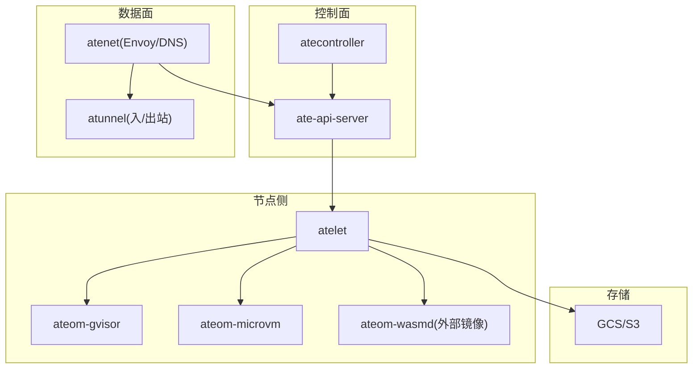
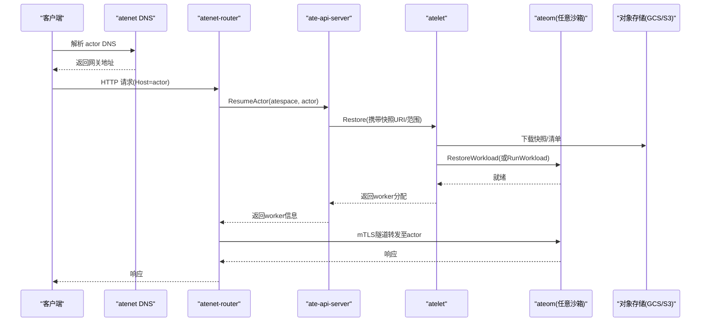
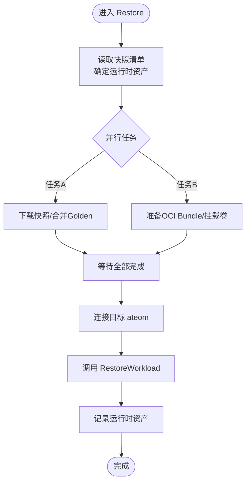
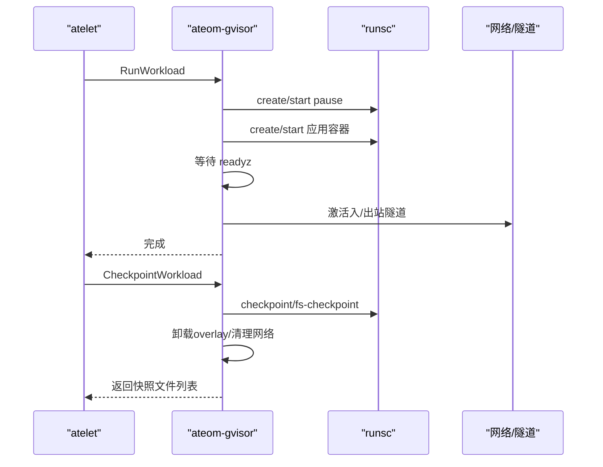
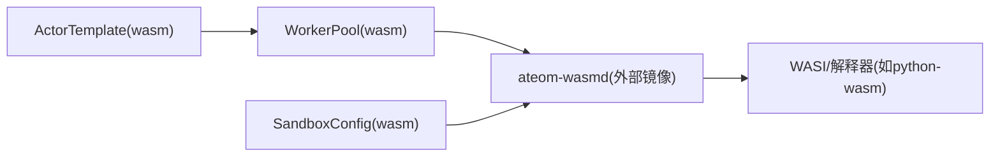
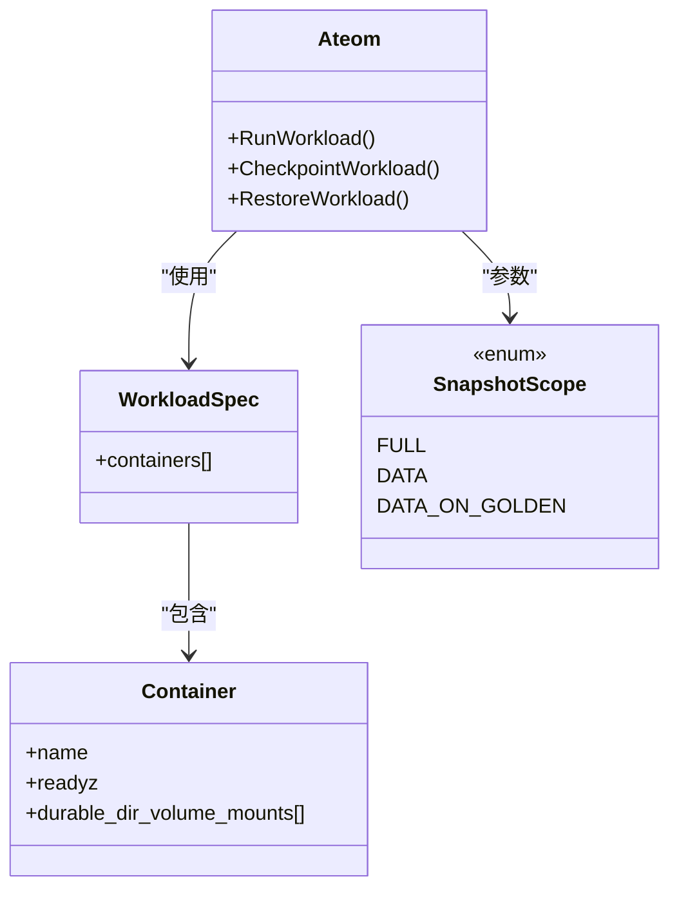
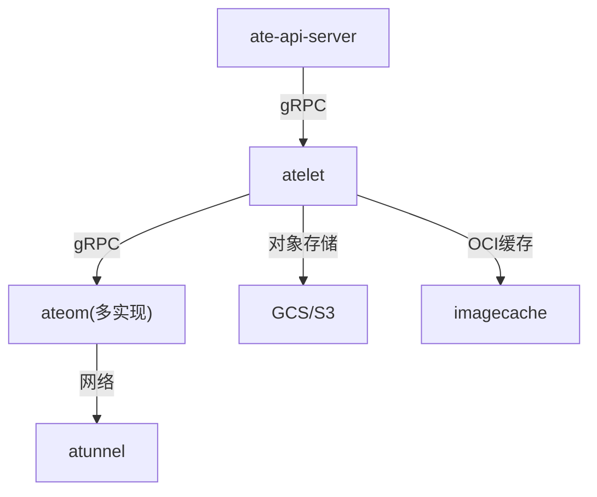

# WebAssembly沙箱运行时

<cite>
**本文引用的文件**
- [README.md](file://README.md)
- [go.mod](file://go.mod)
- [architecture.md](file://docs/architecture.md)
- [ateom.proto](file://internal/proto/ateompb/ateom.proto)
- [atelet/main.go](file://cmd/atelet/main.go)
- [ateom-gvisor/main.go](file://cmd/ateom-gvisor/main.go)
- [ateom-microvm/main.go](file://cmd/ateom-microvm/main.go)
- [wasm-example.yaml](file://manifests/xuanji/wasm-example.yaml)
- [XUANJI.md](file://XUANJI.md)
- [014.md](file://.specify/memory/features/014.md)
</cite>

## 目录
1. [简介](#简介)
2. [项目结构](#项目结构)
3. [核心组件](#核心组件)
4. [架构总览](#架构总览)
5. [详细组件分析](#详细组件分析)
6. [依赖关系分析](#依赖关系分析)
7. [性能考量](#性能考量)
8. [故障排查指南](#故障排查指南)
9. [结论](#结论)
10. [附录](#附录)

## 简介
本项目为 Agent Substrate，提供面向大规模“智能体/代理”工作负载的高密度、可挂起/恢复的运行时环境。其控制面负责 Actor（应用实例）的全生命周期管理，数据面通过网络路由与调度实现亚秒级激活；节点侧通过 atelet + ateom 协调底层沙箱（gVisor/microVM），并支持快照持久化与迁移。WebAssembly 沙箱作为新增的沙箱类型，遵循统一的 atelet/ateom 生命周期契约，以更轻量的方式承载兼容的工作负载。

## 项目结构
仓库采用多进程微服务+Kubernetes CRD 的组织方式：
- 控制面：ate-api-server（gRPC API）、atecontroller（CRD 控制器）
- 数据面：atenet（DNS/Envoy 路由）、atunnel（入站/出站隧道）
- 节点侧：atelet（节点守护）、ateom（按沙箱类实现的 herder，如 gVisor/microVM/Wasm）
- 资源定义：pkg/api/v1alpha1（ActorTemplate/WorkerPool/SandboxConfig 等）
- 示例与清单：manifests（含 wasm 示例）

图表来源
- [architecture.md:298-323](file://docs/architecture.md#L298-L323)
- [atelet/main.go:195-228](file://cmd/atelet/main.go#L195-L228)
- [ateom-gvisor/main.go:169-179](file://cmd/ateom-gvisor/main.go#L169-L179)
- [ateom-microvm/main.go:210-220](file://cmd/ateom-microvm/main.go#L210-L220)

章节来源
- [README.md:8-16](file://README.md#L8-L16)
- [architecture.md:174-203](file://docs/architecture.md#L174-L203)

## 核心组件
- ate-api-server：暴露 gRPC 控制面，编排 Resume/Suspend/Checkpoint/Restore 流程，维护 Actor/Worker 状态缓存。
- atelet：节点守护，负责 OCI 镜像缓存、快照上传/下载、与 ateom 通信驱动具体沙箱。
- ateom（按沙箱类实现）：在 worker pod 内运行，统一实现 RunWorkload/CheckpointWorkload/RestoreWorkload。
- atenet/atunnel：DNS 解析、Envoy 外部处理、mTLS 隧道转发，实现无感唤醒。
- CRD：ActorTemplate/WorkerPool/SandboxConfig 描述模板、池与沙箱资产。

章节来源
- [architecture.md:298-323](file://docs/architecture.md#L298-L323)
- [go.mod:1-62](file://go.mod#L1-L62)

## 架构总览
Agent Substrate 将“大量 Actor”映射到“少量 Worker”，利用空闲期挂起/恢复实现高密度复用。控制面专注高并发低延迟的状态管理与调度；节点侧通过 atelet/ateom 对接不同沙箱后端；网络层保证请求能触发按需恢复并安全转发。

图表来源
- [architecture.md:358-386](file://docs/architecture.md#L358-L386)
- [ateom.proto:34-48](file://internal/proto/ateompb/ateom.proto#L34-L48)

## 详细组件分析

### atelet：节点编排器
职责
- 接收控制面的 Run/Checkpoint/Restore 请求
- 准备 OCI Bundle、挂载外部卷、记录沙箱资产版本
- 调用 ateom 的 RunWorkload/CheckpointWorkload/RestoreWorkload
- 管理快照上传/下载、本地/外部存储落盘、指标上报

关键流程
- Run：校验请求→准备沙箱资产→准备OCI→dial ateom→RunWorkload
- Checkpoint：读取已记录的沙箱资产→调用 ateom 检查点→根据类型上传/移动快照→卸载卷→清理
- Restore：读取快照清单→并行下载快照与准备OCI→调用 ateom 恢复→记录运行时资产→计时统计

图表来源
- [atelet/main.go:547-749](file://cmd/atelet/main.go#L547-L749)

章节来源
- [atelet/main.go:292-353](file://cmd/atelet/main.go#L292-L353)
- [atelet/main.go:391-473](file://cmd/atelet/main.go#L391-L473)
- [atelet/main.go:547-749](file://cmd/atelet/main.go#L547-L749)

### ateom-gvisor：gVisor 沙箱实现
职责
- 在 worker pod 内启动 runsc，创建 pause 与应用容器
- 设置网络命名空间、日志管道、readyz 探测
- 执行 Checkpoint/Restore，管理 overlay 卸载与网络清理

要点
- RunWorkload：创建 pause 与应用容器→等待 readyz→激活网络
- CheckpointWorkload：按 scope 选择 fs-checkpoint 或完整检查点→清理容器→卸载 overlay→列出快照文件
- RestoreWorkload：按 scope 选择 fs-restore 或内存恢复→启动/恢复容器→等待 readyz→激活网络

图表来源
- [ateom-gvisor/main.go:262-350](file://cmd/ateom-gvisor/main.go#L262-L350)
- [ateom-gvisor/main.go:352-437](file://cmd/ateom-gvisor/main.go#L352-L437)
- [ateom-gvisor/main.go:482-595](file://cmd/ateom-gvisor/main.go#L482-L595)

章节来源
- [ateom-gvisor/main.go:74-182](file://cmd/ateom-gvisor/main.go#L74-L182)
- [ateom-gvisor/main.go:262-350](file://cmd/ateom-gvisor/main.go#L262-L350)
- [ateom-gvisor/main.go:352-437](file://cmd/ateom-gvisor/main.go#L352-L437)
- [ateom-gvisor/main.go:482-595](file://cmd/ateom-gvisor/main.go#L482-L595)

### ateom-microvm：microVM 沙箱实现
职责
- 基于 Kata + Cloud Hypervisor 启动 microVM
- 支持快照/恢复（内存快照 + tmpfs overlay）
- 与 gVisor 一致的 ateom 接口与网络模型

要点
- 冷启动：coldBootActorRetrying → 启动 CH/Kata → 注入网络 → 激活隧道
- 快照/恢复：与 ateom 契约一致，scope 决定仅数据或全量

章节来源
- [ateom-microvm/main.go:17-23](file://cmd/ateom-microvm/main.go#L17-L23)
- [ateom-microvm/main.go:74-222](file://cmd/ateom-microvm/main.go#L74-L222)
- [ateom-microvm/run.go:215-244](file://cmd/ateom-microvm/run.go#L215-L244)

### WebAssembly 沙箱（xuanji 分支）
定位
- 作为轻量级沙箱后端，替代 gVisor/microVM，用于兼容工作负载
- 通过 ateom-wasmd（外部 Rust 镜像）实现 ateom 接口，保持与现有 atelet/ateom 契约一致
- 使用 SandboxConfig 声明 wasm 资产（例如 python-wasm），WorkerPool 指定 sandboxClass=wasm 与 ateomImage

能力边界（v1）
- onResume 仅 ColdBoot（Golden 为 microVM 专属）
- durableDir ≤1（同 gVisor 限制）
- 非特权 worker（复用 gVisor 分支的安全上下文）

部署示例
- manifests/xuanji/wasm-example.yaml 展示了 Namespace、SandboxConfig(wasm-default)、WorkerPool(sandboxClass=wasm, ateomImage)、ActorTemplate(python-interpreter) 的组合

图表来源
- [wasm-example.yaml:20-84](file://manifests/xuanji/wasm-example.yaml#L20-L84)
- [XUANJI.md:22-39](file://XUANJI.md#L22-L39)

章节来源
- [014.md:10-30](file://.specify/memory/features/014.md#L10-L30)
- [XUANJI.md:22-39](file://XUANJI.md#L22-L39)
- [wasm-example.yaml:20-84](file://manifests/xuanji/wasm-example.yaml#L20-L84)

### ateom 协议契约（跨沙箱统一）
- 服务：Ateom { RunWorkload, CheckpointWorkload, RestoreWorkload }
- 工作负载规格：WorkloadSpec/Container/Readyz
- 快照范围：FULL / DATA / DATA_ON_GOLDEN
- 资产路径：runtime_asset_paths（gVisor 为空，microVM/Wasm 由 atelet 下发）

图表来源
- [ateom.proto:34-48](file://internal/proto/ateompb/ateom.proto#L34-L48)
- [ateom.proto:75-139](file://internal/proto/ateompb/ateom.proto#L75-L139)
- [ateom.proto:141-210](file://internal/proto/ateompb/ateom.proto#L141-L210)

章节来源
- [ateom.proto:34-48](file://internal/proto/ateompb/ateom.proto#L34-L48)
- [ateom.proto:75-139](file://internal/proto/ateompb/ateom.proto#L75-L139)
- [ateom.proto:141-210](file://internal/proto/ateompb/ateom.proto#L141-L210)

## 依赖关系分析
- 控制面依赖 Kubernetes informer、Redis/Valkey 缓存、gRPC 拦截器与 OTel 观测
- 节点侧依赖 imagecache（OCI 层缓存）、ategcs（GCS/S3 客户端）、atunnel（隧道）
- 沙箱后端通过 ateom 协议解耦，便于替换（gVisor/microVM/Wasm）

图表来源
- [go.mod:1-62](file://go.mod#L1-L62)
- [architecture.md:298-323](file://docs/architecture.md#L298-L323)

章节来源
- [go.mod:1-62](file://go.mod#L1-L62)
- [architecture.md:298-323](file://docs/architecture.md#L298-L323)

## 性能考量
- 冷启动优化：OCI 层本地缓存、快照与 OCI 准备并行、DATA_ON_GOLDEN 减少恢复数据量
- 网络优化：子 100ms 激活目标，避免 K8s 调度路径，直接唤醒 worker
- I/O 瓶颈：快照大小与磁盘 IOPS 影响 unpack/checkpoint 吞吐；合理配置 imageCacheDir
- 资源隔离：cgroup 委派与私有命名空间确保准确计量与隔离

[本节为通用指导，不直接分析具体文件]

## 故障排查指南
常见问题与定位建议
- 快照上传失败：检查 atelet 的对象存储客户端与权限；确认 snapshot manifest 写入成功
- 恢复超时：关注 download/oci_unpack/ateom_restore 三段耗时日志，定位慢环节
- 网络不通：确认 atunnel 入/出站激活是否成功，检查证书与信任链
- 沙箱类不匹配：DATA_ON_GOLDEN 恢复要求 golden 与 actor 快照的 sandboxClass 一致

章节来源
- [atelet/main.go:516-545](file://cmd/atelet/main.go#L516-L545)
- [atelet/main.go:547-749](file://cmd/atelet/main.go#L547-L749)
- [ateom-gvisor/main.go:597-644](file://cmd/ateom-gvisor/main.go#L597-L644)

## 结论
WebAssembly 沙箱以最小侵入的方式接入现有 atelet/ateom 生命周期契约，借助 ateom-wasmd 提供快速冷启动与更高密度的执行环境。配合 SandboxConfig/WorkerPool/ActorTemplate 的资源模型，可在不改动控制面与数据面主流程的前提下扩展新的沙箱类型。未来可在快照策略、WASI 能力集与安全基线上持续演进。

## 附录
- 术语：Actor、Atespace、ActorTemplate、WorkerPool、Worker、atelet、ateom、沙箱类
- 参考文档：架构、API 指南、可观测性、威胁模型、路线图

[本节为概念性内容，不直接分析具体文件]