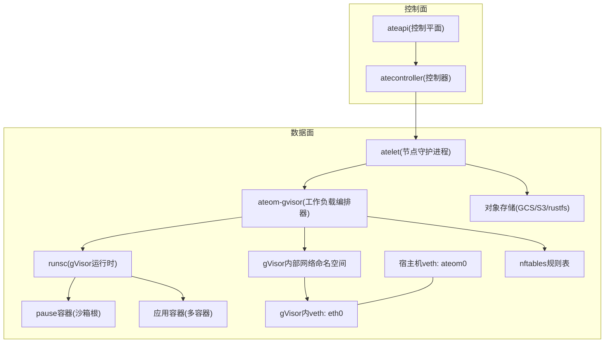
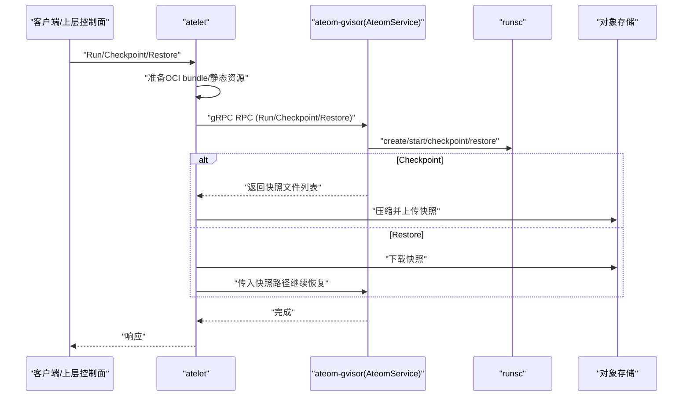
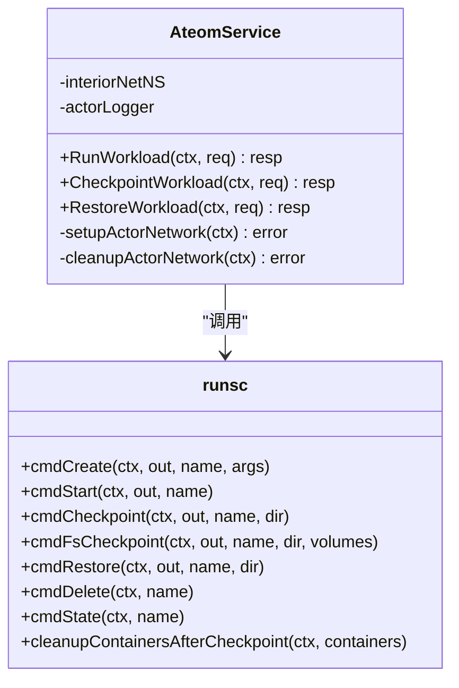
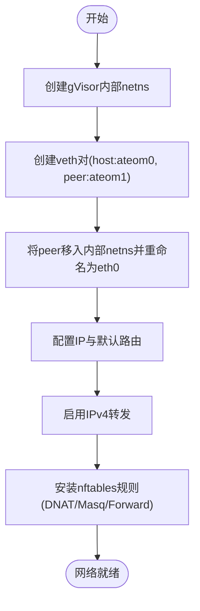
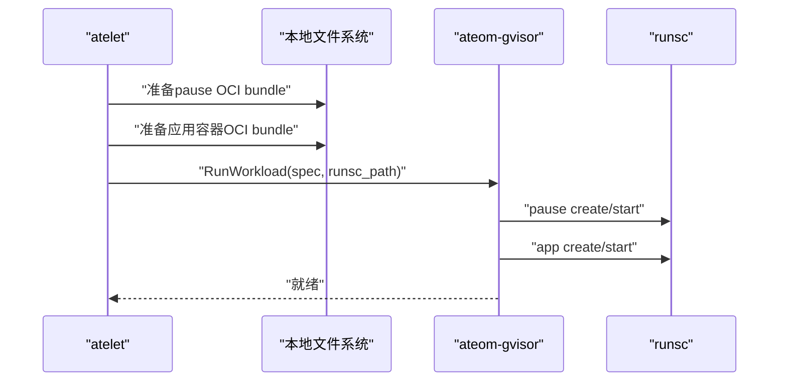
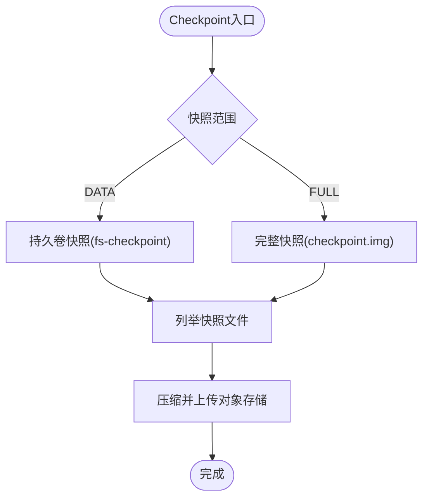
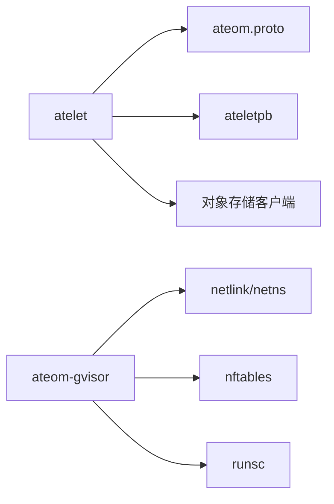

# gVisor沙箱运行时

<cite>
**本文引用的文件**   
- [cmd/ateom-gvisor/main.go](file://cmd/ateom-gvisor/main.go)
- [internal/proto/ateompb/ateom.proto](file://internal/proto/ateompb/ateom.proto)
- [cmd/atelet/main.go](file://cmd/atelet/main.go)
- [cmd/atelet/sandbox_assets.go](file://cmd/atelet/sandbox_assets.go)
- [internal/proto/ateletpb/atelet.pb.go](file://internal/proto/ateletpb/atelet.pb.go)
- [cmd/atelet/internal/ategcs/objects.go](file://cmd/atelet/internal/ategcs/objects.go)
- [cmd/atelet/internal/ategcs/sparsezstd.go](file://cmd/atelet/internal/ategcs/sparsezstd.go)
- [demos/counter/counter.go](file://demos/counter/counter.go)
</cite>

## 目录
1. [简介](#简介)
2. [项目结构](#项目结构)
3. [核心组件](#核心组件)
4. [架构总览](#架构总览)
5. [详细组件分析](#详细组件分析)
6. [依赖关系分析](#依赖关系分析)
7. [性能考量](#性能考量)
8. [故障排除指南](#故障排除指南)
9. [结论](#结论)
10. [附录](#附录)

## 简介
本文件面向Agent Substrate的gVisor沙箱运行时，系统性阐述以下主题：
- gVisor轻量级虚拟化技术的工作原理（用户态内核、系统调用过滤与进程隔离）在Substrate中的集成方式。
- AteomService的实现架构与三个核心RPC方法的工作流程：RunWorkload、CheckpointWorkload、RestoreWorkload。
- 网络命名空间创建与管理、veth对配置与nftables规则设置。
- 容器镜像OCI包处理、pause容器的作用与应用容器生命周期管理。
- 快照机制实现细节：内存转储、文件系统增量备份与状态恢复过程。
- 配置示例与性能调优建议。
- 故障排除指南与最佳实践。

## 项目结构
围绕gVisor运行时，关键代码分布在以下模块：
- ateom-gvisor：运行在每个Worker Pod内部的辅助服务，负责通过runsc启动/检查点/恢复gVisor工作负载，并管理网络命名空间与nftables规则。
- atelet：节点侧守护进程，负责准备OCI bundle、拉取静态资源（如runsc）、协调snapshot上传/下载，并通过Unix域socket与ateom-gvisor通信。
- ateom.proto：定义Ateom服务接口与工作负载规格。
- ateletpb：定义atelet对外暴露的Herder接口及SandboxAssets等数据结构。

图表来源
- [cmd/ateom-gvisor/main.go](file://cmd/ateom-gvisor/main.go)
- [cmd/atelet/main.go](file://cmd/atelet/main.go)
- [internal/proto/ateompb/ateom.proto](file://internal/proto/ateompb/ateom.proto)
- [internal/proto/ateletpb/atelet.pb.go](file://internal/proto/ateletpb/atelet.pb.go)

章节来源
- [README.md](file://README.md)

## 核心组件
- AteomService（gVisor后端）
  - 提供RunWorkload、CheckpointWorkload、RestoreWorkload三个RPC。
  - 负责创建gVisor内部网络命名空间、建立veth对、安装nftables规则、调用runsc执行容器生命周期操作。
- runsc封装
  - 统一封装runsc子命令（create/start/checkpoint/restore/delete/state/fs-checkpoint），为各RPC提供一致的执行路径。
- OCI Bundle与Pause容器
  - atelet负责准备pause与应用容器的OCI bundle；pause作为沙箱根容器，承载持久卷挂载与网络命名空间共享。
- 快照与对象存储
  - CheckpointWorkload输出快照文件列表；atelet负责压缩、上传与后续下载还原。

章节来源
- [cmd/ateom-gvisor/main.go](file://cmd/ateom-gvisor/main.go)
- [internal/proto/ateompb/ateom.proto](file://internal/proto/ateompb/ateom.proto)
- [cmd/atelet/main.go](file://cmd/atelet/main.go)
- [cmd/atelet/sandbox_assets.go](file://cmd/atelet/sandbox_assets.go)

## 架构总览
从控制面到数据面的端到端流程如下：
- 控制面下发工作负载请求至atelet。
- atelet准备OCI bundle与静态资源（runsc），通过Unix socket调用ateom-gvisor的RPC。
- ateom-gvisor在gVisor内部命名空间中配置网络，调用runsc完成容器启动/检查点/恢复。
- 快照数据经atelet压缩后上传至对象存储；恢复时由atelet下载并交由ateom-gvisor还原。

图表来源
- [cmd/atelet/main.go](file://cmd/atelet/main.go)
- [cmd/ateom-gvisor/main.go](file://cmd/ateom-gvisor/main.go)
- [internal/proto/ateompb/ateom.proto](file://internal/proto/ateompb/ateom.proto)

## 详细组件分析

### AteomService与RPC实现
- RunWorkload
  - 初始化actor日志管道，设置actor网络（veth对+路由+nftables）。
  - 先创建并启动pause容器，再依次创建并启动每个应用容器。
  - 等待所有readyz探针就绪后返回。
- CheckpointWorkload
  - 根据scope选择仅持久卷快照或完整快照（包含内存与rootfs delta）。
  - 完成后清理runsc容器句柄，列出快照文件供atelet上传。
- RestoreWorkload
  - 按scope选择仅恢复持久卷或完整恢复。
  - 重建网络，创建并恢复pause与应用容器，等待readyz就绪。

图表来源
- [cmd/ateom-gvisor/main.go](file://cmd/ateom-gvisor/main.go)
- [internal/proto/ateompb/ateom.proto](file://internal/proto/ateompb/ateom.proto)

章节来源
- [cmd/ateom-gvisor/main.go](file://cmd/ateom-gvisor/main.go)
- [internal/proto/ateompb/ateom.proto](file://internal/proto/ateompb/ateom.proto)

### 网络命名空间与veth/nftables
- 命名空间
  - 为gVisor创建独立命名空间，避免与Pod主命名空间冲突。
- veth对
  - 在Pod命名空间创建host侧veth（ateom0），peer端移入gVisor内部命名空间并重命名为eth0。
  - 配置双方IP段与默认路由，使gVisor流量经Pod eth0出网。
- nftables规则
  - 新建专用表，设置prerouting DNAT（将Pod IP:80转发至actor veth IP:80）、postrouting masquerade（将actor源地址伪装为Pod IP）、forward接受转发。
  - 清理时删除整表，保证幂等与可恢复。

图表来源
- [cmd/ateom-gvisor/main.go](file://cmd/ateom-gvisor/main.go)

章节来源
- [cmd/ateom-gvisor/main.go](file://cmd/ateom-gvisor/main.go)

### OCI包处理与pause容器
- OCI bundle准备
  - atelet并行准备pause与应用容器的bundle，注入CRI注解以标识sandbox/container类型。
  - pause容器用于承载DurableDir卷挂载与共享网络命名空间。
- 静态资源管理
  - SandboxAssets记录按架构映射的静态资源（gVisor对应“runsc”），确保版本一致性。
- 生命周期
  - 启动顺序：pause -> 应用容器；停止/清理顺序：应用容器 -> pause。

图表来源
- [cmd/atelet/main.go](file://cmd/atelet/main.go)
- [cmd/atelet/sandbox_assets.go](file://cmd/atelet/sandbox_assets.go)
- [internal/proto/ateletpb/atelet.pb.go](file://internal/proto/ateletpb/atelet.pb.go)

章节来源
- [cmd/atelet/main.go](file://cmd/atelet/main.go)
- [cmd/atelet/sandbox_assets.go](file://cmd/atelet/sandbox_assets.go)
- [internal/proto/ateletpb/atelet.pb.go](file://internal/proto/ateletpb/atelet.pb.go)

### 快照机制：内存转储、文件系统增量与恢复
- 快照范围
  - DATA：仅持久卷内容（DurableDir）。
  - FULL：内存+rootfs增量（含持久卷）。
- 写入路径
  - CheckpointWorkload生成checkpoint.img与页镜像等文件，返回相对文件名集合。
  - atelet使用zstd压缩（支持稀疏格式与流式上传），上传至对象存储。
- 恢复路径
  - atelet下载快照并放置到指定目录，调用RestoreWorkload进行恢复。
  - 对于DATA范围，仅恢复持久卷；FULL范围则恢复内存与文件系统。

图表来源
- [cmd/ateom-gvisor/main.go](file://cmd/ateom-gvisor/main.go)
- [cmd/atelet/internal/ategcs/objects.go](file://cmd/atelet/internal/ategcs/objects.go)
- [cmd/atelet/internal/ategcs/sparsezstd.go](file://cmd/atelet/internal/ategcs/sparsezstd.go)

章节来源
- [cmd/ateom-gvisor/main.go](file://cmd/ateom-gvisor/main.go)
- [cmd/atelet/internal/ategcs/objects.go](file://cmd/atelet/internal/ategcs/objects.go)
- [cmd/atelet/internal/ategcs/sparsezstd.go](file://cmd/atelet/internal/ategcs/sparsezstd.go)

### gVisor工作原理与隔离模型（概念性说明）
- 用户态内核
  - gVisor以用户态进程模拟Linux内核行为，拦截并处理系统调用，降低与宿主内核耦合。
- 系统调用过滤
  - 通过白名单/策略限制允许的系统调用，减少攻击面。
- 进程隔离
  - 每个工作负载在独立命名空间与cgroup中运行，结合seccomp与capabilities进一步收敛权限。
- 与Substrate集成
  - Substrate通过runsc管理gVisor实例，配合网络命名空间与nftables实现安全可达性与出站访问控制。

[本节为概念性说明，不直接分析具体源码文件]

## 依赖关系分析
- atelet依赖
  - ateom.proto：定义Ateom服务接口与工作负载规格。
  - ateletpb：定义Herder接口与SandboxAssets等。
  - GCS/S3/rustfs客户端：用于快照上传/下载与zstd编解码。
- ateom-gvisor依赖
  - netlink/netns：创建与切换网络命名空间、配置veth与路由。
  - nftables：安装/删除规则表。
  - runsc：执行容器生命周期操作。

图表来源
- [internal/proto/ateompb/ateom.proto](file://internal/proto/ateompb/ateom.proto)
- [internal/proto/ateletpb/atelet.pb.go](file://internal/proto/ateletpb/atelet.pb.go)
- [cmd/atelet/main.go](file://cmd/atelet/main.go)
- [cmd/ateom-gvisor/main.go](file://cmd/ateom-gvisor/main.go)

章节来源
- [internal/proto/ateompb/ateom.proto](file://internal/proto/ateompb/ateom.proto)
- [internal/proto/ateletpb/atelet.pb.go](file://internal/proto/ateletpb/atelet.pb.go)
- [cmd/atelet/main.go](file://cmd/atelet/main.go)
- [cmd/ateom-gvisor/main.go](file://cmd/ateom-gvisor/main.go)

## 性能考量
- 快照压缩与传输
  - 采用zstd高速级别，针对近零数据的内存镜像提升吞吐；支持流式上传以减少临时IO。
  - 稀疏格式支持，避免写空洞区域，降低I/O压力。
- 并发准备
  - OCI bundle准备与容器启动并行化，缩短冷启动时间。
- 网络路径优化
  - 使用veth直连与最小化nftables规则，降低转发开销。
- readyz探测
  - 应用需实现/readyz端点，避免过早接入流量导致失败重试风暴。

章节来源
- [cmd/atelet/internal/ategcs/objects.go](file://cmd/atelet/internal/ategcs/objects.go)
- [cmd/atelet/internal/ategcs/sparsezstd.go](file://cmd/atelet/internal/ategcs/sparsezstd.go)
- [demos/counter/counter.go](file://demos/counter/counter.go)

## 故障排除指南
- 无法连接gVisor内部服务
  - 检查nftables表是否被正确安装与清理；确认Pod IP与actor veth IP段未冲突。
- 启动后readyz一直失败
  - 确认应用已实现/readyz并在端口上返回200；核对端口与路径配置。
- 快照上传失败
  - 检查对象存储URL解析与权限；确认zstd压缩与稀疏格式兼容性。
- 恢复后状态不一致
  - 确认scope选择正确（DATA/FULL）；验证快照文件完整性与下载路径。

章节来源
- [cmd/ateom-gvisor/main.go](file://cmd/ateom-gvisor/main.go)
- [cmd/atelet/main.go](file://cmd/atelet/main.go)
- [cmd/atelet/internal/ategcs/objects.go](file://cmd/atelet/internal/ategcs/objects.go)

## 结论
Substrate通过ateom-gvisor与runsc深度集成gVisor，实现了高隔离、低开销的轻量级沙箱运行时。配合atelet的OCI bundle管理与快照能力，系统在快速激活、状态保持与弹性伸缩方面具备良好表现。未来可在网络策略精细化、多端口DNAT与IPv6双栈等方面持续演进。

## 附录

### 配置示例要点
- SandboxConfig（gVisor）
  - 指定SandboxClass为gvisor，并为amd64/arm64分别提供runsc资产URL与SHA256校验值。
- 工作负载Spec
  - 定义pause镜像与应用容器镜像、环境变量、卷挂载与readyz探针。
- 快照范围
  - 根据业务需求选择SNAPSHOT_SCOPE_DATA或SNAPSHOT_SCOPE_FULL。

章节来源
- [internal/proto/ateompb/ateom.proto](file://internal/proto/ateompb/ateom.proto)
- [cmd/atelet/sandbox_assets.go](file://cmd/atelet/sandbox_assets.go)
- [cmd/atelet/main.go](file://cmd/atelet/main.go)
