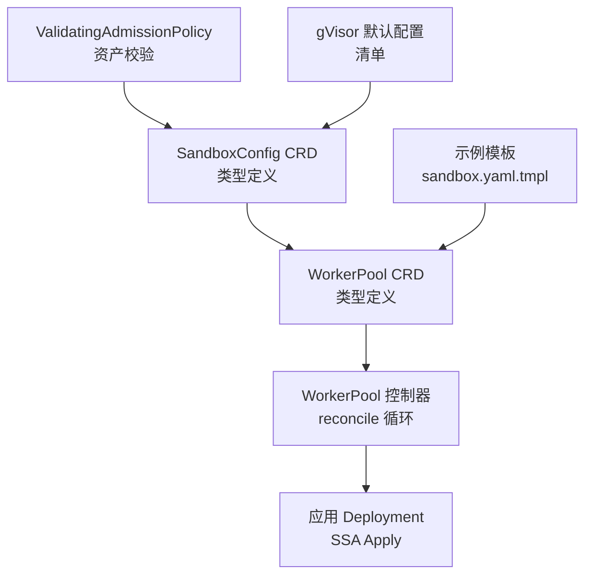
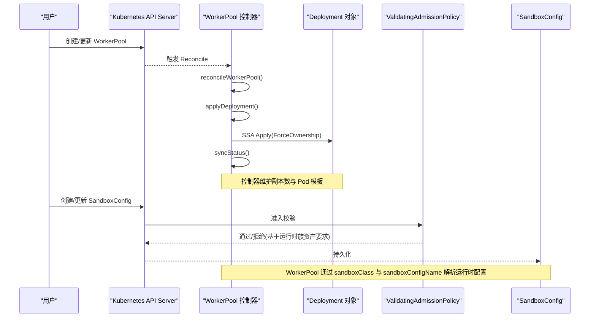
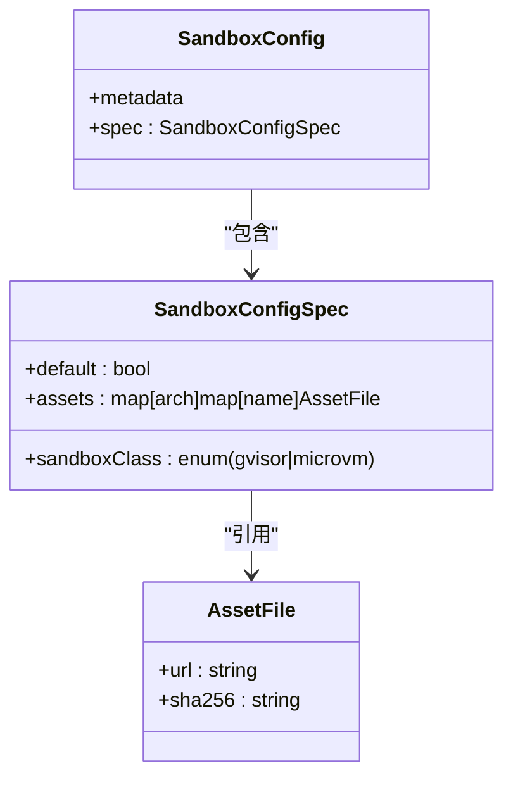
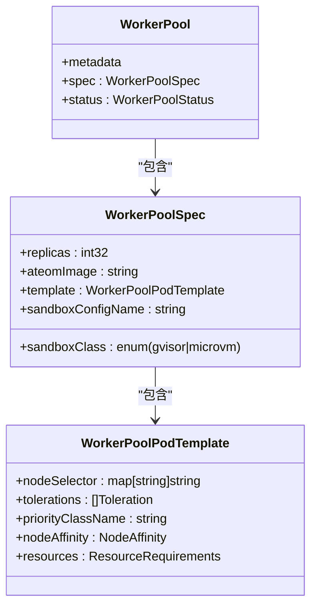
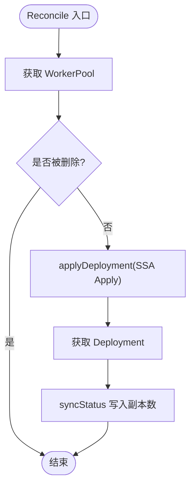
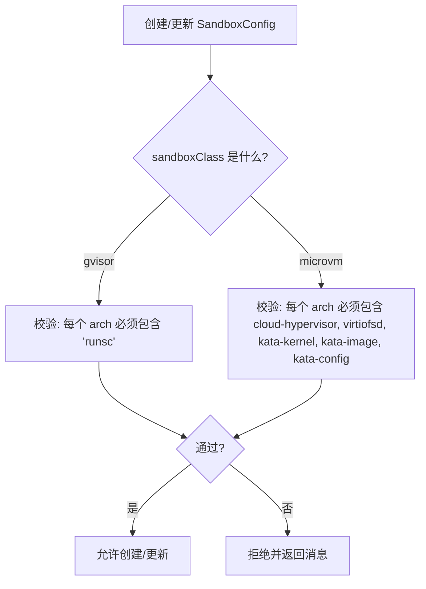
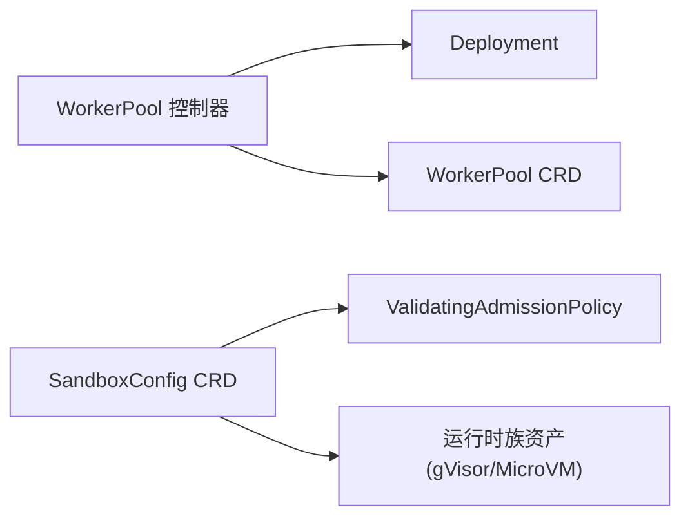

# 沙箱配置管理

<cite>
**本文引用的文件**   
- [sandboxconfig_types.go](file://pkg/api/v1alpha1/sandboxconfig_types.go)
- [workerpool_types.go](file://pkg/api/v1alpha1/workerpool_types.go)
- [workerpool_controller.go](file://cmd/atecontroller/internal/controllers/workerpool_controller.go)
- [workerpool_apply.go](file://cmd/atecontroller/internal/controllers/workerpool_apply.go)
- [sandboxconfig-gvisor.yaml](file://manifests/ate-install/sandboxconfig-gvisor.yaml)
- [sandboxconfig-validation.yaml](file://manifests/ate-install/sandboxconfig-validation.yaml)
- [sandboxconfig_validation_test.go](file://pkg/api/v1alpha1/sandboxconfig_validation_test.go)
- [workerpool_controller_test.go](file://cmd/atecontroller/internal/controllers/workerpool_controller_test.go)
- [workerpool_apply_test.go](file://cmd/atecontroller/internal/controllers/workerpool_apply_test.go)
- [sandbox.yaml.tmpl](file://demos/sandbox/sandbox.yaml.tmpl)
</cite>

## 目录
1. [简介](#简介)
2. [项目结构](#项目结构)
3. [核心组件](#核心组件)
4. [架构总览](#架构总览)
5. [详细组件分析](#详细组件分析)
6. [依赖关系分析](#依赖关系分析)
7. [性能与资源配置最佳实践](#性能与资源配置最佳实践)
8. [热更新与滚动升级](#热更新与滚动升级)
9. [YAML 配置示例与常见模式](#yaml-配置示例与常见模式)
10. [配置验证规则与错误处理指南](#配置验证规则与错误处理指南)
11. [故障排查](#故障排查)
12. [结论](#结论)

## 简介
本文件面向 Agent Substrate 的沙箱配置管理系统，聚焦以下目标：
- 解释 SandboxConfig 自定义资源定义（CRD）的结构与字段含义，包括运行时类型选择、资源限制与安全策略。
- 阐述 WorkerPool 控制器的实现逻辑，包括沙箱运行时的动态切换、配置验证与资源协调。
- 说明不同沙箱运行时的配置差异与兼容性要求，特别是 gVisor 与 MicroVM 的特定参数。
- 提供资源配置最佳实践（CPU/内存、存储卷挂载、网络策略）。
- 介绍配置热更新机制与滚动升级策略。
- 给出完整的 YAML 配置示例与常见配置模式参考。
- 说明配置验证规则与错误处理指南。

## 项目结构
与沙箱配置管理直接相关的代码与清单位于如下位置：
- CRD 类型定义：pkg/api/v1alpha1/sandboxconfig_types.go、pkg/api/v1alpha1/workerpool_types.go
- 控制器实现：cmd/atecontroller/internal/controllers/workerpool_controller.go、workerpool_apply.go
- 安装清单与校验策略：manifests/ate-install/sandboxconfig-gvisor.yaml、manifests/ate-install/sandboxconfig-validation.yaml
- 测试与示例：pkg/api/v1alpha1/sandboxconfig_validation_test.go、cmd/atecontroller/internal/controllers/workerpool_controller_test.go、cmd/atecontroller/internal/controllers/workerpool_apply_test.go、demos/sandbox/sandbox.yaml.tmpl

图表来源
- [sandboxconfig_types.go:1-117](file://pkg/api/v1alpha1/sandboxconfig_types.go#L1-L117)
- [workerpool_types.go:1-136](file://pkg/api/v1alpha1/workerpool_types.go#L1-L136)
- [workerpool_controller.go:45-121](file://cmd/atecontroller/internal/controllers/workerpool_controller.go#L45-L121)
- [workerpool_apply.go:26-35](file://cmd/atecontroller/internal/controllers/workerpool_apply.go#L26-L35)
- [sandboxconfig-validation.yaml:1-55](file://manifests/ate-install/sandboxconfig-validation.yaml#L1-L55)
- [sandboxconfig-gvisor.yaml:1-36](file://manifests/ate-install/sandboxconfig-gvisor.yaml#L1-L36)
- [sandbox.yaml.tmpl:1-49](file://demos/sandbox/sandbox.yaml.tmpl#L1-L49)

章节来源
- [sandboxconfig_types.go:1-117](file://pkg/api/v1alpha1/sandboxconfig_types.go#L1-L117)
- [workerpool_types.go:1-136](file://pkg/api/v1alpha1/workerpool_types.go#L1-L136)
- [workerpool_controller.go:45-121](file://cmd/atecontroller/internal/controllers/workerpool_controller.go#L45-L121)
- [workerpool_apply.go:26-35](file://cmd/atecontroller/internal/controllers/workerpool_apply.go#L26-L35)
- [sandboxconfig-gvisor.yaml:1-36](file://manifests/ate-install/sandboxconfig-gvisor.yaml#L1-L36)
- [sandboxconfig-validation.yaml:1-55](file://manifests/ate-install/sandboxconfig-validation.yaml#L1-L55)
- [sandbox.yaml.tmpl:1-49](file://demos/sandbox/sandbox.yaml.tmpl#L1-L49)

## 核心组件
- SandboxConfig（集群级）：描述某类沙箱运行时所需的二进制资产（按架构映射），并支持标记为该类运行时的“默认”配置。
- WorkerPool（命名空间级）：声明工作节点池的副本数、容器镜像、调度与资源模板、以及所选沙箱运行时族与具体配置引用。
- WorkerPool 控制器：将 WorkerPool 期望状态同步到 Kubernetes Deployment，并通过 SSA 强制拥有权确保一致性；同时同步状态副本数。
- ValidatingAdmissionPolicy：在创建/更新时校验 SandboxConfig 的 assets 是否符合对应运行时族的必需资产集合。

章节来源
- [sandboxconfig_types.go:21-79](file://pkg/api/v1alpha1/sandboxconfig_types.go#L21-L79)
- [workerpool_types.go:54-89](file://pkg/api/v1alpha1/workerpool_types.go#L54-L89)
- [workerpool_controller.go:45-121](file://cmd/atecontroller/internal/controllers/workerpool_controller.go#L45-L121)
- [sandboxconfig-validation.yaml:15-46](file://manifests/ate-install/sandboxconfig-validation.yaml#L15-L46)

## 架构总览
下图展示了从用户提交 WorkerPool 到控制器落地 Deployment 的关键流程，以及与 SandboxConfig 的关联关系。

图表来源
- [workerpool_controller.go:45-121](file://cmd/atecontroller/internal/controllers/workerpool_controller.go#L45-L121)
- [workerpool_apply.go:26-35](file://cmd/atecontroller/internal/controllers/workerpool_apply.go#L26-L35)
- [sandboxconfig-validation.yaml:15-46](file://manifests/ate-install/sandboxconfig-validation.yaml#L15-L46)
- [workerpool_types.go:70-89](file://pkg/api/v1alpha1/workerpool_types.go#L70-L89)
- [sandboxconfig_types.go:52-79](file://pkg/api/v1alpha1/sandboxconfig_types.go#L52-L79)

## 详细组件分析

### SandboxConfig 类型与字段语义
- SandboxClass：运行时族枚举，当前支持 gvisor 与 microvm。用于限定 WorkerPool 可使用的配置范围。
- SandboxConfigSpec：
  - sandboxClass：该配置适用的运行时族。
  - default：是否作为该族的集群默认配置。当 WorkerPool 未显式指定 sandboxConfigName 时，系统会回退到该族默认配置。
  - assets：按架构（如 amd64/arm64）映射到资产名称与下载信息（url/sha256）。gVisor 需要 runsc；MicroVM 需要 cloud-hypervisor、virtiofsd、kata-kernel、kata-image、kata-config 等。
- AssetFile：包含 url 与 sha256，前者为下载地址，后者用于完整性校验与缓存键。

图表来源
- [sandboxconfig_types.go:21-79](file://pkg/api/v1alpha1/sandboxconfig_types.go#L21-L79)

章节来源
- [sandboxconfig_types.go:21-79](file://pkg/api/v1alpha1/sandboxconfig_types.go#L21-L79)

### WorkerPool 类型与字段语义
- WorkerPoolSpec：
  - replicas：工作 Pod 数量。
  - ateomImage：工作 Pod 中 ateom 容器镜像。
  - template：可选的 Pod 调度与资源设置（NodeSelector、Tolerations、PriorityClassName、NodeAffinity、Resources）。
  - sandboxClass：运行时族，决定节点放置与设备挂载需求，以及可用的 SandboxConfigs。
  - sandboxConfigName：显式引用集群级 SandboxConfig；为空则使用同族默认配置。
- WorkerPoolPodTemplate：映射到 Deployment Pod 模板的亲和性、容忍度、优先级与资源请求/限制。

图表来源
- [workerpool_types.go:22-89](file://pkg/api/v1alpha1/workerpool_types.go#L22-L89)

章节来源
- [workerpool_types.go:22-89](file://pkg/api/v1alpha1/workerpool_types.go#L22-L89)

### WorkerPool 控制器实现要点
- 主循环 Reconcile：获取 WorkerPool、处理删除、调用 reconcileWorkerPool。
- reconcileWorkerPool：
  - applyDeployment：构建 SSA Apply 配置并强制拥有，确保控制器对 Deployment 的独占管理。
  - syncStatus：读取 Deployment 实际副本数并写回 WorkerPool.Status.Replicas。
- SetupWithManager：监听 WorkerPool 与其拥有的 Deployment。

图表来源
- [workerpool_controller.go:45-121](file://cmd/atecontroller/internal/controllers/workerpool_controller.go#L45-L121)
- [workerpool_apply.go:26-35](file://cmd/atecontroller/internal/controllers/workerpool_apply.go#L26-L35)

章节来源
- [workerpool_controller.go:45-121](file://cmd/atecontroller/internal/controllers/workerpool_controller.go#L45-L121)
- [workerpool_apply.go:26-35](file://cmd/atecontroller/internal/controllers/workerpool_apply.go#L26-L35)

### 运行时族差异与兼容性要求
- gVisor（runsc）：
  - 需要在每个架构下提供 runsc 资产。
  - 默认集群配置由安装清单提供，可按架构分别指定 URL 与 SHA256。
- MicroVM（cloud-hypervisor + Kata）：
  - 需要在每个架构下提供 cloud-hypervisor、virtiofsd、kata-kernel、kata-image、kata-config 等资产。
  - 需要宿主机具备 /dev/kvm 与 vhost 设备。

图表来源
- [sandboxconfig-validation.yaml:32-46](file://manifests/ate-install/sandboxconfig-validation.yaml#L32-L46)
- [sandboxconfig-gvisor.yaml:24-36](file://manifests/ate-install/sandboxconfig-gvisor.yaml#L24-L36)

章节来源
- [sandboxconfig-validation.yaml:15-46](file://manifests/ate-install/sandboxconfig-validation.yaml#L15-L46)
- [sandboxconfig-gvisor.yaml:15-36](file://manifests/ate-install/sandboxconfig-gvisor.yaml#L15-L36)

## 依赖关系分析
- WorkerPool 控制器依赖：
  - Kubernetes apps/v1.Deployment（受控对象）
  - ate.dev/v1alpha1.WorkerPool（源对象）
  - SSA Apply 能力（client.FieldOwner + client.ForceOwnership）
- SandboxConfig 与 ValidatingAdmissionPolicy：
  - 通过 admissionregistration.k8s.io/v1 的 ValidatingAdmissionPolicy 与 Binding 进行强校验。
- 运行时族与资产：
  - gVisor 与 MicroVM 的资产集由策略约束，确保运行时二进制完整性与可用性。

图表来源
- [workerpool_controller.go:45-121](file://cmd/atecontroller/internal/controllers/workerpool_controller.go#L45-L121)
- [sandboxconfig-validation.yaml:15-55](file://manifests/ate-install/sandboxconfig-validation.yaml#L15-L55)

章节来源
- [workerpool_controller.go:45-121](file://cmd/atecontroller/internal/controllers/workerpool_controller.go#L45-L121)
- [sandboxconfig-validation.yaml:15-55](file://manifests/ate-install/sandboxconfig-validation.yaml#L15-L55)

## 性能与资源配置最佳实践
- CPU/内存限制：
  - 在 WorkerPool.spec.template.resources 中设置 requests/limits，避免资源争用与 OOM。
  - 结合 PriorityClassName 提升调度优先级，保障关键工作负载。
- 节点亲和与容忍：
  - 使用 nodeSelector/nodeAffinity 将工作 Pod 调度到具备 KVM/vhost 或 GPU 等专用资源的节点。
  - 使用 tolerations 容忍污点，扩大可用节点集合。
- 存储卷挂载：
  - 根据业务需要将快照存储（如 GCS）挂载至工作 Pod，确保跨休眠恢复的数据一致性。
- 网络策略：
  - 配合 atenet 路由与 DNS，按需开放端口与域名访问，最小权限原则暴露服务。

章节来源
- [workerpool_types.go:22-52](file://pkg/api/v1alpha1/workerpool_types.go#L22-L52)
- [workerpool_controller_test.go:362-431](file://cmd/atecontroller/internal/controllers/workerpool_controller_test.go#L362-L431)

## 热更新与滚动升级
- WorkerPool 热更新：
  - 修改 WorkerPool.spec.template（如 NodeSelector、Tolerations、Resources）后，控制器会通过 SSA Apply 重新应用 Deployment，从而触发滚动更新。
  - 修改 replicas 可直接伸缩，控制器同步 status.replicas。
- 沙箱运行时版本升级：
  - 通过更新 SandboxConfig.assets 中的 url/sha256 指向新版本二进制，并由 atelet 拉取新资产。
  - 若需立即生效，可滚动更新 WorkerPool（例如调整 replicas 或镜像标签），使新 Pod 使用新资产。
- 安全校验：
  - 所有 SandboxConfig 变更均受 ValidatingAdmissionPolicy 校验，不满足资产要求的变更将被拒绝。

章节来源
- [workerpool_controller.go:92-112](file://cmd/atecontroller/internal/controllers/workerpool_controller.go#L92-L112)
- [workerpool_controller_test.go:399-431](file://cmd/atecontroller/internal/controllers/workerpool_controller_test.go#L399-L431)
- [sandboxconfig-validation.yaml:15-46](file://manifests/ate-install/sandboxconfig-validation.yaml#L15-L46)

## YAML 配置示例与常见模式
- gVisor 默认 SandboxConfig（集群级）：
  - 包含 amd64/arm64 两个架构的 runsc 资产，并标记为默认。
- 示例 WorkerPool（命名空间级）：
  - 指定 ateomImage、replicas，并可结合模板字段进行调度与资源限制。
- 常见模式：
  - 多运行时族隔离：为 gvisor 与 microvm 分别创建 SandboxConfig，并在不同 WorkerPool 中引用。
  - 灰度升级：先创建新的 SandboxConfig 指向新版二进制，再逐步将 WorkerPool 迁移到新配置。

章节来源
- [sandboxconfig-gvisor.yaml:15-36](file://manifests/ate-install/sandboxconfig-gvisor.yaml#L15-L36)
- [sandbox.yaml.tmpl:20-49](file://demos/sandbox/sandbox.yaml.tmpl#L20-L49)

## 配置验证规则与错误处理指南
- 校验规则：
  - gVisor：每个架构必须包含 runsc 资产。
  - MicroVM：每个架构必须包含 cloud-hypervisor、virtiofsd、kata-kernel、kata-image、kata-config 资产。
- 失败策略：
  - ValidatingAdmissionPolicy 设置为 Fail/Deny，不合规的创建/更新将被拒绝。
- 常见错误与修复：
  - 缺失必要资产：补齐对应架构下的资产条目。
  - SHA256 格式不正确：确保为小写十六进制 64 位字符串。
  - 运行时族与配置不匹配：确保 WorkerPool.sandboxClass 与 SandboxConfig.sandboxClass 一致。

章节来源
- [sandboxconfig-validation.yaml:32-46](file://manifests/ate-install/sandboxconfig-validation.yaml#L32-L46)
- [sandboxconfig_validation_test.go:87-104](file://pkg/api/v1alpha1/sandboxconfig_validation_test.go#L87-L104)

## 故障排查
- 控制器未创建/重建 Deployment：
  - 检查 WorkerPool 是否存在且未被删除；查看控制器日志与事件。
  - 确认 SSA Apply 是否成功（ForceOwnership 应保证控制器拥有权）。
- 外部篡改导致副本不一致：
  - 控制器会强制回收副本数，确保与 spec.replicas 一致。
- 模板更新未生效：
  - 确认 WorkerPool.spec.template 已更新；控制器会在下一次 Reconcile 中传播到 Deployment。
- SandboxConfig 被拒绝：
  - 查看 ValidatingAdmissionPolicy 的错误消息，补齐缺失资产或修正格式。

章节来源
- [workerpool_controller_test.go:256-297](file://cmd/atecontroller/internal/controllers/workerpool_controller_test.go#L256-L297)
- [workerpool_controller_test.go:362-431](file://cmd/atecontroller/internal/controllers/workerpool_controller_test.go#L362-L431)
- [sandboxconfig_validation_test.go:87-104](file://pkg/api/v1alpha1/sandboxconfig_validation_test.go#L87-L104)

## 结论
通过 SandboxConfig 与 WorkerPool 的组合，Agent Substrate 实现了沙箱运行时的解耦与灵活编排：以运行时族为单位管理二进制资产，以 WorkerPool 驱动工作 Pod 的调度与生命周期。配合 ValidatingAdmissionPolicy 的强校验与 SSA 的强拥有权，系统在安全性与一致性方面提供了可靠保障。建议在生产环境中遵循资源限制、节点亲和与最小权限的网络策略，并结合灰度策略进行运行时版本的平滑升级。
