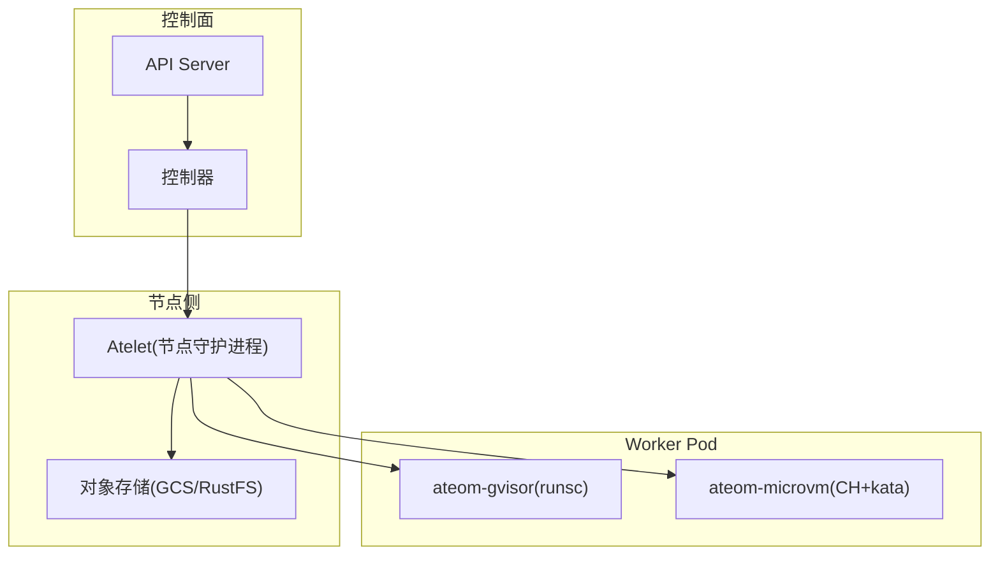
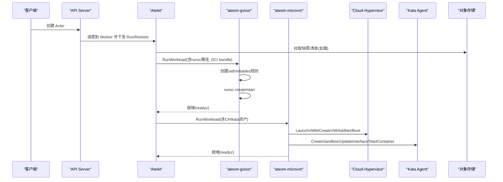
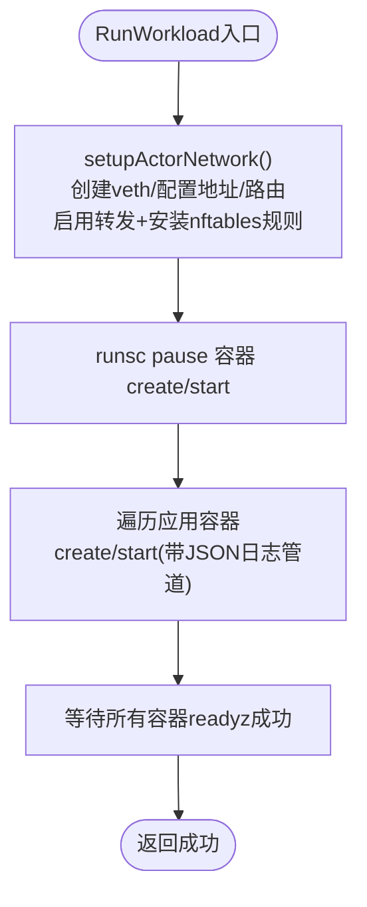
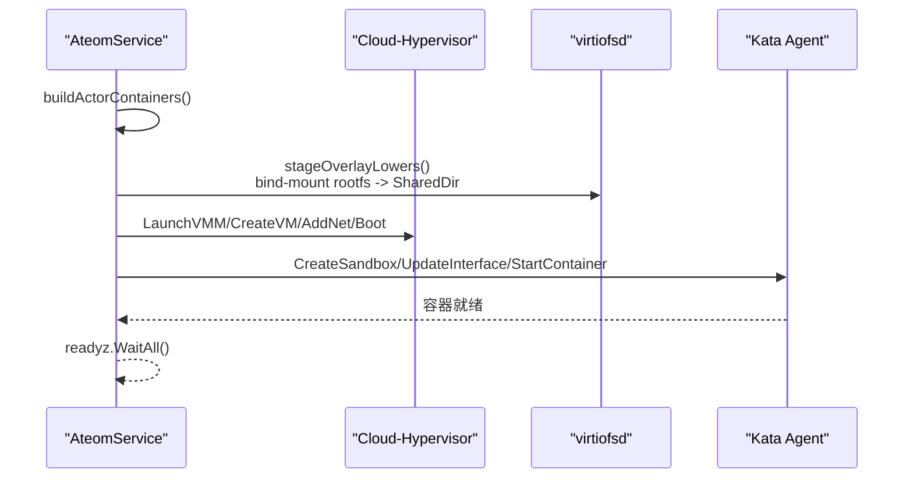
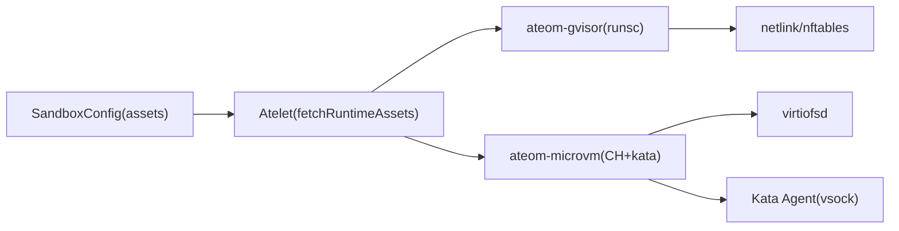
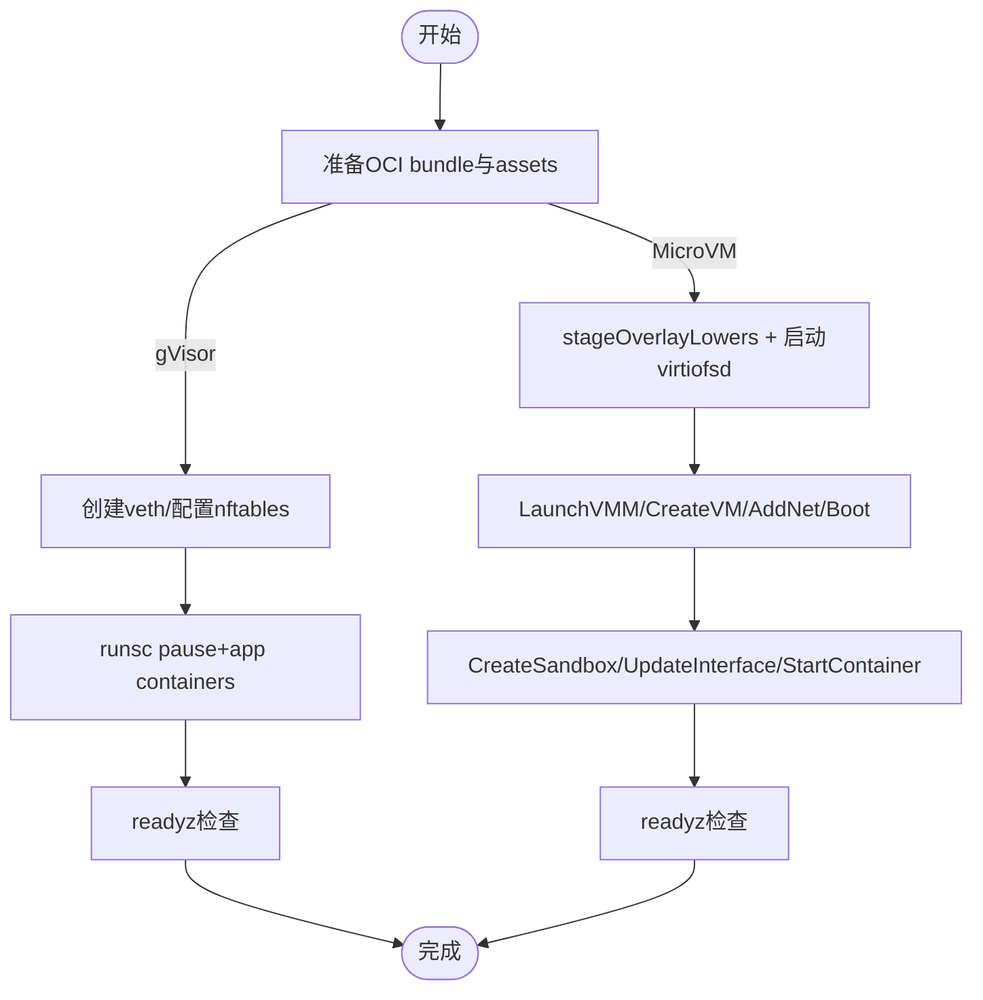

# 沙箱隔离机制

<cite>
**本文引用的文件**   
- [cmd/ateom-gvisor/main.go](file://cmd/ateom-gvisor/main.go)
- [cmd/ateom-gvisor/runsc.go](file://cmd/ateom-gvisor/runsc.go)
- [cmd/ateom-microvm/main.go](file://cmd/ateom-microvm/main.go)
- [cmd/ateom-microvm/run.go](file://cmd/ateom-microvm/run.go)
- [cmd/ateom-microvm/net.go](file://cmd/ateom-microvm/net.go)
- [pkg/api/v1alpha1/sandboxconfig_types.go](file://pkg/api/v1alpha1/sandboxconfig_types.go)
- [cmd/atelet/sandbox_assets.go](file://cmd/atelet/sandbox_assets.go)
- [internal/proto/ateletpb/atelet.pb.go](file://internal/proto/ateletpb/atelet.pb.go)
- [cmd/atelet/main.go](file://cmd/atelet/main.go)
- [hack/microvm-assets/README.md](file://hack/microvm-assets/README.md)
- [docs/threat-model.md](file://docs/threat-model.md)
</cite>

## 目录
1. [简介](#简介)
2. [项目结构](#项目结构)
3. [核心组件](#核心组件)
4. [架构总览](#架构总览)
5. [详细组件分析](#详细组件分析)
6. [依赖关系分析](#依赖关系分析)
7. [性能与安全特性对比](#性能与安全特性对比)
8. [配置与资源限制](#配置与资源限制)
9. [容器镜像与OCI包处理](#容器镜像与oci包处理)
10. [沙箱启动流程与资源分配策略](#沙箱启动流程与资源分配策略)
11. [安全最佳实践与配置建议](#安全最佳实践与配置建议)
12. [部署示例](#部署示例)
13. [故障排除指南](#故障排除指南)
14. [结论](#结论)

## 简介
本文件系统性阐述 Agent Substrate 的沙箱隔离机制，重点覆盖两种运行时：gVisor（用户态内核）与 MicroVM（基于 cloud-hypervisor + kata 的轻量虚拟机）。文档从系统架构、组件职责、数据流、网络与文件系统隔离、快照与恢复、资源配置、镜像与 OCI 管理、启动流程、性能与安全特性对比、最佳实践、部署与排障等方面展开，帮助读者快速理解并正确落地。

## 项目结构
与沙箱隔离相关的关键路径与职责如下：
- ateom-gvisor：gVisor 运行时实现，负责在 worker Pod 内创建 gVisor 内部网络命名空间、拉起 runsc、编排容器生命周期与快照/恢复。
- ateom-microvm：MicroVM 运行时实现，直接驱动 cloud-hypervisor，通过 kata agent 完成沙箱与容器启动，支持完整内存快照与按需恢复。
- atelet：节点侧守护进程，负责拉取并缓存运行资产（如 runsc、cloud-hypervisor、kata 镜像等），准备 OCI bundle，协调快照上传/下载与还原。
- SandboxConfig：集群级资源，声明某类沙箱所需的二进制与镜像资产，按架构与名称索引，供 atelet 拉取与校验。
- 协议定义：ateompb 与 ateletpb 定义了 ateom 与 atelet 之间的 RPC 与快照配置结构。

图表来源
- [cmd/ateom-gvisor/main.go:1-155](file://cmd/ateom-gvisor/main.go#L1-L155)
- [cmd/ateom-microvm/main.go:1-154](file://cmd/ateom-microvm/main.go#L1-L154)
- [cmd/atelet/main.go:474-494](file://cmd/atelet/main.go#L474-L494)

章节来源
- [cmd/ateom-gvisor/main.go:1-155](file://cmd/ateom-gvisor/main.go#L1-L155)
- [cmd/ateom-microvm/main.go:1-154](file://cmd/ateom-microvm/main.go#L1-L154)
- [cmd/atelet/main.go:474-494](file://cmd/atelet/main.go#L474-L494)

## 核心组件
- ateom-gvisor：提供 RunWorkload/CheckpointWorkload/RestoreWorkload 三个 RPC，封装 runsc 子命令，建立独立网络命名空间并通过 veth+nftables 暴露到宿主机网络。
- ateom-microvm：同样提供上述 RPC，但底层使用 cloud-hypervisor 启动微 VM，借助 kata agent 完成 CreateSandbox/UpdateInterface/StartContainer 等步骤；支持完整内存快照与按需恢复。
- atelet：根据 SandboxConfig 拉取并缓存运行资产，准备 OCI bundle，执行快照上传/下载，并在恢复时读取快照清单以选择正确的沙箱版本。
- SandboxConfig：声明 sandboxClass（gvisor/microvm）、默认标记与 assets（按架构与名称映射 URL+SHA256）。

章节来源
- [cmd/ateom-gvisor/main.go:157-237](file://cmd/ateom-gvisor/main.go#L157-L237)
- [cmd/ateom-microvm/main.go:184-226](file://cmd/ateom-microvm/main.go#L184-L226)
- [cmd/atelet/sandbox_assets.go:91-115](file://cmd/atelet/sandbox_assets.go#L91-L115)
- [pkg/api/v1alpha1/sandboxconfig_types.go:21-79](file://pkg/api/v1alpha1/sandboxconfig_types.go#L21-L79)

## 架构总览
下图展示从工作负载调度到沙箱运行的端到端交互，包括 gVisor 与 MicroVM 两条路径。

图表来源
- [cmd/ateom-gvisor/main.go:180-237](file://cmd/ateom-gvisor/main.go#L180-L237)
- [cmd/ateom-microvm/run.go:187-368](file://cmd/ateom-microvm/run.go#L187-L368)
- [cmd/atelet/main.go:474-494](file://cmd/atelet/main.go#L474-L494)

## 详细组件分析

### gVisor 运行时（ateom-gvisor）
- 网络隔离：为每个 actor 创建独立的“内部”网络命名空间，通过 veth 对连接 worker Pod 命名空间，并在 host 侧安装 nftables 规则实现 DNAT/Masquerade，使 actor 流量经 worker Pod IP 出/入。
- 进程隔离：由 runsc 作为沙箱边界，pause 容器作为沙箱根，应用容器共享该沙箱。
- 快照与恢复：支持全量与仅数据卷快照；DATA 快照仅持久化 durable-dir 内容，FULL 快照包含内存与文件系统增量。
- 日志与可观测性：将每个容器的 stdout/stderr 以 JSON 形式输出，附带 ate.dev/* 标签；集成 OpenTelemetry。

图表来源
- [cmd/ateom-gvisor/main.go:439-521](file://cmd/ateom-gvisor/main.go#L439-L521)
- [cmd/ateom-gvisor/main.go:180-237](file://cmd/ateom-gvisor/main.go#L180-L237)
- [cmd/ateom-gvisor/runsc.go:35-103](file://cmd/ateom-gvisor/runsc.go#L35-L103)

章节来源
- [cmd/ateom-gvisor/main.go:180-237](file://cmd/ateom-gvisor/main.go#L180-L237)
- [cmd/ateom-gvisor/main.go:439-521](file://cmd/ateom-gvisor/main.go#L439-L521)
- [cmd/ateom-gvisor/runsc.go:35-103](file://cmd/ateom-gvisor/runsc.go#L35-L103)

### MicroVM 运行时（ateom-microvm）
- 虚拟化边界：直接启动 cloud-hypervisor VMM，加载 kata 内核与镜像，通过 virtio-fs 提供只读 lower（来自 OCI rootfs），写层为 guest tmpfs。
- 网络隔离：在 worker Pod 命名空间创建 veth，在 guest 内通过 kata agent 配置 eth0 接口、路由与 ARP，确保与宿主机互通且与其他 actor 隔离。
- 快照与恢复：支持完整内存快照与按需恢复（demand-pages），跨 pod 迁移时保持 base-id 不变，保证 overlay lower 路径一致性。
- 日志与可观测性：通过 kata agent ttrpc 持续读取 stdout/stderr，并以 ate.dev/* 标签写入 pod 日志。

图表来源
- [cmd/ateom-microvm/run.go:376-422](file://cmd/ateom-microvm/run.go#L376-L422)
- [cmd/ateom-microvm/run.go:449-476](file://cmd/ateom-microvm/run.go#L449-L476)
- [cmd/ateom-microvm/run.go:482-510](file://cmd/ateom-microvm/run.go#L482-L510)

章节来源
- [cmd/ateom-microvm/run.go:187-368](file://cmd/ateom-microvm/run.go#L187-L368)
- [cmd/ateom-microvm/run.go:376-422](file://cmd/ateom-microvm/run.go#L376-L422)
- [cmd/ateom-microvm/run.go:449-476](file://cmd/ateom-microvm/run.go#L449-L476)
- [cmd/ateom-microvm/run.go:482-510](file://cmd/ateom-microvm/run.go#L482-L510)

## 依赖关系分析
- atelet 依赖 SandboxConfig 中的 assets 描述，按架构与名称拉取并缓存二进制/镜像，确保完整性校验（URL+SHA256）。
- ateom-gvisor 依赖 runsc 二进制与 OCI bundle；网络依赖 netlink/nftables。
- ateom-microvm 依赖 cloud-hypervisor、kata 内核/镜像、virtiofsd，以及 kata agent 通信通道（vsock）。

图表来源
- [cmd/atelet/sandbox_assets.go:91-115](file://cmd/atelet/sandbox_assets.go#L91-L115)
- [pkg/api/v1alpha1/sandboxconfig_types.go:33-79](file://pkg/api/v1alpha1/sandboxconfig_types.go#L33-L79)
- [cmd/ateom-gvisor/main.go:439-521](file://cmd/ateom-gvisor/main.go#L439-L521)
- [cmd/ateom-microvm/run.go:405-422](file://cmd/ateom-microvm/run.go#L405-L422)

章节来源
- [cmd/atelet/sandbox_assets.go:91-115](file://cmd/atelet/sandbox_assets.go#L91-L115)
- [pkg/api/v1alpha1/sandboxconfig_types.go:33-79](file://pkg/api/v1alpha1/sandboxconfig_types.go#L33-L79)
- [cmd/ateom-gvisor/main.go:439-521](file://cmd/ateom-gvisor/main.go#L439-L521)
- [cmd/ateom-microvm/run.go:405-422](file://cmd/ateom-microvm/run.go#L405-L422)

## 性能与安全特性对比
- 启动延迟
  - gVisor：用户态内核，启动较快，适合冷启动敏感场景。
  - MicroVM：需引导内核与初始化 kata agent，冷启动略慢，但具备更强的隔离。
- 快照/恢复
  - gVisor：支持 FULL/DATA 快照；DATA 仅持久化指定目录，FULL 包含内存与文件系统增量。
  - MicroVM：原生内存快照，支持按需恢复（demand-pages），跨节点迁移时保留 base-id，降低 I/O 压力。
- 隔离强度
  - gVisor：强于传统容器，弱于虚拟机；通过用户态内核减少攻击面。
  - MicroVM：接近虚拟机隔离，结合 kata agent 与 virtio-fs，提供更强的进程/设备/内存隔离。
- 网络模型
  - gVisor：veth + nftables 兼容现有 router 假设，便于快速接入。
  - MicroVM：veth + tap + TC mirroring + guest 侧网卡配置，更贴近真实网络栈。

章节来源
- [cmd/ateom-gvisor/main.go:239-307](file://cmd/ateom-gvisor/main.go#L239-L307)
- [cmd/ateom-microvm/run.go:187-368](file://cmd/ateom-microvm/run.go#L187-L368)
- [docs/threat-model.md:93-117](file://docs/threat-model.md#L93-L117)

## 配置与资源限制
- SandboxConfig 关键字段
  - sandboxClass：gvisor 或 microvm。
  - default：是否为该类沙箱的默认配置。
  - assets：按架构（amd64/arm64）与名称（如 runsc、cloud-hypervisor、kata-kernel、kata-image、virtiofsd）映射 URL 与 SHA256。
- 资源限制
  - MicroVM：guest 内存与 vCPU 来源于 kata 配置解析；overlay 写层为 guest tmpfs，避免宿主磁盘占用。
  - gVisor：通过 runsc 参数与 OCI spec 控制资源；网络与文件系统由 gVisor 边界保护。
- 验证与约束
  - 针对 microvm 的 assets 必须包含必要项（如 kata-image、virtiofsd），否则拒绝创建。
  - gvisor 要求至少存在 runsc 资产，且每个架构均需满足。

章节来源
- [pkg/api/v1alpha1/sandboxconfig_types.go:52-79](file://pkg/api/v1alpha1/sandboxconfig_types.go#L52-L79)
- [cmd/atelet/sandbox_assets.go:91-115](file://cmd/atelet/sandbox_assets.go#L91-L115)

## 容器镜像与OCI包处理
- OCI bundle 准备：atelet 为每个容器生成 bundle（config.json + rootfs），并在 MicroVM 路径下注入 /etc/resolv.conf 以提供 DNS。
- Overlay 根文件系统：MicroVM 使用 virtio-fs 挂载只读 lower（image rootfs），写层为 guest tmpfs，避免宿主磁盘污染。
- 镜像拉取与缓存：assets 采用内容寻址（SHA256），重复拉取为无操作，提升 Checkpoint/Restore 效率。

章节来源
- [cmd/ateom-microvm/run.go:376-397](file://cmd/ateom-microvm/run.go#L376-L397)
- [cmd/atelet/sandbox_assets.go:91-115](file://cmd/atelet/sandbox_assets.go#L91-L115)

## 沙箱启动流程与资源分配策略
- gVisor 启动流程
  - 创建内部网络命名空间与 veth，配置地址与路由，安装 nftables 规则。
  - 启动 pause 容器与应用容器，等待 readyz 成功后返回。
- MicroVM 启动流程
  - 准备 overlay lowers 并启动 virtiofsd。
  - 启动 cloud-hypervisor，创建 VM、添加网络、引导内核。
  - 通过 kata agent 建立沙箱、配置 guest 网络、逐个启动 overlay 容器。
  - 等待 readyz 成功后返回。
- 资源分配策略
  - MicroVM：从 kata 配置解析内存与 vCPU；guest 写层使用 tmpfs，不占用宿主磁盘。
  - gVisor：遵循 OCI 资源限制，网络与文件系统由 gVisor 边界保护。

图表来源
- [cmd/ateom-gvisor/main.go:180-237](file://cmd/ateom-gvisor/main.go#L180-L237)
- [cmd/ateom-microvm/run.go:187-368](file://cmd/ateom-microvm/run.go#L187-L368)
- [cmd/ateom-microvm/run.go:405-422](file://cmd/ateom-microvm/run.go#L405-L422)

章节来源
- [cmd/ateom-gvisor/main.go:180-237](file://cmd/ateom-gvisor/main.go#L180-L237)
- [cmd/ateom-microvm/run.go:187-368](file://cmd/ateom-microvm/run.go#L187-L368)
- [cmd/ateom-microvm/run.go:405-422](file://cmd/ateom-microvm/run.go#L405-L422)

## 安全最佳实践与配置建议
- 网络隔离
  - 默认拒绝跨 actor 通信，必要时显式允许；避免暴露宿主机元数据与服务。
  - gVisor 使用 nftables 表隔离当前 actor；MicroVM 通过 tap+TC mirroring 与 guest 侧路由严格隔离。
- 文件系统隔离
  - 使用 overlay（virtio-fs lower + guest tmpfs upper）避免宿主磁盘污染。
  - 仅挂载必要的只读 lower，写层在 guest 内存中。
- 身份与凭证
  - 最小权限原则访问对象存储；使用 per-actor 凭据与 mTLS 通道。
  - 禁止 actor 直接访问 Kubernetes API 或服务发现。
- 快照安全
  - 校验快照完整性（digest/signature）后再恢复；避免敏感信息进入快照。
- 审计与检测
  - 开启审计日志与遥测，支持威胁检测与快速隔离。

章节来源
- [docs/threat-model.md:93-117](file://docs/threat-model.md#L93-L117)
- [cmd/ateom-microvm/run.go:405-422](file://cmd/ateom-microvm/run.go#L405-L422)
- [cmd/ateom-gvisor/main.go:439-521](file://cmd/ateom-gvisor/main.go#L439-L521)

## 部署示例
- MicroVM 资产准备与演示
  - 在 KVM 可用的 Linux 主机上按架构组装 assets，并将 sha256 填入 SandboxConfig。
  - 创建 kind 集群并安装 Substrate 组件。
  - 将 assets 推送到 rustfs/GCS，然后应用 demo 清单并驱动测试。
- gVisor 演示
  - 确保 SandboxConfig 中包含对应架构的 runsc 资产，按默认策略即可运行。

章节来源
- [hack/microvm-assets/README.md:26-56](file://hack/microvm-assets/README.md#L26-L56)
- [pkg/api/v1alpha1/sandboxconfig_types.go:52-79](file://pkg/api/v1alpha1/sandboxconfig_types.go#L52-L79)

## 故障排除指南
- 常见错误定位
  - assets 缺失或不完整：microvm 缺少 kata-image/virtiofsd 或 gvisor 缺少 runsc 会触发校验失败。
  - 网络不可达：检查 veth/tap 状态、nftables 规则与 guest 路由/ARP 配置。
  - 快照异常：确认快照清单与 digest 一致，恢复前进行完整性校验。
- 诊断手段
  - gVisor：查看 runsc 日志与 nftables 表；确认 readyz 端口可达。
  - MicroVM：查看 serial.log、virtiofsd.log；通过 kata agent 控制台抓取 guest 网络与 overlay 状态。
  - atelet：检查对象存储拉取与缓存命中情况。

章节来源
- [cmd/atelet/sandbox_assets.go:91-115](file://cmd/atelet/sandbox_assets.go#L91-L115)
- [cmd/ateom-gvisor/main.go:439-521](file://cmd/ateom-gvisor/main.go#L439-L521)
- [cmd/ateom-microvm/run.go:482-510](file://cmd/ateom-microvm/run.go#L482-L510)

## 结论
Substrate 通过 gVisor 与 MicroVM 两类沙箱运行时，兼顾了启动性能与隔离强度。gVisor 适合低延迟冷启动与中等隔离需求；MicroVM 提供接近虚拟机的强隔离与高效快照恢复能力。配合 SandboxConfig 的资产管理与 atelet 的镜像/快照编排，可在保障安全的前提下实现高吞吐、可迁移的有状态 AI 代理执行环境。建议在生产环境中结合威胁模型实施最小权限、网络默认拒绝、快照完整性校验与审计告警等最佳实践。
