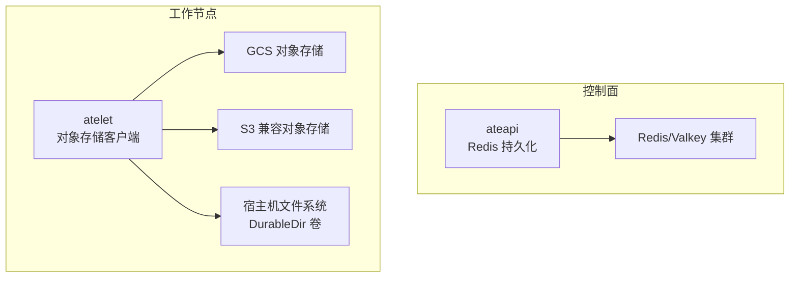
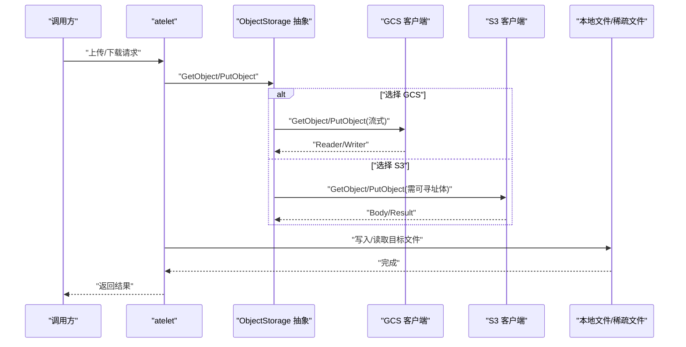
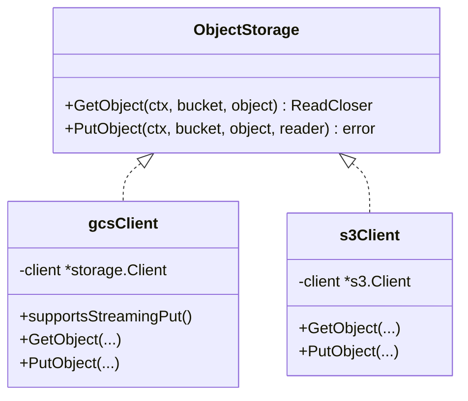
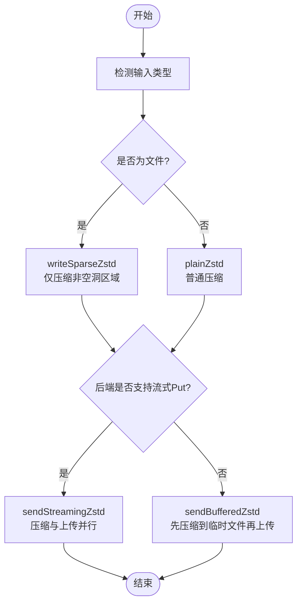
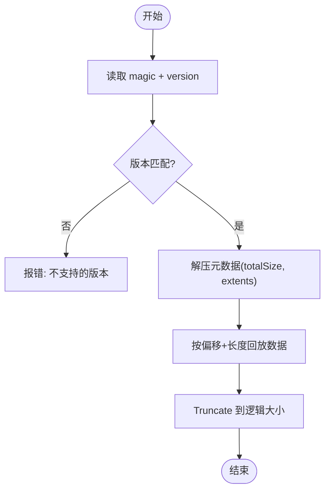
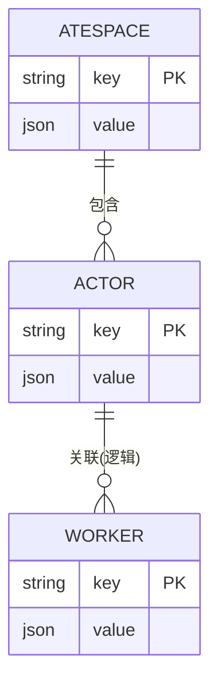
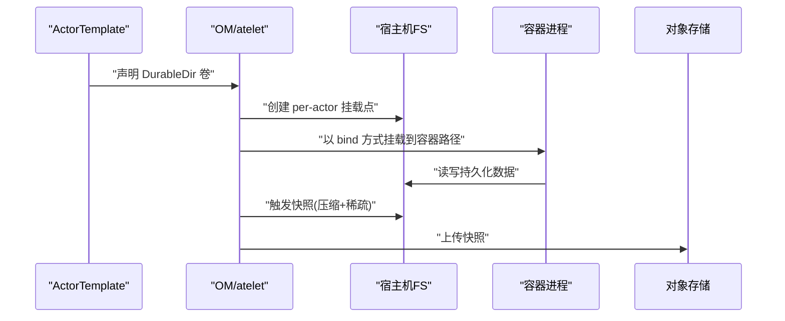
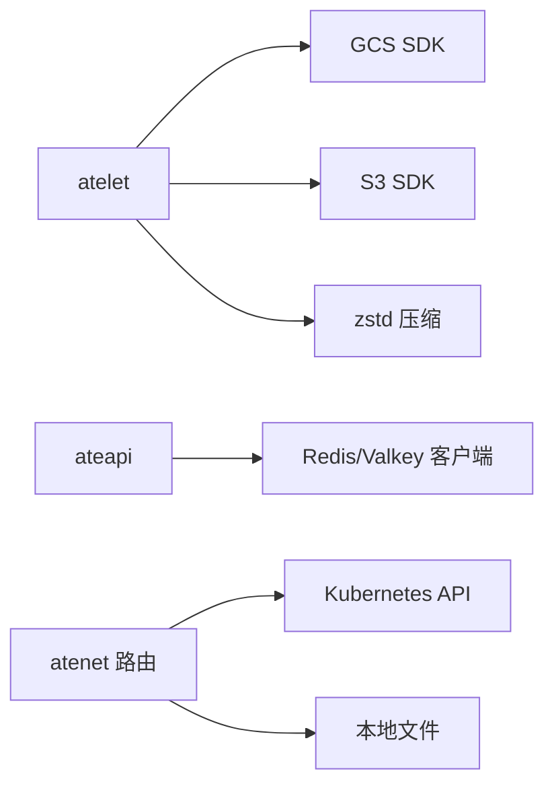

# 存储后端与持久化

<cite>
**本文引用的文件**   
- [cmd/atelet/main.go](file://cmd/atelet/main.go)
- [cmd/atelet/internal/ategcs/gcs.go](file://cmd/atelet/internal/ategcs/gcs.go)
- [cmd/atelet/internal/ategcs/s3.go](file://cmd/atelet/internal/ategcs/s3.go)
- [cmd/atelet/internal/ategcs/objects.go](file://cmd/atelet/internal/ategcs/objects.go)
- [cmd/atelet/internal/ategcs/sparsezstd.go](file://cmd/atelet/internal/ategcs/sparsezstd.go)
- [cmd/ateapi/internal/store/store.go](file://cmd/ateapi/internal/store/store.go)
- [cmd/ateapi/internal/store/ateredis/ateredis.go](file://cmd/ateapi/internal/store/ateredis/ateredis.go)
- [cmd/atenet/internal/router/atstore.go](file://cmd/atenet/internal/router/atstore.go)
- [cmd/atenet/internal/router/atstore_file.go](file://cmd/atenet/internal/router/atstore_file.go)
- [internal/proto/ateletpb/atelet.pb.go](file://internal/proto/ateletpb/atelet.pb.go)
- [internal/ateompath/ateompath.go](file://internal/ateompath/ateompath.go)
- [cmd/atelet/oci_test.go](file://cmd/atelet/oci_test.go)
- [pkg/api/v1alpha1/actortemplate_validation_test.go](file://pkg/api/v1alpha1/actortemplate_validation_test.go)
</cite>

## 目录
1. [简介](#简介)
2. [项目结构](#项目结构)
3. [核心组件](#核心组件)
4. [架构总览](#架构总览)
5. [详细组件分析](#详细组件分析)
6. [依赖关系分析](#依赖关系分析)
7. [性能考虑](#性能考虑)
8. [故障排查指南](#故障排查指南)
9. [结论](#结论)
10. [附录](#附录)

## 简介
本文件聚焦 Agent Substrate 的存储后端与持久化机制，覆盖以下主题：
- GCS 与 S3 对象存储的集成实现与配置方法
- Redis 作为状态存储的作用、数据模型设计与一致性策略
- DurableDir 卷的数据持久化原理与文件系统快照机制
- 增量更新与压缩传输的技术实现（稀疏块 + zstd）
- 存储后端的故障转移与高可用配置建议
- 存储配置选项与安全认证设置
- 存储性能调优与容量规划建议
- 如何选择合适的存储后端并优化存储性能

## 项目结构
与存储相关的代码主要分布在以下模块：
- atelet 服务负责对象存储（GCS/S3）的上传下载、压缩与稀疏格式处理
- ateapi 服务通过 Redis 持久化 Actor/Atespace/Worker 等控制面状态
- atenet 路由侧提供模板来源（Kubernetes 或本地文件），与存储无关但影响运行时资源加载
- 内部路径与协议定义支撑 DurableDir 卷挂载与持久化

图表来源
- [cmd/ateapi/internal/store/ateredis/ateredis.go:76-88](file://cmd/ateapi/internal/store/ateredis/ateredis.go#L76-L88)
- [cmd/atelet/main.go:126-161](file://cmd/atelet/main.go#L126-L161)
- [cmd/atelet/internal/ategcs/gcs.go:27-66](file://cmd/atelet/internal/ategcs/gcs.go#L27-L66)
- [cmd/atelet/internal/ategcs/s3.go:29-58](file://cmd/atelet/internal/ategcs/s3.go#L29-L58)

章节来源
- [cmd/atelet/main.go:126-161](file://cmd/atelet/main.go#L126-L161)
- [cmd/ateapi/internal/store/ateredis/ateredis.go:76-88](file://cmd/ateapi/internal/store/ateredis/ateredis.go#L76-L88)

## 核心组件
- 对象存储抽象接口 ObjectStorage：统一 GetObject/PutObject 能力，屏蔽 GCS/S3 差异
- GCS 客户端 gcsClient：支持流式 PutObject，便于与压缩管道重叠执行
- S3 客户端 s3Client：PutObject 需要可寻址体，走缓冲路径
- 压缩与稀疏格式：sparse-extent + zstd，仅压缩非空洞区域，显著降低网络与磁盘占用
- Redis 持久化层 Persistence：Actor/Atespace/Worker 的状态存储、乐观并发、分页扫描、分布式锁与事件通知

章节来源
- [cmd/atelet/internal/ategcs/objects.go:37-40](file://cmd/atelet/internal/ategcs/objects.go#L37-L40)
- [cmd/atelet/internal/ategcs/gcs.go:27-66](file://cmd/atelet/internal/ategcs/gcs.go#L27-L66)
- [cmd/atelet/internal/ategcs/s3.go:29-58](file://cmd/atelet/internal/ategcs/s3.go#L29-L58)
- [cmd/ateapi/internal/store/store.go:40-118](file://cmd/ateapi/internal/store/store.go#L40-L118)
- [cmd/ateapi/internal/store/ateredis/ateredis.go:76-88](file://cmd/ateapi/internal/store/ateredis/ateredis.go#L76-L88)

## 架构总览
下图展示 atelet 在对象存储上的上传/下载流程，以及 ateapi 对 Redis 的状态读写。

图表来源
- [cmd/atelet/internal/ategcs/objects.go:42-77](file://cmd/atelet/internal/ategcs/objects.go#L42-L77)
- [cmd/atelet/internal/ategcs/gcs.go:35-66](file://cmd/atelet/internal/ategcs/gcs.go#L35-L66)
- [cmd/atelet/internal/ategcs/s3.go:37-58](file://cmd/atelet/internal/ategcs/s3.go#L37-L58)

## 详细组件分析

### 对象存储抽象与客户端
- ObjectStorage 接口定义统一的 GetObject/PutObject 能力
- gcsClient 实现流式 PutObject，允许将压缩输出直接管道到上传通道，避免中间文件
- s3Client 的 PutObject 需要可寻址体，因此上层会先压缩到临时文件再上传

图表来源
- [cmd/atelet/internal/ategcs/objects.go:37-40](file://cmd/atelet/internal/ategcs/objects.go#L37-L40)
- [cmd/atelet/internal/ategcs/gcs.go:27-66](file://cmd/atelet/internal/ategcs/gcs.go#L27-L66)
- [cmd/atelet/internal/ategcs/s3.go:29-58](file://cmd/atelet/internal/ategcs/s3.go#L29-L58)

章节来源
- [cmd/atelet/internal/ategcs/objects.go:37-40](file://cmd/atelet/internal/ategcs/objects.go#L37-L40)
- [cmd/atelet/internal/ategcs/gcs.go:27-66](file://cmd/atelet/internal/ategcs/gcs.go#L27-L66)
- [cmd/atelet/internal/ategcs/s3.go:29-58](file://cmd/atelet/internal/ategcs/s3.go#L29-L58)

### 上传与下载：压缩与稀疏格式
- 上传路径
  - writeContent 自动检测是否为文件：若是则走稀疏格式（仅压缩非空洞区域），否则走普通 zstd
  - sendZstd 根据后端是否支持流式 PutObject 选择：
    - 流式（GCS）：io.Pipe 将压缩与上传并行，无需临时文件
    - 缓冲（S3）：先压缩到临时文件，再 Seek 回起点上传
- 下载路径
  - decodeContent 自动识别 sparseMagic 头：
    - 稀疏格式：按 extent 列表回放，跳过空洞，生成稀疏文件
    - 普通 zstd：逐块写出，若目标是文件则尽量写稀疏（跳过全零块）

图表来源
- [cmd/atelet/internal/ategcs/objects.go:141-181](file://cmd/atelet/internal/ategcs/objects.go#L141-L181)
- [cmd/atelet/internal/ategcs/objects.go:186-251](file://cmd/atelet/internal/ategcs/objects.go#L186-L251)
- [cmd/atelet/internal/ategcs/sparsezstd.go:47-135](file://cmd/atelet/internal/ategcs/sparsezstd.go#L47-L135)

章节来源
- [cmd/atelet/internal/ategcs/objects.go:141-181](file://cmd/atelet/internal/ategcs/objects.go#L141-L181)
- [cmd/atelet/internal/ategcs/objects.go:186-251](file://cmd/atelet/internal/ategcs/objects.go#L186-L251)
- [cmd/atelet/internal/ategcs/sparsezstd.go:47-135](file://cmd/atelet/internal/ategcs/sparsezstd.go#L47-L135)

### 下载解码与稀疏重建
- readSparseZstd 解析稀疏格式版本与元数据，按 extent 回放数据，确保最终文件大小精确且空洞为真实 hole
- copyZstdSparse 在非稀疏路径下也尽量跳过全零块，减少实际写入量

图表来源
- [cmd/atelet/internal/ategcs/sparsezstd.go:137-196](file://cmd/atelet/internal/ategcs/sparsezstd.go#L137-L196)
- [cmd/atelet/internal/ategcs/objects.go:392-428](file://cmd/atelet/internal/ategcs/objects.go#L392-L428)

章节来源
- [cmd/atelet/internal/ategcs/sparsezstd.go:137-196](file://cmd/atelet/internal/ategcs/sparsezstd.go#L137-L196)
- [cmd/atelet/internal/ategcs/objects.go:392-428](file://cmd/atelet/internal/ategcs/objects.go#L392-L428)

### Redis 状态存储与数据模型
- 键空间设计
  - actor:<atespace>:<name> -> JSON 序列化的 Actor
  - worker:<namespace>:<pool-name>:<pod-name> -> JSON 序列化的 Worker
  - atespace:<name> -> JSON 序列化的 Atespace
- 一致性策略
  - 使用 Watch + 事务进行乐观并发控制，版本不匹配返回重试错误
  - 删除操作前置条件校验（如 Actor 必须处于 SUSPENDED/CRASHED）
- 分页与跨分片扫描
  - listPage 基于 SCAN 遍历各主节点，维护 pageToken（分片哈希 + cursor）
- 事件通知
  - Worker 变更通过 Pub/Sub 广播，订阅者收到事件后重放最新状态
- 分布式锁
  - AcquireLock 使用 SETNX + TTL；ReleaseLock 使用 Lua 脚本原子比较并删除

图表来源
- [cmd/ateapi/internal/store/ateredis/ateredis.go:90-106](file://cmd/ateapi/internal/store/ateredis/ateredis.go#L90-L106)
- [cmd/ateapi/internal/store/ateredis/ateredis.go:210-212](file://cmd/ateapi/internal/store/ateredis/ateredis.go#L210-L212)
- [cmd/ateapi/internal/store/ateredis/ateredis.go:630-702](file://cmd/ateapi/internal/store/ateredis/ateredis.go#L630-L702)
- [cmd/ateapi/internal/store/ateredis/ateredis.go:770-792](file://cmd/ateapi/internal/store/ateredis/ateredis.go#L770-L792)

章节来源
- [cmd/ateapi/internal/store/store.go:40-118](file://cmd/ateapi/internal/store/store.go#L40-L118)
- [cmd/ateapi/internal/store/ateredis/ateredis.go:90-106](file://cmd/ateapi/internal/store/ateredis/ateredis.go#L90-L106)
- [cmd/ateapi/internal/store/ateredis/ateredis.go:210-212](file://cmd/ateapi/internal/store/ateredis/ateredis.go#L210-L212)
- [cmd/ateapi/internal/store/ateredis/ateredis.go:630-702](file://cmd/ateapi/internal/store/ateredis/ateredis.go#L630-L702)
- [cmd/ateapi/internal/store/ateredis/ateredis.go:770-792](file://cmd/ateapi/internal/store/ateredis/ateredis.go#L770-L792)

### DurableDir 卷与文件系统快照
- 卷定义与约束
  - 每个 ActorTemplate 最多支持一个 DurableDir 类型卷
  - MountPath 必须是干净的绝对 Unix 路径，禁止相对路径、尾随斜杠、重复斜杠、冒号、.. 组件、NUL/控制字符等
- 运行时挂载
  - 宿主机上为每个 ActorUID 和卷名创建绑定挂载点，容器内以 bind 方式挂载到指定路径
- 快照与恢复
  - 快照采用稀疏格式与 zstd 压缩，结合对象存储进行持久化；恢复时重建稀疏文件，保持逻辑大小与空洞语义

图表来源
- [internal/proto/ateletpb/atelet.pb.go:549-572](file://internal/proto/ateletpb/atelet.pb.go#L549-L572)
- [internal/ateompath/ateompath.go:147-148](file://internal/ateompath/ateompath.go#L147-L148)
- [cmd/atelet/oci_test.go:266-301](file://cmd/atelet/oci_test.go#L266-L301)
- [pkg/api/v1alpha1/actortemplate_validation_test.go:683-909](file://pkg/api/v1alpha1/actortemplate_validation_test.go#L683-L909)

章节来源
- [internal/proto/ateletpb/atelet.pb.go:549-572](file://internal/proto/ateletpb/atelet.pb.go#L549-L572)
- [internal/ateompath/ateompath.go:147-148](file://internal/ateompath/ateompath.go#L147-L148)
- [cmd/atelet/oci_test.go:266-301](file://cmd/atelet/oci_test.go#L266-L301)
- [pkg/api/v1alpha1/actortemplate_validation_test.go:683-909](file://pkg/api/v1alpha1/actortemplate_validation_test.go#L683-L909)

### 配置与环境变量
- 对象存储后端选择
  - ATE_STORAGE_BACKEND：设置为 s3 启用 S3，默认 GCS
- S3 特定配置
  - AWS_S3_USE_PATH_STYLE：true 时使用路径风格端点
  - 其他标准 AWS 环境变量用于认证与区域等
- GCS 认证
  - 默认使用 Workload Identity / ADC（应用默认凭据）

章节来源
- [cmd/atelet/main.go:126-149](file://cmd/atelet/main.go#L126-L149)
- [cmd/atelet/main.go:138-142](file://cmd/atelet/main.go#L138-L142)

## 依赖关系分析
- atelet 依赖对象存储 SDK（GCS/S3）与压缩库（zstd）
- ateapi 依赖 Redis/Valkey 集群客户端，实现状态持久化、事务与事件
- atenet 路由侧从 Kubernetes 或本地文件加载模板，与存储无直接耦合

图表来源
- [cmd/atelet/main.go:126-161](file://cmd/atelet/main.go#L126-L161)
- [cmd/ateapi/internal/store/ateredis/ateredis.go:76-88](file://cmd/ateapi/internal/store/ateredis/ateredis.go#L76-L88)
- [cmd/atenet/internal/router/atstore.go:30-55](file://cmd/atenet/internal/router/atstore.go#L30-L55)
- [cmd/atenet/internal/router/atstore_file.go:32-130](file://cmd/atenet/internal/router/atstore_file.go#L32-L130)

章节来源
- [cmd/atenet/internal/router/atstore.go:30-55](file://cmd/atenet/internal/router/atstore.go#L30-L55)
- [cmd/atenet/internal/router/atstore_file.go:32-130](file://cmd/atenet/internal/router/atstore_file.go#L32-L130)

## 性能考虑
- 压缩级别与并发
  - 上传使用 SpeedFastest 与多核并发，兼顾速度与体积；解码单线程以避免抖动
- 稀疏格式优势
  - 针对内存镜像等“大部分为零”的数据，仅压缩非空洞区域，显著降低 I/O 与带宽
- 上传路径优化
  - GCS 流式上传：压缩与网络 PUT 并行，避免临时文件与额外拷贝
  - S3 缓冲上传：因 SDK 要求可寻址体，先落盘再上传，注意磁盘吞吐
- 下载路径优化
  - 非稀疏路径下仍尝试跳过全零块，减少实际写入
- 分页与扫描
  - Redis 跨分片 SCAN 配合 pageToken，避免一次性拉取大量键

[本节为通用性能指导，不直接分析具体文件]

## 故障排查指南
- 对象存储访问失败
  - 检查 ATE_STORAGE_BACKEND 与 AWS_* 环境变量是否正确
  - 确认 GCS ADC/Workload Identity 权限与 S3 IAM 策略
  - 查看日志中关于获取/上传对象的错误信息
- 压缩/解压异常
  - 确认稀疏格式版本兼容性
  - 检查目标文件权限与空间，尤其是大镜像写入
- Redis 事务冲突
  - 出现重试错误时，客户端应重试；关注版本号不一致导致的失败
- 事件丢失
  - 订阅超时或连接断开后需重新订阅；检查 Pub/Sub 通道可用性

章节来源
- [cmd/atelet/main.go:126-149](file://cmd/atelet/main.go#L126-L149)
- [cmd/ateapi/internal/store/ateredis/ateredis.go:408-466](file://cmd/ateapi/internal/store/ateredis/ateredis.go#L408-L466)
- [cmd/ateapi/internal/store/ateredis/ateredis.go:523-584](file://cmd/ateapi/internal/store/ateredis/ateredis.go#L523-L584)

## 结论
- 对象存储层通过统一接口适配 GCS/S3，结合稀疏+zstd 压缩显著提升快照效率
- Redis 作为状态存储提供强一致的事务与乐观并发控制，并通过 Pub/Sub 实现事件驱动
- DurableDir 卷通过绑定挂载与严格的校验保证持久化安全与可移植性
- 合理选择后端与参数可在不同云环境获得稳定高性能

[本节为总结性内容，不直接分析具体文件]

## 附录

### 配置选项与安全认证
- 环境变量
  - ATE_STORAGE_BACKEND：s3 | 默认 GCS
  - AWS_S3_USE_PATH_STYLE：true/false
  - 其他 AWS 标准环境变量（区域、凭据、端点等）
- 认证
  - GCS：ADC/Workload Identity
  - S3：AWS SDK 标准凭据链（IAM、环境变量、配置文件等）

章节来源
- [cmd/atelet/main.go:126-149](file://cmd/atelet/main.go#L126-L149)
- [cmd/atelet/main.go:138-142](file://cmd/atelet/main.go#L138-L142)

### 高可用与故障转移建议
- Redis
  - 使用集群模式，利用 ForEachMaster 遍历主节点进行扫描与清理
  - 客户端实现重试与退避，处理事务失败与连接中断
- 对象存储
  - 选择具备高可用的云对象存储；必要时配置多区域复制
  - 对于 S3 兼容后端，确保端点与签名行为一致（路径风格）

章节来源
- [cmd/ateapi/internal/store/ateredis/ateredis.go:704-722](file://cmd/ateapi/internal/store/ateredis/ateredis.go#L704-L722)
- [cmd/ateapi/internal/store/ateredis/ateredis.go:299-311](file://cmd/ateapi/internal/store/ateredis/ateredis.go#L299-L311)

### 容量规划与选型建议
- 快照大小
  - 稀疏格式能大幅降低镜像体积，适合内存镜像等高稀疏场景
- 网络与磁盘
  - GCS 流式上传减少磁盘压力；S3 缓冲上传需预留临时空间
- 存储后端选择
  - 优先选择延迟低、吞吐高的对象存储；S3 兼容后端需验证签名与 Content-Length 行为

[本节为通用规划建议，不直接分析具体文件]
