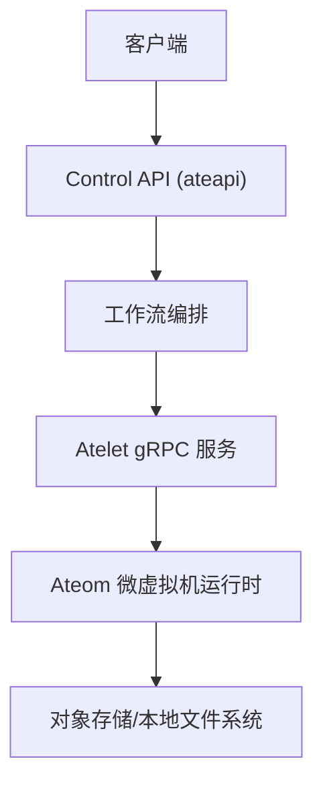
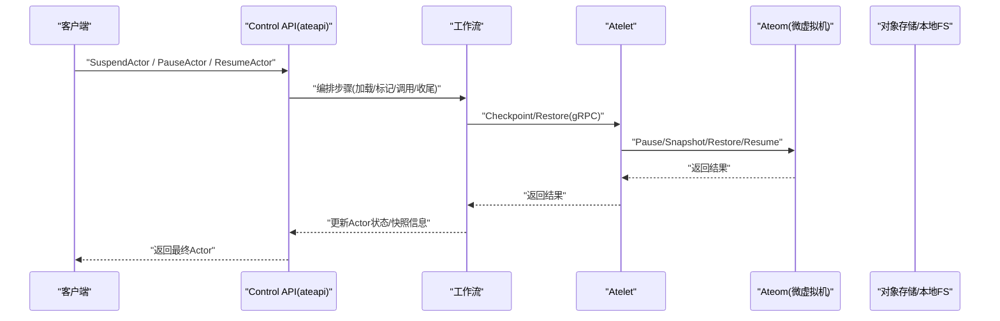
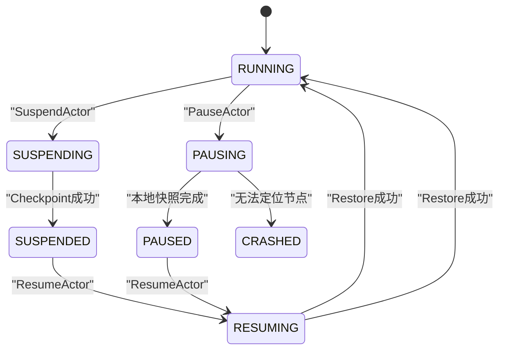
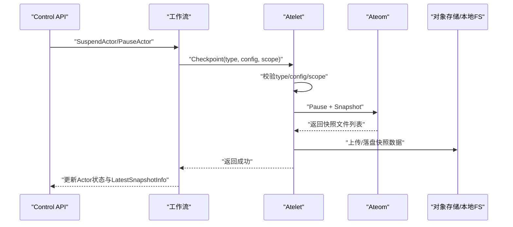
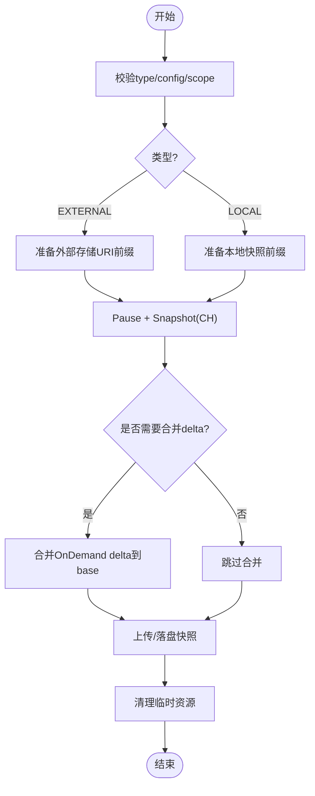
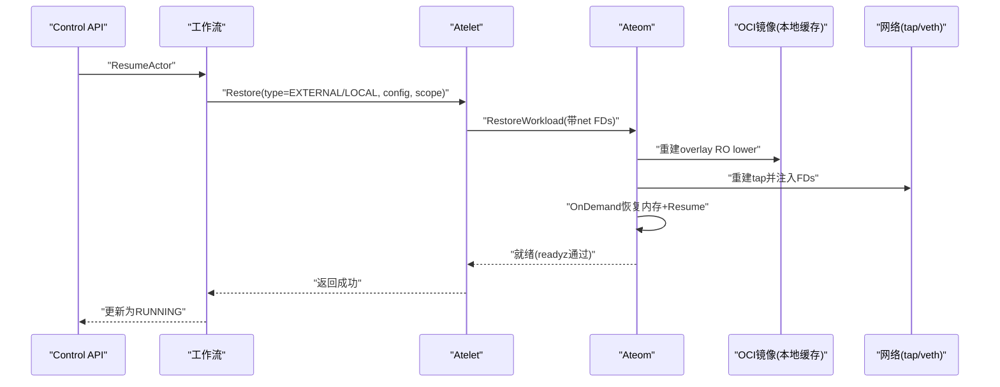
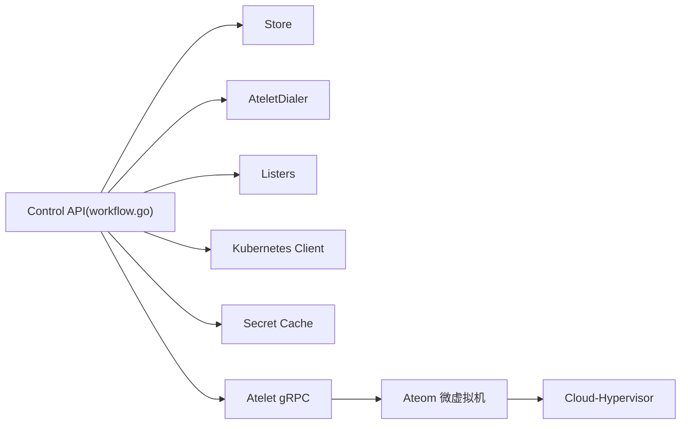

# 快照操作与管理

<cite>
**本文引用的文件**   
- [atelet.proto](file://internal/proto/ateletpb/atelet.proto)
- [ateapi.proto](file://pkg/proto/ateapipb/ateapi.proto)
- [workflow.go](file://cmd/ateapi/internal/controlapi/workflow.go)
- [workflow_suspend.go](file://cmd/ateapi/internal/controlapi/workflow_suspend.go)
- [workflow_pause.go](file://cmd/ateapi/internal/controlapi/workflow_pause.go)
- [checkpoint.go](file://cmd/ateom-microvm/checkpoint.go)
- [restore.go](file://cmd/ateom-microvm/restore.go)
- [main.go](file://cmd/atelet/main.go)
</cite>

## 目录
1. [简介](#简介)
2. [项目结构](#项目结构)
3. [核心组件](#核心组件)
4. [架构总览](#架构总览)
5. [详细组件分析](#详细组件分析)
6. [依赖关系分析](#依赖关系分析)
7. [性能与指标](#性能与指标)
8. [故障排查指南](#故障排查指南)
9. [结论](#结论)
10. [附录：API参考与错误码](#附录api参考与错误码)

## 简介
本文件聚焦于 Agent Substrate 的“快照”能力，围绕 Checkpoint API 的使用、调用流程以及工作流中的暂停（Pause）、挂起（Suspend）与恢复（Resume）进行系统化说明。内容涵盖：
- 快照创建、恢复、删除等核心操作的实现细节
- 工作流状态机与快照的关系
- 异步处理与重试机制
- 性能监控与指标收集建议
- 并发控制与资源管理策略
- 应用侧如何使用快照实现可靠的状态管理与快速恢复

## 项目结构
与快照相关的代码主要分布在以下模块：
- 控制面（ateapi）：对外暴露 Control RPC（如 SuspendActor/PauseActor/ResumeActor），编排工作流并协调 atelet
- 节点代理（atelet）：接收 Checkpoint/Restore 请求，驱动底层运行时完成快照/恢复
- 运行时宿主（ateom-microvm）：基于 Cloud-Hypervisor 执行实际的 VM 级快照与恢复
- 协议定义（proto）：定义 atelet 与 ateapi 之间的消息类型与枚举

图表来源
- [workflow.go:165-254](file://cmd/ateapi/internal/controlapi/workflow.go#L165-L254)
- [workflow_suspend.go:130-168](file://cmd/ateapi/internal/controlapi/workflow_suspend.go#L130-L168)
- [workflow_pause.go:130-165](file://cmd/ateapi/internal/controlapi/workflow_pause.go#L130-L165)
- [atelet.proto:21-33](file://internal/proto/ateletpb/atelet.proto#L21-L33)
- [checkpoint.go:44-154](file://cmd/ateom-microvm/checkpoint.go#L44-L154)
- [restore.go:52-207](file://cmd/ateom-microvm/restore.go#L52-L207)

章节来源
- [workflow.go:165-254](file://cmd/ateapi/internal/controlapi/workflow.go#L165-L254)
- [workflow_suspend.go:130-168](file://cmd/ateapi/internal/controlapi/workflow_suspend.go#L130-L168)
- [workflow_pause.go:130-165](file://cmd/ateapi/internal/controlapi/workflow_pause.go#L130-L165)
- [atelet.proto:21-33](file://internal/proto/ateletpb/atelet.proto#L21-L33)
- [checkpoint.go:44-154](file://cmd/ateom-microvm/checkpoint.go#L44-L154)
- [restore.go:52-207](file://cmd/ateom-microvm/restore.go#L52-L207)

## 核心组件
- Control API（ateapi）
  - 提供 SuspendActor、PauseActor、ResumeActor 等 RPC
  - 通过工作流引擎编排步骤，保证幂等性与前序条件检查
- Atelet（节点代理）
  - 暴露 AteomHerder.Checkpoint/Restore 接口
  - 校验快照类型与作用域，驱动 ateom 完成实际快照/恢复
- Ateom（微虚拟机运行时）
  - 对 Cloud-Hypervisor 发起 Pause/Snapshot/Restore/Resume
  - 负责 overlay rootfs 重建、网络设备重建、日志转发重连等

章节来源
- [ateapi.proto:26-65](file://pkg/proto/ateapipb/ateapi.proto#L26-L65)
- [atelet.proto:21-33](file://internal/proto/ateletpb/atelet.proto#L21-L33)
- [workflow.go:131-163](file://cmd/ateapi/internal/controlapi/workflow.go#L131-L163)

## 架构总览
从外部调用到内部落盘的端到端路径如下：

图表来源
- [workflow.go:165-254](file://cmd/ateapi/internal/controlapi/workflow.go#L165-L254)
- [workflow_suspend.go:130-168](file://cmd/ateapi/internal/controlapi/workflow_suspend.go#L130-L168)
- [workflow_pause.go:130-165](file://cmd/ateapi/internal/controlapi/workflow_pause.go#L130-L165)
- [atelet.proto:21-33](file://internal/proto/ateletpb/atelet.proto#L21-L33)
- [checkpoint.go:44-154](file://cmd/ateom-microvm/checkpoint.go#L44-L154)
- [restore.go:52-207](file://cmd/ateom-microvm/restore.go#L52-L207)

## 详细组件分析

### 工作流与状态机
- 工作流引擎
  - 每个步骤支持 IsComplete 快速跳过、CheckPrerequisite 前置校验、Execute 执行业务逻辑、RetryBackoff 针对持久化冲突的重试
  - 整体流程具备幂等性，失败可安全重试
- 挂起（Suspend）工作流
  - 步骤：加载 Actor -> 标记 SUSPENDING -> 调用 atelet Checkpoint(外部存储) -> 收尾（释放 Worker、写入 LatestSnapshotInfo、清理运行态字段）
- 暂停（Pause）工作流
  - 步骤：加载 Actor -> 标记 PAUSING -> 调用 atelet Checkpoint(本地存储) -> 收尾（释放 Worker、记录 LocalSnapshotInfo 及所在节点、清理运行态字段；若丢失节点名则置为 CRASHED）
- 恢复（Resume）工作流
  - 步骤：加载 Actor -> 分配 Worker -> 调用 atelet Restore -> 收尾（更新为 RUNNING）

图表来源
- [workflow.go:165-254](file://cmd/ateapi/internal/controlapi/workflow.go#L165-L254)
- [workflow_suspend.go:79-104](file://cmd/ateapi/internal/controlapi/workflow_suspend.go#L79-L104)
- [workflow_pause.go:78-103](file://cmd/ateapi/internal/controlapi/workflow_pause.go#L78-L103)

章节来源
- [workflow.go:165-254](file://cmd/ateapi/internal/controlapi/workflow.go#L165-L254)
- [workflow_suspend.go:79-104](file://cmd/ateapi/internal/controlapi/workflow_suspend.go#L79-L104)
- [workflow_pause.go:78-103](file://cmd/ateapi/internal/controlapi/workflow_pause.go#L78-L103)

### Checkpoint API 使用与调用流程
- 入口
  - Control API 的 SuspendActor/PauseActor 触发工作流，最终由 CallAteletSuspendStep/CallAteletPauseStep 调用 atelet.Checkpoint
- 参数要点
  - type：CHECKPOINT_TYPE_EXTERNAL（挂起）或 CHECKPOINT_TYPE_LOCAL（暂停）
  - config：对应 ExternalCheckpointConfiguration 或 LocalCheckpointConfiguration
  - scope：SNAPSHOT_SCOPE_FULL 或 SNAPSHOT_SCOPE_DATA
- 校验
  - atelet 对 type/config/scope 进行校验，非法将直接报错

图表来源
- [workflow_suspend.go:130-168](file://cmd/ateapi/internal/controlapi/workflow_suspend.go#L130-L168)
- [workflow_pause.go:130-165](file://cmd/ateapi/internal/controlapi/workflow_pause.go#L130-L165)
- [atelet.proto:159-208](file://internal/proto/ateletpb/atelet.proto#L159-L208)
- [main.go:939-968](file://cmd/atelet/main.go#L939-L968)

章节来源
- [workflow_suspend.go:130-168](file://cmd/ateapi/internal/controlapi/workflow_suspend.go#L130-L168)
- [workflow_pause.go:130-165](file://cmd/ateapi/internal/controlapi/workflow_pause.go#L130-L165)
- [atelet.proto:159-208](file://internal/proto/ateletpb/atelet.proto#L159-L208)
- [main.go:939-968](file://cmd/atelet/main.go#L939-L968)

### 快照创建（挂起/暂停）实现细节
- 挂起（外部存储）
  - atelet 调用 ateom 的 CheckpointWorkload，生成 portable CH 快照（包含 memory-ranges、config.json、state.json、base-id）
  - 对于 OnDemand 恢复后的再次挂起，会将 delta 合并入 base，确保快照自包含
  - 完成后由 atelet 上传至对象存储，并清理宿主机临时状态
- 暂停（本地存储）
  - 与挂起类似，但目标为本地文件系统路径
  - 收尾阶段记录 LocalSnapshotInfo 与所在节点 VM 列表；若丢失节点名，则将 Actor 置为 CRASHED，避免不可恢复

图表来源
- [checkpoint.go:44-154](file://cmd/ateom-microvm/checkpoint.go#L44-L154)
- [main.go:939-968](file://cmd/atelet/main.go#L939-L968)

章节来源
- [checkpoint.go:44-154](file://cmd/ateom-microvm/checkpoint.go#L44-L154)
- [main.go:939-968](file://cmd/atelet/main.go#L939-L968)

### 快照恢复实现细节
- 恢复流程
  - atelet 根据快照清单选择正确的沙箱版本，拉取快照到本地
  - ateom 重建 overlay RO lower（从本地 OCI bundle）、重写 snapshot 配置中的 socket 路径、重建网络 tap FDs
  - 以 OnDemand 模式恢复内存页，随后 Resume，等待容器 readyz 就绪后恢复日志转发
- 关键约束
  - 同一镜像在不同节点需按相同路径解包以保证一致性
  - 网络与 socket 路径必须重写到当前 VMDir

图表来源
- [restore.go:52-207](file://cmd/ateom-microvm/restore.go#L52-L207)
- [workflow.go:165-194](file://cmd/ateapi/internal/controlapi/workflow.go#L165-L194)

章节来源
- [restore.go:52-207](file://cmd/ateom-microvm/restore.go#L52-L207)
- [workflow.go:165-194](file://cmd/ateapi/internal/controlapi/workflow.go#L165-L194)

### 快照删除
- 当前仓库未提供显式的“删除快照”RPC。通常由上层生命周期管理（如删除 Actor 时清理其快照）或由对象存储/本地存储的保留策略自动清理。
- 注意：在挂起/暂停收尾阶段会清空 InProgressSnapshot 并写入 LatestSnapshotInfo，表示该快照已“落地”。

章节来源
- [workflow_suspend.go:186-247](file://cmd/ateapi/internal/controlapi/workflow_suspend.go#L186-L247)
- [workflow_pause.go:224-266](file://cmd/ateapi/internal/controlapi/workflow_pause.go#L224-L266)

### 工作流中的暂停、恢复、挂起与快照的关系
- 挂起（Suspend）：创建外部快照，释放 Worker，进入 SUSPENDED；后续可从最新外部快照恢复
- 暂停（Pause）：创建本地快照，释放 Worker，进入 PAUSED；恢复时需在同一节点或已知节点上找到本地快照
- 恢复（Resume）：从最新快照（外部或本地）恢复，分配 Worker，进入 RUNNING

章节来源
- [workflow.go:196-254](file://cmd/ateapi/internal/controlapi/workflow.go#L196-L254)
- [workflow_suspend.go:186-247](file://cmd/ateapi/internal/controlapi/workflow_suspend.go#L186-L247)
- [workflow_pause.go:224-266](file://cmd/ateapi/internal/controlapi/workflow_pause.go#L224-L266)

### 异步快照处理与错误重试机制
- 幂等与快速前进
  - 各步骤的 IsComplete 允许在重复调用时快速前进，避免重复执行
- 前置条件校验
  - CheckPrerequisite 严格限制状态迁移边，不满足则返回 FailedPrecondition
- 重试
  - 工作流引擎对持久化冲突（ErrPersistenceRetry）进行指数退避重试
  - 某些步骤无重试（RetryBackoff 为空）
- 错误传播
  - 当 Worker Pod 消失或 checkpoint 失败时，可能将 Actor 置为 CRASHED，防止悬挂状态

章节来源
- [workflow.go:64-129](file://cmd/ateapi/internal/controlapi/workflow.go#L64-L129)
- [workflow_suspend.go:118-129](file://cmd/ateapi/internal/controlapi/workflow_suspend.go#L118-L129)
- [workflow_pause.go:117-128](file://cmd/ateapi/internal/controlapi/workflow_pause.go#L117-L128)

### 并发控制与资源管理策略
- 并发控制
  - 每个 Actor 的操作通过分布式锁（基于 store.AcquireLock）串行化，TTL 与超时上下文配合，避免竞态
- 资源管理
  - 收尾阶段统一释放 Worker 分配、清理网络与进程资源
  - 本地快照场景下，若丢失节点名，主动置为 CRASHED，避免不可恢复

章节来源
- [workflow.go:256-279](file://cmd/ateapi/internal/controlapi/workflow.go#L256-L279)
- [workflow_pause.go:224-266](file://cmd/ateapi/internal/controlapi/workflow_pause.go#L224-L266)

### 在应用中如何使用快照功能
- 典型用法
  - 需要持久化完整状态（含内存）且跨节点迁移：使用 SuspendActor（外部快照）
  - 需要快速冻结并在同节点恢复：使用 PauseActor（本地快照）
  - 需要继续执行：使用 ResumeActor（从最新快照恢复）
- 最佳实践
  - 合理设置 SnapshotScope：Full 捕获内存与卷，Data 仅捕获卷
  - 关注 LatestSnapshotInfo 与 InProgressSnapshot 字段，用于追踪快照位置与进度
  - 结合工作流幂等特性，客户端可实现重试与补偿

章节来源
- [ateapi.proto:117-157](file://pkg/proto/ateapipb/ateapi.proto#L117-L157)
- [workflow_suspend.go:130-168](file://cmd/ateapi/internal/controlapi/workflow_suspend.go#L130-L168)
- [workflow_pause.go:130-165](file://cmd/ateapi/internal/controlapi/workflow_pause.go#L130-L165)

## 依赖关系分析
- 控制面依赖
  - 工作流依赖 store、workerCache、dialer、listers、kubeClient、secretCache
- 节点代理依赖
  - atelet 依赖 ateletpb 生成的 gRPC 客户端与服务端
- 运行时依赖
  - ateom 依赖 Cloud-Hypervisor 与 kata 工具链，负责 VM 级快照/恢复

图表来源
- [workflow.go:131-163](file://cmd/ateapi/internal/controlapi/workflow.go#L131-L163)
- [workflow.go:256-279](file://cmd/ateapi/internal/controlapi/workflow.go#L256-L279)
- [atelet.proto:21-33](file://internal/proto/ateletpb/atelet.proto#L21-L33)

章节来源
- [workflow.go:131-163](file://cmd/ateapi/internal/controlapi/workflow.go#L131-L163)
- [workflow.go:256-279](file://cmd/ateapi/internal/controlapi/workflow.go#L256-L279)
- [atelet.proto:21-33](file://internal/proto/ateletpb/atelet.proto#L21-L33)

## 性能与指标
- 关键耗时点
  - Pause：VM 暂停时间
  - Snapshot：CH 快照写入时间
  - Merge：OnDemand delta 合并时间（仅在特定场景）
  - Teardown：资源清理时间
- 建议指标
  - 快照时长直方图（按 Full/Data 作用域区分）
  - 上传/落盘吞吐与大小
  - 恢复延迟（OnDemand vs Eager）
  - 失败率与原因分布（网络、存储、VMM）
- 观测建议
  - 在工作流步骤埋点（OpenTelemetry Span）
  - 在 ateom 中记录 pause/snapshot/merge/teardown 耗时
  - 在 atelet 中记录上传/下载耗时与错误码

章节来源
- [checkpoint.go:149-153](file://cmd/ateom-microvm/checkpoint.go#L149-L153)
- [workflow.go:64-108](file://cmd/ateapi/internal/controlapi/workflow.go#L64-L108)

## 故障排查指南
- 常见错误
  - 前置条件不满足：FailedPrecondition（状态不在预期）
  - Worker Pod 消失：导致挂起/暂停失败，可能置为 CRASHED
  - 快照类型/作用域非法：atelet 校验失败
- 排查步骤
  - 查看 Actor 状态与 LatestSnapshotInfo/InProgressSnapshot
  - 确认 atelet 是否可达、Worker 是否存活
  - 检查对象存储/本地路径权限与容量
  - 观察工作流步骤 Span 与 ateom 日志

章节来源
- [workflow_suspend.go:118-129](file://cmd/ateapi/internal/controlapi/workflow_suspend.go#L118-L129)
- [workflow_pause.go:117-128](file://cmd/ateapi/internal/controlapi/workflow_pause.go#L117-L128)
- [main.go:939-968](file://cmd/atelet/main.go#L939-L968)

## 结论
Agent Substrate 的快照体系通过“控制面工作流 + 节点代理 + 微虚拟机运行时”的分层设计，实现了跨节点迁移（外部快照）与同节点快速冻结（本地快照）两种能力。工作流幂等、强前置校验与分布式锁保证了可靠性与一致性。建议在业务侧依据需求选择合适的 SnapshotScope 与快照类型，并结合指标与日志完善可观测性与容错策略。

## 附录：API参考与错误码

### Control API（ateapi）
- 相关 RPC
  - SuspendActor：挂起 Actor，创建外部快照
  - PauseActor：暂停 Actor，创建本地快照
  - ResumeActor：从最新快照恢复
- 关键消息
  - Actor.Status：包括 RUNNING、SUSPENDING、SUSPENDED、PAUSING、PAUSED、CRASHED 等
  - SnapshotInfo：ExternalSnapshotInfo 或 LocalSnapshotInfo
  - LocalSnapshotInfo.NodeVmsWithLocalSnapshots：记录拥有本地快照的节点 VM

章节来源
- [ateapi.proto:26-65](file://pkg/proto/ateapipb/ateapi.proto#L26-L65)
- [ateapi.proto:117-157](file://pkg/proto/ateapipb/ateapi.proto#L117-L157)
- [ateapi.proto:67-85](file://pkg/proto/ateapipb/ateapi.proto#L67-L85)

### Atelet API（ateletpb）
- 相关 RPC
  - Checkpoint：创建快照（外部或本地）
  - Restore：从快照恢复
- 关键消息
  - CheckpointRequest.Type：CHECKPOINT_TYPE_EXTERNAL/CHECKPOINT_TYPE_LOCAL
  - CheckpointRequest.Config：ExternalCheckpointConfiguration/LocalCheckpointConfiguration
  - CheckpointRequest.Scope：SNAPSHOT_SCOPE_FULL/SNAPSHOT_SCOPE_DATA

章节来源
- [atelet.proto:21-33](file://internal/proto/ateletpb/atelet.proto#L21-L33)
- [atelet.proto:159-208](file://internal/proto/ateletpb/atelet.proto#L159-L208)

### 错误码与语义
- gRPC codes
  - FailedPrecondition：前置条件不满足（状态机不允许的迁移）
  - Aborted：并发冲突（另一操作正在执行）
  - Unavailable/Unavailable：下游不可用（如 Worker Pod 不存在）
- 自定义错误
  - 可通过 NewGRPCError 携带 Reason 以便上层分类统计

章节来源
- [workflow.go:256-279](file://cmd/ateapi/internal/controlapi/workflow.go#L256-L279)
- [workflow_suspend.go:118-129](file://cmd/ateapi/internal/controlapi/workflow_suspend.go#L118-L129)
- [workflow_pause.go:117-128](file://cmd/ateapi/internal/controlapi/workflow_pause.go#L117-L128)
