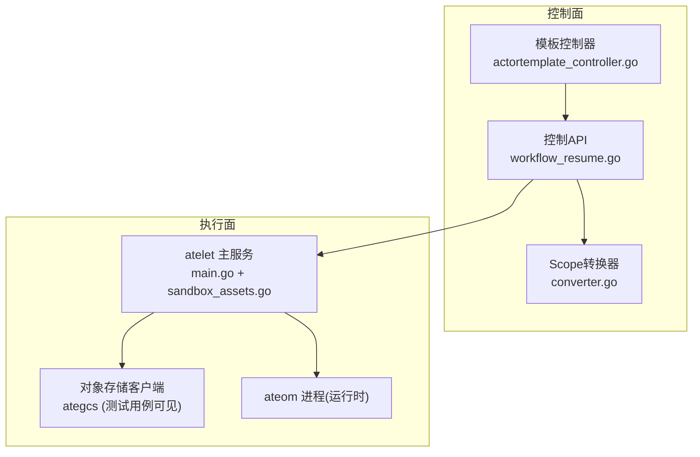
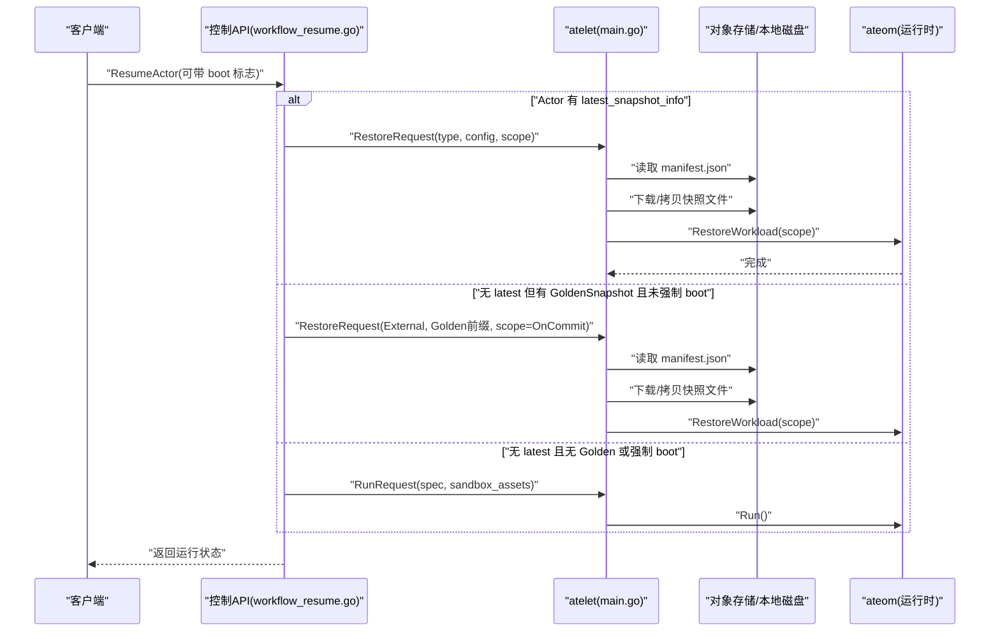
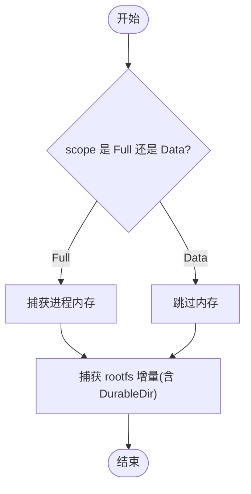
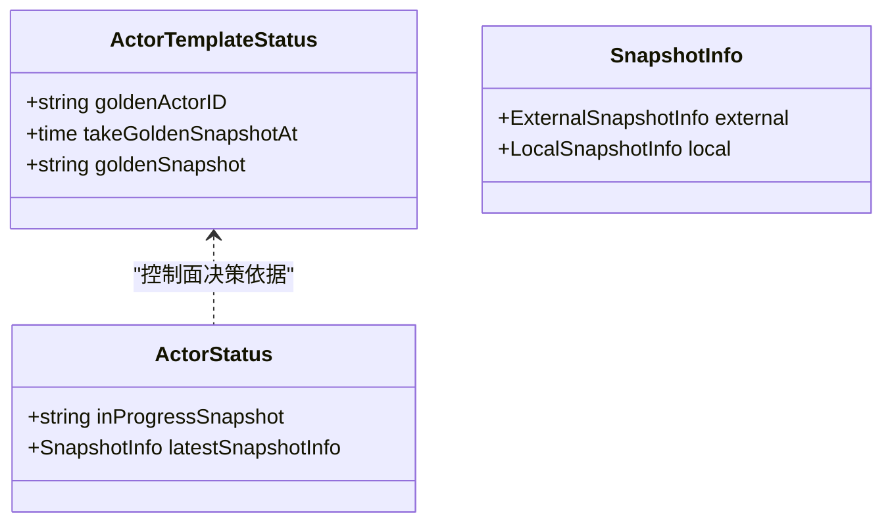
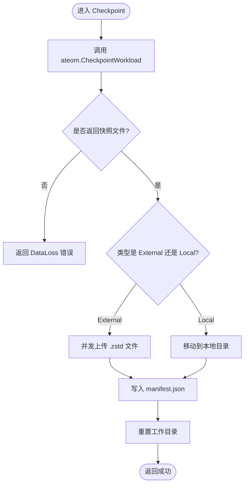
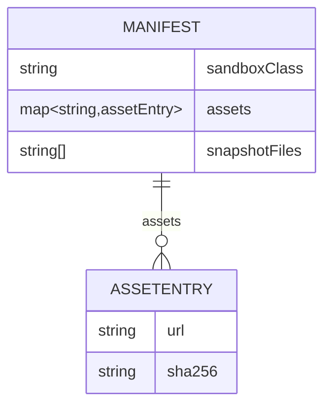
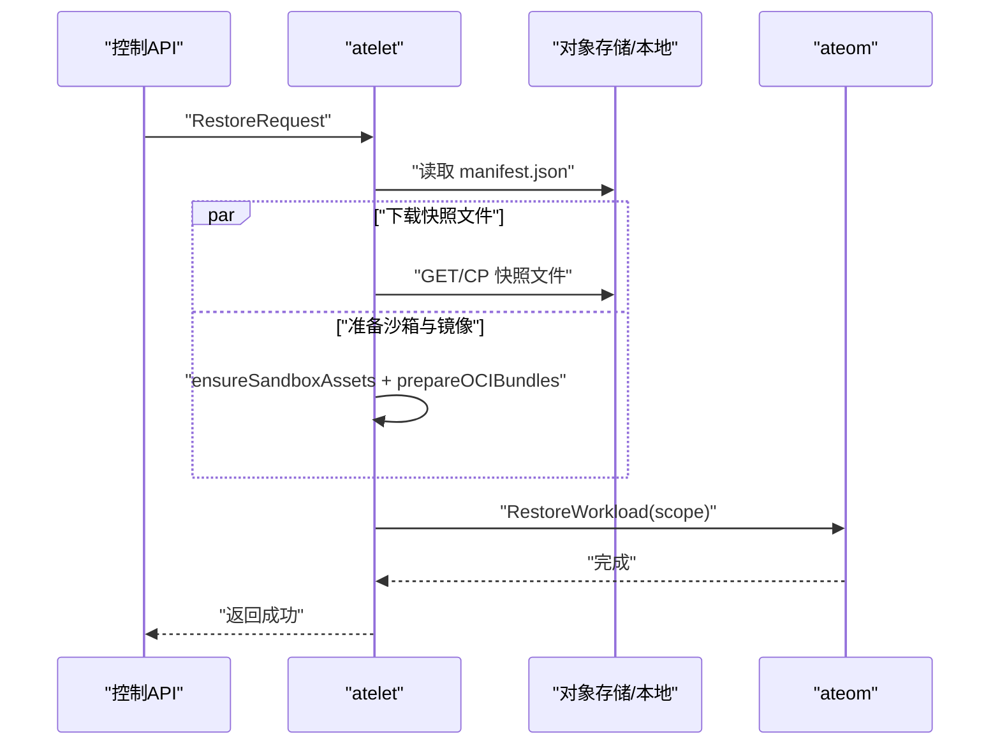
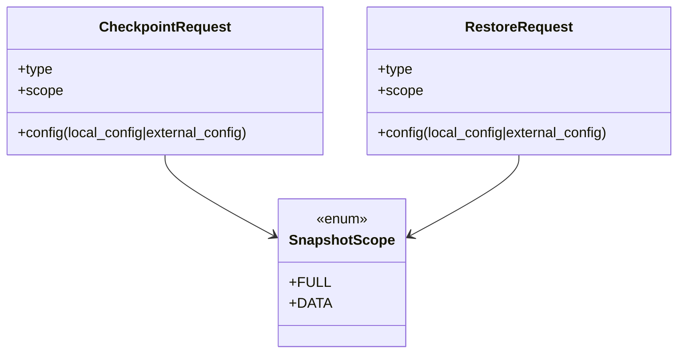
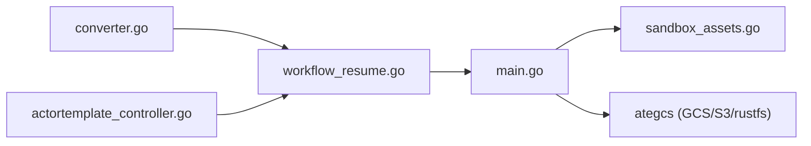

# 快照类型与机制

<cite>
**本文引用的文件**   
- [actortemplate_types.go](file://pkg/api/v1alpha1/actortemplate_types.go)
- [atelet.proto](file://internal/proto/ateletpb/atelet.proto)
- [converter.go](file://cmd/ateapi/internal/controlapi/converter.go)
- [workflow_resume.go](file://cmd/ateapi/internal/controlapi/workflow_resume.go)
- [main.go（atelet）](file://cmd/atelet/main.go)
- [sandbox_assets.go](file://cmd/atelet/sandbox_assets.go)
- [objects_test.go](file://cmd/atelet/internal/ategcs/objects_test.go)
- [validate.go](file://internal/resources/validate.go)
- [actortemplate_controller.go](file://cmd/atecontroller/internal/controllers/actortemplate_controller.go)
</cite>

## 目录
1. [简介](#简介)
2. [项目结构](#项目结构)
3. [核心组件](#核心组件)
4. [架构总览](#架构总览)
5. [详细组件分析](#详细组件分析)
6. [依赖关系分析](#依赖关系分析)
7. [性能考量](#性能考量)
8. [故障排查指南](#故障排查指南)
9. [结论](#结论)
10. [附录](#附录)

## 简介
本文件系统性阐述 Agent Substrate 的快照类型与机制，覆盖 Full 快照与 Data 快照的区别、Golden Snapshot 与 Last Snapshot 的概念与作用、快照生命周期管理（创建、存储、恢复、清理）、元数据与版本管理机制、API 接口定义与参数说明，以及不同快照类型的选择指南与最佳实践。目标是帮助读者在实际应用中高效使用快照实现状态管理。

## 项目结构
快照相关能力横跨控制面与执行面：
- 控制面（API/控制器）：负责 ActorTemplate 的 Golden Snapshot 生成策略、Resume 流程中从 Latest/Golden 快照恢复决策、Scope 转换等。
- 执行面（atelet/ateom）：负责 Checkpoint/Restore 的具体实现、本地与外部存储落盘、沙箱二进制与镜像准备、快照清单（manifest）写入与读取、向后兼容处理等。

**图示来源**
- [workflow_resume.go:390-478](file://cmd/ateapi/internal/controlapi/workflow_resume.go#L390-L478)
- [converter.go:24-35](file://cmd/ateapi/internal/controlapi/converter.go#L24-L35)
- [actortemplate_controller.go:139-169](file://cmd/atecontroller/internal/controllers/actortemplate_controller.go#L139-L169)
- [main.go（atelet）:350-549](file://cmd/atelet/main.go#L350-L549)
- [sandbox_assets.go:38-68](file://cmd/atelet/sandbox_assets.go#L38-L68)

**章节来源**
- [actortemplate_types.go:236-276](file://pkg/api/v1alpha1/actortemplate_types.go#L236-L276)
- [atelet.proto:159-178](file://internal/proto/ateletpb/atelet.proto#L159-L178)

## 核心组件
- 快照范围（SnapshotScope）
  - Full：捕获进程内存及整个 rootfs 增量（含 DurableDir 卷）。
  - Data：仅捕获支持快照的卷内容（当前为 DurableDir），不包含内存与其他 rootfs。
- 快照类型（CheckpointType）
  - Local：保存在节点本地文件系统。
  - External：保存到对象存储（如 GCS/S3/rustfs）。
- 快照配置（SnapshotsConfig）
  - Location：快照存储位置前缀。
  - OnPause：暂停时包含的内容范围（默认 Full）。
  - OnCommit：提交时包含的内容范围（默认 Full，且必须是 onPause 的子集）。
- 快照信息（Actor 状态）
  - latest_snapshot_info：最近一次成功快照的外部或本地信息。
  - in_progress_snapshot：正在进行的快照路径标识。
- 模板级快照（ActorTemplate.Status）
  - golden_snapshot：Golden Snapshot 的对象存储前缀。
  - take_golden_snapshot_at：计划生成时间。
  - golden_actor_id：用于生成 Golden Snapshot 的“黄金实例”ID。

**章节来源**
- [actortemplate_types.go:236-276](file://pkg/api/v1alpha1/actortemplate_types.go#L236-L276)
- [actortemplate_types.go:343-355](file://pkg/api/v1alpha1/actortemplate_types.go#L343-L355)
- [atelet.proto:159-178](file://internal/proto/ateletpb/atelet.proto#L159-L178)

## 架构总览
快照在系统中的关键交互如下：
- 控制面根据 Actor 是否有最新快照决定恢复路径；若无且模板存在 Golden Snapshot，则回退到 Golden Snapshot；否则从头启动。
- 执行面在 Checkpoint 时调用 ateom 获取快照文件列表，随后将文件上传至外部存储或移动到本地目录，并写入 manifest 记录沙箱版本与文件清单。
- Restore 时先拉取 manifest，再并行下载快照文件与准备沙箱二进制/OCI 包，最后调用 ateom 恢复。

**图示来源**
- [workflow_resume.go:390-478](file://cmd/ateapi/internal/controlapi/workflow_resume.go#L390-L478)
- [main.go（atelet）:454-549](file://cmd/atelet/main.go#L454-L549)
- [sandbox_assets.go:38-68](file://cmd/atelet/sandbox_assets.go#L38-L68)

## 详细组件分析

### Full 快照 vs Data 快照
- Full 快照
  - 包含：进程内存 + rootfs 增量（含 DurableDir 卷）。
  - 适用：需要快速冷/热启动、保留完整应用状态的场景。
  - 代价：体积较大、I/O 与网络开销更高。
- Data 快照
  - 包含：仅 DurableDir 卷内容。
  - 适用：频繁提交（onCommit）以持久化业务数据，同时允许内存丢弃以提升吞吐的场景。
  - 优势：体积小、速度快、适合高频提交。

**图示来源**
- [actortemplate_types.go:236-248](file://pkg/api/v1alpha1/actortemplate_types.go#L236-L248)
- [atelet.proto:168-178](file://internal/proto/ateletpb/atelet.proto#L168-L178)

**章节来源**
- [actortemplate_types.go:236-248](file://pkg/api/v1alpha1/actortemplate_types.go#L236-L248)
- [atelet.proto:168-178](file://internal/proto/ateletpb/atelet.proto#L168-L178)

### Golden Snapshot 与 Last Snapshot
- Golden Snapshot（模板级）
  - 由控制器基于“黄金实例”生成，作为该模板所有新实例的首次恢复基线。
  - 生成时机：等待预热后挂起黄金实例，校验其最新快照类型为 External，成功后写入模板状态。
- Last Snapshot（实例级）
  - 每个 Actor 的最新快照信息（external/local），用于常规 Resume。
  - 若不存在且模板存在 Golden Snapshot，则回退到 Golden Snapshot；否则从头启动。

**图示来源**
- [actortemplate_types.go:343-355](file://pkg/api/v1alpha1/actortemplate_types.go#L343-L355)
- [actortemplate_controller.go:139-169](file://cmd/atecontroller/internal/controllers/actortemplate_controller.go#L139-L169)

**章节来源**
- [actortemplate_controller.go:139-169](file://cmd/atecontroller/internal/controllers/actortemplate_controller.go#L139-L169)
- [workflow_resume.go:396-421](file://cmd/ateapi/internal/controlapi/workflow_resume.go#L396-L421)

### 快照生命周期管理

### 创建（Checkpoint）
- 入口：CheckPoint RPC。
- 步骤：
  1) 调用 ateom.CheckpointWorkload 获取快照文件列表。
  2) 根据类型：
     - External：并发上传 zstd 压缩文件至对象存储，最后写入 manifest.json。
     - Local：移动文件到本地目录，写入 manifest.json。
  3) 重置工作目录，返回成功。
- 错误处理：
  - 无快照文件：标记 DataLoss。
  - 上传/移动失败：标记 DataLoss 并崩溃 Actor（不可重试保存）。

**图示来源**
- [main.go（atelet）:350-452](file://cmd/atelet/main.go#L350-L452)

**章节来源**
- [main.go（atelet）:350-452](file://cmd/atelet/main.go#L350-L452)

### 存储与清单（Manifest）
- 清单名称：manifest.json，位于快照目录根。
- 内容：
  - SandboxClass：沙箱类别。
  - Assets：按名称映射的资产条目（URL + SHA256）。
  - SnapshotFiles：快照文件相对名列表（gVisor 的 checkpoint.img 等）。
- 作用：使 Restore 自描述，跨节点/跨版本可复现。

**图示来源**
- [sandbox_assets.go:38-68](file://cmd/atelet/sandbox_assets.go#L38-L68)

**章节来源**
- [sandbox_assets.go:38-68](file://cmd/atelet/sandbox_assets.go#L38-L68)

### 恢复（Restore）
- 入口：Restore RPC。
- 步骤：
  1) 校验请求参数（type/config/scope）。
  2) 读取 manifest.json（外部或本地）。
  3) 并行：
     - 下载/拷贝快照文件。
     - 确保沙箱二进制（按 SHA256 缓存）+ 准备 OCI 包。
  4) 调用 ateom.RestoreWorkload(scope)。
- 兼容性：
  - 支持旧版“纯 zstd 无魔数”格式，自动检测并恢复。

**图示来源**
- [main.go（atelet）:454-549](file://cmd/atelet/main.go#L454-L549)
- [objects_test.go:275-304](file://cmd/atelet/internal/ategcs/objects_test.go#L275-L304)

**章节来源**
- [main.go（atelet）:454-549](file://cmd/atelet/main.go#L454-L549)
- [objects_test.go:275-304](file://cmd/atelet/internal/ategcs/objects_test.go#L275-L304)

### 清理
- 检查点完成后会重置工作目录，避免残留影响后续操作。
- 本地快照目录由上层策略管理（例如按 Actor UID 隔离），代码未内置全局清理任务。

**章节来源**
- [main.go（atelet）:374-379](file://cmd/atelet/main.go#L374-L379)

### 元数据结构与版本管理
- 快照清单（manifest.json）
  - 记录沙箱类、资产集合（URL + SHA256）、快照文件列表。
  - 通过 SHA256 保证资产完整性与可复现性。
- 沙箱资产缓存
  - 按 SHA256 命名缓存，命中即复用，避免重复下载。
  - 支持匿名公开桶与集群私有桶两种访问路径。
- 向后兼容
  - 对旧版“非文件上传路径（纯 zstd，无魔数）”自动检测与恢复。

**章节来源**
- [sandbox_assets.go:91-184](file://cmd/atelet/sandbox_assets.go#L91-L184)
- [objects_test.go:275-304](file://cmd/atelet/internal/ategcs/objects_test.go#L275-L304)

### API 接口定义与参数说明

- CheckpointRequest
  - type：CHECKPOINT_TYPE_LOCAL | CHECKPOINT_TYPE_EXTERNAL
  - config：
    - local_config.snapshot_prefix：本地快照子目录前缀（必填）
    - external_config.snapshot_uri_prefix：对象存储 URI 前缀（必填，需合法）
  - scope：SNAPSHOT_SCOPE_FULL | SNAPSHOT_SCOPE_DATA
- RestoreRequest
  - 字段同 CheckpointRequest，但 restore 不携带沙箱配置，由 manifest 自描述。
- Scope 转换
  - 控制面将 atev1alpha1.SnapshotScope 转换为 ateletpb.SnapshotScope，未知值回退为 Full。

**图示来源**
- [atelet.proto:159-178](file://internal/proto/ateletpb/atelet.proto#L159-L178)
- [converter.go:24-35](file://cmd/ateapi/internal/controlapi/converter.go#L24-L35)

**章节来源**
- [atelet.proto:159-178](file://internal/proto/ateletpb/atelet.proto#L159-L178)
- [converter.go:24-35](file://cmd/ateapi/internal/controlapi/converter.go#L24-L35)
- [main.go（atelet）:894-968](file://cmd/atelet/main.go#L894-L968)
- [validate.go:160-170](file://internal/resources/validate.go#L160-L170)

### 选择指南与最佳实践
- 何时使用 Full 快照
  - 需要快速恢复完整应用状态（内存+文件系统）。
  - 对一致性要求高、容忍更大 I/O 与存储成本。
- 何时使用 Data 快照
  - 高频提交（onCommit）持久化业务数据，内存可丢弃。
  - 追求低延迟与高吞吐，减少网络与存储压力。
- onCommit 与 onPause 的组合
  - onCommit 必须为 onPause 的子集。
  - 常见组合：
    - onPause=Full, onCommit=Full：强一致，慢提交。
    - onPause=Full, onCommit=Data：日常用 Data 快速提交，暂停时用 Full 做最终一致性。
    - onPause=Data, onCommit=Data：极致性能，仅持久化数据。
- Golden Snapshot 的使用
  - 首次启动优先从 Golden Snapshot 恢复，缩短冷启动时间。
  - 可通过 boot 标志跳过 Golden Snapshot 直接从头启动（调试/回滚）。
- 存储与安全性
  - 外部快照 URI 前缀需严格校验（不允许查询串/片段/用户信息等）。
  - 沙箱资产按 SHA256 校验与缓存，防止篡改与重复下载。
- 兼容性
  - 系统支持旧版“纯 zstd”快照格式，无需迁移即可恢复。

**章节来源**
- [actortemplate_types.go:250-276](file://pkg/api/v1alpha1/actortemplate_types.go#L250-L276)
- [workflow_resume.go:396-421](file://cmd/ateapi/internal/controlapi/workflow_resume.go#L396-L421)
- [validate.go:160-170](file://internal/resources/validate.go#L160-L170)
- [objects_test.go:275-304](file://cmd/atelet/internal/ategcs/objects_test.go#L275-L304)

## 依赖关系分析
- 控制面依赖
  - workflow_resume.go 依赖 converter.go 进行 Scope 转换。
  - actortemplate_controller.go 驱动 Golden Snapshot 的生成与状态更新。
- 执行面依赖
  - main.go 依赖 sandbox_assets.go 进行资产管理与清单读写。
  - 对象存储客户端（ategcs）用于上传/下载与兼容处理。

**图示来源**
- [converter.go:24-35](file://cmd/ateapi/internal/controlapi/converter.go#L24-L35)
- [workflow_resume.go:390-478](file://cmd/ateapi/internal/controlapi/workflow_resume.go#L390-L478)
- [actortemplate_controller.go:139-169](file://cmd/atecontroller/internal/controllers/actortemplate_controller.go#L139-L169)
- [main.go（atelet）:350-549](file://cmd/atelet/main.go#L350-L549)
- [sandbox_assets.go:38-68](file://cmd/atelet/sandbox_assets.go#L38-L68)

**章节来源**
- [converter.go:24-35](file://cmd/ateapi/internal/controlapi/converter.go#L24-L35)
- [workflow_resume.go:390-478](file://cmd/ateapi/internal/controlapi/workflow_resume.go#L390-L478)
- [actortemplate_controller.go:139-169](file://cmd/atecontroller/internal/controllers/actortemplate_controller.go#L139-L169)
- [main.go（atelet）:350-549](file://cmd/atelet/main.go#L350-L549)
- [sandbox_assets.go:38-68](file://cmd/atelet/sandbox_assets.go#L38-L68)

## 性能考量
- 并发优化
  - Restore 阶段并行下载快照文件与准备沙箱/镜像，隐藏较长链路延迟。
- 缓存策略
  - 沙箱资产按 SHA256 缓存，避免重复下载；公共桶匿名访问优先，私有桶回退认证客户端。
- 压缩与传输
  - 外部快照文件以 zstd 压缩传输，降低带宽占用。
- 兼容路径
  - 旧版“纯 zstd”路径自动识别，避免额外迁移成本。

[本节为通用指导，不直接分析具体文件]

## 故障排查指南
- 常见错误与定位
  - 无快照文件：Checkpoint 返回 DataLoss，检查 ateom 输出与磁盘空间。
  - 外部存储失败：确认 URI 前缀合法性与权限，查看日志中的 ReasonFaileSaveSnapshot。
  - 本地路径无效：校验 snapshot_prefix 非空与目录权限。
  - 沙箱资产异常：检查 URL 可达性与 SHA256 匹配，确认缓存目录权限。
- 验证工具
  - 单元测试覆盖了 URI 前缀校验、Scope 校验、旧格式兼容等边界情况。

**章节来源**
- [main.go（atelet）:350-379](file://cmd/atelet/main.go#L350-L379)
- [main.go（atelet）:894-968](file://cmd/atelet/main.go#L894-L968)
- [validate.go:160-170](file://internal/resources/validate.go#L160-L170)
- [objects_test.go:275-304](file://cmd/atelet/internal/ategcs/objects_test.go#L275-L304)

## 结论
Agent Substrate 的快照体系通过 Full/Data 双范围、Local/External 双存储、Golden/Last 双基线，提供了灵活而强大的状态管理能力。配合清单自描述与沙箱资产版本锁定，系统在可复现性、兼容性与性能之间取得良好平衡。建议在生产环境中结合业务特性选择合适的 scope 与存储策略，并利用 Golden Snapshot 加速冷启动，辅以合理的 onCommit/onPause 组合实现高效的状态管理。

## 附录
- 术语
  - Golden Snapshot：模板级快照，作为新实例的首次恢复基线。
  - Last Snapshot：实例级最新快照，用于常规恢复。
  - Manifest：快照清单，记录沙箱版本与快照文件列表，使恢复自描述。
- 参考实现路径
  - Scope 定义与约束：[actortemplate_types.go:236-276](file://pkg/api/v1alpha1/actortemplate_types.go#L236-L276)
  - Proto 定义：[atelet.proto:159-178](file://internal/proto/ateletpb/atelet.proto#L159-L178)
  - 控制面恢复逻辑：[workflow_resume.go:390-478](file://cmd/ateapi/internal/controlapi/workflow_resume.go#L390-L478)
  - 执行面 Checkpoint/Restore：[main.go（atelet）:350-549](file://cmd/atelet/main.go#L350-L549)
  - 清单与资产：[sandbox_assets.go:38-68](file://cmd/atelet/sandbox_assets.go#L38-L68)
