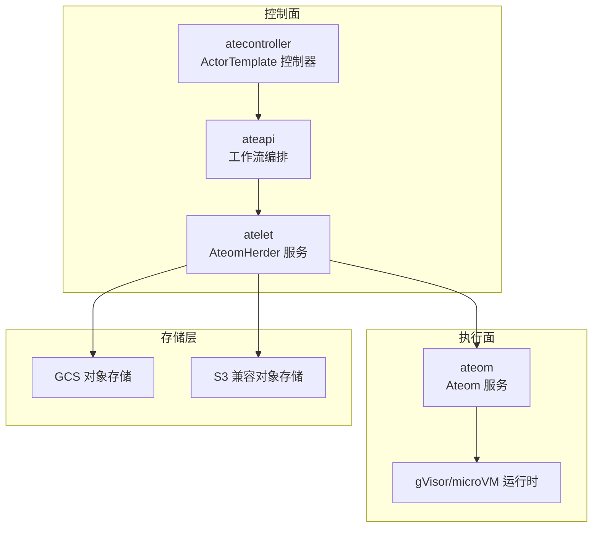
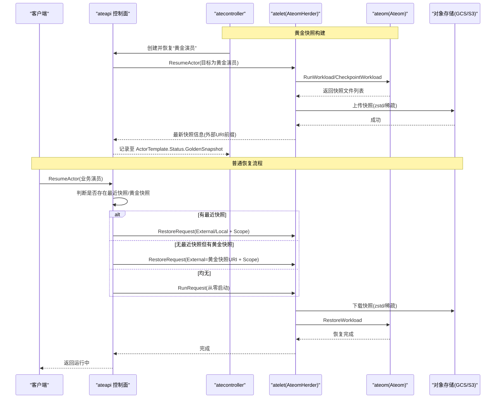
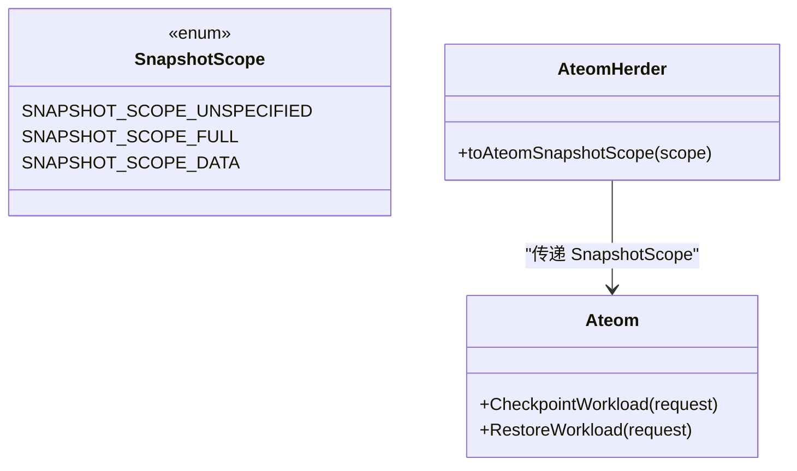
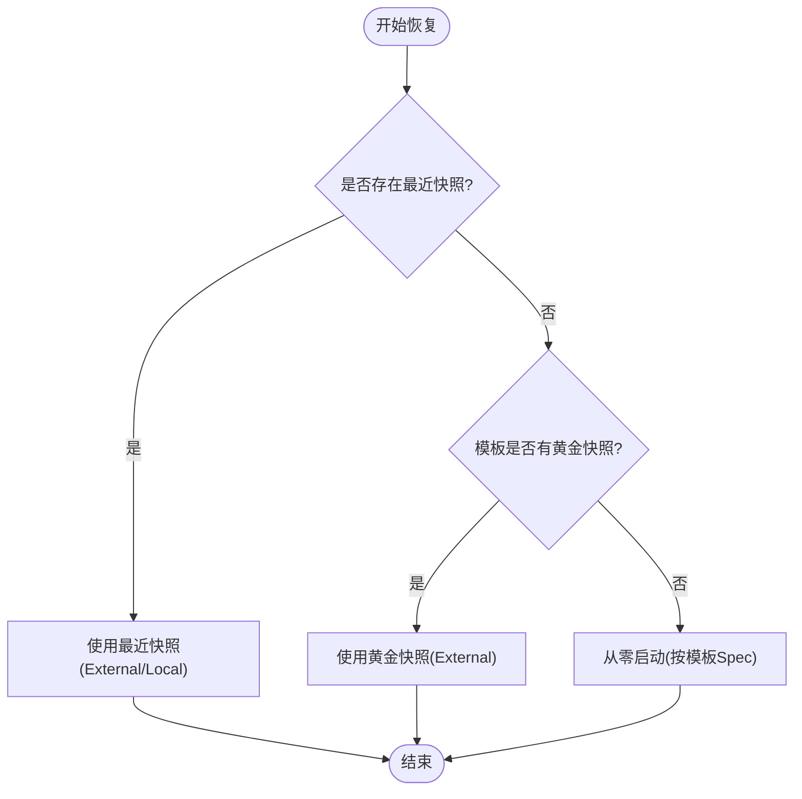
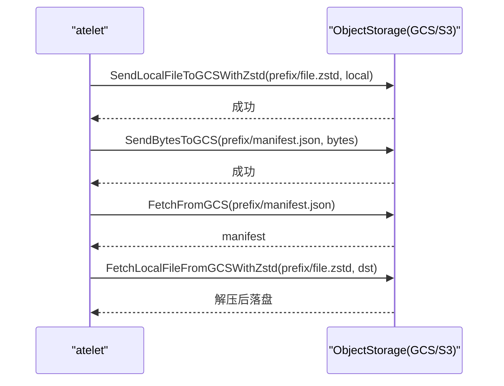
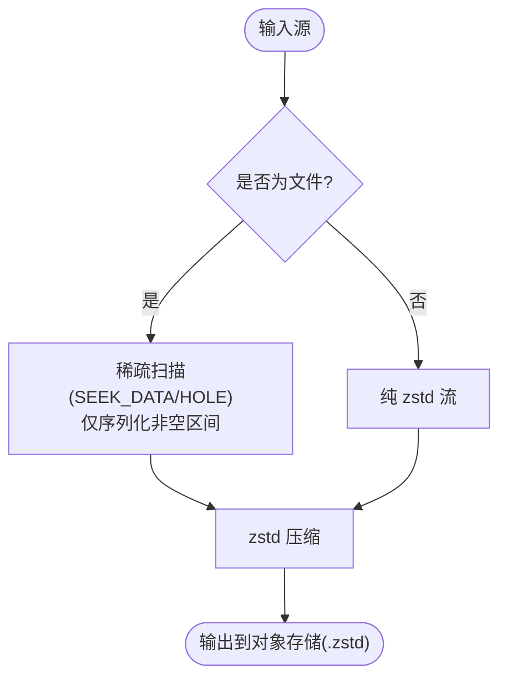
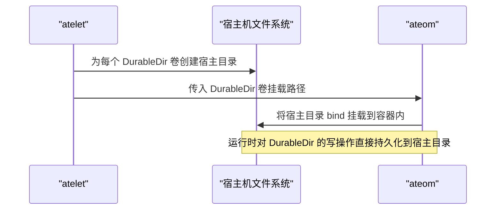
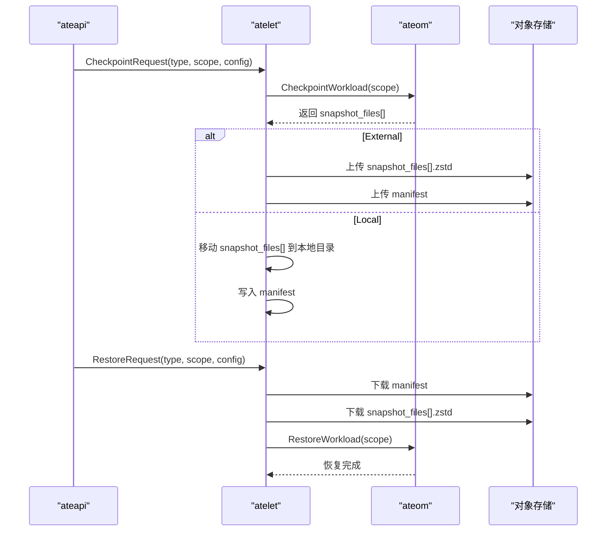
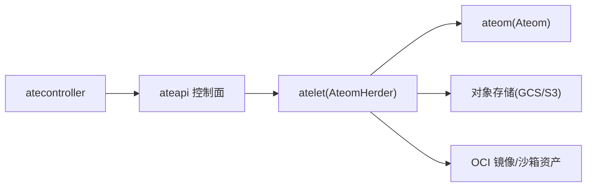

# 状态管理与快照

<cite>
**本文引用的文件**   
- [atelet.proto](file://internal/proto/ateletpb/atelet.proto)
- [ateom.proto](file://internal/proto/ateompb/ateom.proto)
- [main.go](file://cmd/atelet/main.go)
- [converter.go](file://cmd/ateapi/internal/controlapi/converter.go)
- [workflow_resume.go](file://cmd/ateapi/internal/controlapi/workflow_resume.go)
- [actortemplate_controller.go](file://cmd/atecontroller/internal/controllers/actortemplate_controller.go)
- [objects.go](file://cmd/atelet/internal/ategcs/objects.go)
- [sparsezstd.go](file://cmd/atelet/internal/ategcs/sparsezstd.go)
- [validate.go](file://internal/resources/validate.go)
</cite>

## 目录
1. [简介](#简介)
2. [项目结构](#项目结构)
3. [核心组件](#核心组件)
4. [架构总览](#架构总览)
5. [详细组件分析](#详细组件分析)
6. [依赖关系分析](#依赖关系分析)
7. [性能考量](#性能考量)
8. [故障排查指南](#故障排查指南)
9. [结论](#结论)
10. [附录：API与配置参考](#附录api与配置参考)

## 简介
本文件面向 Agent Substrate 的状态管理与快照机制，系统性阐述以下主题：
- 完整内存快照与文件系统状态保存技术
- Full 与 Data 两种快照范围的区别与使用场景
- Golden Snapshot（黄金快照）与 Last Snapshot（最近快照）的概念与作用机制
- 快照的持久化存储方案（GCS 与 S3 对象存储集成）
- 快照的压缩传输与稀疏增量更新机制
- DurableDir 卷的数据持久化原理
- 快照操作的 API 参考与关键配置选项
- 最佳实践与性能优化建议
- 如何使用快照实现快速恢复与数据持久化

## 项目结构
与快照相关的代码主要分布在以下模块：
- 协议定义：AteomHerder（atelet 侧）、Ateom（ateom 侧）的 Checkpoint/Restore 接口与快照范围枚举
- 控制面工作流：Resume/Suspend 流程、Golden Snapshot 构建与选择
- 执行面实现：atelet 对 ateom 的调用、本地/外部快照上传下载、OCI 准备、DurableDir 挂载
- 对象存储与压缩：GCS/S3 客户端封装、zstd 压缩、稀疏格式（sparse-extent）
- 校验与路径：URI 前缀校验、本地路径规划

图表来源
- [atelet.proto:21-33](file://internal/proto/ateletpb/atelet.proto#L21-L33)
- [ateom.proto:34-48](file://internal/proto/ateompb/ateom.proto#L34-L48)
- [workflow_resume.go:349-444](file://cmd/ateapi/internal/controlapi/workflow_resume.go#L349-L444)
- [actortemplate_controller.go:119-182](file://cmd/atecontroller/internal/controllers/actortemplate_controller.go#L119-L182)
- [main.go:126-161](file://cmd/atelet/main.go#L126-L161)

章节来源
- [atelet.proto:21-33](file://internal/proto/ateletpb/atelet.proto#L21-L33)
- [ateom.proto:34-48](file://internal/proto/ateompb/ateom.proto#L34-L48)
- [workflow_resume.go:349-444](file://cmd/ateapi/internal/controlapi/workflow_resume.go#L349-L444)
- [actortemplate_controller.go:119-182](file://cmd/atecontroller/internal/controllers/actortemplate_controller.go#L119-L182)
- [main.go:126-161](file://cmd/atelet/main.go#L126-L161)

## 核心组件
- AteomHerder（atelet）：对外暴露 Checkpoint/Restore/Run 等 RPC；负责协调 ateom 完成快照/恢复、对象存储上传下载、OCI 镜像准备、DurableDir 卷处理。
- Ateom（ateom）：在宿主机内驱动 gVisor/microVM 运行时的实际快照/恢复操作，并返回具体快照文件清单。
- 对象存储层：统一抽象 ObjectStorage，支持 GCS 与 S3；提供 zstd 压缩与稀疏格式读写。
- 控制面工作流：根据 Actor 是否有“最近快照”或模板是否具备“黄金快照”，决定从快照恢复还是从零启动。
- 校验与路径：对快照 URI 前缀进行严格校验，确保后续拼接对象名安全有效。

章节来源
- [atelet.proto:159-178](file://internal/proto/ateletpb/atelet.proto#L159-L178)
- [ateom.proto:97-107](file://internal/proto/ateompb/ateom.proto#L97-L107)
- [main.go:309-452](file://cmd/atelet/main.go#L309-L452)
- [objects.go:136-214](file://cmd/atelet/internal/ategcs/objects.go#L136-L214)
- [validate.go:150-174](file://internal/resources/validate.go#L150-L174)

## 架构总览
下图展示了从控制面到执行面再到对象存储的端到端快照/恢复流程，以及 Golden Snapshot 的生成与复用。

图表来源
- [actortemplate_controller.go:119-182](file://cmd/atecontroller/internal/controllers/actortemplate_controller.go#L119-L182)
- [workflow_resume.go:349-444](file://cmd/ateapi/internal/controlapi/workflow_resume.go#L349-L444)
- [main.go:454-583](file://cmd/atelet/main.go#L454-L583)
- [objects.go:323-368](file://cmd/atelet/internal/ategcs/objects.go#L323-L368)

## 详细组件分析

### 快照范围：Full 与 Data
- Full（完整快照）：捕获进程内存以及相对于 OCI 镜像的完整文件系统差异（包含所有已挂载的 DurableDir 卷）。适用于需要完全可复现状态的冷/热迁移与回滚。
- Data（仅数据快照）：仅捕获支持快照的附加卷内容（当前为 DurableDir 类型），不包含内存与 rootfs 差异。适用于频繁提交数据变更、降低快照体积与网络开销的场景。

图表来源
- [atelet.proto:168-178](file://internal/proto/ateletpb/atelet.proto#L168-L178)
- [ateom.proto:97-107](file://internal/proto/ateompb/ateom.proto#L97-L107)
- [main.go:382-390](file://cmd/atelet/main.go#L382-L390)

章节来源
- [atelet.proto:168-178](file://internal/proto/ateletpb/atelet.proto#L168-L178)
- [ateom.proto:97-107](file://internal/proto/ateompb/ateom.proto#L97-L107)
- [main.go:382-390](file://cmd/atelet/main.go#L382-L390)

### Golden Snapshot 与 Last Snapshot
- Golden Snapshot（黄金快照）：由 ActorTemplate 控制器自动创建并缓存于模板状态中。当业务 Actor 没有自己的最近快照时，可从黄金快照快速恢复，显著缩短冷启动时间。
- Last Snapshot（最近快照）：Actor 自身最近一次暂停/挂起产生的快照，优先用于恢复，保证尽可能接近崩溃前的状态。

图表来源
- [workflow_resume.go:396-444](file://cmd/ateapi/internal/controlapi/workflow_resume.go#L396-L444)
- [actortemplate_controller.go:119-182](file://cmd/atecontroller/internal/controllers/actortemplate_controller.go#L119-L182)

章节来源
- [workflow_resume.go:396-444](file://cmd/ateapi/internal/controlapi/workflow_resume.go#L396-L444)
- [actortemplate_controller.go:119-182](file://cmd/atecontroller/internal/controllers/actortemplate_controller.go#L119-L182)

### 持久化存储：GCS 与 S3 集成
- 后端选择：通过环境变量切换 GCS 或 S3；默认 GCS，设置 ATE_STORAGE_BACKEND=s3 启用 S3。
- 客户端初始化：分别构造匿名 GCS 客户端与认证后的 GCS/S3 客户端，供上传/下载使用。
- 对象命名：以 snapshot_uri_prefix 为根，追加文件名与 .zstd 后缀；manifest 文件用于自描述（包含沙箱版本与快照文件清单）。

图表来源
- [main.go:126-161](file://cmd/atelet/main.go#L126-L161)
- [main.go:422-452](file://cmd/atelet/main.go#L422-L452)
- [main.go:625-643](file://cmd/atelet/main.go#L625-L643)
- [objects.go:136-214](file://cmd/atelet/internal/ategcs/objects.go#L136-L214)
- [objects.go:323-368](file://cmd/atelet/internal/ategcs/objects.go#L323-L368)

章节来源
- [main.go:126-161](file://cmd/atelet/main.go#L126-L161)
- [main.go:422-452](file://cmd/atelet/main.go#L422-L452)
- [main.go:625-643](file://cmd/atelet/main.go#L625-L643)
- [objects.go:136-214](file://cmd/atelet/internal/ategcs/objects.go#L136-L214)
- [objects.go:323-368](file://cmd/atelet/internal/ategcs/objects.go#L323-L368)

### 压缩传输与稀疏增量更新
- 压缩算法：统一采用 zstd，上传时使用最快级别以提升吞吐；下载时并发度受限以降低 CPU 抖动。
- 稀疏格式（sparse-extent）：针对内存镜像等“空洞多”的文件，只读取和压缩非空区间，显著减少 I/O 与网络占用；写入时保留稀疏属性，避免全量分配磁盘空间。
- 向后兼容：旧版纯 zstd 流仍可被正确识别与还原。

图表来源
- [sparsezstd.go:47-62](file://cmd/atelet/internal/ategcs/sparsezstd.go#L47-L62)
- [sparsezstd.go:137-165](file://cmd/atelet/internal/ategcs/sparsezstd.go#L137-L165)
- [objects.go:252-257](file://cmd/atelet/internal/ategcs/objects.go#L252-L257)
- [objects.go:364-368](file://cmd/atelet/internal/ategcs/objects.go#L364-L368)

章节来源
- [sparsezstd.go:47-62](file://cmd/atelet/internal/ategcs/sparsezstd.go#L47-L62)
- [sparsezstd.go:137-165](file://cmd/atelet/internal/ategcs/sparsezstd.go#L137-L165)
- [objects.go:252-257](file://cmd/atelet/internal/ategcs/objects.go#L252-L257)
- [objects.go:364-368](file://cmd/atelet/internal/ategcs/objects.go#L364-L368)

### DurableDir 卷的数据持久化
- 卷类型：VolumeType=DURABLE_DIR，表示该卷需参与快照与恢复。
- 挂载策略：在 prepareOCIBundles 阶段为每个 DurableDir 卷创建宿主目录，并通过注解将宿主目录 bind 挂载进 pause 容器与应用容器，确保运行时可见且可被快照。
- 恢复一致性：每次恢复都会重建身份目录与 DurableDir 目录，确保即使从黄金快照恢复，也能获得正确的 per-actor 标识与卷挂载。

图表来源
- [main.go:665-693](file://cmd/atelet/main.go#L665-L693)
- [main.go:767-790](file://cmd/atelet/main.go#L767-L790)

章节来源
- [main.go:665-693](file://cmd/atelet/main.go#L665-L693)
- [main.go:767-790](file://cmd/atelet/main.go#L767-L790)

### 快照操作流程（Checkpoint/Restore）
- Checkpoint：
  - 解析请求参数与快照范围
  - 调用 ateom.CheckpointWorkload，获取具体快照文件清单
  - 根据类型（External/Local）上传到对象存储或移动到本地目录
  - 写入 manifest（包含沙箱版本与快照文件清单）
- Restore：
  - 读取 manifest（外部或本地）
  - 并行下载快照文件与准备 OCI 镜像/沙箱资产
  - 调用 ateom.RestoreWorkload 完成恢复

图表来源
- [main.go:309-452](file://cmd/atelet/main.go#L309-L452)
- [main.go:454-583](file://cmd/atelet/main.go#L454-L583)
- [atelet.proto:180-235](file://internal/proto/ateletpb/atelet.proto#L180-L235)
- [ateom.proto:109-167](file://internal/proto/ateompb/ateom.proto#L109-L167)

章节来源
- [main.go:309-452](file://cmd/atelet/main.go#L309-L452)
- [main.go:454-583](file://cmd/atelet/main.go#L454-L583)
- [atelet.proto:180-235](file://internal/proto/ateletpb/atelet.proto#L180-L235)
- [ateom.proto:109-167](file://internal/proto/ateompb/ateom.proto#L109-L167)

## 依赖关系分析
- atelet 依赖 ateom 完成底层快照/恢复；依赖对象存储完成持久化；依赖 OCI 镜像拉取与打包。
- 控制面（ateapi/atecontroller）依赖 atelet 与 ateom 的 RPC；依据 Actor 与 ActorTemplate 状态决策恢复路径。
- 对象存储抽象屏蔽了 GCS/S3 差异，便于扩展新的后端。

图表来源
- [workflow_resume.go:349-444](file://cmd/ateapi/internal/controlapi/workflow_resume.go#L349-L444)
- [actortemplate_controller.go:119-182](file://cmd/atecontroller/internal/controllers/actortemplate_controller.go#L119-L182)
- [main.go:126-161](file://cmd/atelet/main.go#L126-L161)

章节来源
- [workflow_resume.go:349-444](file://cmd/ateapi/internal/controlapi/workflow_resume.go#L349-L444)
- [actortemplate_controller.go:119-182](file://cmd/atecontroller/internal/controllers/actortemplate_controller.go#L119-L182)
- [main.go:126-161](file://cmd/atelet/main.go#L126-L161)

## 性能考量
- 并行化：
  - 上传/下载多个快照文件使用并发组，提升吞吐。
  - 恢复时并行下载快照与准备 OCI 镜像/沙箱资产，隐藏较长链路延迟。
- 压缩与稀疏：
  - 使用 zstd 快速模式与合理并发，平衡 CPU 与带宽。
  - 对内存镜像等大空洞文件采用稀疏格式，显著降低 I/O 与网络占用。
- 指标与观测：
  - 记录未压缩快照大小直方图，辅助容量与成本评估。
  - 记录恢复各阶段耗时（下载、解包、ateom 恢复），定位瓶颈。

章节来源
- [main.go:273-307](file://cmd/atelet/main.go#L273-L307)
- [main.go:422-452](file://cmd/atelet/main.go#L422-L452)
- [main.go:514-544](file://cmd/atelet/main.go#L514-L544)
- [objects.go:252-257](file://cmd/atelet/internal/ategcs/objects.go#L252-L257)
- [sparsezstd.go:47-62](file://cmd/atelet/internal/ategcs/sparsezstd.go#L47-L62)

## 故障排查指南
- URI 前缀校验失败：检查 snapshot_uri_prefix 是否包含 scheme、bucket 与 path，且不包含 query/fragment/userinfo 等会被拼接吞掉的组件。
- 对象存储访问错误：确认 ATE_STORAGE_BACKEND 与对应凭据配置（如 AWS 环境变量、GCP ADC）；核对 bucket 权限与路径风格（path-style vs virtual-hosted）。
- 快照不一致：确认 manifest 中的 snapshot_files 与实际对象一致；检查 sparse 格式版本兼容性。
- 恢复慢：观察下载、OCI 解包、ateom 恢复三段耗时；必要时调整并发或开启稀疏格式。

章节来源
- [validate.go:150-174](file://internal/resources/validate.go#L150-L174)
- [main.go:126-161](file://cmd/atelet/main.go#L126-L161)
- [objects.go:323-368](file://cmd/atelet/internal/ategcs/objects.go#L323-L368)
- [main.go:577-582](file://cmd/atelet/main.go#L577-L582)

## 结论
Agent Substrate 的快照体系通过 Full/Data 范围、Golden/Last 快照策略、GCS/S3 对象存储与 zstd 稀疏压缩，实现了高效、可靠的状态持久化与快速恢复。配合 DurableDir 卷的持久化与严格的 URI 校验，系统在可用性、性能与安全性方面达到良好平衡。

## 附录：API与配置参考

### 快照相关 API（RPC）
- AteomHerder（atelet）
  - Checkpoint(CheckpointRequest) -> CheckpointResponse
  - Restore(RestoreRequest) -> RestoreResponse
  - Run(RunRequest) -> RunResponse
- Ateom（ateom）
  - CheckpointWorkload(CheckpointWorkloadRequest) -> CheckpointWorkloadResponse
  - RestoreWorkload(RrestoreWorkloadRequest) -> RestoreWorkloadResponse

章节来源
- [atelet.proto:21-33](file://internal/proto/ateletpb/atelet.proto#L21-L33)
- [atelet.proto:180-235](file://internal/proto/ateletpb/atelet.proto#L180-L235)
- [ateom.proto:34-48](file://internal/proto/ateompb/ateom.proto#L34-L48)
- [ateom.proto:109-167](file://internal/proto/ateompb/ateom.proto#L109-L167)

### 关键配置项与环境变量
- ATE_STORAGE_BACKEND：选择对象存储后端（默认 GCS；设置为 s3 启用 S3）
- AWS_S3_USE_PATH_STYLE：S3 路径风格开关（true/false）
- 其他标准 AWS/GCP 凭据环境变量（由 SDK 自动加载）

章节来源
- [main.go:126-161](file://cmd/atelet/main.go#L126-L161)

### 快照范围映射
- atev1alpha1.SnapshotScope -> ateletpb.SnapshotScope -> ateompb.SnapshotScope
- 未知值默认回退为 Full，以保证最大一致性

章节来源
- [converter.go:24-35](file://cmd/ateapi/internal/controlapi/converter.go#L24-L35)
- [main.go:382-390](file://cmd/atelet/main.go#L382-L390)

### 最佳实践与优化建议
- 选择合适的快照范围：
  - 高频数据变更：优先 Data 范围，减小体积与网络开销。
  - 强一致性要求：使用 Full 范围，确保内存与文件系统一致。
- 利用黄金快照：
  - 为常用模板构建黄金快照，加速新实例冷启动。
  - 若模板容器全部声明 readyz，可跳过预热等待，缩短黄金快照构建时间。
- 对象存储与压缩：
  - 使用稀疏格式上传内存镜像，显著降低 I/O 与带宽。
  - 合理设置并发与 zstd 级别，平衡吞吐与 CPU。
- 监控与排障：
  - 关注快照大小直方图与恢复阶段耗时，持续优化。
  - 严格校验 snapshot_uri_prefix，避免 URL 拼接导致的对象名异常。

章节来源
- [actortemplate_controller.go:195-210](file://cmd/atecontroller/internal/controllers/actortemplate_controller.go#L195-L210)
- [main.go:273-307](file://cmd/atelet/main.go#L273-L307)
- [objects.go:252-257](file://cmd/atelet/internal/ategcs/objects.go#L252-L257)
- [validate.go:150-174](file://internal/resources/validate.go#L150-L174)
