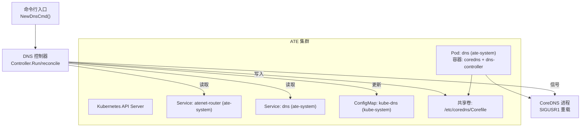
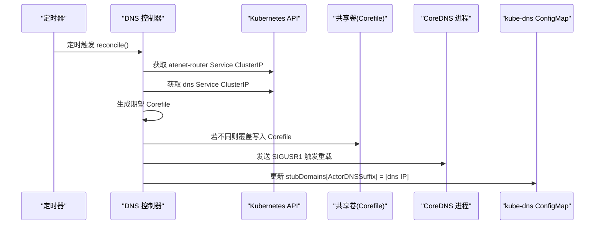
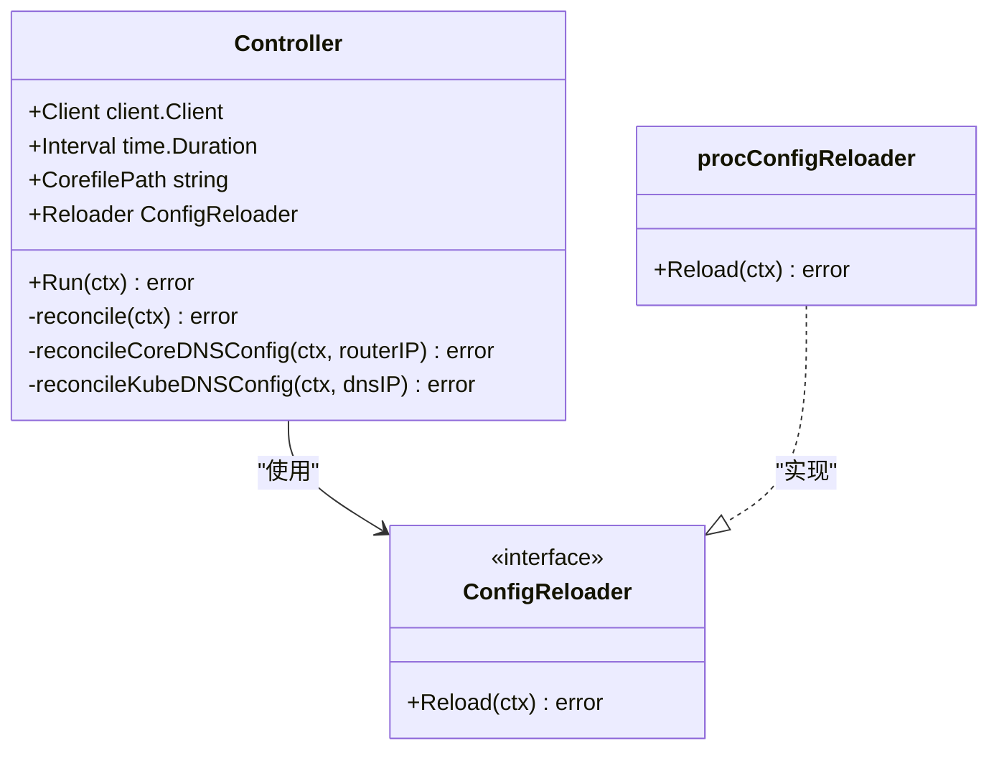
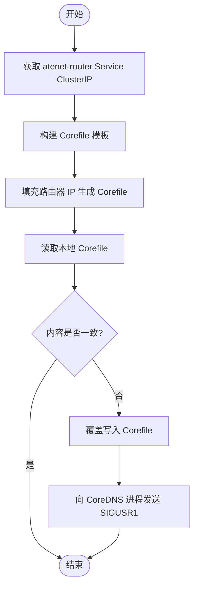
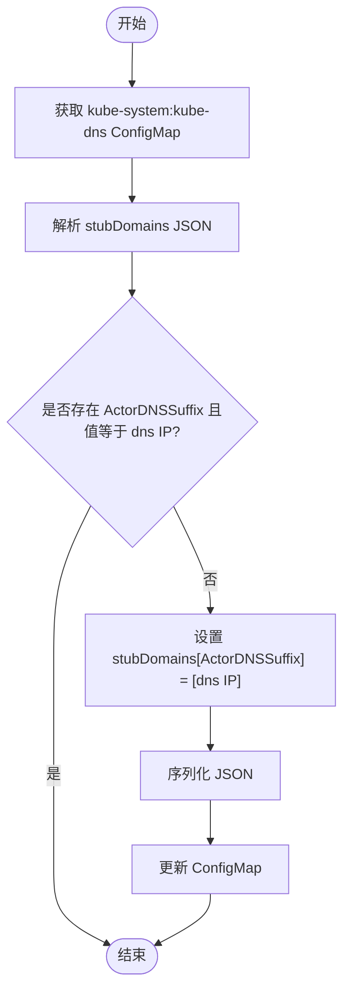
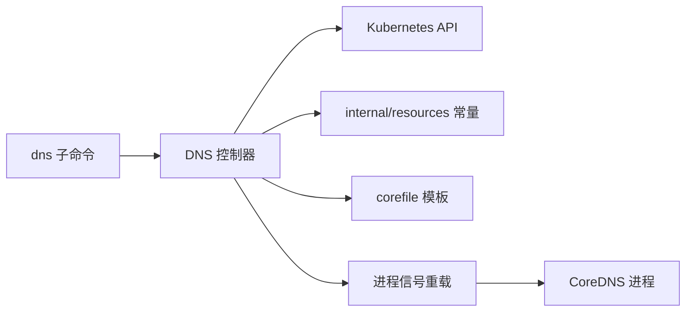

# DNS解析服务

<cite>
**本文引用的文件列表**
- [cmd/atenet/internal/dns.go](file://cmd/atenet/internal/dns.go)
- [cmd/atenet/internal/dns/dns.go](file://cmd/atenet/internal/dns/dns.go)
- [cmd/atenet/internal/dns/corefile.go](file://cmd/atenet/internal/dns/corefile.go)
- [cmd/atenet/internal/dns/README.md](file://cmd/atenet/internal/dns/README.md)
- [internal/resources/actor.go](file://internal/resources/actor.go)
- [manifests/ate-install/atenet-dns.yaml](file://manifests/ate-install/atenet-dns.yaml)
</cite>

## 目录
1. [简介](#简介)
2. [项目结构](#项目结构)
3. [核心组件](#核心组件)
4. [架构总览](#架构总览)
5. [详细组件分析](#详细组件分析)
6. [依赖关系分析](#依赖关系分析)
7. [性能与监控](#性能与监控)
8. [故障排除指南](#故障排除指南)
9. [结论](#结论)
10. [附录：DNS配置示例](#附录dns配置示例)

## 简介
本文件面向 Agent Substrate 的 DNS 解析服务，重点阐述 CoreDNS 控制器的实现原理、Corefile 的动态生成与更新机制、kube-dns stub 域名的配置方式（为 ate-system 命名空间设置自定义 DNS 服务器）、进程间通信以信号通知 CoreDNS 重载配置，以及相关的配置示例与排障方法。

## 项目结构
DNS 相关代码位于 atenet 子命令内部，主要包含以下模块：
- 控制器入口与参数绑定：负责初始化 Kubernetes 客户端、启动周期性 reconcile 循环
- DNS 控制器：读取集群 Service IP、生成并写入 Corefile、更新 kube-dns ConfigMap、通过信号触发 CoreDNS 重载
- Corefile 模板：根据资源命名规则与域名后缀动态构建 CoreDNS 配置
- 资源常量与工具：定义 Actor DNS 后缀与名称校验正则
- 部署清单：提供 CoreDNS Deployment、Service、RBAC 与共享卷挂载等

图表来源
- [cmd/atenet/internal/dns.go:42-107](file://cmd/atenet/internal/dns.go#L42-L107)
- [cmd/atenet/internal/dns/dns.go:50-117](file://cmd/atenet/internal/dns/dns.go#L50-L117)
- [manifests/ate-install/atenet-dns.yaml:74-176](file://manifests/ate-install/atenet-dns.yaml#L74-L176)

章节来源
- [cmd/atenet/internal/dns.go:42-107](file://cmd/atenet/internal/dns.go#L42-L107)
- [cmd/atenet/internal/dns/dns.go:50-117](file://cmd/atenet/internal/dns/dns.go#L50-L117)
- [manifests/ate-install/atenet-dns.yaml:74-176](file://manifests/ate-install/atenet-dns.yaml#L74-L176)

## 核心组件
- 控制器入口与参数
  - 提供 dns 子命令，支持日志级别、kubeconfig、reconcile 间隔、Corefile 路径等参数
  - 初始化 Kubernetes 客户端并创建 Controller 实例，启动 Run 循环
- DNS 控制器
  - 周期执行 reconcile：获取 atenet-router 与 dns 服务的 ClusterIP
  - 生成期望的 Corefile 并与磁盘对比，必要时覆盖写入并触发 CoreDNS 重载
  - 同步 kube-dns ConfigMap 的 stubDomains，将 actors.resources.substrate.ate.dev 指向 dns 服务 IP
- Corefile 模板
  - 基于 Actor 命名正则与 DNS 后缀，构造 template IN A 规则，匹配 <actor>.<atespace>.actors.resources.substrate.ate.dev
  - 启用 log、errors、health、ready、reload 插件
- 资源常量
  - 定义 ActorDNSSuffix 与 ResourceNameRegexPattern，用于统一命名规范与 DNS 后缀

章节来源
- [cmd/atenet/internal/dns.go:42-107](file://cmd/atenet/internal/dns.go#L42-L107)
- [cmd/atenet/internal/dns/dns.go:42-117](file://cmd/atenet/internal/dns/dns.go#L42-L117)
- [cmd/atenet/internal/dns/corefile.go:32-64](file://cmd/atenet/internal/dns/corefile.go#L32-L64)
- [internal/resources/actor.go:22-39](file://internal/resources/actor.go#L22-L39)

## 架构总览
DNS 控制器在 ate-system 命名空间内运行，作为 Sidecar 与 CoreDNS 共享同一进程命名空间与空目录卷，从而能够：
- 直接读写 Corefile
- 通过 /proc 查找 coredns 进程 PID 并向其发送 SIGUSR1 信号，触发热重载
- 同时维护 kube-system:kube-dns 的 stubDomains，使集群 DNS 将特定后缀请求转发到 ate-system:dns 服务

图表来源
- [cmd/atenet/internal/dns/dns.go:50-117](file://cmd/atenet/internal/dns/dns.go#L50-L117)
- [cmd/atenet/internal/dns/dns.go:119-141](file://cmd/atenet/internal/dns/dns.go#L119-L141)
- [cmd/atenet/internal/dns/dns.go:143-189](file://cmd/atenet/internal/dns/dns.go#L143-L189)
- [cmd/atenet/internal/dns/dns.go:202-221](file://cmd/atenet/internal/dns/dns.go#L202-L221)

## 详细组件分析

### DNS 控制器类图

图表来源
- [cmd/atenet/internal/dns/dns.go:42-48](file://cmd/atenet/internal/dns/dns.go#L42-L48)
- [cmd/atenet/internal/dns/dns.go:191-221](file://cmd/atenet/internal/dns/dns.go#L191-L221)

章节来源
- [cmd/atenet/internal/dns/dns.go:42-117](file://cmd/atenet/internal/dns/dns.go#L42-L117)
- [cmd/atenet/internal/dns/dns.go:191-221](file://cmd/atenet/internal/dns/dns.go#L191-L221)

### Corefile 动态生成流程

图表来源
- [cmd/atenet/internal/dns/dns.go:119-141](file://cmd/atenet/internal/dns/dns.go#L119-L141)
- [cmd/atenet/internal/dns/corefile.go:32-64](file://cmd/atenet/internal/dns/corefile.go#L32-L64)

章节来源
- [cmd/atenet/internal/dns/dns.go:119-141](file://cmd/atenet/internal/dns/dns.go#L119-L141)
- [cmd/atenet/internal/dns/corefile.go:32-64](file://cmd/atenet/internal/dns/corefile.go#L32-L64)

### kube-dns stub 域名同步流程

图表来源
- [cmd/atenet/internal/dns/dns.go:143-189](file://cmd/atenet/internal/dns/dns.go#L143-L189)

章节来源
- [cmd/atenet/internal/dns/dns.go:143-189](file://cmd/atenet/internal/dns/dns.go#L143-L189)

### 进程间通信与信号重载
- 控制器通过扫描 /proc 找到名为 coredns 的进程 PID
- 使用系统调用向其发送 SIGUSR1 信号，CoreDNS 捕获该信号后热重载 Corefile
- 该机制无需重启 CoreDNS，保证低延迟的配置生效

章节来源
- [cmd/atenet/internal/dns/dns.go:202-221](file://cmd/atenet/internal/dns/dns.go#L202-L221)
- [cmd/atenet/internal/dns/dns.go:223-252](file://cmd/atenet/internal/dns/dns.go#L223-L252)

### DNS 记录生命周期管理说明
- 当前实现采用“通配式”模板匹配策略：对符合 <actor>.<atespace>.actors.resources.substrate.ate.dev 的所有 A 查询，均返回路由器的 ClusterIP
- 因此不存在按 Actor 创建/删除事件去增删具体 DNS 记录的逻辑；所有匹配的域名均由 CoreDNS 模板即时响应
- 如需更细粒度的生命周期管理（例如仅对活跃 Actor 返回 A 记录），可在模板层或上游数据源引入状态检查，但当前仓库未实现该能力

章节来源
- [cmd/atenet/internal/dns/corefile.go:42-50](file://cmd/atenet/internal/dns/corefile.go#L42-L50)
- [cmd/atenet/internal/dns/README.md:1-37](file://cmd/atenet/internal/dns/README.md#L1-L37)

## 依赖关系分析
- 控制器依赖 Kubernetes Client-Go 访问 Service 与 ConfigMap
- 依赖 internal/resources 提供的 Actor 命名正则与 DNS 后缀常量
- 通过共享卷与 CoreDNS 进程同处一个 Pod，具备文件系统与进程信号能力
- 部署清单定义了 RBAC 权限，允许在 ate-system 与 kube-system 命名空间读写所需资源

图表来源
- [cmd/atenet/internal/dns.go:42-107](file://cmd/atenet/internal/dns.go#L42-L107)
- [cmd/atenet/internal/dns/dns.go:42-117](file://cmd/atenet/internal/dns/dns.go#L42-L117)
- [internal/resources/actor.go:22-39](file://internal/resources/actor.go#L22-L39)
- [cmd/atenet/internal/dns/corefile.go:32-64](file://cmd/atenet/internal/dns/corefile.go#L32-L64)

章节来源
- [cmd/atenet/internal/dns.go:42-107](file://cmd/atenet/internal/dns.go#L42-L107)
- [cmd/atenet/internal/dns/dns.go:42-117](file://cmd/atenet/internal/dns/dns.go#L42-L117)
- [internal/resources/actor.go:22-39](file://internal/resources/actor.go#L22-L39)
- [cmd/atenet/internal/dns/corefile.go:32-64](file://cmd/atenet/internal/dns/corefile.go#L32-L64)

## 性能与监控
- CoreDNS 启用了 health 与 ready 端点，便于探针与外部监控系统采集健康与就绪状态
- 控制器周期性 reconcile，可通过调整 interval 平衡实时性与开销
- 建议结合 Prometheus/Grafana 采集 CoreDNS 指标（如 query 计数、错误率、延迟）与控制器日志，评估整体性能

章节来源
- [cmd/atenet/internal/dns/corefile.go:36-40](file://cmd/atenet/internal/dns/corefile.go#L36-L40)
- [manifests/ate-install/atenet-dns.yaml:127-144](file://manifests/ate-install/atenet-dns.yaml#L127-L144)

## 故障排除指南
- 无法找到 atenet-router 或 dns Service
  - 现象：控制器日志提示等待 Service 可用
  - 排查：确认 Service 已创建且分配了 ClusterIP
- kube-dns ConfigMap 不存在
  - 现象：跳过 stub 域名配置
  - 排查：确认 GKE 环境存在 kube-system:kube-dns ConfigMap
- Corefile 未更新或未生效
  - 现象：CoreDNS 仍返回旧配置
  - 排查：确认共享卷路径正确、控制器有写权限、CoreDNS 进程可被找到并收到 SIGUSR1
- 进程信号失败
  - 现象：找不到 coredns 进程或发送信号失败
  - 排查：确认 shareProcessNamespace 已启用、CoreDNS 容器名与进程名一致、权限足够

章节来源
- [cmd/atenet/internal/dns/dns.go:71-117](file://cmd/atenet/internal/dns/dns.go#L71-L117)
- [cmd/atenet/internal/dns/dns.go:143-189](file://cmd/atenet/internal/dns/dns.go#L143-L189)
- [cmd/atenet/internal/dns/dns.go:202-221](file://cmd/atenet/internal/dns/dns.go#L202-L221)
- [manifests/ate-install/atenet-dns.yaml:92-157](file://manifests/ate-install/atenet-dns.yaml#L92-L157)

## 结论
DNS 控制器通过“模板化 Corefile + 进程信号重载 + kube-dns stub 域名同步”的组合方案，实现了按需将 <actor>.<atespace>.actors.resources.substrate.ate.dev 解析至路由器地址的能力。该设计简洁可靠，适合大规模 Actor 场景下的轻量级 DNS 接入。

## 附录：DNS配置示例
- 部署清单位置：atenet-dns.yaml
  - 包含 ServiceAccount、Role/RoleBinding、Deployment（含 initContainer 与两个容器）、Service 等
  - 关键要点：
    - 共享卷挂载 /etc/coredns
    - CoreDNS 容器暴露 53 UDP/TCP
    - dns-controller 容器以 dns 子命令运行，指定 --corefile-path
- Corefile 模板要点：
  - 监听端口 53
  - 启用 log、errors、health、ready、reload
  - 使用 template IN A 匹配 <actor>.<atespace>.actors.resources.substrate.ate.dev，answer 返回路由器 IP
- kube-dns stub 域名：
  - 将 actors.resources.substrate.ate.dev 映射到 ate-system:dns 的 ClusterIP

章节来源
- [manifests/ate-install/atenet-dns.yaml:74-176](file://manifests/ate-install/atenet-dns.yaml#L74-L176)
- [cmd/atenet/internal/dns/corefile.go:32-64](file://cmd/atenet/internal/dns/corefile.go#L32-L64)
- [cmd/atenet/internal/dns/README.md:1-37](file://cmd/atenet/internal/dns/README.md#L1-L37)
