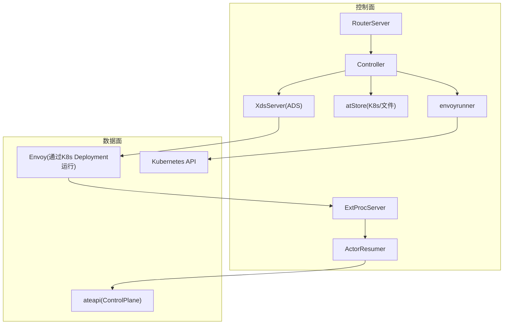
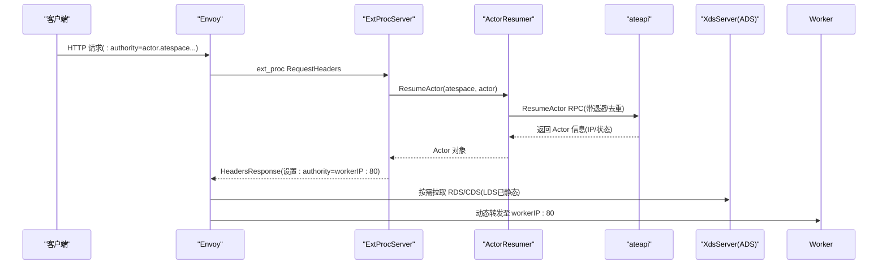
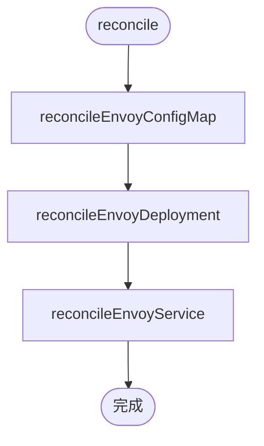
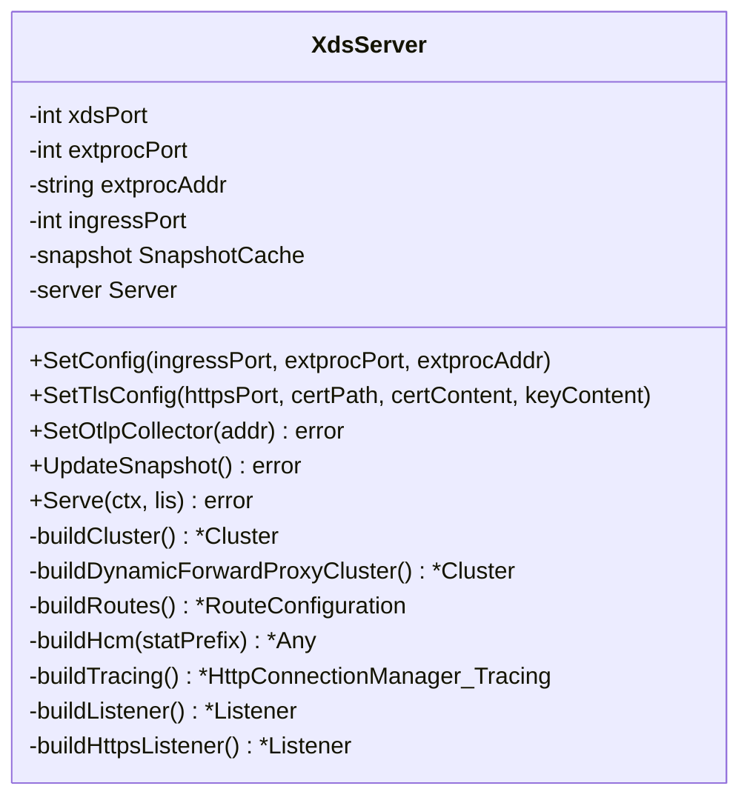
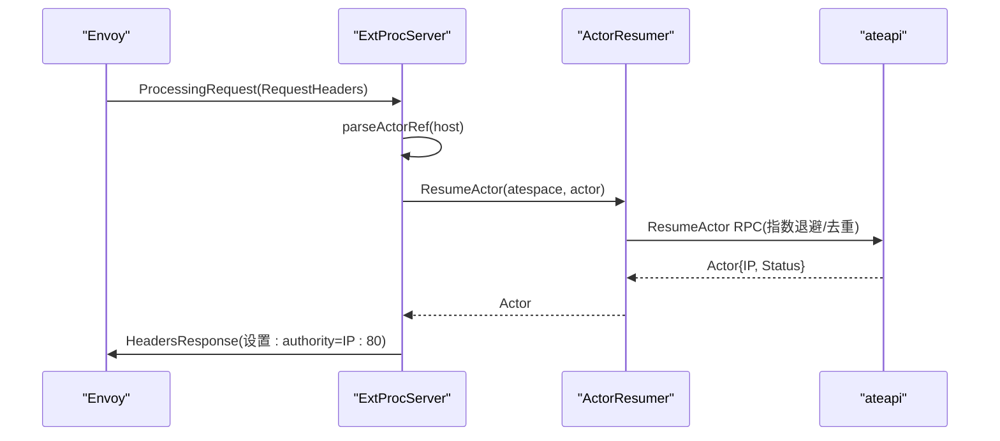
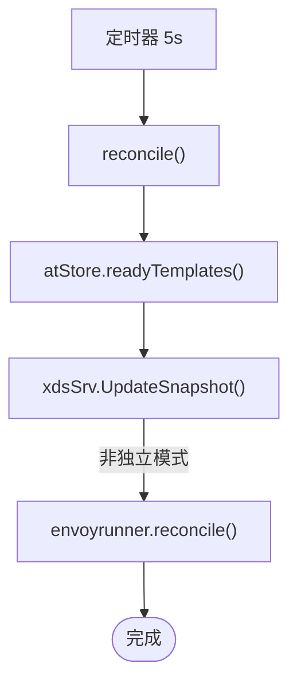
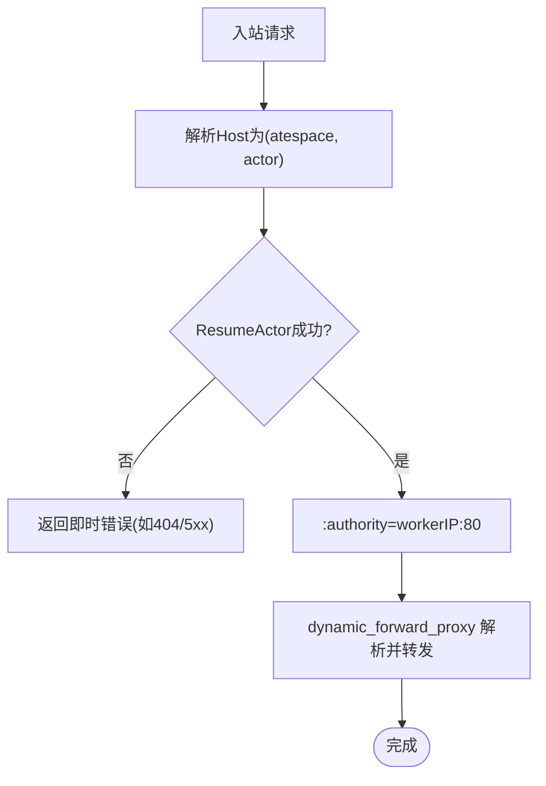
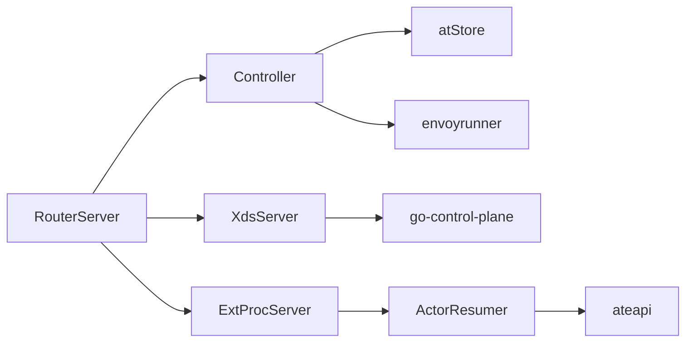

# Envoy代理路由

<cite>
**本文引用的文件**
- [router.go](file://cmd/atenet/internal/router/router.go)
- [envoyrunner.go](file://cmd/atenet/internal/router/envoyrunner.go)
- [xds.go](file://cmd/atenet/internal/router/xds.go)
- [extproc.go](file://cmd/atenet/internal/router/extproc.go)
- [extproc_in.go](file://cmd/atenet/internal/router/extproc_in.go)
- [extproc_out.go](file://cmd/atenet/internal/router/extproc_out.go)
- [controller.go](file://cmd/atenet/internal/router/controller.go)
- [resumer.go](file://cmd/atenet/internal/router/resumer.go)
- [atstore.go](file://cmd/atenet/internal/router/atstore.go)
- [metrics.go](file://cmd/atenet/internal/router/metrics.go)
- [status.go](file://cmd/atenet/internal/router/status.go)
- [architecture.md](file://docs/architecture.md)
</cite>

## 目录
1. [简介](#简介)
2. [项目结构](#项目结构)
3. [核心组件](#核心组件)
4. [架构总览](#架构总览)
5. [详细组件分析](#详细组件分析)
6. [依赖关系分析](#依赖关系分析)
7. [性能与调优](#性能与调优)
8. [故障排查指南](#故障排查指南)
9. [结论](#结论)
10. [附录](#附录)

## 简介
本文件面向 Agent Substrate 的网络子系统，聚焦于 atenet 中的 Envoy 代理路由系统。内容涵盖：
- Envoy 运行器如何动态管理并编排一个或多个 Envoy 实例
- xDS（CDS、EDS、LDS）资源的生成与推送机制
- ExtProc 扩展处理器的实现路径，包括请求拦截、基于 Actor 状态的路由决策、流量改写等
- 动态路由规则的配置方式与按 Actor 状态调整策略
- 负载均衡算法与故障转移机制
- 配置示例与性能调优建议
- 监控指标与日志分析方法

## 项目结构
atenet 路由器子系统位于 cmd/atenet/internal/router 下，围绕以下关键模块组织：
- RouterServer：进程入口、服务装配、生命周期管理
- Controller：周期性协调 ActorTemplate 就绪状态、更新 xDS 快照、管理 Envoy 资源
- envoyrunner：在 Kubernetes 中创建/维护 Envoy Deployment、Service、ConfigMap
- XdsServer：实现聚合发现服务（ADS），构建并推送 CDS/RDS/LDS 等资源
- ExtProcServer：实现外部处理 gRPC 服务，接收 Envoy 的请求头事件，完成路由决策与头部改写
- resumer：对 Actor 进行安全并发去重与退避重试的唤醒流程
- metrics/status：指标与诊断页面

图表来源
- [router.go:152-315](file://cmd/atenet/internal/router/router.go#L152-L315)
- [controller.go:67-111](file://cmd/atenet/internal/router/controller.go#L67-L111)
- [envoyrunner.go:50-64](file://cmd/atenet/internal/router/envoyrunner.go#L50-L64)
- [xds.go:196-225](file://cmd/atenet/internal/router/xds.go#L196-L225)
- [extproc.go:58-78](file://cmd/atenet/internal/router/extproc.go#L58-L78)
- [resumer.go:46-104](file://cmd/atenet/internal/router/resumer.go#L46-L104)

章节来源
- [router.go:152-315](file://cmd/atenet/internal/router/router.go#L152-L315)
- [controller.go:67-111](file://cmd/atenet/internal/router/controller.go#L67-L111)
- [envoyrunner.go:50-64](file://cmd/atenet/internal/router/envoyrunner.go#L50-L64)
- [xds.go:196-225](file://cmd/atenet/internal/router/xds.go#L196-L225)
- [extproc.go:58-78](file://cmd/atenet/internal/router/extproc.go#L58-L78)
- [resumer.go:46-104](file://cmd/atenet/internal/router/resumer.go#L46-L104)

## 核心组件
- RouterServer：负责初始化追踪与指标、连接 ateapi、启动 xDS 与 ExtProc 服务、健康检查与状态页。
- Controller：定时拉取 ActorTemplate 列表，调用 XdsServer.UpdateSnapshot 推送新配置；在非独立模式下协调 Envoy 的 K8s 资源。
- envoyrunner：生成 Envoy bootstrap ConfigMap、Deployment、Service，确保 Envoy 以期望状态运行。
- XdsServer：构建 Cluster/Route/Listener 资源并通过 ADS 推送给 Envoy；支持 HTTP/HTTPS 监听器、动态转发代理、OpenTelemetry 追踪导出。
- ExtProcServer：处理 Envoy 的 RequestHeaders 事件，解析 Host 为 (atespace, actor)，调用 Resumer 唤醒 Actor，并将 :authority 改写为目标 Worker IP:Port。
- ActorResumer：并发去重 + 指数退避重试，保证 ResumeActor 幂等性与稳定性。
- atStore：抽象 ActorTemplate 存储，支持 K8s 或本地文件两种后端。
- metrics/status：提供路由耗时直方图与诊断页面。

章节来源
- [router.go:65-150](file://cmd/atenet/internal/router/router.go#L65-L150)
- [controller.go:26-65](file://cmd/atenet/internal/router/controller.go#L26-L65)
- [envoyrunner.go:36-64](file://cmd/atenet/internal/router/envoyrunner.go#L36-L64)
- [xds.go:71-146](file://cmd/atenet/internal/router/xds.go#L71-L146)
- [extproc.go:38-56](file://cmd/atenet/internal/router/extproc.go#L38-L56)
- [resumer.go:31-41](file://cmd/atenet/internal/router/resumer.go#L31-L41)
- [atstore.go:25-39](file://cmd/atenet/internal/router/atstore.go#L25-L39)
- [metrics.go:24-51](file://cmd/atenet/internal/router/metrics.go#L24-L51)
- [status.go:180-281](file://cmd/atenet/internal/router/status.go#L180-L281)

## 架构总览
整体采用“控制面 + 数据面”分离：
- 控制面（atenet-router）：
  - 通过 Controller 周期同步 ActorTemplate 状态，生成 xDS 快照并推送
  - 通过 envoyrunner 管理 Envoy 的 K8s 资源
  - 通过 ExtProc 响应 Envoy 的外部处理请求，驱动 Actor 唤醒与路由决策
- 数据面（Envoy）：
  - 作为 HTTP 网关，使用 ext_proc 过滤器将请求头交给控制面处理
  - 使用 dynamic_forward_proxy 根据 :authority 动态解析并转发到目标 Worker
  - 通过 ADS 从 atenet-router 获取 CDS/RDS/LDS 配置

图表来源
- [extproc.go:80-128](file://cmd/atenet/internal/router/extproc.go#L80-L128)
- [extproc_in.go:59-72](file://cmd/atenet/internal/router/extproc_in.go#L59-L72)
- [extproc_out.go:35-44](file://cmd/atenet/internal/router/extproc_out.go#L35-L44)
- [resumer.go:46-104](file://cmd/atenet/internal/router/resumer.go#L46-L104)
- [xds.go:357-384](file://cmd/atenet/internal/router/xds.go#L357-L384)
- [xds.go:503-531](file://cmd/atenet/internal/router/xds.go#L503-L531)

## 详细组件分析

### Envoy 运行器（envoyrunner）
- 职责：
  - 生成 Envoy bootstrap 配置（指向 atenet-router 的 xDS 端口）
  - 创建/更新 Envoy Deployment、Service、ConfigMap
  - 暴露 HTTP 与 Admin 端口，挂载配置卷
- 关键点：
  - 使用 ConfigMap 注入 envoy.yaml，其中启用 ADS 并指向 atenet-router 服务
  - 非独立模式下由 Controller 定期 reconcile，保持期望态

图表来源
- [envoyrunner.go:50-64](file://cmd/atenet/internal/router/envoyrunner.go#L50-L64)
- [envoyrunner.go:66-137](file://cmd/atenet/internal/router/envoyrunner.go#L66-L137)
- [envoyrunner.go:139-222](file://cmd/atenet/internal/router/envoyrunner.go#L139-L222)
- [envoyrunner.go:224-258](file://cmd/atenet/internal/router/envoyrunner.go#L224-L258)

章节来源
- [envoyrunner.go:36-64](file://cmd/atenet/internal/router/envoyrunner.go#L36-L64)
- [envoyrunner.go:66-137](file://cmd/atenet/internal/router/envoyrunner.go#L66-L137)
- [envoyrunner.go:139-222](file://cmd/atenet/internal/router/envoyrunner.go#L139-L222)
- [envoyrunner.go:224-258](file://cmd/atenet/internal/router/envoyrunner.go#L224-L258)

### xDS 服务器（XdsServer）
- 职责：
  - 构建并推送 CDS/RDS/LDS 快照
  - 配置 HTTP/HTTPS 监听器、HCM 过滤器链（ext_proc、dynamic_forward_proxy、router）
  - 可选开启 OpenTelemetry 追踪导出
- 关键资源：
  - Cluster：指向 ExtProc 的本地集群、动态转发代理集群、可选 OTLP Collector 集群
  - Route：将所有请求匹配到 dynamic_forward_proxy_cluster
  - Listener：HTTP/HTTPS 两个监听器，绑定相应端口与 TLS 上下文

图表来源
- [xds.go:71-146](file://cmd/atenet/internal/router/xds.go#L71-L146)
- [xds.go:148-194](file://cmd/atenet/internal/router/xds.go#L148-L194)
- [xds.go:227-272](file://cmd/atenet/internal/router/xds.go#L227-L272)
- [xds.go:336-355](file://cmd/atenet/internal/router/xds.go#L336-L355)
- [xds.go:357-384](file://cmd/atenet/internal/router/xds.go#L357-L384)
- [xds.go:386-466](file://cmd/atenet/internal/router/xds.go#L386-L466)
- [xds.go:478-501](file://cmd/atenet/internal/router/xds.go#L478-L501)
- [xds.go:503-531](file://cmd/atenet/internal/router/xds.go#L503-L531)
- [xds.go:533-576](file://cmd/atenet/internal/router/xds.go#L533-L576)
- [xds.go:578-606](file://cmd/atenet/internal/router/xds.go#L578-L606)

章节来源
- [xds.go:71-146](file://cmd/atenet/internal/router/xds.go#L71-L146)
- [xds.go:148-194](file://cmd/atenet/internal/router/xds.go#L148-L194)
- [xds.go:227-272](file://cmd/atenet/internal/router/xds.go#L227-L272)
- [xds.go:336-355](file://cmd/atenet/internal/router/xds.go#L336-L355)
- [xds.go:357-384](file://cmd/atenet/internal/router/xds.go#L357-L384)
- [xds.go:386-466](file://cmd/atenet/internal/router/xds.go#L386-L466)
- [xds.go:478-501](file://cmd/atenet/internal/router/xds.go#L478-L501)
- [xds.go:503-531](file://cmd/atenet/internal/router/xds.go#L503-L531)
- [xds.go:533-576](file://cmd/atenet/internal/router/xds.go#L533-L576)
- [xds.go:578-606](file://cmd/atenet/internal/router/xds.go#L578-L606)

### ExtProc 扩展处理器
- 职责：
  - 接收 Envoy 的 RequestHeaders 事件
  - 解析 Host 为 (atespace, actor)，调用 Resumer 唤醒 Actor
  - 将 :authority 改写为目标 Worker IP:80，交由 dynamic_forward_proxy 转发
- 错误处理：
  - 非法 Host 直接返回 404
  - 其他错误映射为即时响应，附带文本体与 content-type
- 可观测性：
  - 记录路由耗时直方图，标签包含模板命名空间/名称与结果分类
  - 提取上游 traceparent，建立跨层链路

图表来源
- [extproc.go:80-128](file://cmd/atenet/internal/router/extproc.go#L80-L128)
- [extproc_in.go:59-72](file://cmd/atenet/internal/router/extproc_in.go#L59-L72)
- [extproc_out.go:35-44](file://cmd/atenet/internal/router/extproc_out.go#L35-L44)
- [resumer.go:46-104](file://cmd/atenet/internal/router/resumer.go#L46-L104)

章节来源
- [extproc.go:38-56](file://cmd/atenet/internal/router/extproc.go#L38-L56)
- [extproc.go:80-128](file://cmd/atenet/internal/router/extproc.go#L80-L128)
- [extproc_in.go:25-57](file://cmd/atenet/internal/router/extproc_in.go#L25-L57)
- [extproc_in.go:59-72](file://cmd/atenet/internal/router/extproc_in.go#L59-L72)
- [extproc_out.go:23-68](file://cmd/atenet/internal/router/extproc_out.go#L23-L68)
- [resumer.go:31-41](file://cmd/atenet/internal/router/resumer.go#L31-L41)
- [resumer.go:46-104](file://cmd/atenet/internal/router/resumer.go#L46-L104)

### 控制器与 ActorTemplate 同步
- Controller 每 5 秒执行一次 reconcile：
  - 读取 atStore 中 Ready 的 ActorTemplate 列表
  - 调用 XdsServer.UpdateSnapshot 推送新配置
  - 非独立模式且未使用文件模板时，调用 envoyrunner.reconcile 管理 Envoy 资源

图表来源
- [controller.go:67-111](file://cmd/atenet/internal/router/controller.go#L67-L111)
- [atstore.go:41-55](file://cmd/atenet/internal/router/atstore.go#L41-L55)
- [xds.go:148-194](file://cmd/atenet/internal/router/xds.go#L148-L194)
- [envoyrunner.go:50-64](file://cmd/atenet/internal/router/envoyrunner.go#L50-L64)

章节来源
- [controller.go:26-65](file://cmd/atenet/internal/router/controller.go#L26-L65)
- [controller.go:67-111](file://cmd/atenet/internal/router/controller.go#L67-L111)
- [atstore.go:25-55](file://cmd/atenet/internal/router/atstore.go#L25-L55)

### 动态路由与 Actor 状态联动
- 路由策略：
  - 所有入站请求统一匹配前缀 /，转发至 dynamic_forward_proxy_cluster
  - ExtProc 根据 Host 解析出 (atespace, actor)，调用 Resumer 确保 Actor 处于运行态
  - 成功后将 :authority 改写为 Actor Worker Pod IP:80，由 dynamic_forward_proxy 解析并转发
- 状态联动：
  - Resumer 内部对同一 Actor 的并发请求去重，并使用指数退避重试，避免风暴
  - 若 Actor 不可用或地址无效，ExtProc 返回即时错误响应

图表来源
- [extproc.go:130-188](file://cmd/atenet/internal/router/extproc.go#L130-L188)
- [extproc_in.go:59-72](file://cmd/atenet/internal/router/extproc_in.go#L59-L72)
- [extproc_out.go:35-44](file://cmd/atenet/internal/router/extproc_out.go#L35-L44)
- [resumer.go:46-104](file://cmd/atenet/internal/router/resumer.go#L46-L104)

章节来源
- [extproc.go:130-188](file://cmd/atenet/internal/router/extproc.go#L130-L188)
- [extproc_in.go:59-72](file://cmd/atenet/internal/router/extproc_in.go#L59-L72)
- [extproc_out.go:35-44](file://cmd/atenet/internal/router/extproc_out.go#L35-L44)
- [resumer.go:46-104](file://cmd/atenet/internal/router/resumer.go#L46-L104)

## 依赖关系分析
- RouterServer 依赖：
  - ateapi 控制平面用于 Actor 唤醒
  - K8s API 用于查询 ActorTemplate 与管理 Envoy 资源
  - xDS 与 ExtProc 服务用于数据面配置与处理
- Controller 依赖：
  - atStore（K8s 或文件）
  - XdsServer 与 envoyrunner
- XdsServer 依赖：
  - go-control-plane 库构建与推送 CDS/RDS/LDS
  - 可选 OTLP Collector 集群用于追踪
- ExtProcServer 依赖：
  - ActorResumer 与 ateapi
  - 指标与追踪 SDK

图表来源
- [router.go:152-315](file://cmd/atenet/internal/router/router.go#L152-L315)
- [controller.go:67-111](file://cmd/atenet/internal/router/controller.go#L67-L111)
- [xds.go:196-225](file://cmd/atenet/internal/router/xds.go#L196-L225)
- [extproc.go:58-78](file://cmd/atenet/internal/router/extproc.go#L58-L78)
- [resumer.go:46-104](file://cmd/atenet/internal/router/resumer.go#L46-L104)

章节来源
- [router.go:152-315](file://cmd/atenet/internal/router/router.go#L152-L315)
- [controller.go:67-111](file://cmd/atenet/internal/router/controller.go#L67-L111)
- [xds.go:196-225](file://cmd/atenet/internal/router/xds.go#L196-L225)
- [extproc.go:58-78](file://cmd/atenet/internal/router/extproc.go#L58-L78)
- [resumer.go:46-104](file://cmd/atenet/internal/router/resumer.go#L46-L104)

## 性能与调优
- 超时与重试
  - ExtProc 消息超时设置为 5 秒，避免默认 200ms 导致的频繁失败
  - Resumer 使用指数退避（步数、因子、抖动）与单飞去重，降低热点 Actor 的唤醒风暴
- 负载均衡
  - Envoy 侧默认 ROUND_ROBIN；ExtProc 集群为单端点，实际负载取决于下游 Worker 数量与调度
- 追踪采样
  - Envoy 侧随机采样 100%，但上游服务使用 ParentBased(NeverSample)，仅当携带采样父链路时才上报，避免噪声
- 指标
  - 自定义直方图 atenet.router.route.duration，桶边界覆盖毫秒到数十秒，便于观察首包延迟
- 建议
  - 合理设置 ExtProc 与 Resumer 的超时/退避参数，平衡激活延迟与稳定性
  - 在生产环境启用 HTTPS 监听器并提供证书路径，避免自签证书
  - 结合 Prometheus/Grafana 监控 ExtProc 错误率与路由耗时 P95/P99

章节来源
- [xds.go:386-466](file://cmd/atenet/internal/router/xds.go#L386-L466)
- [resumer.go:61-86](file://cmd/atenet/internal/router/resumer.go#L61-L86)
- [metrics.go:32-51](file://cmd/atenet/internal/router/metrics.go#L32-L51)

## 故障排查指南
- 常见问题定位
  - Host 格式不正确：ExtProc 会立即返回 404，可在状态页查看最近请求明细
  - Actor 无法唤醒：Resumer 会返回具体 gRPC 错误码（如 Aborted/NotFound），ExtProc 将其映射为合适的 HTTP 状态
  - 路由失败：若 Actor 返回的 IP 不合法，ExtProc 返回 500
- 诊断工具
  - 状态页 /statusz：展示构建信息、端口、最近请求、健康报告与模板列表
  - 健康检查：周期性检查 Envoy 与 K8s API 可达性，统计成功/失败次数
  - 指标：Prometheus 抓取 atenet.router.route.duration 与标准运行时指标
- 日志
  - slog JSON 输出，级别可通过 --log-level 控制
  - Envoy 组件日志级别在 Deployment Command 中指定（upstream/router/ext_proc）

章节来源
- [extproc.go:80-128](file://cmd/atenet/internal/router/extproc.go#L80-L128)
- [extproc_out.go:46-68](file://cmd/atenet/internal/router/extproc_out.go#L46-L68)
- [status.go:180-281](file://cmd/atenet/internal/router/status.go#L180-L281)
- [health.go:91-129](file://cmd/atenet/internal/router/health.go#L91-L129)
- [envoyrunner.go:168-174](file://cmd/atenet/internal/router/envoyrunner.go#L168-L174)

## 结论
该路由系统通过“控制面驱动的数据面”实现了基于 Actor 状态的动态路由与自动唤醒。Envoy 作为高性能网关，配合 ExtProc 与 xDS 实现低延迟、可扩展的流量治理。通过合理的超时、退避与指标体系，系统在可用性、可观测性与性能之间取得良好平衡。

## 附录

### xDS 资源类型说明
- LDS（Listener Discovery Service）
  - 定义 HTTP/HTTPS 监听器与过滤器链（ext_proc、dynamic_forward_proxy、router）
- RDS（Route Discovery Service）
  - 定义虚拟主机与路由规则，当前将所有请求匹配到 dynamic_forward_proxy_cluster
- CDS（Cluster Discovery Service）
  - 定义 ExtProc 集群、动态转发代理集群与可选 OTLP Collector 集群
- EDS（Endpoint Discovery Service）
  - 当前未使用 EDS；ExtProc 集群为静态端点，Worker 地址由 ExtProc 动态决定

章节来源
- [xds.go:357-384](file://cmd/atenet/internal/router/xds.go#L357-L384)
- [xds.go:227-272](file://cmd/atenet/internal/router/xds.go#L227-L272)
- [xds.go:336-355](file://cmd/atenet/internal/router/xds.go#L336-L355)
- [xds.go:503-531](file://cmd/atenet/internal/router/xds.go#L503-L531)

### 配置示例要点
- Envoy bootstrap（由 ConfigMap 注入）
  - 启用 ADS，指向 atenet-router 服务的 xDS 端口
  - 静态声明 xds_cluster 指向 atenet-router:xdsPort
- Envoy 部署（Deployment）
  - 容器镜像、命令、端口（http/admin）、挂载 ConfigMap 到 /etc/envoy
- 监听器与过滤器链
  - HTTP/HTTPS 监听器，启用 ext_proc、dynamic_forward_proxy、router
  - 可选 OTLP 追踪导出

章节来源
- [envoyrunner.go:66-137](file://cmd/atenet/internal/router/envoyrunner.go#L66-L137)
- [envoyrunner.go:139-222](file://cmd/atenet/internal/router/envoyrunner.go#L139-L222)
- [xds.go:386-466](file://cmd/atenet/internal/router/xds.go#L386-L466)
- [xds.go:503-531](file://cmd/atenet/internal/router/xds.go#L503-L531)
- [xds.go:533-576](file://cmd/atenet/internal/router/xds.go#L533-L576)

### 监控指标与日志方法
- 指标
  - atenet.router.route.duration：ExtProc 处理到目标地址解析完成的耗时
  - 标准运行时指标（Go runtime、gRPC、HTTP）
- 日志
  - slog JSON 输出，级别可调
  - Envoy 组件日志级别在 Deployment 中配置
- 可视化
  - 状态页 /statusz 提供最近请求与健康报告
  - 架构图参考文档

章节来源
- [metrics.go:24-51](file://cmd/atenet/internal/router/metrics.go#L24-L51)
- [status.go:180-281](file://cmd/atenet/internal/router/status.go#L180-L281)
- [architecture.md:343-351](file://docs/architecture.md#L343-L351)
